# 🌍 AWS Global Infrastructure

The big picture of AWS Global Infrastructure:

```
AWS Global Infrastructure
 ├── Regions
 ├── Availability Zones (AZs)
 ├── Edge Locations (CloudFront / Global Accelerator)
 └── Regional vs. Global Services
```

---

## 1. Region

A **Region** is a separate geographic area containing multiple isolated Availability Zones.

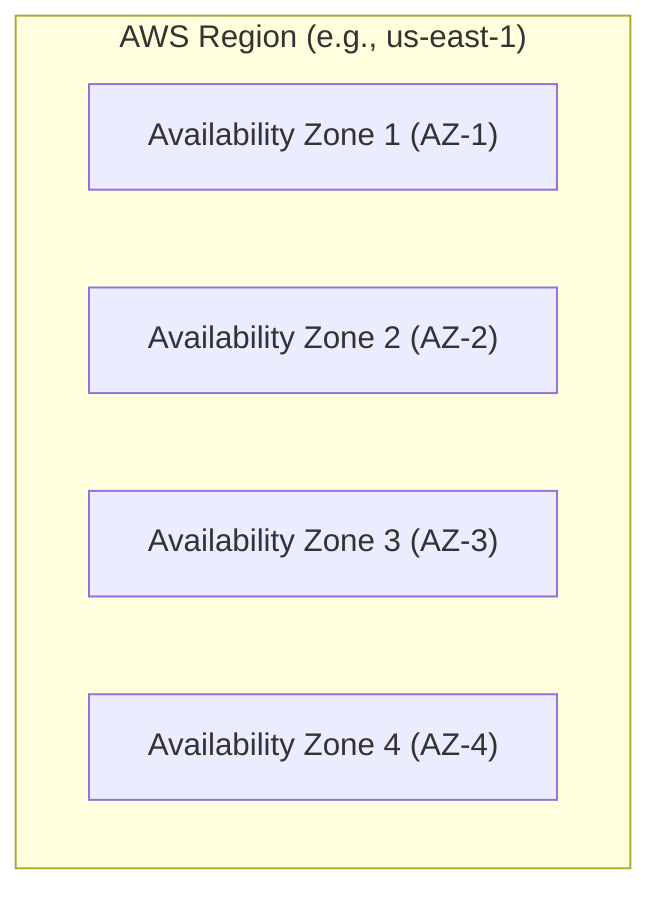

### Exam Thinking

Choose a **Region** based on:

| Requirement | Decision Factor |
|---|---|
| **Lowest Latency** | Region closest to end users |
| **Data Residency & Compliance** | Region mandated by local laws/regulations |
| **Disaster Recovery (DR)** | Separate secondary Region |
| **High Availability (HA)** | Multiple AZs within a single Region |
| **Lower Cost** | Compare regional service pricing |
| **Service Availability** | Verify the required AWS service exists in that Region |

### Important Trade-off

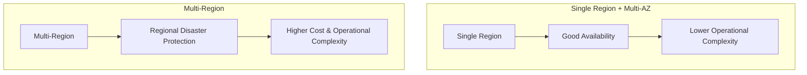

> [!IMPORTANT]
> **Multi-Region = Stronger disaster isolation, but significantly higher cost and operational complexity.**

### Exam Shortcuts

> [!TIP]
> - If the question says: *"Protect against failure of an entire AWS Region"* ➔ **Multi-Region**.
> - If it says: *"Protect against failure of a data center or Availability Zone"* ➔ **Multi-AZ**.

---

## 2. Availability Zone (AZ)

An **AZ** consists of one or more discrete, physically isolated data centers within a Region with redundant power, networking, and connectivity.

### Typical Multi-AZ Architecture

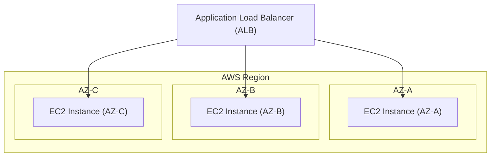

### Exam Thinking

- If the requirement is **"High availability with minimum operational overhead"**, use a **managed multi-AZ service** (e.g., ALB + EC2 Auto Scaling, RDS Multi-AZ) rather than manually managing cross-AZ failover yourself.

> [!NOTE]
> **Multi-AZ is the default High Availability (HA) answer inside a single Region.**

---

## 3. Edge Locations

Edge Locations are AWS sites running services like **CloudFront** and **AWS Global Accelerator** to deliver content to users with low latency.

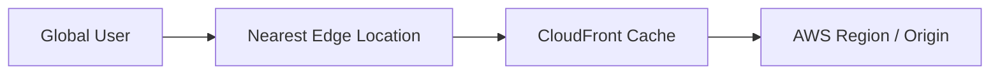

### Why Use Edge Locations?

**Latency Optimization.** If your users are globally distributed (e.g., India) but your backend origin is in `us-east-1` (US):

- **Without CloudFront:** User ➔ Public Internet ➔ US Region *(High latency)*.
- **With CloudFront:** User ➔ Nearby Edge Location ➔ Cached Content *(Low latency)*.

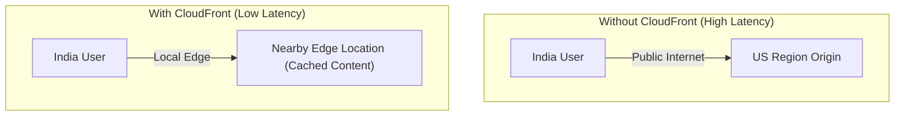

### Exam Clue

> [!TIP]
> If a question mentions *"Reduce latency for global users"*, think **CloudFront / Edge Locations**, not automatically *"Deploy full application stacks in every Region."*

---

## 4. Region vs. AZ vs. Edge — Quick Decision Matrix

| Requirement                                                                         | Best Solution                                                                   |
| ----------------------------------------------------------------------------------- | ------------------------------------------------------------------------------- |
| **Geographic isolation & compliance**                                               | Region                                                                          |
| **High availability within a region**                                               | Multiple AZs                                                                    |
| **Disaster recovery from regional failure**                                         | Multiple Regions                                                                |
| **Reduce <mark style="background:#fff88f">global content</mark> delivery latency**  | <mark style="background:#fff88f">CloudFront / Edge Locations</mark>             |
| **Data residency (keep data in country)**                                           | Specific AWS Region                                                             |
| **Reduce network latency for <mark style="background:#fff88f">dynamic apps</mark>** | <mark style="background:#fff88f">Global Accelerator </mark>/ Regional Endpoints |
| **Lowest operational overhead**                                                     | Managed AWS Services                                                            |

---

## 5. Cost Thinking

Don't automatically assume *"More availability = Better answer."*

Always ask: **What is the MINIMUM architecture that satisfies the requirement?**

### Example Scenario
- **Requirement:** Application must survive an AZ failure.
- **Wrong Choice:** 3 AWS Regions (Over-engineered, expensive).
- **Correct Choice:** 1 Region with 2 Availability Zones (Meets requirement cleanly).

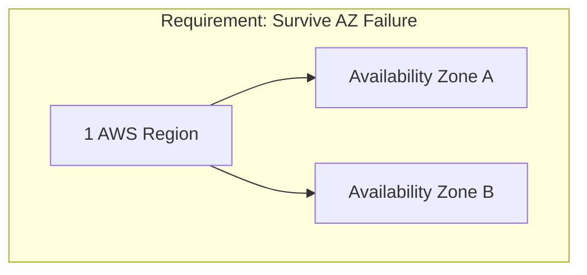

### Cost vs. Resilience Trade-Off

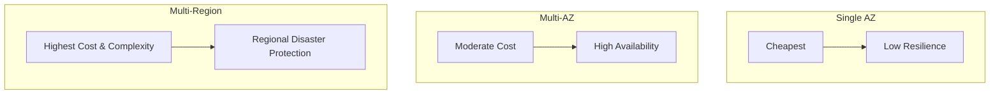

> [!WARNING]
> **Exam Rule:** Never pay for resilience or complexity that the business requirement does not explicitly ask for.

---

## 6. Least Operational Overhead

This is one of the **most heavily tested AWS concepts**. If two solutions achieve the same goal, AWS favors the managed service requiring the **least operational effort**.

### Comparison

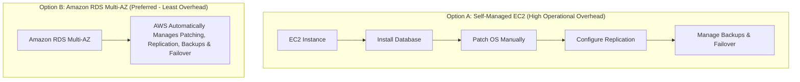

---

## 7. "Minimum Over-Task" Principle

Ask yourself: **What is the simplest solution that completely satisfies the requirement?**

### Example Scenario
- **Requirement:** Store static website assets and serve them globally with low latency.
- **Over-engineered:** EC2 + Web Server + Auto Scaling + ALB + Multi-AZ.
- **Ideal (AWS Preferred):** **S3 Static Website + CloudFront CDN**.

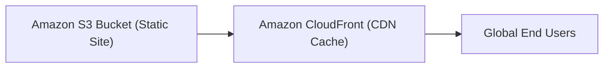

---

## 8. Automation vs. Manual Operations

> [!IMPORTANT]
> **Always prefer automation over manual operational effort.**

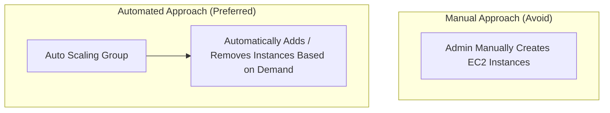

| Manual Approach (Avoid in Exam) | Automated / Managed Approach (Preferred) |
|---|---|
| Manually provision EC2 instances | Auto Scaling Group |
| Manually configure infrastructure | AWS CloudFormation / Infrastructure as Code |
| Manually deploy applications | AWS CodePipeline / CodeDeploy |
| Manually perform backups | AWS Backup / Native Automated Backups |
| Manually distribute content | Amazon CloudFront |
| Manually manage DNS failover | Amazon Route 53 Health Checks & Failover |
| Manually manage DB failover | Amazon RDS Multi-AZ |

---

## 9. Global Infrastructure + Operational Overhead

When a question states:
> *"A company has users worldwide and wants to reduce latency while minimizing operational overhead."*

Follow this evaluation flow:

1. **Is the content static?** ➔ **Amazon S3 + CloudFront**.
2. **Is it dynamic application traffic?** ➔ **Route 53 + AWS Global Accelerator + Regional Application**.
3. **Do they require active-active global database/app architecture?** ➔ **Multi-Region** (e.g., Aurora Global Database, DynamoDB Global Tables).

---

## 10. Global Accelerator vs. CloudFront — Exam Favorite

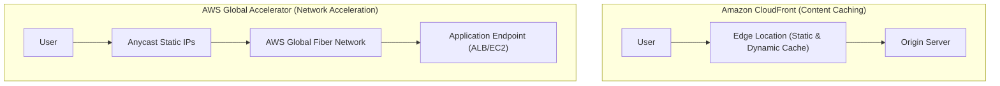

| Feature | Amazon CloudFront | AWS Global Accelerator |
|---|---|---|
| **Primary Purpose** | Content Delivery & Caching | Network performance acceleration |
| **Traffic Type** | HTTP/HTTPS static & dynamic content | TCP, UDP, HTTP, HTTPS non-cached traffic |
| **Key Mechanism** | Edge caching locations | Anycast static IPs + AWS Global Fiber Network |
| **Best For** | Images, videos, web pages, APIs | Gaming, IoT, VoIP, multi-region failover |

> [!NOTE]
> - **CloudFront** ➔ Cache content closer to users.
> - **Global Accelerator** ➔ <mark style="background:#fff88f">Accelerate network/application traffic over the AWS global backbone.</mark>

---

## 11. Multi-AZ vs. Multi-Region

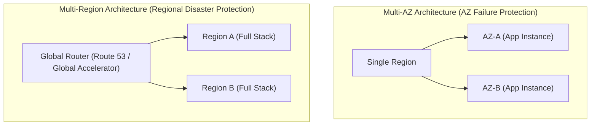

| Dimension | Multi-AZ | Multi-Region |
|---|---|---|
| **Failure Protection** | Data Center / AZ outage | Entire Region disaster / outage |
| **Latency** | Single-digit ms (Synchronous) | Higher cross-region latency (Asynchronous) |
| **Complexity** | Low to Moderate | High (Data replication, DNS routing) |
| **Cost** | Baseline HA cost | Multiplied infrastructure & data transfer costs |

---

## 12. Availability vs. Cost vs. Complexity

Think of cloud architecture as a balance:

```
          [ High Availability ]
                 ▲
                / \
               /   \
              /     \
  [ Cost ] ◄─┴───────┴─► [ Operational Complexity ]
```

Increasing availability naturally increases **Cost** and **Complexity**. Choose the minimum architecture level requested by the business requirement.

---

## 13. AWS Shared Responsibility Connection

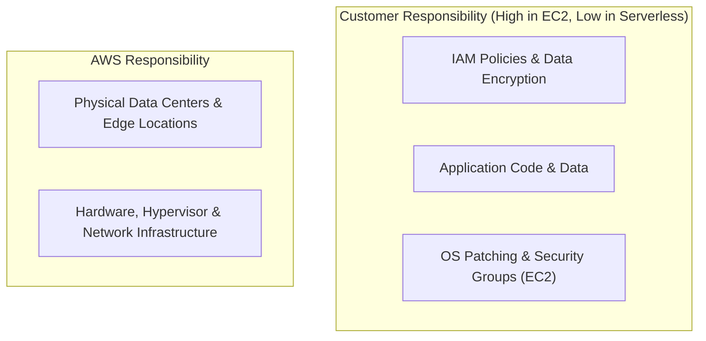

- **EC2:** High Customer Responsibility (OS, patching, firewall, scaling).
- **RDS:** Medium Customer Responsibility (DB schema, IAM, queries).
- **Lambda / S3:** Low Customer Responsibility (Fully managed by AWS).

---

## 14. The Exam Decision Tree

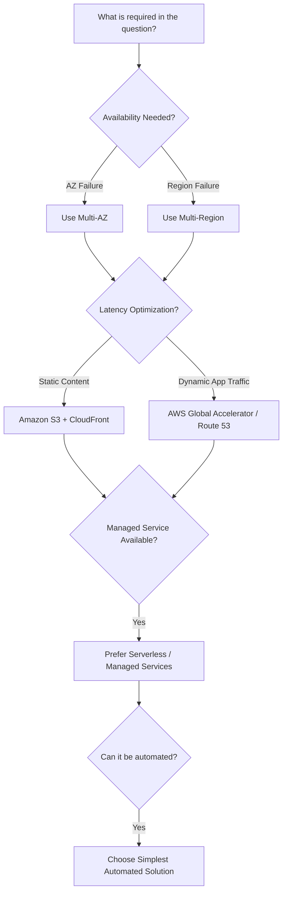

---

## 15. The 7 Rules to Memorize for the Exam

1. **AZ failure** ➔ Choose **Multi-AZ**.
2. **Region failure** ➔ Choose **Multi-Region**.
3. **Global static content** ➔ Choose **CloudFront**.
4. **Global network/application acceleration** ➔ Choose **AWS Global Accelerator**.
5. **Minimum operational overhead** ➔ Choose **Managed / Serverless services**.
6. **Manual task in options** ➔ Replace with **AWS Automation (Auto Scaling, CloudFormation, etc.)**.
7. **Don't over-engineer** ➔ Pick the minimum architecture that satisfies all stated requirements.

> [!SUMMARY]
> **Managed Service ➔ Serverless ➔ Automation ➔ Minimum Architecture satisfying the requirements.**