# 🌐 AWS Networking — Exam-Oriented Guide

Think of AWS networking as answering **6 core questions**:

1. **Who needs to communicate?**
2. **Where are they located?**
3. **Is the connection private or public?**
4. **How much performance/reliability is required?**
5. **Do networks need to communicate transitively?**
6. **Who should manage the networking infrastructure?**

---

## 1. Amazon VPC — Your AWS Network

A **Virtual Private Cloud (VPC)** is your logically isolated network in AWS.

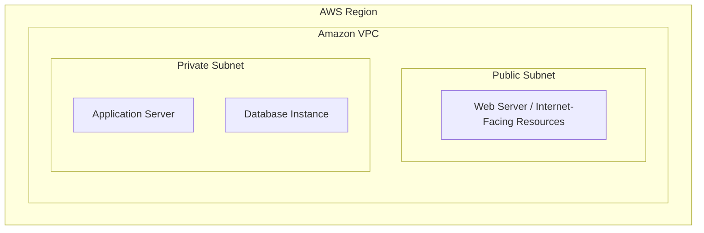

### Exam Thinking

> [!TIP]
> - *"Deploy resources in an isolated network"* ➔ **Amazon VPC**.
> - *"Internet-facing resource"* ➔ **Public Subnet + Route to Internet Gateway**.
> - *"Resource should not be directly reachable from the Internet"* ➔ **Private Subnet**.

---

## 2. Public vs. Private Subnets

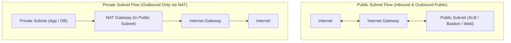

### Exam Shortcuts

- **Public Subnet:** Route table contains an explicit route (`0.0.0.0/0`) to an **Internet Gateway**.
- **Private Subnet:** No direct route to an Internet Gateway. Uses a **NAT Gateway** for outbound-only Internet connectivity.

---

## 3. Internet Gateway vs. NAT Gateway

| Service | Primary Function | Traffic Direction | Location |
|---|---|---|---|
| **Internet Gateway (IGW)** | Provides public IP routing for VPC | Inbound & Outbound | VPC boundary |
| **NAT Gateway** | Allows private instances to fetch updates/patches | Outbound Initiated Only | Public Subnet |

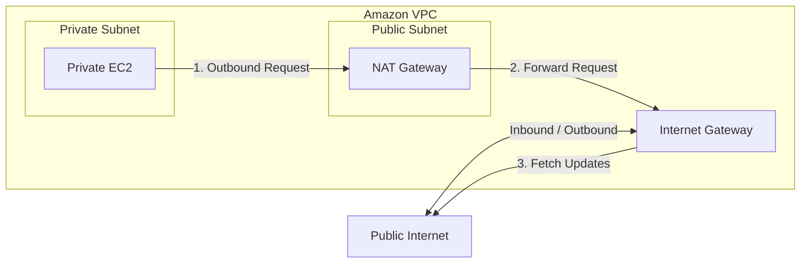

> [!KEY TAKEAWAY]
> **NAT Gateway = Private resources initiating outbound connections to the Internet. The Internet CANNOT initiate inbound connections to private instances.**

---

## 4. Security Groups vs. Network ACLs

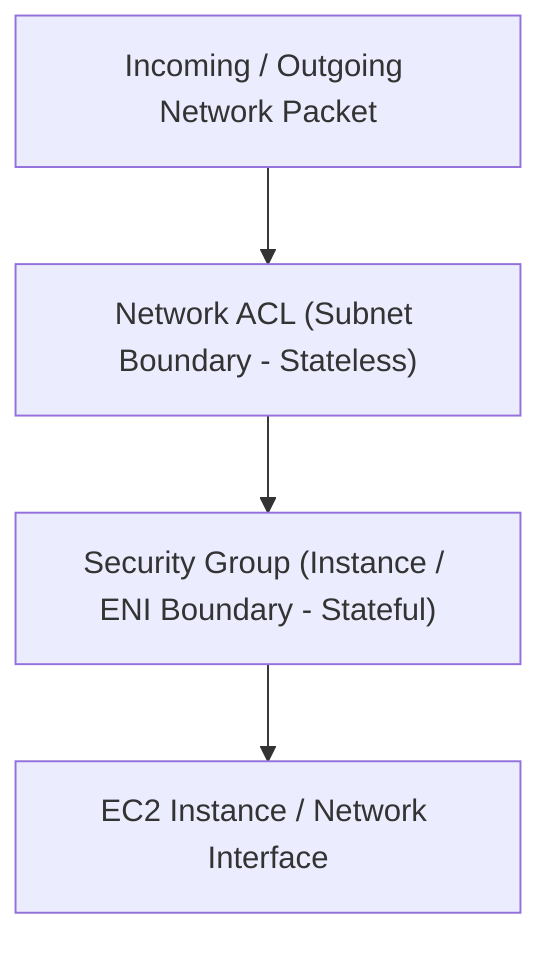

| Dimension | Security Group | Network ACL (NACL) |
|---|---|---|
| **Scope** | ENI / Instance Level | Subnet Level |
| **State** | **Stateful** (Return traffic automatically allowed) | **Stateless** (Must explicitly allow inbound & outbound) |
| **Rule Types** | **ALLOW rules only** | **ALLOW and DENY rules** |
| **Evaluation** | Evaluates all rules before deciding | Evaluates rules sequentially by rule number |

> [!TIP]
> - *"Block a specific malicious IP address"* ➔ **Network ACL** (Security Groups don't support DENY rules).
> - *"Allow HTTP traffic to an EC2 instance"* ➔ **Security Group**.

---

## 5. VPC Peering

VPC Peering provides direct, encrypted private IPv4/IPv6 routing between two VPCs using AWS backbone infrastructure.

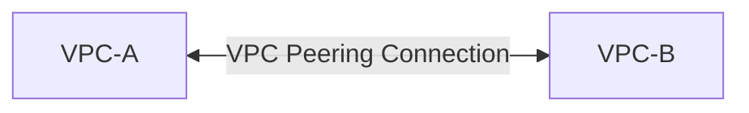

### Critical Exam Rule: Peering is Non-Transitive

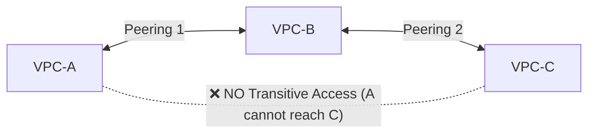

> [!WARNING]
> VPC Peering **does NOT support transitive routing**. If VPC-A is peered with VPC-B, and VPC-B is peered with VPC-C, **VPC-A CANNOT communicate with VPC-C** through VPC-B. You must explicitly peer A with C, or use AWS Transit Gateway.

---

## 6. AWS Transit Gateway & Transitive Routing

**AWS Transit Gateway** acts as a centralized cloud router connecting VPCs, AWS accounts, and on-premises networks.

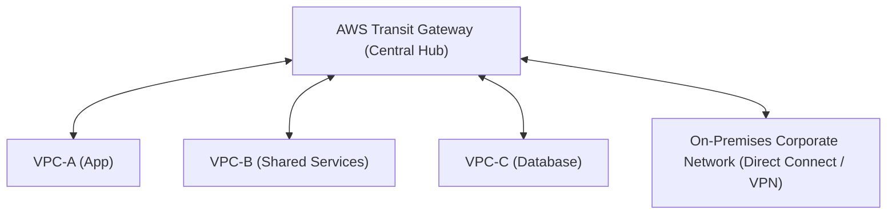

### Exam Clues

> [!TIP]
> - *"Connect dozens/hundreds of VPCs"* ➔ **Transit Gateway**.
> - *"Requires transitive routing between VPCs"* ➔ **Transit Gateway**.
> - *"Avoid complex VPC peering mesh topology"* ➔ **Transit Gateway**.

---

## 7. VPC Peering vs. Transit Gateway

| Requirement | Best Choice |
|---|---|
| **Connect two VPCs point-to-point** | VPC Peering *(Cheaper & simpler)* |
| **Connect 10+ VPCs with central routing** | Transit Gateway |
| **Transitive routing across multiple VPCs** | Transit Gateway |
| **Centralized security inspection / hub-and-spoke** | Transit Gateway |

---

## 8. AWS Site-to-Site VPN

Connects an on-premises network to your VPC over the public Internet using IPsec VPN tunnels.

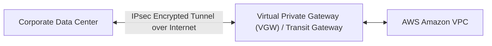

### Exam Clues
- Quick to set up
- Encrypted IPsec tunnel over the public Internet
- Cost-effective hybrid connectivity option

---

## 9. VPN vs. AWS Direct Connect

| Dimension | Site-to-Site VPN | AWS Direct Connect (DX) |
|---|---|---|
| **Connection Path** | Public Internet (IPsec Encrypted) | Dedicated Private Physical Fiber Link |
| **Performance** | Internet-dependent (Variable latency) | Dedicated & Consistent (1 Gbps / 10 Gbps / 100 Gbps) |
| **Deployment Time** | Minutes / Hours | Weeks / Months |
| **Cost** | Low upfront cost | Higher ongoing dedicated circuit cost |
| **Encryption** | Encrypted natively by default | **Not encrypted by default** (Requires VPN over DX for encryption) |

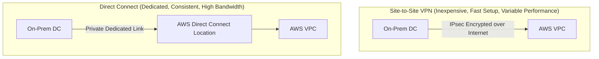

---

## 10. Direct Connect Architectures & High Availability

For production environments requiring high availability and encrypted dedicated links:

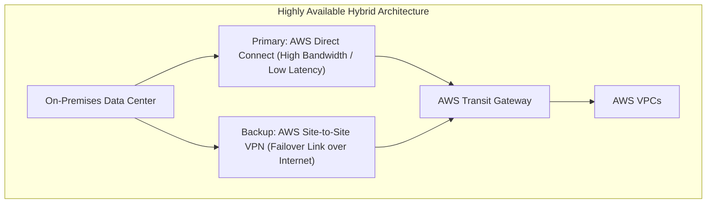

---

## 11. Amazon Route 53 & Routing Policies

Amazon Route 53 is a highly available and scalable Cloud DNS web service.

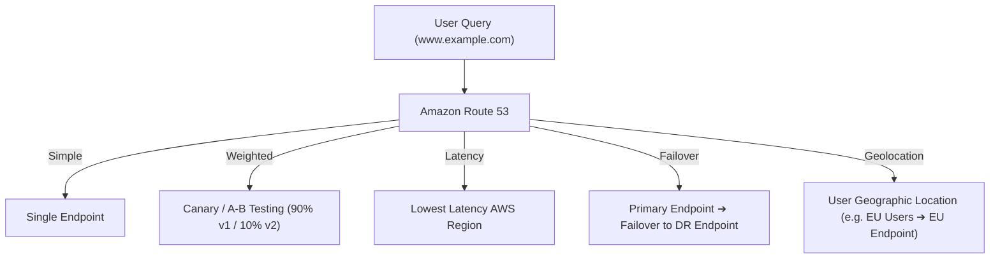

| Routing Policy | Use Case |
|---|---|
| **Simple** | Standard 1:1 DNS lookup to a single resource |
| **Weighted** | Blue/Green deployments, Canary testing, gradual migrations |
| **Latency-Based** | Route users to the AWS Region delivering the fastest response time |
| **Failover** | Active-Passive DR setup with automated Route 53 health checks |
| **Geolocation** | Route traffic based on geographic location of the user (compliance/localization) |
| **Geoproximity** | Route traffic based on geographic location of resources and users (with bias tuning) |
| **Multi-Value Answer** | Returns up to 8 healthy records for DNS-based load balancing |

---

## 12. AWS Container Services & Decision Tree

```mermaid
flowchart TD
    Start["Do you need container orchestration?"] --> Req{"Requirement?"}
    
    Req -->|Simple Web App| AppRunner["AWS App Runner (Fully Managed, No Infra)"]
    Req -->|Kubernetes Compatibility| EKS["Amazon EKS (Managed Kubernetes)"]
    Req -->|AWS-Native Orchestration| ECS["Amazon ECS"]
    
    ECS --> Compute{"Manage EC2 Servers?"}
    Compute -->|Yes| ECSEC2["ECS on EC2 Instances"]
    Compute -->|No (Serverless)| Fargate["ECS on AWS Fargate"]
```

| Container Service | When to Choose |
|---|---|
| **AWS App Runner** | Simplest deployment for web applications & APIs directly from code or container images. |
| **Amazon ECS + Fargate** | Serverless AWS-native container execution with zero server management overhead. |
| **Amazon ECS + EC2** | AWS-native container orchestration requiring custom EC2 instance control & GPU/storage configs. |
| **Amazon EKS** | Requirements specifically mandating Kubernetes API compatibility and ecosystem tools. |

---

## 13. Load Balancer Types (ALB vs. NLB vs. GWLB)

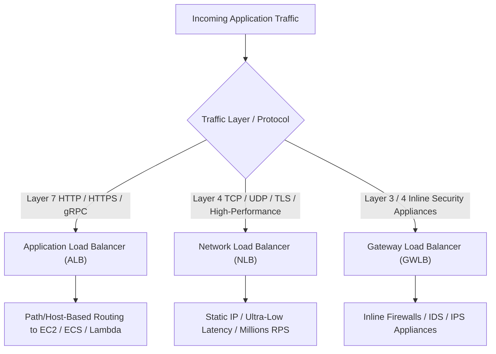

| Load Balancer | Layer | Key Characteristics | Common Use Cases |
|---|---|---|---|
| **Application Load Balancer (ALB)** | Layer 7 | Path-based routing, Host-based routing, HTTP/HTTPS/gRPC, OIDC Auth | Web apps, Microservices, REST APIs |
| **Network Load Balancer (NLB)** | Layer 4 | Ultra-low latency, millions RPS, Static/Anycast IPs, TCP/UDP/TLS | High-performance gaming, financial APIs, PrivateLink endpoints |
| **Gateway Load Balancer (GWLB)** | Layer 3/4 | Deploys and scales 3rd party virtual network appliances | Inline inspection, Next-Gen Firewalls, IDS/IPS |

---

## 14. VPC Endpoints & AWS PrivateLink

VPC Endpoints allow private subnets to connect to AWS services **without passing through an Internet Gateway, NAT Gateway, or Public IP**.

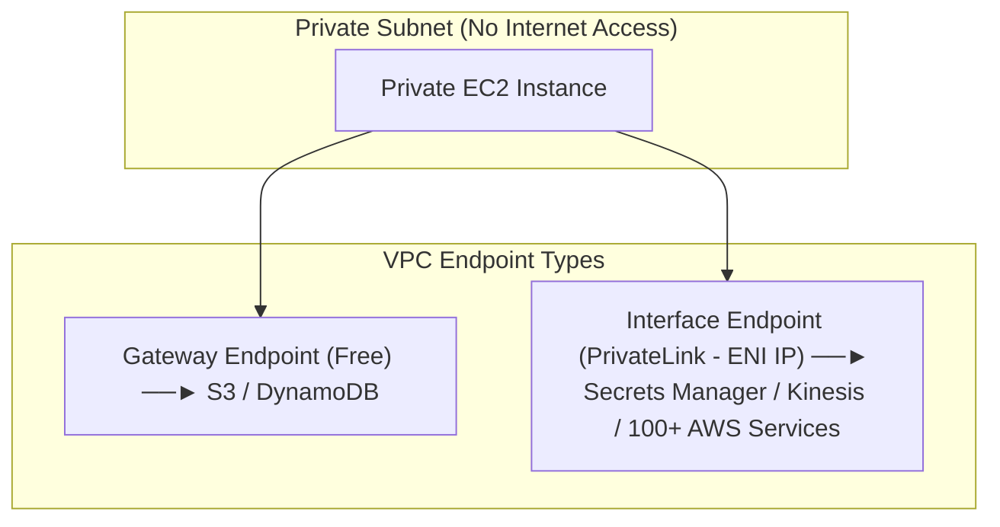

### Gateway Endpoints vs. Interface Endpoints

| Feature | Gateway Endpoint | Interface Endpoint (AWS PrivateLink) |
|---|---|---|
| **Supported Services** | **Amazon S3** and **Amazon DynamoDB** only | Most AWS Services, Partner Services, Custom Endpoint Services |
| **Implementation** | Route Table Entry | Elastic Network Interface (ENI) with Private IP in Subnet |
| **Cost** | **Free** | Hourly Endpoint Fee + Per-GB Data Charge |
| **Cross-VPC / On-Prem Access** | Cannot be accessed via VPN / Direct Connect | **Can be accessed from On-Premises via Direct Connect / VPN** |

> [!KEY TAKEAWAY]
> - Private access to **S3 or DynamoDB** inside VPC ➔ **Gateway Endpoint**.
> - Private access to **Secrets Manager / Kinesis / S3 from On-Premises** ➔ **Interface Endpoint (PrivateLink)**.

---

## 15. AWS PrivateLink for SaaS & Multi-Tenant VPCs

Exposes a service running in a Provider VPC privately to Consumer VPCs without requiring VPC Peering or Transit Gateway route table management.

```mermaid
flowchart LR
    subgraph ConsumerVPC["Consumer VPC"]
        App["App Instance"] --> ENI["VPC Interface Endpoint (ENI)"]
    end

    ENI -->|AWS PrivateLink (Private & One-Way)| NLB["Network Load Balancer"]

    subgraph ProviderVPC["Provider VPC"]
        NLB --> Service["Backend Service / App Fleet"]
    end
```

> [!TIP]
> - *"Privately expose a service to hundreds of customer VPCs with overlapping IP address ranges"* ➔ **AWS PrivateLink**.

---

## 16. The Big Networking Decision Matrix

| Requirement | Exam Choice |
|---|---|
| **Logically isolated network** | Amazon VPC |
| **Inbound/Outbound public internet routing** | Internet Gateway (IGW) |
| **Private subnet outbound internet access** | NAT Gateway |
| **Instance-level stateful firewall** | Security Group |
| **Subnet-level stateless firewall with DENY rules** | Network ACL (NACL) |
| **Connect two VPCs directly** | VPC Peering |
| **Connect many VPCs with transitive routing** | AWS Transit Gateway |
| **Quick encrypted hybrid connectivity** | Site-to-Site VPN |
| **Dedicated high-bandwidth hybrid connection** | AWS Direct Connect |
| **Private access to S3/DynamoDB (Free)** | Gateway VPC Endpoint |
| **Private access to AWS services from On-Prem** | Interface VPC Endpoint (PrivateLink) |
| **HTTP/HTTPS path-based load balancing** | Application Load Balancer (ALB) |
| **TCP/UDP ultra-low latency load balancing** | Network Load Balancer (NLB) |
| **Containers without managing servers** | AWS Fargate (ECS/EKS) |
| **Simple web app deployment from container** | AWS App Runner |
| **DNS routing & automated failover** | Amazon Route 53 |
| **Global static & dynamic content caching** | Amazon CloudFront |
| **Global non-HTTP TCP/UDP acceleration** | AWS Global Accelerator |

---

## 17. The 7 Golden Rules for AWS Networking Exams

1. **Public Subnet** = Route to Internet Gateway (`0.0.0.0/0`).
2. **Private Subnet Outbound Internet** = NAT Gateway in Public Subnet.
3. **Instance Firewall (Stateful + Allow Only)** = Security Group.
4. **Subnet Firewall (Stateless + Allow & Deny)** = Network ACL.
5. **VPC Peering is non-transitive** ➔ Use **Transit Gateway** for hub-and-spoke / transitive routing.
6. **Dedicated + Consistent Hybrid Connection** = **Direct Connect** (Add VPN for encryption).
7. **Minimum Operational Overhead** = Managed Endpoints & Serverless Services (Fargate, App Runner, S3 Gateway Endpoints).

> [!SUMMARY]
> **VPC ➔ Subnets ➔ Gateways/Endpoints ➔ Security Groups/NACLs ➔ Load Balancers ➔ Transit Gateway.**