# AWS — Evaluating Connectivity Options for Multiple VPCs

For the exam, the key question is:

> **“I have multiple VPCs. How should they communicate with each other while minimizing cost, complexity, and operational overhead?”**

The main options are:

1. **VPC Peering**
2. **AWS Transit Gateway**
3. **AWS PrivateLink**
4. **AWS Cloud WAN** — for larger/global network architecture
5. **VPN / Direct Connect through Transit Gateway** — when on-premises connectivity is also involved

The most important exam comparison is:

> **VPC Peering vs Transit Gateway vs PrivateLink**

---

# 1. First Understand the Problem

Imagine:

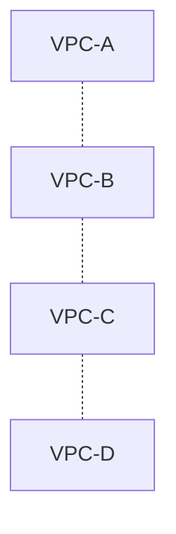

You need connectivity between these VPCs.

The first temptation might be:

> "Just create VPC Peering."

But the exam wants you to consider **scale, transitive routing, operational overhead, cost, and whether full network access is actually required.**

---

# 2. Option 1 — VPC Peering

VPC Peering provides a direct network connection between two VPCs.

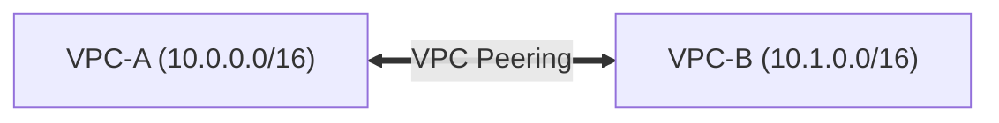

Traffic can privately communicate between the VPCs.

### Characteristics

* Private connectivity
* Low operational overhead
* Simple
* No centralized router
* CIDRs cannot overlap
* **No transitive routing**

---

# 3. VPC Peering — The Biggest Exam Point

Suppose:

```text
A ←→ B
B ←→ C
```

You might think:

```text
A → B → C
```

should work.

It doesn't automatically.

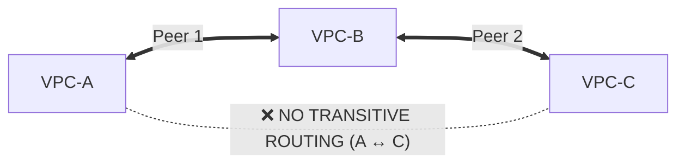

This is:

> **No transitive routing**

If A needs to communicate with C, you generally need another connectivity mechanism/path.

---

# 4. VPC Peering at Small Scale

Suppose:

```text
2 VPCs
```

You need:

```text
VPC-A ↔ VPC-B
```

VPC Peering is often an excellent answer.

Why?

```text
Low complexity
+
Low operational overhead
+
Direct connectivity
```

Don't introduce Transit Gateway just because it is more powerful.

### Exam principle

> **For simple point-to-point connectivity, use the simplest solution that satisfies the requirement.**

---

# 5. VPC Peering at Large Scale

Now imagine:

```text
10 VPCs
```

If you create lots of peerings:

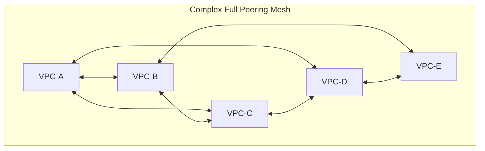

The network becomes increasingly difficult to manage.

You have to manage:

* Peering connections
* Route tables
* Security rules
* CIDRs
* Connectivity relationships

This becomes an operational problem.

---

# 6. Option 2 — Transit Gateway

Transit Gateway gives you a centralized network hub.

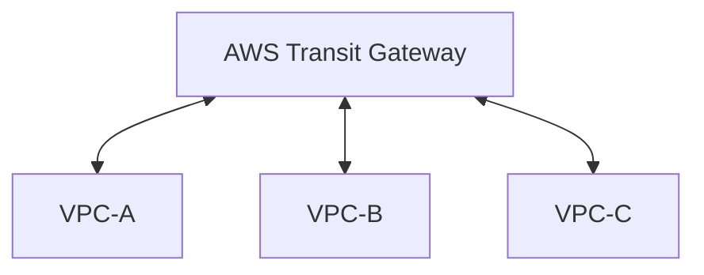

Instead of:

```text
A ↔ B
A ↔ C
B ↔ C
...
```

you have:

```text
        TGW
      /  |  \
     A   B   C
```

This is the classic:

> **Hub-and-spoke architecture**

---

# 7. Why Transit Gateway Is Powerful

Transit Gateway can provide:

* Centralized routing
* Transitive connectivity
* Connectivity between many VPCs
* Connectivity to VPN
* Connectivity to Direct Connect
* Centralized network architecture

Example:

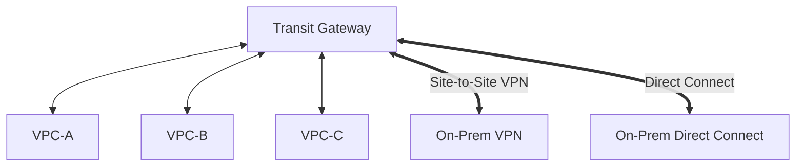

This is especially useful for enterprise environments.

---

# 8. Transit Gateway and Transitive Routing

This is probably the most important reason to choose TGW.

Suppose:

```text
VPC-A
   │
   ▼
 TGW
   │
   ▼
VPC-B
```

and:

```text
VPC-C
   │
   ▼
 TGW
```

The TGW can route between the attached networks.

Conceptually:

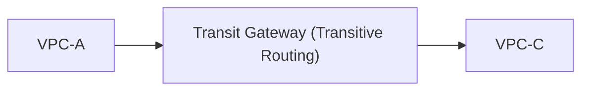

Therefore:

> **Transit Gateway supports transitive routing.**

---

# 9. Transit Gateway Route Tables

Transit Gateway isn't simply:

> "Connect everything to everything."

You can control routing using TGW route tables.

Example:

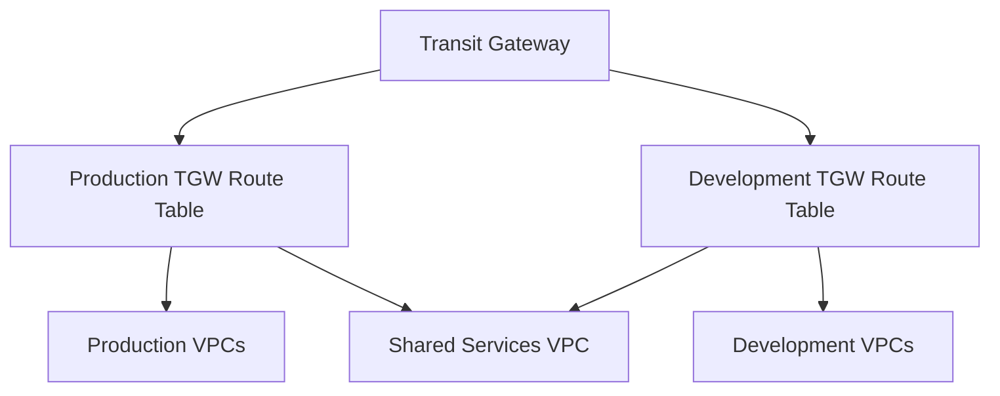

This allows segmentation.

For example:

```text
Production
    ↓
Can access Shared Services

Development
    ↓
Can access Shared Services

Development
    ✗
Cannot access Production
```

Very useful in enterprise architecture.

---

# 10. VPC Peering vs Transit Gateway

| Feature | VPC Peering | Transit Gateway |
|---|---|---|
| Simple 2-VPC connection | ⭐⭐⭐⭐⭐ | ⭐⭐⭐ |
| Many VPCs | ⭐⭐ | ⭐⭐⭐⭐⭐ |
| Transitive routing | ❌ | ✅ |
| Centralized routing | ❌ | ✅ |
| Hub-and-spoke | ❌ | ✅ |
| VPN integration | Limited architecture | ✅ |
| Direct Connect integration | Via additional architecture | ✅ |
| Operational simplicity at scale | ❌ | ✅ |
| Infrastructure cost | Generally lower | Higher |
| Management at scale | Difficult | Easier |

### Exam rule

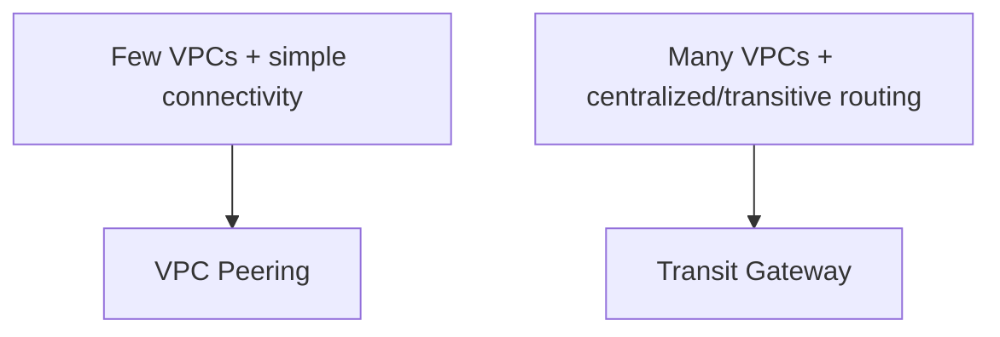

---

# 11. Option 3 — AWS PrivateLink

PrivateLink is fundamentally different.

It is not:

> "Connect two entire VPCs."

Instead:

> **"Give another VPC private access to a specific service."**

Example:

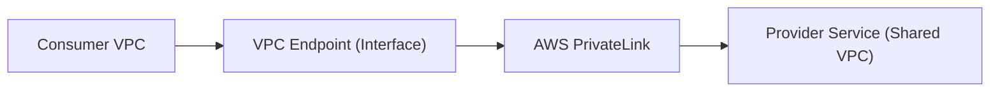

---

# 12. PrivateLink Example

Imagine your organization has:

```text
Shared Services VPC

Payment API
User API
Reporting API
```

You don't want every application VPC to access the entire Shared Services VPC.

Instead:

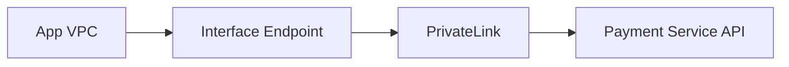

The consumer gets access to the service without requiring broad VPC-to-VPC network connectivity.

---

# 13. PrivateLink — Exam Clue

Look for wording such as:

> "Expose a service privately to multiple VPCs."

> "Consumers should access only the service."

> "Do not provide full network access between VPCs."

Think:

# **PrivateLink**

---

# 14. Peering vs PrivateLink

This distinction is critical.

### VPC Peering

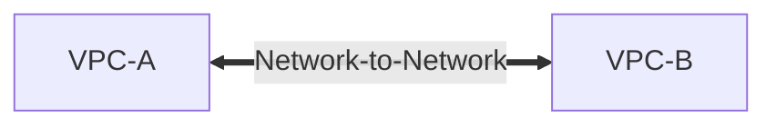

Think:

> **Network-to-network**

### PrivateLink

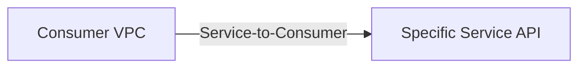

Think:

> **Service-to-consumer**

---

# 15. Security Advantage of PrivateLink

Suppose:

```text
VPC-A
10.0.0.0/16

VPC-B
10.1.0.0/16
```

Peering potentially enables network connectivity between resources according to routing and security controls.

PrivateLink is more granular:

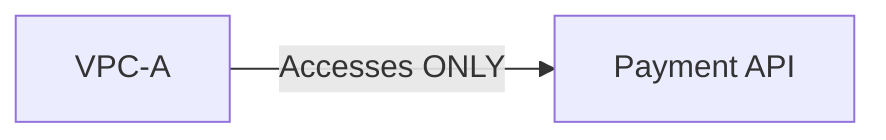

This follows the principle:

> **Least privilege at the network/service level.**

---

# 16. Option 4 — Cloud WAN

For very large global organizations, AWS also provides **Cloud WAN**.

Think:

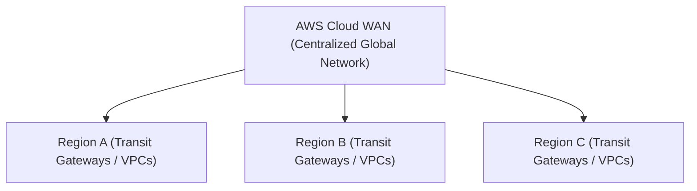

Cloud WAN is intended for centrally managed global networking.

You generally won't choose it for:

> "I have two VPCs and need connectivity."

It becomes relevant when the requirement is closer to:

> "We need centralized global network management across multiple regions and environments."

---

# 17. Multi-Region Connectivity

Now introduce regions:

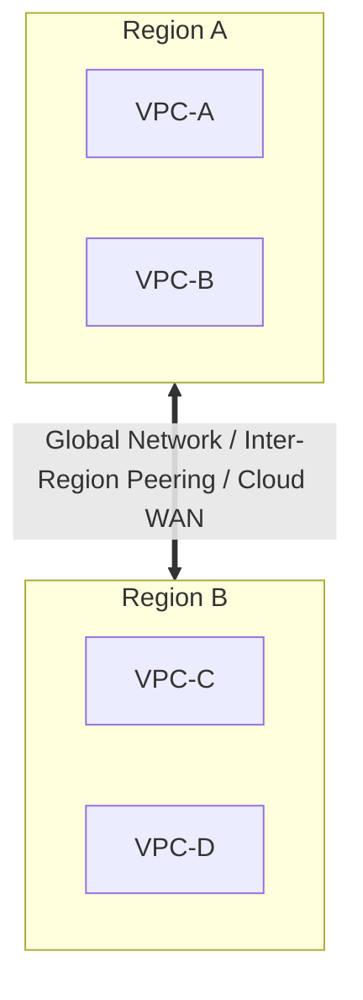

For large-scale architecture, you might use:

```text
Cloud WAN
```

or appropriate Transit Gateway architectures with inter-region connectivity.

The key exam thought is:

> **Local/simple connectivity → Peering**

> **Regional enterprise hub → Transit Gateway**

> **Large global network → Cloud WAN**

---

# 18. Multiple VPCs + On-Premises

Now imagine:

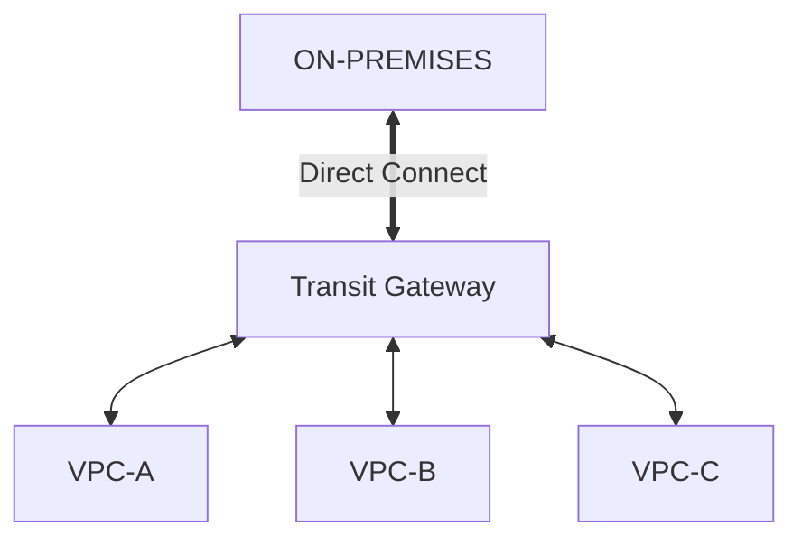

This is an extremely common enterprise architecture.

Transit Gateway can act as the central connectivity hub.

---

# 19. VPN Alternative

For hybrid connectivity:

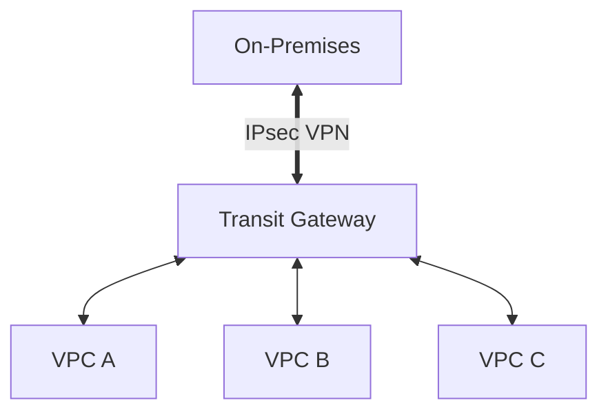

This can be useful when:

* You need encrypted connectivity
* You want faster deployment than Direct Connect
* You don't require a dedicated private circuit

---

# 20. Direct Connect vs VPN

This is slightly outside pure VPC-to-VPC connectivity but commonly appears in the same exam questions.

| Feature | Site-to-Site VPN | Direct Connect |
|---|---|---|
| Internet required | Yes | No |
| Setup | Faster | Longer |
| Encryption | IPsec | Not inherently encrypted |
| Predictability | Lower | Higher |
| Dedicated connection | ❌ | ✅ |
| Operational complexity | Lower | Higher |
| Typical use | Quick hybrid connectivity | Consistent enterprise connectivity |

### Exam clue

> "Quick, encrypted connection to AWS"

→ **Site-to-Site VPN**

> "Dedicated, consistent private connectivity"

→ **Direct Connect**

---

# 21. The Cost Trade-Off

This is where you need to think beyond "which service is better?"

### VPC Peering

Usually the simplest architecture for a small number of connections.

```text
Cost
  ↓
Lower

Operational overhead
  ↓
Low
```

But as VPC count increases:

```text
Operational complexity
        ↑
        │
        │
        └───────────────
```

---

### Transit Gateway

```text
Service cost
    ↑
```

You pay for using the centralized networking infrastructure/traffic processing.

But:

```text
Operational overhead at scale
              ↓
           Lower
```

So:

> **Higher direct networking cost can be justified by significantly lower operational complexity.**

This is a classic AWS exam trade-off.

---

# 22. Important Exam Concept: Cost ≠ Cheapest Architecture

Suppose:

```text
2 VPCs
```

TGW may be unnecessary.

Use:

```text
VPC Peering
```

But:

```text
50 VPCs
```

Using many peerings might create significant administrative complexity.

TGW becomes attractive.

Therefore:

> **Cost-effective ≠ lowest individual service price.**

It means:

> **Best overall cost considering operations, scalability, reliability, and requirements.**

---

# 23. Operational Overhead Comparison

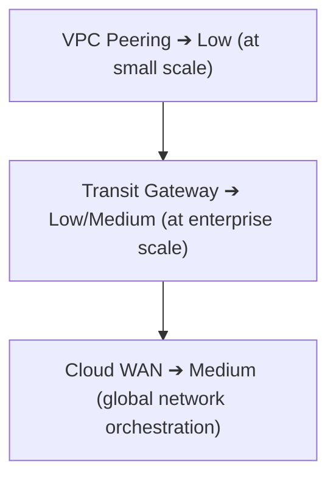

But this is **scale-dependent**.

At 2 VPCs:

```text
Peering
████
TGW
████████
```

At 100 VPCs:

```text
Peering
████████████████████

TGW
██████
```

That's the key insight.

---

# 24. Full HLD — Small Environment

Requirement:

> Two VPCs need private communication.

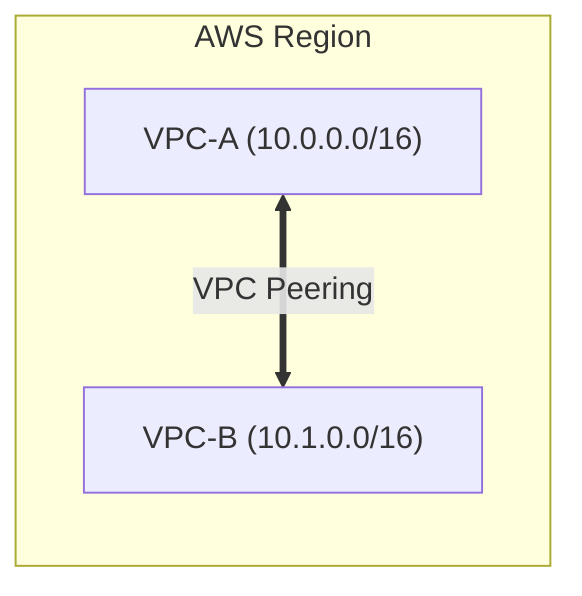

### Why?

* Simple
* Low operational overhead
* No central router required
* Easy to understand

---

# 25. HLD — Enterprise Environment

```mermaid
flowchart TD
    TGW["Transit Gateway"] <--> VPCA["VPC-A (Prod)"]
    TGW <--> VPCB["VPC-B (Dev)"]
    TGW <--> VPCC["VPC-C (Shared)"]
    TGW <== "VPN / DX" ==> OnPrem["On-Premises"]
```

This is the architecture you should immediately recognize when the question says:

* Many VPCs
* Centralized connectivity
* Transitive routing
* Hybrid connectivity
* Centralized routing policy

---

# 26. HLD — Service Sharing

Suppose:

```text
Shared Services VPC
        │
        └── Payment API
```

Multiple VPCs consume it:

```mermaid
flowchart TD
    Payment["Payment Service API (Shared VPC)"] --> PL["PrivateLink"]
    PL --> VPCA["VPC-A"]
    PL --> VPCB["VPC-B"]
    PL --> VPCC["VPC-C"]
```

This is preferable to giving every VPC broad network access when only a service is needed.

---

# 27. HLD — Enterprise Network

A more complete architecture:

```mermaid
flowchart TD
    Internet["INTERNET"] --> Edge["AWS Edge"] --> RegA["Region A (Transit Gateway)"]
    Edge --> RegB["Region B (Transit Gateway)"]
    
    RegA <--> VPCsA["Prod / Dev / Shared VPCs"]
    RegB <--> VPCsB["Prod / Dev / Shared VPCs"]
    
    RegA <== "Global Network / Cloud WAN" ==> RegB
```

For very large global network requirements, evaluate **Cloud WAN**.

---

# 28. Network Segmentation + Connectivity

Remember that connecting VPCs does **not** mean everything should be allowed to communicate.

Example:

```mermaid
flowchart TD
    TGW["Transit Gateway Routing Rules"]
    TGW -->|✅ Allowed| P2S["Prod ➔ Shared Services"]
    TGW -->|✅ Allowed| D2S["Dev ➔ Shared Services"]
    TGW -. "❌ Blocked" .- P2D["Prod ↔ Dev Direct Communication"]
```

You can use TGW routing/security controls to implement policies such as:

```text
Prod → Shared      ✅
Dev  → Shared      ✅
Prod → Dev         ❌
Dev  → Prod        ❌
```

This is **segmentation at the connectivity layer**.

---

# 29. CIDR Planning Becomes Critical

Before connecting VPCs:

```text
VPC-A → 10.0.0.0/16
VPC-B → 10.1.0.0/16
VPC-C → 10.2.0.0/16
VPC-D → 10.3.0.0/16
```

Good.

Avoid:

```text
VPC-A → 10.0.0.0/16
VPC-B → 10.0.0.0/16
```

because overlapping CIDRs make network connectivity architectures problematic.

### Exam clue

> "Existing VPCs have overlapping CIDR ranges."

Be careful: simply adding peering/TGW doesn't solve the overlap.

---

# 30. The Decision Tree

This is the one I'd memorize.

```mermaid
flowchart TD
    Start["Multiple VPCs"] --> Need{"What do they need?"}
    
    Need -->|Full Network Connectivity| HowMany{"How many VPCs?"}
    Need -->|Specific Service Only| PL["AWS PrivateLink"]

    HowMany -->|Few VPCs| Peer["VPC Peering"]
    HowMany -->|Many VPCs| TGW["Transit Gateway"]

    TGW --> Global{"Global / Multi-Region?"}
    Global -->|YES| WAN["AWS Cloud WAN"]
    Global -->|NO| Hybrid{"Need On-Prem?"}
    Hybrid -->|YES| TGWConn["Transit Gateway + VPN / Direct Connect"]
```

---

# 31. The "Minimum Work" Exam Pattern

### Question:

> Two VPCs need communication.

**Answer:** VPC Peering

Don't over-engineer with TGW.

---

### Question:

> 30 VPCs require centralized connectivity.

**Answer:** Transit Gateway

Don't create a large peering mesh.

---

### Question:

> Application VPC needs access to a single service in another VPC.

**Answer:** PrivateLink

Don't expose the whole network.

---

### Question:

> Many VPCs across multiple global regions need centralized network management.

**Answer:** Consider Cloud WAN.

---

### Question:

> Multiple VPCs need to connect to on-premises networks.

**Answer:** Transit Gateway + VPN/Direct Connect, depending on requirements.

---

# 32. Exam Trap — "Transitive Routing"

If you see:

```text
VPC-A → VPC-B → VPC-C
```

and the question says:

> "VPC-A must communicate with VPC-C through VPC-B."

Don't choose normal VPC Peering.

Think:

**Transit Gateway** or another architecture explicitly supporting the required routing.

---

# 33. Exam Trap — "Least Privilege"

Question:

> "A company wants to expose only an internal API to another VPC."

Don't automatically choose:

**VPC Peering**

Think:

**PrivateLink**

Because the requirement is:

```text
Service-level access
```

rather than:

```text
Network-level access
```

---

# 34. Exam Trap — "Cheapest"

If the question says:

> "Two VPCs need private communication with minimal operational overhead and cost."

Likely:

**VPC Peering**

If it says:

> "Hundreds of VPCs require centralized/transitive connectivity."

Likely:

**Transit Gateway**

Even though TGW introduces additional cost.

---

# 35. Final Comparison

| Requirement | VPC Peering | Transit Gateway | PrivateLink | Cloud WAN |
|---|--:|--:|--:|--:|
| Two VPCs | ⭐⭐⭐⭐⭐ | ⭐⭐⭐ | ⭐⭐ | ⭐ |
| Many VPCs | ⭐⭐ | ⭐⭐⭐⭐⭐ | ⭐⭐⭐⭐ | ⭐⭐⭐⭐⭐ |
| Full network connectivity | ✅ | ✅ | ❌ | ✅ |
| Specific service | ❌ | Possible | ✅ | ❌ |
| Transitive routing | ❌ | ✅ | Not its purpose | ✅ |
| Centralized routing | ❌ | ✅ | ❌ | ✅ |
| Hub-and-spoke | ❌ | ✅ | ❌ | ✅ |
| Lowest complexity for 2 VPCs | ✅ | ❌ | Depends | ❌ |
| Enterprise scale | Limited | ✅ | ✅ | ✅ |
| Global network | Limited | Regional/global architecture | Service-level | ✅ |

---

# 🧠 Final AWS Exam Cheat Sheet

Memorize this:

```text
2 VPCs
   ↓
VPC Peering

Many VPCs
   ↓
Transit Gateway

Many VPCs + transitive routing
   ↓
Transit Gateway

Need only a specific service
   ↓
PrivateLink

Many VPCs + hybrid connectivity
   ↓
Transit Gateway + VPN/DX

Large global network
   ↓
Cloud WAN

Overlapping CIDRs
   ↓
Problem — plan/rework addressing

Least operational overhead
   ↓
Prefer managed services

Lowest cost
   ↓
Don't automatically choose the cheapest service;
consider scale + operational cost
```

## 🏆 The mental model

When you see a connectivity question, ask **three questions in order**:

```mermaid
flowchart TD
    Q1{"1. Do I need NETWORK-to-NETWORK connectivity?"}
    
    Q1 -->|YES| Q2{"2. Is it just a few VPCs?"}
    Q1 -->|NO| PL["PrivateLink"]

    Q2 -->|YES| Peering["VPC Peering"]
    Q2 -->|NO| TGW["Transit Gateway"]
```

And the golden exam rule:

> **Peering = simple direct connection**  
> **Transit Gateway = scalable network hub**  
> **PrivateLink = private access to a specific service**  
> **Cloud WAN = large-scale global network orchestration**

This framing will also connect directly to the previous **network segmentation** and **network traffic monitoring** topics: **segment with VPCs/subnets → connect with Peering/TGW/PrivateLink → control with SG/NACL/Network Firewall → observe with Flow Logs/CloudWatch/GuardDuty.**