# AWS — Evaluating Connectivity Options for Multiple VPCs

For the exam, the key question is:

> **“I have multiple VPCs. How should they communicate with each other while minimizing cost, complexity, and operational overhead?”**

The main options are:

1. **VPC Peering**
2. **AWS Transit Gateway**
3. **AWS PrivateLink**
4. **AWS Cloud WAN** — for larger/global network architecture
5. **AWS VPN CloudHub** — for branch-to-branch and hybrid site-to-site communication
6. **VPN / Direct Connect through Transit Gateway** — when complex multi-VPC on-premises connectivity is involved

The most important exam comparison is:

> **VPC Peering vs Transit Gateway vs PrivateLink vs VPN CloudHub**

---

# 1. First Understand the Problem

Imagine:

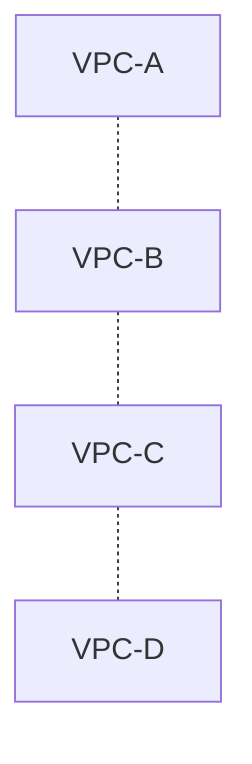

You need connectivity between these VPCs.

The first temptation might be:

> "Just create VPC Peering."

But the exam wants you to consider **scale, transitive routing, operational overhead, cost, and whether full network access is actually required.**

---

# 2. Option 1 — VPC Peering

VPC Peering provides a direct network connection between two VPCs.

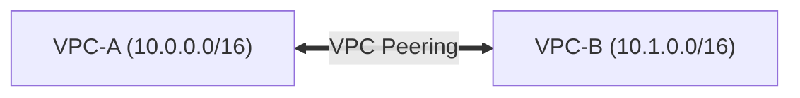

Traffic can privately communicate between the VPCs.

### Characteristics

* Private connectivity
* Low operational overhead
* Simple
* No centralized router
* CIDRs cannot overlap
* **No transitive routing**

---

# 3. VPC Peering — The Biggest Exam Point

Suppose:

```text
A ←→ B
B ←→ C
```

You might think:

```text
A → B → C
```

should work.

It doesn't automatically.

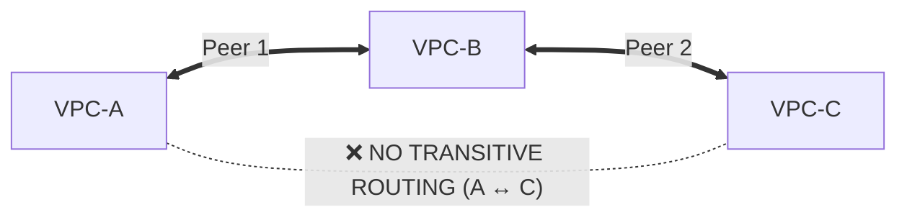

This is:

> **No transitive routing**

If A needs to communicate with C, you generally need another connectivity mechanism/path.

---

# 4. VPC Peering at Small Scale

Suppose:

```text
2 VPCs
```

You need:

```text
VPC-A ↔ VPC-B
```

VPC Peering is often an excellent answer.

Why?

```text
Low complexity
+
Low operational overhead
+
Direct connectivity
```

Don't introduce Transit Gateway just because it is more powerful.

### Exam principle

> **For simple point-to-point connectivity, use the simplest solution that satisfies the requirement.**

---

# 5. VPC Peering at Large Scale

Now imagine:

```text
10 VPCs
```

If you create lots of peerings:

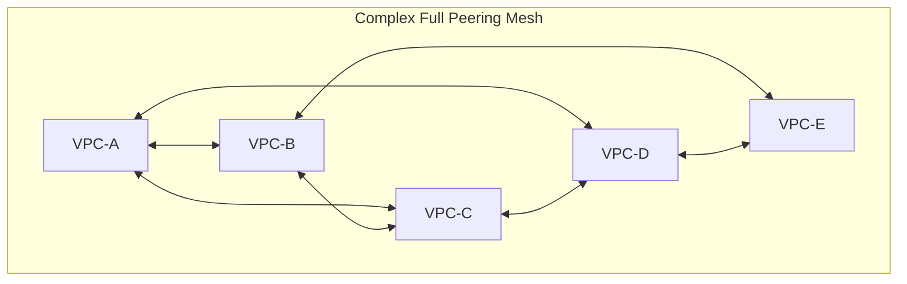

The network becomes increasingly difficult to manage.

You have to manage:

* Peering connections
* Route tables
* Security rules
* CIDRs
* Connectivity relationships

This becomes an operational problem.

---

# 6. Option 2 — Transit Gateway

Transit Gateway gives you a centralized network hub.

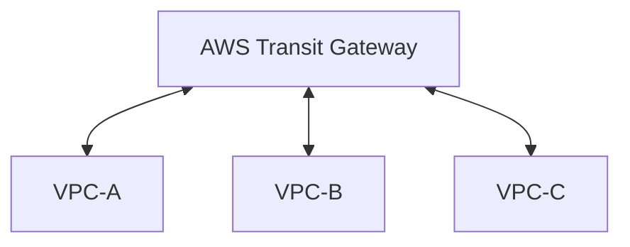

Instead of:

```text
A ↔ B
A ↔ C
B ↔ C
...
```

you have:

```text
        TGW
      /  |  \
     A   B   C
```

This is the classic:

> **Hub-and-spoke architecture**

---

# 7. Why Transit Gateway Is Powerful

Transit Gateway can provide:

* Centralized routing
* Transitive connectivity
* Connectivity between many VPCs
* Connectivity to VPN
* Connectivity to Direct Connect
* Centralized network architecture

Example:

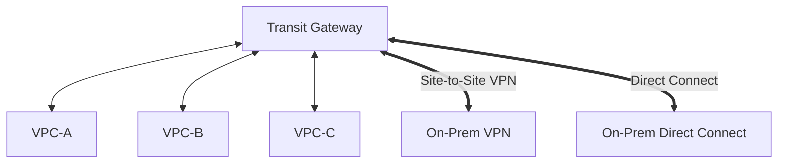

This is especially useful for enterprise environments.

---

# 8. Transit Gateway and Transitive Routing

This is probably the most important reason to choose TGW.

Suppose:

```text
VPC-A
   │
   ▼
 TGW
   │
   ▼
VPC-B
```

and:

```text
VPC-C
   │
   ▼
 TGW
```

The TGW can route between the attached networks.

Conceptually:

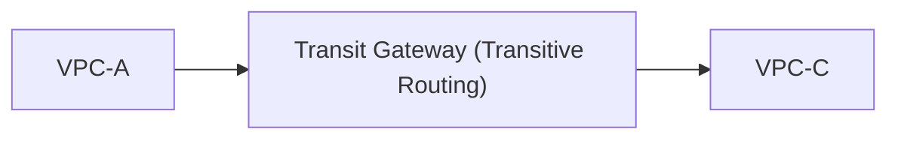

Therefore:

> **Transit Gateway supports transitive routing.**

---

# 9. Transit Gateway Route Tables

Transit Gateway isn't simply:

> "Connect everything to everything."

You can control routing using TGW route tables.

Example:

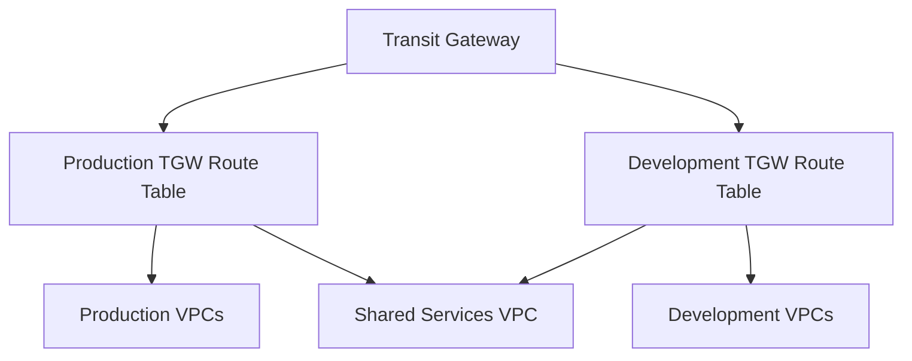

This allows segmentation.

For example:

```text
Production
    ↓
Can access Shared Services

Development
    ↓
Can access Shared Services

Development
    ✗
Cannot access Production
```

Very useful in enterprise architecture.

---

# 10. VPC Peering vs Transit Gateway

| Feature | VPC Peering | Transit Gateway |
|---|---|---|
| Simple 2-VPC connection | ⭐⭐⭐⭐⭐ | ⭐⭐⭐ |
| Many VPCs | ⭐⭐ | ⭐⭐⭐⭐⭐ |
| Transitive routing | ❌ | ✅ |
| Centralized routing | ❌ | ✅ |
| Hub-and-spoke | ❌ | ✅ |
| VPN integration | Limited architecture | ✅ |
| Direct Connect integration | Via additional architecture | ✅ |
| Operational simplicity at scale | ❌ | ✅ |
| Infrastructure cost | Generally lower | Higher |
| Management at scale | Difficult | Easier |

### Exam rule

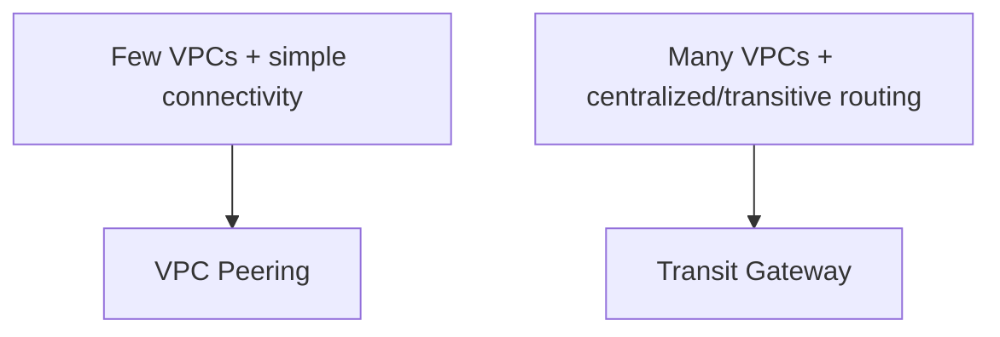

---

# 11. Option 3 — AWS PrivateLink

PrivateLink is fundamentally different.

It is not:

> "Connect two entire VPCs."

Instead:

> **"Give another VPC private access to a specific service."**

Example:

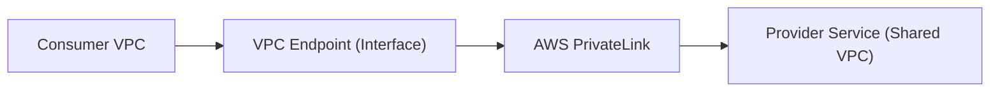

---

# 12. PrivateLink Example

Imagine your organization has:

```text
Shared Services VPC

Payment API
User API
Reporting API
```

You don't want every application VPC to access the entire Shared Services VPC.

Instead:

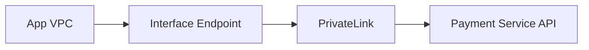

The consumer gets access to the service without requiring broad VPC-to-VPC network connectivity.

---

# 13. PrivateLink — Exam Clue

Look for wording such as:

> "Expose a service privately to multiple VPCs."

> "Consumers should access only the service."

> "Do not provide full network access between VPCs."

Think:

# **PrivateLink**

---

# 14. Peering vs PrivateLink

This distinction is critical.

### VPC Peering

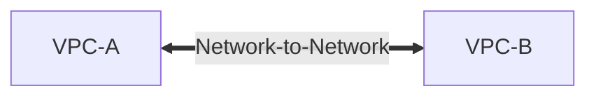

Think:

> **Network-to-network**

### PrivateLink

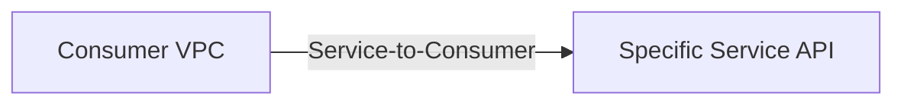

Think:

> **Service-to-consumer**

---

# 15. Security Advantage of PrivateLink

Suppose:

```text
VPC-A
10.0.0.0/16

VPC-B
10.1.0.0/16
```

Peering potentially enables network connectivity between resources according to routing and security controls.

PrivateLink is more granular:

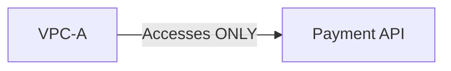

This follows the principle:

> **Least privilege at the network/service level.**

---

# 16. Option 4 — Cloud WAN

For very large global organizations, AWS also provides **Cloud WAN**.

Think:

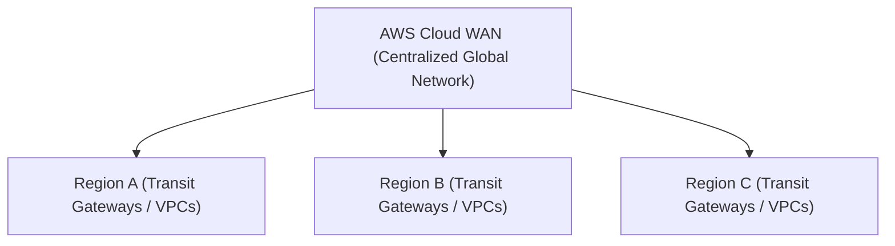

Cloud WAN is intended for centrally managed global networking.

You generally won't choose it for:

> "I have two VPCs and need connectivity."

It becomes relevant when the requirement is closer to:

> "We need centralized global network management across multiple regions and environments."

---

# 17. Multi-Region Connectivity

Now introduce regions:

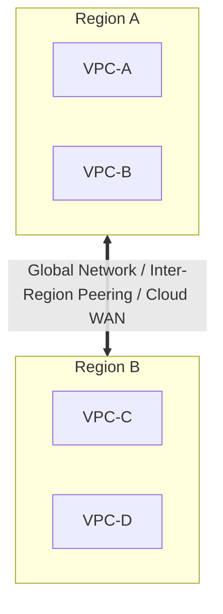

For large-scale architecture, you might use:

```text
Cloud WAN
```

or appropriate Transit Gateway architectures with inter-region connectivity.

The key exam thought is:

> **Local/simple connectivity → Peering**

> **Regional enterprise hub → Transit Gateway**

> **Large global network → Cloud WAN**

---

# 18. Multiple VPCs + On-Premises

Now imagine:

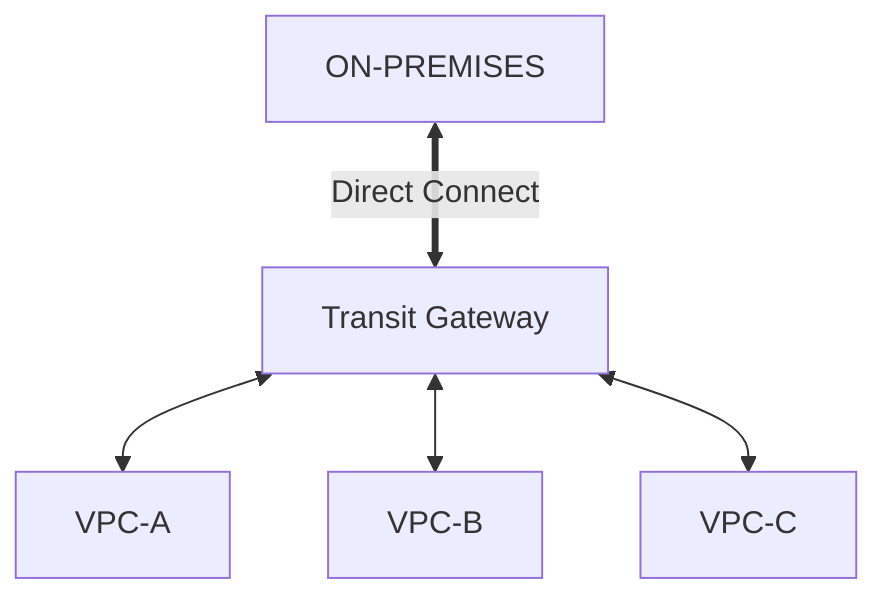

This is an extremely common enterprise architecture.

Transit Gateway can act as the central connectivity hub.

---

# 19. VPN Alternative

For hybrid connectivity:

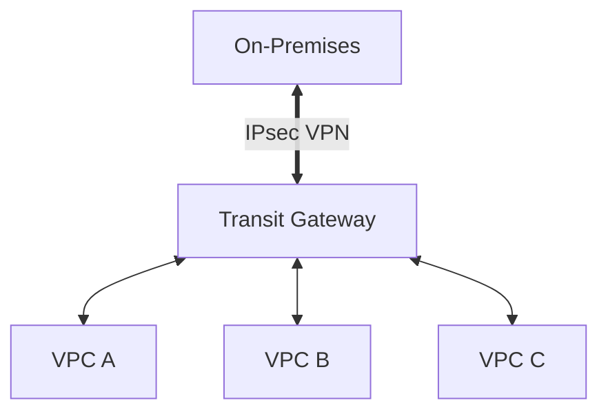

This can be useful when:

* You need encrypted connectivity
* You want faster deployment than Direct Connect
* You don't require a dedicated private circuit

---

# 20. Direct Connect vs VPN

This is slightly outside pure VPC-to-VPC connectivity but commonly appears in the same exam questions.

| Feature | Site-to-Site VPN | Direct Connect |
|---|---|---|
| Internet required | Yes | No |
| Setup | Faster | Longer |
| Encryption | IPsec | Not inherently encrypted |
| Predictability | Lower | Higher |
| Dedicated connection | ❌ | ✅ |
| Operational complexity | Lower | Higher |
| Typical use | Quick hybrid connectivity | Consistent enterprise connectivity |

### Exam clue

> "Quick, encrypted connection to AWS"

→ **Site-to-Site VPN**

> "Dedicated, consistent private connectivity"

→ **Direct Connect**

---

# 21. The Cost Trade-Off

This is where you need to think beyond "which service is better?"

### VPC Peering

Usually the simplest architecture for a small number of connections.

```text
Cost
  ↓
Lower

Operational overhead
  ↓
Low
```

But as VPC count increases:

```text
Operational complexity
        ↑
        │
        │
        └───────────────
```

---

### Transit Gateway

```text
Service cost
    ↑
```

You pay for using the centralized networking infrastructure/traffic processing.

But:

```text
Operational overhead at scale
              ↓
           Lower
```

So:

> **Higher direct networking cost can be justified by significantly lower operational complexity.**

This is a classic AWS exam trade-off.

---

# 22. Important Exam Concept: Cost ≠ Cheapest Architecture

Suppose:

```text
2 VPCs
```

TGW may be unnecessary.

Use:

```text
VPC Peering
```

But:

```text
50 VPCs
```

Using many peerings might create significant administrative complexity.

TGW becomes attractive.

Therefore:

> **Cost-effective ≠ lowest individual service price.**

It means:

> **Best overall cost considering operations, scalability, reliability, and requirements.**

---

# 23. Operational Overhead Comparison

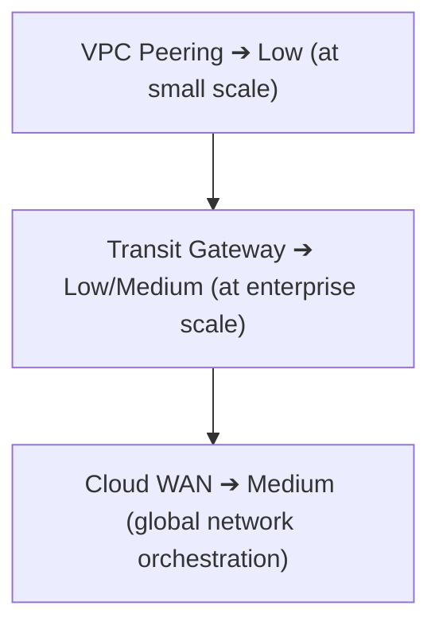

But this is **scale-dependent**.

At 2 VPCs:

```text
Peering
████
TGW
████████
```

At 100 VPCs:

```text
Peering
████████████████████

TGW
██████
```

That's the key insight.

---

# 24. Full HLD — Small Environment

Requirement:

> Two VPCs need private communication.

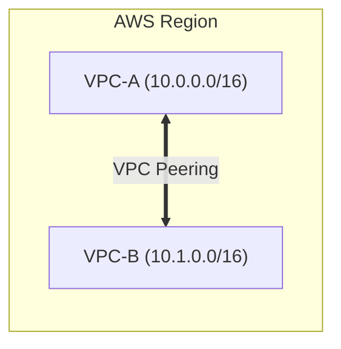

### Why?

* Simple
* Low operational overhead
* No central router required
* Easy to understand

---

# 25. HLD — Enterprise Environment

```mermaid
flowchart TD
    TGW["Transit Gateway"] <--> VPCA["VPC-A (Prod)"]
    TGW <--> VPCB["VPC-B (Dev)"]
    TGW <--> VPCC["VPC-C (Shared)"]
    TGW <== "VPN / DX" ==> OnPrem["On-Premises"]
```

This is the architecture you should immediately recognize when the question says:

* Many VPCs
* Centralized connectivity
* Transitive routing
* Hybrid connectivity
* Centralized routing policy

---

# 26. HLD — Service Sharing

Suppose:

```text
Shared Services VPC
        │
        └── Payment API
```

Multiple VPCs consume it:

```mermaid
flowchart TD
    Payment["Payment Service API (Shared VPC)"] --> PL["PrivateLink"]
    PL --> VPCA["VPC-A"]
    PL --> VPCB["VPC-B"]
    PL --> VPCC["VPC-C"]
```

This is preferable to giving every VPC broad network access when only a service is needed.

---

# 27. HLD — Enterprise Network

A more complete architecture:

```mermaid
flowchart TD
    Internet["INTERNET"] --> Edge["AWS Edge"] --> RegA["Region A (Transit Gateway)"]
    Edge --> RegB["Region B (Transit Gateway)"]
    
    RegA <--> VPCsA["Prod / Dev / Shared VPCs"]
    RegB <--> VPCsB["Prod / Dev / Shared VPCs"]
    
    RegA <== "Global Network / Cloud WAN" ==> RegB
```

For very large global network requirements, evaluate **Cloud WAN**.

---

# 28. Network Segmentation + Connectivity

Remember that connecting VPCs does **not** mean everything should be allowed to communicate.

Example:

```mermaid
flowchart TD
    TGW["Transit Gateway Routing Rules"]
    TGW -->|✅ Allowed| P2S["Prod ➔ Shared Services"]
    TGW -->|✅ Allowed| D2S["Dev ➔ Shared Services"]
    TGW -. "❌ Blocked" .- P2D["Prod ↔ Dev Direct Communication"]
```

You can use TGW routing/security controls to implement policies such as:

```text
Prod → Shared      ✅
Dev  → Shared      ✅
Prod → Dev         ❌
Dev  → Prod        ❌
```

This is **segmentation at the connectivity layer**.

---

# 29. CIDR Planning Becomes Critical

Before connecting VPCs:

```text
VPC-A → 10.0.0.0/16
VPC-B → 10.1.0.0/16
VPC-C → 10.2.0.0/16
VPC-D → 10.3.0.0/16
```

Good.

Avoid:

```text
VPC-A → 10.0.0.0/16
VPC-B → 10.0.0.0/16
```

because overlapping CIDRs make network connectivity architectures problematic.

### Exam clue

> "Existing VPCs have overlapping CIDR ranges."

Be careful: simply adding peering/TGW doesn't solve the overlap.

---

# 30. The Decision Tree

This is the one I'd memorize.

```mermaid
flowchart TD
    Start["Multiple VPCs"] --> Need{"What do they need?"}
    
    Need -->|Full Network Connectivity| HowMany{"How many VPCs?"}
    Need -->|Specific Service Only| PL["AWS PrivateLink"]

    HowMany -->|Few VPCs| Peer["VPC Peering"]
    HowMany -->|Many VPCs| TGW["Transit Gateway"]

    TGW --> Global{"Global / Multi-Region?"}
    Global -->|YES| WAN["AWS Cloud WAN"]
    Global -->|NO| Hybrid{"Need On-Prem?"}
    Hybrid -->|YES| TGWConn["Transit Gateway + VPN / Direct Connect"]
```

---

# 31. The "Minimum Work" Exam Pattern

### Question:

> Two VPCs need communication.

**Answer:** VPC Peering

Don't over-engineer with TGW.

---

### Question:

> 30 VPCs require centralized connectivity.

**Answer:** Transit Gateway

Don't create a large peering mesh.

---

### Question:

> Application VPC needs access to a single service in another VPC.

**Answer:** PrivateLink

Don't expose the whole network.

---

### Question:

> Many VPCs across multiple global regions need centralized network management.

**Answer:** Consider Cloud WAN.

---

### Question:

> Multiple VPCs need to connect to on-premises networks.

**Answer:** Transit Gateway + VPN/Direct Connect, depending on requirements.

---

# 32. Exam Trap — "Transitive Routing"

If you see:

```text
VPC-A → VPC-B → VPC-C
```

and the question says:

> "VPC-A must communicate with VPC-C through VPC-B."

Don't choose normal VPC Peering.

Think:

**Transit Gateway** or another architecture explicitly supporting the required routing.

---

# 33. Exam Trap — "Least Privilege"

Question:

> "A company wants to expose only an internal API to another VPC."

Don't automatically choose:

**VPC Peering**

Think:

**PrivateLink**

Because the requirement is:

```text
Service-level access
```

rather than:

```text
Network-level access
```

---

# 34. Exam Trap — "Cheapest"

If the question says:

> "Two VPCs need private communication with minimal operational overhead and cost."

Likely:

**VPC Peering**

If it says:

> "Hundreds of VPCs require centralized/transitive connectivity."

Likely:

**Transit Gateway**

Even though TGW introduces additional cost.

---

---

# 36. AWS VPN CloudHub — Branch-to-Branch & Hybrid Connectivity

> [!NOTE]
> **Core Exam Concept**: When multiple remote branch offices connected to AWS via Site-to-Site VPN (or Direct Connect) need to **communicate directly with each other as well as headquarters**, the primary AWS solution is **AWS VPN CloudHub**. It operates on a hub-and-spoke model using a Virtual Private Gateway (VGW) without requiring expensive full-mesh VPN tunnels between every site.

---

## 36.1 Problem Statement & Architecture Scenario

### Scenario Setup
A company operates three primary physical locations:
1. **New York HQ**: Connected to AWS via **AWS Direct Connect**.
2. **San Francisco Branch**: Connected to AWS via **Site-to-Site VPN**.
3. **Miami Branch**: Connected to AWS via **Site-to-Site VPN**.

```
Existing Topology:
New York HQ  ──> Direct Connect ──> Virtual Private Gateway (VGW)
San Francisco ──> Site-to-Site VPN ─> Virtual Private Gateway (VGW)
Miami Branch ──> Site-to-Site VPN ─> Virtual Private Gateway (VGW)
```

### Core Business Requirement
> *"Branch offices need to communicate with each other (SF ↔ Miami) as well as with corporate headquarters (SF ↔ NY HQ, Miami ↔ NY HQ) through AWS with minimal complexity and operational overhead."*

---

## 36.2 Correct Architecture & Hub-and-Spoke Topology

AWS VPN CloudHub operates on a **Hub-and-Spoke** network design:
- **Hub**: AWS Virtual Private Gateway (VGW) infrastructure.
- **Spokes**: Corporate headquarters (Direct Connect) and remote branch offices (Site-to-Site VPN).

```mermaid
flowchart TD
    subgraph HQ ["Headquarters Location"]
        NY_HQ["New York HQ<br/>(AWS Direct Connect)"]
    end

    subgraph AWS_Cloud ["AWS Virtual Private Cloud (VPC)"]
        VGW["Virtual Private Gateway (VGW)<br/>• AWS VPN CloudHub Active Hub"]
        VPC_Subnets["VPC Subnets & Application Workloads"]
        VGW <--> VPC_Subnets
    end

    subgraph Branches ["Remote Branch Offices"]
        SF_Branch["San Francisco Branch<br/>(Site-to-Site VPN)"]
        Miami_Branch["Miami Branch<br/>(Site-to-Site VPN)"]
    end

    NY_HQ <==>|Direct Connect Private VIF| VGW
    SF_Branch <==>|IPsec Site-to-Site VPN Tunnel| VGW
    Miami_Branch <==>|IPsec Site-to-Site VPN Tunnel| VGW

    SF_Branch <.- "|Inter-Branch Routing via CloudHub Hub|" .-> Miami_Branch
    SF_Branch <.- "|Branch-to-HQ Routing via CloudHub Hub|" .-> NY_HQ
    Miami_Branch <.- "|Branch-to-HQ Routing via CloudHub Hub|" .-> NY_HQ

    style VGW fill:#d4edda,stroke:#28a745,stroke-width:2px
    style NY_HQ fill:#d1ecf1,stroke:#17a2b8,stroke-width:1px
    style SF_Branch fill:#fff3cd,stroke:#ffc107,stroke-width:1px
    style Miami_Branch fill:#fff3cd,stroke:#ffc107,stroke-width:1px
```

---

## 36.3 Why AWS VPN CloudHub Exists

Standard Site-to-Site VPN Tunnels connect individual remote sites to an AWS VPC:
$$\text{Branch Office} \longrightarrow \text{AWS VPC}$$

However, VPN CloudHub enables **inter-site, branch-to-branch routing** directly through AWS:
$$\text{Branch A} \iff \text{Branch B} \quad | \quad \text{Branch A} \iff \text{Headquarters} \quad | \quad \text{Branch B} \iff \text{Headquarters}$$

> [!IMPORTANT]
> **No Direct Branch Tunnels Required**: VPN CloudHub eliminates the need to build, configure, and maintain individual IPsec VPN tunnels between every pair of physical offices.

---

## 36.4 Critical Exam Clues & Pattern Recognition

Whenever you see this specific combination of keywords on the SAP-C02 or AIP-C01 exam:

```
"Multiple branch offices" 
      + 
"Site-to-Site VPN" 
      + 
"Branch offices must communicate with each other" 
      + 
"Direct Connect site also participates"
      │
      └───> Solution: AWS VPN CloudHub
```

---

## 36.5 Direct Connect Participation in VPN CloudHub

> [!TIP]
> **Direct Connect + VPN Compatibility**: AWS Direct Connect does **NOT** prevent or conflict with VPN CloudHub. A primary site (e.g., HQ) connected via a Direct Connect Private Virtual Interface (Private VIF) to a Virtual Private Gateway (VGW) can seamlessly exchange traffic with branch offices connected to the same VGW via Site-to-Site VPNs.

```
Direct Connect HQ ──┐
VPN Branch SF ─────┼──> [ Virtual Private Gateway / CloudHub Hub ] ──> Inter-Site Routing
VPN Branch Miami ──┘
```

---

## 6. Full-Mesh vs. Hub-and-Spoke Scalability Math

Connecting remote physical sites using dedicated point-to-point tunnels scales quadratically in a full-mesh topology:
$$\text{Full-Mesh Connections} = \frac{N \times (N - 1)}{2}$$

```mermaid
flowchart LR
    subgraph FullMesh ["Full-Mesh Complexity (N*(N-1)/2)"]
        direction TB
        FM_A["Site A"] <--> FM_B["Site B"]
        FM_A <--> FM_C["Site C"]
        FM_B <--> FM_C
        NoteFM["3 Sites = 3 Tunnels<br/>10 Sites = 45 Tunnels<br/>50 Sites = 1,225 Tunnels<br/>(Extreme Operational Overhead)"]
    end

    subgraph CloudHub ["AWS VPN CloudHub (Hub-and-Spoke: N Links)"]
        direction TB
        Hub["AWS VGW / CloudHub Hub"]
        HS_A["Site A"] <--> Hub
        HS_B["Site B"] <--> Hub
        HS_C["Site C"] <--> Hub
        NoteHS["3 Sites = 3 Links<br/>10 Sites = 10 Links<br/>50 Sites = 50 Links<br/>(Simplified Operations)"]
    end

    style CloudHub fill:#d4edda,stroke:#28a745,stroke-width:2px
    style FullMesh fill:#f8d7da,stroke:#dc3545,stroke-width:1px
```

| Number of Remote Sites ($N$) | Full-Mesh Direct Tunnels | VPN CloudHub Spoke Links | Operational Impact |
| :---: | :---: | :---: | :--- |
| **3 Sites** | 3 Tunnels | **3 Links** | Low |
| **10 Sites** | 45 Tunnels | **10 Links** | High overhead without CloudHub |
| **50 Sites** | 1,225 Tunnels | **50 Links** | Unmanageable without Hub-and-Spoke |

---

## 36.7 Distractor Analysis (Why Other Options Fail)

### 1. Why Not VPC Endpoints?
> [!WARNING]
> VPC Endpoints (Gateway Endpoints and Interface Endpoints/PrivateLink) provide private access from a VPC to **AWS Services** (S3, DynamoDB) or SaaS applications. They **CANNOT** connect physical branch offices to each other.
> - **VPC Endpoint Rule**: $\text{VPC} \longrightarrow \text{AWS Service}$
> - **VPN CloudHub Rule**: $\text{Physical Site} \iff \text{Physical Site (via AWS)}$

### 2. Why Not VPC Peering?
> [!NOTE]
> VPC Peering connects **VPC to VPC** ($\text{VPC A} \iff \text{VPC B}$). It does not connect physical branch office networks or corporate networks to each other.

### 3. Why Not Public VIF (Direct Connect)?
> [!CAUTION]
> A Direct Connect **Public VIF** is used to access public AWS endpoints (S3, DynamoDB, public SQS) over a private line. It does not provide private site-to-site communication between branch offices.
> - **Private VIF**: Direct Connect to a single VPC / VGW.
> - **Transit VIF**: Direct Connect to a Transit Gateway.
> - **Public VIF**: Direct Connect to public AWS services.

---

## 36.8 VPN CloudHub vs. AWS Transit Gateway

```mermaid
flowchart TD
    subgraph SimpleHub ["Simple Setup: AWS VPN CloudHub"]
        VGW["Virtual Private Gateway (VGW)"]
        HQ1["HQ (Direct Connect)"] <--> VGW
        B1["Branch 1 (VPN)"] <--> VGW
        B2["Branch 2 (VPN)"] <--> VGW
        NoteSimple["• Single VPC / Simple Environment<br/>• Leverages existing VGW & VPNs<br/>• Low Cost & Low Complexity"]
    end

    subgraph EnterpriseHub ["Enterprise Setup: AWS Transit Gateway"]
        TGW["AWS Transit Gateway (TGW)"]
        VPC1["VPC A"] <--> TGW
        VPC2["VPC B"] <--> TGW
        VPC3["VPC C"] <--> TGW
        HQ2["HQ (DX Gateway)"] <--> TGW
        VPN_TGW["Multiple VPNs"] <--> TGW
        NoteEnt["• Many VPCs + Multi-Region + On-Prem<br/>• Centralized Routing Tables & Segmentation<br/>• Enterprise Scale"]
    end

    style SimpleHub fill:#d4edda,stroke:#28a745,stroke-width:2px
    style EnterpriseHub fill:#d1ecf1,stroke:#17a2b8,stroke-width:2px
```

| Dimension | AWS VPN CloudHub | AWS Transit Gateway (TGW) |
| :--- | :--- | :--- |
| **Primary Focus** | Connecting multiple remote sites via VPN/DX | Connecting 10s–1,000s of VPCs + remote sites |
| **AWS Hub Entity** | Virtual Private Gateway (VGW) | Transit Gateway (TGW) |
| **VPC Multiplicity** | Typically 1 VPC / simple setup | **Multi-VPC enterprise environments** |
| **Cost Profile** | **Lowest cost** (uses existing VPN/VGW rates) | Hourly TGW attachment + data processing fees |
| **Routing Control** | BGP routes via VGW | Custom TGW Route Tables & Segmentation |

---

## 36.9 Hybrid & Branch Connectivity Decision Flowchart

```mermaid
flowchart TD
    Start(["Hybrid & Branch Connectivity Analysis"]) --> Q1{"What entities are connecting?"}

    Q1 -- "Branch Offices / On-Premises Sites" --> Q2{"Do remote sites need to communicate with EACH OTHER?"}
    Q1 -- "VPC to AWS Service" --> Q3{"Service Type?"}
    Q1 -- "VPC to VPC Network" --> Q4{"Number of VPCs?"}

    Q2 -- "No (Site to VPC only)" --> Ans_VPN["Site-to-Site VPN or Direct Connect Private VIF"]
    Q2 -- "Yes (Branch ↔ Branch & Branch ↔ HQ)" --> Q_Scale{"Environment Complexity?"}

    Q_Scale -- "Simple / Existing VGW & VPN connections" --> Ans_CloudHub["AWS VPN CloudHub<br/>• Leverages VGW<br/>• Supports Direct Connect + VPN<br/>• Hub-and-Spoke model"]
    Q_Scale -- "Large Enterprise (Many VPCs + DX + VPNs)" --> Ans_TGW["AWS Transit Gateway<br/>• Centralized Router<br/>• Multi-VPC & Multi-Site Routing"]

    Q3 -- "AWS Public Service (S3/DynamoDB)" --> Ans_GatewayEP["Gateway VPC Endpoint"]
    Q3 -- "PrivateLink / SaaS / Custom Service" --> Ans_InterfaceEP["Interface VPC Endpoint"]

    Q4 -- "2 VPCs (Point-to-point)" --> Ans_Peering["VPC Peering"]
    Q4 -- "Many VPCs (Centralized)" --> Ans_TGW_VPC["Transit Gateway"]

    style Ans_CloudHub fill:#d4edda,stroke:#28a745,stroke-width:2px
    style Ans_TGW fill:#d1ecf1,stroke:#17a2b8,stroke-width:1px
```

---

## 36.10 SAP-C02 & AIP-C01 Service Differentiation Matrix

| Requirement / Keyword | Correct AWS Service / Feature | Key Reason |
| :--- | :--- | :--- |
| **Multiple branch offices communicating through VPN** | **AWS VPN CloudHub** | Simple hub-and-spoke inter-site routing over VGW |
| **Connect 2 VPCs with low latency & cost** | **VPC Peering** | Direct point-to-point VPC network peering |
| **Connect 30+ VPCs with transitive routing** | **AWS Transit Gateway** | Scalable central routing hub |
| **Access S3 / DynamoDB privately from VPC** | **Gateway VPC Endpoint** | Free endpoint route table target |
| **Access SaaS / Third-Party service privately** | **Interface VPC Endpoint (PrivateLink)** | ENI-based endpoint service access |
| **Direct Connect to Public AWS endpoints** | **Public VIF** | Access S3/DynamoDB public IPs over DX |
| **Direct Connect to single VPC private resources**| **Private VIF** | Private VGW connectivity over DX |
| **Direct Connect to Transit Gateway** | **Transit VIF** | High-speed DX connection to TGW |

---

# 37. Updated Master Comparison Matrix

| Requirement | VPC Peering | Transit Gateway | PrivateLink | Cloud WAN | AWS VPN CloudHub |
| :--- | :---:| :---:| :---:| :---:| :---:|
| **Two VPCs** | ⭐⭐⭐⭐⭐ | ⭐⭐⭐ | ⭐⭐ | ⭐ | ❌ (Site-focused) |
| **Many VPCs** | ⭐⭐ | ⭐⭐⭐⭐⭐ | ⭐⭐⭐⭐ | ⭐⭐⭐⭐⭐ | ❌ (Site-focused) |
| **Multiple Remote Branch Offices** | ❌ | ⭐⭐⭐⭐ | ❌ | ⭐⭐⭐⭐⭐ | ⭐⭐⭐⭐⭐ |
| **Full Network Connectivity** | ✅ | ✅ | ❌ | ✅ | ✅ (Branch-to-Branch) |
| **Specific Service Access** | ❌ | Possible | ✅ | ❌ | ❌ |
| **Transitive Routing** | ❌ | ✅ | N/A | ✅ | ✅ (Site-to-Site) |
| **Centralized Hub Topology** | ❌ | ✅ | ❌ | ✅ | ✅ (VGW Hub) |
| **Lowest Complexity (Simple Sites)**| ✅ | ❌ | Depends | ❌ | ✅ |

---

# 🧠 38. Final AWS Exam Cheat Sheet

Memorize this summary matrix:

```
2 VPCs                                  ──> VPC Peering
Many VPCs (Centralized)                 ──> Transit Gateway
Many VPCs + Transitive Routing          ──> Transit Gateway
Specific Service Access Only            ──> PrivateLink (Interface Endpoint)
S3 / DynamoDB Free Private Access       ──> Gateway VPC Endpoint
Multiple Branch Offices Communicating   ──> AWS VPN CloudHub
Large Enterprise + Global Network       ──> AWS Cloud WAN
Direct Connect ──> Public AWS Services  ──> Public VIF
Direct Connect ──> Single VPC           ──> Private VIF
Direct Connect ──> Transit Gateway      ──> Transit VIF
```

## 🏆 The Golden Mental Model Rules

1. **VPC Peering** = Simple direct point-to-point VPC connection (No transitive routing).
2. **Transit Gateway** = Scalable enterprise network router hub for many VPCs & sites.
3. **PrivateLink** = Private, secure access to a specific service without full network exposure.
4. **Cloud WAN** = Large-scale global network orchestration engine.
5. **VPN CloudHub** = Simple hub-and-spoke branch-to-branch communication over VGW using existing VPN/DX.

> **Network Integration Path**: **Segment** with VPCs/Subnets $\longrightarrow$ **Connect** with Peering/TGW/PrivateLink/CloudHub $\longrightarrow$ **Control** with SG/NACL/Network Firewall $\longrightarrow$ **Observe** with Flow Logs/CloudWatch/GuardDuty.