# AWS — Evaluating Connectivity Options for On-Premises, Co-Location & Cloud Integration

For the AWS exam, this topic is mainly about choosing between:

* **AWS Site-to-Site VPN**
* **AWS Direct Connect**
* **Direct Connect + VPN**
* **Transit Gateway**
* **AWS Cloud WAN**
* **AWS Direct Connect Gateway**
* **AWS PrivateLink**
* **VPC Peering / Transit Gateway** for cloud-to-cloud connectivity

The exam is usually testing:

> **Cost vs performance vs reliability vs encryption vs operational overhead vs scale.**

---

# 1. Start With the Big Picture

Imagine your organization has:

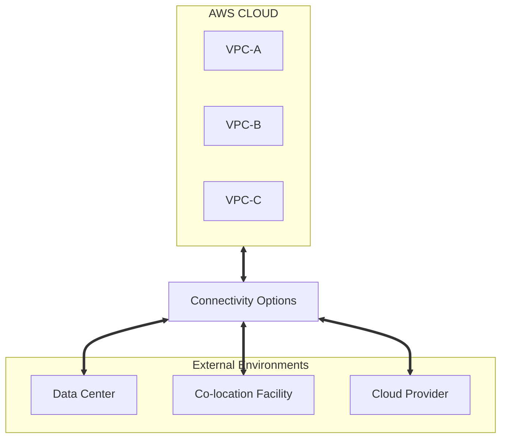

The question is:

> **How should these environments connect?**

---

# 2. First Decision: Internet or Dedicated Network?

This is the first exam decision.

```mermaid
flowchart TD
    Start{"Need on-premises ➔ AWS?"} --> Internet{"Internet or Dedicated?"}
    
    Internet -->|Internet (Public Link)| VPN["AWS Site-to-Site VPN"]
    Internet -->|Dedicated Private Link| DX["AWS Direct Connect"]
```

### VPN

Uses the Internet.

### Direct Connect

Uses a dedicated private connection into AWS.

---

# 3. AWS Site-to-Site VPN

Think:

> **Encrypted connectivity over the public Internet.**

Architecture:

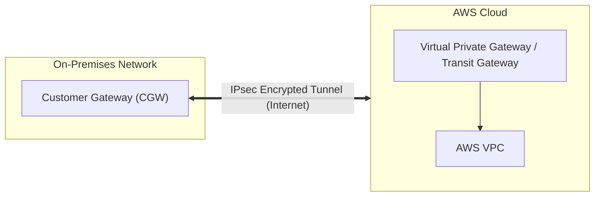

Traffic is encrypted using **IPsec VPN tunnels**.

---

# 4. When Should You Choose VPN?

VPN is attractive when you want:

* Fast deployment
* Lower upfront cost
* Encrypted connectivity
* No dedicated circuit
* Temporary connectivity
* Backup connectivity

### Exam clue

> "Quickly establish secure connectivity between on-premises and AWS."

→ **Site-to-Site VPN**

---

# 5. VPN Cost / Operational Trade-Off

Advantages:

```text
Low setup complexity
+
Lower cost
+
Fast deployment
+
Encrypted
```

Disadvantages:

```text
Internet dependency
+
Less predictable network performance
+
Potentially higher latency/jitter
```

So:

> **VPN is usually the lower-complexity and lower-cost option, but not the best choice when consistent high-performance connectivity is required.**

---

# 6. AWS Direct Connect

Think:

> **Dedicated private network connection from your environment to AWS.**

Conceptually:

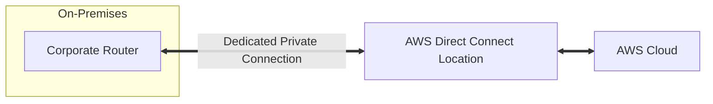

Unlike VPN:


Direct Connect does not send your traffic across the public Internet in the same way.

---

# 7. Why Direct Connect?

Choose Direct Connect when the requirements include:

* Consistent network performance
* High bandwidth
* Predictable latency
* Large data transfers
* Hybrid cloud architecture
* Long-term enterprise connectivity

### Exam clue

> "Predictable network performance"

→ **Direct Connect**

---

# 8. Direct Connect Is NOT Automatically Encrypted

Very important exam trap.

Direct Connect provides a private connection, but:

> **Direct Connect itself does not inherently encrypt your traffic.**

If encryption is required, you can use an additional VPN over the Direct Connect path in appropriate architectures.

Think:

```mermaid
flowchart LR
    DX["Direct Connect"] + VPN["IPsec VPN"] --> Secure["Private + Encrypted Connectivity"]
```

---

# 9. Direct Connect vs VPN

| Feature | Site-to-Site VPN | Direct Connect |
|---|---|---|
| Uses Internet | ✅ | ❌ |
| IPsec encryption | ✅ | ❌ by itself |
| Dedicated connection | ❌ | ✅ |
| Setup speed | Fast | Slower |
| Initial complexity | Low | Higher |
| Cost | Lower | Higher |
| Performance predictability | Lower | Higher |
| Large data transfer | Less ideal | Excellent |
| Enterprise hybrid | Good | Excellent |
| Backup connectivity | Excellent | Excellent |

### Memorize:

> **VPN = fast, cheap, encrypted**

> **Direct Connect = dedicated, predictable, high-performance**

---

# 10. Direct Connect + VPN

This is an excellent exam architecture.

Suppose:

> "The company needs predictable connectivity but also requires encryption."

Use:

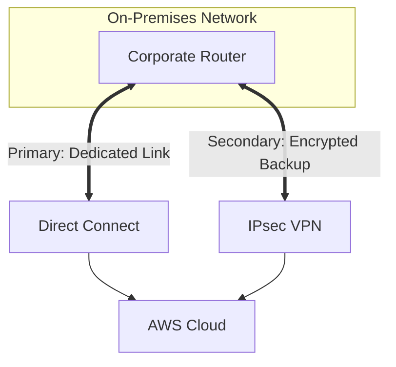

The exact architecture depends on the requirement, but the key idea is:

> **Direct Connect provides dedicated connectivity; VPN can provide encryption and/or redundancy.**

---

# 11. High Availability — Very Important

Don't design:


That's a single point of failure.

Prefer redundancy:

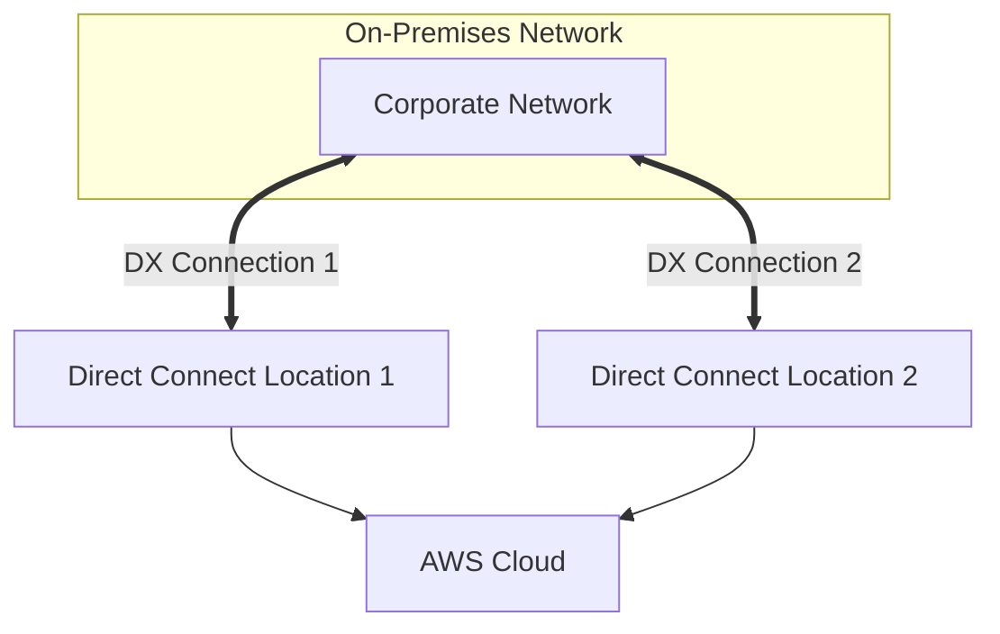

Or use different locations/paths where appropriate.

---

# 12. VPN High Availability

AWS Site-to-Site VPN provides redundant tunnels for a VPN connection.

Conceptually:

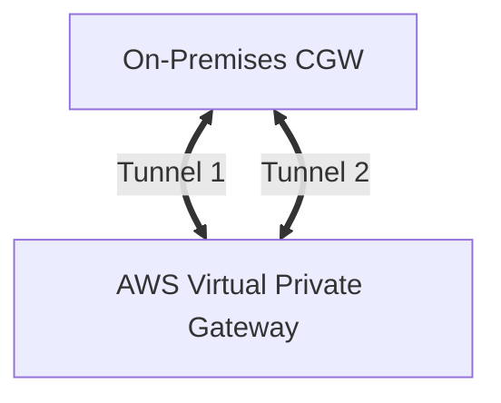

Don't think of a single VPN tunnel as your entire HA strategy.

---

# 13. Co-Location — What Does It Mean?

A co-location facility is a data center where your organization can place its own networking/equipment and connect to network providers and cloud services.

Think:

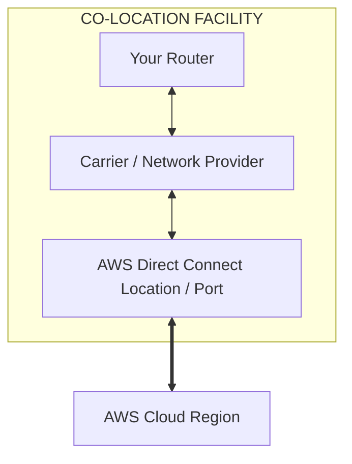

This is particularly relevant to **Direct Connect**.

---

# 14. Direct Connect and Co-Location

A common architecture:


The co-location facility can provide access to the AWS Direct Connect location.

### Exam clue

> "Company has equipment in a co-location facility and wants a dedicated private connection to AWS."

→ **Direct Connect**

---

# 15. Direct Connect Location vs Region

Another useful concept:

A Direct Connect connection is established at a **Direct Connect location**, and then connectivity is associated with AWS resources through the appropriate Direct Connect constructs.

You don't necessarily need your physical equipment to sit inside an AWS data center.

Think:

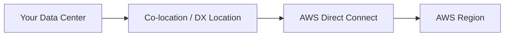

---

# 16. Direct Connect Virtual Interfaces

This is an important exam concept.

Direct Connect uses **virtual interfaces (VIFs)**.

Three useful categories:

### Private VIF

Connects to:

* VPC via Virtual Private Gateway
* Certain architectures through Direct Connect Gateway

Think:

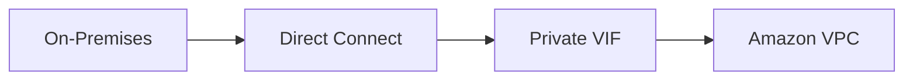

---

### Public VIF

Used to access:

* AWS public services
* Public AWS endpoints

Think:

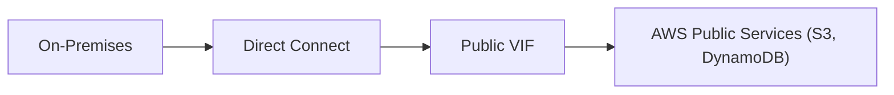

---

### Transit VIF

Used to connect through:

**Direct Connect Gateway + Transit Gateway**

Think:

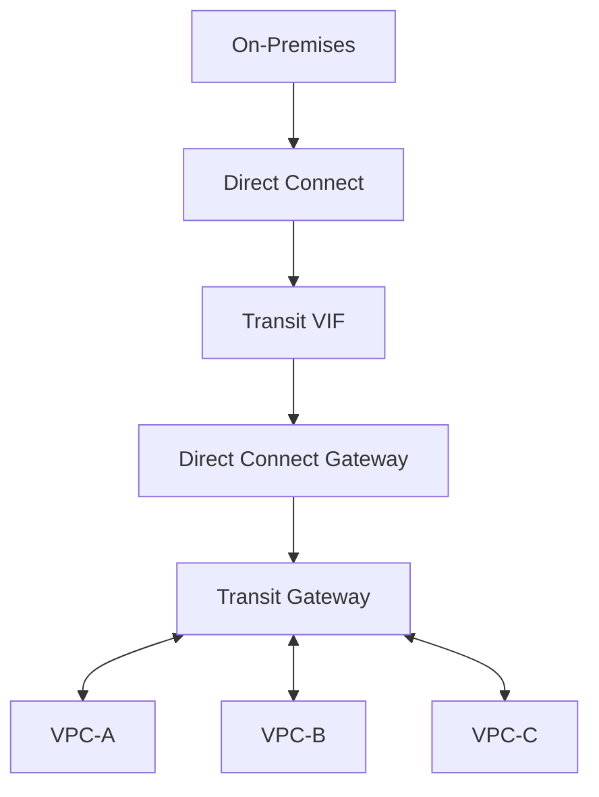

This is extremely useful for multiple VPCs.

---

# 17. Direct Connect Gateway

Suppose you have:

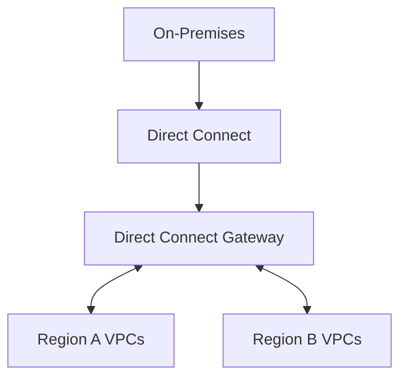

A Direct Connect Gateway helps extend Direct Connect connectivity to multiple VPC-related environments/regions through supported AWS architectures.

### Exam clue

> "One Direct Connect connection needs to reach multiple VPCs."

Think:

**Direct Connect Gateway**, often with **Transit Gateway** depending on architecture.

---

# 18. Direct Connect + Transit Gateway

This is a major enterprise pattern.

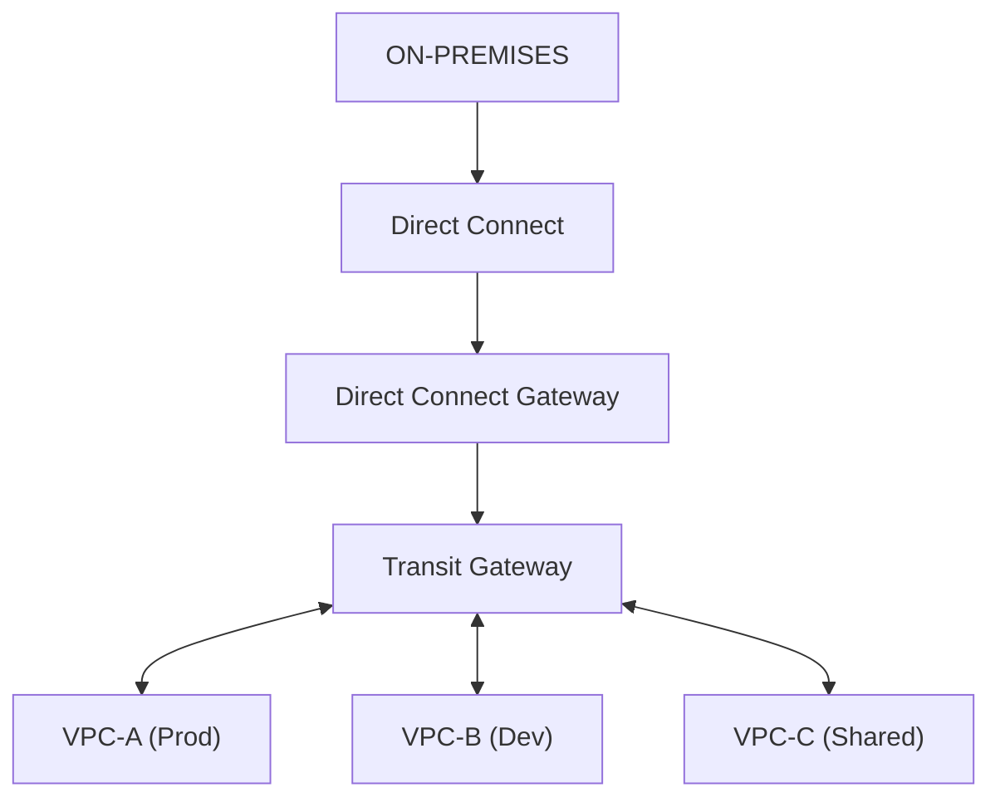

This gives you:

* Dedicated hybrid connectivity
* Centralized VPC routing
* Scalable architecture
* Lower operational complexity than managing many independent connections

---

# 19. Why Not Connect Every VPC Individually?

Imagine:

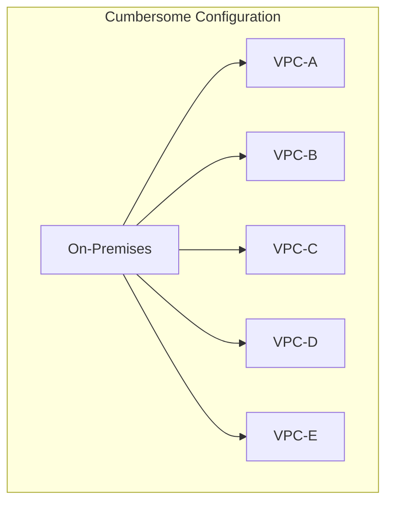

Managing separate connectivity for every VPC becomes cumbersome.

Instead:

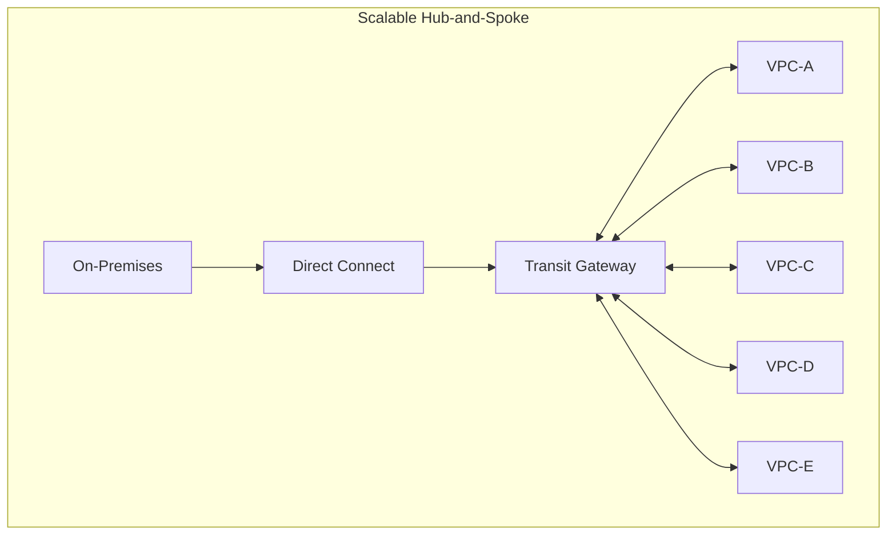

Much easier to manage.

---

# 20. Transit Gateway's Role

Important distinction:

**Direct Connect** answers:

> "How do I connect my on-premises network to AWS?"

**Transit Gateway** answers:

> "How do I route traffic between many connected networks/VPCs?"

Together:

```mermaid
flowchart TD
    OnPrem["On-Premises"] --> DX["Direct Connect"] --> TGW["Transit Gateway Hub"]
    TGW <--> VPC1["VPC 1"]
    TGW <--> VPC2["VPC 2"]
    TGW <--> VPC3["VPC 3"]
    TGW <--> VPC4["VPC 4"]
```

---

# 21. VPN + Transit Gateway

Same concept with VPN:

```mermaid
flowchart TD
    OnPrem["On-Premises"] ==>|"IPsec VPN"| TGW["Transit Gateway"]
    TGW <--> VPCA["VPC A"]
    TGW <--> VPCB["VPC B"]
    TGW <--> VPCC["VPC C"]
```

This is useful when:

* You have multiple VPCs
* You need encrypted hybrid connectivity
* You don't need a dedicated Direct Connect circuit

---

# 22. VPN vs Direct Connect — Cost Strategy

### Small / temporary workload

```text
VPN
```

Why?

```text
Low setup
Low complexity
Fast
Encrypted
```

### Large / permanent workload

```text
Direct Connect
```

Why?

```text
Predictable
High bandwidth
Consistent performance
```

### Critical enterprise workload

```text
Direct Connect
+
VPN backup
```

or redundant Direct Connect connectivity depending on requirements.

---

# 23. PrivateLink in Hybrid/Cloud Integration

PrivateLink can also appear in these questions.

Suppose:

```mermaid
flowchart LR
    VPCA["VPC-A"] --> PL["PrivateLink"] --> ServiceB["Specific Service in VPC-B"]
```

You don't need:

```text
VPC-A ↔ entire VPC-B
```

You only need:

```text
VPC-A → specific service
```

So:

> **PrivateLink = service-level integration**

---

# 24. Cloud-to-Cloud Integration

Suppose you have:

```mermaid
flowchart LR
    AWSVPC["AWS VPC-A"] <== "VPN / SD-WAN / Co-Lo Exchange" ==> OtherCloud["Other Cloud Network (Azure / GCP)"]
```

For general private connectivity to another cloud provider, common approaches include:

* Site-to-Site VPN
* Dedicated connectivity through a network provider
* Co-location / connectivity exchange
* SD-WAN/networking solutions

The exam will usually give you clues about:

* Encryption
* Dedicated connectivity
* Performance
* Cost
* Speed of deployment

---

# 25. Hybrid Connectivity Decision Tree

This is the most useful section.

```mermaid
flowchart TD
    Start{"Need Hybrid Connectivity?"} --> AskType{"On-premises ➔ AWS?"}
    
    AskType -->|Quick / Low-cost / Encrypted| VPN["Site-to-Site VPN"]
    AskType -->|Dedicated / Predictable / High-BW| DX["Direct Connect"]

    VPN --> MultiVPC{"Multiple VPCs?"}
    DX --> MultiVPC

    MultiVPC -->|YES| TGW["Attach via Transit Gateway"]
    MultiVPC -->|NO| DirectConn["Direct Connection to VPC / VGW"]
```

So:

```mermaid
flowchart TD
    OnPrem["On-Premises"] --> Link["VPN / Direct Connect"] --> TGW["Transit Gateway"]
    TGW <--> VPCA["VPC A"]
    TGW <--> VPCB["VPC B"]
    TGW <--> VPCC["VPC C"]
```

---

# 26. Full Enterprise HLD

A very exam-friendly architecture:

```mermaid
flowchart TD
    subgraph Corporate["CORPORATE NETWORK"]
        CorpRouter["Corporate Router"]
    end

    CorpRouter <== "Primary: Direct Connect" ==> DXGW["Direct Connect Gateway"]
    CorpRouter <== "Backup: IPsec VPN" ==> TGW

    DXGW --> TGW["Transit Gateway"]

    TGW <--> VPCA["VPC-A (Production)"]
    TGW <--> VPCB["VPC-B (Development)"]
    TGW <--> VPCC["VPC-C (Shared Services)"]
```

This is the architecture to think about when the question combines:

> **on-premises + multiple VPCs + high availability + centralized routing**

---

# 27. Add Segmentation

You can use Transit Gateway route tables to control connectivity:

```mermaid
flowchart TD
    TGW["Transit Gateway"] --> ProdRT["Production Route Table"]
    TGW --> DevRT["Dev Route Table"]
    TGW --> SharedRT["Shared Route Table"]

    ProdRT --> ProdVPC["Production VPC"]
    DevRT --> DevVPC["Dev VPC"]
    SharedRT --> SharedVPC["Shared Services VPC"]
```

Example policy:

```text
On-Prem → Prod       ✅
On-Prem → Shared     ✅
On-Prem → Dev        ✅

Prod → Dev            ❌
Dev → Prod            ❌
Prod → Shared         ✅
Dev → Shared          ✅
```

This is much more manageable than building individual connections everywhere.

---

# 28. Co-Location HLD

Suppose your company owns networking equipment in a co-location facility.

```mermaid
flowchart TD
    subgraph CoLo["CO-LOCATION FACILITY"]
        CorpRouter["Corporate Router"] <--> Carrier["Network Provider"] <--> DXLocation["AWS Direct Connect Location"]
    end

    DXLocation <==> AWS["AWS Cloud"]
```

This is useful when:

* Your data center isn't physically near AWS
* You need dedicated connectivity
* A co-location provider can facilitate connectivity

---

# 29. Cost Trade-Off Matrix

| Option | Cost | Performance | Encryption | Setup | Operational overhead |
|---|--:|---|---|---|---|
| Site-to-Site VPN | Low | Variable | ✅ | Fast | Low |
| Direct Connect | Higher | Predictable | ❌ by itself | Slower | Medium |
| Direct Connect + VPN | Higher | High | ✅ | Higher | Medium |
| TGW | Additional | High | N/A | Moderate | Low at scale |
| PrivateLink | Usage-dependent | High/private | Private | Moderate | Low |
| Cloud WAN | Enterprise | High | Depends | Higher | Low relative to global scale |

---

# 30. "Minimum Workload" / Least Operational Overhead

This is the pattern you want to recognize.

### Requirement

> "Small office needs secure AWS connectivity."

Don't choose:

```text
Direct Connect
+ Transit Gateway
+ DX Gateway
```

unless the requirements justify it.

Choose:

```text
Site-to-Site VPN
```

---

### Requirement

> "Large data center transfers terabytes of data to AWS every day with predictable performance."

Think:

```text
Direct Connect
```

---

### Requirement

> "20 VPCs need to communicate with on-premises."

Think:

```mermaid
flowchart LR
    Conn["Direct Connect / VPN"] --> TGW["Transit Gateway"] --> VPCs["20 VPCs"]
```

---

### Requirement

> "Only one application API needs to be exposed to another VPC."

Think:

```text
PrivateLink
```

---

# 31. Reliability Trade-Off

For business-critical hybrid connectivity:

```text
Single connection
      ↓
Single point of failure
```

Better:

```mermaid
flowchart TD
    subgraph OnPrem["On-Premises"]
        Corp["Corporate Network"]
    end

    Corp <== "Primary" ==> DX["Direct Connect"] --> AWS["AWS Cloud"]
    Corp <== "Backup" ==> VPN["IPsec VPN"] --> AWS
```

Or:

```mermaid
flowchart TD
    subgraph OnPrem["On-Premises"]
        Corp["Corporate Network"]
    end

    Corp <== "Link 1" ==> DX1["DX Connection 1"] --> AWS["AWS Cloud"]
    Corp <== "Link 2" ==> DX2["DX Connection 2"] --> AWS
```

For the exam:

> **Critical connectivity → eliminate single points of failure.**

---

# 32. Direct Connect vs VPN — What the Question Is Really Testing

When you see:

### "Low cost"

Think:

**VPN**

### "Fast setup"

Think:

**VPN**

### "Encrypted over Internet"

Think:

**VPN**

### "Dedicated connection"

Think:

**Direct Connect**

### "Predictable performance"

Think:

**Direct Connect**

### "High bandwidth"

Think:

**Direct Connect**

### "Critical hybrid architecture"

Think:

**Redundant DX and/or VPN**

---

# 33. Don't Confuse Direct Connect with Transit Gateway

This is a very common exam mistake.

### Direct Connect

```text
Connectivity technology
```

It gets you:

```text
On-Premises → AWS
```

### Transit Gateway

```text
Routing hub
```

It gets you:

```mermaid
flowchart TD
    TGW["Transit Gateway (Central Routing Hub)"] <--> VPCA["VPC-A"]
    TGW <--> VPCB["VPC-B"]
    TGW <--> VPCC["VPC-C"]
    TGW <--> OnPrem["On-Premises"]
```

So:

```mermaid
flowchart LR
    OnPrem["On-Premises"] --> DX["Direct Connect"] --> TGW["Transit Gateway"] --> VPCs["VPC-A, VPC-B, VPC-C"]
```

They solve **different layers of the problem**.

---

# 34. Direct Connect Gateway vs Transit Gateway

Think:

```text
Direct Connect Gateway
        ↓
Connect Direct Connect
to supported AWS networking resources

Transit Gateway
        ↓
Centralized routing
between VPCs/networks
```

In an enterprise architecture they can work together:

```mermaid
flowchart LR
    OnPrem["On-Prem"] --> DX["Direct Connect"] --> DXGW["Direct Connect Gateway"] --> TGW["Transit Gateway"] --> VPCs["VPC-A, VPC-B, VPC-C"]
```

---

# 35. Final Exam Decision Tree

Memorize this:

```mermaid
flowchart TD
    Start["ON-PREM ➔ AWS"] --> Priority{"What is the priority?"}
    
    Priority -->|Cheap + Fast Setup| VPN["Site-to-Site VPN"]
    Priority -->|Dedicated + Predictable| DX["Direct Connect"]

    DX --> MultiVPC{"Multiple VPCs?"}
    MultiVPC -->|YES| TGW["Transit Gateway"]
    MultiVPC -->|NO| VGW["VGW / Single VPC"]
```

Then:

```mermaid
flowchart TD
    Specific{"Specific service only?"} -->|YES| PL["PrivateLink"]
```

And:

```mermaid
flowchart TD
    Global{"Global enterprise network?"} -->|YES| WAN["AWS Cloud WAN"]
```

---

# 🧠 Final AWS Exam Cheat Sheet

| If the question says... | Think... |
|---|---|
| **Quick connectivity** | VPN |
| **Low-cost hybrid connectivity** | VPN |
| **Encrypted connectivity over Internet** | VPN |
| **Dedicated connection** | Direct Connect |
| **Predictable performance** | Direct Connect |
| **High bandwidth / large data transfer** | Direct Connect |
| **Co-location** | Direct Connect |
| **Multiple VPCs + on-prem** | Transit Gateway |
| **Centralized routing** | Transit Gateway |
| **Transitive routing** | Transit Gateway |
| **Direct Connect to multiple VPCs** | DX Gateway + TGW architecture |
| **Specific service only** | PrivateLink |
| **Global enterprise network** | Cloud WAN |
| **High availability** | Redundant connectivity |
| **VPN backup for DX** | DX + VPN |
| **Audit AWS API actions** | CloudTrail |
| **Monitor network traffic** | Flow Logs |

## 🏆 The mental model

Think of the architecture as **three separate questions**:

```mermaid
flowchart TD
    Q1{"1. HOW DO I GET INTO AWS?"}
    Q1 --> VPN["Site-to-Site VPN"]
    Q1 --> DX["Direct Connect"]

    Q2{"2. HOW DO I REACH MANY VPCS?"} --> TGW["Transit Gateway"]

    Q3{"3. DO I NEED THE WHOLE NETWORK?"}
    Q3 -->|YES| TGW_Peer["TGW / Peering"]
    Q3 -->|NO| PrivateLink["PrivateLink"]
```

And the **exam trade-off hierarchy** is:

> **VPN → cheapest/quickest/operationally simple**  
> **Direct Connect → dedicated/predictable/high bandwidth**  
> **Transit Gateway → scalable centralized routing**  
> **PrivateLink → least-privilege service-level connectivity**  
> **Cloud WAN → large-scale global network management**  
> **Redundancy → required when hybrid connectivity is business-critical**

That distinction—**connectivity path vs routing hub vs service-level connectivity**—is the key to solving most AWS hybrid connectivity questions.