# AWS — Troubleshooting Traffic Flows Using AWS Tools

For the exam, this topic is about answering:

> **"Traffic is not reaching its destination. Where is it failing, and which AWS tool should I use to prove it?"**

The key is to distinguish between:

* **Is the network path possible?**
* **What actually happened to the traffic?**
* **Is traffic being allowed/denied?**
* **Is DNS resolving correctly?**
* **Is the application reachable?**
* **Is the network healthy/performance acceptable?**

---

# 1. The Big Picture

Imagine:

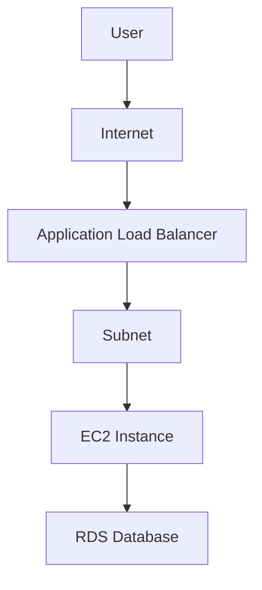

If the user says:

> "The application is unreachable."

Don't randomly change security groups.

Trace the path:

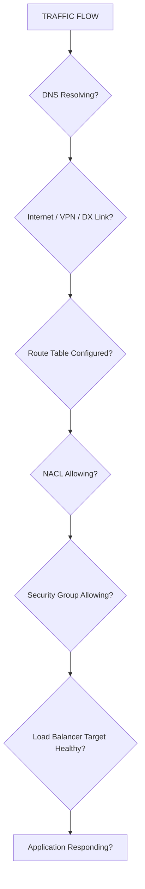

Then use the AWS tool that answers each question.

---

# 2. The Most Important Tools

For exam purposes, memorize these:

| Tool | Main purpose |
|---|---|
| **VPC Reachability Analyzer** | Determine whether a network path is possible |
| **VPC Flow Logs** | See traffic metadata / accepted or rejected traffic |
| **AWS Transit Gateway Network Manager** | Monitor/manage complex network connectivity |
| **Route 53 Resolver / DNS tools** | Troubleshoot DNS resolution |
| **CloudWatch** | Metrics, logs, alarms, network/application health |
| **CloudTrail** | Who changed networking configuration |
| **AWS Network Firewall logging/monitoring** | Firewall traffic inspection |
| **Load Balancer access logs / CloudWatch** | Troubleshoot LB traffic |
| **Reachability Analyzer** | Analyze configuration path |
| **Network Access Analyzer** | Analyze whether network access meets intended policies |

The **two most important for traffic-flow questions** are:

> **Reachability Analyzer = Can traffic get there?**  
> **VPC Flow Logs = What traffic actually happened?**

---

# 3. VPC Reachability Analyzer

This is one of the most important exam tools.

Think:

> **"Can A reach B?"**

Example:

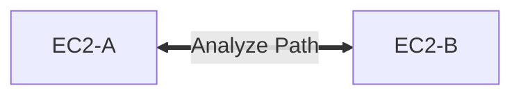

You can analyze the path.

Conceptually:

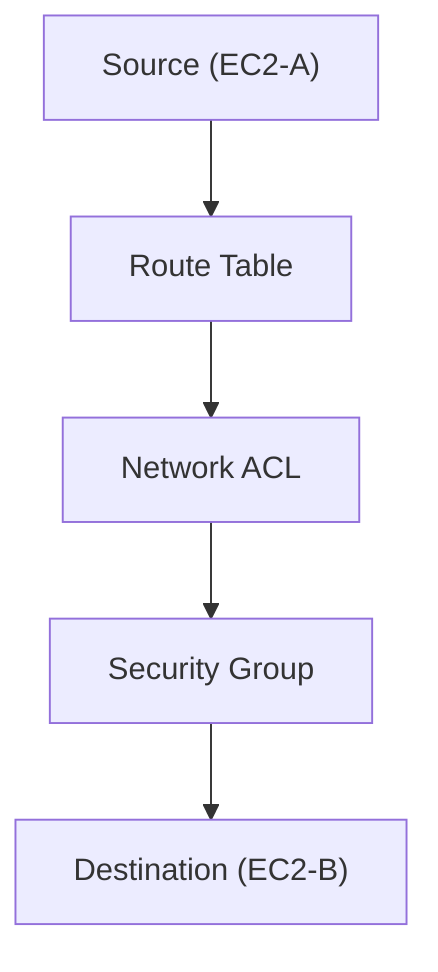

Reachability Analyzer analyzes the configured network path and can identify where connectivity is blocked.

---

# 4. Reachability Analyzer Example

Suppose:

```text
EC2-A → EC2-B (TCP 443)
```

But the connection fails.

Reachability Analyzer might identify something like:

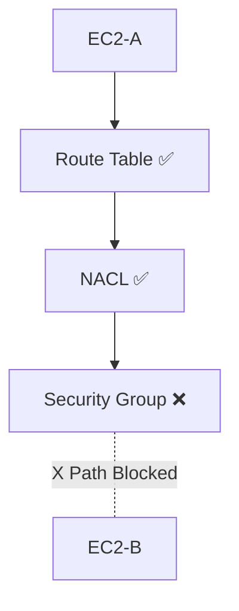

Now you know:

> **The security group configuration prevents the analyzed path.**

This is much better than manually inspecting everything.

---

# 5. Reachability Analyzer = Configuration Analysis

Very important:

**Reachability Analyzer does not simply mean "look at packets that already traveled."**

Think:

> **It analyzes whether the configured network path is reachable.**

So:

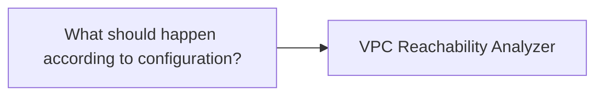

---

# 6. VPC Flow Logs

Now consider a different question:

> "Did traffic actually reach the ENI?"

Use:

**VPC Flow Logs**

Flow Logs capture metadata about IP traffic to/from network interfaces and supported VPC resources.

Conceptually:

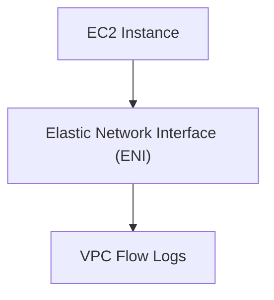

You can see information such as:

* Source IP
* Destination IP
* Source port
* Destination port
* Protocol
* Accept/reject status
* Bytes
* Packets
* Time information

---

# 7. Flow Logs Example

Suppose:

```text
10.0.1.10 → 10.0.2.20 : 443
```

Flow Logs might show:

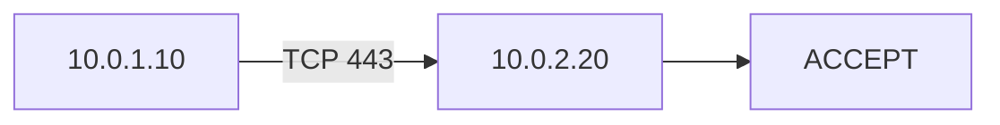

or:

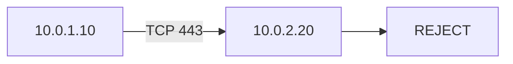

This gives you evidence about observed traffic.

---

# 8. Reachability Analyzer vs Flow Logs

This distinction is **highly exam relevant**.

| Question | Tool |
|---|---|
| Can this source reach this destination? | **Reachability Analyzer** |
| Where does the configured path fail? | **Reachability Analyzer** |
| Did traffic actually reach the network interface? | **VPC Flow Logs** |
| Was traffic accepted/rejected? | **VPC Flow Logs** |
| Need historical traffic metadata? | **VPC Flow Logs** |

### Memorize:

> **Reachability Analyzer = path**  
> **Flow Logs = traffic evidence**

---

# 9. Security Group Troubleshooting

Security Groups are **stateful**.

Example:

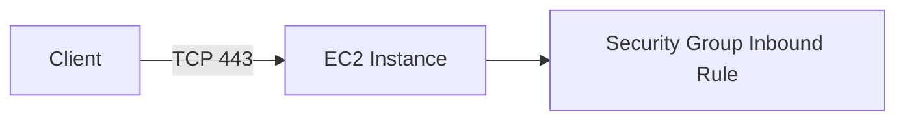

If SG doesn't allow:

```text
Inbound TCP 443
```

connection can fail.

Check:

* Source
* Destination
* Protocol
* Port
* Security Group

---

# 10. Network ACL Troubleshooting

NACLs are **stateless**.

This is a major exam point.

Suppose:

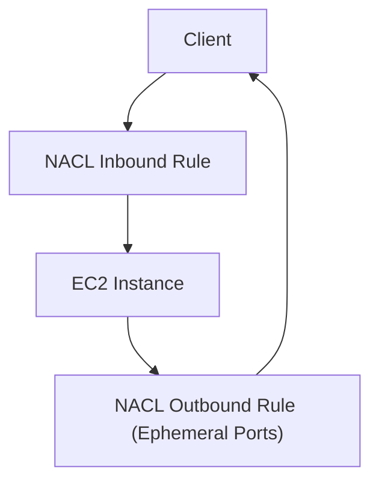

You need to consider both directions:

```text
Inbound + Outbound
```

For return traffic, the NACL must allow the corresponding ephemeral ports as required.

### Exam trap

> "Security group is allowing traffic, but connection still fails."

Don't assume SG is the only control.

Check:

**NACL + route table + other network controls.**

---

# 11. Route Table Troubleshooting

A very common failure:

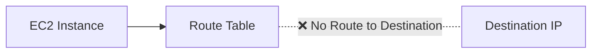

Example:

```text
Destination      Target
10.0.0.0/16      local
0.0.0.0/0        NAT Gateway
```

If the destination is:

```text
192.168.0.0/16
```

but there is no route:

```text
192.168.0.0/16 → ???
```

traffic cannot get there.

### Exam clue

> "No route to destination."

→ **Route table**

---

# 12. Internet Connectivity Troubleshooting

For:

```text
Private EC2 → Internet
```

typical path:

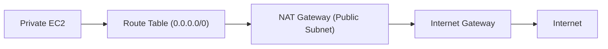

For a private subnet, the default route commonly points to a NAT Gateway for outbound Internet access.

---

# 13. Public EC2 Connectivity

For:

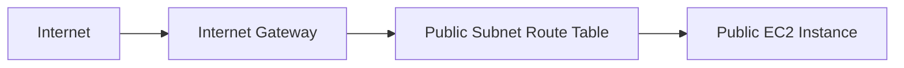

Check:

1. Public IPv4 address / appropriate public connectivity
2. Route table
3. Internet Gateway
4. Security Group
5. NACL
6. Instance/application listening on the expected port

---

# 14. NAT Gateway Troubleshooting

Private EC2 cannot access the Internet.

Architecture:

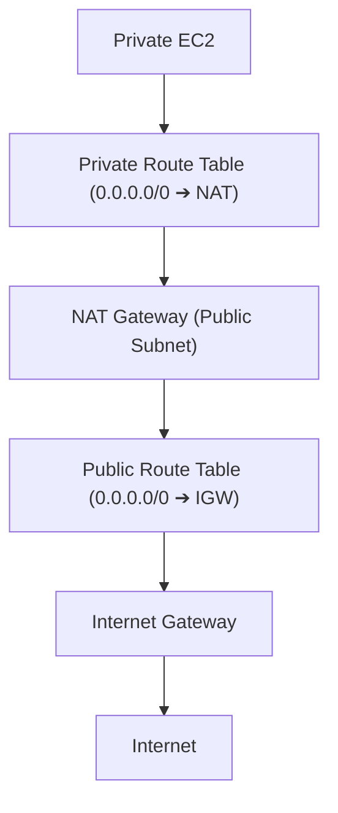

Check:

```text
Private subnet route
        ↓
0.0.0.0/0 → NAT Gateway
        ↓
NAT Gateway in public subnet
        ↓
Public subnet route
        ↓
Internet Gateway
```

A common exam mistake:

> Putting a NAT Gateway in a private subnet.

The NAT Gateway needs appropriate public subnet connectivity.

---

# 15. DNS Troubleshooting

Sometimes the network works, but:

```text
www.example.com
```

doesn't resolve.

Then your problem isn't necessarily routing.

Think:

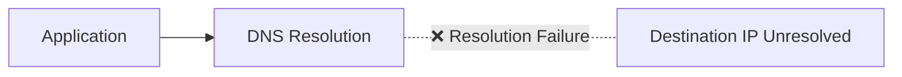

Use:

* Route 53
* Route 53 Resolver
* DNS query tools
* VPC DNS settings
* Resolver query logging where applicable

---

# 16. Route 53 Resolver

For hybrid DNS:

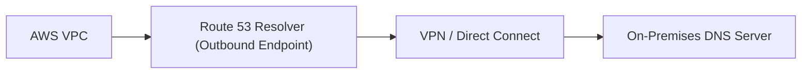

Typical troubleshooting question:

> "AWS workloads need to resolve on-premises domain names."

Think:

**Route 53 Resolver outbound endpoint + forwarding rule**, with appropriate connectivity and DNS configuration.

---

# 17. On-Premises → AWS DNS

Suppose:

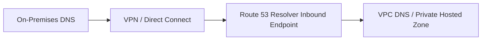

For DNS queries originating on-premises and resolving AWS-hosted names, think about:

**Route 53 Resolver inbound endpoint**

---

# 18. CloudWatch

CloudWatch is broader.

Think:

> **"Is the infrastructure/application healthy?"**

Examples:

```text
EC2 CPU
NetworkIn
NetworkOut
ALB request count
ALB errors
NAT Gateway metrics
VPN metrics
Transit Gateway metrics
Application logs
```

CloudWatch helps identify:

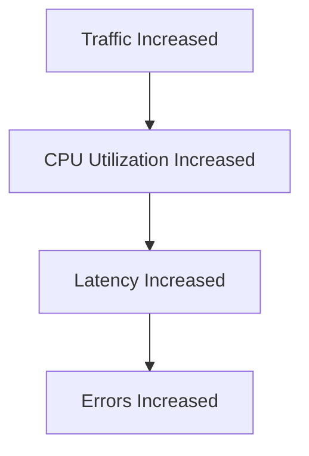

---

# 19. CloudWatch vs Flow Logs

Another exam distinction.

### CloudWatch

```text
Metrics
Logs
Alarms
Dashboards
```

### VPC Flow Logs

```text
Network traffic metadata
Accept/reject
Source/destination
Ports/protocol
```

So:

> **"Monitor traffic records" → Flow Logs**  
> **"Monitor resource metrics / create alarms" → CloudWatch**

---

# 20. CloudTrail

CloudTrail answers a different question:

> **"Who changed my network configuration?"**

Suppose connectivity suddenly stopped.

You discover:

```text
Route table
   ↓
Wrong route
```

Now ask:

> Who changed it?

Use:

**AWS CloudTrail**

Example:

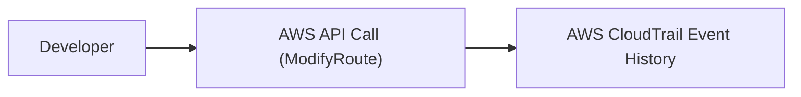

---

# 21. The Three-Way Troubleshooting Model

This is worth memorizing:

```mermaid
flowchart TD
    Problem["NETWORK PROBLEM"] --> Q1{"Can it reach?"}
    Problem --> Q2{"What actually happened?"}
    Problem --> Q3{"Who changed configuration?"}

    Q1 --> RA["VPC Reachability Analyzer"]
    Q2 --> FL["VPC Flow Logs"]
    Q3 --> CT["AWS CloudTrail"]

    Problem --> Healthy{"Resource Healthy?"} --> CW["Amazon CloudWatch"]
    Problem --> DNS{"DNS Issue?"} --> R53["Route 53 Resolver"]
```

---

# 22. Transit Gateway Troubleshooting

Suppose:

```mermaid
flowchart TD
    VPCA["VPC-A Route Table"] --> AttA["TGW Attachment A"] --> TGWRT["TGW Route Table"] --> AttB["TGW Attachment B"] --> VPCB["VPC-B Route Table"] --> SG["Security Groups"]
```

Traffic isn't working.

Check:

```text
VPC-A route table
        ↓
Transit Gateway attachment
        ↓
TGW route table
        ↓
VPC-B attachment
        ↓
VPC-B route table
        ↓
Security controls
```

A common problem is that the VPC route table sends traffic to TGW, but the TGW route table doesn't have the destination route.

---

# 23. Transit Gateway Route Table

Example:

```mermaid
flowchart TD
    TGW["Transit Gateway"] --> TGWRT["TGW Route Table"]
    TGWRT <--> AttA["VPC-A Attachment"]
    TGWRT <--> AttB["VPC-B Attachment"]
    TGWRT <--> AttC["VPC-C Attachment"]
```

Suppose:

```text
VPC-A → VPC-B
```

but TGW route table doesn't know:

```text
10.2.0.0/16 → VPC-B attachment
```

Then:

```mermaid
flowchart LR
    VPCA["VPC-A"] --> TGW["TGW Route Table"] -. "❌ No Route" .- VPCB["VPC-B"]
```

Use route analysis/configuration inspection and Reachability Analyzer where supported to help identify the path issue.

---

# 24. VPC Peering Troubleshooting

VPC Peering is **not transitive**.

Example:

```mermaid
flowchart LR
    VPCA["VPC-A"] <== "Peering 1" ==> VPCB["VPC-B"] <== "Peering 2" ==> VPCC["VPC-C"]
    VPCA -. "❌ No Transitive Path (A ↔ C)" .- VPCC
```

You cannot assume:

```text
VPC-A → VPC-C
```

will work through VPC-B.

For many VPCs:

```mermaid
flowchart TD
    TGW["Transit Gateway Hub"] <--> VPCA["VPC-A"]
    TGW <--> VPCB["VPC-B"]
    TGW <--> VPCC["VPC-C"]
```

is generally easier to manage.

---

# 25. Network Firewall

If traffic passes through:

```mermaid
flowchart LR
    VPC["VPC"] --> Firewall["AWS Network Firewall"] --> Dest["Destination"]
```

and connectivity fails, investigate firewall rules and firewall logs.

Think:

> **Network Firewall = centralized network inspection/filtering**

---

# 26. Load Balancer Troubleshooting

Suppose:

```mermaid
flowchart LR
    Client["Client"] --> ALB["Application Load Balancer"] --> Target["Target Instance (EC2 / Container)"]
```

Client gets:

```text
502 / 503
```

Don't immediately blame the network.

Check:

* Target health
* Security groups
* Target port
* Listener
* Target group
* Application response
* ALB metrics/logs

---

# 27. VPC Flow Logs — Where Can You Enable Them?

Flow Logs can be associated with supported resources such as:

* VPC
* Subnet
* Network interface

The exact scope matters.

For exam questions:

> "Need visibility into traffic entering/leaving network interfaces."

Think:

**VPC Flow Logs**

---

# 28. What Flow Logs Don't Do

Don't think:

> "Flow Logs are packet captures."

They're not a full packet capture mechanism.

They provide **metadata about network flows**.

Think:

```text
Source
Destination
Port
Protocol
Action
Bytes
Packets
Time
```

rather than:

```text
Full packet payload
```

---

# 29. Reachability Analyzer vs Packet Capture

If the question asks:

> "Why can't EC2-A reach EC2-B?"

Use:

**Reachability Analyzer**

If the question asks:

> "Show me observed network traffic and whether it was accepted/rejected."

Use:

**VPC Flow Logs**

If the question asks:

> "Show me the actual packet contents."

That's a different requirement; Flow Logs aren't packet captures.

---

# 30. AWS Network Manager

For larger networks involving:

* Transit Gateways
* On-premises networks
* Hybrid connectivity
* Global network topology

AWS Network Manager can provide centralized visibility and management capabilities.

Think:

```mermaid
flowchart TD
    NetMgr["AWS Network Manager (Centralized Topology Visibility)"]
    NetMgr <--> VPCs["Amazon VPCs"]
    NetMgr <--> TGWs["Transit Gateways"]
    NetMgr <--> OnPrem["On-Premises Sites"]
```

Useful for enterprise network visibility.

---

# 31. Troubleshooting Method — The Layered Approach

This is how I'd approach almost every AWS networking exam question.

```mermaid
flowchart TD
    Step1["1. DNS Resolution"] --> Step2["2. Physical / Link Connectivity"]
    Step2 --> Step3["3. Route Table Routing"]
    Step3 --> Step4["4. Network ACL Filtering"]
    Step4 --> Step5["5. Security Group Filtering"]
    Step5 --> Step6["6. Firewall Inspection Rules"]
    Step6 --> Step7["7. Load Balancer Listener & Target Health"]
    Step7 --> Step8["8. Application Processing"]
```

And select tools accordingly.

---

# 32. Full HLD Troubleshooting Example

Suppose:

> Users cannot access an application.

Architecture:

```mermaid
flowchart TD
    User["USER"] --> R53["Route 53"] --> Edge["Internet / Edge"] --> ALB["Application Load Balancer"]
    
    subgraph Region["AWS Region"]
        subgraph AZA["AZ-A"]
            EC2A["EC2 Instance A"]
        end
        subgraph AZB["AZ-B"]
            EC2B["EC2 Instance B"]
        end
        
        DB["Database"]
    end

    ALB --> EC2A
    ALB --> EC2B
    EC2A --> DB
    EC2B --> DB
```

Troubleshoot:

### Step 1 — DNS

```text
Does hostname resolve?
```

Use:

**Route 53 / DNS tools**

---

### Step 2 — ALB

```text
Is ALB reachable?
Are targets healthy?
```

Use:

**CloudWatch + ALB target health/logs**

---

### Step 3 — Network path

```text
ALB → EC2
```

Use:

**Reachability Analyzer**

---

### Step 4 — Actual traffic

```text
Did traffic reach EC2 ENI?
Was it accepted/rejected?
```

Use:

**VPC Flow Logs**

---

### Step 5 — Configuration change

If the route suddenly changed:

```text
Who modified route?
```

Use:

**CloudTrail**

---

# 33. Tool Selection Cheat Sheet

This table is extremely exam-friendly:

| Problem/question | Best tool |
|---|---|
| Can A reach B? | **Reachability Analyzer** |
| Where does configured path fail? | **Reachability Analyzer** |
| Was traffic accepted/rejected? | **VPC Flow Logs** |
| What traffic entered/leaved an ENI? | **VPC Flow Logs** |
| Resource/network metrics | **CloudWatch** |
| Network/application alarms | **CloudWatch** |
| Who changed route/SG/NACL? | **CloudTrail** |
| DNS resolution problem | **Route 53 Resolver / DNS tools** |
| Hybrid DNS | **Route 53 Resolver** |
| TGW/global network visibility | **AWS Network Manager** |
| Firewall traffic inspection | **Network Firewall logs/monitoring** |
| ALB request/target problem | **ALB logs + CloudWatch + target health** |

---

# 34. The Most Important Exam Comparison

## Reachability Analyzer vs Flow Logs

```mermaid
flowchart TD
    Trouble["Network Troubleshooting"] --> Before["BEFORE / CONFIGURATION ANALYSIS<br/>'Can it work?'"]
    Trouble --> After["AFTER / OBSERVED TRAFFIC<br/>'Did it happen?'"]

    Before --> RA["VPC Reachability Analyzer"]
    After --> FL["VPC Flow Logs"]
```

This is probably the **single most important distinction** for this topic.

---

# 35. Reachability Analyzer vs Network Access Analyzer

These names are easy to confuse.

### Reachability Analyzer

Answers:

> **Can this source reach this destination?**

Example:

```text
EC2-A → EC2-B : TCP 443
```

### Network Access Analyzer

Answers more like:

> **Does my network configuration provide/permit the intended access paths according to a defined network access policy?**

Think:

```mermaid
flowchart TD
    RA["Reachability Analyzer ➔ Specific path analysis"]
    NAA["Network Access Analyzer ➔ Network access policy / broader access analysis"]
```

---

# 36. Cost / Operational Overhead

For exam questions, don't automatically deploy every monitoring tool.

### Need basic traffic visibility?

```text
VPC Flow Logs
```

### Need to prove a path?

```text
Reachability Analyzer
```

### Need metrics/alarms?

```text
CloudWatch
```

### Need audit/change history?

```text
CloudTrail
```

This avoids unnecessary tooling.

---

# 37. Automation

Networking troubleshooting can be automated using:

```mermaid
flowchart LR
    CW["CloudWatch Alarm"] --> EB["EventBridge"] --> Lambda["Lambda / SSM Automation"] --> Action["Automated Remediation"]
```

For example:

```mermaid
flowchart LR
    VPN["VPN Tunnel Down Metric"] --> Alarm["CloudWatch Alarm"] --> EB["EventBridge"] --> Notify["Automation / Notification"]
```

The exact automation depends on the problem.

---

# 38. A Powerful Exam Scenario

### Question

> An EC2 instance cannot connect to another EC2 instance. The administrator wants to identify which network component is preventing communication without manually inspecting every configuration.

### Answer

**VPC Reachability Analyzer**

Why?

Because it analyzes the network path and can identify the blocking component.

---

# 39. Another Scenario

> The administrator wants to determine whether traffic from `10.0.1.10` to `10.0.2.20` on TCP port 443 was accepted or rejected.

Answer:

**VPC Flow Logs**

---

# 40. Another Scenario

> Connectivity worked yesterday but stopped today. The administrator suspects someone modified a route table.

Answer:

**AWS CloudTrail**

Because the question is:

> **Who changed the configuration?**

---

# 41. Another Scenario

> The company wants to monitor network traffic and create alarms when network utilization changes.

Answer:

**CloudWatch + appropriate network metrics/logs**

---

# 42. Another Scenario

> An EC2 instance can reach IP addresses but cannot resolve a private hostname.

Think:

```text
DNS problem
```

Investigate:

**Route 53 Resolver / VPC DNS configuration**

not Reachability Analyzer as the primary answer.

---

# 43. Another Scenario

> An application is reachable, but some packets are being denied.

Think:

**VPC Flow Logs**

Then investigate:

```text
SG
NACL
Firewall
```

depending on where the traffic is being controlled.

---

# 44. Golden Troubleshooting Architecture

Memorize this:

```mermaid
flowchart TD
    User["USER"] --> DNS["DNS"] --> R53["Route 53 Resolver"] --> Path["NETWORK PATH"] --> RA["Reachability Analyzer"] --> RT["Route Tables"] --> NACL["NACL"] --> SG["Security Group"] --> FW["Network Firewall"] --> ALB["Load Balancer"] --> EC2["EC2 / ECS"] --> DB["Database"]
```

And monitoring sits alongside it:

```mermaid
flowchart LR
    CW["CloudWatch (Metrics / Alarms / Logs)"] --> Health["Network Health"]
```

Traffic evidence:

```mermaid
flowchart LR
    Traffic["Traffic"] --> FL["VPC Flow Logs"]
```

Configuration history:

```mermaid
flowchart LR
    API["AWS API Changes"] --> CT["AWS CloudTrail"]
```

---

# 🧠 Final Exam Cheat Sheet

## Memorize these 7 associations

```text
"Can A reach B?"
        ↓
Reachability Analyzer


"Did traffic actually happen?"
        ↓
VPC Flow Logs


"Accepted or rejected?"
        ↓
VPC Flow Logs


"Who changed the network?"
        ↓
CloudTrail


"Metrics / alarms?"
        ↓
CloudWatch


"DNS problem?"
        ↓
Route 53 Resolver / DNS tools


"Large hybrid network visibility?"
        ↓
AWS Network Manager
```

## And the troubleshooting sequence:

```mermaid
flowchart TD
    Fail["APPLICATION FAILURE"] --> DNS{"DNS works?"} --> Net{"Network reachable?"} --> RA["Reachability Analyzer"] --> Observed{"Actual traffic?"} --> FL["VPC Flow Logs"] --> Controls{"Routing / NACL / SG?"} --> FW{"Firewall?"} --> LB{"Load Balancer?"} --> App["Application?"]
```

### 🏆 The exam mental model

> **Reachability Analyzer = "Can it get there?"**  
> **Flow Logs = "What traffic actually occurred?"**  
> **CloudWatch = "How is it performing?"**  
> **CloudTrail = "Who changed it?"**  
> **Route 53 Resolver = "Can it find the destination name?"**  
> **Transit Gateway / Network Manager = "How do I understand and manage complex network connectivity?"**

If you keep those distinctions clear, most AWS networking troubleshooting questions become much easier.