# AWS — Using Service Endpoints for Service Integrations

For the AWS exam, this topic is mainly about answering:

> **"How does my workload access an AWS service, and should that traffic go through the public Internet, a NAT Gateway, an Internet Gateway, or a private endpoint?"**

The most important services/concepts are:

* **VPC endpoints**
* **Gateway endpoints**
* **Interface endpoints / AWS PrivateLink**
* **AWS service endpoints**
* **Endpoint policies**
* **Private DNS**
* **Route 53 Resolver**
* **NAT Gateway**
* **Internet Gateway**
* **Transit Gateway**
* **Cross-account PrivateLink**

---

# 1. Start With the Big Picture

Suppose an EC2 instance in a private subnet needs to access S3.

You have two broad approaches:

### Without VPC endpoint

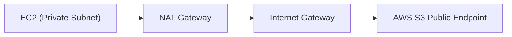

### With VPC endpoint

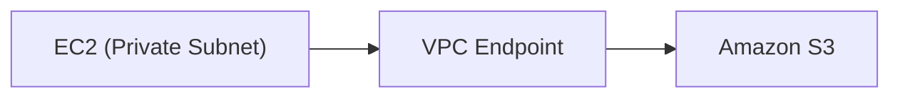

The second architecture can avoid sending the service traffic through a NAT Gateway.

---

# 2. What Is a VPC Endpoint?

A **VPC endpoint** provides private connectivity from a VPC to supported AWS services and endpoint services without requiring an Internet Gateway for that service traffic.

Think:

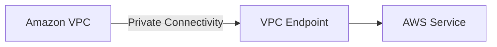

Examples:

```text
EC2 → S3
EC2 → DynamoDB
EC2 → Secrets Manager
EC2 → SSM
EC2 → ECR
EC2 → CloudWatch
```

The exact endpoint type depends on the service.

---

# 3. Why Use VPC Endpoints?

The exam usually gives you one or more of these requirements:

* Keep traffic private
* Avoid Internet/NAT Gateway
* Reduce NAT Gateway costs
* Reduce operational overhead
* Improve security posture
* Restrict access to specific AWS services
* Allow private-subnet workloads to access AWS services

Then think:

> **VPC Endpoint**

---

# 4. Two Major Endpoint Types

This is extremely important:

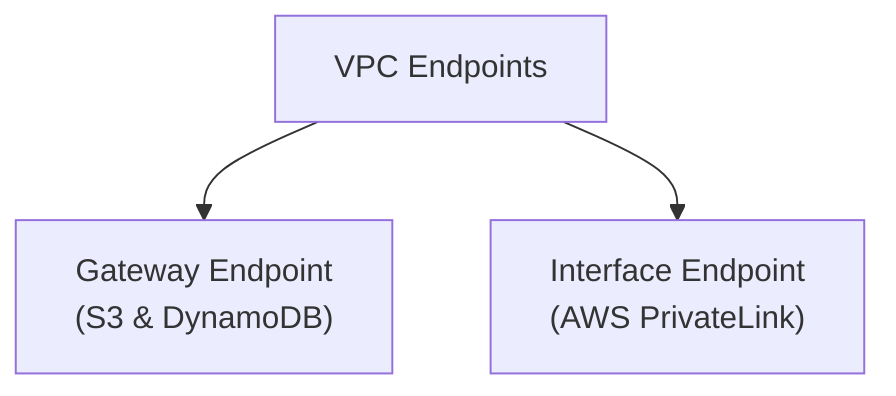

---

# 5. Gateway Endpoint

Gateway endpoints are used for:

* **Amazon S3**
* **Amazon DynamoDB**

That's the exam shortcut.

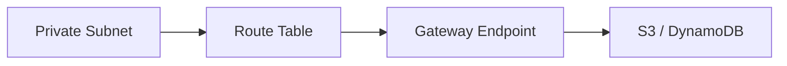

No NAT Gateway is required for this service traffic.

---

# 6. Gateway Endpoint HLD

Example:

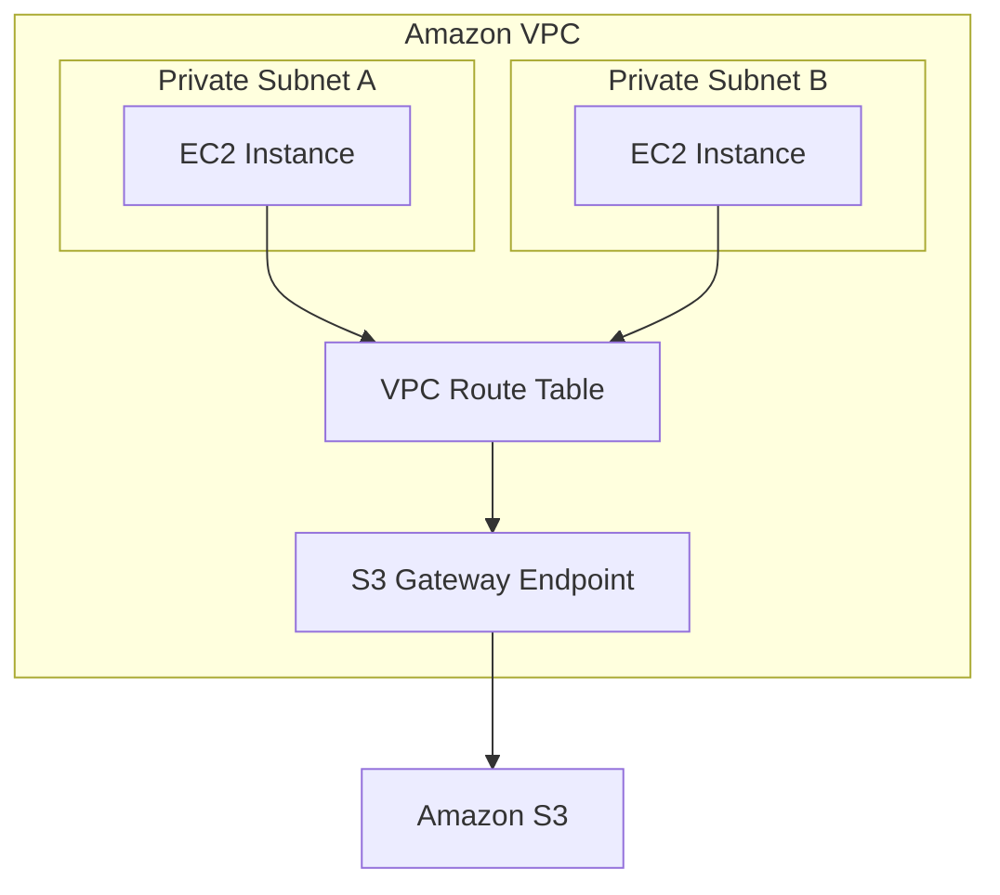

The endpoint is associated with route tables.

---

# 7. Gateway Endpoint — Why It's Attractive

### Cost

Gateway endpoints for S3/DynamoDB have **no additional endpoint hourly charge**.

That's a very useful exam clue.

Compare:

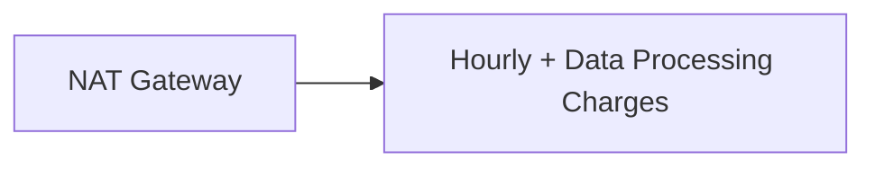

versus:

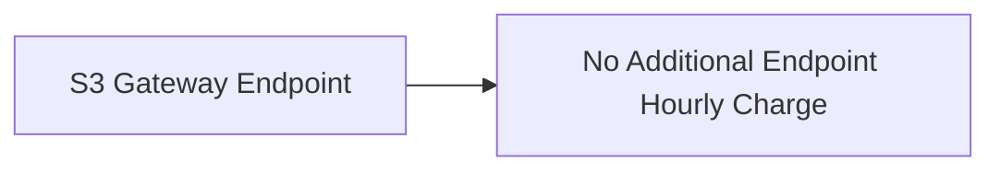

Therefore:

> **Private EC2 → S3/DynamoDB with minimum cost → Gateway Endpoint**

---

# 8. Interface Endpoint

Interface endpoints use **AWS PrivateLink**.

Think:

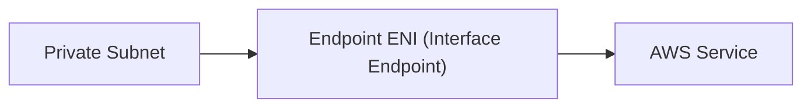

Unlike a Gateway Endpoint, an interface endpoint creates **elastic network interfaces (ENIs)** in your subnets.

---

# 9. Interface Endpoint Examples

Many AWS services can be accessed through interface endpoints.

Common exam examples:

```text
Secrets Manager
SSM
ECR
CloudWatch
KMS
STS
API Gateway
SNS
SQS
```

The exact endpoint availability varies by service and Region.

---

# 10. Interface Endpoint HLD

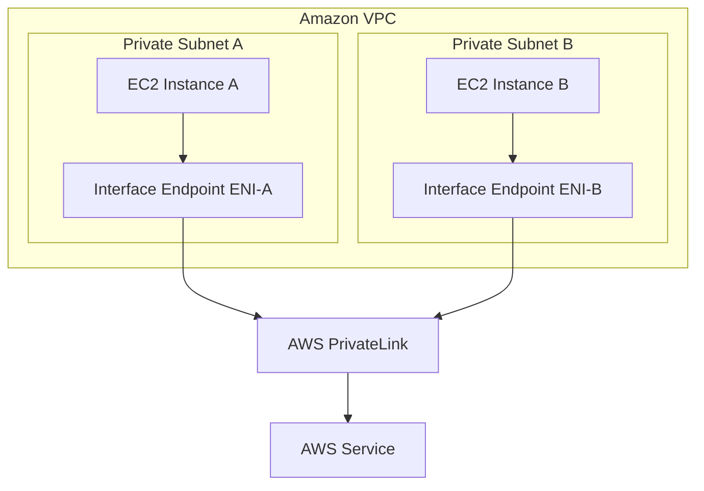

For high availability, create interface endpoints in the AZs/subnets where workloads need resilient access, according to the service and architecture.

---

# 11. Gateway vs Interface Endpoint

Memorize this table:

| Feature | Gateway Endpoint | Interface Endpoint |
|---|---|---|
| Technology | VPC endpoint | AWS PrivateLink |
| Main examples | S3, DynamoDB | Many AWS services |
| Uses ENI | ❌ | ✅ |
| Route table based | ✅ | Uses ENI/IP routing |
| Private IP | Not in same ENI model | ✅ |
| Hourly endpoint charge | No additional charge | ✅ Typically |
| Data processing charge | No endpoint charge | Applicable |
| Security Group | Not attached like interface ENI | ✅ |
| Private DNS | Not the same mechanism | Commonly used |
| Exam keyword | S3/DynamoDB | PrivateLink |

---

# 12. The Most Important Exam Shortcut

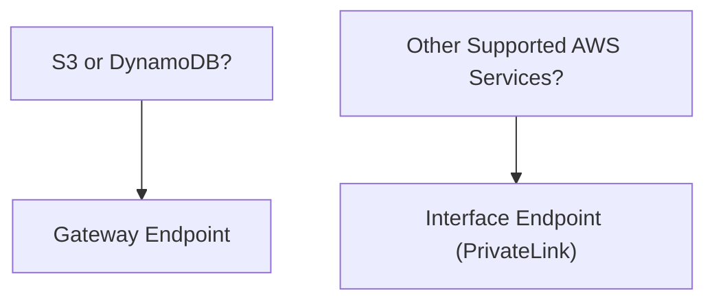

---

# 13. Why Private Subnets Need Endpoints

Imagine:

```text
Private EC2 → AWS Secrets Manager
```

Without an endpoint, you may need:

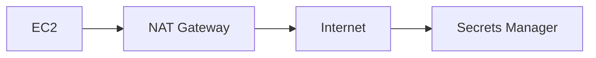

With interface endpoint:

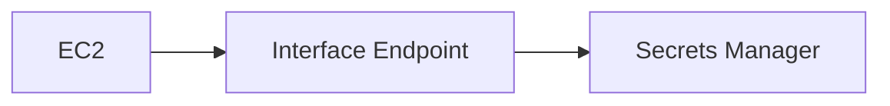

This gives a private connectivity pattern.

---

# 14. NAT Gateway vs VPC Endpoint

This is a **high-value exam comparison**.

| Requirement | NAT Gateway | VPC Endpoint |
|---|---|---|
| Private subnet → Internet | ✅ | ❌ |
| Private subnet → supported AWS service | Possible | ✅ Preferred |
| Private connectivity to AWS service | ❌ | ✅ |
| General Internet access | ✅ | ❌ |
| Avoid NAT charges for service traffic | ❌ | ✅ |
| Central service-specific access | ❌ | ✅ |
| Operational overhead | Medium | Low/Medium |

### Key rule:

> **Don't use a NAT Gateway just because an EC2 instance is in a private subnet. First ask whether the destination is an AWS service that can be reached through a VPC endpoint.**

---

# 15. Example — S3

Requirement:

> EC2 instances in private subnets need access to S3. Minimize cost and avoid Internet connectivity.

Architecture:

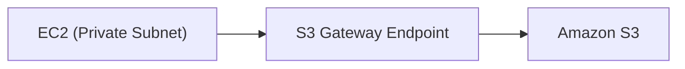

### Best answer

**S3 Gateway Endpoint**

Not:

```text
NAT Gateway
```

because that introduces unnecessary cost and infrastructure.

---

# 16. Example — Secrets Manager

Requirement:

> EC2 in a private subnet needs to retrieve secrets without Internet access.

Think:

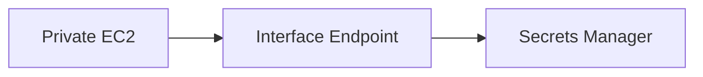

This is an **Interface VPC Endpoint** using PrivateLink.

---

# 17. Example — SSM

Suppose administrators want to manage EC2 instances without requiring inbound SSH and without Internet access.

A private architecture can use relevant **SSM interface endpoints**, such as endpoints for:

* SSM
* SSM Messages
* EC2 Messages

along with appropriate IAM/network configuration.

Conceptually:

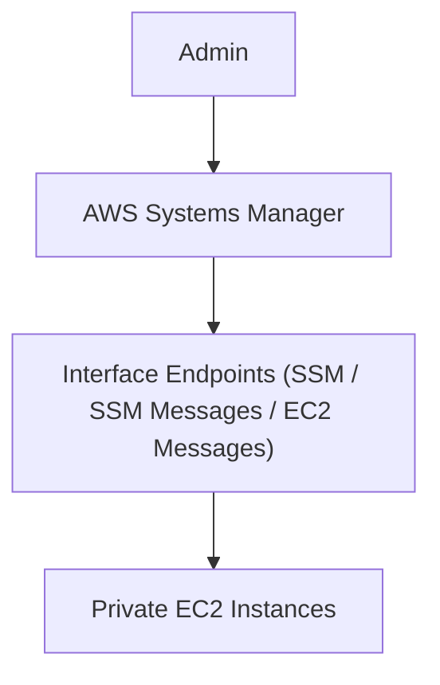

This is a common **"private EC2 management"** exam pattern.

---

# 18. Endpoint Policies

VPC endpoints can also help control what access is allowed.

For example:

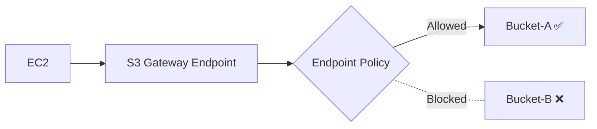

This provides another layer of control.

But remember:

> **Endpoint policy does not replace IAM policies or bucket policies.**

Think of authorization as potentially involving multiple policy layers.

---

# 19. Security Groups with Interface Endpoints

Interface endpoints use ENIs.

Therefore, security groups can control access to those endpoint ENIs.

Example:

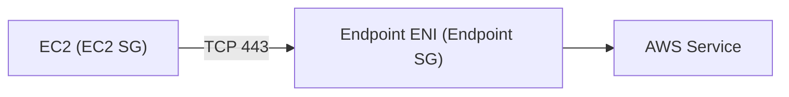

If the endpoint's security group doesn't allow the traffic:

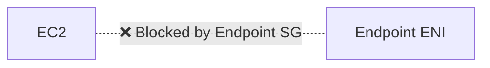

Traffic fails.

---

# 20. Private DNS

This is another important concept.

Suppose your application calls:

```text
secretsmanager.<region>.amazonaws.com
```

With private DNS enabled for the interface endpoint, DNS can resolve the service hostname to the endpoint's private IP addresses.

Conceptually:

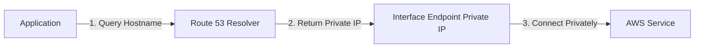

The application can continue using the normal AWS service hostname.

---

# 21. Without Private DNS

You may need to explicitly use endpoint-specific DNS names depending on the architecture.

This creates more application/configuration complexity.

Therefore:

> **Private DNS often reduces application changes and operational overhead.**

---

# 22. Route 53 Resolver's Role

This connects with your previous topic.

```mermaid
flowchart LR
    App["Application"] --> R53["Route 53 Resolver"] --> PrivIP["Interface Endpoint Private IP"]
```

So:

> **VPC endpoint + private DNS + Route 53 Resolver**

is a common private service-access pattern.

---

# 23. Endpoint Services — Not Just AWS Services

PrivateLink can also be used for **private access to services provided by other organizations/accounts**.

Architecture:

```mermaid
flowchart LR
    Consumer["Consumer VPC"] --> IFEP["Interface Endpoint"] --> PL["AWS PrivateLink"] --> Service["Endpoint Service"] --> Provider["Provider VPC"]
```

This is powerful.

You can expose:

> **a specific service rather than the entire VPC.**

---

# 24. PrivateLink vs VPC Peering

Very important.

### VPC Peering

```mermaid
flowchart LR
    VPCA["VPC-A"] <== "Network-Level Connectivity" ==> VPCB["VPC-B"]
```

Provides network-level connectivity.

### PrivateLink

```mermaid
flowchart LR
    Consumer["Consumer VPC"] -->|"Service-Level Connectivity"| Service["Specific Service API"]
```

Provides **service-level connectivity**.

---

# 25. Exam Clue: "Access Only One Service"

Question:

> "VPC-A needs access to an application hosted in VPC-B, but should not have general network access to VPC-B."

Think:

**AWS PrivateLink**

Architecture:

```mermaid
flowchart LR
    VPCA["VPC-A"] --> IFEP["Interface Endpoint"] --> PL["PrivateLink"] --> Service["Target Service"] --> VPCB["VPC-B"]
```

Not VPC Peering.

---

# 26. PrivateLink — Least Operational Overhead

Compare:

### VPC Peering

```text
VPC-A ←→ VPC-B
```

You need to manage:

* Routes
* CIDRs
* Security controls
* Connectivity relationships

### PrivateLink

```text
Consumer → Service
```

The consumer gets access to the specific service.

This reduces network exposure.

---

# 27. Service Endpoint vs Public Endpoint

AWS services often have public service endpoints such as:

```text
service.region.amazonaws.com
```

Your workload can reach them through different network paths depending on architecture.

The important exam question is:

> **Does the workload need Internet/public connectivity, or can it use a private endpoint?**

---

# 28. The Big Architecture Comparison

```mermaid
flowchart TD
    Access["AWS SERVICE ACCESS"] --> PublicPath["Public Path (NAT / IGW)"] --> PublicService["AWS Public Service"]
    Access --> PrivatePath["Private Path (VPC Endpoint)"] --> PrivateService["AWS Private Service"]
```

For private workloads:

> Prefer a VPC endpoint when it satisfies the requirement.

---

# 29. But Don't Create Endpoints for Everything

This is an important **cost/overengineering** point.

Interface endpoints generally have:

* Hourly charges per endpoint/ENI
* Data processing charges

So don't blindly create dozens of endpoints if the requirements don't justify them.

You need to balance:

```text
NAT Gateway cost
       vs
Interface Endpoint cost
       vs
Security requirement
       vs
Operational simplicity
```

---

# 30. NAT Gateway vs Interface Endpoint — Cost Trade-Off

Suppose:

```text
Private EC2
    │
    ├── S3
    ├── Secrets Manager
    ├── SSM
    └── ECR
```

You could route all outbound traffic through NAT:

```mermaid
flowchart LR
    EC2["Private EC2"] --> NAT["NAT Gateway"] --> Services["AWS Services"]
```

Or use endpoints for supported services:

```mermaid
flowchart TD
    EC2["Private EC2"] --> GWEP["S3 Gateway Endpoint"] --> S3["Amazon S3"]
    EC2 --> IF1["SSM Interface Endpoint"] --> SSM["AWS SSM"]
    EC2 --> IF2["Secrets Manager Endpoint"] --> Secrets["Secrets Manager"]
```

Depending on traffic volume and requirements, endpoint-based access can reduce NAT data processing and provide a more private architecture.

---

# 31. Gateway Endpoint — Cost Winner

For S3/DynamoDB:

```text
Gateway Endpoint
      ↓
No additional hourly endpoint charge
```

So when the question says:

> "Access S3 from private subnets with the lowest cost."

Think:

**S3 Gateway Endpoint**

---

# 32. Interface Endpoint — Security Winner

If the question emphasizes:

> "Access AWS service privately without Internet/NAT."

Think:

**Interface Endpoint**

Examples:

```text
Secrets Manager
SSM
ECR
CloudWatch
KMS
STS
```

depending on supported endpoint availability.

---

# 33. ECR Is a Good Exam Example

Private ECS/EKS/EC2 workload needs to pull container images from ECR without Internet/NAT.

Potential architecture:

```mermaid
flowchart TD
    subgraph PrivateCluster["Private ECS / EKS"]
        Workload["Container Agent / Kubelet"]
    end

    Workload --> ECRAPI["ECR API Interface Endpoint"] --> ECRService["ECR Service"]
    Workload --> ECRDKR["ECR DKR Interface Endpoint"] --> ECRService
    Workload --> S3GW["S3 Gateway Endpoint"] --> S3Bucket["S3 (Image Layers Storage)"]
```

The exact endpoints needed depend on the container workflow and AWS service behavior.

The exam may test that **container image retrieval from ECR can require multiple private connectivity components**, not merely "an ECR endpoint."

---

# 34. Endpoint Availability Across AZs

Interface endpoints create ENIs in selected subnets/AZs.

For a highly available workload:

```mermaid
flowchart TD
    subgraph VPC["Amazon VPC"]
        subgraph AZA["AZ-A"]
            EC2A["EC2 Instance"] --> ENIA["Endpoint ENI-A"]
        end
        subgraph AZB["AZ-B"]
            EC2B["EC2 Instance"] --> ENIB["Endpoint ENI-B"]
        end
    end

    ENIA --> Service["AWS Service"]
    ENIB --> Service
```

This avoids making service access dependent on a single AZ.

---

# 35. Endpoint Placement — Exam Thinking

Question:

> "Applications run across multiple AZs and must maintain private access to an AWS service if one AZ fails."

Think:

> **Deploy interface endpoints across the required AZs.**

Don't create one endpoint in only one AZ and accidentally create a dependency on that AZ.

---

# 36. Service Integration HLD

A strong production architecture:

```mermaid
flowchart TD
    subgraph VPC["Amazon VPC"]
        subgraph AZA["AZ-A"]
            EC2A["EC2 Instance A"]
            S3A["S3 Gateway EP"]
            SSMA["SSM Interface EP"]
            SecA["Secrets Interface EP"]
        end
        subgraph AZB["AZ-B"]
            EC2B["EC2 Instance B"]
            S3B["S3 Gateway EP"]
            SSMB["SSM Interface EP"]
            SecB["Secrets Interface EP"]
        end
    end

    EC2A --> S3A --> S3["S3"]
    EC2A --> SSMA --> SSM["SSM"]
    EC2A --> SecA --> Secrets["Secrets Manager"]

    EC2B --> S3B --> S3
    EC2B --> SSMB --> SSM
    EC2B --> SecB --> Secrets
```

This provides private service integration without requiring general Internet access.

---

# 37. Endpoint vs NAT vs Internet Gateway

| Requirement | Best fit |
|---|---|
| Private EC2 → Internet | NAT Gateway |
| Public subnet → Internet | Internet Gateway |
| Private EC2 → S3 | S3 Gateway Endpoint |
| Private EC2 → DynamoDB | DynamoDB Gateway Endpoint |
| Private EC2 → Secrets Manager | Interface Endpoint |
| Private EC2 → SSM | Interface Endpoint |
| Private EC2 → ECR | Interface endpoints + other required dependencies |
| Consumer → specific private service | PrivateLink |
| General VPC-to-VPC connectivity | TGW / Peering depending on scale |

---

# 38. What Is NOT a VPC Endpoint?

Don't confuse these:

### Internet Gateway

```text
VPC ↔ Internet
```

### NAT Gateway

```text
Private Subnet → Internet
```

### VPC Endpoint

```text
VPC → AWS service / endpoint service
```

### Transit Gateway

```text
VPC ↔ VPC ↔ On-Prem
```

Different problems.

---

# 39. Endpoint Policy vs IAM Policy

Another exam trap.

Suppose:

```text
EC2 → S3 Endpoint → S3
```

There can be multiple policy layers:

```mermaid
flowchart TD
    Req["Request"] --> IAM["IAM Policy"] --> EPPolicy["Endpoint Policy"] --> BucketPolicy["S3 Bucket Policy"] --> S3["Amazon S3"]
```

A request must satisfy the relevant authorization controls.

Don't think:

> "Endpoint policy replaces IAM."

It doesn't.

---

# 40. Endpoint Policy Use Case

Requirement:

> "All EC2 instances using this VPC endpoint should only access a specific S3 bucket."

You can use an endpoint policy to restrict access.

Conceptually:

```mermaid
flowchart LR
    EC2["EC2"] --> GWEP["S3 Gateway Endpoint Policy"]
    GWEP -->|Allowed| BucketA["Bucket-A ✅"]
    GWEP -. "Denied" .- BucketB["Bucket-B ❌"]
```

This adds a useful network/service boundary.

---

# 41. Centralized Endpoint Architecture

In a large AWS organization, you might centralize certain interface endpoints in a shared VPC / networking architecture and provide access to application VPCs using supported networking patterns.

Conceptually:

```mermaid
flowchart TD
    subgraph SharedVPC["Shared Services VPC"]
        SSMEP["SSM Interface Endpoint"]
        SecEP["Secrets Interface Endpoint"]
    end

    TGW["Transit Gateway / Central Network"] <--> SharedVPC
    TGW <--> VPCA["App VPC-A"]
    TGW <--> VPCB["App VPC-B"]
    TGW <--> VPCC["App VPC-C"]
```

This can reduce duplicated endpoint infrastructure, but it introduces more networking complexity. For the exam, choose centralization only when the question emphasizes **many VPCs, centralized networking, or cost/management efficiency**.

---

# 42. Cross-Account Service Integration

Suppose Team A owns a service:

```mermaid
flowchart LR
    subgraph ProviderAcc["Provider Account"]
        Service["Endpoint Service"]
    end

    subgraph ConsumerAcc["Consumer Account"]
        IFEP["Interface Endpoint"]
    end

    IFEP <== "AWS PrivateLink" ==> Service
```

This allows private service consumption without exposing the entire provider VPC.

### Exam clue

> "Expose one service privately to other AWS accounts."

→ **PrivateLink / Endpoint Service**

---

# 43. Troubleshooting VPC Endpoints

If endpoint connectivity fails, check:

```text
1. Endpoint exists?
        ↓
2. Correct service?
        ↓
3. Correct VPC?
        ↓
4. Correct AZ/subnet?
        ↓
5. Route table / routing?
        ↓
6. Security Group?
        ↓
7. Endpoint policy?
        ↓
8. IAM policy?
        ↓
9. Private DNS?
```

For interface endpoints, also check:

```text
DNS resolution
+
Endpoint ENI
+
TCP 443
+
Security Group
```

---

# 44. Private DNS Troubleshooting

Example:

```text
EC2 → secretsmanager.region.amazonaws.com (DNS Failure)
```

Check:

* VPC DNS support
* VPC DNS hostnames
* Private DNS configuration
* Route 53 Resolver
* Endpoint configuration

---

# 45. Minimum Operational Overhead

Let's apply your preferred exam framework.

### Scenario 1

> Private EC2 → S3, lowest cost.

```text
S3 Gateway Endpoint
```

---

### Scenario 2

> Private EC2 → Secrets Manager, no Internet.

```text
Interface Endpoint
```

---

### Scenario 3

> Private EC2 needs arbitrary Internet access.

```text
NAT Gateway
```

Don't use an interface endpoint because it doesn't replace Internet access.

---

### Scenario 4

> VPC-A needs only one application in VPC-B.

```text
PrivateLink
```

instead of full VPC connectivity if the architecture fits.

---

### Scenario 5

> 50 VPCs need centralized connectivity.

```text
Transit Gateway
```

rather than building a huge mesh of peering connections.

---

# 46. Exam Decision Tree

Memorize this:

```mermaid
flowchart TD
    Start["Workload needs AWS service"] --> S3DDB{"Is it S3 or DynamoDB?"}
    
    S3DDB -->|YES| GW["Gateway Endpoint"]
    S3DDB -->|NO| IF["Interface Endpoint (PrivateLink)"]

    Internet{"Need general Internet access?"} -->|YES| NAT["NAT Gateway"]
    PrivateApp{"Need one private service in another VPC/account?"} -->|YES| PL["AWS PrivateLink"]
```

---

# 47. Cost + Security + Operations Matrix

| Option | Cost tendency | Security/private path | Operational overhead | Main use |
|---|--:|---|---|---|
| Internet Gateway | Low | Public path | Low | Public Internet |
| NAT Gateway | Higher | Private subnet → Internet | Medium | General outbound Internet |
| S3 Gateway Endpoint | Very low | Private AWS service access | Low | S3 |
| DynamoDB Gateway Endpoint | Very low | Private AWS service access | Low | DynamoDB |
| Interface Endpoint | Medium | Private | Medium | AWS services |
| PrivateLink | Medium | Private service-level | Medium | Private service sharing |
| Transit Gateway | Medium | Private network | Low at scale | Many networks/VPCs |

---

# 48. Common Exam Traps

### Trap 1 — "Private subnet means NAT Gateway is always required."

❌ No.

If accessing a supported AWS service:

```text
VPC Endpoint
```

may be better.

---

### Trap 2 — "All VPC endpoints are the same."

❌ No.

```text
S3/DynamoDB
     ↓
Gateway Endpoint

Many other services
     ↓
Interface Endpoint / PrivateLink
```

---

### Trap 3 — "PrivateLink connects entire VPCs."

❌ No.

PrivateLink is primarily:

> **Private access to a service.**

---

### Trap 4 — "Gateway endpoint uses ENIs."

❌ Not in the same way interface endpoints do.

Interface endpoints create ENIs.

---

### Trap 5 — "Endpoint policy replaces IAM."

❌ No.

It is an additional authorization control.

---

### Trap 6 — "One interface endpoint is enough for all AZs."

Be careful.

For HA, consider endpoint placement across the AZs where workloads operate.

---

# 🧠 FINAL EXAM CHEAT SHEET

```mermaid
flowchart TD
    Access["SERVICE ACCESS"] --> ServiceType{"AWS Service or Internet?"}
    
    ServiceType -->|AWS Service| EPType{"S3/DynamoDB or Other?"}
    ServiceType -->|General Internet| NAT["NAT Gateway"]

    EPType -->|S3 / DynamoDB| GW["Gateway Endpoint"]
    EPType -->|Other AWS Services| IF["Interface Endpoint (PrivateLink)"]
```

### Remember these associations:

> **S3 → Gateway Endpoint**  
> **DynamoDB → Gateway Endpoint**  
> **Secrets Manager → Interface Endpoint**  
> **SSM → Interface Endpoint**  
> **ECR → Interface endpoints + required dependencies**  
> **Specific private service → PrivateLink**  
> **General Internet from private subnet → NAT Gateway**  
> **Many VPCs/networks → Transit Gateway**  
> **Endpoint authorization → Endpoint Policy + IAM/resource policies**  
> **Private service DNS → Private DNS + Route 53 Resolver**

## 🏆 The exam mental model

The question usually boils down to:

```mermaid
flowchart TD
    Q{"Where is the traffic going?"}
    
    Q -->|Internet| NAT["NAT Gateway"]
    Q -->|AWS Service| VPCE["VPC Endpoint"]
    Q -->|Private Service| PL["AWS PrivateLink"]

    VPCE --> Types{"Service Type?"}
    Types -->|S3 / DynamoDB| GWEP["Gateway Endpoint"]
    Types -->|Other AWS Services| IFEP["Interface Endpoint"]
```

And when the question says **"minimum cost + minimum operational overhead + private connectivity"**, don't overengineer it:

**S3/DynamoDB → Gateway Endpoint.**  
**Other supported AWS service → Interface Endpoint.**  
**General Internet → NAT Gateway.**  
**Specific service owned by another VPC/account → PrivateLink.**