# Network Segmentation — AWS Exam-Oriented Deep Dive

For the AWS exam, think of **network segmentation** as:

> **“How do I divide my network so that resources have the right level of connectivity, security, availability, and isolation—with the least complexity and cost?”**

The core concepts are:

* VPC
* CIDR / IP addressing
* Subnets
* Public vs private subnets
* Route tables
* Internet Gateway
* NAT Gateway
* VPC peering
* Transit Gateway
* VPC endpoints
* Security Groups
* Network ACLs
* Multi-AZ design
* IPv4 / IPv6

---

# 1. The Big Picture

Think about network segmentation like this:

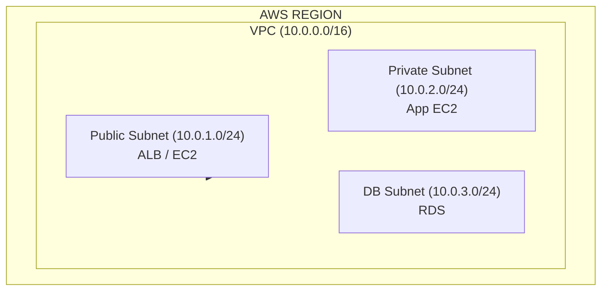

The idea is:

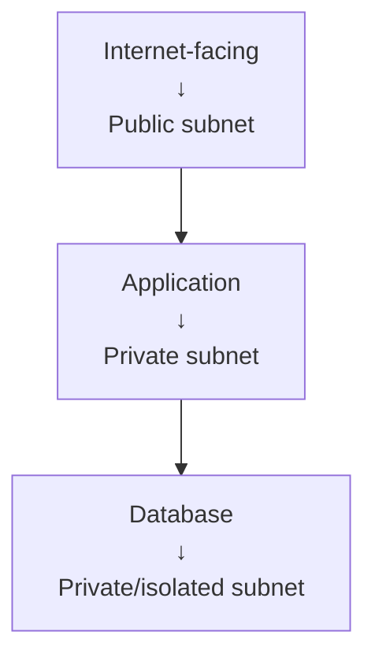

---

# 2. What Is Network Segmentation?

Segmentation means dividing a larger network into smaller logical networks.

For example:

```text
10.0.0.0/16
```

can be divided into:

```text
10.0.1.0/24 → Web
10.0.2.0/24 → Application
10.0.3.0/24 → Database
```

Why?

### Security

The database shouldn't be directly reachable from the Internet.

### Availability

Different subnets can exist in different AZs.

### Routing

Different subnets can have different route tables.

### Organization

You can separate:

* Web
* Application
* Database
* Management
* Shared services

---

# 3. CIDR — The Foundation

CIDR defines an IP range.

Example:

```text
10.0.0.0/16
```

means:

```text
Network: 10.0.0.0
Prefix:  /16
```

It provides a large address range.

You can divide it:

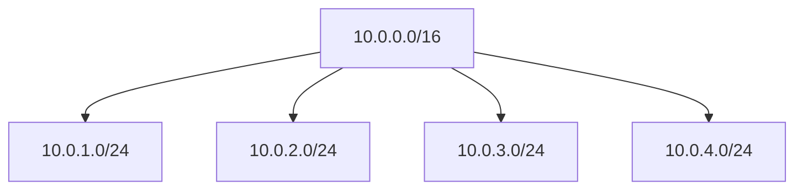

---

# 4. CIDR Exam Thinking

You don't need to become a subnetting expert for every AWS question, but you **must understand the relationship between CIDR sizes**.

Remember:

```text
/16 → large network
/24 → smaller network
/28 → very small network
```

Increasing the prefix:

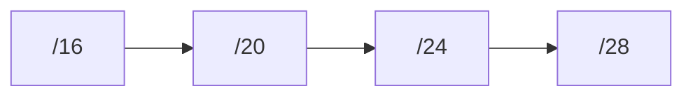

means:

> **Fewer IP addresses**

Decreasing the prefix:

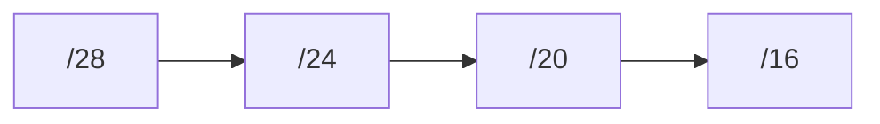

means:

> **More IP addresses**

---

# 5. VPC CIDR vs Subnet CIDR

The subnet must fit inside the VPC CIDR.

Example:

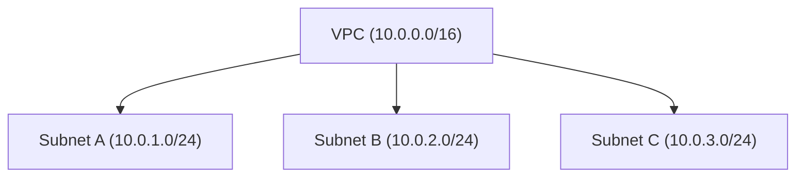

You cannot create:

```text
VPC:     10.0.0.0/16

Subnet:
192.168.1.0/24
```

because it isn't inside the VPC address space.

---

# 6. Avoid CIDR Overlap

This is **extremely important** for VPC connectivity.

Suppose:

```text
VPC-A
10.0.0.0/16
```

and:

```text
VPC-B
10.0.0.0/16
```

They overlap.

That creates problems when trying to connect them.

### Exam rule

> **Plan non-overlapping CIDR ranges when VPCs need to communicate.**

Better:

```text
VPC-A → 10.0.0.0/16
VPC-B → 10.1.0.0/16
VPC-C → 10.2.0.0/16
```

This makes future networking much easier.

---

# 7. CIDR Planning — HLD

For a larger organization:

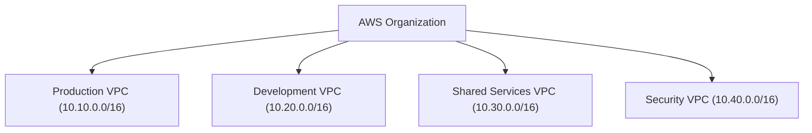

Then:

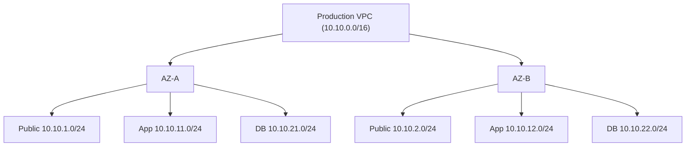

This is a very common HLD pattern.

---

# 8. Public vs Private Subnet

This is probably the most important subnet distinction.

A **public subnet** has a route to an Internet Gateway.

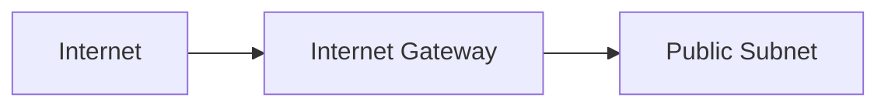

A **private subnet** doesn't have a direct route to the Internet Gateway.

For outbound Internet access, it can use:

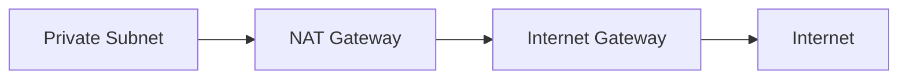

---

# 9. Don't Call a Subnet "Public" Because It Contains a Public IP

This is a common exam trap.

The subnet's routing determines whether it's public.

Think:

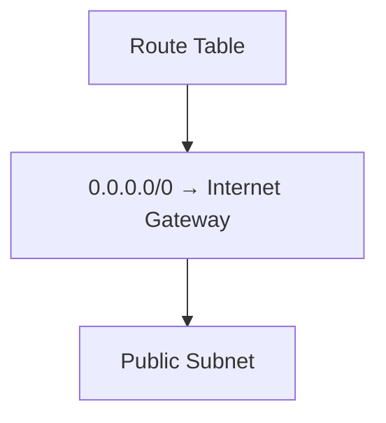

The presence of a public IP alone doesn't make the subnet public.

---

# 10. Route Tables = Traffic Control

A route table tells AWS:

> **"Where should traffic for this destination go?"**

Example:

```text
Destination        Target

10.0.0.0/16        local
0.0.0.0/0          igw-xxxx
```

Meaning:

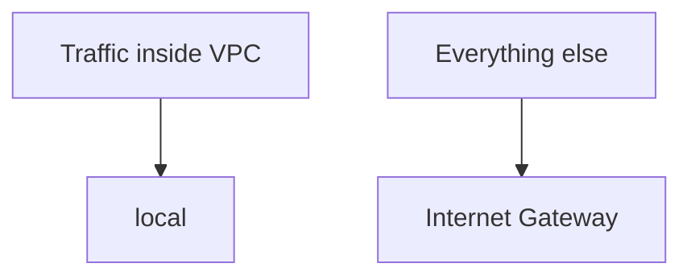

---

# 11. Segmentation Through Route Tables

Suppose:

```text
Public Subnet
      │
Route Table A
      │
Internet Gateway
```

and:

```text
Private Subnet
      │
Route Table B
      │
NAT Gateway
```

The subnets now have different connectivity.

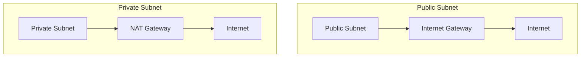

This is **logical segmentation**.

---

# 12. Database Segmentation

A common HLD:

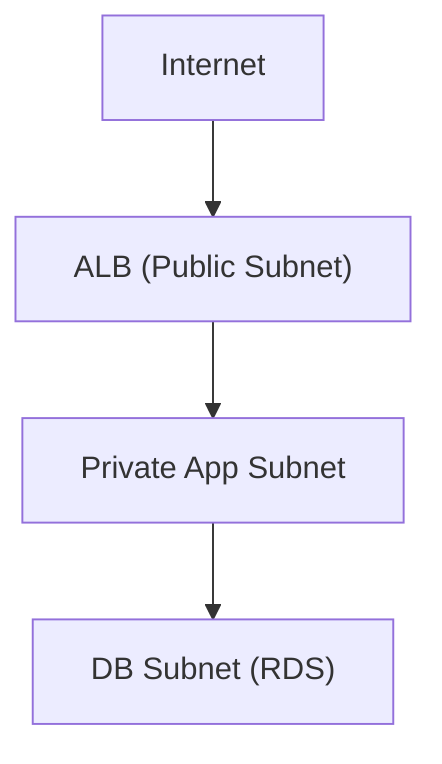

The database isn't directly exposed to the Internet.

Traffic flow:

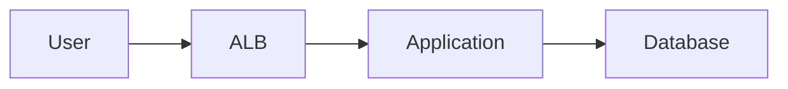

Not:

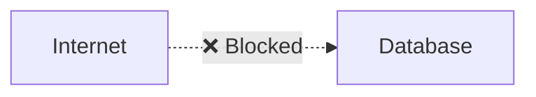

---

# 13. Security Groups vs Segmentation

Subnetting alone isn't your entire security architecture.

Use:

### Network segmentation

To determine:

> **Where traffic can go**

Use:

### Security Groups

To determine:

> **Which traffic is allowed to a resource**

Example:

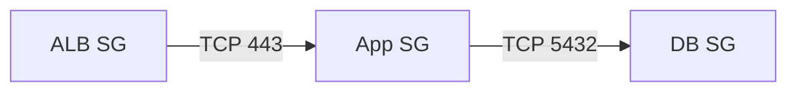

This creates a layered architecture.

---

# 14. Security Group Referencing

One of the best AWS patterns:

Instead of saying:

```text
DB allows:
10.0.2.0/24
```

you can allow:

```text
DB SG
← App SG
```

Conceptually:

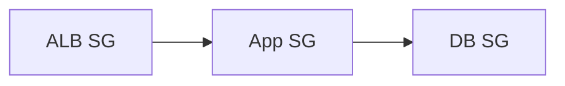

This is more maintainable because the rule follows the security group rather than a hardcoded subnet range.

### Exam clue

> "Allow only application servers to access database."

Think:

**Security Group reference**

---

# 15. Network ACL

NACL operates at the subnet boundary.

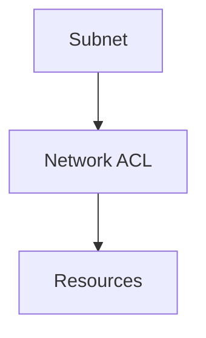

Remember:

**Security Group → stateful**

**NACL → stateless**

NACL can have:

```text
ALLOW
DENY
```

Security Groups:

```text
ALLOW only
```

---

# 16. Multi-AZ Segmentation

For production, don't create:

```text
Production
   │
   └── AZ-A only
```

Prefer:

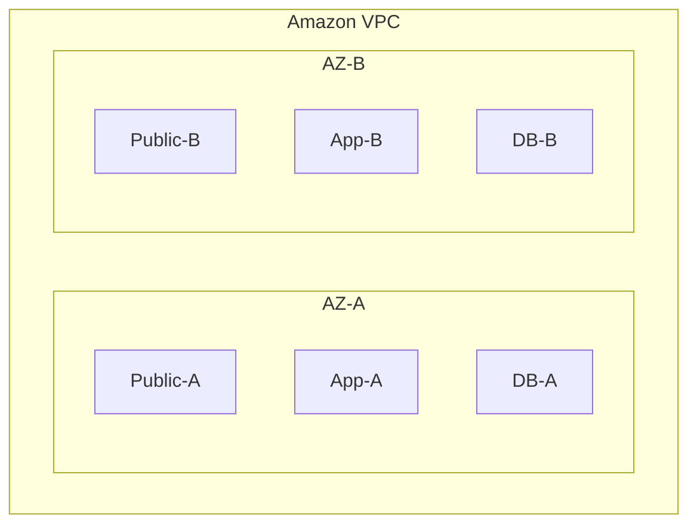

For example:

```text
AZ-A                    AZ-B
────                    ────
Public-A                Public-B
App-A                   App-B
DB-A                    DB-B
```

This provides AZ-level resilience.

---

# 17. VPC-to-VPC Connectivity

Now the question becomes:

> **How do separate VPCs communicate?**

You have several options.

```mermaid
flowchart TD
    VPCA["VPC A"] --> Peering["VPC Peering"]
    VPCA --> TGW["Transit Gateway"]
    VPCA --> PL["PrivateLink"]
```

These solve different problems.

---

# 18. VPC Peering

Think:

> **Direct connection between two VPCs.**

```mermaid
flowchart LR
    VPCA["VPC-A (10.0.0.0/16)"] <==>|Peering| VPCB["VPC-B (10.1.0.0/16)"]
```

Good for:

* Two VPCs
* Simple point-to-point connectivity
* Low complexity

### Major limitation

**No transitive routing.**

If:

```text
A ↔ B
B ↔ C
```

you don't automatically have:

```text
A ↔ C
```

---

# 19. Transit Gateway

Think:

> **Central hub for many VPCs and networks.**

```mermaid
flowchart TD
    TGW["Transit Gateway"] <--> VPCA["VPC-A"]
    TGW <--> VPCB["VPC-B"]
    TGW <--> VPCC["VPC-C"]
```

This is much easier than building a huge peering mesh.

### Example

10 VPCs:

```text
Without TGW:
many peer-to-peer connections

With TGW:
10 VPCs → 1 central hub
```

### Exam clue

> "Many VPCs"

> "Centralized routing"

> "Transitive connectivity"

→ **Transit Gateway**

---

# 20. VPC Peering vs Transit Gateway

| Requirement | VPC Peering | Transit Gateway |
|---|---|---|
| Two VPCs | ✅ | Possible |
| Many VPCs | ❌ Complex | ✅ |
| Transitive routing | ❌ | ✅ |
| Centralized routing | ❌ | ✅ |
| Simplicity for 2 VPCs | ✅ | More infrastructure |
| Large enterprise network | Less suitable | ✅ |

### Cost trade-off

For only two VPCs:

> **Peering may be simpler and potentially cheaper.**

For many VPCs:

> **Transit Gateway's centralized architecture can significantly reduce operational complexity.**

---

# 21. PrivateLink

PrivateLink is different.

Instead of connecting entire VPCs:

```text
VPC-A ↔ VPC-B
```

you expose **a specific service**.

```mermaid
flowchart LR
    Consumer["Consumer VPC"] --> PL["PrivateLink"] --> Provider["Provider Service"]
```

### Example

A company has:

```text
Shared payment service
```

Instead of giving another VPC access to the entire network, expose only:

```text
Payment API
```

### Exam clue

> "Provide private access to a service without exposing the entire VPC"

→ **PrivateLink**

---

# 22. Connectivity Decision Tree

This is worth memorizing:

```mermaid
flowchart TD
    Conn{"Need VPC connectivity?"} --> Two{"Is it just two VPCs?"}
    Two -->|YES| Peering["VPC Peering"]
    Two -->|NO| TGW["Transit Gateway"]
    Conn --> Specific{"Need only a specific service?"}
    Specific --> PL["PrivateLink"]
```

More precisely:

```text
Full network connectivity
        ↓
Peering / Transit Gateway

Specific service connectivity
        ↓
PrivateLink
```

---

# 23. VPC Endpoint

Another important distinction.

Suppose:

```text
EC2 in private subnet
       │
       ▼
      S3
```

Instead of:

```mermaid
flowchart LR
    EC2["EC2"] --> NAT["NAT Gateway"] --> IGW["Internet"] --> S3["S3"]
```

you can use:

```mermaid
flowchart LR
    EC2["EC2"] --> VPCE["VPC Endpoint"] --> S3["S3"]
```

### Benefits

* Private connectivity
* No Internet Gateway required
* Can reduce NAT Gateway usage
* Better network isolation

### Exam clue

> "Private EC2 needs to access S3 without traversing the public Internet."

→ **VPC Endpoint**

---

# 24. Gateway Endpoint vs Interface Endpoint

For exam purposes:

```mermaid
flowchart TD
    S3Dyn["S3 / DynamoDB"] --> GW["Gateway Endpoint"]
    Other["Other AWS Services"] --> IF["Interface Endpoint (AWS PrivateLink)"]
```

---

# 25. IP Addressing — Private vs Public

### Private IPv4

Used inside private networks.

Example:

```text
10.0.1.10
```

Common RFC 1918 ranges:

```text
10.0.0.0/8
172.16.0.0/12
192.168.0.0/16
```

These are not directly routable over the public Internet.

---

# 26. Public IPv4

A public IPv4 address allows Internet connectivity, subject to routing and security controls.

Example:

```mermaid
flowchart LR
    EC2["EC2"] --> PubIP["Public IP"] --> IGW["Internet Gateway"] --> Inet["Internet"]
```

But remember:

> **Public IP ≠ automatically accessible.**

Security Groups and routing still matter.

---

# 27. IPv6

AWS VPCs also support IPv6.

Important distinction:

IPv6 addresses are globally unique and can be publicly routable.

For private-style outbound-only IPv6 access, AWS provides **egress-only Internet gateways**.

Think:

```mermaid
flowchart TD
    v4["IPv4 private subnet"] --> NAT["NAT Gateway"]
    v6["IPv6 outbound-only"] --> EgressIGW["Egress-only Internet Gateway"]
```

### Exam clue

> "IPv6 instances need outbound Internet access but should not accept unsolicited inbound Internet traffic."

→ **Egress-only Internet Gateway**

---

# 28. NAT Gateway Cost Trade-off

NAT Gateway is convenient but **not free**.

You pay for:

* NAT Gateway usage
* Data processing
* Related network transfer

Therefore:

```text
Private EC2
   ↓
NAT Gateway
   ↓
S3
```

may be unnecessary if the target is an AWS service that supports a VPC endpoint.

Better:

```mermaid
flowchart LR
    EC2["Private EC2"] --> VPCE["S3 VPC Endpoint"] --> S3["S3"]
```

### Exam mindset

> **Don't route AWS-service traffic through NAT if a suitable private endpoint can satisfy the requirement.**

---

# 29. NAT Gateway vs NAT Instance

Exam perspective:

### NAT Gateway

* Managed
* Highly available within an AZ
* Scales automatically
* Less operational overhead

### NAT Instance

* EC2-based
* You manage the OS
* Need to manage scaling/failover
* More operational overhead

Therefore:

> **If the requirement is simply private-subnet outbound Internet access, prefer NAT Gateway over NAT instance.**

Unless the question specifically requires custom functionality that a NAT Gateway doesn't provide.

---

# 30. Cost vs Operational Overhead

This topic is full of trade-offs.

| Solution | Cost | Operational overhead | Typical use |
|---|--:|--:|---|
| Route tables | Low | Low | Segmentation/routing |
| Security Groups | Low | Low | Resource firewall |
| NACL | Low | Medium | Subnet filtering |
| NAT Gateway | Medium | Low | Private outbound Internet |
| NAT Instance | Potentially lower in some cases | High | Custom NAT |
| VPC Peering | Usage-dependent | Low for small scale | 2 VPCs |
| Transit Gateway | Higher | Low/medium | Many networks |
| PrivateLink | Usage-dependent | Low | Specific service access |
| VPC Endpoint | Usage-dependent | Low | Private AWS service access |

The exam doesn't necessarily ask:

> "What is cheapest?"

It often asks:

> **"What is most cost-effective while meeting the requirements?"**

That distinction matters.

---

# 31. "Minimum Workload" Principle

Let's take a few examples.

### Requirement

> EC2 in private subnet needs S3 access.

Don't build:

```text
EC2
 ↓
NAT
 ↓
IGW
 ↓
Internet
 ↓
S3
```

Prefer:

```mermaid
flowchart LR
    EC2["EC2"] --> VPCE["S3 VPC Endpoint"] --> S3["S3"]
```

Less infrastructure.

---

### Requirement

> Two VPCs need to communicate.

Don't immediately build:

```text
Transit Gateway
```

If it's only two VPCs:

```mermaid
flowchart LR
    VPCA["VPC-A"] <==>|Peering| VPCB["VPC-B"]
```

may be the simpler answer.

---

### Requirement

> 50 VPCs need centralized connectivity.

Don't create dozens of individual peerings.

Use:

```mermaid
flowchart TD
    TGW["Transit Gateway"] <--> VPC1["VPC 1"]
    TGW <--> VPC2["VPC 2"]
    TGW <--> VPC3["VPC 3"]
    TGW <--> VPC4["VPC 4"]
```

---

# 32. Automation

Network segmentation should also be automated.

Instead of manually creating:

```text
VPC
Subnets
Route tables
NACLs
Security Groups
Endpoints
```

use Infrastructure as Code such as:

**AWS CloudFormation** or **AWS CDK**.

Conceptually:

```mermaid
flowchart TD
    Code["Infrastructure Code"] --> IaC["CloudFormation / CDK"] --> VPC["VPC (Subnets, Routes, SGs, Endpoints)"]
```

### Exam clue

> "Repeatable network deployment across multiple environments."

→ **Infrastructure as Code**

---

# 33. HLD — Typical 3-Tier AWS Network

Here's the architecture I'd expect you to recognize immediately:

```mermaid
flowchart TD
    Inet["INTERNET"] --> ALB["ALB"]
    
    subgraph VPC["VPC: 10.0.0.0/16"]
        subgraph AZA["AZ-A"]
            PubA["Public Subnet"]
            AppA["Private App Subnet"]
        end

        subgraph AZB["AZ-B"]
            PubB["Public Subnet"]
            AppB["Private App Subnet"]
        end

        RDS["RDS Multi-AZ"]
    end

    ALB --> PubA
    ALB --> PubB
    AppA --> RDS
    AppB --> RDS
```

---

# 34. HLD — Enterprise Multi-VPC

```mermaid
flowchart TD
    OnPrem["ON-PREMISES"] <== "VPN / Direct Connect" ==> TGW["Transit Gateway"]
    
    TGW <--> Prod["Production VPC (10.10/16)"]
    TGW <--> Dev["Dev VPC (10.20/16)"]
    TGW <--> Shared["Shared Services VPC (10.30/16)"]
```

This gives you:

* Non-overlapping CIDRs
* Centralized connectivity
* Multi-AZ architecture
* Separation of environments
* Easier future scaling

---

# 35. HLD — Secure 3-Tier Segmentation

A stronger production design:

```mermaid
flowchart TD
    Inet["INTERNET"] --> CF["CloudFront"] --> ALB["ALB"] --> App["App Subnets (AZ-A & AZ-B)"] --> RDS["RDS (DB Subnets)"]
```

Security groups:

```mermaid
flowchart LR
    Inet["Internet"] --> ALBSG["ALB SG"] -->|443| AppSG["App SG"] -->|5432| DBSG["DB SG"]
```

This is better than relying solely on subnet separation.

---

# 36. Network Segmentation Layers

Think of segmentation as **multiple layers**:

```mermaid
flowchart TD
    L1["Layer 1: VPC (Large network boundary)"] --> L2["Layer 2: Subnet (Network segmentation)"] --> L3["Layer 3: Route Table (Traffic path)"] --> L4["Layer 4: NACL (Subnet firewall)"] --> L5["Layer 5: Security Group (Resource firewall)"] --> L6["Layer 6: Application (Auth / Authorization)"]
```

Don't assume one layer provides all security.

---

# 37. Common Exam Traps

### Trap 1 — Overlapping CIDRs

```text
VPC-A: 10.0.0.0/16
VPC-B: 10.0.0.0/16
```

Problematic for connectivity.

**Prefer non-overlapping CIDRs.**

---

### Trap 2 — Two VPCs → Transit Gateway automatically

Not necessarily.

If only two VPCs need connectivity:

**VPC Peering** may be simpler.

---

### Trap 3 — Many VPCs → Peering

Possible, but becomes operationally difficult.

**Transit Gateway** is usually the scalable choice.

---

### Trap 4 — Private subnet → Internet Gateway

A private subnet doesn't have a direct route to an IGW.

Use:

**NAT Gateway** for IPv4 outbound Internet access.

---

### Trap 5 — S3 through NAT

If private connectivity to S3 is required:

**S3 Gateway Endpoint** is generally the better architecture.

---

### Trap 6 — NACL is stateful

No.

**NACL = stateless**

**Security Group = stateful**

---

### Trap 7 — Public IP makes subnet public

No.

The subnet is public based on its **route to an Internet Gateway**.

---

# 38. Decision Tree for the Exam

When you see a network segmentation question:

```mermaid
flowchart TD
    Req["NETWORK REQUIREMENT"] --> Iso{"Need isolation?"} --> VPC["VPC"] --> Seg{"Need segmentation?"} --> Subnets["Subnets"]
    Subnets --> Pub["Public"] --> ALB["ALB"]
    Subnets --> App["App"] --> EC2["EC2"]
    Subnets --> DB["DB"] --> RDS["RDS"]
```

Then:

```mermaid
flowchart TD
    Internet{"Need Internet?"}
    Internet -->|Public| IGW["Internet Gateway"]
    Internet -->|Private| NAT["NAT Gateway"]
```

Then:

```mermaid
flowchart TD
    VPC2VPC{"Need VPC-to-VPC?"} --> Two{"Two VPCs?"}
    Two -->|YES| Peering["VPC Peering"]
    Two -->|NO / Many| TGW["Transit Gateway"]
```

Then:

```mermaid
flowchart TD
    Specific{"Need only a specific service?"} --> PL["PrivateLink"]
```

Then:

```mermaid
flowchart TD
    PrivateAWS{"Need AWS service privately?"} --> VPCE["VPC Endpoint"]
```

---

# 39. The AWS Exam "Trade-off Matrix"

| Requirement | Best starting answer | Why |
|---|---|---|
| Isolate AWS environment | VPC | Network boundary |
| Separate web/app/db | Subnets | Segmentation |
| Internet-facing workload | Public subnet + IGW | Public connectivity |
| Private outbound IPv4 | NAT Gateway | Managed |
| Private IPv6 outbound | Egress-only IGW | IPv6 equivalent |
| Instance firewall | Security Group | Stateful |
| Subnet firewall | NACL | Stateless |
| Two VPCs | VPC Peering | Simple |
| Many VPCs | Transit Gateway | Scalable |
| Transitive routing | Transit Gateway | Hub-and-spoke |
| Specific service sharing | PrivateLink | Service-level access |
| Private S3 access | Gateway Endpoint | Avoid unnecessary NAT |
| Dedicated hybrid connectivity | Direct Connect | Predictable |
| Quick hybrid connectivity | VPN | Lower complexity |
| Repeatable network deployment | CloudFormation/CDK | Automation |

---

# 40. 🧠 The 12 Rules to Memorize

For your AWS exam, I'd memorize these:

> **1. VPC = major network boundary**

> **2. Subnet = network segmentation inside VPC**

> **3. Public subnet = route to Internet Gateway**

> **4. Private subnet = no direct route to Internet Gateway**

> **5. Private IPv4 → Internet = NAT Gateway**

> **6. IPv6 outbound-only = Egress-only Internet Gateway**

> **7. Security Group = stateful resource-level firewall**

> **8. NACL = stateless subnet-level firewall**

> **9. Two VPCs = VPC Peering is often simplest**

> **10. Many VPCs / transitive routing = Transit Gateway**

> **11. Specific private service = PrivateLink**

> **12. Private AWS service access = VPC Endpoint**

And your overarching rule remains:

> 🏆 **Choose the minimum network architecture that satisfies the requirement, while minimizing cost and operational overhead.**

For the exam, **don't choose the most powerful networking service**. Choose the **simplest service that completely solves the stated problem**.