For **SAP-C02**, don't learn IAM as a list of features. Learn it as an **architecture decision problem**:

> **Who/what is requesting access → to what → under which conditions → with what level of privilege → and how do I manage that at scale with minimum operational overhead and cost?**

The two services in this topic solve different problems:

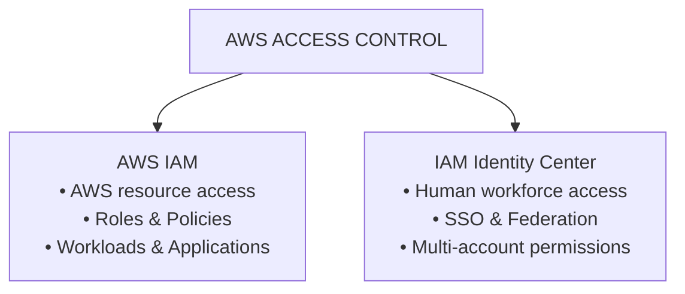

---

# 1. Why Does IAM Exist?

Before IAM, imagine AWS resources simply being accessible based on network location or account ownership.

That doesn't solve:

* Who is allowed to access what?
* What can an EC2 instance access?
* Can developers access production?
* Can an application write to S3?
* Can one AWS account access another?
* How do you enforce least privilege?
* How do you revoke access?
* How do you audit access?

AWS needed a centralized **authorization and identity mechanism**.

That's the fundamental reason IAM exists.

---

# 2. The Core IAM Problem

Think of every AWS request as:

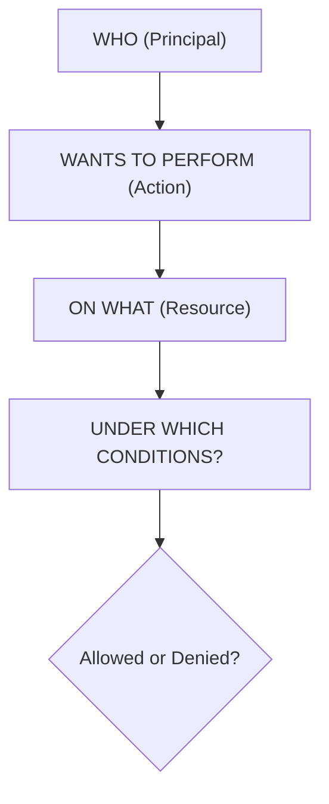

Example:

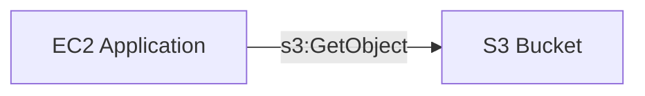

IAM answers:

> Is this EC2 workload allowed to perform `s3:GetObject` on this bucket?

---

# 3. IAM's Main Components

You need to think about:

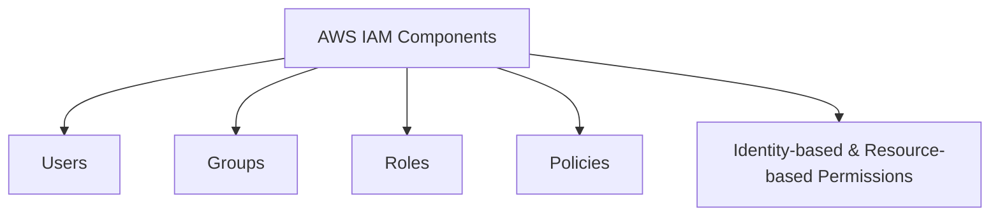

But for **modern AWS architecture**, the most important concepts are:

> **IAM Roles + Policies**

Not manually creating IAM users for every person.

---

# 4. IAM Users — Why Do They Exist?

An IAM user represents an AWS identity within an AWS account.

Historically:

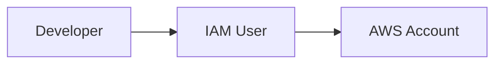

Users can have:

* Console access
* Access keys

But from a modern SAP-C02 architecture perspective:

> **Avoid creating long-lived IAM users for human workforce access when federation/Identity Center is appropriate.**

---

# 5. Why IAM Users Are Operationally Expensive

Imagine:

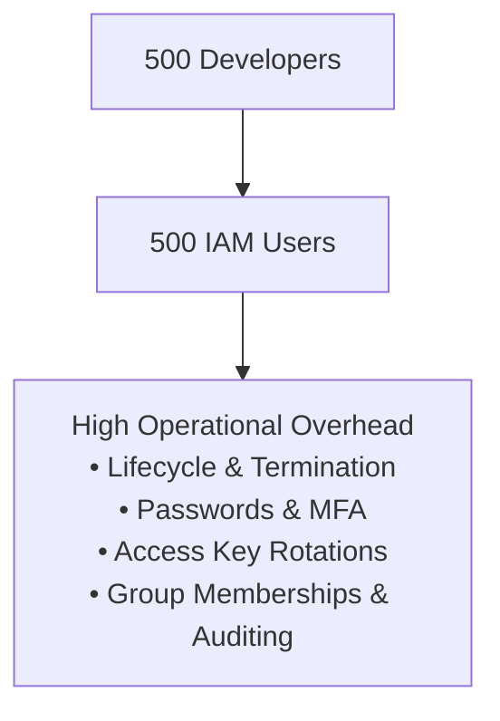

Operational overhead grows with the number of users.

That's why AWS provides better workforce identity patterns.

---

# 6. IAM Roles — The Most Important IAM Concept

A role is an identity that can be **assumed**.

Think:

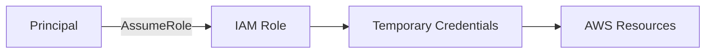

The role itself doesn't have a traditional password or permanent access key.

---

# 7. Why Roles Exist

Roles solve the problem of:

> **"How can something access AWS without embedding long-lived credentials?"**

Example:

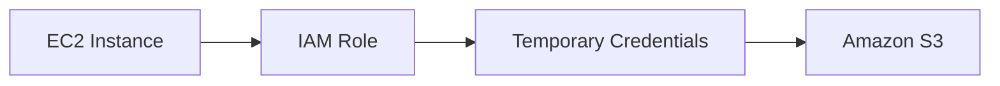

No:

```text
AWS_ACCESS_KEY_ID
AWS_SECRET_ACCESS_KEY
```

hardcoded into the application.

---

# 8. Role vs User — Exam Mental Model

| Requirement | Think |
|---|---|
| Human identity | IAM Identity Center / federation |
| AWS workload identity | IAM Role |
| EC2 accessing S3 | IAM Role |
| Lambda accessing DynamoDB | IAM Role |
| ECS task accessing S3 | IAM Role |
| Cross-account access | IAM Role |
| CI/CD accessing AWS | IAM Role |
| Long-lived human credentials | Avoid where possible |

---

# 9. IAM Policies

Policies define permissions.

Conceptually:

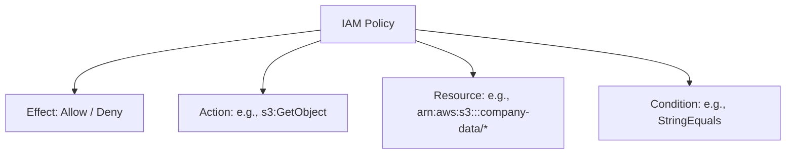

Example:

```text
Allow
  s3:GetObject
  on
  arn:aws:s3:::company-data/*
```

The goal is:

> **Grant exactly what is required and nothing more.**

That's **least privilege**.

---

# 10. Why Least Privilege Exists

Suppose an application only needs:

```text
S3 GetObject
```

but you give it:

```text
AdministratorAccess
```

Then a compromised application could potentially perform many destructive actions.

Instead:

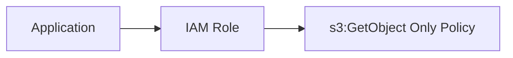

This reduces the blast radius.

---

# 11. IAM Is Not Just Security — It's Architecture

For SAP-C02, think:

> **IAM is an application dependency.**

Example:

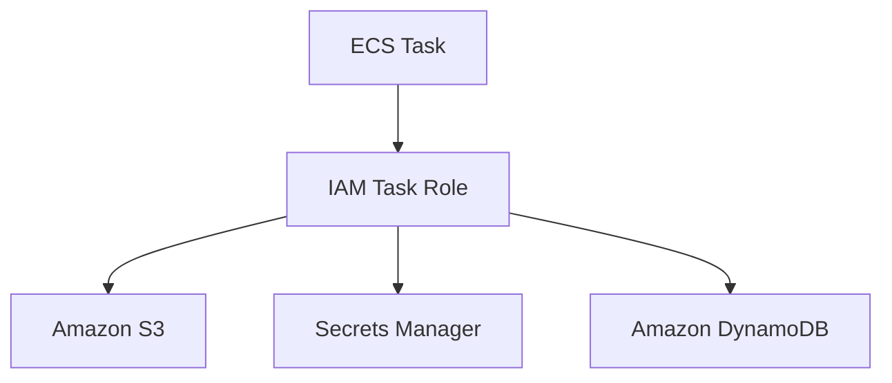

The architecture should define permissions as part of the workload design.

---

# 12. IAM Role for EC2

Classic exam architecture:

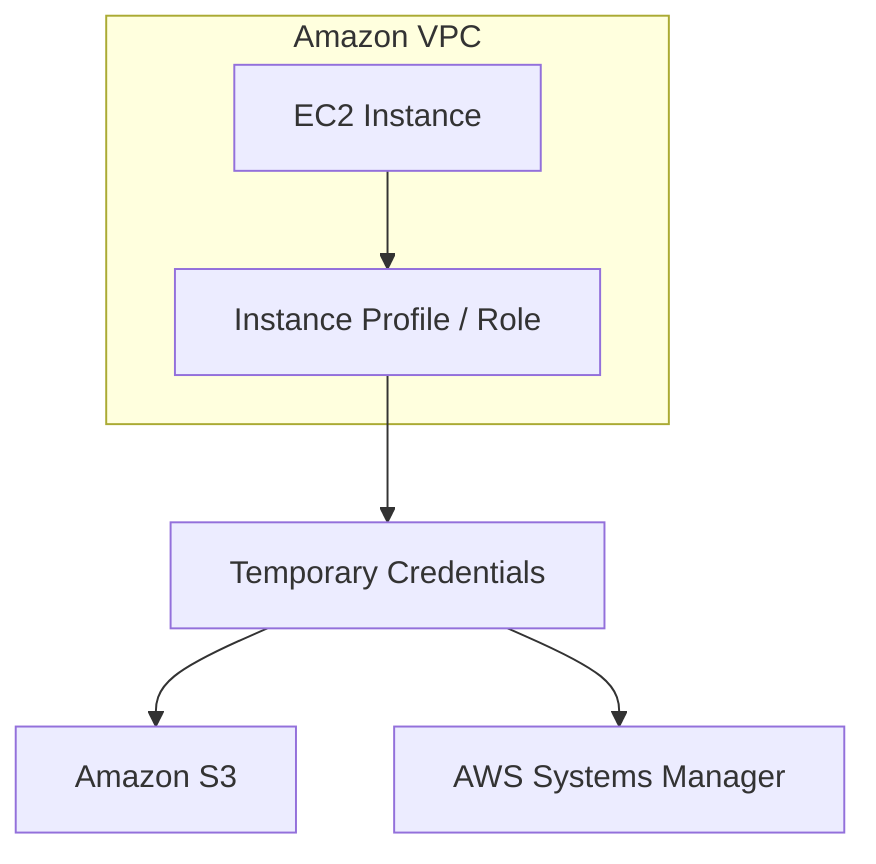

### Why?

Avoid:

```text
EC2
 │
 ▼
Hardcoded access keys
```

Use:

```text
EC2
 │
 ▼
IAM Role
```

### Operational overhead

**Low.**

AWS handles temporary credential delivery and rotation.

### Cost

IAM itself has no charge for the basic IAM capability.

The cost is primarily the AWS resources you access, not the IAM role itself.

---

# 13. IAM Role for Lambda

Same principle:

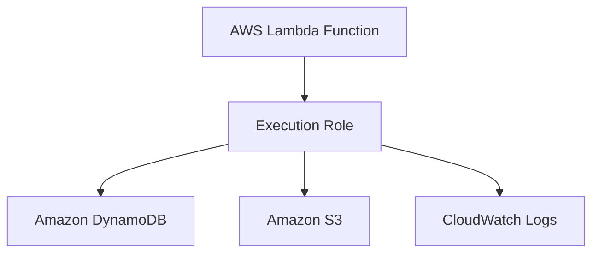

Don't create an IAM user for Lambda.

---

# 14. IAM Role for ECS

For ECS, SAP-C02 questions may distinguish:

### Task execution role

Used by ECS/Fargate infrastructure for things such as pulling images and sending logs, depending on configuration.

### Task role

Used by the application running inside the container.

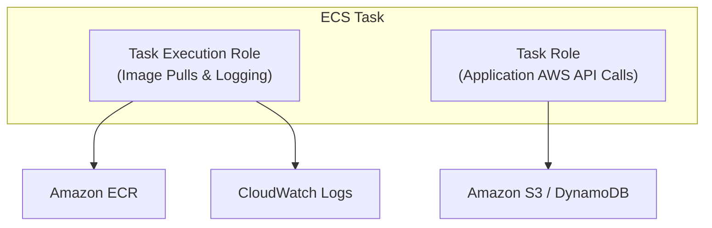

This separation is important for least privilege.

---

# 15. IAM Role for Cross-Account Access

Suppose:

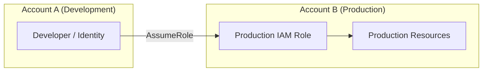

This is much better than sharing credentials between accounts.

---

# 16. Why Cross-Account Roles Exist

They solve:

> **"How can an identity from Account A temporarily access resources in Account B without creating permanent credentials in Account B?"**

Example:

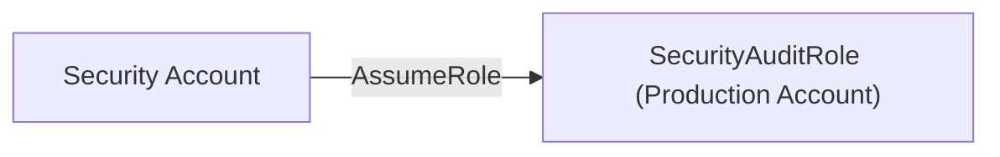

Very common in multi-account AWS organizations.

---

# 17. IAM Role — Two Policies You Should Understand

For cross-account `AssumeRole`, think about:

```text
Trust Policy
     +
Permissions Policy
```

### Trust policy

Answers:

> **Who can assume this role?**

### Permissions policy

Answers:

> **What can the role do after assuming it?**

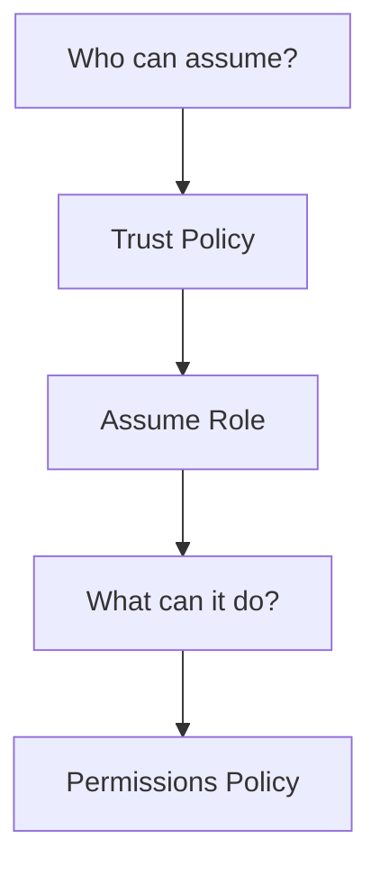

This distinction is a classic exam area.

---

# 18. IAM Identity Center — Why Does It Exist?

Now we move to the other service.

IAM Identity Center solves a different problem:

> **"How do I centrally manage human workforce access across many AWS accounts and applications?"**

Imagine:

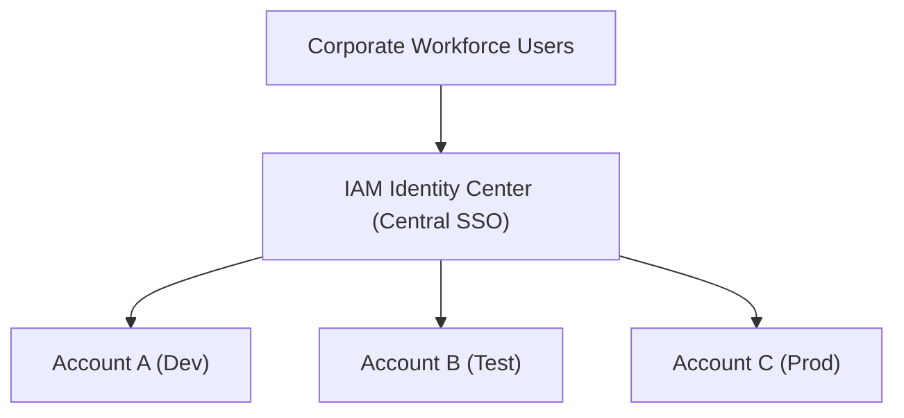

Instead of creating separate IAM users in every account.

---

# 19. The Problem at Scale

Without Identity Center:

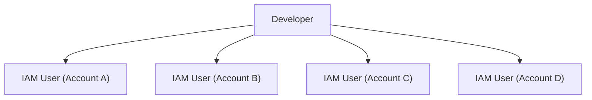

Huge operational problem.

With Identity Center:

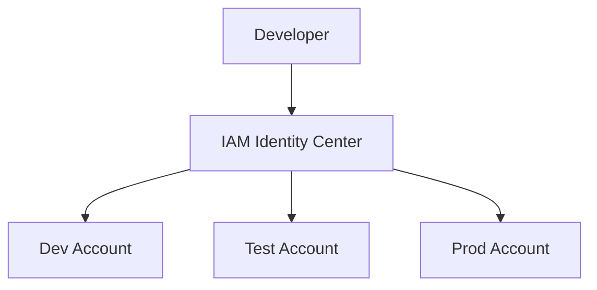

One workforce identity can obtain access to multiple accounts based on assignments.

---

# 20. IAM Identity Center + External IdP

In an enterprise, you often already have:

* Microsoft Entra ID
* Active Directory
* Okta
* Another SAML/OIDC-capable identity provider

Architecture:

```mermaid
flowchart LR
    User["Corporate User"] --> IdP["Corporate IdP (Entra ID / Okta)"] --> IC["IAM Identity Center"] --> Accounts["AWS Multi-Account Environment"]
```

This is a very strong enterprise architecture.

---

# 21. Why Not IAM Users?

Compare:

### IAM users

```text
User
 │
 ├── Account A
 ├── Account B
 ├── Account C
 └── Account D
```

### Identity Center

```text
User
 │
 ▼
Central Identity
 │
 ▼
Account assignments
```

The second is much easier to govern.

---

# 22. IAM Identity Center and AWS Organizations

These services commonly work together.

```mermaid
flowchart TD
    Org["AWS Organizations (Account Governance & OUs)"] <--> IC["IAM Identity Center (Workforce Access)"]
    IC --> AccA["Account A"]
    IC --> AccB["Account B"]
    IC --> AccC["Account C"]
```

### Organizations

Manages:

* Accounts
* Organizational Units
* SCPs
* Central governance

### Identity Center

Manages:

* Human workforce access
* Permission sets
* Account assignments

---

# 23. Permission Sets

This is a key Identity Center concept.

Think:

```text
Permission Set
      │
      ├── ReadOnly
      ├── Developer
      ├── DatabaseAdmin
      └── SecurityAudit
```

Then:

```mermaid
flowchart LR
    Group["Workforce Group (Developers)"] --> PermSet["Developer Permission Set"] --> Account["Target AWS Account"]
```

Example:

```text
Developers
    │
    ▼
Developer Permission Set
    │
    ▼
Dev Account
```

---

# 24. Permission Set vs IAM Policy

Don't confuse them.

### IAM policy

Defines AWS permissions.

### Identity Center permission set

Defines the permissions/session configuration assigned to workforce users/groups for AWS account access.

Conceptually:

```mermaid
flowchart TD
    Workforce["Workforce User"] --> PermSet["Permission Set"] --> Account["AWS Account"] --> ManagedRole["Managed IAM Role (Created in Account)"]
```

---

# 25. IAM Identity Center — Operational Overhead

### Without Identity Center

```text
1000 users
×
20 AWS accounts
```

Potentially huge access-management complexity.

### With Identity Center

```mermaid
flowchart TD
    Users["Users / Groups"] --> Central["Central Assignments"] --> Accounts["20 AWS Accounts"]
```

Much lower operational overhead.

That's why it is highly attractive in enterprise multi-account environments.

---

# 26. Cost Perspective

For SAP-C02, don't assume:

> "More secure = more expensive."

IAM is fundamentally a governance/control layer.

The important cost question is often:

> **Which architecture minimizes operational cost while maintaining security?**

### IAM

Basic IAM functionality does not carry a separate per-user/per-role charge.

### IAM Identity Center

The service is designed for centralized workforce access; the important architectural cost benefit is often **reduced administrative overhead**, rather than simply comparing an IAM user price against an Identity Center price.

Also consider costs of any external identity provider you use.

---

# 27. Operational Cost Is Often More Important

Suppose:

```text
500 engineers
20 AWS accounts
```

Manual IAM-user administration creates costs through:

* Onboarding
* Offboarding
* Permission changes
* Access reviews
* MFA management
* Credential management
* Auditing

Identity Center centralizes this.

So:

> **Lower operational overhead can be a much bigger architectural benefit than direct AWS service pricing.**

---

# 28. IAM vs IAM Identity Center

This is the most important comparison:

| Feature | IAM | IAM Identity Center |
|---|---|---|
| Primary purpose | AWS access control | Workforce access |
| Workloads | ✅ | Not primary |
| Human users | Possible, but not preferred for centralized workforce access | ✅ |
| Roles | ✅ | Uses AWS account roles through assignments |
| Policies | ✅ | Permission sets ultimately define permissions |
| Multi-account workforce | Possible but cumbersome | ✅ Designed for this |
| SSO | Not primary purpose | ✅ |
| External IdP | Federation possible | ✅ Strong fit |
| Operational overhead at scale | Higher if manually managed | Lower |
| Best mental model | "What can this principal do?" | "Which people get access to which accounts/apps?" |

---

# 29. The SAP-C02 Decision

If the question says:

> "Employees need centralized access to multiple AWS accounts."

Think:

**IAM Identity Center**

---

If it says:

> "EC2 needs to access S3."

Think:

**IAM Role**

---

If it says:

> "Lambda needs DynamoDB access."

Think:

**IAM execution role**

---

If it says:

> "Application in Account A needs temporary access to Account B."

Think:

**Cross-account IAM Role**

---

If it says:

> "Corporate employees authenticate using the company's existing identity provider."

Think:

**IAM Identity Center + external IdP**

---

# 30. Identity Center + Organizations + SCP

This is a **very important SAP-C02 architecture**.

These three solve different layers:

```mermaid
flowchart TD
    Org["AWS Organizations (Governance)"] --> IC["IAM Identity Center (Human Access)"]
    Org --> SCP["Service Control Policies (Guardrails)"]

    IC --> Accounts["AWS Accounts"]
    SCP --> Accounts
    Accounts --> IAM["IAM (Workload & Resource Access)"]
```

### Identity Center

> Who gets access?

### IAM

> What can the identity do?

### SCP

> What maximum permissions are allowed for the account/OU?

---

# 31. SCP vs IAM Policy

Classic exam trap.

Suppose:

```text
IAM Policy
Allow s3:DeleteBucket
```

But:

```text
SCP
Deny s3:DeleteBucket
```

Result:

```text
DENIED
```

Think:

> **SCP = organizational guardrail**

not a replacement for IAM permissions.

---

# 32. Permission Evaluation Mental Model

Simplified:

```mermaid
flowchart TD
    Req["Request"] --> Auth["Authentication"] --> IdentityRes["Identity & Resource Policies"] --> SCPBound["SCP / Boundaries / Explicit Denies"] --> Cond["Conditions"] --> Decision{"Allow or Deny?"}
```

The exact IAM evaluation model has more nuance, but for SAP-C02 you should always remember:

> **Explicit Deny wins.**

---

# 33. IAM Policy Conditions

Conditions are extremely valuable for least privilege.

For example:

```text
Allow S3 access
ONLY IF
source conditions are satisfied
```

Common condition concepts include:

* Source IP
* VPC endpoint
* MFA
* Requested region
* Principal tags
* Resource tags
* Encryption requirements
* Time-based conditions

This lets you move from:

```text
Allow
```

to:

```text
Allow IF...
```

---

# 34. ABAC — Attribute-Based Access Control

For large organizations, ABAC can dramatically reduce operational overhead.

Instead of creating:

```text
Project-A-Role
Project-B-Role
Project-C-Role
Project-D-Role
...
```

use tags/attributes.

Example:

```text
User:
Project = Finance

Resource:
Project = Finance
```

Policy:

```text
Allow access
IF
user.Project == resource.Project
```

Conceptually:

```mermaid
flowchart TD
    Policy["IAM ABAC Policy"] --> Match{"Principal Tag == Resource Tag?"}
    Match -->|YES| Allow["Allow Access"]
    Match -->|NO| Deny["Deny Access"]
```

For large enterprises:

> **ABAC can reduce policy-management overhead.**

---

# 35. RBAC vs ABAC

### RBAC (Role-Based Access Control)

```mermaid
flowchart LR
    User["User"] --> Role["Assigned Role"] --> Perms["Static Permissions"]
```

Easy to understand, but can create role explosion as teams scale.

### ABAC (Attribute-Based Access Control)

```mermaid
flowchart TD
    UserAttr["User Attribute (e.g., Project=Finance)"] --> Match{"Tags Match?"}
    ResAttr["Resource Tag (e.g., Project=Finance)"] --> Match
    Match -->|YES| Allow["Allow Access"]
    Match -->|NO| Deny["Deny Access"]
```

Can scale better when access follows organizational attributes.

---

# 36. IAM Access Analyzer

Although your stated topic is IAM and Identity Center, for SAP-C02 you should associate **IAM Access Analyzer**.

It helps identify:

* Resources shared externally
* Unintended access
* Policies that grant access
* Unused permissions in applicable scenarios

Mental model:

```mermaid
flowchart TD
    IAM["AWS IAM (Roles & Policies)"] --> Analyzer["IAM Access Analyzer"] --> Finding["Identifies Too Broad / External Access"]
```

This complements IAM rather than replacing it.

---

# 37. IAM Access Analyzer vs IAM

### IAM

> Defines access.

### IAM Access Analyzer

> Helps analyze access.

```mermaid
flowchart LR
    Policy["IAM Policy"] --> Perms["Granted Permissions"] --> Analyzer["Access Analyzer"] --> Alert["Unintended External Access Alert"]
```

---

# 38. IAM Access Analyzer vs Access Advisor

Another exam distinction.

### IAM Access Analyzer

Think:

> **"Who can access this resource?"**

and policy/access analysis.

### IAM Access Advisor

Think:

> **"Which services has this identity actually used?"**

This can help refine permissions.

```mermaid
flowchart TD
    Analyzer["Access Analyzer ➔ Potential / Configured Access"]
    Advisor["Access Advisor ➔ Historical Service Usage"]
```

---

# 39. IAM Credential Report

For IAM users, the credential report can provide account-level credential information useful for auditing.

But remember:

> If you're designing modern workforce access, don't solve an enterprise workforce problem by creating thousands of IAM users just so you can generate a credential report.

That's treating the symptom instead of solving the architecture.

---

# 40. Security Architecture — Recommended Modern Pattern

For a large organization:

```mermaid
flowchart TD
    IdP["Corporate IdP"] --> IC["IAM Identity Center"]
    IC --> Orgs["AWS Organizations (SCPs)"]
    Orgs --> Accounts["AWS Accounts"]
    Accounts --> IAM["IAM Roles"]
    IAM --> Workloads["EC2 / Lambda / ECS Tasks"]
    Workloads --> Services["AWS Services"]
```

This separates **human identity, organizational governance, and workload identity**.

---

# 41. Minimum Requirements — What Do I Actually Need?

This is the architectural way to think about it.

### Small AWS environment

```text
One account
Few engineers
Few workloads
```

You may only need:

```text
IAM Roles
IAM Policies
MFA
```

Don't introduce unnecessary complexity.

---

### Enterprise / Multi-account

```text
50+ AWS accounts
1000+ employees
Central corporate identity
```

Now:

```text
AWS Organizations
+
IAM Identity Center
+
External IdP
+
SCPs
+
IAM Roles
```

makes much more sense.

---

# 42. Operational Overhead Matrix

| Design | Small environment | Large enterprise |
|---|--:|--:|
| IAM users everywhere | Simple initially | 🔴 Very high |
| IAM roles | 🟢 Low | 🟢 Low |
| Identity Center | 🟢 Good | 🟢 Excellent |
| External IdP + Identity Center | Maybe unnecessary | 🟢 Excellent |
| Manual cross-account users | 🔴 | 🔴 |
| Cross-account roles | 🟢 | 🟢 |
| ABAC | Maybe unnecessary | 🟢 Excellent at scale |
| SCPs | Useful | 🟢 Essential governance tool |
| Access Analyzer | 🟢 | 🟢 |

---

# 43. Cost Optimization Through IAM

IAM isn't primarily a cost-control service, but it affects cost indirectly.

Example:

```text
Developer
   │
   ▼
Overly broad access
   │
   ▼
Can create expensive resources
   │
   ▼
Unexpected AWS bill
```

Least privilege can reduce the risk of unauthorized or accidental resource creation.

But don't confuse this with:

> IAM directly reduces AWS resource pricing.

It doesn't.

---

# 44. IAM and Automation

For automation:

```mermaid
flowchart LR
    CICD["CI/CD Pipeline"] --> Role["Federated IAM Role (OIDC)"] --> TempCreds["Temporary Credentials"] --> APIs["AWS APIs"]
```

Avoid:

```text
GitHub/GitLab/Jenkins
        │
        ▼
Long-lived AWS access key
```

Modern architectures can use **OIDC federation** so CI/CD systems obtain temporary AWS credentials through an IAM role.

This is a strong SAP-C02 security pattern.

---

# 45. Human vs Machine Identity

This is perhaps the **best mental model** for the entire topic:

```mermaid
flowchart TD
    Identity["IDENTITY MANAGEMENT"] --> Human["HUMAN WORKFORCE"]
    Identity --> Machine["MACHINE / WORKLOAD"]

    Human --> IC["IAM Identity Center"] --> SSO["Workforce SSO"] --> Accounts["AWS Accounts"]
    Machine --> Role["IAM Role"] --> TempCreds["Temporary Credentials"] --> Services["AWS Services"]
```

If you remember only one diagram, remember this.

---

# 46. Common SAP-C02 Traps

### ❌ Trap 1

> Create IAM users for every developer.

Usually not the preferred modern enterprise architecture.

Think:

**Identity Center + federation**

---

### ❌ Trap 2

> Give EC2 an IAM user access key.

Prefer:

**IAM role attached to EC2**

---

### ❌ Trap 3

> Give everyone AdministratorAccess because it is operationally simpler.

Fails:

**Least privilege**

---

### ❌ Trap 4

> Use IAM Identity Center for EC2 permissions.

Not the primary use case.

Think:

**IAM role**

---

### ❌ Trap 5

> Use SCP to grant permissions.

SCPs provide guardrails/max permissions; they don't grant the permissions needed by themselves.

---

### ❌ Trap 6

> IAM role's trust policy specifies what the role can do.

No.

```text
Trust Policy
    ↓
WHO can assume?

Permissions Policy
    ↓
WHAT can they do?
```

---

# 47. SAP-C02 Scenario Recognition

| Scenario | Best architecture |
|---|---|
| EC2 → S3 | EC2 IAM Role |
| Lambda → DynamoDB | Lambda execution role |
| ECS application → AWS APIs | ECS task role |
| Developer → multiple AWS accounts | IAM Identity Center |
| Existing corporate IdP | Identity Center + external IdP |
| Account A → Account B | Cross-account IAM Role |
| CI/CD → AWS | Federated IAM Role / OIDC |
| Prevent entire OU from disabling CloudTrail | SCP |
| Find unintended public/cross-account access | IAM Access Analyzer |
| Determine unused permissions | IAM Access Advisor / policy analysis |
| Large organization with dynamic project access | ABAC |
| Avoid long-lived credentials | IAM Roles / federation |

---

# 48. Cost / Trade-Off Decision Tree

Use this in the exam:

```mermaid
flowchart TD
    Start["WHO needs access?"] --> Type{"Human or Workload?"}
    
    Type -->|Workload| Role["IAM Role"]
    Type -->|Human| Accounts{"Multiple Accounts?"}

    Accounts -->|YES| IC["IAM Identity Center"]
    Accounts -->|NO| IAMFed["IAM / Federation"]
```

Then:

```mermaid
flowchart TD
    Ent{"Enterprise Scale?"} -->|YES| EnterpriseArch["Identity Center + Organizations + SCP + External IdP"]
```

---

# 49. The "Why Does It Exist?" Summary

| Service | Why AWS created it | Problem solved |
|---|---|---|
| **IAM** | Fine-grained AWS authorization | Who can do what to which AWS resource? |
| **IAM Role** | Temporary/workload identity | Avoid long-lived credentials |
| **IAM Policy** | Permission definition | Least privilege |
| **IAM Identity Center** | Central workforce access | SSO across AWS accounts |
| **Permission Set** | Standardized workforce permissions | Consistent account access |
| **AWS Organizations** | Multi-account governance | Central account management |
| **SCP** | Organization guardrails | Restrict maximum permissions |
| **IAM Access Analyzer** | Access analysis | Detect unintended access |
| **IAM Access Advisor** | Usage visibility | Identify unused permissions |

---

# 🧠 Final SAP-C02 Mental Model

Don't memorize:

> "IAM does X, Identity Center does Y."

Think in **four questions**:

```mermaid
flowchart TD
    Design["ACCESS DESIGN"] --> Who["WHO? (Identity Center / IAM Role)"]
    Design --> What["WHAT? (IAM Policy)"]
    Design --> Where["WHERE? (AWS Account / Resource)"]
    Design --> Cond["CONDITIONS? (Least Privilege / ABAC)"]
```

And then apply the architecture:

```mermaid
flowchart TD
    Human["HUMAN WORKFORCE"] --> IC["IAM Identity Center"] --> Accounts["AWS Accounts (Governed by SCPs)"] --> IAM["AWS IAM"] --> Roles["Workload Roles (EC2 / Lambda / ECS Task Roles)"] --> Services["AWS Services"]
```

### 🏆 If you see these phrases in SAP-C02:

**"Employees / workforce / SSO / multiple AWS accounts"**  
→ **IAM Identity Center**

**"EC2/Lambda/ECS/application needs AWS access"**  
→ **IAM Role**

**"Cross-account temporary access"**  
→ **IAM Role + trust policy**

**"Who can assume the role?"**  
→ **Trust policy**

**"What can the role do?"**  
→ **Permissions policy**

**"Central corporate identity"**  
→ **Identity Center + external IdP**

**"Organization-wide restriction"**  
→ **SCP**

**"Least privilege / unintended access"**  
→ **IAM policies + Access Analyzer**

**"Avoid operational overhead at enterprise scale"**  
→ **Centralized Identity Center + federation + groups/permission sets + Organizations/SCPs**

**"Avoid long-lived credentials"**  
→ **IAM Roles / federation / temporary credentials**

The key SAP-C02 trade-off is not simply **"which service is cheaper?"** It is:

> **Use the simplest identity architecture that provides least privilege, centralized governance, temporary credentials, and manageable access at the organization's scale.**