# Task 1.2: Prescribe Security Controls

For AWS Solutions Architect Professional, think about this skill as:

> **“How do I control who can access AWS resources, how identities enter AWS, how data is protected, and how security events are centrally detected and audited?”**

The four areas are connected:

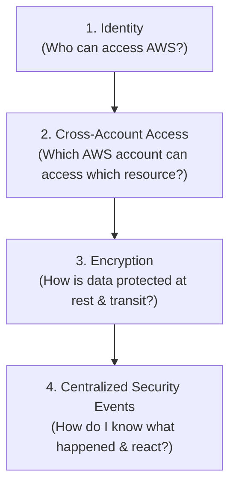

A useful SAP-C02 mental model is:

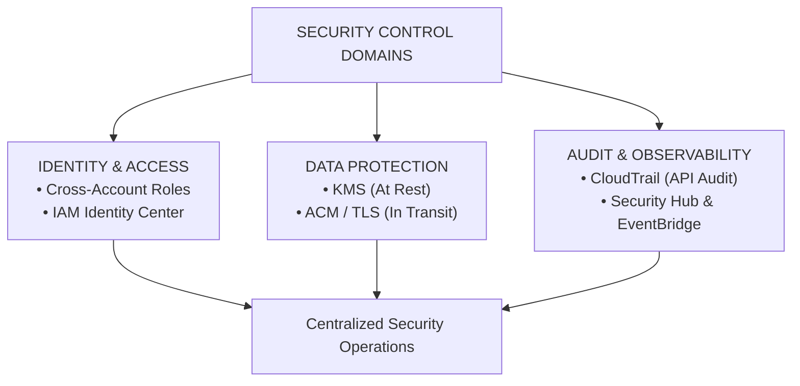

---

# 1. Evaluating Cross-Account Access Management

## Why does cross-account access exist?

AWS Organizations commonly contains multiple accounts.

For example:

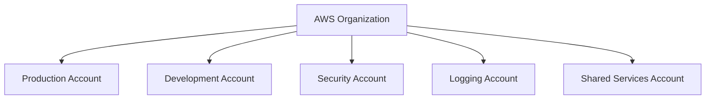

Now imagine:

```text
Production Account → S3 bucket
Security Account → Security tooling
```

The security account needs access to resources in Production.

You have two choices:

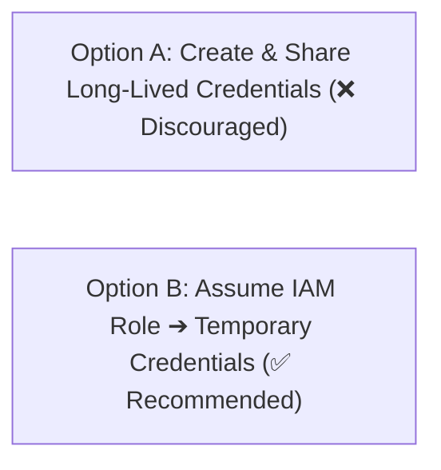

The second approach is normally preferred.

---

# 2. The core cross-account pattern

The most important pattern is:

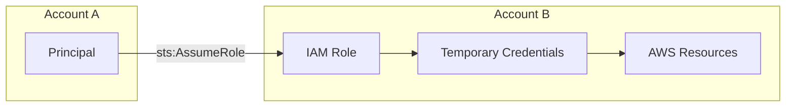

Example:

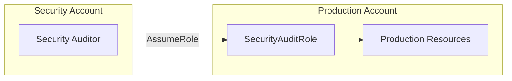

This solves:

> **“How does an identity in one AWS account access resources in another AWS account without creating permanent credentials?”**

---

# 3. Why IAM roles instead of IAM users?

Long-lived access keys:

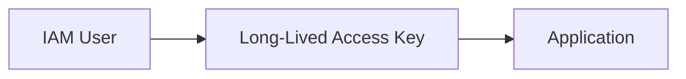

Problems:

* Credential storage
* Credential rotation
* Credential leakage
* Long-lived permissions

Cross-account IAM role:

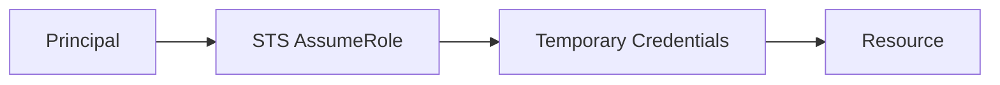

Benefits:

* Temporary credentials
* Centralized permissions
* No permanent cross-account access keys
* Better auditing

For SAP-C02, this is a strong default pattern.

---

# 4. Minimum cross-account architecture

For a basic cross-account requirement:

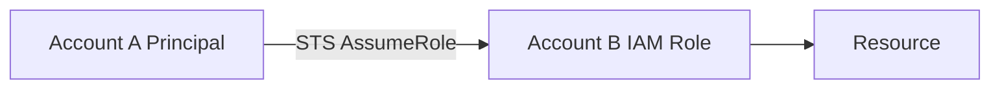

You need:

```text
Trust policy + Permissions policy
```

Think about two questions.

Trust policy:

> **“Who is allowed to assume this role?”**

Permissions policy:

> **“What is the role allowed to do?”**

---

# 5. Trust policy vs permissions policy

This distinction is extremely important.

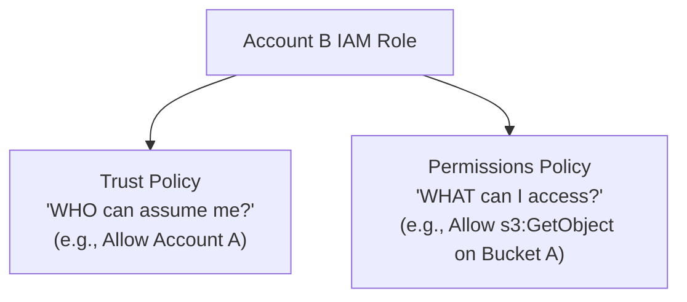

Example:

```text
Trust Policy: Account A ➔ Allowed to assume role
Permissions Policy: Role ➔ s3:GetObject on Bucket A
```

Both must permit the intended operation.

---

# 6. Operational overhead

Low.

AWS manages:

```text
STS
IAM
Credential generation
```

You manage:

```text
Role design
Trust policies
Permissions
Access reviews
Permission boundaries where required
Organization governance
```

The operational challenge grows with the number of accounts.

Example:

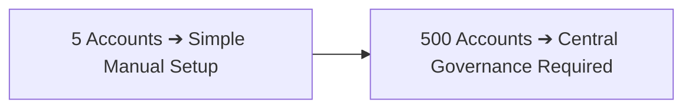

---

# 7. AWS Organizations makes this easier

For large organizations:

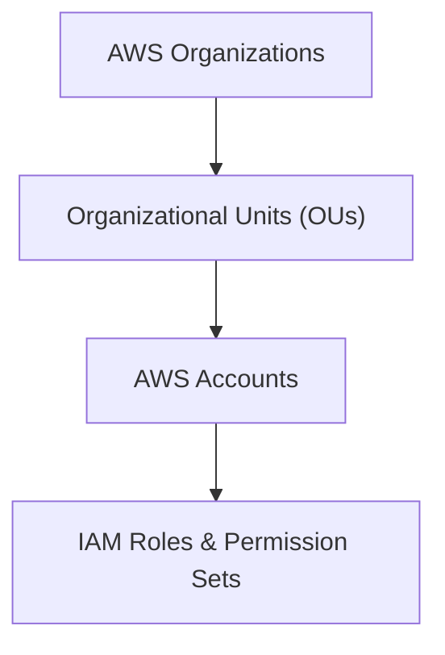

You can use:

* SCPs
* IAM roles
* Resource policies
* IAM Identity Center

Each solves a different problem.

---

# 8. SCP vs IAM policy

This is a major SAP-C02 distinction.

IAM policy:

> **“What can this principal do?”**

SCP:

> **“What maximum permissions are allowed for this account or OU?”**

Example:

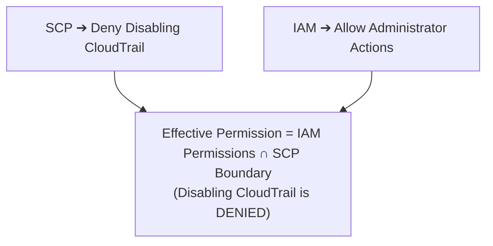

An SCP does not grant permissions.

---

# 9. Resource-based policies

Sometimes you do not need AssumeRole.

AWS resources such as:

* S3
* SQS
* SNS
* KMS

support resource-based policies.

Example:

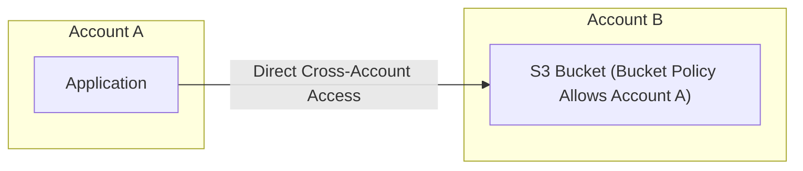

This is another important exam choice.

---

# 10. Role vs resource policy

Think about the requirement.

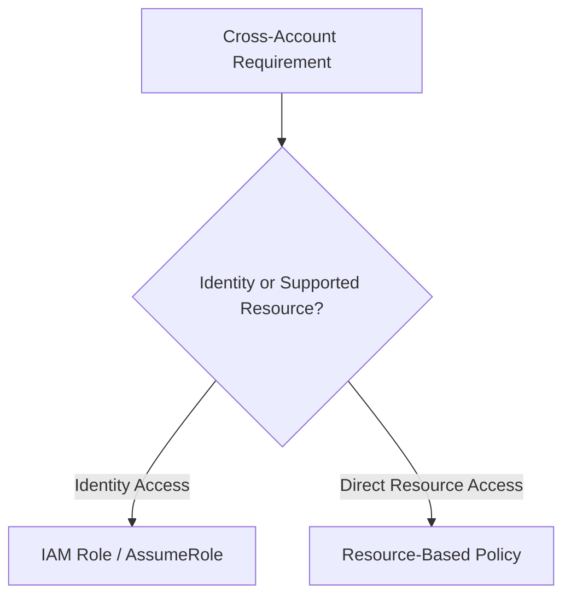

The correct solution depends on the service and access pattern.

---

# 11. Cross-account access trade-offs

IAM role:

Advantages:

```text
Temporary credentials
Central permission model
Strong auditing
Good for applications and administrators
```

Trade-offs:

```text
Trust policy complexity
Role sprawl
Permission management
STS dependency
```

Resource-based policy:

Advantages:

```text
Direct resource sharing
Useful for supported services
Simple for specific resource access
```

Trade-offs:

```text
Policy management
Resource-specific behavior
Potential overly broad principals
```

SCP:

Advantages:

```text
Organization-wide guardrails
Central governance
Prevent dangerous actions
```

Trade-offs:

```text
Does not grant permissions
Troubleshooting becomes harder
Poorly designed SCPs can block legitimate operations
```

---

# 12. Cross-account access decision tree

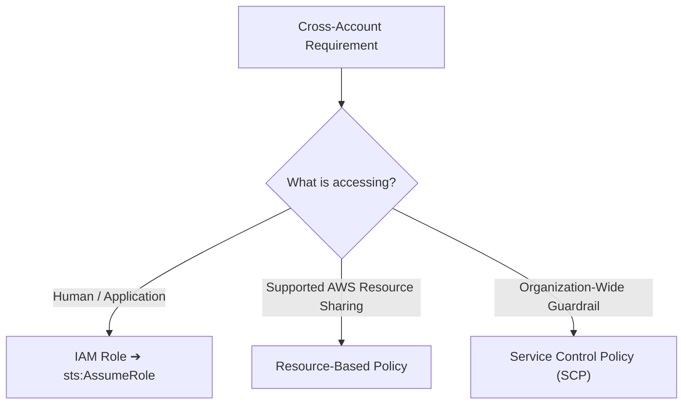

Do not automatically choose SCP for cross-account access.

SCP is a guardrail, not an access grant.

---

# 13. Integrating With Third-Party Identity Providers

Now the problem changes.

Instead of:

```text
AWS account ➔ IAM users
```

an enterprise might already have:

* Microsoft Entra ID
* Okta
* Ping Identity
* Active Directory

The company does not want employees maintaining separate AWS passwords.

---

# 14. Why does federation exist?

Without federation:

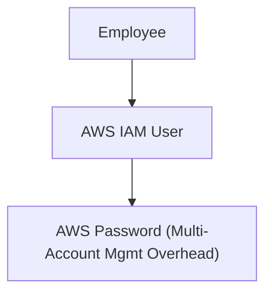

Federation provides:

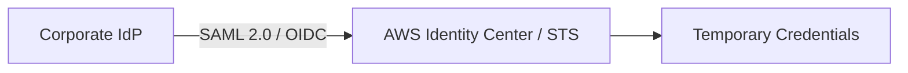

The core problem is:

> **“How do existing corporate identities access AWS without creating separate long-lived AWS identities?”**

---

# 15. IAM Identity Center

For workforce access across multiple AWS accounts, think:

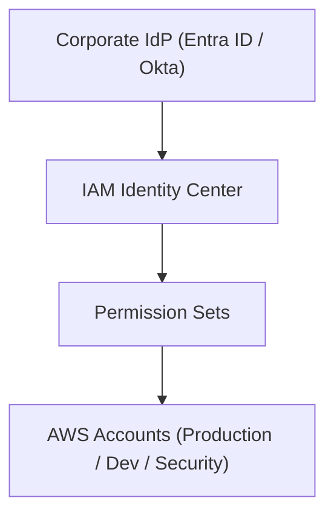

Example:

```text
Microsoft Entra ID ➔ IAM Identity Center ➔ Permission Set ➔ Production Account ➔ ReadOnly / Admin role
```

This is a major SAP-C02 pattern.

---

# 16. Why IAM Identity Center exists

Imagine:

```text
1000 employees × 50 AWS accounts = 50,000 IAM User instances (Huge Mgmt Overhead)
```

With Identity Center:

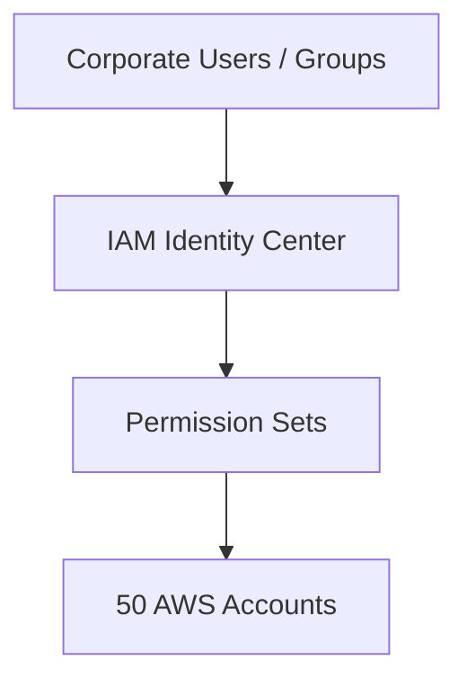

Centralized access management becomes easier.

---

# 17. Minimum federation architecture

```mermaid
flowchart LR
    IdP["Corporate IdP"] -->|"SAML 2.0 / OIDC"| IC["IAM Identity Center"] --> PermSet["Permission Set"] --> Acc["AWS Account"] --> Role["Managed IAM Role"]
```

The exact federation method depends on the identity provider and architecture.

---

# 18. Operational overhead

IAM Identity Center reduces AWS-side identity management.

You still operate:

```text
Identity provider
Groups
Users
Permission sets
Account assignments
Access reviews
```

But:

```mermaid
flowchart LR
    Leave["Employee Leaves Company"] --> Disable["Disable Corporate Identity"] --> AutoRevoke["AWS Access Automatically Revoked Across All Accounts"]
```

This is much easier than manually disabling IAM users across dozens of AWS accounts.

---

# 19. Cost thinking

The major cost benefit is often operational rather than infrastructure cost.

Compare:

```text
Separate IAM users → Many accounts → Credential management → Manual lifecycle
```

with:

```text
Corporate IdP → IAM Identity Center → Centralized access
```

The second architecture reduces administrative effort.

Also consider the existing IdP licensing cost.

If the company already pays for Entra ID or Okta, the architecture decision differs from introducing an additional identity platform.

---

# 20. Federation trade-offs

Advantages:

```text
Centralized identity
Single sign-on
Temporary credentials
Centralized lifecycle
Better employee offboarding
```

Trade-offs:

```text
Dependency on IdP
More federation configuration
Identity outage affects workforce access
Permission-set design becomes important
```

A major exam trade-off:

> **Centralized identity reduces IAM management but introduces dependency on the corporate identity provider.**

---

# 21. Related identity services

Know this ecosystem:

```mermaid
flowchart TD
    IdP["Corporate IdP"] -->|"SAML / OIDC"| IC["IAM Identity Center"] --> PermSets["Permission Sets"] --> Roles["IAM Roles"] --> Accounts["AWS Accounts"]
```

Related services:

* IAM
* STS
* IAM Identity Center
* AWS Organizations
* SCP
* Directory Service
* Cognito

Important distinction:

```mermaid
flowchart TD
    IC["IAM Identity Center ➔ Human Workforce Access (Employees / Admins)"]
    Cognito["Amazon Cognito ➔ Application Customer Access (End Users / App Clients)"]
```

Do not confuse workforce identity with application customer identity.

---

# 22. Encryption Strategies

Now move from identity to data protection.

There are two major encryption states:

```mermaid
flowchart TD
    Data["DATA ENCRYPTION STATES"] --> Rest["At Rest (AWS KMS)"]
    Data --> Transit["In Transit (TLS / ACM)"]
```

---

# 23. Encryption at rest

Problem:

> **“What happens if somebody gets access to the underlying storage?”**

Example:

```mermaid
flowchart LR
    S3["S3 Object"] --> Encrypt["Encryption Engine"] --> Protected["Encrypted Data at Rest"]
```

Even if somebody gains access to the underlying storage infrastructure, encrypted data remains protected without the encryption key.

---

# 24. AWS KMS

KMS is one of the most important services for this topic.

Think:

> **“Where do I manage encryption keys for AWS services and applications?”**

Architecture:

```mermaid
flowchart LR
    App["Application / AWS Service"] --> KMS["AWS KMS Key"] --> Encrypt["Encrypt / Decrypt Storage"]
```

Examples:

```text
S3, EBS, RDS, DynamoDB, Secrets Manager, SQS, SNS
```

Many AWS services integrate with KMS.

---

# 25. Why does KMS exist?

Without managed key management:

```mermaid
flowchart TD
    Manual["App Encrypts Data"] --> Hard["Manual Key Storage / Rotation / Access Control / Backup / Audit"]
```

This becomes operationally difficult.

KMS provides:

```mermaid
flowchart LR
    KMS["AWS KMS"] --> Centralized["Central Key Management + Access Control + Rotation + CloudTrail Audit"]
```

The problem it solves is:

> **“How do I securely manage cryptographic keys at AWS scale?”**

---

# 26. Minimum encryption-at-rest architecture

For S3:

```mermaid
flowchart LR
    S3["S3 Bucket"] --> SSE["SSE-KMS"] --> KMS["AWS KMS"]
```

For EBS:

```mermaid
flowchart LR
    EBS["EBS Volume"] --> KMS["AWS KMS"]
```

For RDS:

```mermaid
flowchart LR
    RDS["Amazon RDS"] --> KMS["AWS KMS"]
```

You don't normally build your own encryption server.

---

# 27. AWS-owned vs customer-managed keys

This is important for cost and control.

Conceptually:

```mermaid
flowchart TD
    Keys["Encryption Key Hierarchy"] --> Owned["AWS Owned Keys (Default, Zero Management)"]
    Keys --> Managed["AWS Managed Keys (Service-Specific, Auto Rotation)"]
    Keys --> CMK["Customer Managed Keys (Full Control over Policies, Rotation, Cross-Account)"]
```

Customer-managed KMS keys provide more control.

For example:

* Key policy
* Key rotation
* Key deletion
* Cross-account permissions
* Auditing

But additional control introduces additional management and cost.

---

# 28. KMS cost thinking

This is a classic SAP-C02 trade-off.

If the requirement is:

> “Encrypt S3 objects.”

You don't automatically need a customer-managed KMS key.

If the requirement says:

> **“Security team must control the encryption key, audit usage, and manage cross-account key access.”**

Then a customer-managed KMS key becomes more relevant.

Think:

```text
More control → More management → Potentially more cost
```

Use the least complex key-management model satisfying the requirement.

---

# 29. Customer-managed KMS key trade-offs

Advantages:

```text
Greater control
Key policies
Auditability
Cross-account control
Explicit lifecycle control
```

Trade-offs:

```text
KMS charges
Key-policy management
Deletion risk
Operational responsibility
More configuration
```

Important:

If you delete a customer-managed KMS key, encrypted data relying on that key might become inaccessible.

---

# 30. Encryption in transit

Problem:

```mermaid
flowchart LR
    Client["Client"] -. "Unencrypted Network Traffic Interception Risk" .- Server["Server"]
```

Network traffic might be intercepted.

Encryption in transit protects the communication channel.

Typical solution:

```mermaid
flowchart LR
    Client["Client"] -->|"HTTPS / TLS"| ALB["ALB"] -->|"HTTPS / TLS"| App["Application"]
```

For service-to-service communication:

```mermaid
flowchart LR
    AppA["Application A"] -->|"TLS"| AppB["Application B"]
```

---

# 31. TLS vs KMS

Another important distinction:

```mermaid
flowchart TD
    KMS["KMS ➔ Key Management / Encryption at Rest"]
    TLS["TLS / ACM ➔ Encryption in Transit"]
```

Do not use KMS as the answer to every encryption question.

---

# 32. AWS Certificate Manager

For TLS certificates, think:

```mermaid
flowchart LR
    ACM["AWS Certificate Manager (ACM)"] --> Cert["TLS Certificate"] --> ALB["ALB / CloudFront / API Gateway"] --> HTTPS["HTTPS Public Endpoint"]
```

ACM reduces certificate-management overhead.

Problem:

```text
Certificate issuance
Certificate renewal
Certificate deployment
Certificate rotation
```

Manual certificate management creates operational work.

ACM automates much of this for supported AWS integrations.

---

# 33. Minimum encryption architecture

For a public web application:

```mermaid
flowchart LR
    User["User"] -->|"HTTPS"| ALB["ALB (ACM Certificate Attached)"] --> App["Application"]
```

For complete protection:

```mermaid
flowchart TD
    User["User"] -->|"1. TLS / HTTPS (ACM)"| ALB["ALB"] --> App["Application"] -->|"2. KMS Encryption at Rest"| Storage["Encrypted S3 / EBS / RDS"]
```

---

# 34. Encryption trade-offs

Encrypt everything:

Advantages:

```text
Better security
Compliance
Reduced data exposure
```

Trade-offs:

```text
Key management
Performance considerations
KMS API usage
Configuration complexity
Troubleshooting
```

Use AWS-managed encryption where requirements allow it.

Use customer-managed keys when the organization requires control over key policy, cross-account access, auditing, or key lifecycle.

---

# 35. Centralized Security Event Notifications and Auditing

Now combine the previous concepts.

Problem:

An enterprise has 100 AWS accounts, 20 regions, thousands of resources, and multiple security services.

You need:

* Centralized visibility
* Centralized notifications
* Centralized auditing
* Automated response

This is where the architecture becomes:

```mermaid
flowchart TD
    Accounts["AWS Accounts"] --> SecServices["Security Services"] --> Bus["Central Event Bus (EventBridge)"] --> Ops["Security Operations"]
```

---

# 36. CloudTrail for auditing

CloudTrail answers:

> **“What happened?”**

Example:

```mermaid
flowchart LR
    Change["IAM Policy Changed"] --> CT["CloudTrail Event Captured"]
```

For centralized auditing:

```mermaid
flowchart TD
    Accounts["AWS Accounts"] --> OrgTrail["Organization Trail"] --> LogBucket["Central S3 Bucket (Logging Account)"]
```

This gives the security team a centralized audit history.

---

# 37. EventBridge for real-time security notifications

EventBridge answers:

> **“What should happen when an event occurs?”**

Example:

```mermaid
flowchart LR
    CT["CloudTrail Event"] --> EB["EventBridge Rule"] --> SNS["SNS Topic"] --> SecTeam["Security Team Alert"]
```

Or:

```mermaid
flowchart LR
    SH["Security Hub Finding"] --> EB["EventBridge"] --> Lambda["Lambda / Step Functions"] --> Remediation["Automated Remediation"]
```

This distinction is important:

```mermaid
flowchart TD
    CT["CloudTrail ➔ Records Events"]
    EB["EventBridge ➔ Routes Events"]
    SNS["SNS ➔ Notifies People / Systems"]
```

---

# 38. SNS for centralized notifications

SNS is useful when the requirement is:

> **“Notify the security team.”**

Architecture:

```mermaid
flowchart LR
    Finding["Security Finding"] --> EB["EventBridge"] --> SNS["SNS Topic"] --> Notify["Email / SMS / Slack / PagerDuty"]
```

For enterprise security notifications, you might instead route to SNS, SQS, Lambda, SIEM, or a ticketing platform depending on the requirement.

---

# 39. Security Hub for centralized findings

Security Hub provides:

```mermaid
flowchart TD
    GD["GuardDuty"] --> SH["Security Hub Central Aggregator"]
    Insp["Inspector"] --> SH
    Macie["Macie"] --> SH
    Config["AWS Config"] --> SH
    AA["Access Analyzer"] --> SH

    SH --> EB["EventBridge"] --> Action["SNS / Lambda / SIEM / Ticketing"]
```

This is a very common SAP-C02 architecture.

---

# 40. Centralized auditing architecture

For a large AWS Organization:

```mermaid
flowchart TD
    Org["AWS Organization"] --> AccA["Account A"] & AccB["Account B"] & AccC["Account C"]
    AccA & AccB & AccC --> OrgTrail["Organization Trail"] --> CentralLog["Central Logging Account S3"] --> Lifecycle["S3 Lifecycle Archival (Glacier)"]
```

Security teams get a central audit location.

---

# 41. Centralized security event architecture

```mermaid
flowchart TD
    subgraph Services["Detection Layer"]
        GD["GuardDuty"]
        Insp["Inspector"]
        Config["AWS Config"]
    end

    Services --> SH["Security Hub (Central Aggregator)"] --> EB["EventBridge"]
    
    EB --> SNS["SNS (Notifications)"] --> SecTeam["Security Team"]
    EB --> Lambda["Lambda (Automated Remediation)"]
    EB --> SIEM["SIEM (Enterprise Analytics)"]
```

This architecture separates:

```text
Detection → Aggregation → Routing → Notification → Remediation
```

That separation is important.

---

# 42. Cost thinking for centralized security

Centralization reduces operational complexity, but it does not mean zero cost.

Consider:

```text
100 accounts × 20 regions × Security services × Events × Findings × Storage × Notifications
```

Costs might come from CloudTrail, S3, CloudWatch Logs, Security Hub, GuardDuty, Inspector, Macie, EventBridge, SNS, Lambda, and SIEM.

The right architecture is not to enable every security service everywhere, but to follow:

```text
Requirement ➔ Required control ➔ Required scope ➔ Centralize where useful ➔ Automate high-value events ➔ Archive efficiently
```

---

# 43. Centralized security event trade-offs

Centralization:

Advantages:

```text
Single security view
Central auditing
Consistent controls
Easier investigation
Cross-account visibility
Automation
```

Trade-offs:

```text
Central account becomes critical
Higher event volume
Additional service costs
More complex permissions
Potential event noise
```

A centralized security account should therefore have strong IAM controls, SCPs, KMS protection, CloudTrail, logging, and monitoring.

The security account itself becomes a high-value target.

---

# 44. Minimum vs Enterprise Architecture

## Small environment

Requirement:

> “Notify the administrator when a critical security event occurs.”

Minimum:

```mermaid
flowchart LR
    SecService["Security Service"] --> EB["EventBridge"] --> SNS["SNS Topic"] --> Notify["Email Notification"]
```

Do not add a full SIEM unless required.

## Enterprise environment

Requirement:

> “Centralize security findings across 100 AWS accounts and automatically notify the security team.”

Architecture:

```mermaid
flowchart TD
    Org["AWS Organizations"] --> SecServices["Security Services across Accounts"] --> SH["Security Hub"] --> EB["EventBridge"] --> Action["SNS / SIEM / Ticketing"]
```

For audit:

```mermaid
flowchart LR
    Org["AWS Organizations"] --> OrgTrail["Organization CloudTrail"] --> LogS3["Central S3 Bucket"] --> Archive["Glacier Archival"]
```

---

# 45. Cross-Account + Federation + Encryption + Audit

This is where SAP-C02 starts combining multiple requirements.

A realistic enterprise design:

```mermaid
flowchart TD
    IdP["Corporate IdP"] -->|"SAML / OIDC"| IC["IAM Identity Center"] --> PermSets["Permission Sets"] --> Org["AWS Organizations"]
    
    Org --> ProdAcc["Production Account (KMS Encrypted Storage)"]
    Org --> SecAcc["Security Account (Security Hub Aggregator)"]
    Org --> LogAcc["Logging Account (Central CloudTrail S3 Bucket)"]

    SecAcc --> SH["Security Hub"]
    SH <-- GuardDuty & Inspector & Config --> SecAcc
```

This architecture addresses all four skill areas.

---

# 46. SAP-C02 Decision Tree

When you see a security question:

```mermaid
flowchart TD
    Start["Security Requirement"] --> Type{"What is the core problem?"}
    
    Type -->|Cross-Account Access| Role["IAM Role + sts:AssumeRole"]
    Type -->|Org Guardrail| SCP["Service Control Policy (SCP)"]
    Type -->|Workforce SSO| IC["IAM Identity Center + External IdP"]
    Type -->|Data at Rest| KMS["AWS Encryption + KMS"]
    Type -->|Data in Transit| ACM["TLS + ACM Certificates"]
    Type -->|API Audit| CT["CloudTrail + Central S3"]
    Type -->|Central Findings| SH["Security Hub"]
    Type -->|Event Routing| EB["EventBridge"]
    Type -->|Team Alerts| SNS["SNS / SIEM / Ticketing"]
```

---

# 47. Common SAP-C02 Exam Traps

### Trap 1

> “Allow Account A to access resources in Account B.”

Think:

**IAM Role + STS AssumeRole** (unless a resource-based policy is a better fit).

### Trap 2

> “Prevent accounts in an OU from disabling CloudTrail.”

Think:

**SCP** (Provides the organizational guardrail).

### Trap 3

> “Employees should use their corporate credentials to access multiple AWS accounts.”

Think:

**External IdP ➔ IAM Identity Center ➔ Permission Sets ➔ AWS accounts**

### Trap 4

> “Encrypt S3 objects at rest.”

Think:

**S3 encryption** (Use **customer-managed KMS key** only if key control is explicitly required).

### Trap 5

> “Encrypt traffic between users and an ALB.”

Think:

**HTTPS / TLS ➔ ACM certificate ➔ ALB** (Not KMS).

### Trap 6

> “Centralize security findings from multiple services.”

Think:

**Security Hub**

### Trap 7

> “Automatically respond when a critical finding occurs.”

Think:

**Security Hub ➔ EventBridge ➔ Lambda / Step Functions**

### Trap 8

> “Maintain a central audit trail of API calls from all AWS accounts.”

Think:

**Organization CloudTrail ➔ Central S3**

---

# 48. Cost + Operational Decision Matrix

| Requirement                       | Minimum solution          | Operational overhead | Main cost consideration                       |     |
| --------------------------------- | ------------------------- | -------------------- | --------------------------------------------- | --- |
| Cross-account access              | IAM Role + STS            | Low                  | STS/API usage, management                     |     |
| Direct supported resource sharing | Resource policy           | Low                  | Policy management                             |     |
| Organization guardrail            | SCP                       | Low                  | Governance complexity                         |     |
| Corporate workforce SSO           | IAM Identity Center + IdP | Low/medium           | Existing IdP licensing and administration     |     |
| Encrypt data at rest              | AWS service encryption    | Low                  | Service/KMS usage                             |     |
| Customer-controlled encryption    | KMS customer-managed key  | Medium               | KMS key and API usage                         |     |
| Encrypt web traffic               | TLS + ACM                 | Low                  | Certificate architecture and traffic services |     |
| API auditing                      | CloudTrail                | Low                  | Event delivery, storage, analytics            |     |
| Long-term audit                   | CloudTrail + S3 lifecycle | Low                  | S3 storage and archival                       |     |
| Central findings                  | Security Hub              | Low/medium           | Findings/checks across accounts               |     |
| Real-time response                | EventBridge               | Low/medium           | Event processing and automation               |     |
| Security notifications            | SNS / SIEM                | Low/medium           | Notifications and downstream SIEM costs       |     |

---

# 49. The Professional-Level Architecture Question

At SAP-C02 level, don't ask only:

> “Which service?”

Ask:

```text
1. What security problem exists?
2. What is the minimum control?
3. Who owns the identity?
4. Is access cross-account?
5. Does access need to be temporary?
6. Is the data at rest or in transit?
7. Who controls the encryption key?
8. Does the event need immediate action?
9. Does the organization need centralized visibility?
10. How many accounts and regions are involved?
11. What does AWS manage?
12. What remains operational work?
13. What does the architecture cost at scale?
14. Is there a simpler architecture that satisfies the requirement?
```

---

# 50. Final SAP-C02 Cheat Sheet

```text
CROSS-ACCOUNT ➔ IAM Role + STS (Temporary credentials)
ORGANIZATION GUARDRAIL ➔ SCP (Limit maximum permissions)
CORPORATE WORKFORCE IDENTITY ➔ External IdP ➔ IAM Identity Center ➔ Permission Sets
DATA AT REST ➔ AWS encryption (KMS when key control is required)
DATA IN TRANSIT ➔ TLS (ACM for certificates)
AUDITING ➔ CloudTrail ➔ Central S3
SECURITY FINDINGS ➔ Security Hub ➔ Centralized findings
SECURITY EVENT RESPONSE ➔ EventBridge ➔ Lambda / Step Functions / SNS / SIEM
```

The single most important SAP-C02 principle for this topic is:

```text
Security requirement ➔ Minimum security control ➔ Minimum required scope ➔ Managed AWS service ➔ Centralize when scale requires it ➔ Automate when response time requires it ➔ Evaluate operational overhead ➔ Evaluate total cost
```

For Professional-level questions, the best answer is often the one with the fewest moving parts that still satisfies the security, scale, availability, compliance, and operational requirements.