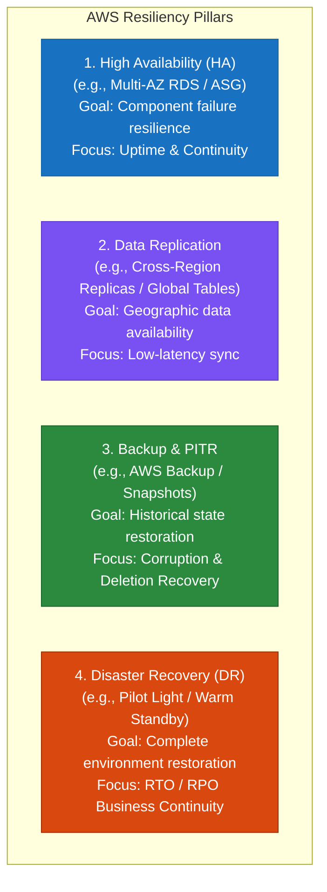
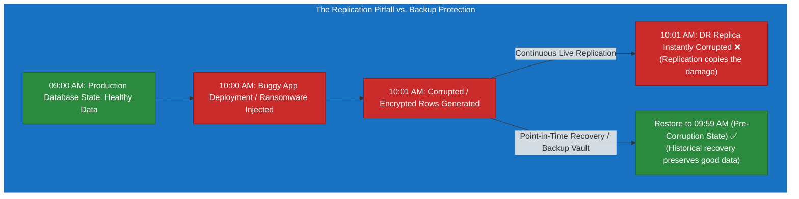
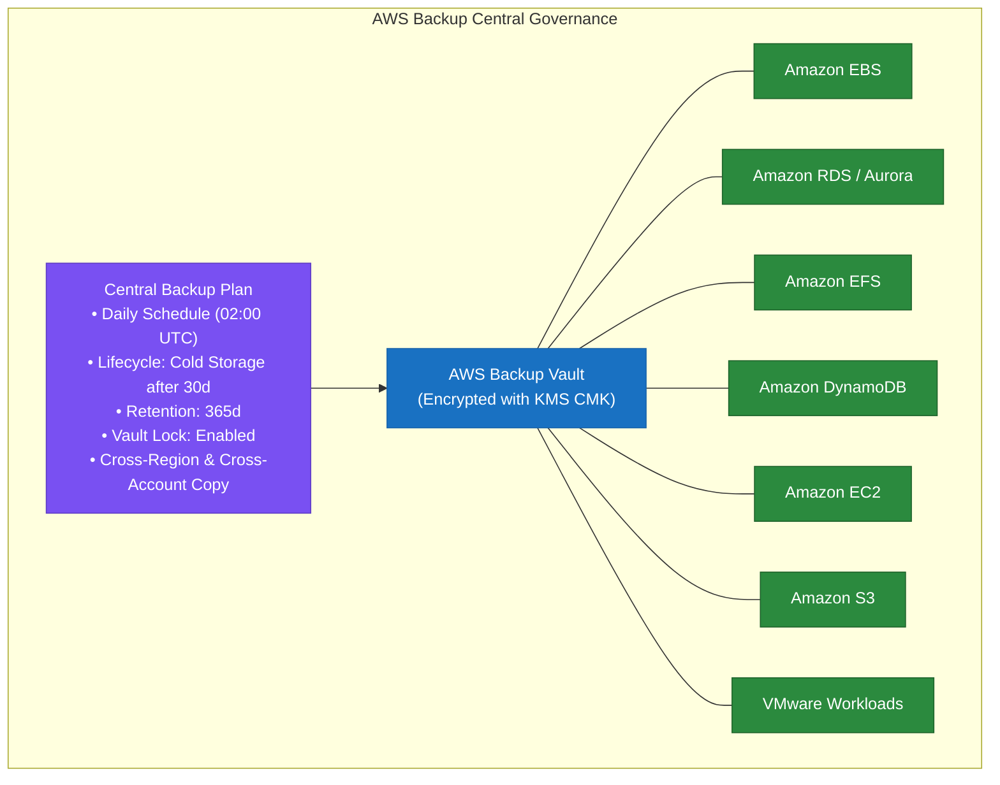
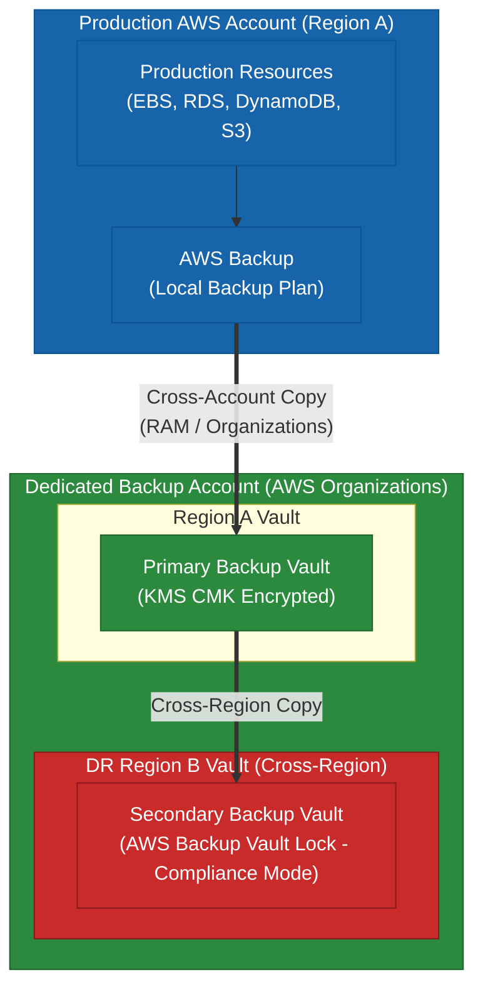
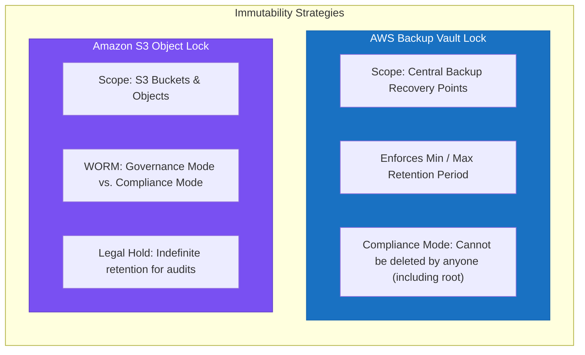
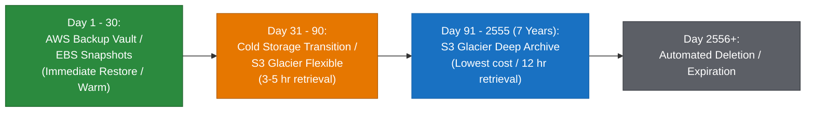
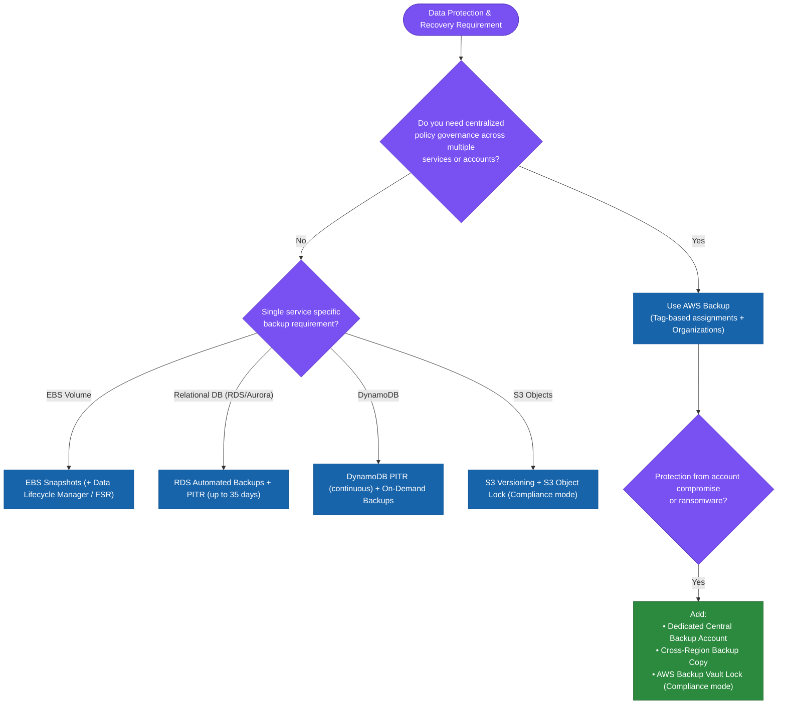

# 1.3 Data Backup and Restoration in AWS

> **Domain Focus**: AWS Certified Solutions Architect – Professional (SAP-C02) & Cloud Security & Resiliency  
> **Core Principle**: Data backup is a **reliability, security, and business continuity mechanism**. Replication alone cannot protect against human error, application bugs, or ransomware. Backup provides historical recovery points, while replication provides current availability.

---

## 1. Core Distinctions: Backup vs. Replication vs. High Availability vs. DR

Understanding the precise boundary of each resiliency technology is essential for the AWS Solutions Architect Professional exam:



### The Resiliency Matrix

| Technology | Primary Purpose | Protects Against | Does NOT Protect Against | Typical AWS Services |
| :--- | :--- | :--- | :--- | :--- |
| **High Availability (HA)** | Keep application online during local component failure | AZ outage, instance crash, storage degradation | Logical corruption, accidental deletion, regional disaster | RDS Multi-AZ, Multi-AZ ASG, ALB target groups |
| **Data Replication** | Maintain a current copy in another location | Single-region failure, read scalability | Accidental deletion (deletes are replicated!), data corruption | Aurora Global DB, DynamoDB Global Tables, S3 CRR |
| **Data Backup** | Restore historical data to a known good state | Accidental deletion, bad application code, ransomware | Instant failover (requires restore time $\rightarrow$ impacts RTO) | AWS Backup, EBS Snapshots, RDS Automated Backups, S3 Object Lock |
| **Disaster Recovery (DR)** | Recover entire infrastructure stack after major event | Total regional loss, catastrophic DC outage | Point-in-time fine-grained row recovery (unless paired with PITR) | Pilot Light, Warm Standby, AWS DRS, CloudFormation |

---

## 2. Why Replication Alone Fails: The Logical Corruption Problem

Replication mirrors changes immediately. If data is corrupted by bad code or deleted by an administrator, the replicated copy is also instantly corrupted or deleted.



> [!IMPORTANT]
> **Key Exam Rule**: Replication solves for *infrastructure failure*; Backup solves for *logical corruption, accidental deletion, and ransomware*. Resilient architectures always implement both.

---

## 3. Centralized Backup Governance: AWS Backup

### Why AWS Backup?
Without a centralized backup solution, individual service teams manage snapshots and backups in silos (EC2 snapshots, RDS backups, EFS backup scripts, DynamoDB policies). This creates configuration drift, inconsistent retention, and audit/compliance vulnerabilities.



### AWS Backup Core Features
- **Policy-Based Automation**: Tag-based resource assignments (e.g., `backup=daily-prod`) automatically enroll resources into backup schedules.
- **Cross-Region & Cross-Account Backup**: Automatically copy recovery points to secondary regions and isolated accounts within an AWS Organization.
- **AWS Backup Audit Manager**: Continuously monitors and proves compliance against regulatory frameworks with automated audit reporting.
- **AWS Backup Vault Lock**: Enforces WORM (Write Once, Read Many) policies to protect backups against deletion—even by root or administrator users.

---

## 4. Enterprise Security: Cross-Account & Cross-Region Backup Architecture

To protect against **account compromise, insider threats, and ransomware**, backups should be isolated into a dedicated, locked backup account across multiple regions.



### Defense-in-Depth Protection Layers
1. **Isolated AWS Account**: Dedicated security and backup account managed by compliance teams, strictly separated from production IAM users.
2. **KMS Customer Managed Keys (CMK)**: Backups re-encrypted in transit with destination-account KMS keys.
3. **AWS Backup Vault Lock**: Prevents deletion of recovery points before their scheduled expiration date.
4. **Service Control Policies (SCPs)**: Prevent IAM users or administrators from deleting backup vaults, altering retention policies, or disabling AWS Backup in child accounts.

---

## 5. Immutability & Ransomware Defense: Vault Lock vs. S3 Object Lock



### Modes Comparison

| Capability | AWS Backup Vault Lock | S3 Object Lock |
| :--- | :--- | :--- |
| **Target Data** | EBS snapshots, RDS backups, EFS, DynamoDB, S3 backups | Raw S3 objects and prefixes |
| **Governance Mode** | N/A (Uses cooling-off grace periods for lock configuration) | Users with specific IAM permissions (`s3:BypassGovernanceRetention`) can alter/delete |
| **Compliance Mode** | **Strict WORM**: Cannot be deleted or altered by **any** IAM user, root account, or AWS Support | **Strict WORM**: Cannot be overwritten or deleted until retention expires |
| **Legal Hold** | Managed via retention grace rules | Yes (Boolean flag, independent of retention period) |

---

## 6. Service-Specific Backup & Recovery Mechanisms

### 1. Amazon RDS / Amazon Aurora
- **Automated Backups**: Continuous transaction log upload combined with daily storage snapshots. Enables Point-in-Time Recovery (**PITR**) down to a 5-minute granularity with 1 to 35 days retention.
- **Manual Snapshots**: User-initiated snapshots that persist indefinitely until explicitly deleted. Can be shared cross-account and copied cross-region.

### 2. Amazon DynamoDB
- **Point-in-Time Recovery (PITR)**: Continuous incremental backups for the preceding 35 days. Restores to any single second with zero impact on table performance.
- **On-Demand Backups**: Full snapshots stored until deleted, suitable for regulatory and compliance archiving.

### 3. Amazon EBS
- **EBS Snapshots**: Point-in-time incremental block-level copies stored in Amazon S3. Only modified blocks are copied, reducing storage cost.
- **Fast Snapshot Restore (FSR)**: Eliminates storage latency on restored volumes by pre-warming EBS blocks instantly.

### 4. Amazon S3
- **Versioning**: Preserves, retrieves, and restores every version of every object stored in your bucket.
- **MFA Delete**: Enforces Multi-Factor Authentication before permanently deleting an object version or changing bucket versioning state.

---

## 7. Backup Lifecycle & Cost Optimization

Storage costs grow rapidly if all backups are retained indefinitely in standard tiers. A tiered lifecycle strategy balances recovery requirements with cost efficiency.



### Cost Optimization Levers
1. **Move to Cold Storage**: Configure AWS Backup lifecycle rules to automatically transition recovery points to cold storage for supported services (EFS, DynamoDB, S3).
2. **Scope Backups to Critical Data**: Exclude non-persistent data (temporary caches, staging instances) from backup plans.
3. **Optimize Snapshot Frequency**: Align backup schedules with verified business RPO targets rather than running unnecessarily aggressive schedules.

---

## 8. Backup Architecture Decision Tree (Exam Decision Flowchart)



---

## 9. Real-World Professional Exam Scenarios & Traps

### Scenario 1: Ransomware & Administrator Compromise
- **Requirement**: An enterprise requires all EBS, RDS, and S3 data backups to be protected against ransomware and insider threats. Even a rogue cloud administrator with root access must not be able to delete backups for 90 days.
- **Solution**: Configure **AWS Backup** with a centralized **Backup Vault Lock in Compliance Mode**. Place the vault in a dedicated, isolated AWS account within AWS Organizations, enforced by SCPs.

### Scenario 2: Regulatory 7-Year Retention with Cost Minimization
- **Requirement**: Financial audit regulations mandate retaining all database and file backups for 7 years. Backups will rarely be accessed after 90 days, but must be preserved immutably.
- **Solution**: Implement an **AWS Backup Plan** with automated lifecycle transitions: move backups to **Cold Storage** after 90 days and set total retention to 2555 days (7 years), protected by Vault Lock.

### Common Exam Traps

> [!CAUTION]
> 1. **Replication $\ne$ Backup**: Replicating data across regions protects against hardware or regional loss, but instantly propagates data deletions and corruption. A backup with PITR is required for logical recovery.
> 2. **Multi-AZ $\ne$ Data Protection**: Multi-AZ synchronously mirrors writes. If a table is accidentally dropped on the primary DB, it is immediately dropped on the Multi-AZ standby.
> 3. **Vault Lock Governance vs Compliance**: Governance mode allows specific privileged roles to delete backups. For strict tamper-proof requirements (ransomware / regulatory), **Compliance Mode** must be selected.
> 4. **Backup Restores Impact RTO**: Taking frequent snapshots satisfies RPO, but restoring a multi-terabyte snapshot into an active volume consumes time. If near-zero RTO is needed, warm replicas are required.

---

## 10. Key Architecture Mental Model

```
Resiliency Strategy
   ├── Component Uptime       ──► High Availability (Multi-AZ / Auto Scaling)
   ├── Disaster Survival      ──► Cross-Region Replication (Live Standby)
   ├── Accidental Deletion    ──► Backups + Point-in-Time Recovery (PITR)
   ├── Ransomware & Rogue Admin ──► AWS Backup Vault Lock + Cross-Account Isolation
   └── Cost Optimization     ──► Lifecycle to Cold Storage / Glacier Deep Archive
```