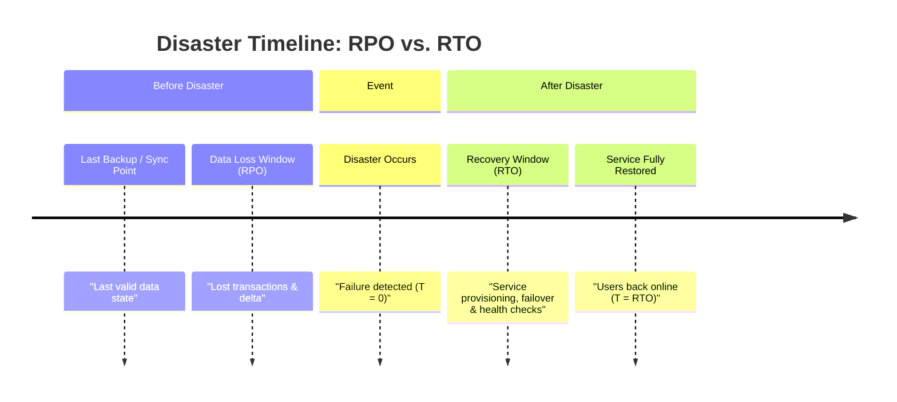
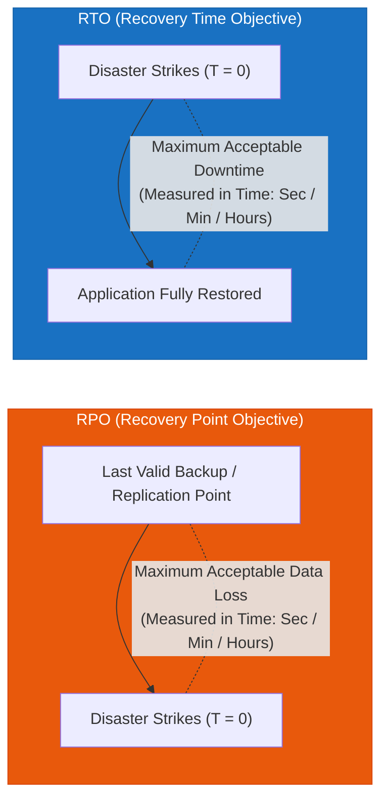
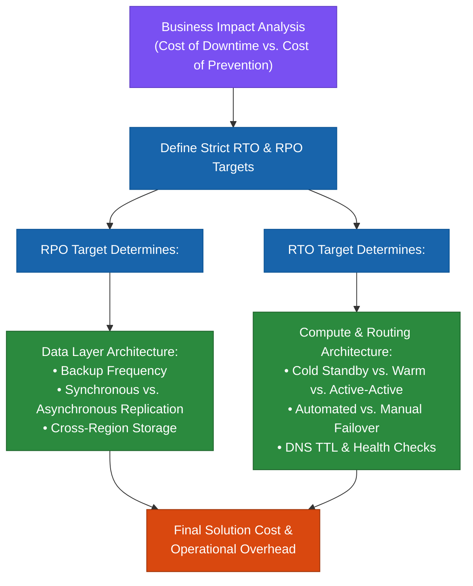
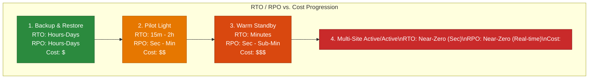
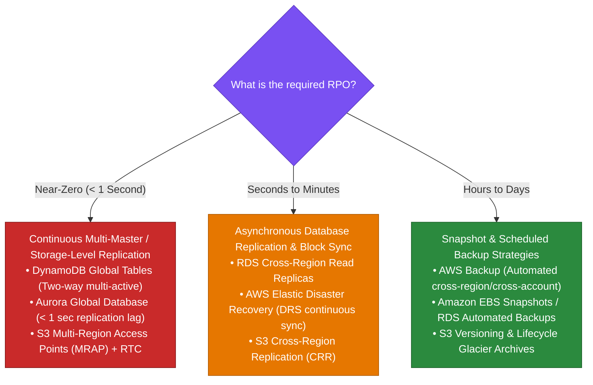
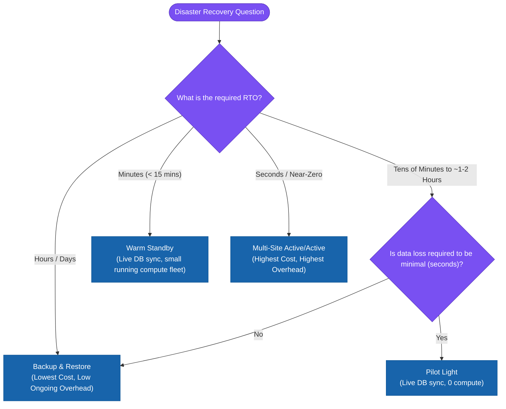

# 1.3 Recovery Time Objectives (RTO) and Recovery Point Objectives (RPO)

> **Domain Focus**: AWS Certified Solutions Architect – Professional (SAP-C02) & Cloud Resiliency Architecture  
> **Core Principle**: RTO and RPO are **business requirement drivers**, not standalone AWS services. Every architectural decision (compute, storage, replication, failover) is selected to meet stated RTO/RPO targets at the lowest reasonable cost.

---

## 1. Defining RTO vs. RPO: The Fundamental Timeline





### Core Definitions

| Metric | Full Name | Primary Question Answered | Focus Area | Measured In | Typical AWS Solutions |
| :--- | :--- | :--- | :--- | :---: | :--- |
| **RTO** | **Recovery Time Objective** | *"How fast must the application be back online?"* | **Downtime & Availability** | Time (Minutes, Hours) | Auto Scaling, Route 53 failover, AMIs, IaC, Pilot Light, Warm Standby. |
| **RPO** | **Recovery Point Objective** | *"How much data loss can the organization tolerate?"* | **Data Loss & Freshness** | Time (Seconds, Minutes, Hours) | Cross-Region Replicas, Aurora Global DB, DynamoDB Global Tables, S3 CRR, AWS Backup. |

> [!TIP]
> **Exam Memory Anchors**:
> - **RTO** $\rightarrow$ **Time** to recover (Downtime).
> - **RPO** $\rightarrow$ **Point** in time of data (Data loss).

---

## 2. Why RTO and RPO Drive Architectural Decisions

Achieving near-zero RTO and RPO requires active cross-region synchronization and redundant compute fleets, which drastically increases cost and operational overhead. Architecture must be tailored strictly to business impact.



---

## 3. RTO / RPO Spectrum Across DR Architectures



### Architectural Mapping Matrix

| Architecture Strategy | Target RTO | Target RPO | DR Compute Running | Data Layer State | Relative Cost |
| :--- | :--- | :--- | :--- | :--- | :---: |
| **Backup & Restore** | **Hours to Days** | **Hours to Days** | None ($0$ instances) | Periodic snapshots stored in S3 / AWS Backup | `$` |
| **Pilot Light** | **Tens of Minutes to Hours** | **Seconds to Minutes** | Stopped / Capacity = 0 (Templates ready) | Live cross-region database replica continuously syncing | `$$` |
| **Warm Standby** | **Minutes ($< 15$ mins)** | **Seconds to Sub-Minute** | Reduced running fleet (e.g., 10–20% capacity) | Live database replica + read endpoints active | `$$$` |
| **Multi-Site Active/Active** | **Near-Zero (Seconds)** | **Near-Zero (Real-Time)** | Full 100% capacity in 2+ active Regions | Bidirectional active-active DB (DynamoDB Global / Aurora Global) | `$$$$` |

---

## 4. RPO Determines Your Data Replication Strategy

Your **RPO target** dictates how data is backed up or replicated across Availability Zones and Regions:



### AWS Service Capabilities for RPO

| AWS Service | Replication Mechanism | Typical Achievable RPO | Primary Use Case |
| :--- | :--- | :--- | :--- |
| **DynamoDB Global Tables** | Multi-Region Active-Active replication | **Sub-second** (typically $< 1$s) | Globally distributed NoSQL workloads requiring local read/write latency. |
| **Aurora Global Database** | Dedicated storage-level replication engine | **$< 1$ second** | Relational databases requiring global read scaling and instant cross-region promotion. |
| **AWS Elastic Disaster Recovery (DRS)** | Continuous OS block-level replication to staging EBS | **Seconds** | Replicating on-premises VMs, physical servers, or EC2 instances into AWS. |
| **RDS Cross-Region Read Replicas** | Asynchronous engine-level replication | **Seconds to Minutes** | Standard relational DB DR (MySQL, PostgreSQL, MariaDB, Oracle). |
| **S3 Cross-Region Replication (CRR)** | Asynchronous object-level replication (w/ S3 RTC $\le$ 15m) | **Seconds to 15 Minutes** | Unstructured object storage, document archives, and media repositories. |
| **AWS Backup** | Scheduled cross-region snapshot orchestration | **Hours to 1 Day** | Centralized governance for EBS, EFS, DynamoDB, RDS, and EC2. |

---

## 5. RTO Determines Your Recovery & Routing Mechanism

Your **RTO target** dictates how fast infrastructure can be detected as impaired, provisioned, scaled, and placed into active service.

```mermaid
sequenceDiagram
    autonumber
    participant User as Global Users
    participant R53 as Amazon Route 53 (DNS / Health Check)
    participant Primary as Primary Region (Failed)
    participant DR_DB as DR Region DB
    participant DR_Compute as DR Region Compute (ASG / ECS)

    Primary--xPrimary: Outage Occurs
    R53->>Primary: Health Check Probes Fail (e.g., 3 x 10s intervals)
    Note over R53: Outage Confirmed (~30-60s)
    
    rect rgb(30, 50, 80)
        Note over DR_DB,DR_Compute: RTO Recovery Phase
        R53->>DR_DB: Promote Replica / Secondary to Primary
        DR_Compute->>DR_Compute: Auto Scaling scales up (0 -> N or 10 -> N)
        Note over DR_Compute: Instances pass ALB Health Checks
    end
    
    R53->>User: Route 53 DNS Failover shifts user traffic to DR Region
    User->>DR_Compute: Normal User Ingestion Resumes
```



### Role of Amazon Route 53 in RTO
- **Active-Passive Failover**: Configured with Route 53 Failover routing policies backed by endpoint health checks.
- **Fast DNS Convergence**: Keep TTL low (e.g., 60 seconds or less) to ensure DNS resolvers purge cached primary IPs quickly.
- **AWS Global Accelerator**: Can achieve even lower RTO ($< 30$ seconds) by utilizing Anycast static IP addresses that fail over at the edge without waiting for DNS cache expiration.

> [!IMPORTANT]
> **Crucial Exam Rule**: Route 53 does **not** recover application state or start servers; it only redirects traffic to healthy endpoints. RTO depends on how quickly backend compute and databases are ready to receive that traffic.

---

## 6. Cost & Operational Overhead Decision Framework



### Comparative Overhead Spectrum

$$\begin{array}{rcccl}
\textbf{Backup \& Restore} & \longrightarrow & \textbf{Pilot Light} & \longrightarrow & \textbf{Warm Standby} & \longrightarrow & \textbf{Active/Active} \\
\text{Cost: } \$ & & \text{Cost: } \$\$ & & \text{Cost: } \$\$\$ & & \text{Cost: } \$\$\$\$ \\
\text{RTO: Hours} & & \text{RTO: } 30\text{m}-2\text{h} & & \text{RTO: Minutes} & & \text{RTO: Seconds} \\
\text{RPO: Hours} & & \text{RPO: Seconds} & & \text{RPO: Seconds} & & \text{RPO: Real-Time}
\end{array}$$

---

## 7. Common Exam Traps & Anti-Patterns

> [!CAUTION]
> ### 1. "Take snapshots more frequently to reduce RTO"
> **WRONG**: Snapshots reduce **RPO** (data loss). Restoring large EBS snapshots into volumes and launching instances still takes significant time, meaning RTO remains unchanged.

> [!WARNING]
> ### 2. "Multi-AZ provides Regional Disaster Recovery"
> **WRONG**: Multi-AZ protects exclusively against **single Availability Zone / Data Center** failures. If an entire AWS Region or control plane encounters issues, Multi-AZ will not protect the workload. Regional DR requires cross-region architectures.

> [!IMPORTANT]
> ### 3. "Route 53 improves RPO"
> **WRONG**: Route 53 manages routing and health checks to optimize **RTO**. RPO is strictly governed by your database and storage replication mechanisms.

> [!NOTE]
> ### 4. "Active-Active is always the best choice"
> **WRONG**: On the AWS Certified Solutions Architect Professional exam, selecting an over-engineered Active-Active setup when Warm Standby meets the business SLA will fail the cost-optimization criteria of the question.

---

## 8. Exam Scenario Walkthroughs

### Scenario A: High-Value E-Commerce Platform
- **Requirement**: The business dictates that under no circumstance can downtime exceed **10 minutes**, and customer order data loss must be **less than 2 minutes**. Costs must be kept as low as possible.
- **Evaluation**:
  - *Backup & Restore*: Exceeds RTO (takes hours).
  - *Pilot Light*: Launching web/app tiers from scratch takes $\sim 15$ minutes (fails 10-min RTO).
  - *Active/Active*: Satisfies RTO/RPO but incurs 200% infrastructure cost.
  - *Warm Standby*: ✅ **Optimal Answer**. Running a 10% compute fleet with Aurora Global Database meets the $\le 10$ min RTO and $< 2$ min RPO at optimal cost.

### Scenario B: Internal Compliance Document Archive
- **Requirement**: An internal system archives documents for audit purposes. In the event of a regional outage, the company can tolerate **up to 24 hours of downtime** and **up to 12 hours of data loss**.
- **Evaluation**:
  - *Answer*: ✅ **Backup & Restore via AWS Backup & S3 Cross-Region Replication / S3 Glacier**. Minimum ongoing cost without paying for idle compute.

---

## 9. Key Architecture Summary

```
Business Requirement
   ├── Downtime Constraint  ──► Dictates RTO ──► Routing, Compute State & Automation
   ├── Data Loss Constraint ──► Dictates RPO ──► Storage & Database Replication Layer
   └── Budget Constraint    ──► Eliminates Over-engineered Strategies
```