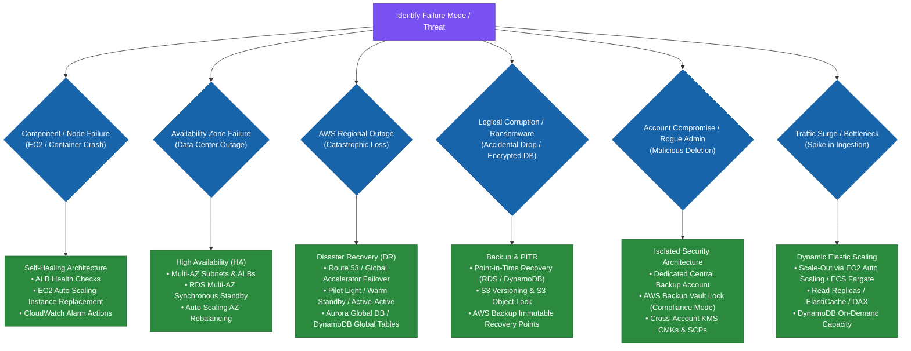
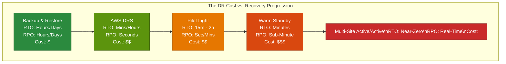
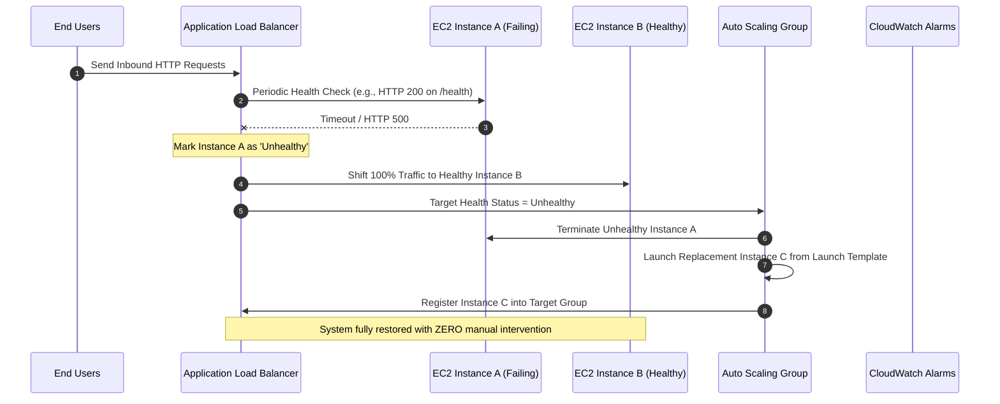
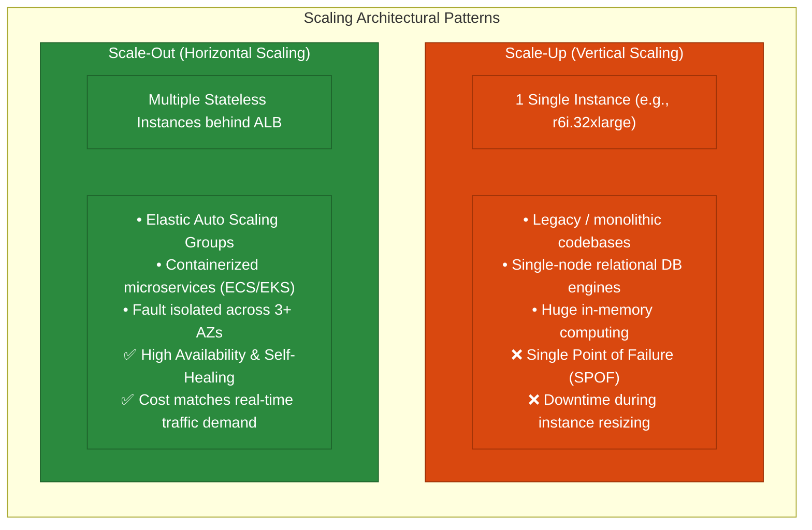
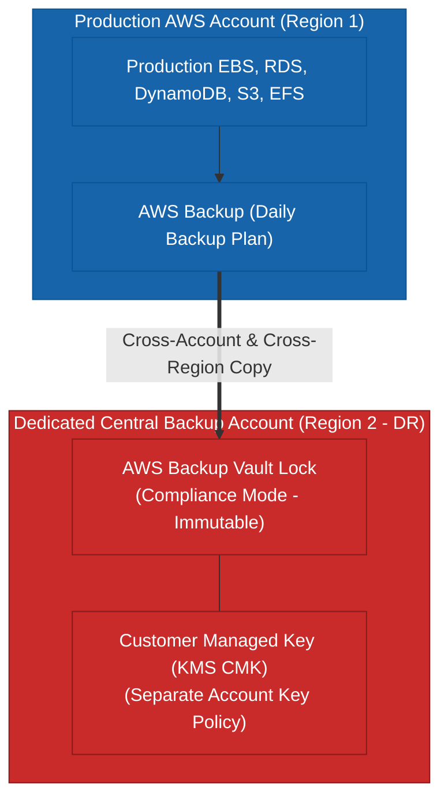
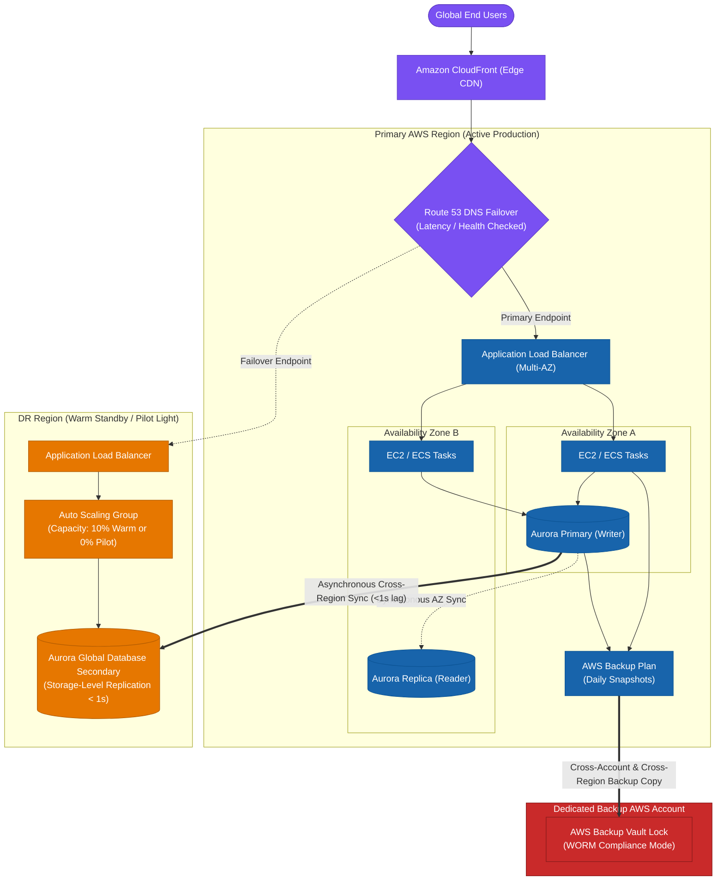

# 1.3 Resiliency, Disaster Recovery & Scaling Architecture Skills

> **Domain Focus**: AWS Certified Solutions Architect – Professional (SAP-C02) & Cloud Resiliency Architecture  
> **Core Principle**: Section 1.3 represents an **integrated decision framework**:
> $$\text{Business Requirement} \longrightarrow \text{RTO / RPO} \longrightarrow \text{Auto-Recovery} \longrightarrow \text{Scaling Strategy} \longrightarrow \text{Backup Governance} \longrightarrow \text{Cost Optimization}$$

---

## 1. Unified Resiliency & Failure Decision Matrix

Every resiliency decision begins with identifying the **failure blast radius** and aligning architecture with verified business requirements.



---

## 2. Skill 1: Designing DR Solutions Based on RTO and RPO

The exam evaluates whether you choose the **minimum necessary architecture** that satisfies recovery targets without incurring unnecessary cost.



### DR Strategy Decision Matrix

| Requirement / Scenario | Recommended Strategy | Primary AWS Services | Cost / Overhead Profile |
| :--- | :--- | :--- | :---: |
| **Hours of downtime acceptable; lowest budget** | **Backup & Restore** | AWS Backup, S3, EBS Snapshots, CloudFormation | `$` (Lowest) |
| **Legacy on-premises VMs / physical servers requiring AWS DR** | **AWS DRS** | AWS Elastic Disaster Recovery, Staging EBS | `$$` (Low–Med) |
| **Data must stay synchronized, compute starts only on failure** | **Pilot Light** | RDS Cross-Region Replicas, Auto Scaling ($0 \rightarrow N$) | `$$` (Medium) |
| **Fast recovery ($< 15$ mins), running smaller standby fleet** | **Warm Standby** | Route 53, Auto Scaling ($10 \rightarrow 100$), Aurora Global DB | `$$$` (High) |
| **Zero downtime tolerance across AWS Regions** | **Multi-Site Active/Active** | Route 53 / Global Accelerator, DynamoDB Global Tables | `$$$$` (Highest) |

---

## 3. Skill 2: Implementing Architectures That Automatically Recover from Failure

Automatic recovery (**self-healing**) eliminates manual human intervention, reduces downtime, and prevents configuration error during incidents.



### Self-Healing Architectural Elements
1. **ELB Target Group Health Checks**: Continuously polls target endpoints and instantly stops sending user traffic to unhealthy nodes.
2. **EC2 Auto Scaling Self-Healing**: Automatically terminates instances that fail EC2 status checks or ELB health checks and provisions fresh replacements from Launch Templates.
3. **RDS Multi-AZ Automated Failover**: Synchronously replicates to a standby replica in a second AZ; automatically modifies DNS endpoint records on primary failure ($< 60$s failover).
4. **CloudWatch Auto-Recovery Alarms**: Recovers underlying EC2 hardware degradation while preserving instance ID, private IP, and EBS volume attachments.

---

## 4. Skill 3: Scaling Strategies — Scale-Up vs. Scale-Out & Database Tiering



### Scaling Across Architecture Tiers

| Architecture Tier | Bottleneck / Requirement | Optimal AWS Scaling Mechanism |
| :--- | :--- | :--- |
| **Compute Tier (Stateless)** | Variable web/API traffic surges | **EC2 Auto Scaling / ECS Fargate** with Target Tracking Policies (CPU/ALB request count). |
| **Database Tier (Read Heavy)** | Heavy read queries overwhelming primary DB | **RDS Read Replicas** (up to 15) or **Aurora Auto Scaling Read Replicas**. |
| **Database Tier (Write Heavy)** | Massive transactional writes | **DynamoDB** (partition keys + on-demand capacity) or **Amazon Aurora Multi-Master**. |
| **Caching Tier** | Repeated database read queries | **Amazon ElastiCache (Redis/Memcached)** or **DynamoDB Accelerator (DAX)**. |
| **Legacy Monolithic DB** | Single relational DB requiring more compute | **Scale-Up** instance class (e.g., `db.r6g.large` $\rightarrow$ `db.r6g.16xlarge`) during maintenance window. |

---

## 5. Skill 4: Enterprise Data Backup, Restoration & Immutability



### Key Backup Governance Principles
- **Backup vs. Replication**: Replication protects against hardware and regional outage; Backups protect against accidental deletion, code corruption, and ransomware.
- **WORM Immutability**: Use **AWS Backup Vault Lock in Compliance Mode** or **S3 Object Lock** to prevent deletion by root users or compromised credentials.
- **Point-in-Time Recovery (PITR)**: Enable PITR on RDS, Aurora, and DynamoDB for continuous second-by-second recovery from application bugs.
- **Regular Restore Testing**: Backups must be validated via automated restore drills; untracked or untested backups fail audit compliance.

---

## 6. End-to-End Enterprise Resilient Production Architecture

The following reference diagram demonstrates how all Section 1.3 skills integrate into a production-grade, highly available, self-healing, and disaster-resilient system:



---

## 7. Professional Exam Decision Cheat Sheet

```
Failure / Requirement Type                        Recommended AWS Architectural Decision
───────────────────────────────────────────────────────────────────────────────────────────────────
1. Single EC2 crash / degradation             ──► Auto Scaling self-healing + CloudWatch Auto-Recovery
2. AZ failure / Data center outage            ──► Multi-AZ ALB + Multi-AZ ASG + RDS Multi-AZ Standby
3. Regional outage (RTO: Hours, lowest cost)   ──► Backup & Restore (AWS Backup + S3 CRR + IaC)
4. Regional outage (RTO: < 15m, low budget)    ──► Warm Standby (10% compute fleet + Aurora Global DB)
5. Regional outage (RTO: Near-Zero)           ──► Multi-Site Active/Active (DynamoDB Global Tables)
6. On-premise VMs lift-and-shift DR to AWS    ──► AWS Elastic Disaster Recovery (AWS DRS)
7. Accidental DB DROP TABLE / data corruption ──► Point-in-Time Recovery (PITR)
8. Ransomware / Rogue Admin protection        ──► AWS Backup Vault Lock (Compliance Mode) in dedicated account
9. Heavy read traffic bottleneck               ──► RDS Read Replicas / ElastiCache Caching
10. Unpredictable HTTP traffic spikes          ──► EC2 Auto Scaling (Target Tracking on ALB Request Count)
```