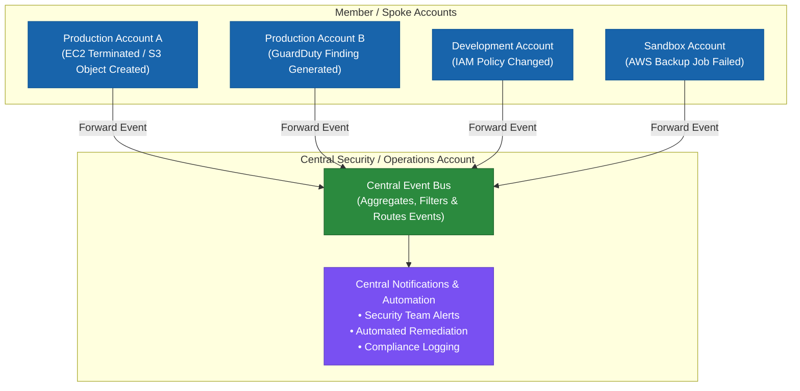
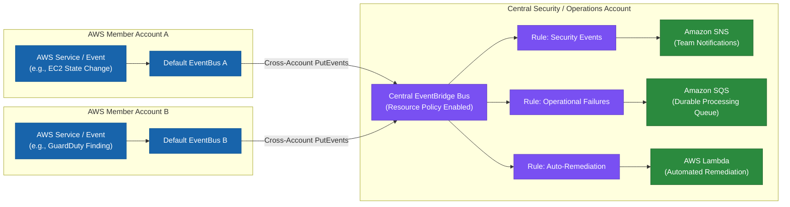
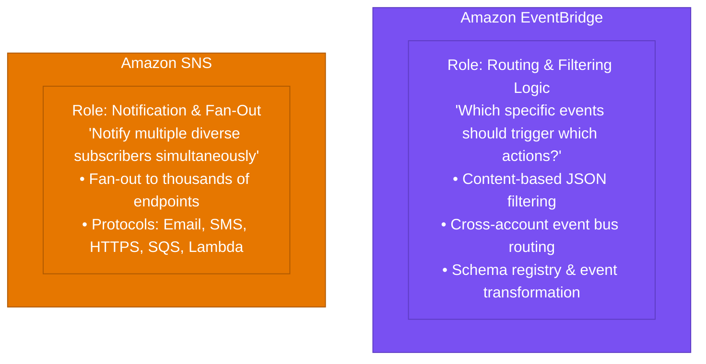
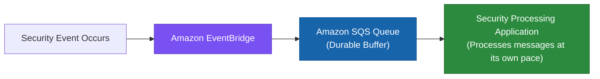
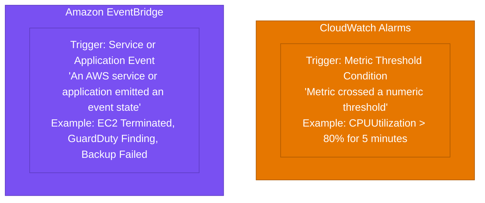
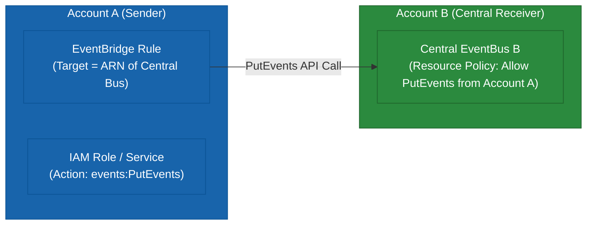
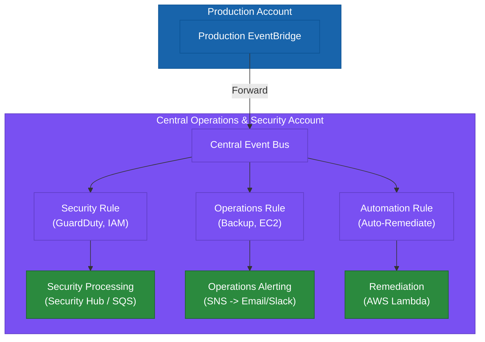
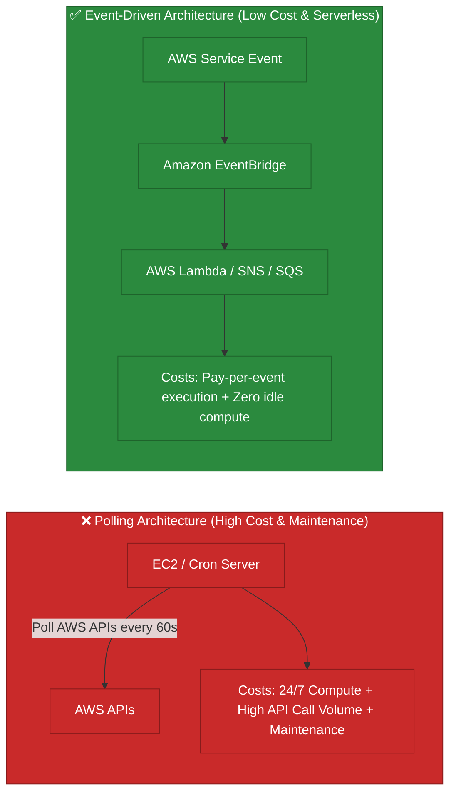
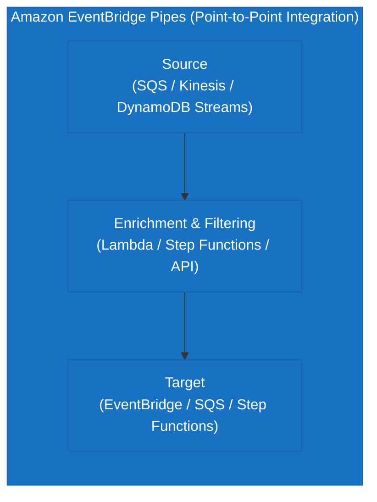
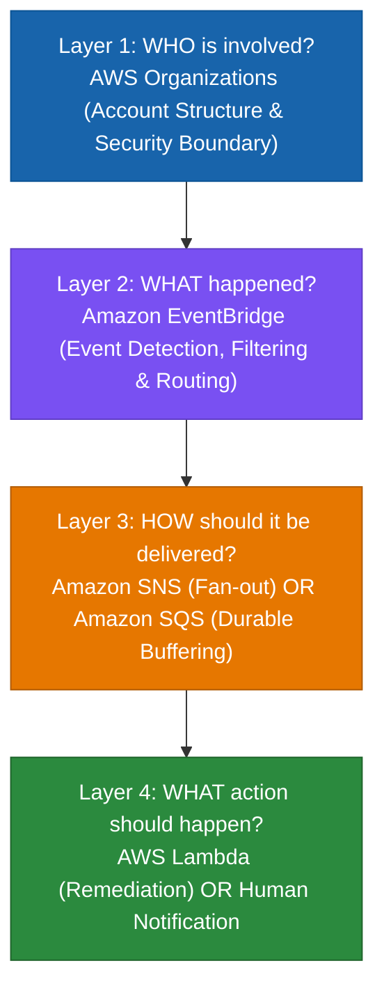

# 1.4 Multi-Account Event Notifications

> **Domain Focus**: AWS Certified Solutions Architect – Professional (SAP-C02) & Cloud Event-Driven Architecture  
> **Core Question**: *"An event happens in one AWS account. How do I reliably detect it and notify or trigger automation in another account?"*  
> **Core Technology Stack**: Amazon EventBridge + Amazon SNS + Amazon SQS + AWS Lambda + Cross-Account IAM / Resource-Based Policies.

---

## Executive Overview & Architectural Mindset

For the AWS Solutions Architect Professional exam, think of multi-account event notifications as a fundamental architectural pattern:
- An event happens in one AWS account.
- You detect it reliably and notify or trigger automation in another account.
- This is primarily an **Amazon EventBridge + Amazon SNS + Amazon SQS + cross-account IAM / resource-policy** problem.

Your reference establishes the broader multi-account architecture mindset around centralized governance, isolation, and operational overhead. The specific topic *“multi-account event notifications”* is not covered in the supplied reference, so the service-specific details below provide comprehensive AWS knowledge beyond the reference.

---

## 1. Why Multi-Account Event Notifications Exist

Imagine an enterprise with a multi-account structure:
- **Management Account**
- **Security Account**
- **Production Account A**
- **Production Account B**
- **Development Account**
- **Sandbox Account**



When an event happens in Production (such as an EC2 instance terminating, a GuardDuty finding being created, an S3 object being uploaded, an IAM change being detected, or an AWS Backup job failing), you want the **Security Account** to receive and process the event.

You do **not** want to configure independent, fragmented notification systems in every single account. The requirement becomes:
- **Account A** $\rightarrow$ Event
- **Account B** $\rightarrow$ Central processing
- **Account C** $\rightarrow$ Central processing
- **Account D** $\rightarrow$ Central processing

This is where centralized event architecture becomes essential.

---

## 2. The Core Architecture

A common enterprise pattern is:

$$\text{AWS Member Accounts} \longrightarrow \text{Local EventBridge} \longrightarrow \text{Central Event Bus} \longrightarrow \text{EventBridge Rules} \longrightarrow \text{SNS / SQS / Lambda}$$



### Roles of Each Component:
- **Amazon EventBridge**: Event routing and content-based filtering.
- **Amazon SNS**: Notification distribution and message fan-out to human subscribers / webhooks.
- **Amazon SQS**: Durable asynchronous buffering and decouple processing.
- **AWS Lambda**: Custom automation, event enrichment, and remediation.

---

## 3. Why EventBridge Exists

EventBridge solves:
> *“How do I detect events and route them to the right target based on event content?”*

### Example Event & Routing Rule:
- **Event**: EC2 instance terminated.
- **EventBridge Rule Pattern**:
  ```json
  {
    "source": ["aws.ec2"],
    "detail-type": ["EC2 Instance State-change Notification"],
    "detail": {
      "state": ["terminated"]
    }
  }
  ```
- **Targets**: Amazon SNS, AWS Lambda, Amazon SQS, or another EventBridge event bus.

This removes the need for custom, resource-intensive polling scripts.

---

## 4. Why Cross-Account EventBridge Exists

Suppose you have 100 AWS accounts. Without centralized event routing:
- Account 1 $\rightarrow$ notification configuration
- Account 2 $\rightarrow$ notification configuration
- Account 3 $\rightarrow$ notification configuration
- ...
- Account 100 $\rightarrow$ notification configuration

This becomes operationally unmanageable.

**With Cross-Account EventBridge**:
$$\text{100 AWS Accounts} \longrightarrow \text{Central EventBridge Bus} \longrightarrow \text{Central Rules} \longrightarrow \text{Security / Operations / Automation}$$

This creates standardized, centralized event processing across the entire enterprise.

---

## 5. Is It Minimal?

- **For One Account**: Probably not. If you only need to send an EC2 failure notification to an administrator, a simple single-account `EventBridge -> SNS` setup is completely sufficient.
- **For Many Accounts**: Centralized EventBridge becomes significantly more attractive and operationally efficient.

> [!TIP]
> **Exam Clue**: *"Hundreds of AWS accounts need centralized event processing with minimal management overhead."*  
> $\longrightarrow$ **Cross-account EventBridge**.

---

## 6. EventBridge vs. SNS

This is an important exam distinction:



### Combined Architecture:
$$\text{EventBridge} \longrightarrow \text{Rule} \longrightarrow \text{SNS Topic} \longrightarrow \text{Subscribers (Email, Lambda, SQS, HTTPS)}$$

- **EventBridge** = Routing logic.
- **SNS** = Notification / fan-out.

---

## 7. EventBridge vs. SQS

- **EventBridge** is primarily an event router.
- **Amazon SQS** provides durable message buffering and queueing.



If the downstream processing application is temporarily unavailable, SQS securely holds the messages. This provides architectural resilience:
- **Need event routing** $\rightarrow$ EventBridge.
- **Need durable queueing** $\rightarrow$ SQS.
- In robust enterprise architectures, you frequently use **both**.

---

## 8. EventBridge vs. CloudWatch Alarms

Another common exam trap:



- **Metric condition** $\rightarrow$ CloudWatch Alarm.
- **Service / application state change** $\rightarrow$ EventBridge.

---

## 9. Multi-Account Security Architecture

A common enterprise pattern is:

$$\text{Production Accounts} \longrightarrow \text{EventBridge} \longrightarrow \text{Security Account (Central Bus)} \longrightarrow \text{Rules} \longrightarrow \text{SNS / SQS / Lambda} \longrightarrow \text{Security Team / Automation}$$

### Example Monitored Events:
- IAM changes (role modifications, policy attachments).
- Security findings (Amazon GuardDuty, AWS Security Hub, Amazon Inspector).
- CloudTrail-related management and data events.
- AWS Backup job failures.
- AWS Config non-compliant resource evaluation events.

The dedicated security account functions as the centralized hub for enterprise-wide event processing.

---

## 10. Why Centralize Events?

The primary drivers for centralizing events across accounts include:
1. **Security**: Immediate visibility across all account perimeters.
2. **Central Monitoring**: Single pane of glass for operational health.
3. **Operational Consistency**: Uniform alerting rules and escalation paths.
4. **Reduced Duplication**: Avoid maintaining duplicate notification targets across dozens of accounts.
5. **Automation & Fast Remediation**: Trigger automated Lambda remediation scripts centrally.
6. **Auditability & Compliance**: Central historical logging of all critical actions.
7. **Scalability**: Seamlessly onboard new accounts via AWS Organizations without re-architecting alert pipelines.

---

## 11. Operational Overhead

Cross-account event architectures introduce some initial setup overhead:
- Event bus creation.
- Event rule definition.
- Cross-account permissions and resource policies.
- Target endpoints (SNS topics, SQS queues, Lambda functions).
- Monitoring and Dead-Letter Queue (DLQ) configurations.

However, once established, centralized routing dramatically reduces repetitive operational configuration across accounts:
$$\text{Initial Setup Complexity } \uparrow \quad \Longrightarrow \quad \text{Long-Term Centralized Operational Overhead } \downarrow$$

---

## 12. Cross-Account Permissions & Authorization

The receiving EventBridge event bus must explicitly authorize events arriving from the sender account via a **Resource-Based Policy**.



### Core Requirement:
Cross-account EventBridge routing requires explicit authorization via the target bus's resource policy.

---

## 13. Organization-Wide Event Permissions

In large organizations, instead of explicitly listing 100+ account IDs in the event bus policy, you grant permissions to the entire AWS Organization using the `aws:PrincipalOrgID` condition key.

```json
{
  "Version": "2012-10-17",
  "Statement": [
    {
      "Sid": "AllowOrganizationAccountsToPutEvents",
      "Effect": "Allow",
      "Principal": "*",
      "Action": "events:PutEvents",
      "Resource": "arn:aws:events:us-east-1:111122223333:event-bus/central-event-bus",
      "Condition": {
        "StringEquals": {
          "aws:PrincipalOrgID": "o-a1b2c3d4e5"
        }
      }
    }
  ]
}
```

- **AWS Organizations**: Governs account boundaries and hierarchy.
- **Amazon EventBridge**: Executes event routing across those boundaries.

---

## 14. Event Bus Architecture



This pattern provides a highly decoupled, modular, and scalable enterprise architecture.

---

## 15. Why Not Send Everything Directly to SNS?

Sending raw events directly from all accounts to an SNS topic loses sophisticated event filtering and routing capabilities:

Suppose you receive **10,000 events/month**:
- 100 security events $\rightarrow$ need to reach the Security Queue.
- 500 backup failure events $\rightarrow$ need to reach Operations SNS.
- 50 account creation events $\rightarrow$ need to trigger an Automation Lambda.

**EventBridge rules** allow granular content inspection and route each event precisely to its intended destination. SNS alone is primarily a fan-out notification engine without deep JSON payload inspection and cross-account event bus capabilities.

---

## 16. Cost Perspective: Polling vs. Event-Driven

Event-driven architectures are significantly more cost-effective because you pay strictly for events processed rather than maintaining constantly running polling infrastructure.



---

## 17. Centralized Architecture Cost Trade-Offs

While a Central Event Bus provides centralized management, less duplicated configuration, easier governance, and unified security monitoring, architects must consider:
- Cross-account configuration requirements.
- Central bus availability and health monitoring.
- Event volume scaling costs if filtering is not applied early.
- Downstream processing costs generated by noisy or overly broad event patterns.

---

## 18. Event Filtering as a Cost & Noise Optimization

Do not forward every single event across accounts. Apply event filtering at the **source account EventBridge rule**:

- **Poor Pattern**: Forward all AWS Backup events to the central bus (1,000,000 events/month).
- **Optimized Pattern**: Filter at source to forward **only failed backup events**:
  ```json
  {
    "source": ["aws.backup"],
    "detail-type": ["Backup Job State Change"],
    "detail": {
      "state": ["FAILED"]
    }
  }
  ```

### Benefits:
- Lower cross-account event ingestion costs.
- Reduced SNS/SQS/Lambda downstream execution invocations.
- Zero alert fatigue for operations teams.

---

## 19. EventBridge Archive and Replay

Amazon EventBridge allows you to create an **Event Archive** on an event bus to record all or filtered events:
- **Use Cases**: Debugging failed event consumers, replaying past events during recovery, and testing new downstream microservices against historical production traffic.
- **Trade-Off**: Incurs additional event storage and replay processing charges; enable archives only when historical recovery or audit requirements justify it.

---

## 20. EventBridge vs. EventBridge Pipes



- **EventBridge Pipes**: Designed for point-to-point stream integrations with built-in filtering, enrichment, and target transformation (e.g., SQS $\rightarrow$ Pipes $\rightarrow$ Lambda).
- **Event Buses**: Designed for many-to-many event routing, cross-account ingestion, and broad event fan-out.

---

## 21. EventBridge Scheduler vs. Event-Driven Rules

- **EventBridge Scheduler**: Time-based scheduled execution (*"Run this Lambda function every Monday at 02:00 AM"* or *"Execute a one-time reminder in 30 minutes"*).
- **Event-Driven Rules**: State-based reaction to emitted service events (*"React immediately when an EC2 instance changes state to 'terminated'"*).

---

## 22. Scenario Walkthrough: Centralized Security Alerting

- **Question**: A company has 50 AWS accounts. The security team wants to receive notifications whenever a security-related event occurs in any account. The solution should require minimal management overhead.
- **Solution Architecture**:
  $$\text{Member Accounts} \longrightarrow \text{Default EventBridge} \longrightarrow \text{Central Security Event Bus} \longrightarrow \text{EventBridge Rule} \longrightarrow \text{Amazon SNS Topic} \longrightarrow \text{Security Team}$$
- **Reasoning**: EventBridge handles cross-account routing and event payload filtering natively, while SNS handles notification fan-out to email/Slack endpoints.

---

## 23. Scenario Walkthrough: Resilient Asynchronous Event Buffering

- **Question**: Security events from all accounts must be processed asynchronously. The backend processing applications experience variable load and might be temporarily unavailable.
- **Solution Architecture**:
  $$\text{EventBridge Rule} \longrightarrow \text{Amazon SQS Queue} \longrightarrow \text{Backend Processing Application}$$
- **Reasoning**: Amazon SQS provides a durable message buffer, decoupling event ingestion from processing capacity.

---

## 24. Scenario Walkthrough: Multi-Target Routing by Event Type

- **Question**: Different event types from 100 accounts must be dispatched to different internal teams and systems based on the event payload.
- **Solution Architecture**: Single Central Event Bus with multiple targeted EventBridge rules:
  - *Security Findings* $\rightarrow$ Security Lambda / Security Hub.
  - *Backup Failures* $\rightarrow$ Operations Team SNS Topic.
  - *Billing / Cost Events* $\rightarrow$ FinOps SQS Queue.

---

## 25. Scenario Walkthrough: Fan-Out to Multiple Subscribers

- **Question**: A critical compliance violation event must be delivered simultaneously to an email distribution list, an incident management webhook, and an automated audit queue.
- **Solution Architecture**:
  $$\text{EventBridge Rule} \longrightarrow \text{Amazon SNS Topic} \longrightarrow \text{Subscribers: Email + HTTPS Webhook + SQS Queue}$$

---

## 26. Scenario Walkthrough: Zero Event Loss During Consumer Outages

- **Question**: Ensure zero event loss if the downstream consumer application crashes or is temporarily offline for maintenance.
- **Solution Architecture**:
  - Buffer events using **Amazon SQS** as the direct target of the EventBridge rule.
  - Configure **Dead-Letter Queues (DLQ)** on both EventBridge rules and SQS to capture unprocessable messages after max retries.

---

## 27. Related AWS Services Ecosystem

Multi-account event architectures connect the following AWS services:
- **AWS Organizations**: Multi-account hierarchy and Organization-wide resource policies (`aws:PrincipalOrgID`).
- **Amazon EventBridge**: Core routing, event pattern matching, and cross-account event forwarding.
- **Amazon SNS**: Fan-out notification to human subscribers and external webhooks.
- **Amazon SQS**: Durable message buffering and asynchronous queueing.
- **AWS Lambda**: Serverless custom processing and automated incident remediation.
- **Amazon CloudWatch**: Metric thresholds, alarms, and operational monitoring.
- **AWS CloudTrail**: Management and data API call auditing.
- **AWS Config**: Resource compliance evaluation and configuration change notifications.
- **Amazon GuardDuty & AWS Security Hub**: Intelligent threat detection and aggregated security finding events.
- **AWS Backup**: Backup job lifecycle and failure events.
- **AWS KMS**: Encryption of event buses, SNS topics, and SQS queues at rest.

---

## 28. Professional Exam Decision Matrix

| Requirement | Strongest Candidate Service |
| :--- | :--- |
| **Route AWS service events by payload** | **Amazon EventBridge** |
| **Centralize events across 100+ AWS accounts** | **Cross-Account EventBridge (with `aws:PrincipalOrgID`)** |
| **Notify human operators via Email / SMS / Webhooks** | **Amazon SNS** |
| **Fan out single event to thousands of consumers** | **Amazon SNS** |
| **Buffer events to protect downstream consumers** | **Amazon SQS** |
| **Execute custom automated remediation** | **AWS Lambda** |
| **Run actions on a schedule or cron** | **Amazon EventBridge Scheduler** |
| **Trigger actions when a numeric metric breaches a threshold** | **Amazon CloudWatch Alarms** |
| **Audit user API calls and activity history** | **AWS CloudTrail** |
| **Detect configuration drift and compliance violations** | **AWS Config** |
| **Centralize security findings from multiple tools** | **AWS Security Hub** |
| **Govern account structures and cross-account policies** | **AWS Organizations** |
| **Automated multi-account landing zone** | **AWS Control Tower** |

---

## 29. The Key Cost Principle: Polling vs. Event-Driven

Never build a polling system when AWS provides native event-driven integrations.

- **Polling Architecture**: EC2 $\rightarrow$ Poll APIs continuously $\rightarrow$ Detect event $\rightarrow$ Process $\rightarrow$ Notify.
- **Event-Driven Architecture**: AWS Service $\rightarrow$ EventBridge $\rightarrow$ Target.

The event-driven pattern consistently reduces:
- Infrastructure costs (zero idle EC2 instances).
- Operational overhead and server patching.
- Excessive API call volume and throttling risks.
- End-to-end event response latency.

---

## 30. The 4-Layer Professional Exam Mental Model

When addressing multi-account event questions, evaluate the architecture in 4 distinct layers:



```
Summary Decision Rule:
Multiple accounts need centralized event notifications with minimal overhead?
──► AWS Organizations + Cross-Account EventBridge + Appropriate Target
      ├── For Human Notification / Fan-Out           ──► Amazon SNS
      ├── For Durable Asynchronous Queueing          ──► Amazon SQS
      └── For Automated Incident Remediation         ──► AWS Lambda
```

> [!IMPORTANT]
> **Minimal Architecture Rule**: The architecture should remain as small and targeted as the requirement allows. Do not add SNS, SQS, Lambda, or Control Tower simply because they exist—each component must solve a specific business problem.