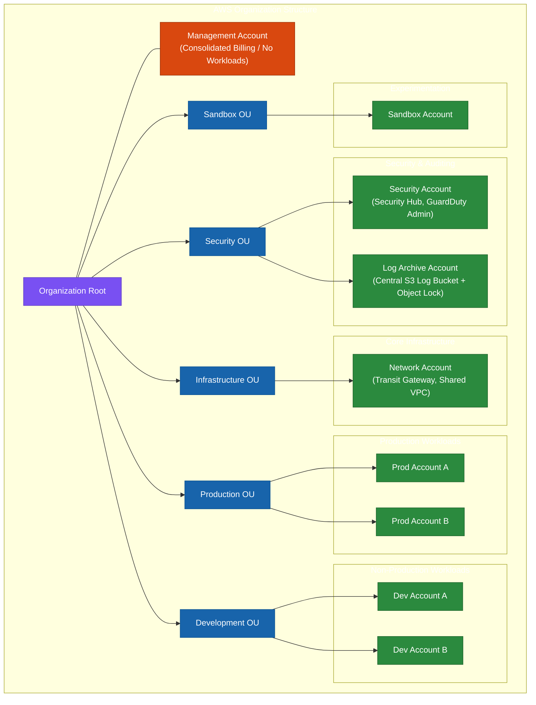
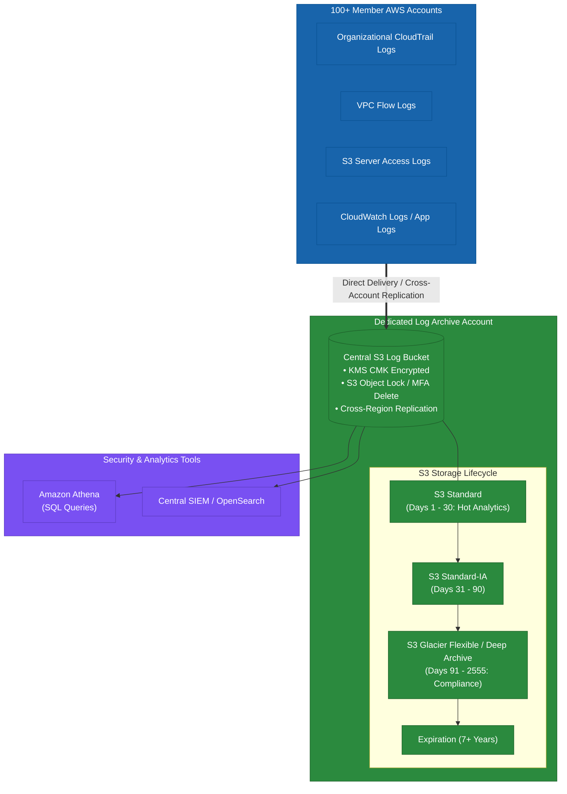
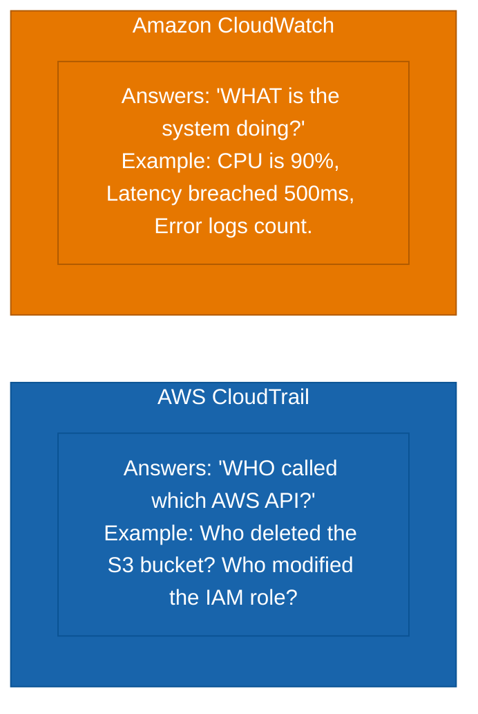
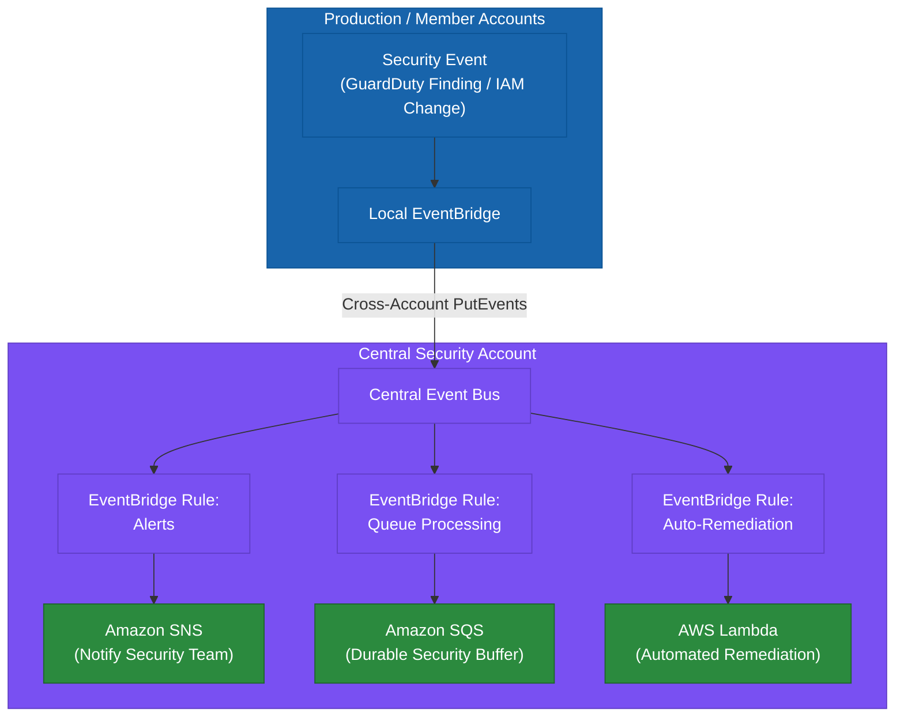
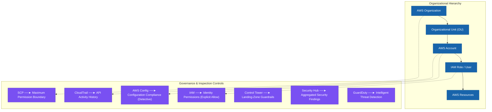
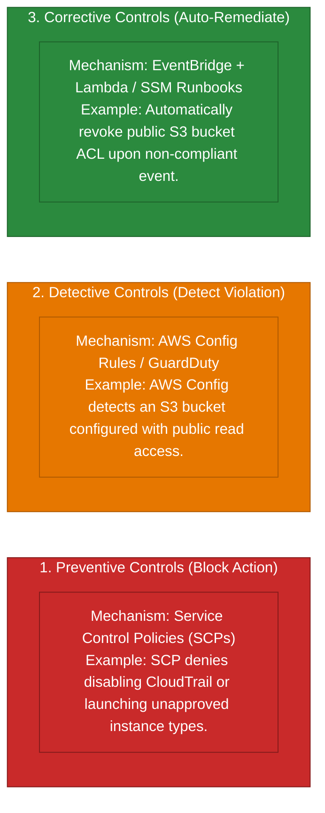
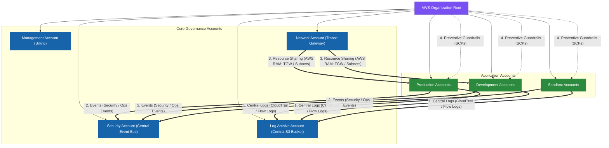
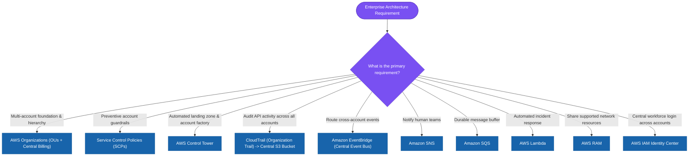
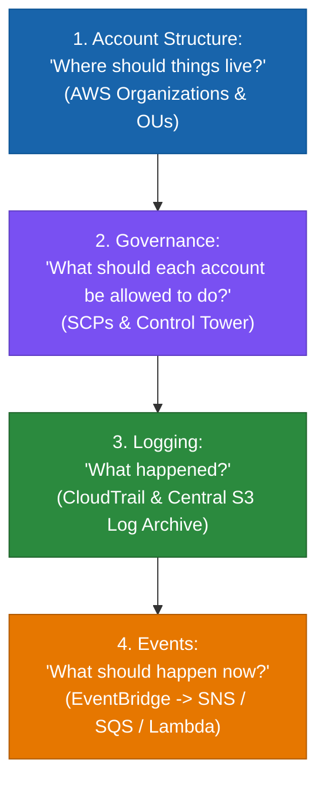

# 1.4 Multi-Account Governance, Central Logging & Event Architecture Skills

> **Domain Focus**: AWS Certified Solutions Architect – Professional (SAP-C02) & Enterprise Multi-Account Architecture  
> **Core Principle**: Section 1.4 represents one unified enterprise architecture system:
> $$\text{Account Structure} \longrightarrow \text{Central Logging \& Event Flow} \longrightarrow \text{Multi-Account Governance}$$
> The exam tests where to place responsibilities, security controls, logs, events, and workloads across accounts while controlling cost and operational complexity.

---

## 1. Start with the Business Problem

A small company might have:
- **One AWS Account** $\rightarrow$ Applications

An enterprise might have:
- **AWS Organization**
  - **Management Account**
  - **Security OU**
    - Security Account
    - Log Archive Account
  - **Infrastructure OU**
    - Network Account
  - **Production OU**
    - Prod Account A
    - Prod Account B
  - **Development OU**
    - Dev Account A
    - Dev Account B
  - **Sandbox OU**
    - Sandbox Accounts



### Why?
You are creating boundaries for:
- Security
- Billing
- Operations
- Blast radius
- Ownership
- Compliance
- Workload isolation

> [!IMPORTANT]
> **The Key Professional Exam Mindset**:
> - **AWS Account** = Isolation and administrative boundary.
> - **Organizational Unit (OU)** = Grouping and governance boundary.

---

## 2. Skill 1: Evaluate the Most Appropriate Account Structure

Do not start by creating accounts randomly. Start with:
> *“What needs to be isolated?”*

### Typical reasons to create separate accounts:
- Production vs. development
- Security vs. application workloads
- Central logging
- Networking
- Shared services
- Different business units
- Different compliance requirements
- Different billing ownership
- Different operational teams

---

## 3. Why Separate Production and Development Accounts?

Consider:
- **Single Account**: Production + Development
- *versus*
- **Separate Accounts**: Production Account + Development Account

Separate accounts provide stronger isolation. If a developer makes a mistake, the production account has a separate administrative boundary.

### Benefits:
- Lower blast radius
- Separate billing
- Separate IAM administration
- Separate quotas
- Separate security policies
- Separate operational ownership

### Cost:
More accounts themselves are not the main cost. The resources deployed inside them create the major cost.

### Operational overhead:
More accounts require more governance. This is where **AWS Organizations** and **AWS Control Tower** become useful.

---

## 4. Why Create a Security Account?

Security tooling should not depend entirely on the workload accounts it monitors.

$$\text{Production Account Compromised} \quad \Longrightarrow \quad \text{Security Account Remains Isolated \& Operational}$$

This creates stronger isolation. A Security Account might contain:
- AWS Security Hub (Delegated Admin)
- Amazon GuardDuty administration
- Investigation tooling (Amazon Detective)
- Security automation
- Incident response resources

The exact services depend on the organization's security design.

> [!TIP]
> **Exam Clue**: *"Security team requires centralized security visibility across all AWS accounts."*  
> $\longrightarrow$ Dedicated security account + centralized security services (Delegated Administrator).

---

## 5. Why Create a Log Archive Account?

This is one of the most important Professional exam patterns. Do not store all security logs only inside the production account.

$$\text{Production Accounts} \longrightarrow \text{Central Logging} \longrightarrow \text{Log Archive Account}$$

### The goal is:
- Centralization
- Isolation
- Retention
- Protection from workload-account compromise

---

## 6. Why Does Central Logging Exist?

Imagine 100 AWS accounts. Each account generates:
- CloudTrail logs
- VPC Flow Logs
- Application logs
- Load balancer logs
- S3 access logs
- Security logs

If every account keeps logs independently:
- Finding information becomes difficult.
- Investigating incidents becomes slower.
- Retention policies become inconsistent.

Central logging solves:
> *“How do I maintain and analyze logs across the organization from a controlled location?”*

---

## 7. Central Logging Architecture



For log storage, **Amazon S3** is often attractive because it provides durable object storage and lifecycle management.

---

## 8. Why Central Logging Should Be Separate

Consider an attacker who compromises a Production Account. If the attacker has sufficient permissions:
- Production logs and production resources might both be compromised or deleted.

A separate **Log Archive Account** creates a stronger boundary:
$$\text{Production Account} \longrightarrow \text{Logs} \longrightarrow \text{Log Archive Account}$$

The production administrator does not automatically become administrator of the log archive. This guarantees forensic integrity.

---

## 9. Is Central Logging the Minimal Requirement?

- **For One Account**: No. Central logging adds complexity.
- **For Many Accounts**: It becomes increasingly valuable and required for enterprise compliance.

> [!TIP]
> **Exam Clue**: *"Centralized logging across hundreds of AWS accounts."*  
> $\longrightarrow$ **Dedicated Log Archive Account**.

---

## 10. Cost of Central Logging

Central logging introduces costs for:
- Log ingestion
- S3 storage
- Data transfer in some architectures
- Querying
- Analytics
- Retention
- Lifecycle management

**Decentralizing logs also creates costs**:
- 100 logging configurations
- 100 retention policies
- 100 monitoring systems
- 100 operational processes

Centralization substantially reduces operational duplication.

---

## 11. Cost Optimization for Logging

Do not store every log forever in expensive storage. Use **S3 Lifecycle Policies**:

$$\text{Recent Logs (S3 Standard)} \longrightarrow \text{Older Logs (S3 Standard-IA)} \longrightarrow \text{Long-Term Logs (S3 Glacier Classes)}$$

The exact storage class depends on access and retention requirements:
- **Hot logs** $\rightarrow$ Faster access.
- **Old logs** $\rightarrow$ Cheaper storage.

---

## 12. CloudTrail Centralization

CloudTrail records AWS API activity. For enterprise architecture:

$$\text{AWS Organization} \longrightarrow \text{CloudTrail Organization Trail} \longrightarrow \text{Central S3 Bucket (Log Archive Account)}$$

This gives centralized API activity logging across all member accounts automatically.

### Exam Clues:
- *"Record API activity across all accounts"* $\rightarrow$ **AWS CloudTrail (Organization Trail)**.
- *"Store logs centrally and protect them"* $\rightarrow$ **CloudTrail + Centralized S3 + appropriate access controls / Object Lock**.

---

## 13. CloudTrail vs. CloudWatch



- **CloudTrail** $\rightarrow$ API activity auditing.
- **CloudWatch** $\rightarrow$ Metrics, logs, alarms, and performance monitoring.

---

## 14. VPC Flow Logs

VPC Flow Logs answer:
> *“What network traffic metadata is flowing through interfaces?”*

### Useful for:
- Network troubleshooting
- Security investigations
- Traffic analysis

$$\text{VPC} \longrightarrow \text{Flow Logs} \longrightarrow \text{Central Destination (S3 / CloudWatch Logs)}$$

The exact destination depends on the analysis requirement.

---

## 15. Skill 2: Central Logging and Event Notifications

Logging and events are related but serve different purposes:
- **Logging**: *"What happened?"* (Historical record).
- **Event Notification**: *"Something happened. Do something now."* (Real-time reaction).

### Example Workflow:
1. **CloudTrail**: IAM policy changed.
2. **EventBridge**: Detects relevant event.
3. **SNS**: Notifies security team.
4. **Lambda**: Automates response / remediation.

---

## 16. Central Event Architecture



---

## 17. Why EventBridge Exists

EventBridge solves event routing. You define:
- **Source**
- **Event pattern**
- **Target**

### Example:
- **Source**: AWS Backup
- **Event**: Backup job failed
- **Target**: Central SQS queue

This avoids building complex polling systems.

---

## 18. EventBridge vs. CloudTrail

- **CloudTrail**: Records API calls.
- **EventBridge**: Routes events.

They often work together:
$$\text{AWS API Activity} \longrightarrow \text{CloudTrail} \longrightarrow \text{EventBridge} \longrightarrow \text{Automation / Notification}$$

Do not treat them as substitutes.

---

## 19. SNS vs. EventBridge

- **EventBridge**: Event routing and content-based filtering.
- **SNS**: Notification and fan-out to multiple subscribers.

$$\text{EventBridge} \longrightarrow \text{Rule} \longrightarrow \text{SNS} \longrightarrow \text{Email / Lambda / SQS / HTTP Endpoint}$$

---

## 20. SNS vs. SQS

- **SNS**: Push-oriented fan-out.
- **SQS**: Durable message queue. If the consumer is unavailable, SQS holds messages.

This is essential for resilient event processing.

---

## 21. Central Event Architecture Cost

Event-driven architectures generally reduce operational overhead because you do not need always-running polling infrastructure:
$$\text{AWS Event} \longrightarrow \text{EventBridge} \longrightarrow \text{Target (Pay per event / Zero idle compute)}$$

The architecture scales better than manually managed polling servers.

---

## 22. But Centralization Creates a Trade-Off

$$\text{100 Accounts} \longrightarrow \text{Central Event Bus}$$

### Advantages:
- Central management
- Consistent rules
- Easier security monitoring
- Easier automation

### Disadvantages:
- More cross-account permissions
- Central dependency
- Event volume costs
- Incorrect rules can generate noise
- Central event infrastructure needs monitoring

---

## 23. Skill 3: Develop a Multi-Account Governance Model

Governance answers:
> *“How do I ensure every account follows the organization's rules?”*

The foundational service is **AWS Organizations**.

---

## 24. AWS Organizations

AWS Organizations provides:
- Accounts
- Organizational Units (OUs)
- Service Control Policies (SCPs)
- Central billing
- Organization-level management

$$\text{AWS Organizations} = \text{Governance Foundation}$$

---

## 25. OU Design

Do not create OUs simply because they sound organized. Create them based on **governance requirements**:

```
Organization
├── Security OU
├── Infrastructure OU
├── Production OU
├── Development OU
└── Sandbox OU
```

### Why?
Different environments need different policies:
- **Production**: Strict controls.
- **Development**: More flexibility.
- **Sandbox**: Controlled experimentation.
- **Security**: Highly restricted.

---

## 26. SCP (Service Control Policy)

Service Control Policies are organization-level guardrails. They define the **maximum permissions available to member accounts**.

$$\text{IAM Policy (Allows Action)} \quad + \quad \text{SCP (Denies Action)} \quad \Longrightarrow \quad \text{Action is DENIED}$$

The IAM policy alone is not enough. The SCP acts as the organizational ceiling.

---

## 27. SCP Does Not Grant Permissions

This is a critical exam point:
- **SCP**: Restricts maximum permissions.
- **IAM**: Grants permissions.

$$\text{Effective Permission} = \text{IAM Permission } \cap \text{ SCP Permission}$$

---

## 28. Example SCP

- **Requirement**: *“No account should disable CloudTrail.”*

$$\text{Organization} \longrightarrow \text{SCP (Deny CloudTrail Delete/Stop)} \longrightarrow \text{Member Accounts}$$

This provides a centralized preventive control.

---

## 29. Control Tower

Control Tower sits at a higher abstraction level:
- **AWS Organizations**: Provides the raw building blocks (*"Build the multi-account structure"*).
- **AWS Control Tower**: Provides a managed landing-zone and governance approach (*"Set up and govern a standardized multi-account environment"*).

---

## 30. When Is Control Tower Minimal?

- **Not minimal** when the requirement is simply: *"Create multiple accounts"* $\rightarrow$ Organizations is enough.
- **Control Tower becomes attractive when the requirement says**:
  - Standardized landing zone
  - Automated account provisioning
  - Governance controls
  - Guardrails
  - Consistent account baseline
  - Centralized governance

---

## 31. Governance Layers



---

## 32. Preventive vs. Detective vs. Corrective Controls



---

## 33. Account Structure + Logging + Governance Together

Now combine everything into a complete enterprise architecture:



---

## 34. Cost Model

Think about cost at four levels:
1. **Account cost**: AWS accounts themselves are generally not the major cost driver.
2. **Resource cost**: Compute, storage, databases, networking.
3. **Logging cost**: Storage + ingestion + querying.
4. **Operational cost**: Engineering time + maintenance + incident response.

A centralized architecture might increase some AWS service costs while significantly reducing total engineering effort.

---

## 35. Cost Optimization for Account Architecture

Do not create an account for every application automatically. Create accounts where the boundary provides real value:
- **Good reasons**: Security isolation, compliance, billing separation, blast-radius reduction, ownership, operational separation.
- **Poor reason**: *“Every application should have its own account because enterprise architecture says so.”*

---

## 36. Cost Optimization for Logging

$$\text{Collect} \longrightarrow \text{Retain} \longrightarrow \text{Archive (S3 Glacier)} \longrightarrow \text{Query When Needed}$$

- Central S3 storage.
- Lifecycle policies.
- Appropriate retention.
- Selective analytics.

---

## 37. Cost Optimization for Events

Filter events early at the source:
- **Bad**: All events $\rightarrow$ Central bus $\rightarrow$ Many consumers.
- **Better**: Relevant events $\rightarrow$ EventBridge rules $\rightarrow$ Required target.

---

## 38. Cost Optimization for Governance

Use managed services where they reduce repetitive engineering:
- Control Tower / Organizations-based landing zones instead of custom automation scripts.
- Organization-level policies (SCPs) instead of configuring every account manually.

---

## 39. Professional Scenario Walkthrough: Multi-Account Enterprise Baseline

- **Question**: An enterprise has 150 AWS accounts. The security team requires immutable centralized logs. Security events from all accounts must trigger centralized notifications. Developers must be prevented from using certain AWS services.
- **Architecture Breakdown**:
  - *150 accounts* $\rightarrow$ **AWS Organizations**.
  - *Immutable centralized logs* $\rightarrow$ **Central Log Archive Account + CloudTrail + S3 Object Lock**.
  - *Central security events* $\rightarrow$ **Amazon EventBridge + Central Event Bus + SNS / SQS / Lambda**.
  - *Prevent prohibited services* $\rightarrow$ **Service Control Policies (SCPs)**.

---

## 40. Professional Scenario Walkthrough: Standardized Landing Zone

- **Question**: An enterprise wants developers to create new AWS accounts automatically with standardized security controls, centralized logging, and predefined governance.
- **Solution**: **AWS Control Tower** (via Account Factory). This is a landing-zone requirement, not simply an account-creation task.

---

## 41. Professional Scenario Walkthrough: Regional Restriction

- **Question**: An organization wants to prevent all member accounts from launching resources in specific unapproved Regions.
- **Solution**: **AWS Organizations + SCP** (Preventive control with `StringNotEquals: { "aws:RequestedRegion": [...] }`).

---

## 42. Professional Scenario Walkthrough: Centralized API History

- **Question**: Security administrators need API activity from every AWS account aggregated into a single secure location.
- **Solution**: **Organization CloudTrail Trail** delivering to a central S3 bucket in the dedicated Log Archive Account.

---

## 43. Professional Scenario Walkthrough: Resilient Event Processing

- **Question**: Whenever a security event occurs in any account, the security team must receive a notification, and the processing system must survive temporary consumer downtime.
- **Solution**: **EventBridge (Cross-Account) $\rightarrow$ Central Event Bus $\rightarrow$ SQS Queue (Buffering) + SNS (Team Alerting)**.

---

## 44. The Complete Architecture Decision Tree



---

## 45. The Three Skills as One Integrated Architecture



---

## 46. Final Professional Exam Mental Model

- **Account structure** is about isolation.
- **Organizations** is about managing the accounts.
- **OUs** are about grouping accounts.
- **SCPs** are about preventive governance.
- **Control Tower** is about standardized multi-account landing zones.
- **CloudTrail** is about API activity.
- **S3** is often the durable central log repository.
- **EventBridge** is about event routing.
- **SNS** is about notification and fan-out.
- **SQS** is about durable asynchronous processing.
- **AWS RAM** is about sharing supported resources.
- **IAM Identity Center** is about human access.

### The Winning Architecture Principle:
The strongest answer is usually the **smallest architecture** that satisfies:
- Security
- Isolation
- Compliance
- RTO/RPO where relevant
- Operational requirements
- Scale
- Cost

The Professional exam often gives you several technically valid choices. The winning choice is usually the one whose architecture matches the stated organizational requirement without introducing unnecessary accounts, services, replication, logging, or operational complexity.