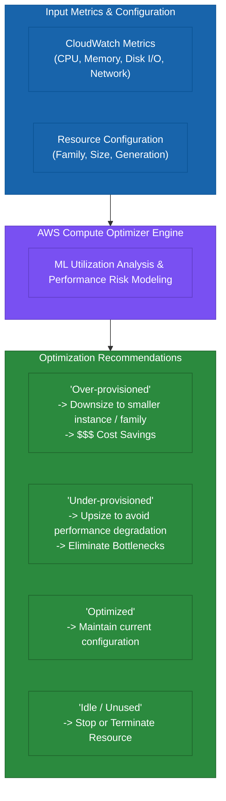
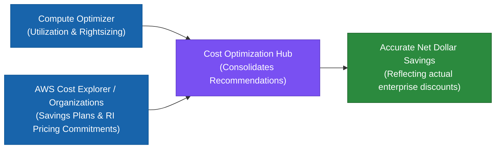
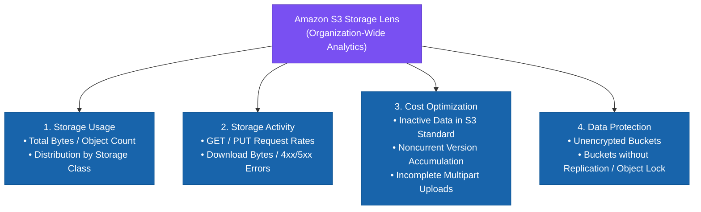
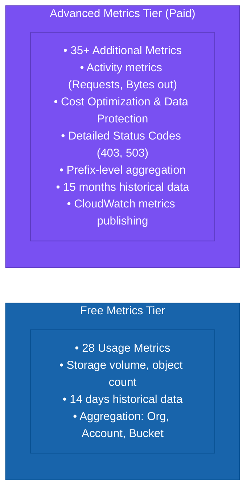
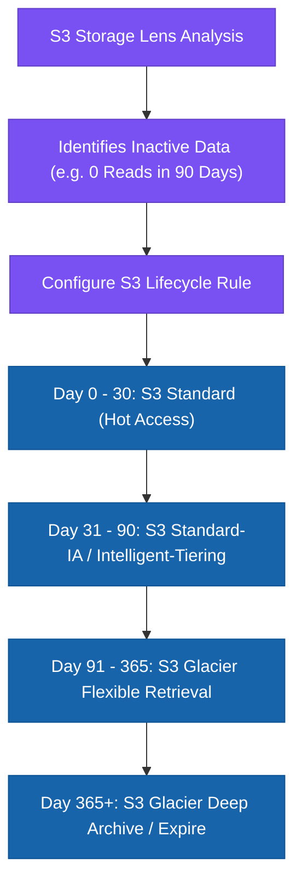
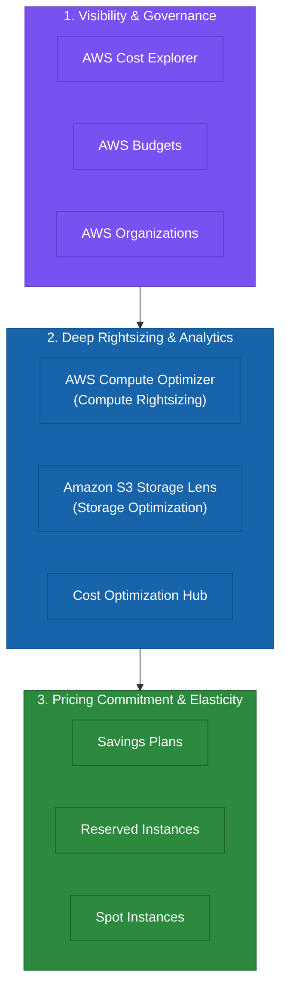
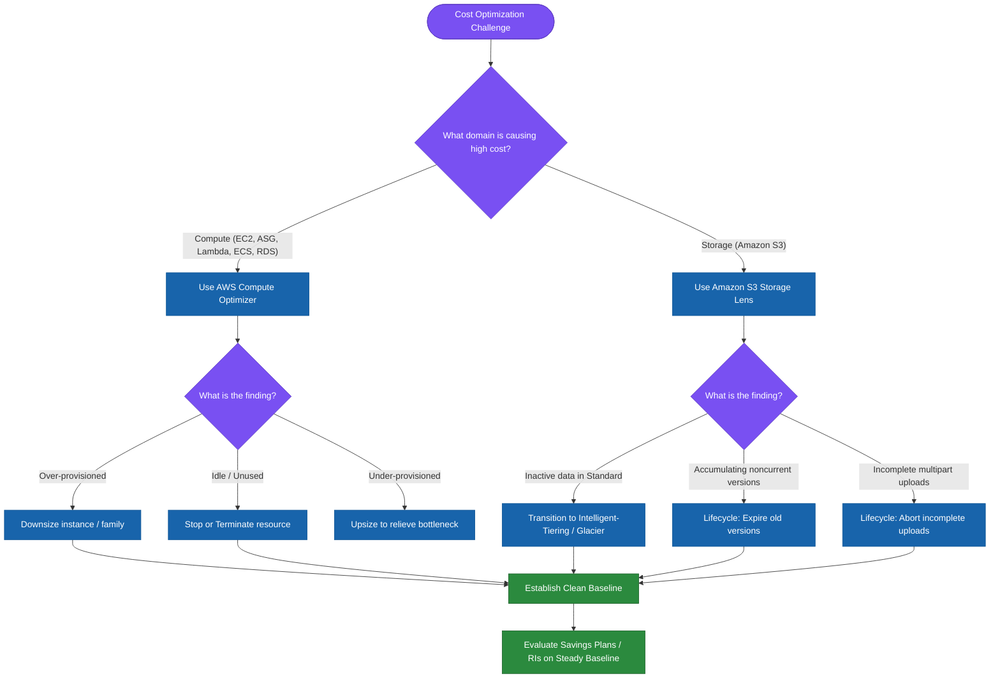
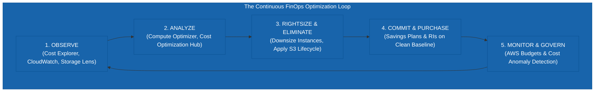

# AWS SAP — Task 1.5: Rightsizing & Cost Optimization Visibility

> **Domain Focus**: AWS Certified Solutions Architect – Professional (SAP-C02) & Cloud Financial Management  
> **Core Exam Question**:
> $$\text{“How do I know whether my AWS resources are larger, more expensive, or configured differently than they actually need to be?”}$$

This leads to two distinct resource-optimization problems:
- **Compute Resources**: *“Am I paying for more compute capacity than I need?”* $\longrightarrow$ **AWS Compute Optimizer**.
- **Amazon S3 Storage**: *“Am I storing data inefficiently, in the wrong storage class, or without lifecycle policies?”* $\longrightarrow$ **Amazon S3 Storage Lens**.

---

# 1. First Understand the Problem: What Is Rightsizing?

Suppose you have:
- **EC2 Instance**: `t3.2xlarge`
- **CPU Utilization**: `████░░░░░░ 35%`
- **Memory Utilization**: `████░░░░░░ 40%`

You are paying for a `t3.2xlarge` when a `t3.large` would completely satisfy workload demands.

> **Over-provisioning**: Provisioning capacity based on anticipated peak requirements, while actual steady-state utilization remains much lower. Over-provisioning is one of the classic AWS cost-optimization problems.

---

# 2. Why AWS Compute Optimizer Exists

Before Compute Optimizer, an organization had to manually inspect:
$$\text{CloudWatch Metrics (CPU, Mem, Disk, Net)} \longrightarrow \text{Compare 500+ Instance Types} \longrightarrow \text{Calculate Pricing} \longrightarrow \text{Decide Whether to Resize}$$

- **10 EC2 Instances** $\rightarrow$ Manageable manually.
- **500 EC2 Instances** $\rightarrow$ Difficult.
- **10,000 EC2 Instances** $\rightarrow$ Operational nightmare.

AWS created **AWS Compute Optimizer** to analyze resource configuration and utilization metrics using Machine Learning to identify **rightsizing opportunities and idle resources**, delivering actionable recommendations to reduce cost while maintaining performance. ([AWS Documentation](https://docs.aws.amazon.com/compute-optimizer/latest/ug/what-is-compute-optimizer.html?utm_source=chatgpt.com "What is AWS Compute Optimizer? - AWS Compute Optimizer"))

---

# 3. The Mental Model



Compute Optimizer is primarily a **decision-support and recommendation service**. It does **not** automatically resize or terminate resources on its own.

---

# 4. What Problem Does Compute Optimizer Solve?

### Problem 1 — Over-provisioning:
- Required capacity: $40\%$
- Provisioned capacity: $100\%$  
$\longrightarrow$ Paying for unused capacity. Compute Optimizer recommends smaller resource types.

### Problem 2 — Under-provisioning:
- EC2 running at $95\%$ CPU constantly.  
$\longrightarrow$ Instance is constrained. Rightsizing can mean **upsizing or moving to a higher-performance instance family** to prevent service degradation.

### Problem 3 — Idle Resources:
- EC2 instance running at $\sim 1\%$ CPU, zero network traffic, application decommissioned.  
$\longrightarrow$ Compute Optimizer identifies idle resource opportunities to stop or delete. ([AWS Documentation](https://docs.aws.amazon.com/compute-optimizer/latest/ug/what-is-compute-optimizer.html?utm_source=chatgpt.com "What is AWS Compute Optimizer? - AWS Compute Optimizer"))

---

# 5. Compute Optimizer Is Broader Than EC2

> [!IMPORTANT]
> **Exam Point**: Do not assume Compute Optimizer applies only to EC2 instances.

### Supported Resource Types:
- **Amazon EC2 Instances**
- **EC2 Auto Scaling Groups**
- **Amazon EBS Volumes** (IOPS, throughput, volume size)
- **AWS Lambda Functions** (Memory configuration)
- **Amazon ECS Services on AWS Fargate** (vCPU and Memory)
- **Amazon RDS & Amazon Aurora DB Instances**
- **Amazon DynamoDB**
- **NAT Gateways**
- **Amazon ElastiCache & Amazon MemoryDB**
- **Amazon DocumentDB**
- **Amazon SageMaker Endpoints**
- **Amazon WorkSpaces**
- **Commercial Software Licenses** (SQL Server) ([AWS Documentation](https://docs.aws.amazon.com/compute-optimizer/latest/ug/what-is-compute-optimizer.html?utm_source=chatgpt.com "What is AWS Compute Optimizer? - AWS Compute Optimizer"))

---

# 6. Is Compute Optimizer Operational Overhead?

## Very Low Operational Overhead
You do not build custom scripts, metric pollers, or database parsers. AWS operates the managed ML recommendation engine.

### Division of Responsibility:
| Responsibility Area | AWS | You (Architect / Engineer) |
| :--- | :---: | :---: |
| **Collect utilization metrics** | ✅ Yes | ❌ |
| **Run ML pattern analysis** | ✅ Yes | ❌ |
| **Generate rightsizing options & $ impact** | ✅ Yes | ❌ |
| **Evaluate performance risk & safety** | ❌ | ✅ **You** |
| **Execute architecture/resource change** | ❌ | ✅ **You** |
| **Validate application compatibility** | ❌ | ✅ **You** |

> **Compute Optimizer reduces the operational effort of discovering rightsizing opportunities; it does not remove architectural responsibility.**

---

# 7. Is It a Minimal Requirement?

Yes. If the requirement is *“Identify whether AWS compute resources are appropriately sized with minimal operational effort”*, opt in to **AWS Compute Optimizer**.

$$\text{AWS Resources} \longrightarrow \text{CloudWatch Metrics} \longrightarrow \text{AWS Compute Optimizer} \longrightarrow \text{Prescriptive Recommendations}$$

---

# 8. Very Important: Compute Optimizer Needs Data

Compute Optimizer requires sufficient historical metric data before generating recommendations:
- **Default lookback**: **14 days** of CloudWatch metric history.
- An instance created 5 minutes ago will not have meaningful rightsizing recommendations until historical utilization accumulates. ([AWS Documentation](https://docs.aws.amazon.com/compute-optimizer/latest/ug/requirements.html?utm_source=chatgpt.com "Resource requirements - AWS Compute Optimizer"))

> **No historical utilization $\longrightarrow$ Weak or unavailable rightsizing recommendations.**

---

# 9. Compute Optimizer + CloudWatch

- **CloudWatch**: *“What is actually happening?”* (Raw observability: CPU, RAM, Disk, Network).
- **Compute Optimizer**: *“What resource configuration should I consider changing to?”* (ML-driven recommendations).

*Note: Memory metrics for EC2 can be collected via the CloudWatch agent or external APM partners like Datadog and Dynatrace.* ([AWS Documentation](https://docs.aws.amazon.com/compute-optimizer/latest/ug/what-is-compute-optimizer.html?utm_source=chatgpt.com "What is AWS Compute Optimizer? - AWS Compute Optimizer"))

---

# 10. Compute Optimizer + Cost Explorer

Compute Optimizer integrates with **AWS Cost Explorer** billing metadata to calculate projected dollar savings. Cost Explorer must be enabled to view projected cost impact. ([AWS Documentation](https://docs.aws.amazon.com/compute-optimizer/latest/ug/requirements.html?utm_source=chatgpt.com "Resource requirements - AWS Compute Optimizer"))

$$\text{Compute Optimizer (What to change)} \quad + \quad \text{Cost Explorer (Financial \$ impact)}$$

---

# 11. Compute Optimizer + Cost Optimization Hub



Cost Optimization Hub factors in active Savings Plans and Reserved Instance pricing so that projected savings reflect actual committed rates rather than simple On-Demand list prices. ([AWS Documentation](https://docs.aws.amazon.com/compute-optimizer/latest/ug/requirements.html?utm_source=chatgpt.com "Resource requirements - AWS Compute Optimizer"))

---

# 12. Compute Optimizer Trade-Off

Compute Optimizer provides recommendations, but downsizing introduces a trade-off:
$$\text{Smaller Resource} \longrightarrow \text{Lower Cost} \quad \text{BUT} \quad \text{Less Capacity Headroom / Potential Performance Risk}$$

AWS exposes **Performance Risk ratings** (Very Low, Low, Medium, High) alongside each recommendation. ([AWS Documentation](https://docs.aws.amazon.com/compute-optimizer/latest/ug/view-ec2-recommendations.html?utm_source=chatgpt.com "Viewing EC2 instance recommendations - AWS Compute Optimizer"))

---

# 13. Rightsizing Is a Risk Optimization Problem

An architect must balance:
$$\text{Cost} \quad \longleftrightarrow \quad \text{Performance} \quad \longleftrightarrow \quad \text{Availability} \quad \longleftrightarrow \quad \text{Headroom for Spikes}$$

Before downsizing from 8 vCPU to 2 vCPU based on off-peak metrics, evaluate:
- Traffic spikes during marketing events / Black Friday.
- Month-end batch processing loads.
- Failover capacity requirements during AZ outages.

> [!WARNING]
> **Never interpret rightsizing as “always blindly choose the smallest instance.”**

---

# 14. Compute Optimizer Recommendation Preferences

Compute Optimizer allows customizing rightsizing preferences:
- **CPU Threshold & Headroom**
- **Memory Headroom**
- **Lookback Period**
- **Preferred / Excluded Instance Families**

$$\text{Maximum Savings Setting (Less Headroom / Higher Risk)} \quad \longleftrightarrow \quad \text{Maximum Performance Setting (More Headroom / Lower Risk)}$$

---

# 15. Compute Optimizer Enhanced Metrics

- **Default**: 14-day lookback period (Free).
- **Enhanced Infrastructure Metrics**: Up to **32-day** or **93-day** lookback periods (incurs additional charge per resource-month). ([AWS Documentation](https://docs.aws.amazon.com/compute-optimizer/latest/ug/rightsizing-preferences.html?utm_source=chatgpt.com "Rightsizing recommendation preferences - AWS Compute Optimizer"))

### Why choose 93-day lookback?
To capture monthly, quarterly, and seasonal workload spikes (e.g., quarterly financial closing, holiday shopping peaks).

---

# 16. Compute Optimizer Cost Model

> **Compute Optimizer is a visibility tool; cost savings are realized only when you execute the recommended resizing or termination actions.**

$$\text{Enable Compute Optimizer} \longrightarrow \text{Review Recommendations} \longrightarrow \text{Validate} \longrightarrow \text{Execute Change} \longrightarrow \text{Realize Savings}$$

---

# 17. Example — EC2 Rightsizing

- **Initial State**: 100 × `m5.xlarge` instances running at $18\%$ average CPU.
- **Compute Optimizer Finding**: 30 instances are severely over-provisioned.
- **Action**: Downsize 30 instances to `m5.large`.
- **Result**: Immediate reduction in monthly compute bills without performance degradation.

---

# 18. Compute Optimizer Is Not the Same as CloudWatch

- **CloudWatch**: Raw telemetry (*“CPU is 80%, latency is 120ms”*).
- **Compute Optimizer**: Prescriptive ML guidance (*“Change instance from `m5.4xlarge` to `m5.2xlarge` to save \$150/mo with Very Low performance risk”*).

---

# 19. Compute Optimizer vs. Cost Explorer Rightsizing

- **Cost Explorer**: High-level spend breakdown (*“Where is the money going?”*).
- **Compute Optimizer**: Deep ML-based resource sizing (*“Is this specific instance/volume sized properly?”*).
- **Cost Optimization Hub**: Centralized enterprise view of all optimization recommendations across accounts. ([AWS Documentation](https://docs.aws.amazon.com/cost-management/latest/userguide/ce-rightsizing.html?utm_source=chatgpt.com "Optimizing your cost with rightsizing recommendations - AWS Cost Management"))

---

# 20. Now — Why Does S3 Storage Lens Exist?

Compute Optimizer addresses compute resources; **Amazon S3 Storage Lens** addresses the storage estate.

Imagine an enterprise with:
- 10 AWS Accounts
- 500 S3 Buckets
- 500 TB to Petabytes of data

Manually inspecting 500 individual buckets for optimization opportunities is impossible. S3 Storage Lens solves this at scale.

---

# 21. The Problem S3 Storage Lens Solves

Amazon S3 Storage Lens provides **organization-wide visibility** into S3 storage usage and activity, with interactive drill-downs across:
- AWS Organization $\rightarrow$ Accounts $\rightarrow$ Regions $\rightarrow$ Buckets $\rightarrow$ Storage Classes $\rightarrow$ Prefixes. ([AWS Documentation](https://docs.aws.amazon.com/AmazonS3/latest/userguide/storage_lens_basics_metrics_recommendations.html?utm_source=chatgpt.com "Understanding Amazon S3 Storage Lens - Amazon Simple Storage Service"))



---

# 22. Why S3 Needs Its Own Visibility Tool

S3 cost drivers differ completely from EC2 compute:
- Total storage volume (GB/TB/PB)
- Storage class distribution (Standard, Infrequent Access, Glacier)
- Object age vs. access frequency
- Versioning noncurrent version accumulation
- Incomplete multipart upload storage
- Cross-region replication transfer

---

# 23. Example S3 Cost Problem

- **Bucket**: `application-data` (100 TB total in S3 Standard).
- **Storage Lens Finding**: 80 TB of data has not been accessed in over 180 days.
- **Action**: Implement an S3 Lifecycle rule transitioning objects older than 90 days to **S3 Intelligent-Tiering** or **S3 Glacier Flexible Retrieval**.

---

# 24. S3 Storage Lens — Key Mental Model

> **S3 is the storage engine. S3 Storage Lens is the analytics, visibility, and recommendation layer.**

Storage Lens discovers the optimization opportunity; **S3 Lifecycle** and **S3 Storage Classes** implement the fix.

---

# 25. S3 Storage Lens Operational Overhead

## Low Operational Overhead
You do not need to build complex custom data pipelines (`S3 Inventory + Glue + Athena + QuickSight + Lambda`) just to get storage analytics. Storage Lens provides built-in dashboards out of the box. ([AWS Documentation](https://docs.aws.amazon.com/AmazonS3/latest/userguide/storage_lens_basics_metrics_recommendations.html?utm_source=chatgpt.com "Understanding Amazon S3 Storage Lens - Amazon Simple Storage Service"))

---

# 26. S3 Storage Lens Minimal Requirements

- **Basic Setup**: Enabled automatically for all accounts at the default level.
- **Access**: Console, CLI, SDK, or REST API.
- **Export**: Daily metrics export delivered directly to a designated S3 bucket in CSV or Parquet format. ([AWS Documentation](https://docs.aws.amazon.com/AmazonS3/latest/userguide/storage_lens_basics_metrics_recommendations.html?utm_source=chatgpt.com "Understanding Amazon S3 Storage Lens - Amazon Simple Storage Service"))

---

# 27. S3 Storage Lens Free vs. Advanced Metrics



> [!TIP]
> **Cost Rule**: Enable Advanced Metrics where prefix-level visibility, activity metrics, or CloudWatch alerting are required.

---

# 28. Storage Lens + CloudWatch

Advanced Storage Lens metrics can be published directly to **Amazon CloudWatch**:
$$\text{S3 Storage Lens (Advanced Metrics)} \longrightarrow \text{Amazon CloudWatch} \longrightarrow \text{Dashboards / Alarms / Automated Remediation}$$

---

# 29. Storage Lens + S3 Lifecycle



> **Storage Lens identifies the pattern; S3 Lifecycle enforces the policy.**

---

# 30. Storage Lens + Storage Classes

- **S3 Standard**: Active, frequently accessed objects.
- **S3 Intelligent-Tiering**: Unknown or unpredictable access patterns (zero retrieval fees).
- **S3 Standard-IA / One Zone-IA**: Infrequently accessed data requiring millisecond retrieval.
- **S3 Glacier Flexible / Deep Archive**: Long-term archive and compliance records.

---

# 31. Storage Lens + S3 Versioning

If versioning is enabled, noncurrent versions accumulate silently over time:
- **Bucket**: 10 TB active objects, but **40 TB** in hidden noncurrent versions.
- **Action**: Implement an S3 Lifecycle rule to expire noncurrent versions after 30 days and retain only the last 2 versions. ([AWS Documentation](https://docs.aws.amazon.com/AmazonS3/latest/userguide/storage_lens_basics_metrics_recommendations.html?utm_source=chatgpt.com "Understanding Amazon S3 Storage Lens - Amazon Simple Storage Service"))

---

# 32. Storage Lens + Incomplete Multipart Uploads

Failed or abandoned multipart uploads consume billable storage indefinitely unless aborted:
$$\text{Storage Lens Flags Missing Abort Rules} \longrightarrow \text{S3 Lifecycle Rule: AbortIncompleteMultipartUpload (7 Days)} \longrightarrow \text{Eliminate Wasted Spend}$$

---

# 33. S3 Storage Lens Trade-Off

- **Small Environment**: Free metrics tier provides sufficient bucket-level usage visibility.
- **Enterprise Scale**: Advanced metrics provide essential prefix-level drilldowns, activity metrics, and cost optimization recommendations across thousands of buckets.

---

# 34. Compute Optimizer vs. S3 Storage Lens

| Comparison Dimension | AWS Compute Optimizer | Amazon S3 Storage Lens |
| :--- | :--- | :--- |
| **Target Domain** | Compute & Infrastructure Resources | Amazon S3 Storage Estate |
| **Primary Goal** | Rightsizing & eliminating idle compute | Storage class optimization & governance |
| **Core Finding** | Over-provisioned EC2 / Lambda / EBS | Inactive data in S3 Standard / Orphaned versions |
| **Data Source** | CloudWatch utilization metrics | S3 metadata, storage, and activity metrics |
| **Enforcing Mechanism** | Instance resize, ASG update, Lambda memory tweak | S3 Lifecycle Policies & Storage Class transitions |
| **Operational Overhead** | Very Low (Managed ML) | Very Low (Built-in dashboards) |
| **Advanced Tier** | Enhanced metrics (32 / 93-day lookback) | Advanced metrics (Prefix-level, CloudWatch export) |
| **Primary Risk** | Performance bottleneck if downsized excessively | Retrieval fees if data transitioned incorrectly |

---

# 35. The Bigger Cost Optimization Architecture



---

# 36. The Cost Optimization Lifecycle

$$\text{1. SEE} \longrightarrow \text{2. UNDERSTAND} \longrightarrow \text{3. RIGHTSIZE / ELIMINATE} \longrightarrow \text{4. COMMIT} \longrightarrow \text{5. USE SPOT} \longrightarrow \text{6. MONITOR}$$

1. **SEE**: Cost Explorer, CloudWatch, S3 Storage Lens.
2. **UNDERSTAND**: Compute Optimizer, Cost Optimization Hub.
3. **RIGHTSIZE**: Downsize instances, configure S3 Lifecycle policies, delete idle resources.
4. **COMMIT**: Procure Savings Plans and RIs on the clean, rightsized baseline.
5. **USE SPOT**: Deploy Spot instances for fault-tolerant and batch workloads.
6. **MONITOR**: Enforce guardrails with AWS Budgets and Cost Anomaly Detection.

---

# 37. Very Important: Rightsizing Before Purchasing Commitments

> [!IMPORTANT]
> **The Golden Sequence**: Always rightsize and eliminate idle resources **before** purchasing Savings Plans or Reserved Instances.

$$\text{Over-provisioned Fleet (100 Large)} \quad \xrightarrow{\quad\text{Buy 3-Yr RI}\quad} \quad \text{Locked into 3 Years of Paying for Waste}$$
$$\text{Over-provisioned Fleet (100 Large)} \quad \xrightarrow{\quad\text{Rightsize First}\quad} \quad \text{70 Medium} \quad \xrightarrow{\quad\text{Buy 3-Yr RI}\quad} \quad \text{Optimal ROI}$$

---

# 38. Compute Optimizer + Savings Plans

Compute Optimizer factors in active Savings Plans and Reserved Instances through **Cost Optimization Hub**, preventing recommendations from suggesting changes that invalidate active commitments. ([AWS Documentation](https://docs.aws.amazon.com/compute-optimizer/latest/ug/view-ec2-recommendations.html?utm_source=chatgpt.com "Viewing EC2 instance recommendations - AWS Compute Optimizer"))

---

# 39. Important Cost Trade-Off: Graviton

Compute Optimizer frequently recommends switching to **AWS Graviton (ARM-based)** instances for up to 40% price/performance gains.  
*Architect Validation Required*: Ensure application binaries, container base images, and third-party libraries support ARM architecture before executing migration.

---

# 40. Storage Lens and Cost Optimization Example

- **Estate**: 500 TB total in S3.
- **Storage Lens Finding**: 200 TB rarely accessed, 100 TB old noncurrent versions, 20 TB incomplete multipart uploads.
- **Automated Fix**:
  1. 200 TB transitioned to S3 Intelligent-Tiering / Glacier.
  2. 100 TB noncurrent versions expired after 30 days.
  3. 20 TB incomplete multipart uploads aborted after 7 days.
- **Result**: Drastic reduction in recurring S3 storage expenditure.

---

# 41. Minimal Requirements — Exam Perspective

- If the question asks to *“Identify over-provisioned EC2, Lambda, or EBS resources”* $\longrightarrow$ **AWS Compute Optimizer**.
- If the question asks to *“Gain organization-wide visibility into S3 storage and identify optimization opportunities”* $\longrightarrow$ **Amazon S3 Storage Lens**.

Do not build custom Athena/Lambda pipelines when native tools satisfy the requirement.

---

# 42. But When Would You Build Custom Analytics?

Build a custom pipeline (`S3 Inventory + Athena + QuickSight + Glue`) **only** when the exam requirement explicitly demands combining raw S3 object metadata with external on-premises databases, business CRM telemetry, or custom corporate billing systems.

---

# 43. Cost Optimization Is Not the Same as Cost Reduction

> **Cost Optimization means achieving the required business outcome at the lowest appropriate total cost—not simply minimizing the AWS bill.**

- Option A ($10K/mo): 99.99% availability, 5ms latency, Multi-Region DR.
- Option B ($8K/mo): 99.0% availability, 100ms latency, No DR.

If the business demands high availability, Option B is an architectural failure, not an optimization.

---

# 44. Think in Total Cost of Ownership (TCO)

$$\text{Total Architecture Cost} = \text{AWS Infrastructure} + \text{Operational Overhead} + \text{Engineering Effort} + \text{Performance Risk} + \text{Licensing}$$

---

# 45. The "Why Does This Service Exist?" Cheat Sheet

### AWS Compute Optimizer:
- **Why it exists**: Eliminates manual metric analysis across thousands of compute resources.
- **Problem solved**: Over-provisioning, under-provisioning, idle compute.
- **Operational overhead**: Very Low.
- **Cost benefit**: Indirect (savings realized upon acting on recommendations).
- **Core trade-off**: Cost savings vs. performance risk / headroom.

### Amazon S3 Storage Lens:
- **Why it exists**: Delivers centralized organization-wide analytics across millions of objects and thousands of buckets.
- **Problem solved**: Inefficient S3 storage classes, orphaned versions, unmanaged multipart uploads.
- **Operational overhead**: Very Low.
- **Cost benefit**: Discovers actionable lifecycle and tiering opportunities.
- **Core trade-off**: Free 28-metric visibility vs. paid advanced prefix-level analytics.

---

# 46. The Most Important Exam Distinctions

```
CloudWatch              ──► "What is happening right now?" (Metrics & Alarms)
Cost Explorer           ──► "Where did our money go?" (Historical Spend Analysis)
AWS Budgets             ──► "Are we exceeding our defined spending limits?" (Thresholds & Actions)
Compute Optimizer       ──► "Is this compute resource sized appropriately?" (Rightsizing Guidance)
S3 Storage Lens         ──► "How is our S3 storage utilized across the enterprise?" (Storage Visibility)
Cost Optimization Hub   ──► "What are our aggregated optimization opportunities?" (Centralized Actions)
Savings Plans           ──► "Can we commit to $/hr compute spend for a discount?" (Spend Commitments)
Reserved Instances      ──► "Can we commit to specific service capacity for a discount?" (Capacity Commitments)
Spot Instances          ──► "Can we tolerate interruption for up to 90% savings?" (Spare Capacity)
```

---

# 47. 🧠 SAP Decision Tree



---

# 48. The Golden SAP Mental Model & Final Exam Rule



### 🏆 Final Exam Rule:
When presented with a cost optimization question on the AWS Solutions Architect Professional exam, follow this rigorous sequence:
$$\text{Measure} \longrightarrow \text{Understand} \longrightarrow \text{Rightsize / Eliminate Waste} \longrightarrow \text{Commit to Baseline} \longrightarrow \text{Continuously Monitor}$$

This prevents the classic architectural mistake of **purchasing commitments on over-provisioned resources that should never have existed in the first place**.