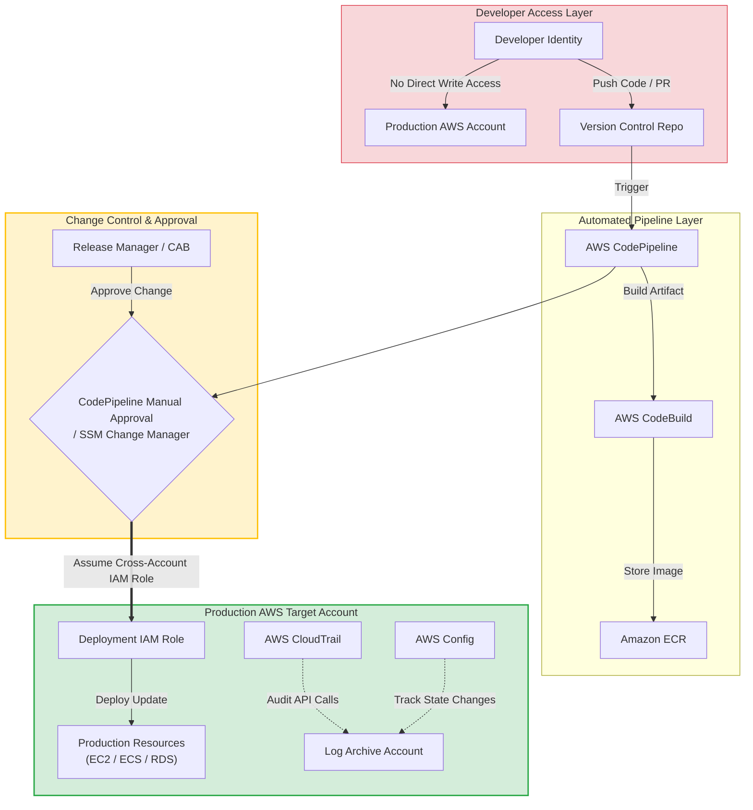
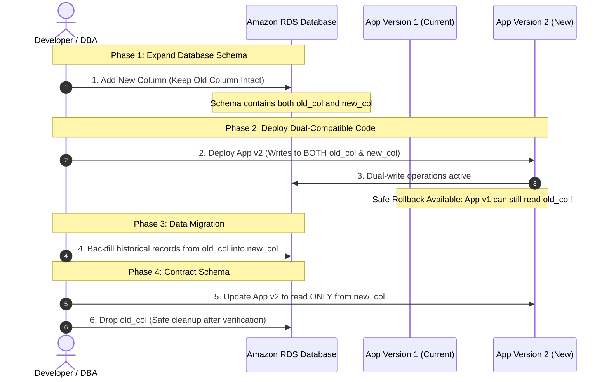

# Task 2.1: Change Management Processes — AWS SAP-C02 & AIP-C01 Exam Guide

> [!NOTE]
> **Exam Mindset**: For the AWS Solutions Architect Professional (SAP-C02) and AI Practitioner (AIP-C01) exams, view **Change Management as the governance and control framework around production changes**. While CI/CD answers *"How do we technically deliver the change?"*, Change Management answers *"How do we decide, approve, control, track, schedule, validate, and recover from production changes safely?"*

---

## 1. Why Change Management Exists

### Production Change Risk
Every production change introduces business and operational risk (e.g., application code updates, database schema migrations, IAM policy changes, security group updates, network route table modifications).

```mermaid
flowchart TD
    subgraph AdHoc ["Uncontrolled Anti-Pattern: Unapproved Ad-Hoc Modification"]
        Dev1["Developer"] -->|"Direct Console / SSH Access"| Prod1["Live Production Server"]
        Prod1 --> Outage["Unexpected Failure & Outage"]
        Outage --> Chaos["Difficult Audit & Unclear Rollback"]
        
        NoteAdHoc["❌ No Risk Assessment or Audit Trail<br/>❌ Direct Production Writes by Developers<br/>❌ High Incident Downtime Risk"]
    end

    subgraph Governance ["Modern Enterprise Architecture: Governed Change Management"]
        Req["1. Change Request<br/>(SSM Change Manager / Jira)"] --> Risk["2. Assess Risk & Impact"]
        Risk --> Test["3. Automated Pipeline Testing"]
        Test --> Gate{"4. Approval Gate<br/>(CAB / Automated Policy)"}
        
        Gate -- "Approved" --> Sched["5. Schedule Maintenance Window"]
        Sched --> Deploy["6. Automated Execution<br/>(CloudFormation / CodeDeploy)"]
        Deploy --> Monitor["7. CloudWatch & Config Monitoring"]
        
        Monitor -- "Success" --> Close["8. Validate & Close Change"]
        Monitor -- "Failure Alarm" --> Rollback["8. Trigger Automated Rollback"]

        NoteGov["✅ 100% Auditable & Policy Compliant<br/>✅ Enforces Separation of Duties<br/>✅ Automated Metric-Based Rollback"]
    end

    style AdHoc fill:#f8d7da,stroke:#dc3545,stroke-width:1px
    style Governance fill:#d4edda,stroke:#28a745,stroke-width:2px
    style Gate fill:#fff3cd,stroke:#ffc107,stroke-width:2px
```



---

## 2. Core Problem Solved by Change Management

Change management answers: **"How do we make production changes safely, consistently, and auditably?"**

### Core Business Objectives
- **Risk Control**: Evaluate impact and dependencies before applying updates.
- **Separation of Duties**: Developers write code, automated pipelines test artifacts, authorized managers approve changes, and IAM roles execute deployments.
- **Auditability**: Maintain full historical records of requested, approved, and executed changes.
- **Standardization**: Enforce repeatable procedures and verified rollback strategies.

---

## 3. CI/CD vs. Change Management

```
CI/CD:            Code ──> Build ──> Test ──> Package ──> Deploy (Technical Execution)
Change Governance: Request ──> Assess Risk ──> Approve ──> Schedule ──> Audit ──> Validate (Governance & Control)
```

They complement each other:

```
Developer Commits Code ──> CI/CD Pipeline Tests Staging ──> Change Approval Gate (Governance) ──> Automated Production Deployment
```

---

## 4. Why Change Management Is Critical for SAP-C02

Enterprise scenarios on the SAP-C02 exam test for governance and risk mitigation requirements:
- *"Production releases require explicit change approval."*
- *"All infrastructure modifications must be auditable for compliance."*
- *"Developers must not have direct SSH or console write access to production."*
- *"Deployments must automatically roll back if CloudWatch health alarms fire."*
- *"Emergency hotfixes must bypass standard maintenance windows but retain post-change audit trails."*

---

## 5. Typical Change Management Lifecycle

```
1. Request ──> 2. Assess Risk ──> 3. Plan Rollback ──> 4. Test Staging ──> 5. Approve
                                                                              │
10. Close / Audit ◄── 9. Validate ◄── 8. CloudWatch Monitor ◄── 7. Deploy ◄── 6. Schedule Window
```

---

## 6. Structure of a Change Request

A formal Change Request specifies:
- **Scope**: Targeted AWS resources and applications.
- **Justification**: Business reason for the modification.
- **Impact & Dependencies**: Risk classification (Low, Medium, High, Emergency).
- **Testing Proof**: Test results from staging environments.
- **Rollback Strategy**: Step-by-step recovery plan if the change fails.
- **Execution Window**: Maintenance window or pipeline schedule.

---

## 7. AWS Systems Manager Change Manager

**AWS Systems Manager Change Manager** is the AWS-native operational change governance service.

### Key Capabilities
- **Change Templates**: Standardize approved operational procedures.
- **Approval Workflows**: Define multi-level reviewer gates before execution.
- **Schedule Integration**: Integrates directly with Systems Manager Maintenance Windows.
- **Automation Execution**: Triggers Systems Manager Automation runbooks upon approval.

> [!TIP]
> **Exam Trigger Keyword**: *"Operational change requests, approval workflows, and auditable maintenance windows"* $\longrightarrow$ **AWS Systems Manager Change Manager**.

---

## 8. When Systems Manager Change Manager Applies

Use Change Manager when managing operational procedures:
- Applying OS patches across EC2 instance fleets.
- Modifying production database parameter groups.
- Executing infrastructure maintenance runbooks.
- Auditing operational approvals for compliance.

---

## 9. Change Management Does Not Mean Manual Deployment

> [!WARNING]
> **Common Exam Trap**: Controlled change management does **NOT** mean engineers manually log into servers to edit files. The change process *governs approval*, but the *deployment remains 100% automated* via CodePipeline, CloudFormation, or Systems Manager Automation.

---

## 10. Combining Change Management with AWS CodePipeline

```
CodeCommit ──> CodeBuild ──> Staging Deploy ──> [ Manual Approval Gate (Change Manager / SNS) ] ──> CodeDeploy (Prod)
```

Integrates governance directly into the automated release pipeline.

---

## 11. Manual Approvals vs. Automated Approval Gates

| Approval Type | Best Used For | AWS Implementation |
| :--- | :--- | :--- |
| **Manual Approval Gate** | Business authorization, CAB sign-off, maintenance windows | CodePipeline Manual Approval Stage (SNS), SSM Change Manager |
| **Automated Approval Gate**| Measurable technical criteria (unit tests, security scans, metrics) | CodeBuild test passes, CloudWatch Alarm state checks |

> [!NOTE]
> **SAP Exam Rule**: Use human approval for business/compliance decisions; use automated gates for repeatable technical validations.

---

## 12. Separation of Duties Architecture



Enforces least-privilege security by preventing developers from writing directly to production AWS resources.

---

## 13. IAM's Role in Change Governance

- **Developer Role**: Permissions limited to CodeCommit/GitHub and Development AWS Accounts.
- **Approval Role**: Granted permissions to approve CodePipeline stages or SSM Change Requests.
- **Pipeline Deployment Role**: Cross-account role with specific permissions to modify target production resources.

---

## 14. AWS Organizations & Governance Guardrails

Enterprise multi-account structures enforce change governance at scale:
- **Service Control Policies (SCPs)**: Block dangerous actions (e.g., disabling CloudTrail or deleting S3 buckets) across all accounts regardless of IAM permissions.
- **Cross-Account Roles**: Allow central deployment pipelines to manage target accounts securely.

---

## 15. AWS CloudTrail: API Activity Auditing

**AWS CloudTrail** records all API calls made within an AWS account (**Who performed what action and when**).

> [!IMPORTANT]
> **CloudTrail vs. Change Approval**:
> - **CloudTrail**: Audit history of API calls (**Post-event recording**).
> - **Change Manager / CodePipeline**: Authorization gate (**Pre-event control**).

---

## 16. AWS Config: Configuration History & Compliance

- **AWS CloudTrail**: Records *who* made the API call (e.g., `UpdateSecurityGroupRule`).
- **AWS Config**: Records *what* the resource configuration state looks like before and after the change (e.g., Port 22 opened to `0.0.0.0/0`).

---

## 17. CloudFormation as a Change Management Control

Using Infrastructure as Code (IaC) ensures:
- Infrastructure changes are version-controlled in Git.
- Peer code reviews are required via Pull Requests.
- Environment modifications are auditable and reproducible.

---

## 18. CloudFormation Change Sets

Before applying an infrastructure update, generate a **CloudFormation Change Set** to preview modified, added, or deleted resources.

> [!TIP]
> **Exam Trigger**: *"Preview infrastructure changes before executing a CloudFormation stack update"* $\longrightarrow$ **CloudFormation Change Sets**.

---

## 19. CloudFormation Change Sets vs. SSM Change Manager

- **CloudFormation Change Sets**: Technical preview of infrastructure template updates (**What will change in CloudFormation?**).
- **SSM Change Manager**: Enterprise workflow for requesting, approving, scheduling, and logging operational changes (**Who approved the maintenance task?**).

---

## 20. Systems Manager Maintenance Windows

Use **Systems Manager Maintenance Windows** to define scheduled time windows for executing disruptive operational tasks (e.g., OS patching, rebooting instances, running automation scripts).

---

## 21. Change Management & Patching Strategies

```
Patch Manager ──> Maintenance Window ──> SSM Automation Runbook ──> CloudWatch Validation
```

Automates security patch deployment across thousands of instances without manual login risks.

---

## 22. Immutable Infrastructure Pattern

```
Deploy New AMI ASG ──> Health Checks Pass ──> Shift Load Balancer Traffic ──> Terminate Old ASG
```

Eliminates configuration drift by replacing servers rather than modifying running instances.

---

## 23. Change Management & Blue/Green Deployments

- **Concept**: Maintain Blue (v1) and Green (v2). Shift 100% traffic to Green.
- **Risk Reduction**: Instant rollback by pointing the load balancer back to Blue if health checks fail.
- **Cost Trade-off**: Higher temporary infrastructure cost during deployment.

---

## 24. Change Management & Canary Deployments

Route a small percentage of traffic (e.g., 5%) to the new release and monitor CloudWatch alarms. Minimizes blast radius during releases.

---

## 25. Change Management & Rolling Deployments

Updates instances in sequential batches. **Lowest infrastructure cost**, but coexists multiple application versions during deployment.

---

## 26. Emergency Change Procedures

Emergency hotfixes (e.g., zero-day security vulnerabilities) require a fast-track workflow:
```
Emergency Request ──> Expedited Approval ──> Immediate Pipeline Execution ──> Post-Implementation Review & Audit Log
```

---

## 27. Change Types Classification

| Change Type | Description | Example | Approval Requirement |
| :--- | :--- | :--- | :--- |
| **Standard Change** | Pre-approved, low-risk, routine task | Scheduled OS patch update | Pre-approved automation |
| **Normal Change** | Requires formal assessment & approval | Major application version release | CAB / Manager Approval |
| **Emergency Change** | Urgent fix for critical production outage/security bug | Zero-day patch deployment | Fast-track Emergency Approval |

---

## 28. Change Management & Rollback Planning

Every approved change request must include a verified **Rollback Plan** (e.g., database snapshots, Blue/Green cutover back to v1, or CloudFormation stack rollback).

---

## 29. Database Migration Pattern: Expand and Contract



Enables zero-downtime database schema updates while allowing safe application rollbacks.

---

## 30. Database Migration Services

Key AWS database migration services: **AWS Database Migration Service (DMS)**, **AWS Schema Conversion Tool (SCT)**, **Amazon RDS Snapshots**, and **AWS Backup**.

---

## 31. Cost Perspective & Risk Mitigation

```
Uncontrolled Changes  ──> Outages & Incident Recovery ──> High Business Losses (High Indirect TCO)
Governed Changes      ──> Tooling & Process Overhead ──> High Availability & Zero Outages (Lowest TCO)
```

---

## 32. Minimal Governance vs. Regulated Enterprise

- **Startup Architecture**: Source $\rightarrow$ CI/CD $\rightarrow$ Automated Tests $\rightarrow$ Production.
- **Enterprise Regulated Architecture**: Source $\rightarrow$ CI/CD $\rightarrow$ Staging $\rightarrow$ SSM Change Manager Approval $\rightarrow$ IAM Cross-Account Deploy $\rightarrow$ CloudTrail / AWS Config Auditing.

---

## 33. When NOT to Add SSM Change Manager

If a requirement asks to *"Automatically deploy application updates upon code commit"*, do **NOT** force SSM Change Manager. Use AWS CodePipeline/CodeDeploy. Only add Change Manager when explicit *approval workflows and maintenance windows* are required.

---

## 34. AWS Governance & Change Decision Matrix

| Requirement / Scenario | Correct AWS Service / Feature |
| :--- | :--- |
| **Preview CloudFormation stack modifications** | **CloudFormation Change Sets** |
| **Operational change requests & approval workflows** | **AWS Systems Manager Change Manager** |
| **Schedule recurring EC2 maintenance/patching** | **SSM Maintenance Windows & Patch Manager** |
| **Audit WHO made an API call and WHEN** | **AWS CloudTrail** |
| **Track WHAT resource configuration changed over time** | **AWS Config** |
| **Enforce organization-level guardrails across accounts** | **Service Control Policies (SCPs)** |
| **Automate application code deployments** | **AWS CodeDeploy** |
| **Automate pipeline release steps** | **AWS CodePipeline** |
| **Automated metric-based rollback** | **Amazon CloudWatch Alarms** |

---

## 35. Cost & Operational Overhead Matrix

```
Manual Console Changes  ──> Low Tooling Cost | Extremely High Risk | High Operational Overhead
Automated CI/CD        ──> Low Operations   | Low Deployment Risk  | High Environment Parity
SSM Change Manager     ──> Controlled Risk   | Auditable Workflow   | Enforces Governance
Blue/Green Strategy    ──> Higher Temp Cost  | Instant Rollback     | Zero Downtime
```

---

## 36. Exam Keyword Mapping

```
"Approval workflow for operations"    ──> Systems Manager Change Manager
"Preview infrastructure updates"     ──> CloudFormation Change Sets
"Audit API calls and identity"       ──> AWS CloudTrail
"Track resource configuration history"──> AWS Config
"Schedule maintenance tasks"          ──> SSM Maintenance Windows
"Separation of duties"               ──> IAM Roles + Cross-Account Deployment
"Zero downtime & instant rollback"   ──> Blue/Green Deployment
"Gradual user exposure"              ──> Canary Deployment
"Lowest infrastructure cost"         ──> Rolling Deployment
```

---

## 37. SAP-C02 Mental Model Flowchart

```
1. What is changing? ──────────> Application, Infrastructure, Schema, or Patch?
2. Who authorizes the change? ─> Manual Approval (CodePipeline/SSM) vs Automated Gates
3. How is it deployed? ────────> CodeDeploy, CloudFormation, or SSM Automation
4. How is it audited? ─────────> CloudTrail (API history) + AWS Config (Resource state)
5. What if it fails? ──────────> CloudWatch Alarms ➔ Automated Rollback
```

---

## 38. Critical Exam Service Distinctions

```
CloudFormation Change Sets  ──> "Preview WHAT infrastructure resources will change"
SSM Change Manager          ──> "Approve, schedule, and log HOW operational changes run"
AWS CloudTrail              ──> "Audit WHO executed API calls"
AWS Config                  ──> "Track WHAT resource configurations look like over time"
```

---

## 39. Final Exam Summary

```
Business Requirement ──> Risk Evaluation ──> Change Control ──> Automation ──> Approval Gate ──> Deploy ──> Monitor ──> Audit
```

For the exam, design the simplest governance pipeline that satisfies safety, compliance, availability, and cost constraints.