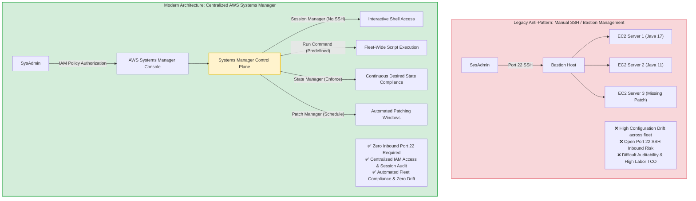
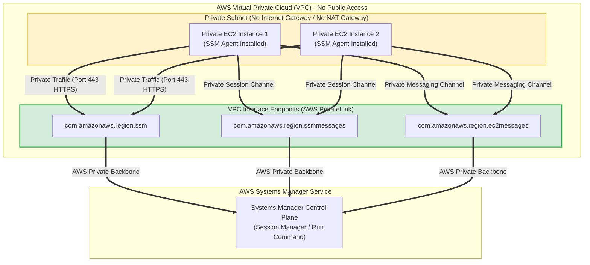
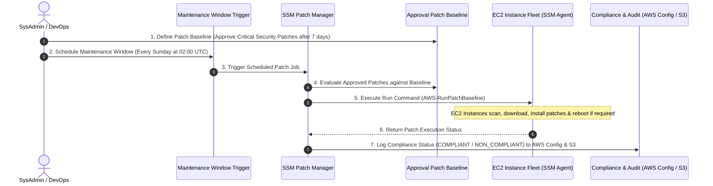
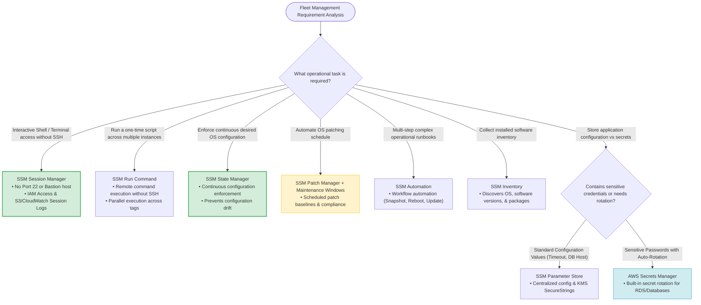

# Task 2.1: Configuration Management Tools & AWS Systems Manager — AWS SAP-C02 & AIP-C01 Exam Guide

> [!NOTE]
> **Exam Mindset**: For the AWS Solutions Architect Professional (SAP-C02) and AI Practitioner (AIP-C01) exams, view **Configuration Management** through the lens of fleet scale: *"How do I keep hundreds or thousands of servers consistently configured, patched, secured, and operational without manually logging into each server?"* **AWS Systems Manager (SSM)** is the core AWS-native service that solves this problem across AWS, multi-account, and hybrid on-premises environments.

---

## 1. Why Configuration Management Exists

### Fleet Administration Anti-Pattern
Without automated configuration management, operating large fleets of EC2 instances leads to severe configuration drift and security vulnerabilities.



---

## 2. Core Problem Solved by Configuration Management

Configuration management shifts operational management from individual server administration to **automated fleet policy enforcement**.

### Key Operational Challenges Addressed
- **Configuration Drift**: Ensures instances maintain identical software packages and OS configurations.
- **Patch Management**: Automates security patch updates across Linux and Windows instances.
- **Remote Administration**: Replaces SSH/RDP with IAM-authorized remote execution.
- **Fleet Inventory & Compliance**: Tracks installed software versions and flags non-compliant nodes.

---

## 3. AWS Systems Manager Suite Overview

AWS Systems Manager is an integrated hub of operational management capabilities:

```
AWS Systems Manager
  ├── Session Manager     (Interactive Shell without SSH)
  ├── Run Command         (Bulk Remote Command Execution)
  ├── State Manager       (Continuous Desired State Enforcement)
  ├── Patch Manager       (Automated OS Patching & Baselines)
  ├── Maintenance Windows (Scheduled Operational Windows)
  ├── Automation          (Multi-step Operational Runbooks)
  ├── Inventory           (Software & Instance Metadata Discovery)
  ├── Fleet Manager       (Centralized Node Management Console)
  ├── Parameter Store     (Centralized App Configuration & KMS Strings)
  └── Change Manager      (Operational Change Approvals & Logging)
```

---

## 4. Why AWS Systems Manager Exists

Managing 5 EC2 instances manually via SSH is manageable; managing 5,000 EC2 instances manually is impossible. Systems Manager provides centralized, scalable control plane operations across cloud and hybrid infrastructure.

---

## 5. Operational Overhead Considerations

```
Without Systems Manager: Manual SSH ──> Individual Server Edits ──> Drift ──> High Recurring Labor Cost
With Systems Manager:    IAM Policy ──> SSM Control Plane ──> Fleet Automation ──> Standardized Fleet
```

> [!TIP]
> **SAP Exam Rule**: Setting up Systems Manager (IAM roles, SSM Agent, Automation documents) requires upfront design, but eliminates thousands of hours of manual server maintenance and security audits.

---

## 6. Minimum Requirements for Systems Manager

To manage EC2 instances via Systems Manager, three core prerequisites must be met:
1. **SSM Agent Installed**: Installed and running on target instances (pre-installed on standard Amazon Linux 2 / AL2023 / Windows AMIs).
2. **IAM Permissions**: Attached IAM Instance Profile with `AmazonSSMManagedInstanceCore` policy.
3. **Network Connectivity**: Outbound HTTPS (Port 443) connectivity to AWS Systems Manager endpoints.

---

## 7. Systems Manager in Private Subnets (VPC Interface Endpoints)

In strict security environments, private EC2 instances operate without Internet Gateways or NAT Gateways.



> [!IMPORTANT]
> **Exam Trigger Keyword**: *"Private EC2 instances in private subnets without Internet access need Systems Manager access"* $\longrightarrow$ **Create VPC Interface Endpoints (`ssm`, `ssmmessages`, `ec2messages`)**.

---

## 8. Deep-Dive: Systems Manager Session Manager

Session Manager provides secure, one-click interactive shell access to EC2 instances.

### Key Benefits
- **No Inbound Port 22 SSH**: Eliminates open inbound SSH/RDP ports in Security Groups.
- **No Bastion Hosts Required**: Reduces infrastructure cost and maintenance.
- **IAM Authorization**: Controls access via IAM policies rather than SSH keys.
- **Session Auditing**: Logs all terminal commands to **Amazon CloudWatch Logs** or **Amazon S3**.

---

## 9. Session Manager vs. Traditional SSH

| Feature | Traditional SSH / Bastion Host | AWS Systems Manager Session Manager |
| :--- | :--- | :--- |
| **Inbound Ports Required** | Open Port 22 inbound | **Zero inbound ports open (Port 443 outbound)** |
| **Infrastructure Cost** | Requires Bastion Host instances | **No Bastion Hosts required** |
| **Access Control** | SSH key pair management | **IAM Policies & AWS SSO / Identity Center** |
| **Command Auditing** | Manual / Custom bastion logs | **Native logging to CloudWatch Logs / S3** |

---

## 10. Deep-Dive: Systems Manager Run Command

**Run Command** allows remotely executing predefined scripts or commands across a fleet of instances using instance tags or target groups.

```
Admin ──> Run Command (AWS-RunShellScript / "yum update -y") ──> Fleet Target Tag (Env: Prod) ──> 1,000 EC2 Instances
```

---

## 11. Run Command vs. Session Manager

- **Session Manager**: **Interactive** terminal shell session (*"Log into an instance interactively to debug"*).
- **Run Command**: **Non-interactive** remote command execution across multiple instances (*"Execute a shell script across 500 instances simultaneously"*).

---

## 12. Deep-Dive: Systems Manager State Manager

**State Manager** automates keeping instances in a defined configuration state (e.g., ensuring specific antivirus software is installed, firewall rules are active, or anti-drift scripts run periodically).

> [!TIP]
> **Exam Trigger**: *"Continuously enforce instance configuration and prevent configuration drift over time"* $\longrightarrow$ **AWS Systems Manager State Manager**.

---

## 13. State Manager vs. Run Command

- **Run Command**: Executed **one time** on demand (*"Restart NGINX now"*).
- **State Manager**: Executed **recurrently** to enforce desired configuration (*"Ensure NGINX remains installed and running every 6 hours"*).

---

## 14. Deep-Dive: Systems Manager Patch Manager



---

## 15. Patch Manager vs. State Manager

- **Patch Manager**: Specialized in OS package patching according to defined **Patch Baselines**.
- **State Manager**: Generic configuration enforcement (software installs, file permissions, security scripts).

---

## 16. Systems Manager Maintenance Windows

Defines scheduled time windows (e.g., Every Sunday at 02:00 AM) to execute disruptive tasks using Patch Manager, Run Command, or Automation runbooks without affecting peak production traffic.

---

## 17. Systems Manager Automation

**Automation** defines multi-step operational runbooks in JSON/YAML (e.g., creating AMI snapshots, stopping instances, updating CloudFormation stacks, running health checks, and notifying teams).

```
Automation Runbook:
[ Stop Instance ] ──> [ Create EBS Snapshot ] ──> [ Update AMI ] ──> [ Restart Instance ] ──> [ Validate Health ]
```

---

## 18. Automation vs. Run Command

- **Run Command**: Executes shell/PowerShell commands directly inside the instance OS.
- **Automation**: Orchestrates multi-step workflows across AWS APIs and instances.

---

## 19. Systems Manager Inventory

**Inventory** collects software metadata across your instance fleet:
- Installed applications and versions.
- OS details, network configuration, and environment variables.
- Custom metadata.

> [!NOTE]
> **Exam Clue**: *"Identify installed software packages across thousands of EC2 instances for compliance reporting"* $\longrightarrow$ **Systems Manager Inventory**.

---

## 20. Fleet Manager

Provides a unified management console within Systems Manager to inspect OS file systems, running processes, user accounts, and performance metrics across nodes.

---

## 21. Systems Manager Parameter Store

**Parameter Store** provides secure, centralized storage for configuration data (database strings, license keys, timeouts, AMI IDs).

```
Application Code ──> Fetch Parameter ("/prod/db/hostname") ──> SSM Parameter Store (Decrypted via KMS)
```

Supports plain text parameters (`String`, `StringList`) and encrypted parameters (`SecureString` backed by AWS KMS).

---

## 22. Parameter Store vs. AWS Secrets Manager

| Feature | Systems Manager Parameter Store | AWS Secrets Manager |
| :--- | :--- | :--- |
| **Primary Focus** | Application configuration parameters | **Sensitive database credentials & API keys** |
| **Secret Rotation** | Manual / Custom Lambda rotation | **Built-in automated rotation** (RDS/Redshift) |
| **Cross-Account Sharing** | Supported via RAM / KMS policies | Native cross-account secret access |
| **Cost Model** | **Free for Standard parameters** | Monthly fee per secret + API request charges |

> [!IMPORTANT]
> - Choose **Parameter Store** for configuration data and standard KMS encrypted strings.
> - Choose **Secrets Manager** when **built-in automatic credential rotation** is explicitly required.

---

## 23. Configuration Management vs. Infrastructure as Code (IaC)

- **CloudFormation (IaC)**: Provisions infrastructure (**Creates VPCs, Subnets, EC2 instances, DBs**).
- **Systems Manager (Config Management)**: Manages OS operations after creation (**Patches OS, runs scripts, enforces state**).

```
CloudFormation (Create Stack) ──> EC2 Instance ──> Systems Manager State Manager (Configure & Patch)
```

---

## 24. CloudFormation + Systems Manager Architecture

1. **CloudFormation** provisions an Auto Scaling Group of 500 EC2 instances.
2. **Systems Manager State Manager & Patch Manager** automatically join the fleet, install agents, apply security baselines, and enforce operational compliance.

---

## 25. Configuration Management vs. CI/CD

- **CI/CD (CodePipeline / CodeDeploy)**: Deploys new application release packages.
- **Systems Manager**: Maintains underlying OS environments, patches, and operational configurations.

---

## 26. Golden AMI Strategy vs. Systems Manager Bootstrapping

```
Golden AMI:   Packaged Image (Fastest Startup) ──> Launch EC2 Instance (Ready Immediately)
SSM Bootstrap: Base AMI ──> Launch EC2 Instance ──> Systems Manager State Manager Configures OS (Slower Launch)
```

- **Golden AMI**: Best when rapid scale-out speed is critical.
- **Systems Manager**: Best for continuous ongoing management of running instances.

---

## 27. Cost & TCO Optimization

Systems Manager capabilities (Session Manager, Run Command, Patch Manager, Standard Parameter Store) have **no additional service charge**. You only pay for underlying resources (EC2, S3/CloudWatch logs, KMS keys, VPC Interface Endpoints).

---

## 28. Minimal Architecture Requirements

- **Basic Instance Management**: EC2 + SSM Agent + IAM Instance Profile (`AmazonSSMManagedInstanceCore`).
- **Private Subnet Management**: EC2 + SSM Agent + IAM Role + **3 VPC Interface Endpoints** (`ssm`, `ssmmessages`, `ec2messages`).

---

## 29. Operational Decision Matrix

```
One-time script execution ─────────────> Systems Manager Run Command
Interactive terminal access ────────────> Systems Manager Session Manager
Continuous configuration enforcement ──> Systems Manager State Manager
Scheduled OS patching ─────────────────> Patch Manager + Maintenance Windows
Multi-step operational runbook ─────────> Systems Manager Automation
Discover installed software ───────────> Systems Manager Inventory
Application configuration values ──────> Parameter Store
Database credentials with rotation ────> AWS Secrets Manager
```

---

## 30. Systems Manager and Auto Scaling Integration

When Auto Scaling Groups launch new instances, SSM State Manager associations automatically apply desired state configurations to newly launched instances upon registration.

---

## 31. Golden AMI vs. Systems Manager Comparison

| Feature | Golden AMI Approach | Systems Manager Approach |
| :--- | :--- | :--- |
| **Startup Time** | **Fastest** (pre-baked packages) | Slower (installs packages at launch) |
| **Maintenance Effort** | Image pipeline maintenance (EC2 Image Builder) | Maintains SSM documents/baselines |
| **Ongoing Fleet Updates** | Requires instance replacement | **Updates running instances in-place** |

---

## 32. Hybrid Infrastructure Management

Systems Manager manages both **AWS EC2 instances** and **On-Premises Servers** (via **Hybrid Activations** and SSM Agent installation), delivering a single unified management pane.

> [!NOTE]
> **Exam Clue**: *"Manage AWS EC2 instances and on-premises physical servers using a single operational management tool"* $\longrightarrow$ **AWS Systems Manager (Hybrid Activations)**.

---

## 33. Systems Manager Hybrid Activations

Generates activation codes/IDs to register on-premises servers as managed nodes in Systems Manager, enabling Run Command, Patch Manager, and Inventory across hybrid data centers.

---

## 34. Compliance Ecosystem: Systems Manager + Config + CloudTrail

```
Systems Manager ──> Executes Patching & Configuration State
AWS Config      ──> Evaluates Configuration Compliance
AWS CloudTrail  ──> Audits API Calls & User Actions
```

---

## 35. Systems Manager vs. AWS Config

- **AWS Config**: **Audit & Compliance Engine** (*"Evaluates whether resources comply with rules"*).
- **Systems Manager**: **Operational Execution Engine** (*"Executes actions, runbooks, and state enforcement on resources"*).

---

## 36. Systems Manager vs. AWS OpsWorks

- **AWS OpsWorks**: Managed Chef and Puppet configuration management service.
- **AWS Systems Manager**: AWS-native fleet management service (Preferred for modern AWS-native architectures).

---

## 37. Systems Manager vs. Ansible

- **Ansible**: Open-source/third-party automation tool.
- **Systems Manager**: Agent-based, AWS-managed service with zero control server overhead.

---

## 38. Systems Manager vs. AWS Lambda

- **AWS Lambda**: Event-driven serverless application execution.
- **Systems Manager Automation**: Operational runbook workflows designed specifically for cloud infrastructure and fleet operations.

---

## 39. Systems Manager vs. ECS/EKS Container Orchestration

- **ECS / EKS**: Orchestrates container lifecycle and microservices.
- **Systems Manager**: Manages underlying host EC2 instances, OS patching, and host-level operations.

---

## 40. Multi-Service Operational Architecture

```
Git ──> CI/CD ──> CloudFormation (Provision EC2/ASG) ──> Systems Manager (Patch/State) ──> CloudWatch (Monitor) ──> AWS Config (Compliance)
```

---

## 41. Complete AWS Systems Manager Decision Matrix

| Requirement / Keyword | Recommended AWS Feature |
| :--- | :--- |
| **Interactive shell without SSH / Bastion** | **SSM Session Manager** |
| **Run command across 500 instances** | **SSM Run Command** |
| **Enforce continuous desired state** | **SSM State Manager** |
| **Scheduled OS patch baseline** | **SSM Patch Manager + Maintenance Windows** |
| **Multi-step operational runbook** | **SSM Automation** |
| **Discover software packages installed** | **SSM Inventory** |
| **Centralized configuration parameters** | **SSM Parameter Store** |
| **Secrets with automatic rotation** | **AWS Secrets Manager** |
| **Private EC2 access without Internet** | **VPC Interface Endpoints (`ssm`, `ssmmessages`, `ec2messages`)** |
| **Manage AWS + On-Premises servers** | **SSM Hybrid Activations** |

---

## 42. SAP-C02 & AIP-C01 Exam Keyword Mapping

```
"No inbound SSH / No Bastion host"    ──> SSM Session Manager
"Bulk remote script execution"         ──> SSM Run Command
"Continuous configuration compliance" ──> SSM State Manager
"Scheduled OS patching"               ──> SSM Patch Manager + Maintenance Windows
"Multi-step operational runbook"      ──> SSM Automation
"Installed software discovery"        ──> SSM Inventory
"Encrypted parameter storage"         ──> SSM Parameter Store (SecureString)
"Automatic secret rotation"           ──> AWS Secrets Manager
"Private subnet SSM access"           ──> VPC Interface Endpoints
"Hybrid cloud management"             ──> SSM Hybrid Activations
```

---

## 43. Cost-Based Decision Tree

```
1. Is an interactive terminal required? ──> Session Manager (Saves Bastion EC2 costs)
2. Is bulk command execution required? ──> Run Command (No custom Lambda SSH scripts)
3. Are secrets required? ───────────────> Parameter Store (Free) vs Secrets Manager (Paid + Auto-Rotation)
4. Are private subnets involved? ────────> PrivateLink VPC Endpoints (Avoids NAT Gateway data transfer)
```

---

## 44. SAP-C02 Architecture Thinking

```
                     [ Fleet Management Requirement ]
                                    │
    ┌───────────────────┬───────────┼───────────┬───────────────────┐
    ▼                   ▼           ▼           ▼                   ▼
Interactive Access  One-Time    Enforce     Schedule OS         Workflow
(Session Manager)  (Run Cmd)  (State Mgr)   (Patch Mgr)       (Automation)
```

---

## 45. High-Value Trade-Off Summary

- **Session Manager vs. Bastion SSH**: Session Manager removes open Port 22 and Bastion cost.
- **Golden AMI vs. SSM State Manager**: Golden AMI provides faster launch; State Manager provides continuous ongoing enforcement.
- **Parameter Store vs. Secrets Manager**: Parameter Store handles configuration data; Secrets Manager handles rotating credentials.

---

## 46. Minimum Requirement Mindset

Do not over-architect. If a scenario asks to *"Run a script on 20 EC2 instances once"*, select **Run Command**. Do not add State Manager, Maintenance Windows, or Automation unless explicitly required.

---

## 47. One-Line Mental Model

- **CloudFormation** provisions infrastructure.
- **Systems Manager** manages operational fleets.
- **Run Command** executes scripts.
- **Session Manager** connects terminals.
- **State Manager** enforces configurations.
- **Patch Manager** updates OS baselines.
- **Maintenance Windows** schedules windows.
- **Automation** orchestrates runbooks.
- **Inventory** discovers software.
- **Parameter Store** configures apps.
- **Secrets Manager** rotates credentials.
- **CloudTrail** audits API calls.
- **AWS Config** tracks compliance.

---

## 48. SAP-C02 Final Decision Framework

