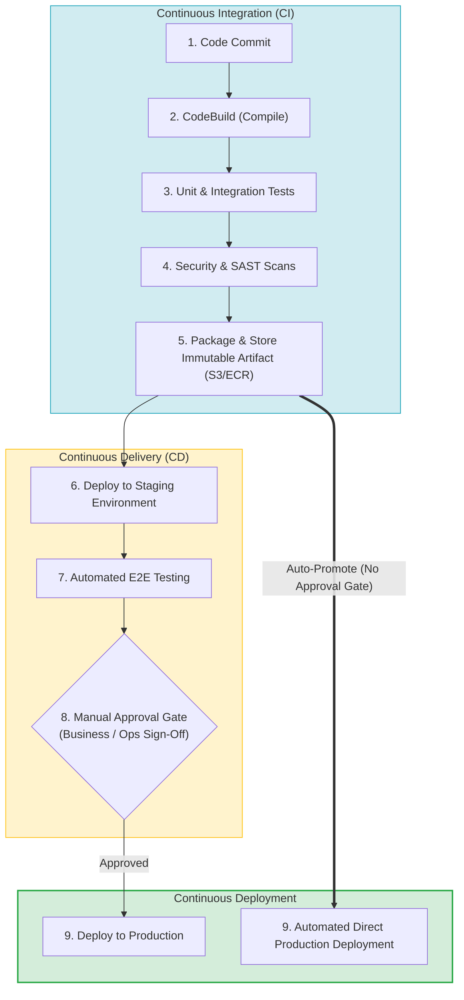
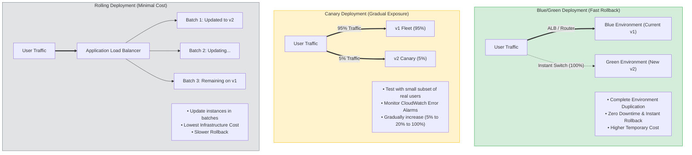
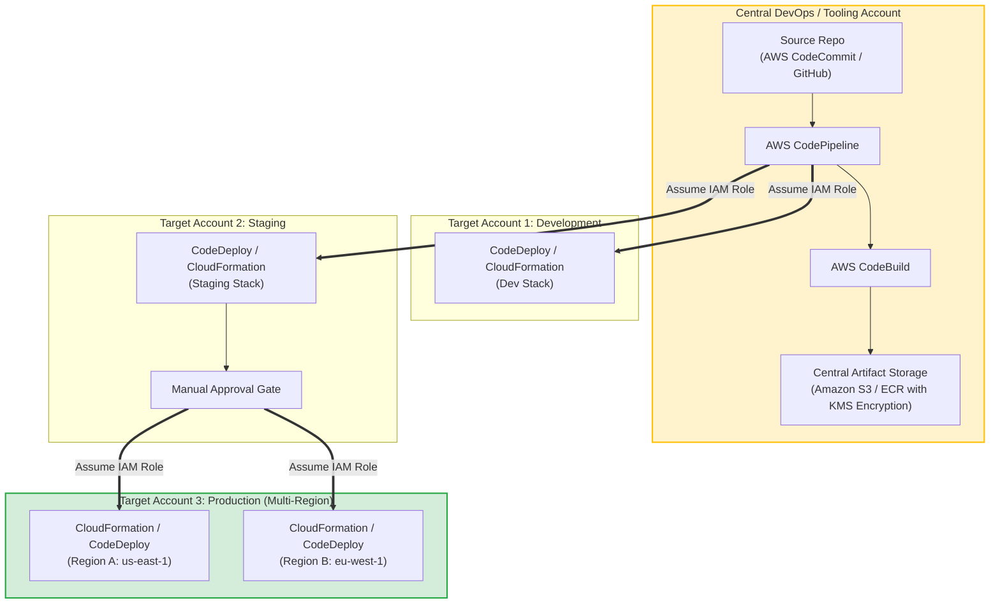

> [!NOTE]
> **Exam Mindset**: For the AWS Solutions Architect Professional (SAP-C02) and AI Practitioner (AIP-C01) exams, view **CI/CD as an overall deployment strategy**, rather than a single AWS service. The exam tests your ability to design an automated end-to-end release pipeline—selecting the optimal combination of source control, build, test, artifact storage, deployment, orchestration, rollback, and environment promotion based on business constraints, risk tolerance, and cost.

---

## 1. Why CI/CD Exists

### Manual Deployment Anti-Pattern
Without automated CI/CD pipelines, software release workflows rely on manual developer actions.

```mermaid
flowchart TD
    subgraph Manual ["Legacy Anti-Pattern: Manual Deployment Workflow"]
        Dev1["Developer"] -->|"Manual Build"| Build1["Local Workstation Build"]
        Build1 -->|"Manual FTP / SSH"| Server1["Production EC2 Server"]
        
        NoteManual["❌ Human Error & Inconsistent Environments<br/>❌ Large Batch Releases & Slow Cycle<br/>❌ Configuration Drift & High Risk Rollback"]
    end

    subgraph Automated ["Modern Architecture: AWS Automated CI/CD Pipeline"]
        Dev2["Developer"] -->|"Git Commit / Push"| Source["Source Control<br/>(GitHub / AWS CodeCommit)"]
        Source -->|"Trigger"| Pipeline["AWS CodePipeline<br/>(Orchestration Engine)"]
        
        Pipeline -->|"Build & Test"| CodeBuild["AWS CodeBuild<br/>(Ephemeral Managed Container)"]
        CodeBuild -->|"Store Artifact"| Artifacts["Artifact Storage<br/>(Amazon S3 / ECR)"]
        
        Artifacts -->|"Deploy Code"| CodeDeploy["AWS CodeDeploy / CloudFormation"]
        CodeDeploy -->|"Blue/Green or Canary"| Prod["Production Fleet<br/>(EC2 / ECS / Lambda)"]

        NoteAutomated["✅ Automated Testing & High Consistency<br/>✅ Small Frequent Releases & Auditable<br/>✅ Automated Metrics-Based Rollback"]
    end

    style Manual fill:#f8d7da,stroke:#dc3545,stroke-width:1px
    style Automated fill:#d4edda,stroke:#28a745,stroke-width:2px
    style Pipeline fill:#fff3cd,stroke:#ffc107,stroke-width:2px
```



### Consequences of Manual Deployments
- **Human Errors**: Missing files, wrong configuration parameters, or improper permissions during manual SSH file copies.
- **Slow Releases & High Risk**: Infrequent, massive "big bang" releases that make root-cause troubleshooting difficult.
- **Configuration Drift**: Environments diverge over time.
- **High Operational Effort & Audit Gaps**: No automated tracking of who deployed what code version.

> [!IMPORTANT]
> **Core SAP-C02 Goal**: CI/CD reduces deployment risk, minimizes operational effort, increases release frequency, and ensures 100% environment consistency.

---

## 2. CI vs. Continuous Delivery vs. Continuous Deployment



### Summary of Differences
1. **Continuous Integration (CI)**: Focuses on developer code integration. Automatically builds, tests, and validates code changes upon every commit to catch bugs early. Outputs an **immutable artifact**.
2. **Continuous Delivery (CD)**: Automatically prepares and deploys code artifacts to staging/testing environments. Production deployment is automated but requires an explicit **Manual Approval Gate** (e.g., business sign-off).
3. **Continuous Deployment**: Every code change that passes all automated pipeline gates is **automatically deployed directly to production** with zero human intervention.

---

## 3. The AWS CI/CD Service Chain

A complete AWS-native release pipeline maps responsibilities across specialized managed services:

```
Source ──> Build & Test ──> Artifact Storage ──> Orchestration ──> Deployment Tier ──> Production
```

| Pipeline Responsibility | AWS Native Service / Tool | External / Third-Party Options |
| :--- | :--- | :--- |
| **Source Control** | AWS CodeCommit | GitHub, GitLab, Bitbucket |
| **Build & Test Engine** | **AWS CodeBuild** | Jenkins, GitLab CI, CircleCI |
| **Artifact Storage** | **Amazon S3** (ZIP/JAR/War), **Amazon ECR** (Docker) | Nexus, JFrog Artifactory, Docker Hub |
| **Pipeline Orchestration**| **AWS CodePipeline** | Jenkins, GitHub Actions, Spinnaker |
| **Deployment Engine** | **AWS CodeDeploy**, **AWS CloudFormation** | Argo CD, Flux (EKS/Kubernetes) |
| **Infrastructure Tier** | **AWS CloudFormation**, **AWS CDK** | HashiCorp Terraform |
| **Monitoring & Alarms** | **Amazon CloudWatch**, **AWS X-Ray** | Datadog, New Relic |
| **Security & Secrets** | **AWS Secrets Manager**, **KMS**, **IAM** | HashiCorp Vault |

---

## 4. AWS CodePipeline: Orchestration Engine

**AWS CodePipeline** is a fully managed continuous delivery service that models, visualizes, and orchestrates your software release steps.

```
CodePipeline Workflow:
[ Source Stage ] ──> [ Build Stage (CodeBuild) ] ──> [ Test Stage ] ──> [ Manual Approval ] ──> [ Deploy Stage (CodeDeploy) ]
```

> [!NOTE]
> **CodePipeline Responsibility**: CodePipeline does **NOT** compile code or deploy applications directly. It acts as the workflow coordinator (*"What stage runs next?"*), calling services like CodeBuild, CodeDeploy, Lambda, or CloudFormation.

---

## 5. AWS CodeBuild: Managed Build & Test Engine

**AWS CodeBuild** provides fully managed, ephemeral build servers that scale on-demand.

### Key Characteristics
- **Zero Server Management**: No build servers or Jenkins worker nodes to patch or maintain.
- **Pay-Per-Minute**: You are billed strictly for the compute minutes consumed during build execution.
- **Containerized Environments**: Uses standard or custom Docker images containing required build tools (Node.js, Java, Python, Go, Docker CLI).

> [!TIP]
> **Exam Trigger Keyword**: *"Build and test source code without managing build servers or infrastructure"* $\longrightarrow$ **AWS CodeBuild**.

---

## 6. AWS CodeDeploy: Automated Application Deployment Engine

**AWS CodeDeploy** automates application code deployments to Amazon EC2 instances, on-premises servers, AWS Fargate/ECS containers, or AWS Lambda functions.

### Key Features
- **Deployment Patterns**: Supports In-Place deployments, Blue/Green deployments, and Canary rollouts.
- **Deployment Groups**: Targets specific fleets of instances based on EC2 tags or Auto Scaling Groups.
- **Automated Rollback**: Integrates directly with CloudWatch Alarms to automatically trigger rollbacks if error metrics spike.

---

## 7. Application Deployment Strategies Comparison



---

## 8. Deep-Dive: Blue/Green Deployments

- **Concept**: Maintain two identical environments (Blue = Live Production v1, Green = New Provisioned v2).
- **Traffic Shift**: Route 100% of production traffic to Blue. Deploy and test Green independently. Switch load balancer target group to Green.
- **Rollback Speed**: **Instant** (simply point load balancer back to Blue).
- **Trade-off**: Requires running double the infrastructure capacity during deployment (**Higher temporary cost**).

> [!IMPORTANT]
> **Exam Clue**: *"Need zero downtime and fastest possible rollback capability"* $\longrightarrow$ **Blue/Green Deployment**.

---

## 9. Deep-Dive: Canary Deployments

- **Concept**: Route a tiny percentage of production traffic (e.g., 5% or 10%) to the new version while 95% remains on the old version.
- **Validation**: Monitor CloudWatch metrics, latency, and error logs for the canary group.
- **Promotion**: If healthy, gradually ramp up traffic (e.g., 5% $\rightarrow$ 20% $\rightarrow$ 100%). If alarms fire, automatically shift traffic back to 0%.

> [!TIP]
> **Exam Clue**: *"Gradually expose new release to a small subset of real production users while monitoring error rates"* $\longrightarrow$ **Canary Deployment**.

---

## 10. Deep-Dive: Rolling Deployments

- **Concept**: Update instances in an Auto Scaling Group in sequential batches (e.g., 2 instances at a time).
- **Cost Advantage**: **Lowest infrastructure cost** (no full parallel environment required).
- **Trade-off**: Slower rollback process; old and new application versions coexist during deployment (requires backward database compatibility).

> [!NOTE]
> **Exam Clue**: *"Minimize additional infrastructure cost during application deployment"* $\longrightarrow$ **Rolling Deployment**.

---

## 11. Combining CI/CD with Infrastructure as Code (IaC)

A mature enterprise pipeline deploys **both application code AND underlying infrastructure** using IaC (CloudFormation/CDK).

```
Git Commit (App Code + CFN Template) ──> CodePipeline ──> CloudFormation (Update Stack) ──> CodeDeploy (App Update)
```

Enforces version control, drift prevention, and auditability for both software and cloud infrastructure changes.

---

## 12. CloudFormation vs. AWS CodePipeline

- **CloudFormation**: Defines and provisions *WHAT* AWS infrastructure should exist (**Provisioning Engine**).
- **CodePipeline**: Coordinates *WHEN* and *HOW* infrastructure templates and application codes pass through testing and approval gates (**Workflow Orchestrator**).

---

## 13. Container CI/CD Pipeline (ECS / ECR)

```
Developer ──> Git ──> CodePipeline ──> CodeBuild (Docker build & push) ──> Amazon ECR ──> CodeDeploy / ECS (Rolling/Blue-Green)
```

- **Amazon ECR**: Serves as the central immutable registry for container images.
- **Amazon ECS**: Runs containers and executes rolling updates or AWS CodeDeploy Blue/Green task set cutovers.

---

## 14. Serverless CI/CD Pipeline (AWS Lambda)

```
GitHub ──> CodePipeline ──> CodeBuild (Package SAM/ZIP) ──> Amazon S3 ──> CloudFormation / SAM ──> Lambda Version & Alias
```

- **Lambda Aliases**: Points `PROD` alias to version 1.
- **Traffic Shifting**: CodeDeploy gradually shifts alias traffic from version 1 to version 2 (e.g., `Linear10PercentEvery1Minute` or `Canary10Percent15Minutes`).

---

## 15. Kubernetes & EKS CI/CD (GitOps Model)

For Amazon EKS, native deployment strategies often use **GitOps** controllers (Argo CD or Flux).

```
Developer ──> Git Commit ──> ECR (Container Image) ──> GitOps Operator (Argo CD / Flux) ──> EKS Cluster State Sync
```

> [!NOTE]
> **Exam Clue**: *"Kubernetes-native declarative continuous deployment driven by Git repository state"* $\longrightarrow$ **GitOps (Argo CD / Flux)**.

---

## 16. EC2 Application CI/CD Architecture

```
Git ──> CodePipeline ──> CodeBuild (Compile JAR/ZIP) ──> Amazon S3 ──> CodeDeploy Agent ──> EC2 Auto Scaling Group
```

CodeDeploy uses the `appspec.yml` file and installed **CodeDeploy Agent** to execute lifecycle hooks (`BeforeInstall`, `ApplicationStart`, `ValidateService`) on EC2 instances.

---

## 17. Artifact Storage Best Practices

Never build source code directly inside production runtime servers. Pipelines must maintain a strict separation between **Source Code** and **Immutable Artifacts**.

```
Source Code (Git) ──> CodeBuild (Build Once) ──> Immutable Artifact (S3 / ECR) ──> Promote to Dev/Test/Prod
```

> [!IMPORTANT]
> **Build Once, Promote Everywhere**: The exact same container image or ZIP package stored in ECR/S3 is promoted through Dev, Staging, and Production environments without rebuilding.

---

## 18. Multi-Environment Promotion Strategy

```
Artifact v1.5 (S3/ECR) ──> Deploy to Dev ──> Automated Tests ──> Deploy to Staging ──> Manual Approval ──> Deploy to Prod
```

Guarantees that the artifact tested in Staging is 100% identical to the code released to Production.

---

## 19. Manual Approval Gates in CodePipeline

In Continuous Delivery pipelines, insert a **Manual Approval Stage** before the production deployment step.

```
Staging Deploy ──> Integration Tests Pass ──> [ Manual Approval Stage (SNS Notification) ] ──> Production Deploy
```

Sends an Amazon SNS notification to managers, holding the pipeline until an authorized user clicks **Approve** in CodePipeline.

---

## 20. Automated Rollback Triggered by Alarms

To eliminate human delay during production outages, integrate deployment tools with **Amazon CloudWatch Alarms**.

```
CodeDeploy Release ──> CloudWatch Alarm (5xx Errors > 1%) ──> Trigger Auto-Rollback ──> Restore Previous Healthy Version
```

If error rates, latency, or 5xx responses exceed predefined thresholds during deployment, CodeDeploy or CloudFormation automatically cancels the release and restores the previous known good state.

---

## 21. CI/CD Pipeline Observability

A production-grade pipeline integrates with monitoring services:
- **Amazon CloudWatch**: Tracks deployment duration, build failures, and application error logs.
- **AWS X-Ray**: Traces requests through microservices during canary traffic shifting.
- **AWS CloudTrail**: Records all IAM API calls executed by pipeline components for security auditing.

---

## 22. Security & Secrets Management in CI/CD

> [!WARNING]
> **Never Hardcode Credentials**: Never store database passwords, API keys, or AWS access keys in Git repositories, Dockerfiles, or build scripts.

### Security Best Practices
1. **IAM Roles**: Assign IAM Roles to CodeBuild projects and CodePipeline instances to grant temporary security credentials.
2. **AWS Secrets Manager / SSM Parameter Store**: Fetch encrypted credentials dynamically during build/deployment stages.
3. **KMS Encryption**: Encrypt S3 artifact buckets and ECR container repositories using AWS KMS keys.

---

## 23. Cross-Account CI/CD Pipeline Architecture

Enterprise environments isolate Development, Staging, and Production workloads in separate AWS Accounts.



> [!IMPORTANT]
> **Cross-Account Mechanics**: A central **Tooling/DevOps Account** hosts CodePipeline. The pipeline assumes **Cross-Account IAM Roles** in target Dev, Test, and Production accounts to execute deployments while encrypting S3/ECR artifacts with a cross-account KMS key policy.

---

## 24. Cross-Region CI/CD Deployment

For global applications operating across multiple AWS Regions:
1. Build the application code **once** in the primary region.
2. Store the compiled artifact in an S3 bucket with **S3 Cross-Region Replication (CRR)** or central ECR replication.
3. Deploy the validated artifact sequentially or in parallel across target regions (`us-east-1`, `eu-west-1`, `ap-southeast-1`).

---

## 25. Cost Perspective & Optimization

- **AWS CodePipeline**: Charged per active pipeline per month.
- **AWS CodeBuild**: Billed per build-minute based on compute instance type (`build.general.small`, `medium`, `large`).
- **Amazon S3 & ECR**: Pay for artifact and container storage plus data transfer.
- **AWS CodeDeploy & CloudFormation**: No additional service charge for deploying to EC2/ECS/Lambda.

> [!TIP]
> **TCO Exam Rule**: Do not evaluate cost based solely on AWS service fees. Factor in **engineering time saved, elimination of manual deployment errors, reduced downtime, and instant rollback capabilities**.

---

## 26. Strategy Selection: Lowest Cost vs. Fast Rollback

| Business Constraint / Requirement | Recommended Strategy | Primary Reason |
| :--- | :--- | :--- |
| **"Minimize additional infrastructure cost"** | **Rolling Deployment** | No duplicate parallel environments required |
| **"Fastest rollback & zero downtime"** | **Blue/Green Deployment** | Instant load balancer cutover back to Blue |
| **"Gradually test new code with real users"** | **Canary Deployment** | Percentage traffic shifting (e.g., 5% canary) |
| **"Global traffic shifting without DNS caching"** | **AWS Global Accelerator** | Anycast network-layer traffic switching |

---

## 27. Global Blue/Green: AWS Global Accelerator vs. Route 53

```
Problem: Route 53 Weighted DNS Routing suffers from DNS caching on client devices (TTL delays).
Solution: AWS Global Accelerator uses Static Anycast IPs to instantly shift global traffic at the network layer across endpoints without DNS caching delays.
```

> [!IMPORTANT]
> **Exam Trigger Keyword**: *"Blue/Green global traffic shifting without waiting for DNS TTL expiration or client DNS caching"* $\longrightarrow$ **AWS Global Accelerator**.

---

## 28. CI/CD vs. Deployment Strategy Concept Boundaries

- **CI/CD Pipeline**: Answers *"How do we continuously build, test, package, and orchestrate releases?"*
- **Deployment Strategy**: Answers *"How do we safely cut over network traffic to the new version?"* (Blue/Green, Canary, Rolling, All-at-once).

---

## 29. Operational Overhead Comparison Matrix

| Approach / Tool | Operational Overhead | Cost Profile | Best Use Case |
| :--- | :--- | :--- | :--- |
| **Manual Deployments** | **Extremely High** | High (Labor & Outages) | **Avoid in Production** |
| **Self-Managed Jenkins on EC2**| High (Server maintenance) | Medium (24/7 EC2 instances) | Legacy / Hybrid On-Prem |
| **AWS CodeBuild** | **Low (Fully Managed)** | Low (Pay per build-minute) | Serverless Build/Test |
| **AWS CodePipeline** | **Low (Fully Managed)** | Low ($1/active pipeline) | Native Pipeline Orchestration |
| **Blue/Green Strategy** | Medium | Higher (Duplicate capacity) | Mission-Critical / Fast Rollback |
| **Rolling Strategy** | Low | **Lowest Infrastructure Cost**| Cost-Sensitive EC2 Fleets |
| **Canary Strategy** | Medium | Depends on architecture | Risk-Averse User Testing |

---

## 30. Minimal Architecture Requirements

Always select the **simplest minimal architecture** that satisfies all explicit requirements:
- **Simple Serverless App**: Source (GitHub) $\rightarrow$ CodePipeline $\rightarrow$ CodeBuild $\rightarrow$ AWS Lambda.
- **Containerized App**: Source (GitHub) $\rightarrow$ CodePipeline $\rightarrow$ CodeBuild $\rightarrow$ Amazon ECR $\rightarrow$ Amazon ECS.
- **Infrastructure Pipeline**: Source (Git) $\rightarrow$ CodePipeline $\rightarrow$ AWS CloudFormation.

---

## 31. Ecosystem Mind Map

```
Source Control ──> Orchestration ──> Build Engine ──> Artifact Storage ──> Deployment Engine ──> Compute Target
(GitHub/CodeCommit) (CodePipeline)   (CodeBuild)     (S3 / ECR)        (CodeDeploy/CFN)   (EC2/ECS/Lambda)
```

---

## 32. Business Trade-Off Summary

```
Manual Deployments  ──> Zero Upfront Setup ──> High Recurring Labor ──> High Outage Risk
CI/CD Pipelines     ──> Upfront Engineering ──> Automated Operations ──> Low Deployment Risk
```

---

## 33. SAP-C02 & AIP-C01 Exam Keyword Mapping

| Exam Wording / Requirement | Think |
| :--- | :--- |
| `"Build and test code without managing servers"` | **AWS CodeBuild** |
| `"Orchestrate release pipeline stages"` | **AWS CodePipeline** |
| `"Deploy application code to EC2/ECS/Lambda"` | **AWS CodeDeploy** |
| `"Instant rollback and zero downtime"` | **Blue/Green Deployment** |
| `"Gradually expose release to a subset of users"` | **Canary Deployment** |
| `"Minimize infrastructure cost during update"` | **Rolling Deployment** |
| `"Store container images securely"` | **Amazon ECR** |
| `"Human sign-off before production deploy"` | **CodePipeline Manual Approval** |
| `"Automated rollback on production errors"` | **CodeDeploy + CloudWatch Alarms** |
| `"Kubernetes declarative deployment"` | **GitOps (Argo CD / Flux)** |
| `"Deploy across multiple AWS accounts"` | **Cross-Account IAM Roles + CodePipeline** |
| `"Global traffic shift without DNS caching"` | **AWS Global Accelerator** |
| `"Store secrets during build"` | **AWS Secrets Manager / SSM Parameter Store** |

---

## 34. SAP-C02 Decision Framework

```
1. What is being deployed? ─────────────> EC2, ECS, Lambda, or Infrastructure?
2. How is code compiled/built? ─────────> AWS CodeBuild (Serverless Build)
3. Where is the artifact stored? ────────> Amazon S3 (ZIP/JAR) or Amazon ECR (Docker)
4. How is the release orchestrated? ────> AWS CodePipeline
5. How is traffic shifted? ──────────────> Blue/Green (Fastest), Canary (Gradual), Rolling (Lowest Cost)
6. How is failure detected? ────────────> Amazon CloudWatch Alarms ➔ Automated Rollback
```

---

## 35. One-Line Exam Memory Rules

- **CodePipeline** = Orchestration Workflow.
- **CodeBuild** = Serverless Build & Test Compute.
- **CodeDeploy** = Automated Application Code Deployment.
- **CloudFormation** = Infrastructure Provisioning.
- **S3** = Generic Object/Artifact Storage.
- **ECR** = Container Image Storage.
- **Blue/Green** = Fastest Rollback & Zero Downtime (Higher Cost).
- **Canary** = Risk Mitigation via Gradual Percentage Exposure.
- **Rolling** = Lowest Infrastructure Overhead.
- **Global Accelerator** = Instant Global Network Cutover (Bypasses DNS Caching).
- **CloudWatch Alarms** = Deployment Health Signals & Automated Rollback Triggers.