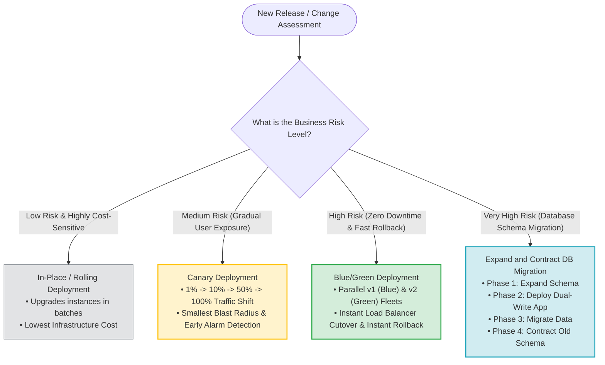
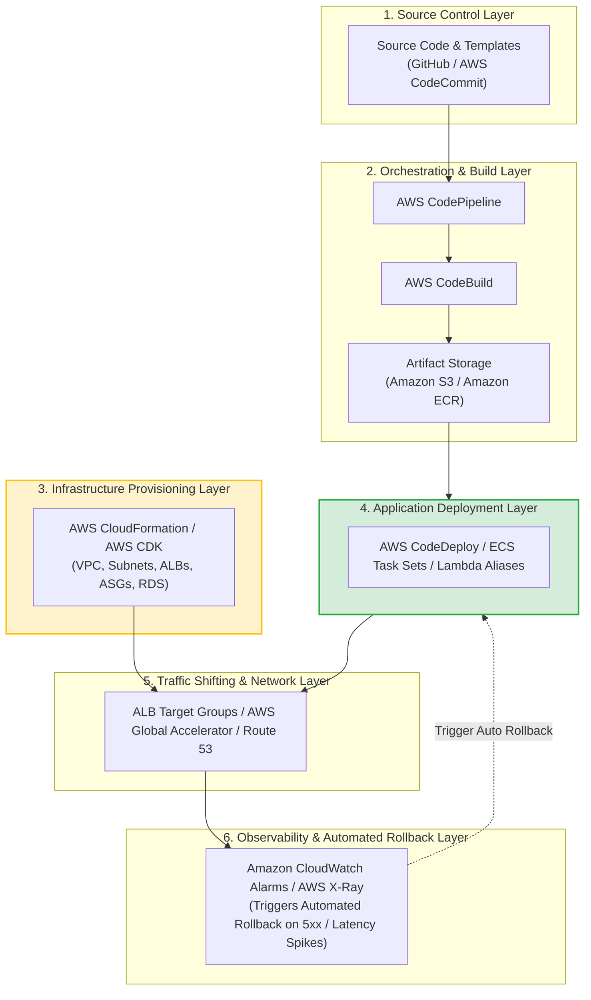
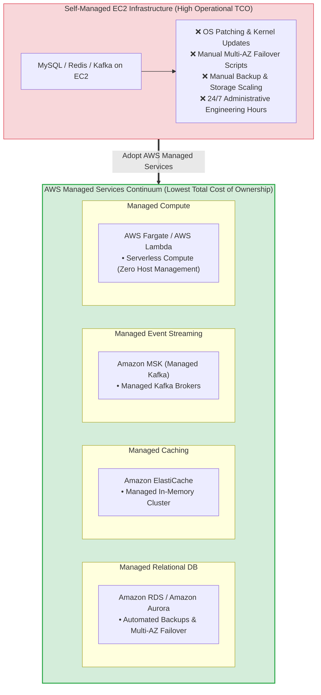
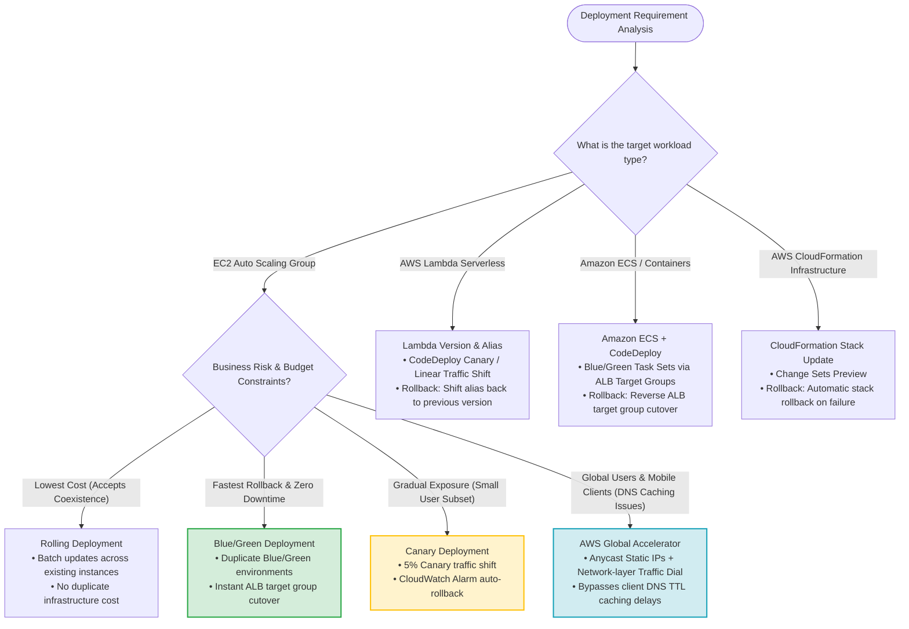

> [!NOTE]
> **Exam Mindset**: For the AWS Solutions Architect Professional (SAP-C02) and AI Practitioner (AIP-C01) exams, Task 2.1 tests your architectural decision-making rather than simple service memorization. You must design deployment strategies that balance six core business vectors: **Business Risk, Deployment Speed, Availability, Rollback Capabilities, Operational Effort, and Total Cost of Ownership (TCO)**.

---

## 1. The Four Core Architectural Decisions

Task 2.1 skills evaluate four fundamental architectural decisions:
1. **Upgrade Path**: How do I introduce new application versions or AWS services with minimal risk?
2. **Deployment & Rollback Mechanism**: How do I deploy code and automatically roll back upon failure?
3. **Infrastructure Abstraction**: What compute and infrastructure management should AWS handle for me?
4. **Managed Services Delegation**: How do I delegate operational complexity to AWS managed services to minimize TCO?

---

## 2. Skill 1: Determining Upgrade Paths for New Services and Features

### The Problem Statement
You have an active production application and must introduce a new feature, database migration, or architecture modification:
```
Current Production State ──> Staging Validation ──> Controlled Production Exposure ──> Full Production State
```



---

## 3. Deployment Strategy Comparison Matrix

| Strategy | Infrastructure Cost | Risk Level | Rollback Speed | Operational Complexity | Primary Use Case |
| :--- | :---:| :---:| :---:| :---:| :--- |
| **In-Place** | **Lowest** | High | Slower / Manual | Low | Non-critical / Dev environments |
| **Rolling** | **Low** | Medium | Slower | Medium | Cost-sensitive EC2 fleets |
| **Canary** | Medium | **Low** | Fast | Medium | User-facing apps / Risk mitigation |
| **Blue/Green** | High | **Very Low** | **Instant** | Medium | Mission-critical / Fast rollback |
| **Immutable** | Medium/High | Low | Fast | Medium | Auto Scaling Groups & AMIs |
| **Shadow** | High | **Zero Prod Impact**| N/A | High | High-risk algorithm testing |

---

## 4. Deep-Dive: In-Place Deployment

- **Concept**: Stops application services on existing servers, updates code in-place, and restarts services.
- **Advantages**: Lowest infrastructure cost; no duplicate server capacity required.
- **Disadvantages**: Potential downtime; difficult and slow rollback if the installation fails.

> [!NOTE]
> **Exam Clue**: *"Cost is the primary constraint and brief maintenance downtime is acceptable"* $\longrightarrow$ **In-Place Deployment**.

---

## 5. Deep-Dive: Rolling Deployment

- **Concept**: Replaces or updates instances in an Auto Scaling Group in sequential batches (e.g., 2 instances at a time).
- **Advantages**: Maintains application availability without doubling total server capacity.
- **Disadvantages**: Old (v1) and new (v2) application versions coexist during deployment; requires backward-compatible database schemas.

> [!TIP]
> **Exam Clue**: *"Minimize additional infrastructure costs while maintaining continuous application availability"* $\longrightarrow$ **Rolling Deployment**.

---

## 6. Deep-Dive: Canary Deployment

- **Concept**: Routes a small percentage of production traffic (e.g., 1% or 5%) to the new version while monitoring performance and error metrics.

```
Traffic Ramp: 1% ──> 10% ──> 25% ──> 50% ──> 100%
```

- **Advantages**: Minimizes blast radius; detects production anomalies early before full rollout.
- **Disadvantages**: Requires robust CloudWatch alarm monitoring and traffic routing logic.

> [!IMPORTANT]
> **Exam Clue**: *"Gradually expose a new release to a small subset of real production traffic while monitoring health metrics"* $\longrightarrow$ **Canary Deployment**.

---

## 7. Deep-Dive: Blue/Green Deployment

- **Concept**: Provisions two identical production environments (Blue = Live v1, Green = New v2). Test Green independently, then switch load balancer target groups to Green.
- **Advantages**: Instant cutover, zero downtime, and **instant rollback** (switch load balancer back to Blue).
- **Disadvantages**: Doubles temporary infrastructure cost during deployment.

> [!TIP]
> **Exam Clue**: *"Need zero downtime and fastest possible rollback capability"* $\longrightarrow$ **Blue/Green Deployment**.

---

## 8. AWS Managed Services for Blue/Green Deployments

```
EC2 Fleets          ──> AWS CodeDeploy
Amazon ECS          ──> AWS CodeDeploy Blue/Green for ECS (Task Sets)
AWS Elastic Beanstalk──> Swap Environment URLs
Traffic Routing     ──> ALB Target Groups, Amazon Route 53, AWS Global Accelerator
```

> [!IMPORTANT]
> **Global Traffic Shifting**: When client devices cache DNS records (TTL delays), **AWS Global Accelerator** shifts global traffic faster than Route 53 by using Static Anycast IPs and network-layer traffic dials.

---

## 9. AWS CodeDeploy Architecture

AWS CodeDeploy automates code deployments to EC2, ECS, or Lambda, managing instance lifecycle hooks (`BeforeInstall`, `AfterInstall`, `ApplicationStart`, `ValidateService`).

---

## 10. Automated Rollback with CodeDeploy & CloudWatch

CodeDeploy integrates directly with **Amazon CloudWatch Alarms**.

```
CodeDeploy Release ──> CloudWatch Alarm (5xx Errors > 1%) ──> Auto-Rollback ──> Restore Healthy State
```

---

## 11. Amazon ECS Deployment Strategies

ECS supports:
- **Rolling Update**: Replaces tasks gradually based on `MinimumHealthyPercent` and `MaximumPercent`.
- **Blue/Green (CodeDeploy)**: Switches traffic between two ECS Task Sets attached to separate ALB Target Groups.

---

## 12. AWS Lambda Deployment Strategies

Lambda deployments use **Lambda Aliases** and CodeDeploy traffic shifting configurations:
- **Canary10Percent5Minutes**: Routes 10% to new version, waits 5 minutes, then shifts 100%.
- **Linear10PercentEvery1Minute**: Shifts 10% every minute until 100% complete.
- **AllAtOnce**: Instant cutover to new version.

---

## 13. Lambda Aliases Mechanics

A Lambda Alias (e.g., `PROD`) acts as a pointer to a specific numeric Lambda version (`Version 10` $\rightarrow$ `Version 11`), enabling weighted traffic splitting between versions.

---

## 14. Amazon API Gateway Deployment Strategies

API Gateway supports environment **Stages** (`/dev`, `/test`, `/prod`) and **Canary Settings** to shift a percentage of execution requests to a new stage deployment.

---

## 15. Compute Platform Selection Matrix

| Compute Platform | Infrastructure Management | Deployment Mechanisms Supported | Ideal Use Case |
| :--- | :--- | :--- | :--- |
| **Amazon EC2** | High (User manages OS/ASG) | In-Place, Rolling, Blue/Green (CodeDeploy) | Custom OS / Host-level control |
| **Amazon ECS / Fargate** | Low/Zero (Containers) | Rolling, Blue/Green (CodeDeploy Task Sets) | Microservices & Containerized apps |
| **AWS Lambda** | **Zero (Serverless)** | Canary, Linear, All-at-Once (Aliases) | Event-driven / Stateless APIs |

---

## 16. Skill 2: Multi-Tiered Layered Deployment Architecture



---

## 17. AWS CodePipeline Orchestration

CodePipeline coordinates multi-stage workflows (`Source` $\rightarrow$ `Build` $\rightarrow$ `Test` $\rightarrow$ `Approval` $\rightarrow$ `Deploy` $\rightarrow$ `Validate`).

---

## 18. CloudFormation Deployment & Automated Rollback

CloudFormation manages the infrastructure layer. If a resource creation or update fails, CloudFormation automatically triggers **Stack Rollback** (`ROLLBACK_IN_PROGRESS`) to restore the previous known good state.

---

## 19. CloudFormation vs. AWS CodeDeploy Distinctions

- **AWS CloudFormation**: Provisions infrastructure resources (**VPCs, ALBs, ASGs, RDS**).
- **AWS CodeDeploy**: Deploys application binaries/code packages onto EC2, ECS, or Lambda (**Application Tier**).

---

## 20. Database Rollback Challenges

Unlike application code rollbacks (`v2` $\rightarrow$ `v1`), database schema rollbacks can cause permanent data loss if columns or tables were dropped in `v2`.

---

## 21. Database Migration Pattern: Expand and Contract

```
Phase 1 (Expand):   Add new column to database (Keep old column intact).
Phase 2 (Dual App): Deploy App v2 (Writes to BOTH old and new columns).
Phase 3 (Migrate):  Backfill historical data into new column.
Phase 4 (Contract): Update App v2 to read ONLY from new column, then drop old column later.
```

> [!IMPORTANT]
> **Exam Trigger**: *"Ensure database schema changes remain backward compatible with older application versions during deployment"* $\longrightarrow$ **Expand and Contract Pattern**.

---

## 22. Skill 3: Adopting AWS Managed Services



---

## 23. Why Managed Services Exist

Managed services eliminate "undifferentiated heavy lifting"—OS patching, hardware provisioning, cluster setup, automated backups, high availability failover, and scaling infrastructure.

---

## 24. Total Cost of Ownership (TCO) Reality

```
Raw Infrastructure Price ≠ Total Cost of Ownership (TCO)
TCO = AWS Service Fees + Engineering Labor Hours + Patching Overhead + Outage Costs
```

> [!TIP]
> **SAP Exam Rule**: Managed services (like RDS or Fargate) may carry a higher per-hour AWS rate than raw EC2 instances, but significantly lower **Total Cost of Ownership (TCO)** by eliminating administrative engineering overhead.

---

## 25. Amazon RDS / Aurora vs. Self-Managed Database on EC2

- **RDS / Aurora**: Managed backups, automatic Multi-AZ failover, automated patching, storage autoscaling.
- **EC2 Database**: Choose EC2 only when requiring unsupported database engines, custom OS-level modules, or full root file system control.

---

## 26. AWS Fargate vs. ECS on EC2

- **AWS Fargate**: Serverless container compute. No EC2 instances, cluster scaling, or AMI patching to manage.
- **ECS on EC2**: Requires managing EC2 capacity, AMI updates, and container instance packing.

---

## 27. Amazon EKS vs. Self-Managed Kubernetes

- **Amazon EKS**: AWS manages the Kubernetes Control Plane (API server, etcd, high availability).
- **Self-Managed K8s**: User must manage control plane nodes, etcd backups, and master node upgrades.

---

## 28. Amazon MSK vs. Apache Kafka on EC2

- **Amazon MSK**: Fully managed Apache Kafka brokers, zookeeper/KRaft coordination, and storage scaling.

---

## 29. Amazon ElastiCache vs. Redis on EC2

- **Amazon ElastiCache**: Managed Redis/Memcached cluster with automated failover and node monitoring.

---

## 30. Skill 4: Delegating Complex Development & Deployment Tasks to AWS

Delegating complexity means leveraging higher-level AWS abstractions (Serverless, Event-Driven, Orchestration engines) rather than building custom administrative scripts.

---

## 31. Controlling Architecture While Delegating Infrastructure

Delegating infrastructure management to AWS does **NOT** mean losing control. You retain full ownership over IAM policies, networking boundaries, scaling rules, deployment strategies, and security baselines.

---

## 32. AWS Lambda (Serverless Compute)

Eliminates server provisioning, OS patching, and capacity planning. Best for event-driven, stateless, short-lived workloads (< 15 min execution).

---

## 33. Amazon API Gateway

Eliminates custom API server fleets, providing native throttling, payload validation, IAM/Cognito auth, and stage management.

---

## 34. AWS Step Functions (Workflow Orchestration)

Replaces custom error-handling and state-tracking code with visual, serverless state machines for complex multi-service workflows.

> [!NOTE]
> **Exam Clue**: *"Coordinate multiple serverless microservices with retries, error handling, and state management"* $\longrightarrow$ **AWS Step Functions**.

---

## 35. Amazon EventBridge (Event Bus)

Provides serverless event routing between AWS services, SaaS apps, and microservices without custom polling code.

---

## 36. Amazon SQS (Message Queue)

Decouples producers and consumers, acting as a shock absorber during traffic spikes.

---

## 37. Amazon SNS (Pub/Sub Messaging)

Provides high-throughput fan-out notifications to multiple endpoints (SQS, Lambda, Email, HTTP).

---

## 38. Cost-Based Managed Service Decision Equation

$$\text{TCO} = \text{AWS Service Fee} + \text{Engineering Labor} + \text{Operations} + \text{Patching} + \text{Downtime Risk}$$

---

## 39. Avoiding Over-Engineering

Do not deploy complex managed service combinations when simple solutions exist.
- **Example**: For a static website, choose **Amazon S3 + Amazon CloudFront**, not EKS + Fargate + API Gateway.

---

## 40. Deployment Strategy Decision Tree

```
Low Risk + Cost-Sensitive ───> Rolling Deployment
Gradual Exposure ──────────────> Canary Deployment
Fast Rollback Required ─────────> Blue/Green Deployment
Infrastructure Changes ────────> AWS CloudFormation
Application Deployment ────────> AWS CodeDeploy
```

---

## 41. Rollback Decision Framework

```
Application Code ──> CodeDeploy Auto-Rollback
Infrastructure ───> CloudFormation Stack Rollback
Lambda Function ──> Alias Traffic Reversal
Containers ────────> ECS Task Set Reversal
Database Schema ───> Expand and Contract Pattern
```

---

## 42. AWS Global Accelerator vs. Amazon Route 53

- **Amazon Route 53**: DNS-based routing (subject to client DNS TTL caching delays).
- **AWS Global Accelerator**: Static Anycast IPs + network-layer traffic dials (**Instant global traffic shifting without DNS caching delays**).

---

## 43. Route 53 Weighted Routing

Useful for traffic splitting and canary testing, but client DNS caching can delay rapid traffic cutovers.

---

## 44. Deployment Strategy + Monitoring Integration

Integrate deployments with **Amazon CloudWatch Alarms** (tracking 5xx errors, latency, CPU) to trigger automatic rollbacks when health metrics breach thresholds.

---

## 45. Observability with AWS X-Ray

Traces requests through distributed microservices to validate performance during canary traffic rollouts.

---

## 46. Managed Service Decision Framework

```
1. Does an AWS managed alternative exist? (RDS, ElastiCache, MSK, Fargate)
2. Does it satisfy technical requirements?
3. Does it reduce Total Cost of Ownership (TCO)?
If YES ──> Choose the Managed Service.
```

---

## 47. Comprehensive Service Selection Matrix

| Requirement | Primary AWS Service / Feature |
| :--- | :--- |
| **Lowest deployment infrastructure cost** | **Rolling Deployment** |
| **Gradual user exposure** | **Canary Deployment** |
| **Fastest rollback & zero downtime** | **Blue/Green Deployment** |
| **Infrastructure provisioning** | **AWS CloudFormation** |
| **Application code deployment** | **AWS CodeDeploy** |
| **Pipeline release orchestration** | **AWS CodePipeline** |
| **Build & test code without servers** | **AWS CodeBuild** |
| **Serverless deployment & traffic shifting** | **AWS Lambda + Aliases + CodeDeploy** |
| **Container task set deployment** | **Amazon ECS + CodeDeploy** |
| **Global rapid traffic shift without DNS caching**| **AWS Global Accelerator** |
| **Managed Relational Database** | **Amazon RDS / Amazon Aurora** |
| **Managed Redis Cache** | **Amazon ElastiCache** |
| **Managed Kafka Streaming** | **Amazon MSK** |
| **Managed Kubernetes Control Plane** | **Amazon EKS** |
| **Managed Container Compute** | **AWS Fargate** |
| **Serverless Workflow Orchestration** | **AWS Step Functions** |
| **Event Routing & Integration** | **Amazon EventBridge** |
| **Asynchronous Message Queue** | **Amazon SQS** |
| **Pub/Sub Fan-Out Messaging** | **Amazon SNS** |

---

## 48. SAP-C02 & AIP-C01 Exam Keyword Mapping

```
"Minimize downtime & fast rollback"   ──> Blue/Green Deployment
"Gradually expose new release"        ──> Canary Deployment
"Minimize infrastructure cost"        ──> Rolling Deployment
"Automatic rollback on errors"        ──> CodeDeploy + CloudWatch Alarms
"Global rapid traffic shift"          ──> AWS Global Accelerator
"Mobile clients & DNS caching issues" ──> AWS Global Accelerator
"Minimize database administration"    ──> Amazon RDS / Amazon Aurora
"Minimize container host management"  ──> AWS Fargate
"Minimize Kubernetes control plane"   ──> Amazon EKS
"Serverless workflow state machine"   ──> AWS Step Functions
"Event-driven integration"            ──> Amazon EventBridge
"Decouple slow consumers"             ──> Amazon SQS
```

---

## 49. SAP-C02 Master Deployment Strategy & Rollback Decision Tree



---

## 50. Final Architectural Cheat Sheet

```
Business Risk Assessment ──> Select Strategy (Blue/Green, Canary, Rolling)
Infrastructure Definition──> AWS CloudFormation / AWS CDK
Pipeline Orchestration   ──> AWS CodePipeline
Build & Artifact Tier    ──> AWS CodeBuild + S3 / ECR
Compute Execution        ──> Fargate / Lambda / EC2
Managed Services         ──> RDS, ElastiCache, MSK, Step Functions, EventBridge
Observability & Recovery ──> CloudWatch Alarms ➔ Automated Rollback
```

### Core Exam Principles
1. Choose deployment strategies based on **business risk**, not technology preference.
2. Adopt **managed services** whenever they eliminate infrastructure maintenance without violating technical constraints.
3. Select the **simplest architecture** that satisfies all availability, performance, rollback, security, and cost requirements.