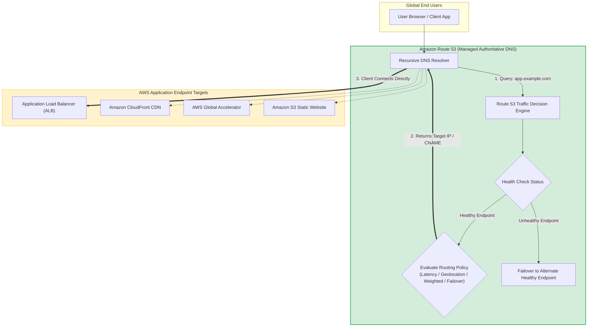
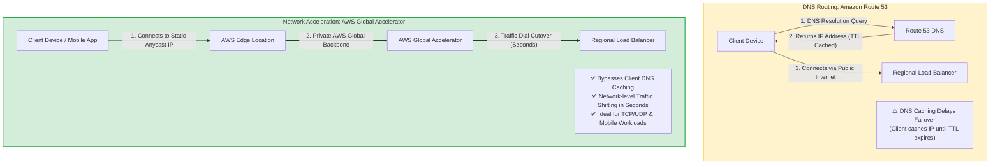
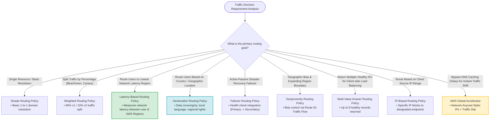

# Task 2.2: AWS Networking Concepts & Amazon Route 53 — AWS SAP-C02 & AIP-C01 Exam Guide

> [!NOTE]
> **Exam Mindset**: For the AWS Solutions Architect Professional (SAP-C02) and AI Practitioner (AIP-C01) exams, view **Amazon Route 53 as a Managed Traffic Decision Engine**. Route 53 does not directly transport application payload data; rather, it responds to DNS queries by directing client devices to the most appropriate, healthy AWS endpoint (ALB, CloudFront, S3, API Gateway, or Global Accelerator) based on business requirements.

---

## 1. Why Amazon Route 53 Exists

Amazon Route 53 is AWS's highly available, scalable Domain Name System (DNS) web service.

### Core Capabilities
- **Domain Name Resolution**: Converts human-readable domain names (`example.com`) into IP addresses.
- **Traffic Routing**: Evaluates complex routing policies to direct queries to specific endpoints.
- **Health-Based Failover**: Monitors endpoint health and automatically reroutes traffic away from failed resources.
- **Global Distribution**: Operates on a globally distributed network of DNS servers to ensure low-latency DNS resolution.
- **Domain Registration**: Allows purchasing and managing domain names directly within AWS.



---

## 2. Core Problem Solved by Route 53 in Business Continuity

Route 53 enables **automated disaster recovery** and **traffic distribution** by resolving DNS queries to healthy secondary Regions or alternate endpoints whenever primary infrastructure fails.

```
Primary Region Healthy   ──> Route 53 resolves to Primary ALB (us-east-1)
Primary Region Unhealthy ──> Route 53 Health Check triggers ──> Resolves to Secondary ALB (ap-south-1)
```

---

## 3. Operational Overhead Considerations

Amazon Route 53 is a fully managed service with 100% SLA availability.
- **AWS Manages**: Physical DNS servers, global name server redundancy, DDoS protection (AWS Shield), scaling, and infrastructure maintenance.
- **User Manages**: Hosted zones, DNS records, routing policies, health check definitions, and TTL (Time To Live) parameters.

---

## 4. When Route 53 Is NOT the Complete Solution

> [!WARNING]
> **Exam Trap**: Do **NOT** choose Route 53 weighted routing when client devices cache DNS responses (DNS TTL delays) and immediate, sub-minute traffic shifting is required. Use **AWS Global Accelerator** for instant network-layer traffic shifting.

---

## 5. Route 53 Routing Policies Overview

Route 53 supports eight distinct routing policies designed for specific architectural requirements:

```mermaid
flowchart TD
    subgraph Weighted ["Weighted Routing (Blue/Green & Canary)"]
        R_Weight["Route 53"] ==>|"90% Traffic"| Blue["Blue App v1"]
        R_Weight ==>|"10% Traffic"| Green["Green App v2"]
    end

    subgraph Latency ["Latency-Based Routing (Lowest Network Delay)"]
        R_Lat["Route 53"] ==>|"Lowest Latency (15ms)"| Reg_Mumbai["ap-south-1 (Mumbai)"]
        R_Lat ==>|"Higher Latency (180ms)"| Reg_US["us-east-1 (Virginia)"]
    end

    subgraph Geolocation ["Geolocation Routing (Data Sovereignty & Local Content)"]
        R_Geo["Route 53"] ==>|"User in EU"| Reg_EU["eu-west-1 (French Content)"]
        R_Geo ==>|"User in India"| Reg_IN["ap-south-1 (Hindi Content)"]
    end

    subgraph Failover ["Failover Routing (Active-Passive Disaster Recovery)"]
        R_Fail["Route 53"] ==>|"1. Active (Primary Healthy)"| Primary["Primary Region (us-east-1)"]
        R_Fail -.->|"2. Failover (If Primary Fails)"| Standby["DR Region (us-west-2)"]
    end

    style Weighted fill:#fff3cd,stroke:#ffc107,stroke-width:1px
    style Latency fill:#d4edda,stroke:#28a745,stroke-width:1px
    style Geolocation fill:#d1ecf1,stroke:#17a2b8,stroke-width:1px
    style Failover fill:#f8d7da,stroke:#dc3545,stroke-width:1px
```



---

## 6. Deep-Dive: Simple Routing Policy

- **Purpose**: Maps a domain to a single resource (or multiple IP addresses returned in random order).
- **Use Case**: Single static website, single Application Load Balancer.
- **Health Checks**: Does NOT support Route 53 health checks per record.

---

## 7. Deep-Dive: Weighted Routing Policy

- **Purpose**: Distributes DNS queries across multiple endpoints based on assigned relative numerical weights (e.g., Weight 90 vs. Weight 10).
- **Use Cases**: Blue/Green application deployments, Canary releases, A/B testing, gradual Regional migrations.

> [!TIP]
> **Exam Trigger**: *"Gradually transition 10% of production traffic to a new application version"* $\longrightarrow$ **Weighted Routing Policy**.

---

## 8. Deep-Dive: Latency-Based Routing Policy

- **Purpose**: Routes queries to the AWS Region that provides the **lowest network latency** for the client requesting DNS resolution.
- **Mechanism**: AWS continuously measures network latency between user networks and AWS data centers.

> [!IMPORTANT]
> **Exam Trigger**: *"Direct global users to the AWS Region offering the lowest network latency"* $\longrightarrow$ **Latency-Based Routing Policy**.

---

## 9. Latency-Based Routing vs. Geolocation Routing

| Policy | Decision Metric | Example Scenario |
| :--- | :--- | :--- |
| **Latency-Based Routing** | **Lowest network ping/latency** | Route a user in South America to `us-east-1` because network latency is lowest. |
| **Geolocation Routing** | **Physical geographic location** | Route users physically located in France to European servers for GDPR compliance. |

> [!WARNING]
> **Exam Trap**: Do **NOT** choose Geolocation routing simply because a scenario mentions "nearest Region." Choose **Latency-Based Routing** for speed/performance, and **Geolocation Routing** for country-specific content or legal data sovereignty.

---

## 10. Deep-Dive: Geolocation Routing Policy

- **Purpose**: Directs traffic based on the geographic location of the user (Continent, Country, or US State).
- **Use Cases**: Data sovereignty enforcement, localized language content, regional distribution rights, country-specific legal restrictions.

---

## 11. Deep-Dive: Geoproximity Routing Policy

- **Purpose**: Routes traffic based on the geographic location of users and AWS resources, allowing you to expand or shrink a Region's geographic reach using **Bias values**.
- **Tooling**: Requires Route 53 **Traffic Flow**.

---

## 12. Deep-Dive: Failover Routing Policy

- **Purpose**: Configures **Active-Passive Disaster Recovery** by routing traffic to a Primary endpoint when healthy, and automatically switching to a Secondary DR endpoint when the Primary fails.

```
Route 53 ──> Health Check ──> Primary (Healthy)   ──> User Traffic Served
Route 53 ──> Health Check ──> Primary (UNHEALTHY) ──> Reroutes Traffic to Secondary (DR)
```

> [!IMPORTANT]
> **Exam Trigger**: *"Configure active-passive disaster recovery with automatic failover to a secondary Region"* $\longrightarrow$ **Failover Routing Policy**.

---

## 13. Deep-Dive: Multi-Value Answer Routing Policy

- **Purpose**: Returns up to 8 healthy records in response to a DNS query.
- **Distinction**: Provides basic DNS-level client-side load balancing, but is **NOT** a substitute for an Application Load Balancer (ALB).

---

## 14. Deep-Dive: IP-Based Routing Policy

- **Purpose**: Routes DNS queries based on the client's subnet IP address (CIDR block).
- **Use Case**: Directing specific corporate client IP ranges to internal test environments.

---

## 15. Route 53 Health Checks

Route 53 health checks monitor the health of endpoints (ALBs, EC2 instances, HTTP/HTTPS URLs, or CloudWatch Alarms).
- **Integration**: Associated directly with Failover, Weighted, and Latency records to trigger automatic DNS routing changes upon endpoint failure.

---

## 16. Route 53 vs. Application Load Balancer (ALB)

- **Route 53**: Global DNS routing engine (**Decides WHICH Region or ALB to send the user to**).
- **ALB**: Regional HTTP/HTTPS load balancer (**Decides WHICH healthy EC2/ECS container instance to send traffic to**).

---

## 17. Amazon Route 53 vs. AWS Global Accelerator



| Feature | Amazon Route 53 | AWS Global Accelerator |
| :--- | :--- | :--- |
| **Protocol Layer** | Layer 7 (DNS Queries) | Layer 3/4 (Network Anycast IPs) |
| **Failover Speed** | Subject to client **DNS TTL caching delays** | **Instant (Seconds)** via Anycast network traffic dials |
| **Supported Protocols** | Domain name resolution (HTTP/HTTPS) | HTTP, HTTPS, TCP, UDP (Gaming, VoIP, IoT) |
| **Static IP Support** | Dynamic IP resolution | **Provides 2 static Anycast IP addresses** |

---

## 18. Amazon Route 53 vs. Amazon CloudFront

- **Amazon CloudFront**: Content Delivery Network (CDN) that **caches static/dynamic web content** at edge locations.
- **Amazon Route 53**: DNS service that **routes domain queries** to endpoints.

---

## 19. Amazon Route 53 vs. AWS Transit Gateway

- **AWS Transit Gateway**: Interconnects VPCs, VPNs, and Direct Connect locations at the network routing level.
- **Amazon Route 53**: Handles DNS domain resolution for internet clients and internal VPC endpoints (Private Hosted Zones).

---

## 20. Failover Performance Comparison: Route 53 vs. Global Accelerator

- Choose **Route 53 Failover** when standard DNS failover times (minutes, based on TTL) are acceptable.
- Choose **AWS Global Accelerator** when traffic must fail over in **seconds** without being affected by client DNS caching.

---

## 21. Cost Optimization & Decision Framework

Route 53 is inexpensive (charged per hosted zone and per million queries). Use Route 53 as the primary routing mechanism unless network-layer Anycast acceleration or instant traffic dials (Global Accelerator) are required.

---

## 22. Cost Decision Tree

```
Requirement ──> Can DNS TTL caching be tolerated? ──> YES ──> Route 53 (Lowest Cost)
                                                  └── NO  ──> AWS Global Accelerator
```

---

## 23. Multi-Region Resilience Architecture with Route 53

```
Global Clients ──> Route 53 Latency / Failover Policy
                        ├── Region A (Primary): ALB ──> EC2 ASG ──> Aurora Global Database (Primary)
                        └── Region B (Secondary): ALB ──> EC2 ASG ──> Aurora Global Database (Secondary)
```

---

## 24. Business Continuity Failure Domain Mapping

- **Server Component Failure**: EC2 Auto Scaling Group.
- **Data Center / AZ Failure**: Multi-AZ Deployment.
- **Regional Disaster Outage**: Route 53 Failover Policy + Multi-Region Infrastructure.
- **Global Performance & Latency**: Route 53 Latency-Based Routing / AWS Global Accelerator.

---

## 25. SAP-C02 Traffic Decision & Routing Policy Master Flowchart



---

## 26. SAP-C02 Keyword Cheat Sheet

| Exam Trigger Keyword Phrase | Target AWS Service / Policy |
| :--- | :--- |
| **"Route users to nearest Region based on network latency"** | **Latency-Based Routing Policy** |
| **"Route users based on country, language, or data sovereignty"**| **Geolocation Routing Policy** |
| **"Active-passive disaster recovery failover"** | **Failover Routing Policy** |
| **"Gradually shift percentage of traffic (Canary / Blue-Green)"** | **Weighted Routing Policy** |
| **"Bypass DNS TTL caching delays for instant traffic shifting"** | **AWS Global Accelerator** |
| **"Static Anycast IP addresses for global application"** | **AWS Global Accelerator** |
| **"Cache static web content at global edge locations"** | **Amazon CloudFront** |
| **"Interconnect multiple VPCs and on-premises networks"** | **AWS Transit Gateway** |
| **"Return up to 8 healthy IP addresses for DNS load balancing"**| **Multi-Value Answer Routing Policy** |

---

## 27. Common SAP-C02 Exam Traps

1. **Trap 1: Choosing Geolocation instead of Latency**: Scenario asks for *"lowest network delay for global users"*. Wrong: Geolocation. **Correct: Latency-Based Routing**.
2. **Trap 2: Choosing Route 53 Weighted Routing when DNS Caching is an Issue**: Scenario mentions *"mobile clients and DNS caching prevent fast failover"*. Wrong: Route 53. **Correct: AWS Global Accelerator**.
3. **Trap 3: Choosing Route 53 for Static Content Caching**: Scenario asks to *"cache images globally"*. Wrong: Route 53. **Correct: Amazon CloudFront**.
4. **Trap 4: Choosing Route 53 for VPC Interconnection**: Scenario asks to *"connect 10 VPCs and on-prem VPN"*. Wrong: Route 53. **Correct: AWS Transit Gateway**.

---

## 28. The Core SAP-C02 Mental Model

```
DNS Query Resolution ─────────> Amazon Route 53
Split Traffic Percentages ─────> Weighted Routing Policy
Lowest Network Latency ────────> Latency-Based Routing Policy
Country / Data Sovereignty ────> Geolocation Routing Policy
Active-Passive Failover ───────> Failover Routing Policy
DNS Caching Workaround ────────> AWS Global Accelerator
Edge Content Caching ──────────> Amazon CloudFront
VPC Infrastructure Mesh ───────> AWS Transit Gateway
```

### Core Exam Principle
Do not choose a routing policy simply because an application is global. Choose it based on the exact **routing decision metric** (latency, country, failover, percentage, or network Anycast) required by the business.