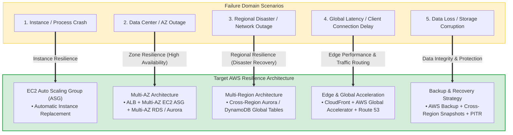
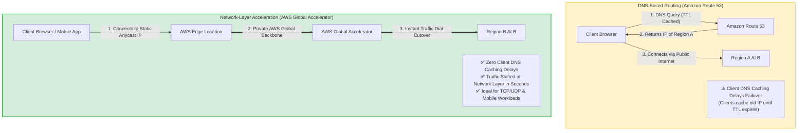
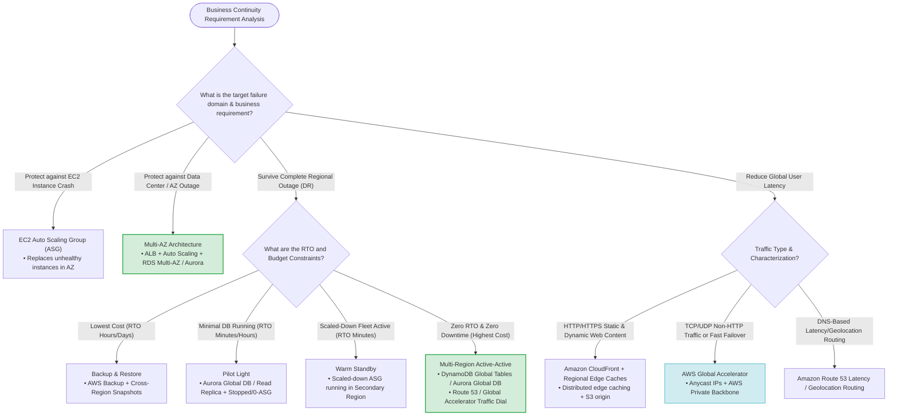

> [!NOTE]
> **Exam Mindset**: For the AWS Solutions Architect Professional (SAP-C02) and AI Practitioner (AIP-C01) exams, view **AWS Global Infrastructure** as the fundamental building block for **High Availability (HA)**, **Disaster Recovery (DR)**, **Latency Reduction**, and **Global Business Continuity**. You must evaluate workloads across failure domains (Instance $\rightarrow$ AZ $\rightarrow$ Region $\rightarrow$ Global Edge) and choose the smallest architecture that meets RTO, RPO, and availability SLAs at the lowest cost.

---

## 1. Why AWS Global Infrastructure Exists

AWS Global Infrastructure provides geographically distributed data centers and edge locations so applications never depend on a single physical location.

### Core Building Blocks
- **AWS Regions**: Separate physical geographic areas containing multiple isolated Availability Zones (e.g., `us-east-1`, `ap-south-1`).
- **Availability Zones (AZs)**: Isolated locations within a Region, equipped with independent power, cooling, and physical security (e.g., `ap-south-1a`, `ap-south-1b`).
- **Edge Locations & Regional Edge Caches**: Global Points of Presence (PoPs) that cache content and terminate user network connections close to end-users.



---

## 2. Core Problems Solved by Global Infrastructure

| Business Requirement | Target AWS Infrastructure Concept | Key AWS Services |
| :--- | :--- | :--- |
| **Protect against server instance failure** | Auto Scaling in single/multiple subnets | EC2 Auto Scaling |
| **Protect against AZ failure** | Multi-AZ Deployment | ALB + Multi-AZ ASG + RDS Multi-AZ |
| **Protect against complete Region outage** | Multi-Region Architecture | Route 53 + Aurora Global DB / DynamoDB Global Tables |
| **Reduce global user latency** | Edge Locations & Points of Presence | Amazon CloudFront + Regional Edge Caches |
| **Accelerate non-HTTP TCP/UDP traffic** | Network-layer Anycast routing | AWS Global Accelerator |
| **Global DNS traffic management** | Latency / Geolocation DNS Routing | Amazon Route 53 |
| **Data loss protection & point-in-time recovery**| Cross-Region replication & automated backups | AWS Backup + S3 CRR + RDS Snapshots |

> [!IMPORTANT]
> **High Availability vs. Disaster Recovery**:
> - **High Availability (HA)**: Protects against localized component or AZ failures within a single Region (**Multi-AZ**).
> - **Disaster Recovery (DR)**: Protects against widespread catastrophic Regional outages (**Multi-Region**).

---

## 3. AWS Regions

An AWS Region is a separate physical geographic area containing multiple isolated Availability Zones.

### Why Use Multiple Regions?
- **Regional Disaster Protection**: Survive a catastrophic blackout or outage affecting an entire AWS Region.
- **Global User Proximity**: Serve users across multiple continents with low network latency.
- **Data Sovereignty & Compliance**: Store data in specific legal jurisdictions (e.g., GDPR in Europe).

> [!NOTE]
> **Exam Trigger Keywords**: *"Business continuity during an entire AWS Region outage"*, *"RTO less than 1 hour globally"*, *"Data sovereignty compliance"* $\longrightarrow$ **Multi-Region Architecture**.

---

## 4. Availability Zones (AZs)

An Availability Zone consists of one or more discrete data centers with redundant power, networking, and connectivity in an AWS Region.

### Multi-AZ Best Practices
Deploying across multiple AZs provides:
- **Fault Tolerance**: Automatic instance replacement if an AZ experiences power or connectivity loss.
- **Synchronous Database Replication**: Low-latency synchronous replication for RDS Multi-AZ and Aurora instances.

> [!TIP]
> **Exam Clue**: *"Application must remain highly available if an Availability Zone fails"* $\longrightarrow$ **Multi-AZ Architecture** (ALB + ASG across AZs + RDS Multi-AZ).

---

## 5. Multi-AZ vs. Multi-Region Comparison

| Feature / Metric | Multi-AZ Architecture | Multi-Region Architecture |
| :--- | :--- | :--- |
| **Primary Scope** | Localized data center / AZ failure | Widespread Regional disaster |
| **Target Objective** | **High Availability (HA)** | **Disaster Recovery (DR)** & Global Low Latency |
| **Database Replication** | **Synchronous** (Zero RPO within Region) | **Asynchronous** (Near-zero RPO cross-Region) |
| **Cost & Complexity** | Moderate cost & low operational overhead | Higher cost & complex cross-Region routing/data sync |
| **Failover Mechanism** | Automatic via ALB & RDS failover | Route 53 DNS Failover / Global Accelerator Traffic Dial |

---

## 6. Edge Locations

Edge Locations are global Points of Presence (PoPs) used by services like **Amazon CloudFront** to cache static and dynamic content close to end users.

```
User (India) ──> CloudFront Edge Location (India) ──> Regional Edge Cache ──> S3 Origin (US)
```

> [!TIP]
> **Exam Trigger**: *"Reduce latency for global users downloading static images and video content"* $\longrightarrow$ **Amazon CloudFront**.

---

## 7. Regional Edge Caches

Regional Edge Caches sit between CloudFront Edge Locations and the origin server. They maintain larger cache footprints to cache less frequently requested content, reducing direct origin hits.

---

## 8. AWS Global Accelerator

**AWS Global Accelerator** uses AWS’s global network backbone to route user traffic over Anycast static IP addresses to optimal Regional endpoints (ALB, NLB, EC2).

```
User ──> Static Anycast IPs ──> AWS Global Backbone ──> AWS Global Accelerator ──> Regional ALB
```

### Key Capabilities
- **Bypasses Client DNS Caching**: Shifting traffic at the network layer in seconds.
- **TCP/UDP Acceleration**: Accelerates non-HTTP protocols (gaming, VoIP, IoT).
- **Blue/Green & DR Traffic Shifting**: Uses traffic dials and endpoint weights for instant cross-Region failover.

---

## 9. Amazon Route 53 vs. AWS Global Accelerator



| Feature | Amazon Route 53 | AWS Global Accelerator |
| :--- | :--- | :--- |
| **Service Layer** | **DNS-based Routing** (Layer 7 DNS) | **Network-layer Routing** (Layer 3/4 Anycast IP) |
| **Client Caching Impact** | Subject to client **DNS TTL caching delays** | **No DNS caching impact** (Instant traffic shifting) |
| **Supported Protocols** | Domain name queries (HTTP/HTTPS) | HTTP/HTTPS, TCP, UDP, non-web protocols |
| **Static IP Requirement** | Dynamic IP resolution | **Provides 2 static Anycast IP addresses** |
| **Use Case** | Domain registration, Latency/Geo DNS routing | Rapid cross-Region failover, gaming, mobile apps |

---

## 10. Multi-Layered Business Continuity Framework

```
Layer 1 (Instance Level):  Auto Scaling Group (Replaces dead EC2 instances)
Layer 2 (AZ Level):        Multi-AZ Deployment (Survives single AZ outage)
Layer 3 (Regional Level):  Multi-Region DR (Survives Regional outage)
Layer 4 (Network Level):   Route 53 / Global Accelerator / CloudFront (Global routing)
Layer 5 (Data Level):      AWS Backup + Cross-Region Replication + PITR
```

---

## 11. Operational Overhead Considerations

AWS manages physical data centers, power, cooling, hardware maintenance, and global fiber backbones. Architecting on AWS shifts your responsibility to selecting Regions, AZs, replication rules, and failover automation.

---

## 12. Avoiding Over-Provisioning (Is Multi-Region Mandatory?)

> [!WARNING]
> **Exam Trap**: Do **NOT** automatically choose Multi-Region active-active for every scenario. Always select the simplest architecture satisfying the failure requirement.
> - If requirement is *"Survive an EC2 instance crash"* $\rightarrow$ **Auto Scaling Group**.
> - If requirement is *"Survive an AZ outage"* $\rightarrow$ **Multi-AZ**.
> - If requirement is *"Survive a Regional disaster"* $\rightarrow$ **Multi-Region DR**.

---

## 13. Cost Hierarchy of Availability & DR Strategies

```
Lowest Cost:   Single AZ 
               │
               ▼
               Multi-AZ (Single Region)
               │
               ▼
               Multi-Region Backup & Restore
               │
               ▼
               Multi-Region Pilot Light
               │
               ▼
               Multi-Region Warm Standby
               │
               ▼
Highest Cost:  Multi-Region Active-Active
```

---

## 14. Multi-Region Disaster Recovery Strategies Spectrum

```mermaid
flowchart TD
    subgraph Spectrum ["AWS Disaster Recovery Strategies (Lowest Cost to Highest Availability)"]
        DR1["1. Backup & Restore<br/>• RTO: Hours to Days<br/>• RPO: Hours<br/>• Infrastructure Cost: Lowest ($)"]
        DR2["2. Pilot Light<br/>• RTO: Minutes to Hours<br/>• RPO: Minutes<br/>• Core DB active, Compute scaled to 0 ($$)"]
        DR3["3. Warm Standby<br/>• RTO: Minutes<br/>• RPO: Seconds to Minutes<br/>• Scaled-down fleet running in DR Region ($$$)"]
        DR4["4. Multi-Region Active-Active<br/>• RTO: Near Zero (Seconds)<br/>• RPO: Near Zero<br/>• Full application active in multiple Regions ($$$$)"]
    end

    DR1 ==>|"Decrease RTO/RPO (Increase Capacity)"| DR2
    DR2 ==>|"Decrease RTO/RPO (Increase Active Compute)"| DR3
    DR3 ==>|"Decrease RTO/RPO (Full Active Replication)"| DR4

    style DR4 fill:#d4edda,stroke:#28a745,stroke-width:2px
    style DR3 fill:#fff3cd,stroke:#ffc107,stroke-width:1px
    style DR2 fill:#d1ecf1,stroke:#17a2b8,stroke-width:1px
    style DR1 fill:#e2e3e5,stroke:#6c757d,stroke-width:1px
```



### Strategy Breakdown
1. **Backup & Restore**: Backups stored in primary Region and replicated to DR Region. Compute provisioned only after disaster strikes. (Lowest cost, highest RTO).
2. **Pilot Light**: Core database is running and replicating in DR Region (`Aurora Global Database` / `RDS Read Replica`). Compute instances are turned off or scaled to 0 until disaster strikes.
3. **Warm Standby**: A fully functional, scaled-down version of the application runs continuously in the DR Region. Upon disaster, ASG scales up compute capacity.
4. **Active-Active**: Full production capacity runs in multiple AWS Regions simultaneously, actively serving live traffic with `DynamoDB Global Tables` or `Aurora Global Database`.

---

## 15. AWS Disaster Recovery Services & Features Matrix

| Service / Feature | DR Capabilities | Target Use Case |
| :--- | :--- | :--- |
| **AWS Backup** | Centralized, automated cross-Region backup policies | EBS, RDS, DynamoDB, EFS backups |
| **Amazon S3 Cross-Region Replication (CRR)** | Asynchronous object replication to another Region | S3 bucket disaster recovery |
| **Amazon Aurora Global Database** | Low-latency cross-Region replication (< 1s RPO, < 1 min RTO) | High-performance relational DB DR |
| **Amazon DynamoDB Global Tables** | Multi-Region active-active fully managed NoSQL DB | Global active-active data layer |
| **RDS Cross-Region Read Replicas** | Asynchronous Read Replicas in secondary Region | Relational DB DR / Read scaling |
| **Amazon ElastiCache Global Datastore** | Cross-Region Redis replication | Cross-Region caching tier |

---

## 16. Trade-Off Analysis: Multi-AZ vs. Multi-Region vs. Active-Active

| Strategy | Advantages | Trade-offs & Challenges |
| :--- | :--- | :--- |
| **Multi-AZ** | High Availability, automatic failover, low cost | Single Region failure risk |
| **Multi-Region Active-Passive** | Regional disaster recovery, low active compute costs | Failover DNS/routing delay, asynchronous data replication gap |
| **Multi-Region Active-Active** | Zero RTO, global low latency, maximum resilience | Highest cost, complex multi-master data write conflicts |

---

## 17. Multi-Region Component Orchestration

A resilient multi-region application requires orchestrating all layers:
```
Route 53 / Global Accelerator (Global Routing)
       │
       ├── Region A: ALB ──> EC2 ASG ──> Aurora Global Database (Primary)
       │                                         │ (Async Replication < 1s)
       └── Region B: ALB ──> EC2 ASG ──> Aurora Global Database (Secondary)
```

---

## 18. SAP-C02 Business Continuity Master Decision Tree



---

## 19. SAP-C02 & AIP-C01 Keyword Cheat Sheet

| Exam Keyword / Scenario Phrase | Target AWS Service / Architecture |
| :--- | :--- |
| **"Availability Zone failure protection"** | **Multi-AZ Architecture** |
| **"Survive complete AWS Region outage"** | **Multi-Region Architecture** |
| **"Reduce global user latency for static content"** | **Amazon CloudFront + Amazon S3** |
| **"Bypass DNS caching & rapid traffic shifting"** | **AWS Global Accelerator** |
| **"Static Anycast IP requirement"** | **AWS Global Accelerator** |
| **"Route users to nearest Region based on latency"**| **Amazon Route 53 Latency-Based Routing** |
| **"Route users based on physical location"** | **Amazon Route 53 Geolocation Routing** |
| **"Global relational database with < 1s replication"**| **Amazon Aurora Global Database** |
| **"Global NoSQL active-active multi-Region writes"** | **Amazon DynamoDB Global Tables** |
| **"Lowest cost disaster recovery strategy"** | **Backup & Restore (AWS Backup)** |
| **"Minimal database active, compute scaled to 0"** | **Pilot Light** |
| **"Scaled-down infrastructure running continuously"**| **Warm Standby** |
| **"Active traffic served simultaneously from 2 Regions"**| **Multi-Region Active-Active** |

---

## 20. The Core SAP-C02 Mental Model

```
Instance Failure   ──> EC2 Auto Scaling Group
AZ Outage          ──> Multi-AZ Deployment (ALB + ASG + RDS Multi-AZ)
Region Outage      ──> Multi-Region DR (Aurora Global DB / DynamoDB Global Tables)
Global Edge        ──> Amazon CloudFront (Static/Dynamic Content)
Fast Traffic Dial  ──> AWS Global Accelerator (Anycast Network-layer Cutover)
DNS Routing        ──> Amazon Route 53 (Latency / Geolocation / Failover)
Lowest DR Cost     ──> Backup & Restore
Lowest RTO / Zero  ──> Multi-Region Active-Active
```

### Core Exam Principle
Start with the business requirement, identify the failure domain, determine the required RTO/RPO and latency tolerances, then select the **smallest AWS architecture that satisfies those requirements at the lowest cost**.