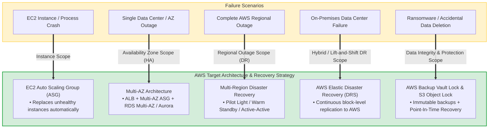
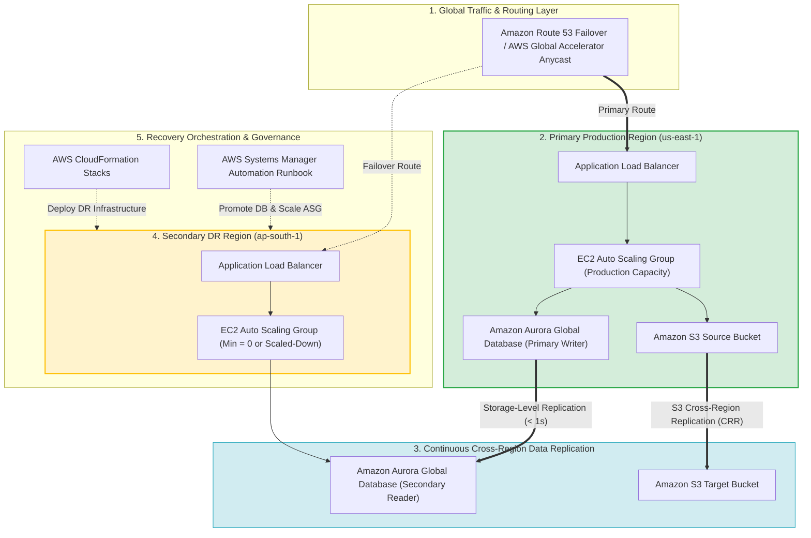
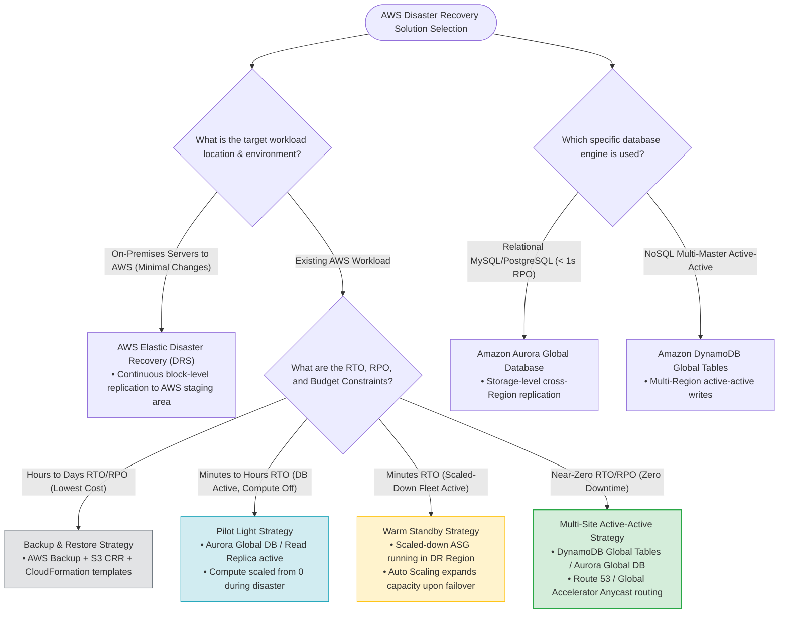

# Task 2.2: Disaster Recovery Solutions on AWS — AWS SAP-C02 & AIP-C01 Exam Guide

> [!NOTE]
> **Exam Mindset**: For the AWS Solutions Architect Professional (SAP-C02) and AI Practitioner (AIP-C01) exams, **Disaster Recovery (DR) solutions on AWS** require designing resilient architectures for different failure scopes and business requirements. The exam tests your ability to translate: **Business Requirement $\rightarrow$ Failure Scenario $\rightarrow$ RTO/RPO $\rightarrow$ DR Strategy $\rightarrow$ AWS Services $\rightarrow$ Total Cost of Ownership (TCO)**.

---

## 1. Understanding What Disaster Recovery Solves

Disaster Recovery protects application workloads when a primary environment becomes unavailable due to catastrophic outages or human errors.

### Failure Scenarios Solved by DR
- **Infrastructure Failures**: EC2 instance crash, EBS volume failure, AZ outage, network disconnects.
- **Data & Application Outages**: Database corruption, accidental deletion, ransomware attack.
- **Scope & Regional Outages**: Complete AWS Region outage, on-premises data center failure.



---

## 2. High Availability (HA) vs. Disaster Recovery (DR)

```mermaid
flowchart TD
    subgraph HA ["High Availability (HA): Single Region / Multi-AZ"]
        ALB_HA["Application Load Balancer"] --> ASG_A["EC2 Instance (AZ 1)"]
        ALB_HA --> ASG_B["EC2 Instance (AZ 2)"]
        ASG_A --> RDS_Primary["RDS Primary DB (AZ 1)"]
        RDS_Primary ==>|"Synchronous Replication"| RDS_Standby["RDS Standby DB (AZ 2)"]

        NoteHA["✅ Protects against single AZ / server failures<br/>❌ Vulnerable to complete AWS Region outages"]
    end

    subgraph DR ["Disaster Recovery (DR): Multi-Region Cross-Region Architecture"]
        R53["Amazon Route 53 / AWS Global Accelerator"] ==>|"Primary Route"| ALB_Primary["Primary Region ALB (us-east-1)"]
        R53 -.->|"Failover Route"| ALB_DR["DR Region ALB (ap-south-1)"]

        ALB_Primary --> Fleet_Primary["Primary Compute Fleet"]
        ALB_DR --> Fleet_DR["DR Compute Fleet (Pilot Light / Warm Standby)"]

        Fleet_Primary --> Aurora_Primary["Aurora Global DB Primary"]
        Aurora_Primary ==>|"Asynchronous Storage Replication (< 1s RPO)"| Aurora_Secondary["Aurora Global DB Secondary"]

        NoteDR["✅ Protects against catastrophic Region-wide outages<br/>✅ Enables global business continuity"]
    end

    style HA fill:#fff3cd,stroke:#ffc107,stroke-width:1px
    style DR fill:#d4edda,stroke:#28a745,stroke-width:2px
```



- **High Availability (HA)**: Minimizes downtime during routine component or AZ failures (**Multi-AZ within a single Region**).
- **Disaster Recovery (DR)**: Restores operations after catastrophic Regional or datacenter failures (**Multi-Region Cross-Region Architecture**).

> [!IMPORTANT]
> **Exam Trap**: Multi-AZ provides High Availability within a Region, but is **NOT** a cross-Region DR solution.

---

## 3. The AWS DR Strategy Hierarchy

```
Backup & Restore (Lowest Cost / Highest RTO)
  └── Pilot Light (Low Cost / Lower RTO)
       └── Warm Standby (Medium Cost / Low RTO)
            └── Multi-Site Active-Active (Highest Cost / Lowest RTO)
```

As you move down the hierarchy:
- **RTO & RPO Decrease** (Faster recovery, minimal data loss).
- **Infrastructure Cost & Operational Complexity Increase**.

---

## 4. Deep-Dive: Backup and Restore

- **Architecture**: Backups stored in primary Region and copied to Amazon S3 / AWS Backup vault in secondary Region. Compute infrastructure is provisioned on-demand after a disaster.
- **RTO**: Hours to Days.
- **RPO**: Hours to 24 Hours.
- **Cost**: **Lowest**.
- **Key Services**: AWS Backup, Amazon S3, EBS Snapshots, RDS Snapshots, AWS CloudFormation.

> [!NOTE]
> **Exam Trigger**: *"Lowest cost DR option where hours of downtime are acceptable"* $\longrightarrow$ **Backup and Restore**.

---

## 5. Deep-Dive: Pilot Light

- **Architecture**: Database runs continuously in secondary DR Region with continuous replication (`Aurora Global Database` / `RDS Read Replica`). Compute application infrastructure is kept off or scaled to zero (`ASG Min Size = 0`).
- **Failover Workflow**: Disaster occurs $\rightarrow$ Promote DR database replica to master $\rightarrow$ Provision/scale up EC2 ASG via CloudFormation $\rightarrow$ Route traffic via Route 53.
- **RTO**: Minutes to Hours.
- **RPO**: Minutes or less.
- **Cost**: Low to Medium.

> [!TIP]
> **Exam Trigger**: *"Database continuously replicated to secondary Region, but compute servers are provisioned during disaster"* $\longrightarrow$ **Pilot Light**.

---

## 6. Deep-Dive: Warm Standby

- **Architecture**: A fully functional, scaled-down version of the production environment runs continuously in the secondary DR Region.
- **Failover Workflow**: Disaster occurs $\rightarrow$ DR Region Auto Scaling Group scales out from reduced capacity to full production capacity $\rightarrow$ Traffic shifts immediately.
- **RTO**: Minutes.
- **RPO**: Seconds to Minutes.
- **Cost**: Medium to High.

> [!IMPORTANT]
> **Exam Trigger**: *"Maintain a scaled-down copy of production running in a secondary Region ready to take traffic immediately"* $\longrightarrow$ **Warm Standby**.

---

## 7. Deep-Dive: Multi-Site Active-Active

- **Architecture**: Full production capacity runs simultaneously across multiple AWS Regions, actively serving live user traffic.



- **RTO**: **Near Zero (Seconds)**.
- **RPO**: **Near Zero**.
- **Cost**: **Highest**.

---

## 8. AWS Elastic Disaster Recovery (DRS)

**AWS Elastic Disaster Recovery (DRS)** provides continuous block-level replication of physical, virtual, or cloud servers into a low-cost staging area in AWS.

```
On-Premises / EC2 Server ──> DRS Agent ──> Block Replication ──> AWS Staging Area ──> On-Demand Instance Launch
```

> [!TIP]
> **Exam Trigger**: *"Replicate on-premises servers to AWS with low RTO/RPO and minimal application modifications"* $\longrightarrow$ **AWS Elastic Disaster Recovery (DRS)**.

---

## 9. Amazon Aurora Global Database

- **Capabilities**: Storage-level cross-Region replication with replication latency under 1 second.
- **Failover**: Secondary Region can be promoted to full read/write workload in **less than 1 minute**.

---

## 10. Amazon DynamoDB Global Tables

- **Capabilities**: Fully managed multi-Region active-active NoSQL database.
- **Use Case**: Enables local read and write operations across multiple Regions with automatic data synchronization.

---

## 11. Amazon S3 Cross-Region Replication (CRR)

- **Capabilities**: Asynchronously replicates S3 objects across buckets in different AWS Regions for disaster recovery and compliance.

---

## 12. AWS Backup

Centralizes and automates backup policies across AWS services (EBS, RDS, DynamoDB, EFS, S3), enforcing retention rules and cross-Region vault copies.

---

## 13. Amazon Route 53 for DR Routing

Provides DNS-level **Failover Routing Policies** coupled with health checks to route domain traffic to a secondary DR Region when the primary endpoint fails.

---

## 14. AWS Global Accelerator for DR Routing

Uses static Anycast IP addresses to route traffic over the AWS global network backbone, enabling **instant cross-Region traffic dials** without DNS caching delays.

---

## 15. Amazon CloudFront Origin Failover

CloudFront automatically shifts requests to a secondary origin (e.g., secondary S3 bucket or ALB) when the primary origin returns HTTP 5xx error codes.

---

## 16. AWS CloudFormation & Infrastructure as Code (IaC)

Using IaC templates ensures that DR environments in secondary Regions are created consistently and rapidly, minimizing RTO during Backup & Restore or Pilot Light recoveries.

---

## 17. AWS Systems Manager Automation for Recovery Orchestration

SSM Automation Runbooks execute failover steps automatically (database promotion, parameter updates, scaling target ASGs), eliminating manual operational recovery errors.

---

## 18. CI/CD Pipeline Synchronization across DR Regions

Release pipelines (AWS CodePipeline, AWS CodeBuild, Amazon ECR) must publish application artifacts to both primary and DR Regions simultaneously to avoid version mismatch during recovery.

---

## 19. Multi-Region DR Networking Architecture

Multi-Region DR connectivity relies on **AWS Transit Gateway**, **AWS Direct Connect**, **AWS Site-to-Site VPN**, and **VPC Peering** to maintain secure hybrid and inter-Region data flows.

---

## 20. Security & Governance Control Parity in DR

DR environments must replicate all security controls: IAM Roles, KMS Keys, Secrets Manager parameters, WAF rules, Security Groups, and CloudTrail auditing.

---

## 21. Monitoring & Automated Failover Integration

```
CloudWatch Alarm / Health Check ──> EventBridge Rule ──> SSM Automation / Lambda ──> Reroute Traffic & Scale DR
```

---

## 22. Disaster Recovery Cost Matrix

| DR Strategy | Standby Compute Cost | Data Transfer & Storage Cost | Relative TCO |
| :--- | :--- | :--- | :--- |
| **Backup & Restore** | None ($0) | Backup storage & copy fees | **Lowest** |
| **Pilot Light** | Minimal (DB Replica only) | Continuous DB replication | **Low** |
| **Warm Standby** | Medium (Scaled-down fleet) | DB replication & active compute | **Medium / High** |
| **Multi-Site Active-Active**| Full (100% capacity in all Regions)| Multi-Region continuous sync | **Highest** |

---

## 23. Avoiding Unnecessary Multi-Site Deployments

Do **NOT** select Multi-Site Active-Active simply because a scenario mentions "high availability." Select the smallest architecture that satisfies the specific RTO and RPO requirements.

---

## 24. SAP-C02 Complete DR Solution Decision Chain & Keyword Map



---

## 25. SAP-C02 Common DR Exam Traps

1. **Trap 1: Multi-AZ is NOT Cross-Region DR**: Multi-AZ provides HA within a Region, but fails during an entire Region outage.
2. **Trap 2: SLA % does NOT force Active-Active**: Evaluate RTO/RPO explicitly before choosing expensive Multi-Site architectures.
3. **Trap 3: Pilot Light vs. Warm Standby**: In Pilot Light, compute is off/0; in Warm Standby, a scaled-down fleet is running.
4. **Trap 4: Lift-and-Shift On-Premises DR**: Use **AWS Elastic Disaster Recovery (DRS)** for block-level replication with zero code modifications.

---

## 26. Exam Keyword Cheat Sheet

| Exam Wording | Target AWS Service / Strategy |
| :--- | :--- |
| **"Lowest cost DR / Hours of downtime acceptable"** | **Backup & Restore** |
| **"Database continuously replicated, compute off"** | **Pilot Light** |
| **"Scaled-down copy of production running"** | **Warm Standby** |
| **"Both Regions actively serving traffic"** | **Multi-Site Active-Active** |
| **"Replicate on-premises servers to AWS"** | **AWS Elastic Disaster Recovery (DRS)** |
| **"Global relational database with < 1s replication"** | **Amazon Aurora Global Database** |
| **"Global NoSQL active-active multi-Region writes"** | **Amazon DynamoDB Global Tables** |
| **"Automated cross-Region backup management"** | **AWS Backup** |
| **"DNS-based regional failover"** | **Amazon Route 53 Failover Policy** |
| **"Fast traffic shifting without DNS caching"** | **AWS Global Accelerator** |

---

## 27. The SAP-C02 Mental Model Chain

```
Business Requirement ➔ Failure Scope ➔ RTO/RPO ➔ DR Strategy ➔ Data Sync ➔ Traffic Failover ➔ IaC Automation ➔ TCO
```

### Core Exam Principle
Do not select the largest or most expensive DR architecture by default. Select the **least expensive AWS architecture that completely satisfies the required RTO, RPO, availability, and business continuity SLAs**.