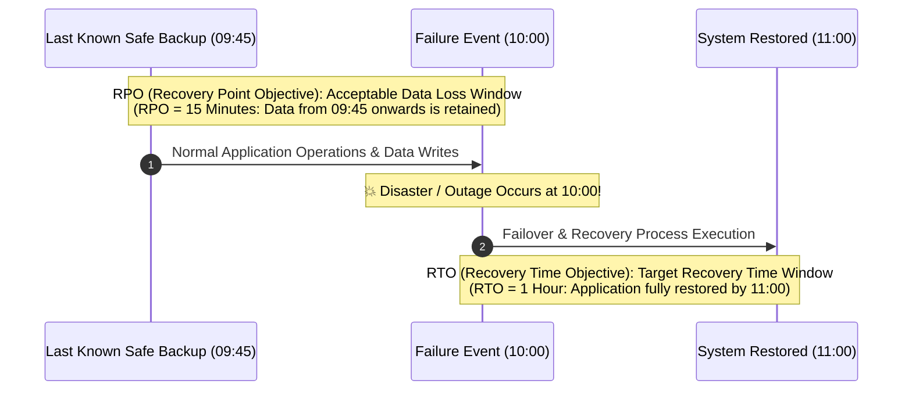
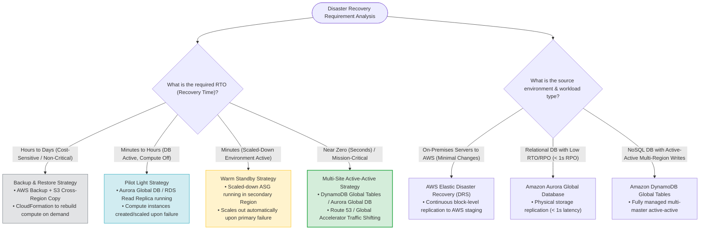

# Task 2.2: RTOs and RPOs — Disaster Recovery & Business Continuity AWS Exam Guide

> [!NOTE]
> **Exam Mindset**: For the AWS Solutions Architect Professional (SAP-C02) and AI Practitioner (AIP-C01) exams, **RTO (Recovery Time Objective)** and **RPO (Recovery Point Objective)** are not AWS services—they are foundational business metrics used to select the appropriate disaster recovery (DR) architecture. Your task on the exam is to translate business SLA requirements into the least expensive AWS architecture that satisfies those specific metrics.

---

## 1. Defining RTO and RPO

### Recovery Time Objective (RTO)
**"How quickly must the application become operational after a failure?"**
- Measures acceptable application downtime.
- **Example**: If RTO = 1 hour and an outage occurs at 10:00 AM, the application must be fully operational by 11:00 AM.

### Recovery Point Objective (RPO)
**"How much data loss is acceptable?"**
- Measures acceptable data loss calculated backwards from the point of failure.
- **Example**: If RPO = 15 minutes and an outage occurs at 10:00 AM, the recovered database must contain data from at least 09:45 AM.



---

## 2. Core Architectural Distinction: RTO vs. RPO

- **RTO (Recovery Time)**: Answers *"How fast can we recover?"* $\rightarrow$ Dictates how much **pre-provisioned compute/infrastructure** must already exist before a disaster occurs.
- **RPO (Recovery Point)**: Answers *"How much data can we lose?"* $\rightarrow$ Dictates **data replication frequency** (periodic backups vs. continuous block/storage replication).

---

## 3. Why RTO and RPO Prevent Over-Engineering

Defining RTO and RPO prevents over-engineering disaster recovery architectures:
- **Company A** (`RTO = 24h`, `RPO = 24h`): Solved with simple **Backup & Restore** (S3 + AWS Backup + CloudFormation).
- **Company B** (`RTO = 5 min`, `RPO = near zero`): Requires **Multi-Site Active-Active** (Aurora Global Database / DynamoDB Global Tables + Route 53 / Global Accelerator).

---

## 4. How RTO Influences Infrastructure Provisioning

```
Long RTO (Hours/Days)  ──> Infrastructure built ON-DEMAND after disaster via IaC (CloudFormation)
Short RTO (Minutes/Sec) ──> Infrastructure PRE-PROVISIONED in DR Region before disaster (Warm Standby / Active-Active)
```

> [!TIP]
> **RTO Rule**: Lower RTO $\rightarrow$ More pre-provisioned active infrastructure running $\rightarrow$ Higher continuous cost.

---

## 5. How RPO Influences Data Replication Frequency

```
Large RPO (Hours)      ──> Scheduled periodic snapshots / backups (AWS Backup)
Small RPO (Sec/Near-Zero)──> Continuous physical/storage-level replication (Aurora Global DB / S3 CRR)
```

> [!TIP]
> **RPO Rule**: Lower RPO $\rightarrow$ More frequent or continuous synchronous/asynchronous data replication $\rightarrow$ Higher network data transfer & storage cost.

---

## 6. The RTO/RPO Cost Spectrum

```
Low Cost / High RTO & RPO ──> Backup & Restore ($)
                              ├── Pilot Light ($$)
                              ├── Warm Standby ($$$)
High Cost / Near-Zero RTO & RPO ──> Multi-Site Active-Active ($$$$)
```

---

## 7. The Four Classic AWS Disaster Recovery Strategies

```mermaid
flowchart TD
    subgraph Spectrum ["AWS Disaster Recovery Strategies (Lowest Cost to Highest Availability)"]
        DR1["1. Backup & Restore<br/>• RTO: Hours to Days<br/>• RPO: Hours to 24 Hours<br/>• Cost: Lowest ($)<br/>• Infra: Created on-demand via IaC"]
        DR2["2. Pilot Light<br/>• RTO: Minutes to Hours<br/>• RPO: Minutes<br/>• Cost: Low ($$)<br/>• Infra: DB replicating, Compute scaled to 0"]
        DR3["3. Warm Standby<br/>• RTO: Minutes<br/>• RPO: Seconds to Minutes<br/>• Cost: Medium ($$$)<br/>• Infra: Scaled-down fleet running in DR Region"]
        DR4["4. Multi-Site Active-Active<br/>• RTO: Near Zero (Seconds)<br/>• RPO: Near Zero<br/>• Cost: Highest ($$$$)<br/>• Infra: Full production running in both Regions"]
    end

    DR1 ==>|"Decrease RTO/RPO (Increase Standby Compute)"| DR2
    DR2 ==>|"Decrease RTO/RPO (Increase Active Fleet)"| DR3
    DR3 ==>|"Decrease RTO/RPO (Full Active Replication)"| DR4

    style DR4 fill:#d4edda,stroke:#28a745,stroke-width:2px
    style DR3 fill:#fff3cd,stroke:#ffc107,stroke-width:1px
    style DR2 fill:#d1ecf1,stroke:#17a2b8,stroke-width:1px
    style DR1 fill:#e2e3e5,stroke:#6c757d,stroke-width:1px
```



---

## 8. Deep-Dive: Backup and Restore

- **Architecture**: Backups stored in primary Region and replicated to Amazon S3 / AWS Backup vault in secondary Region. Compute infrastructure is absent until disaster occurs.
- **Recovery Workflow**: Disaster strikes $\rightarrow$ Execute CloudFormation template to spin up VPC/EC2 $\rightarrow$ Restore database from backup snapshot $\rightarrow$ Direct traffic to restored environment.
- **RTO**: High (Hours to Days).
- **RPO**: High to Medium (dependent on backup frequency).
- **Cost**: **Lowest**.

> [!NOTE]
> **Exam Clue**: *"Cost-effective DR solution for non-critical workloads where hours of downtime and data loss are acceptable"* $\longrightarrow$ **Backup and Restore**.

---

## 9. Deep-Dive: Pilot Light

- **Architecture**: Core database runs continuously in the secondary DR Region with continuous replication (`Aurora Global Database` / `RDS Read Replica`). Compute application servers are turned off or scaled to 0 (`ASG Min Size = 0`).
- **Recovery Workflow**: Disaster strikes $\rightarrow$ Promote Read Replica to standalone Primary $\rightarrow$ Scale up EC2 Auto Scaling Group $\rightarrow$ Route traffic via Route 53.
- **RTO**: Lower (Minutes to Hours).
- **RPO**: Low (Minutes or less).
- **Cost**: Low to Medium.

> [!TIP]
> **Exam Clue**: *"Database is continuously replicated to DR Region, but application servers are provisioned only during a disaster"* $\longrightarrow$ **Pilot Light**.

---

## 10. Deep-Dive: Warm Standby

- **Architecture**: A fully functional, scaled-down version of the application runs continuously in the DR Region (e.g., Primary has 10 instances; DR Region has 2 instances).
- **Recovery Workflow**: Disaster strikes $\rightarrow$ ASG in DR Region automatically scales out from 2 to 10 instances $\rightarrow$ Traffic shifts immediately.
- **RTO**: Low (Minutes).
- **RPO**: Low (Seconds to Minutes).
- **Cost**: Medium to High.

> [!IMPORTANT]
> **Exam Clue**: *"Maintain a scaled-down copy of production running in a secondary Region ready to handle traffic immediately upon failover"* $\longrightarrow$ **Warm Standby**.

---

## 11. Deep-Dive: Multi-Site Active-Active

- **Architecture**: Production capacity runs at full scale in multiple AWS Regions simultaneously, with live user traffic actively distributed across Regions via Route 53 or Global Accelerator.
- **Data Tier**: Synchronous/Asynchronous active-active replication using `Amazon DynamoDB Global Tables` or `Amazon Aurora Global Database`.
- **RTO**: **Near Zero (Seconds)**.
- **RPO**: **Near Zero**.
- **Cost**: **Highest**.

> [!IMPORTANT]
> **Exam Clue**: *"Mission-critical workload requires zero downtime, near-zero RTO, and both Regions actively serving users"* $\longrightarrow$ **Multi-Site Active-Active**.

---

## 12. Disaster Recovery Strategy Comparison Matrix

| DR Strategy | RTO Target | RPO Target | Infrastructure Cost | Active Standby Infrastructure |
| :--- | :--- | :--- | :--- | :--- |
| **Backup & Restore** | **Highest** (Hours - Days) | **Highest** (Hours - 24h) | **Lowest ($)** | None (Provisioned on-demand via IaC) |
| **Pilot Light** | **Lower** (Minutes - Hours)| **Low** (Minutes) | **Low ($$)** | Database replicating; Compute = 0 |
| **Warm Standby** | **Low** (Minutes) | **Low** (Seconds - Mins) | **Medium ($$$)** | Scaled-down application fleet running |
| **Multi-Site Active-Active**| **Lowest** (Near Zero) | **Lowest** (Near Zero) | **Highest ($$$$)** | Full production active in all Regions |

---

## 13. Core RTO/RPO Cost Trade-off Principles

```
Lower RTO ──> Requires more pre-provisioned compute capacity ──> Higher continuous cost
Lower RPO ──> Requires continuous data replication mechanisms  ──> Higher network & storage cost
```

---

## 14. High Availability (HA) vs. Disaster Recovery (DR)

- **High Availability (HA)**: Keeps systems operational during component/AZ failures (**Multi-AZ ALB + EC2 ASG + RDS Multi-AZ within a single Region**).
- **Disaster Recovery (DR)**: Restores operations after catastrophic Regional failure (**Cross-Region Replication + Secondary Region Infrastructure**).

> [!WARNING]
> **Exam Trap**: RDS Multi-AZ provides **HA within a Region**, but does **NOT** provide a cross-Region DR solution. For cross-Region DR, use **RDS Cross-Region Read Replicas** or **Aurora Global Database**.

---

## 15. Multi-AZ Resilience vs. Multi-Region DR

```
Single Region + Multi-AZ ──> Protects against Instance & AZ failure (HA)
Multi-Region Architecture  ──> Protects against complete AWS Region failure (DR)
```

---

## 16. AWS Elastic Disaster Recovery (DRS)

**AWS Elastic Disaster Recovery (DRS)** provides continuous block-level replication of physical, virtual, or cloud servers into a low-cost staging area in AWS.

```
On-Premises / EC2 Server ──> AWS DRS Agent ──> Continuous Block Replication ──> AWS Staging Area ──> On-Demand Failover Launch
```

> [!TIP]
> **Exam Clue**: *"Replicate on-premises physical/virtual servers to AWS with low RTO/RPO and minimal application modifications"* $\longrightarrow$ **AWS Elastic Disaster Recovery (DRS)**.

---

## 17. Amazon Aurora Global Database for Low RTO/RPO

- **Capabilities**: Spans multiple AWS Regions with storage-level replication (typical replication latency < 1 second).
- **Recovery**: Secondary Region can be promoted to read/write master in **less than 1 minute** with zero data loss.

---

## 18. Amazon DynamoDB Global Tables for Active-Active DR

- **Capabilities**: Fully managed multi-Region, multi-master NoSQL database.
- **Recovery**: Enables local read/write access in multiple Regions with automatic data synchronization.

---

## 19. Amazon S3 Data Protection & DR Capabilities

- **S3 Versioning**: Protects against accidental deletion or overwriting.
- **S3 Cross-Region Replication (CRR)**: Automatically replicates objects across AWS Regions for disaster recovery.

---

## 20. Traffic Routing & RTO: Amazon Route 53

Amazon Route 53 Health Checks and **Failover Routing Policies** automatically reroute DNS queries from an unhealthy primary Region to a secondary DR Region.

---

## 21. Rapid Regional Cutover: AWS Global Accelerator

When client devices cache DNS records (TTL delays), **AWS Global Accelerator** shifts global traffic across Regions in seconds using static Anycast IP addresses and network-layer traffic dials.

---

## 22. Matching Backups to RPO Requirements

- If `RPO = 24 hours` $\rightarrow$ Daily automated backups (AWS Backup) are sufficient.
- If `RPO = 5 minutes` $\rightarrow$ Continuous database replication (`Aurora Global Database` / `DRS`) is required.

---

## 23. Scenario Example 1: High RTO / High RPO
- **Requirement**: "Application must recover within 24 hours. Up to 24 hours of data loss is acceptable. Minimize cost."
- **Translation**: `RTO = 24h`, `RPO = 24h`, Lowest Cost.
- **Architecture**: **Backup & Restore** (AWS Backup + S3 + CloudFormation).

---

## 24. Scenario Example 2: Medium RTO / Low RPO
- **Requirement**: "Application must recover within 30 minutes. Data loss must be limited to a few minutes."
- **Translation**: `RTO = 30m`, `RPO = few minutes`.
- **Architecture**: **Pilot Light** (Aurora Global Database / RDS Read Replica + ASG scaled from 0).

---

## 25. Scenario Example 3: Near-Zero RTO / Near-Zero RPO
- **Requirement**: "Application must continue operating during a complete Regional failure with zero downtime."
- **Translation**: `RTO = Near Zero`, `RPO = Near Zero`.
- **Architecture**: **Multi-Site Active-Active** (DynamoDB Global Tables / Aurora Global Database + Route 53 / Global Accelerator).

---

## 26. Scenario Example 4: Hybrid On-Premises DR
- **Requirement**: "Thousands of on-premises servers need DR in AWS with minimal application changes."
- **Translation**: On-premises lift-and-shift DR.
- **Architecture**: **AWS Elastic Disaster Recovery (DRS)**.

---

## 27. RTO/RPO Architectural Selection Master Decision Tree



---

## 28. Operational Overhead across DR Strategies

```
Backup & Restore  ──> Low steady-state cost | High manual/automated recovery effort
Pilot Light       ──> Low standby cost     | Medium failover orchestration effort
Warm Standby      ──> Medium standby cost  | Low failover orchestration effort
Active-Active     ──> Highest cost         | Highest operational complexity (Dual-Region Ops)
```

---

## 29. Role of Infrastructure as Code (IaC) in Lowering RTO

Using **AWS CloudFormation**, **AWS CDK**, or **Terraform** allows spinning up complete DR environments in minutes, dramatically lowering RTO for Backup & Restore and Pilot Light strategies.

---

## 30. Continuous CI/CD Pipeline Synchronization

Ensures application artifacts, code releases, and environment configurations in the secondary DR Region match production via AWS CodePipeline, ECR, and Systems Manager.

---

## 31. AWS Systems Manager Automation for DR Failover

**Systems Manager Automation Runbooks** automate DR failover steps (promoting read replicas, updating Route 53 records, scaling ASGs) to eliminate human error and reduce RTO.

---

## 32. Cost Optimization Principles for DR

Do not deploy Active-Active simply because an SLA specifies "99.99% availability." Evaluate availability SLAs and RTO/RPO requirements separately to avoid unnecessary infrastructure spending.

---

## 33. SLA Availability Percentage vs. RTO Downtime

| SLA Availability | Max Annual Downtime | Target RTO Requirement | Typical Architecture |
| :--- | :--- | :--- | :--- |
| **99.9%** | ~8.76 hours | Hours | Multi-AZ or Backup & Restore |
| **99.99%** | ~52.6 minutes | Minutes | Multi-AZ + Pilot Light / Warm Standby |
| **99.999%** | ~5.26 minutes | Near Zero (Seconds) | Multi-Region Active-Active |

---

## 34. RPO Measures Data Loss, Not Application Downtime

- **Application Down Duration** = **RTO** (e.g., Application down for 20 minutes).
- **Data Loss Duration** = **RPO** (e.g., Database recovered to state 5 minutes prior to failure).

---

## 35. Common SAP-C02 Exam Traps

1. **Trap 1: Choosing Active-Active for Cost-Sensitive Requirements**: Scenario demands *"lowest cost DR"*. Wrong: Active-Active. **Correct: Backup and Restore**.
2. **Trap 2: Confusing RDS Multi-AZ with Regional DR**: Scenario requires *"survival of an entire AWS Region outage"*. Wrong: RDS Multi-AZ. **Correct: Aurora Global Database or RDS Cross-Region Read Replicas**.
3. **Trap 3: Confusing Pilot Light and Warm Standby**: Scenario states *"database is replicating, but application servers are scaled to zero/off"*. Wrong: Warm Standby. **Correct: Pilot Light**.
4. **Trap 4: Missing AWS DRS for On-Premises DR**: Scenario requests *"on-premises server replication with zero code changes"*. Wrong: Re-architect to Lambda. **Correct: AWS Elastic Disaster Recovery (DRS)**.

---

## 36. Exam Keyword Cheat Sheet

| Exam Keyword Phrase | Target Concept / AWS Service |
| :--- | :--- |
| **"How quickly must system recover?"** | **Recovery Time Objective (RTO)** |
| **"How much data loss is acceptable?"** | **Recovery Point Objective (RPO)** |
| **"Lowest cost DR strategy / Hours of downtime acceptable"** | **Backup & Restore** |
| **"Database continuously replicating, compute off"** | **Pilot Light** |
| **"Scaled-down copy of production running"** | **Warm Standby** |
| **"Both Regions actively serving traffic / Zero downtime"** | **Multi-Site Active-Active** |
| **"Replicate on-premises servers to AWS"** | **AWS Elastic Disaster Recovery (DRS)** |
| **"Relational database cross-Region replication < 1s"** | **Amazon Aurora Global Database** |
| **"Multi-master NoSQL database across Regions"** | **Amazon DynamoDB Global Tables** |
| **"Automate infrastructure creation during DR"** | **AWS CloudFormation (IaC)** |

---

## 37. The Core SAP-C02 Mental Model

```
Business Requirement ──> Evaluate RTO ──> Evaluate RPO ──> Select Strategy ──> Select AWS Services ──> Minimize Cost
```

### Core Exam Principle
The professional-level answer is **NEVER** automatically "use the most highly available active-active architecture." The correct answer is **ALWAYS** "use the least expensive architecture that satisfies the required RTO, RPO, availability, and business continuity requirements."