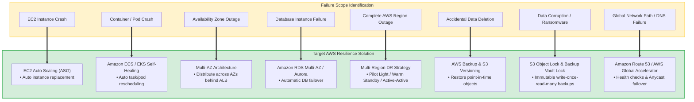
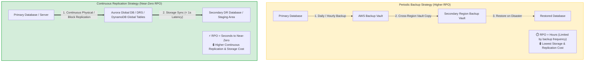
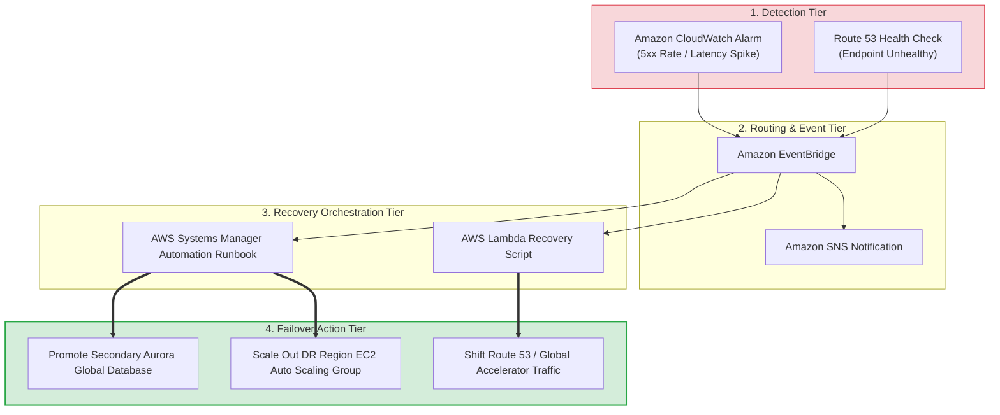
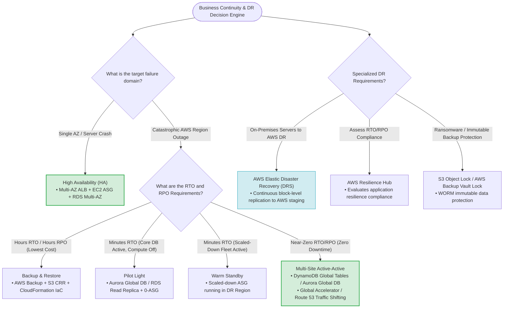

# Task 2.2: Disaster Recovery Skills & Architectural Decision Framework — AWS SAP-C02 & AIP-C01 Exam Guide

> [!NOTE]
> **Exam Mindset**: For the AWS Solutions Architect Professional (SAP-C02) and AI Practitioner (AIP-C01) exams, view **Task 2.2 Skills as a unified decision-making framework**. The exam tests your ability to evaluate: **Business Requirement $\rightarrow$ RTO/RPO $\rightarrow$ Failure Scope $\rightarrow$ Replication/Backup $\rightarrow$ DR Strategy $\rightarrow$ Failover Mechanism $\rightarrow$ Testing $\rightarrow$ Monitoring $\rightarrow$ Total Cost of Ownership (TCO)**.

---

## 1. Configuring Disaster Recovery Solutions

### Why Disaster Recovery Exists
Disaster Recovery (DR) ensures application survival and business continuity when a primary environment becomes completely unavailable.



---

## 2. Failure Scope Identification Matrix

Before selecting a DR strategy, identify the exact failure domain in the exam question:

| Failure Scope | Target AWS Solution | Primary Goal |
| :--- | :--- | :--- |
| **EC2 Instance Crash** | EC2 Auto Scaling Group (ASG) | Automatic instance replacement |
| **Container / Task Crash** | Amazon ECS / EKS Task Rescheduling | Automatic container self-healing |
| **Availability Zone Outage**| Multi-AZ ALB + Multi-AZ EC2 + RDS Multi-AZ | Single-Region High Availability (HA) |
| **Database Instance Outage**| Amazon RDS Multi-AZ / Aurora Failover | Automatic database failover |
| **Complete AWS Region Failure**| Multi-Region DR Strategy (Cross-Region) | Disaster Recovery (DR) |
| **Accidental Data Deletion** | AWS Backup + Amazon S3 Versioning | Point-in-time data recovery |
| **Data Corruption / Ransomware**| S3 Object Lock / AWS Backup Vault Lock | WORM immutable backup protection |
| **Global Routing Failure** | Amazon Route 53 / AWS Global Accelerator | Traffic rerouting & failover |

---

## 3. The Four Classic DR Strategies Hierarchy

| Strategy | Infrastructure Cost | RTO | RPO | Standby Running Infrastructure |
| :--- | :---:| :---:| :---:| :--- |
| **Backup & Restore** | **Lowest ($)** | **Highest** (Hours - Days) | **Highest** (Hours - 24h) | Minimal (Created on-demand via IaC) |
| **Pilot Light** | **Low ($$)** | **Low/Medium** (Mins - Hours)| **Low** (Minutes) | Database replicating; Compute = 0 |
| **Warm Standby** | **Medium ($$$)** | **Low** (Minutes) | **Low** (Seconds - Mins) | Scaled-down production fleet running |
| **Multi-Site Active-Active**| **Highest ($$$$)**| **Lowest** (Near Zero) | **Lowest** (Near Zero) | Full production capacity in all Regions |

---

## 4. Deep-Dive: Backup and Restore

- **Architecture**: Production data backed up via **AWS Backup** and replicated to a secondary Region. Compute infrastructure is absent until disaster recovery occurs.
- **Use Case**: Non-critical applications where several hours of recovery time (`RTO`) and data loss (`RPO`) are acceptable.
- **Cost**: **Lowest** DR infrastructure cost.

> [!NOTE]
> **Exam Clue**: *"Lowest cost DR strategy where hours of downtime are acceptable"* $\longrightarrow$ **Backup and Restore**.

---

## 5. Deep-Dive: Pilot Light

- **Architecture**: Core database runs continuously in the secondary DR Region with continuous replication (`Aurora Global Database` / `RDS Read Replica`). Compute application infrastructure is kept off or scaled to zero (`ASG Min Size = 0`).
- **Failover Workflow**: Disaster strikes $\rightarrow$ Promote Read Replica to Primary $\rightarrow$ Scale up EC2 ASG via CloudFormation $\rightarrow$ Route traffic via Route 53.

> [!TIP]
> **Exam Clue**: *"Critical database infrastructure continuously replicated, but compute servers are provisioned during disaster"* $\longrightarrow$ **Pilot Light**.

---

## 6. Deep-Dive: Warm Standby

- **Architecture**: A fully functional, scaled-down version of the application runs continuously in the secondary DR Region (e.g., 10 instances in Primary vs. 2 instances in DR).
- **Failover Workflow**: Disaster strikes $\rightarrow$ DR Auto Scaling Group automatically scales out to full capacity $\rightarrow$ Route 53 / Global Accelerator shifts traffic.

> [!IMPORTANT]
> **Exam Clue**: *"Maintain a scaled-down copy of production running in a secondary Region ready to handle traffic immediately"* $\longrightarrow$ **Warm Standby**.

---

## 7. Deep-Dive: Multi-Site Active-Active

- **Architecture**: Full production capacity runs simultaneously across multiple AWS Regions, actively serving live user traffic via Route 53 or Global Accelerator.
- **Data Tier**: Synchronous/Asynchronous active-active replication using `Amazon DynamoDB Global Tables` or `Amazon Aurora Global Database`.
- **RTO & RPO**: **Near Zero**.

---

## 8. Configuring Data and Database Replication

Application recovery and database replication are separate architecture layers:
- **Application RTO**: Time required to restore compute servers.
- **Database RPO**: Maximum acceptable data loss window.



---

## 9. AWS Database Replication Options

- **Amazon RDS Multi-AZ**: Synchronous replication within a single Region for **High Availability (HA)**.
- **Amazon Aurora Global Database**: Dedicated storage-level replication across Regions (< 1s latency, < 1 min failover) for **Relational DR**.
- **Amazon DynamoDB Global Tables**: Fully managed multi-Region active-active writes for **NoSQL DBs**.

---

## 10. Amazon S3 Data Protection & Replication

- **S3 Cross-Region Replication (CRR)**: Asynchronously replicates objects across AWS Regions for DR and compliance.
- **S3 Versioning**: Protects against accidental object overwrites or deletions.
- **S3 Object Lock & AWS Backup Vault Lock**: Enforces WORM (Write Once Read Many) immutability to prevent ransomware or malicious data deletion.

---

## 11. Amazon EBS Snapshots & Cross-Region Copy

Point-in-time EBS snapshots can be automatically copied across Regions via AWS Backup policies for server recovery.

---

## 12. AWS Elastic Disaster Recovery (DRS)

**AWS Elastic Disaster Recovery (DRS)** continuously replicates physical, virtual, or cloud servers into a low-cost AWS staging area, providing rapid failover without running full duplicate production environments.

> [!TIP]
> **Exam Clue**: *"Replicate on-premises servers to AWS with low RTO/RPO and minimal application modifications"* $\longrightarrow$ **AWS Elastic Disaster Recovery (DRS)**.

---

## 13. Performing Disaster Recovery Testing

A DR plan is incomplete until tested.
- **Testing Verification**: Confirm backups restore cleanly, databases fail over, DNS records update, IAM permissions function, and application health checks pass.
- **Automation Tools**: AWS Backup, AWS CloudFormation, AWS Systems Manager, AWS Elastic Disaster Recovery, and AWS Resilience Hub.

---

## 14. AWS Resilience Hub

**AWS Resilience Hub** provides a centralized console to define, test, and assess application resilience against defined RTO and RPO targets.

> [!NOTE]
> **Exam Clue**: *"Assess application resilience and evaluate RTO/RPO compliance against AWS best practices"* $\longrightarrow$ **AWS Resilience Hub**.

---

## 15. Automated Backup Architecture

A production-grade backup architecture uses **AWS Backup** with cross-Region copies and **Backup Vault Lock** for immutable ransomware protection.

---

## 16. Periodic Backup vs. Continuous Replication

| Feature | Periodic Backup (AWS Backup / Snapshots) | Continuous Replication (Aurora Global / DRS) |
| :--- | :--- | :--- |
| **RPO Achieved** | Hours (Dependent on backup schedule) | **Seconds to Near-Zero** |
| **Storage & Network Cost**| **Lowest** | Higher (Continuous data sync & cross-Region transfer) |
| **Use Case** | Non-critical / Compliance archives | Mission-critical / High-transaction databases |

---

## 17. Designing Application Availability & Failover

- **AZ-Level Availability**: Route 53 $\rightarrow$ ALB $\rightarrow$ EC2 ASG across AZs $\rightarrow$ RDS Multi-AZ.
- **Region-Level DR**: Route 53 / Global Accelerator $\rightarrow$ Region A (Active) + Region B (DR Standby).

---

## 18. Traffic Routing for DR: Route 53 vs. Global Accelerator

- **Amazon Route 53**: DNS-level routing (**Failover Routing Policy**). Subject to client DNS TTL caching delays.
- **AWS Global Accelerator**: Network-layer routing using static Anycast IPs. **Bypasses DNS TTL caching for instant traffic cutover in seconds**.

---

## 19. Centralized Monitoring & Event-Driven DR Automation



---

## 20. AWS Systems Manager in Disaster Recovery

- **SSM Automation Runbooks**: Automates database promotion, parameter updates, and scaling target ASGs.
- **SSM Parameter Store**: Stores environment-specific configuration values across Regions.
- **SSM Session Manager**: Grants secure administrative shell access during recovery without Bastion hosts.

---

## 21. Amazon EventBridge in DR Orchestration

Acts as the central event router: transforms CloudWatch alarms or AWS Health events into automated recovery actions via Lambda or Systems Manager.

---

## 22. Cost Decision Framework

```
Backup & Restore (Cheapest) ──> Pilot Light ──> Warm Standby ──> Multi-Site Active-Active (Most Expensive)
```

> [!WARNING]
> **SAP Exam Rule**: Do **NOT** automatically choose the cheapest DR architecture, nor the most expensive Active-Active architecture. Choose the **least expensive architecture that completely satisfies the required RTO, RPO, and business SLAs**.

---

## 23. Operational Overhead Comparison

| Strategy | Standby Infrastructure Cost | Operational Complexity | Failover Speed |
| :--- | :--- | :--- | :--- |
| **Backup & Restore** | Minimal | Higher during recovery event | Slow (Hours) |
| **Pilot Light** | Low (DB only) | Medium | Faster (Minutes/Hours) |
| **Warm Standby** | Medium (Scaled-down fleet) | Medium / High | Fast (Minutes) |
| **Multi-Site Active-Active**| Highest (Full production fleet)| Highest | **Instant (Seconds)** |

---

## 24. AWS DR Services Quick Reference Matrix

| Business Requirement | Recommended AWS Service / Feature |
| :--- | :--- |
| **Centralized Backup Automation** | **AWS Backup** |
| **Ransomware / Immutable Protection** | **AWS Backup Vault Lock / S3 Object Lock** |
| **Lift-and-Shift On-Premises DR** | **AWS Elastic Disaster Recovery (DRS)** |
| **Single-Region Database HA** | **Amazon RDS Multi-AZ** |
| **Relational Cross-Region DR (< 1s RPO)** | **Amazon Aurora Global Database** |
| **NoSQL Active-Active Multi-Region** | **Amazon DynamoDB Global Tables** |
| **S3 Cross-Region Object Sync** | **Amazon S3 Cross-Region Replication (CRR)** |
| **Assess RTO/RPO Compliance** | **AWS Resilience Hub** |
| **DNS-Based Failover** | **Amazon Route 53 Failover Routing** |
| **Instant Traffic Shift (No DNS Caching)**| **AWS Global Accelerator** |
| **Automated Recovery Runbooks** | **AWS Systems Manager Automation** |
| **Infrastructure Recreation** | **AWS CloudFormation (IaC)** |

---

## 25. SAP-C02 Disaster Recovery & Business Continuity Master Decision Framework



---

## 26. SAP-C02 Exam Keyword Cheat Sheet

```
"Lowest cost DR / Hours RTO"           ──> Backup & Restore
"Core DB active, compute off"           ──> Pilot Light
"Scaled-down production environment"   ──> Warm Standby
"Active-active / Near-zero downtime"   ──> Multi-Site Active-Active
"On-premises lift-and-shift DR"        ──> AWS Elastic Disaster Recovery (DRS)
"Relational DB cross-Region DR"        ──> Amazon Aurora Global Database
"NoSQL active-active writes"           ──> Amazon DynamoDB Global Tables
"Ransomware / Immutable backups"       ──> S3 Object Lock / AWS Backup Vault Lock
"Instant failover without DNS caching" ──> AWS Global Accelerator
"Assess RTO/RPO compliance"            ──> AWS Resilience Hub
"Automate DR runbook execution"        ──> AWS Systems Manager Automation
```

---

## 27. The Core SAP-C02 Mental Model

```
RTO ──> Determines Recovery Speed & Infrastructure Readiness (On-Demand vs Standby vs Active)
RPO ──> Determines Data Loss Tolerance & Replication Frequency (Backups vs Continuous Sync)
```

### Core Exam Principle
Do not memorize individual DR services in isolation. Always trace the complete decision chain: **Business Requirement $\rightarrow$ Failure Scope $\rightarrow$ RTO/RPO $\rightarrow$ DR Strategy $\rightarrow$ Data Sync $\rightarrow$ Traffic Failover $\rightarrow$ Automation $\rightarrow$ TCO**. Choose the simplest, least expensive architecture that completely satisfies the required SLAs.