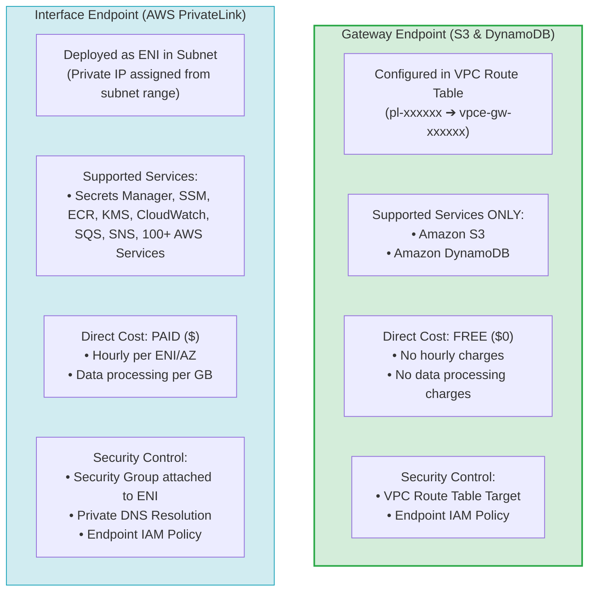
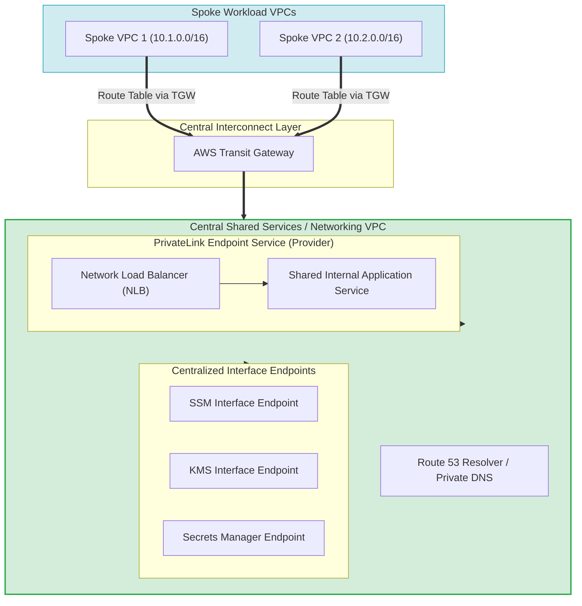
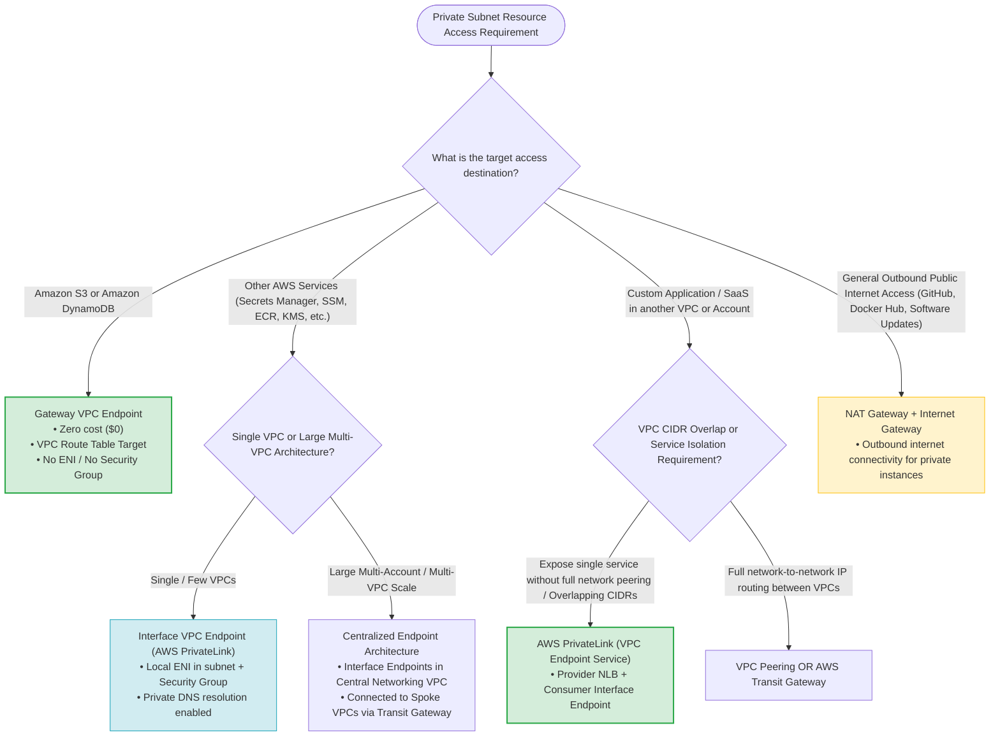

> [!NOTE]
> **Exam Mindset**: For the AWS Solutions Architect Professional (SAP-C02) and AI Practitioner (AIP-C01) exams, the central question for service endpoints is: **"How does a resource in a private VPC subnet reach an AWS service or external SaaS application privately without traversing the public Internet or incurring unnecessary NAT Gateway costs?"**
> - **Amazon S3 & DynamoDB** $\rightarrow$ **Gateway VPC Endpoint** ($0 Cost, Route Table Target)
> - **Other AWS Services / SaaS** $\rightarrow$ **Interface VPC Endpoint (AWS PrivateLink)** (Paid, Subnet ENI, Security Group, Private DNS)

---

## 1. Why AWS Service Endpoints Exist

Without VPC endpoints, instances in private subnets must route traffic through a NAT Gateway and Internet Gateway to reach public AWS service endpoints.

```mermaid
flowchart TD
    subgraph Traditional ["1. Traditional Access (NAT Gateway + Public Internet)"]
        EC2_A["Private EC2 Instance"] -->|"Route 0.0.0.0/0"| NAT["NAT Gateway (Public Subnet)"]
        NAT -->|"Outbound Traffic ($)"| IGW["Internet Gateway"]
        IGW ==>|"Public Internet"| S3_Pub["AWS Service Public Endpoint"]
        NoteNAT["⚠️ Incurs NAT Hourly + Data Processing Fees<br/>⚠️ Traversable over Public Internet path"]
    end

    subgraph Gateway ["2. Gateway VPC Endpoint (S3 & DynamoDB Only)"]
        EC2_B["Private EC2 Instance"] -->|"VPC Route Table Target"| GWE["Gateway VPC Endpoint (vpce-gw-xxx)"]
        GWE ==>|"Direct Private AWS Backbone"| S3_Priv["Amazon S3 / DynamoDB Engine"]
        NoteGWE["✅ FREE ($0 Endpoint / Processing Fees)<br/>✅ No ENI, No Public IPs, No Internet Gateway required"]
    end

    subgraph Interface ["3. Interface VPC Endpoint (AWS PrivateLink)"]
        EC2_C["Private EC2 Instance"] -->|"Connects to Subnet ENI"| IFE["Interface VPC Endpoint ENI (vpce-if-xxx)"]
        IFE ==>|"AWS PrivateLink Network"| Secrets_Priv["Secrets Manager / SSM / ECR / KMS"]
        NoteIFE["✅ Private Subnet ENI with Security Group<br/>✅ Private DNS Integration (Standard AWS DNS names)"]
    end

    style Gateway fill:#d4edda,stroke:#28a745,stroke-width:2px
    style Interface fill:#d1ecf1,stroke:#17a2b8,stroke-width:1px
    style Traditional fill:#fff3cd,stroke:#ffc107,stroke-width:1px
```



### Problems Solved by VPC Endpoints
- **Eliminates NAT Gateway Costs**: Bypasses NAT Gateway hourly charges and per-GB data processing fees for supported AWS services.
- **Enhanced Security & Network Isolation**: Keeps traffic completely contained within the AWS private network backbone without requiring Internet Gateways or public IPs.
- **Simplified Security Governance**: Allows attaching **VPC Endpoint Policies** to restrict access to specific S3 buckets or AWS resources.

---

## 2. Core VPC Endpoint Types: Gateway vs. Interface



---

## 3. Deep-Dive: Gateway VPC Endpoints

### Architecture & Capabilities
- **Supported Services**: **Amazon S3** and **Amazon DynamoDB** exclusively.
- **Mechanism**: Configured as a prefix list target (`pl-xxxxxx`) in the VPC Route Table.
- **ENI Requirement**: **No ENI** is created in your subnet.
- **Direct Cost**: **FREE ($0)** (No hourly charges or data processing fees).

> [!NOTE]
> **Exam Trigger**: *"Private EC2 instances in a VPC need to transfer large volumes of data to Amazon S3 while minimizing costs and eliminating NAT Gateway data processing charges"* $\longrightarrow$ **Gateway VPC Endpoint for S3**.

---

## 4. Deep-Dive: Interface VPC Endpoints (AWS PrivateLink)

### Architecture & Capabilities
- **Supported Services**: AWS Systems Manager, Secrets Manager, Amazon ECR, AWS KMS, Amazon CloudWatch, Amazon SNS, Amazon SQS, API Gateway, and 100+ AWS/partner services.
- **Mechanism**: Creates an **Elastic Network Interface (ENI)** with a private IP address inside your subnet.
- **Security Controls**: Governed by **Security Groups** attached to the endpoint ENI and **VPC Endpoint Policies**.
- **Direct Cost**: **PAID** (Hourly charge per ENI/AZ + data processing per GB).

---

## 5. Gateway Endpoint vs. Interface Endpoint Master Comparison Matrix

| Feature | Gateway VPC Endpoint | Interface VPC Endpoint (AWS PrivateLink) |
| :--- | :--- | :--- |
| **Supported Services** | **Amazon S3 & Amazon DynamoDB ONLY** | **Secrets Manager, SSM, ECR, KMS, CloudWatch, SQS, 100+ Services** |
| **Deployment Mechanism** | Target entry in VPC Route Table | Elastic Network Interface (ENI) in Subnet |
| **Direct Service Cost** | **FREE ($0)** | **PAID** (Hourly fee per ENI/AZ + Data processing fees) |
| **Security Group Support** | ❌ No (Controlled via Route Tables & Policies) | ✅ **Yes** (Security Groups attached directly to ENI) |
| **Private DNS Resolution** | ❌ No | ✅ **Yes** (Resolves standard AWS service endpoints to private IPs) |
| **Cross-Region Access** | Regional VPC scope | Supports cross-Region PrivateLink access |
| **On-Premises Access** | Cannot be accessed directly via DX/VPN | Accessible from on-premises via DX/VPN through endpoint ENIs |

---

## 6. VPC Endpoint Policies vs. IAM Policies vs. Resource Policies

Security at VPC endpoints involves three distinct policy layers working together:
1. **IAM Identity Policy**: Grants permission to the principal (*"Can User A call `s3:GetObject`?"*).
2. **VPC Endpoint Policy**: Restricts actions allowed through the endpoint (*"Allows traffic ONLY to bucket `company-prod-data`"*).
3. **Resource Policy**: Restricts access to the target resource (*"Allows S3 access ONLY if coming from `vpce-12345`"*).

> [!IMPORTANT]
> **Exam Rule**: A VPC Endpoint Policy does **NOT** grant permissions by itself; it acts as a boundary filter restricting what can pass through the endpoint.

---

## 7. Comparative Matrix: VPC Endpoint vs. NAT Gateway

| Feature | VPC Endpoint (Gateway / Interface) | NAT Gateway |
| :--- | :--- | :--- |
| **Target Destination** | AWS Services / PrivateLink Partners | **General Public Internet** (GitHub, Docker Hub, YUM/APT repositories) |
| **Internet Requirement** | **None** (100% Private AWS Network Backbone) | Requires Internet Gateway in Public Subnet |
| **Public IP Requirement** | **None** | Requires Elastic IP (EIP) attached to NAT Gateway |
| **S3 Data Processing Cost**| **$0 Data Processing** (Gateway Endpoint) | **Paid per GB** ($0.045/GB NAT data processing fee) |

---

## 8. AWS PrivateLink & VPC Endpoint Services (Provider Architecture)

**AWS PrivateLink** enables exposing an internal service running in a Provider VPC behind a **Network Load Balancer (NLB)** to Consumer VPCs across different AWS accounts without establishing broad VPC Peering or exposing public IPs.



---

## 9. Comparative Matrix: PrivateLink vs. VPC Peering vs. AWS Transit Gateway

| Connectivity Model | Routing Layer | Supports Overlapping CIDRs? | Security Scope | Primary Use Case |
| :--- | :--- | :---:| :--- | :--- |
| **AWS PrivateLink** | Layer 4 / Service Level | ✅ **Yes** | Single Service / Unidirectional | Exposing specific application services to customers or internal VPCs privately. |
| **VPC Peering** | Layer 3 / Network Level | ❌ No | Full Network-to-Network | Direct 1-to-1 IP routing between non-overlapping VPCs. |
| **AWS Transit Gateway** | Layer 3 / Hub-and-Spoke | ❌ No | Full Network Interconnect | Centralized multi-VPC and hybrid network routing for 10s or 100s of VPCs. |

---

## 10. Centralized VPC Endpoint Architecture

In large multi-account enterprise organizations with tens or hundreds of VPCs:
- Deploying Interface Endpoints in every spoke VPC creates excessive ENI hourly fees.
- **Solution**: Create a **Central Networking VPC** housing shared Interface Endpoints, connected to spoke VPCs via **AWS Transit Gateway** and **Amazon Route 53 Resolver Private DNS**.

---

## 11. High Availability Best Practices for Interface Endpoints

Deploy Interface Endpoint ENIs across **multiple Availability Zones (AZs)** within the VPC. If an AZ experiences an outage, Route 53 Private DNS automatically routes service requests to healthy ENIs in remaining operational AZs.

---

## 12. SAP-C02 VPC Endpoint & Private Access Master Decision Tree



---

## 13. SAP-C02 Exam Keyword Cheat Sheet

```
"Private S3 / DynamoDB access"         ──> Gateway VPC Endpoint ($0 Cost)
"Reduce NAT Gateway costs for S3"       ──> Gateway VPC Endpoint
"Private Secrets Manager / SSM / ECR"  ──> Interface VPC Endpoint (AWS PrivateLink)
"Overlapping CIDRs but service access" ──> AWS PrivateLink (VPC Endpoint Service)
"Expose single service to 100 VPCs"    ──> AWS PrivateLink + Network Load Balancer (NLB)
"General outbound internet updates"    ──> NAT Gateway + Internet Gateway
"Connect 100 VPCs with IP routing"     ──> AWS Transit Gateway
```

---

## 14. Common SAP-C02 Exam Traps

1. **Trap 1: Choosing Interface Endpoints for S3 when Gateway Endpoints are Free**: Gateway Endpoints for S3 and DynamoDB incur zero hourly or processing fees. Always prefer Gateway Endpoints unless cross-Region or on-premises access is specifically required.
2. **Trap 2: Assuming Gateway Endpoints have Security Groups**: Gateway Endpoints do not use ENIs and do not support Security Groups. They are controlled via VPC Route Tables and Endpoint IAM Policies.
3. **Trap 3: Using VPC Endpoints for General Internet Access**: VPC Endpoints provide access to supported AWS/partner services only. Use **NAT Gateways** for general Internet traffic (e.g., GitHub, Linux package repos).
4. **Trap 4: Confusing PrivateLink with VPC Peering for Overlapping CIDRs**: VPC Peering fails if IP CIDR ranges overlap. **AWS PrivateLink** works seamlessly across overlapping CIDR ranges because it operates at the service/NLB layer.

---

## 15. Core Architectural Takeaways

- **Gateway Endpoint** = S3 & DynamoDB | Route Table Target | **$0 Cost** | No ENI.
- **Interface Endpoint** = Most AWS Services | Subnet ENI | Paid | Security Group + Private DNS.
- **PrivateLink** = Expose specific provider services securely without VPC Peering.
- **NAT Gateway** = Private Subnet $\rightarrow$ General Public Internet Access.