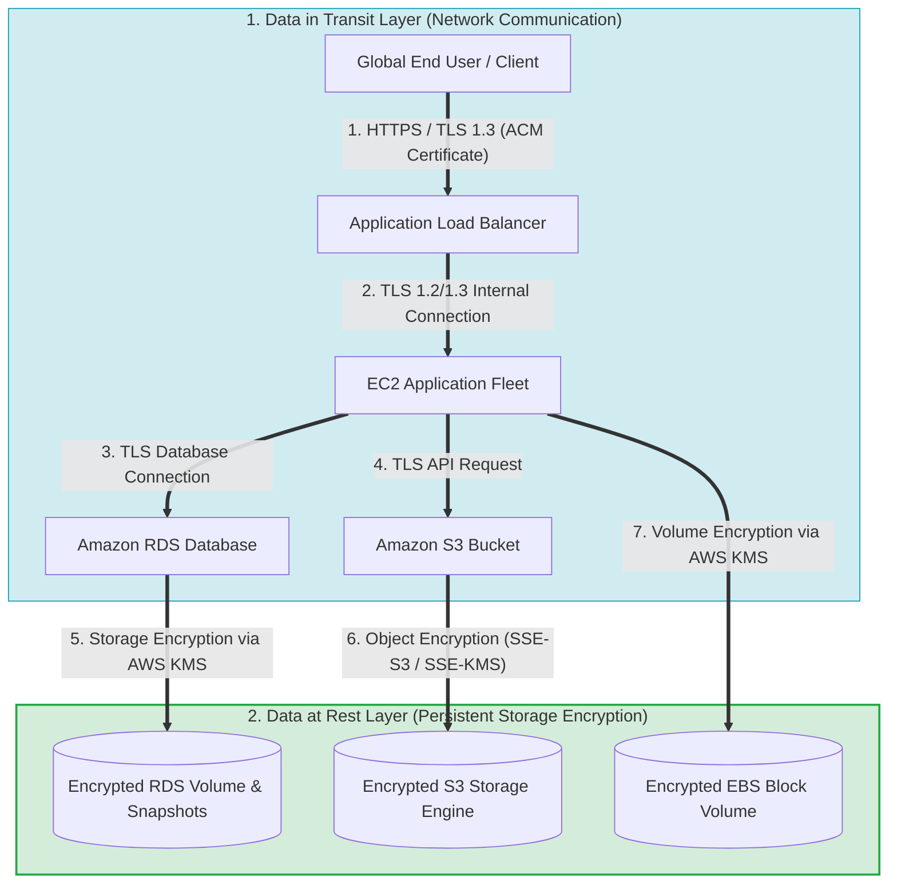
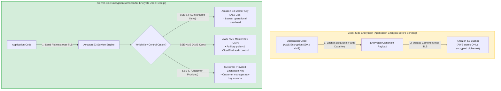
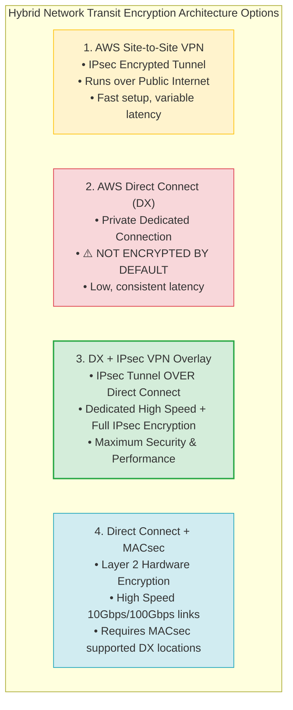
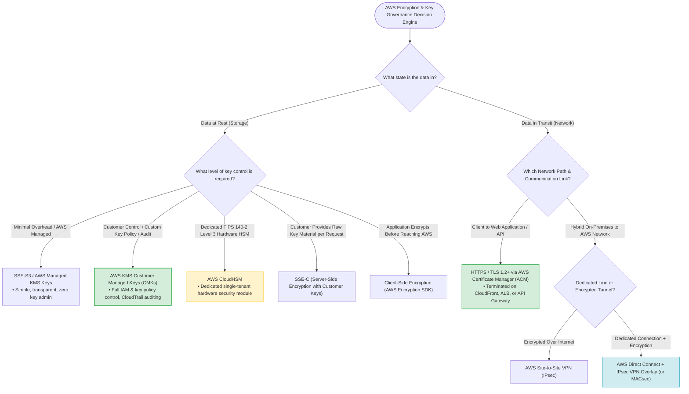

# Task 2.3: Determine Security Controls Based on Requirements — Encryption Options for Data at Rest and Data in Transit

> [!NOTE]
> **Exam Mindset**: For the AWS Solutions Architect Professional (SAP-C02) and AI Practitioner (AIP-C01) exams, do not start by asking *"Which encryption service should I use?"* Start by evaluating:
> 1. **Data State**: Is it **Data at Rest** (Storage) or **Data in Transit** (Network)?
> 2. **Key Governance**: Who controls the encryption keys (**AWS Managed** vs. **Customer Managed KMS Keys** vs. **CloudHSM FIPS 140-2 Level 3**)?
> 3. **Transparency**: Does encryption need to be **Server-Side (Transparent)** or **Client-Side (Envelope Encryption)**?

---

## 1. Why Encryption Exists: Data at Rest vs. Data in Transit

Encryption protects sensitive data from unauthorized disclosure across storage and network layers.



- **Data at Rest**: Protects static data stored on persistent media (S3, EBS, RDS, DynamoDB, EFS, FSx, Backups).
- **Data in Transit**: Protects data moving across networks between endpoints (TLS/SSL, IPsec VPN, MACsec).

---

## 2. Defining Data at Rest

Data at rest refers to inactive data stored physically on storage media. If an unauthorized entity gains access to the underlying physical disk or snapshot, the data remains completely unreadable without the corresponding cryptographic key.

---

## 3. AWS Key Management Service (KMS)

**AWS KMS** is a managed service that makes it easy to create and control the cryptographic keys used to encrypt data across AWS services and applications.

```
Without KMS: Application ──> Custom Encryption Code ──> Manually Managed Keys (High Risk & Overhead)
With KMS:    Application ──> AWS KMS API ──> Managed Key Lifecycle (Rotation, Auditing, Access Control)
```

---

## 4. KMS Key Types & Governance Hierarchy

| KMS Key Type | Key Management Owner | Key Policy Control | CloudTrail Auditability | Primary Use Case |
| :--- | :--- | :--- | :--- | :--- |
| **AWS Owned Keys** | AWS Service | None (Managed by AWS) | No direct KMS log entries | Default zero-cost encryption for AWS internal operations. |
| **AWS Managed Keys** | AWS Service on your behalf | Viewable only | Yes (KMS API calls logged) | Simple encryption with zero key administration overhead. |
| **Customer Managed Keys (CMKs)**| **Customer (You)** | **Full Control** (Key Policy & IAM) | **Yes (Full Auditability)** | Regulatory compliance, cross-account access, key rotation control. |

---

## 5. When to Choose Customer Managed KMS Keys (CMKs)

Select a **Customer Managed Key (CMK)** when the exam scenario specifies:
- *"Customer must control the key policy and access permissions"*
- *"Ability to manually rotate or immediately revoke key access"*
- *"Cross-account access to encrypted AWS resources"*
- *"Regulatory compliance requires customer-controlled keys & audit logs"*

---

## 6. When AWS Managed Encryption is Sufficient

If a scenario asks to *"Encrypt S3 objects at rest with minimal operational overhead"* and does **NOT** mention custom key control, cross-account sharing, or strict rotation rules, choose the simplest managed encryption option (**SSE-S3**). Do not introduce unnecessary CMK complexity.

---

## 7. Deep-Dive: Amazon S3 Encryption Options



### S3 Encryption Comparison Matrix

| Option | Encryption Location | Key Management Owner | Operational Overhead |
| :--- | :--- | :--- | :--- |
| **SSE-S3** | Server-Side (S3) | Amazon S3 (AES-256) | **Lowest** (Default S3 Encryption) |
| **SSE-KMS** | Server-Side (S3) | AWS KMS (Managed or Customer Key) | Low / Medium (KMS API charges apply) |
| **DSSE-KMS**| Server-Side (S3) | Dual-layer KMS Encryption | Medium (Compliance dual-encryption) |
| **SSE-C** | Server-Side (S3) | Customer provides raw key per HTTP request | High (Customer manages raw key material) |
| **Client-Side**| **Client App** | Application (AWS Encryption SDK) | **Highest** (AWS receives only ciphertext) |

---

## 8. S3 Server-Side Encryption with KMS (SSE-KMS)

Uses AWS KMS to generate envelope data keys. Enables fine-grained IAM policy controls, key rotation policies, and CloudTrail auditing for object access.

---

## 9. S3 Server-Side Encryption with Customer-Provided Keys (SSE-C)

The customer includes the encryption key as part of every HTTP request header. S3 performs encryption/decryption in memory and immediately discards the raw key.

> [!CAUTION]
> **SSE-C Risk**: If the customer loses the raw encryption key, data stored in S3 is permanently unrecoverable.

---

## 10. Amazon EBS Volume Encryption

- Encrypts EBS boot volumes, data volumes, point-in-time snapshots, and all volume copies seamlessly via AWS KMS.
- **Account Setting**: Can enable *Always Encrypt New EBS Volumes* at the AWS Region level.

---

## 11. Amazon RDS Encryption at Rest vs. In-Transit

- **Encryption at Rest**: Encrypts database storage, automated backups, read replicas, and snapshots via KMS.
- **Encryption in Transit**: Requires enabling **TLS/SSL database connections** between the application and RDS.

> [!WARNING]
> Enabling RDS encryption at rest does **NOT** automatically encrypt network connections. Always enforce TLS for data in transit.

---

## 12. Amazon DynamoDB Encryption

All DynamoDB table data is encrypted at rest by default using AWS owned keys, AWS managed KMS keys, or customer managed KMS keys.

---

## 13. Amazon EFS Encryption Options

- **At Rest**: Transparent storage encryption enabled at file system creation via AWS KMS.
- **In Transit**: Enforced using the `amazon-efs-utils` mount helper with the `-o tls` option.

---

## 14. Secrets Management vs. Encryption Keys

```
AWS KMS ──> Manages Cryptographic Keys (Encrypt / Decrypt operations)
AWS Secrets Manager ──> Manages & Rotates Database Passwords, API Tokens, OAuth Secrets
SSM Parameter Store ──> Stores Configuration Parameters & SecureStrings
```

> [!IMPORTANT]
> **Exam Trap**: Do not use KMS to store application passwords or API tokens directly. Use **AWS Secrets Manager** or **SSM Parameter Store SecureStrings** (which use KMS for underlying encryption).

---

## 15. Defining Data in Transit

Data in transit refers to data actively moving across a network. It is protected against interception, tampering, and eavesdropping using **TLS/SSL (HTTPS)** or **IPsec network tunnels**.

---

## 16. HTTPS & Transport Layer Security (TLS)

TLS provides three core security guarantees for network communications:
1. **Confidentiality** (Payload encryption)
2. **Integrity** (Prevents packet tampering)
3. **Authentication** (Verifies server identity via X.509 digital certificates)

---

## 17. AWS Certificate Manager (ACM)

**AWS Certificate Manager (ACM)** provisions, manages, and deploys public and private SSL/TLS certificates for use with AWS services (CloudFront, Application Load Balancers, API Gateway).

> [!NOTE]
> Public TLS certificates issued by ACM are **free of charge** when used with integrated AWS services.

---

## 18. Architectural Roles: ACM vs. KMS vs. TLS

- **ACM**: Provisions and manages X.509 TLS **Digital Certificates**.
- **KMS**: Generates and manages **Cryptographic Keys** for storage encryption.
- **TLS**: Executes **Network Protocol Encryption** for data moving across the wire.

---

## 19. Amazon CloudFront End-to-End Transit Encryption

For complete end-to-end encryption with Amazon CloudFront, enforce HTTPS across **BOTH** network legs:
1. **Viewer $\rightarrow$ CloudFront Edge**: HTTPS enforced via ACM certificate.
2. **CloudFront Edge $\rightarrow$ Origin (ALB/S3)**: HTTPS enforced with valid origin SSL/TLS certificates.

---

## 20. Application Load Balancer (ALB) TLS Termination

- **TLS Offloading/Termination**: ALB decrypts HTTPS client traffic at port 443 and forwards plain HTTP traffic to backend EC2 instances on port 8080 over private VPC subnets.
- **End-to-End Encryption**: If required by compliance, ALB re-encrypts traffic and forwards HTTPS requests to backend EC2 instances over TLS.

---

## 21. Amazon API Gateway Transit Security

API Gateway endpoints enforce HTTPS by default. Private integrations via VPC Links ensure transit encryption when routing requests to internal VPC backends.

---

## 22. Myth Buster: VPC Private Traffic is NOT Automatically Encrypted

Private VPC networking isolates traffic from the public Internet, but does **NOT** automatically encrypt packet payloads moving between instances unless specific Nitro instance-to-instance encryption is supported or application TLS is enforced.

---

## 23. AWS PrivateLink and Encryption

**AWS PrivateLink** establishes private network connectivity to AWS services or third-party SaaS applications without exposing traffic to the public Internet. For strict compliance, combine PrivateLink with **TLS application-level encryption**.

---

## 24. AWS Site-to-Site VPN (IPsec)

Provides encrypted network tunnels over the public Internet between on-premises gateways and AWS Virtual Private Gateways (VGW) or Transit Gateways (TGW) using **IPsec (Internet Protocol Security)**.

---

## 25. AWS Direct Connect (DX) is NOT Encrypted by Default



> [!WARNING]
> **Exam Trap**: AWS Direct Connect provides a private dedicated connection, but **does NOT encrypt network traffic by default**. To encrypt Direct Connect traffic, deploy an **IPsec VPN overlay on top of Direct Connect** or enable **MACsec (Layer 2 IEEE 802.1AE)** on supported 10Gbps/100Gbps links.

---

## 26. Hybrid Connectivity Matrix: Site-to-Site VPN vs. Direct Connect

| Hybrid Option | Connection Type | Encryption Default | Latency & Bandwidth |
| :--- | :--- | :--- | :--- |
| **Site-to-Site VPN** | Public Internet | **Encrypted (IPsec)** | Variable latency / Up to 1.25 Gbps per tunnel |
| **Direct Connect (DX)** | Private Dedicated | ❌ **NOT Encrypted** | Consistent low latency / 1 Gbps to 100 Gbps |
| **DX + IPsec VPN Overlay** | Private Dedicated | **Encrypted (IPsec Overlay)**| High-performance dedicated + encrypted |
| **DX + MACsec** | Private Dedicated | **Encrypted (Layer 2 MACsec)**| Hardware-speed 10Gbps/100Gbps encryption |

---

## 27. AWS Transit Gateway Encryption Integration

AWS Transit Gateway integrates with AWS Site-to-Site VPN to terminate IPsec tunnels, enabling encrypted inter-VPC and hybrid network transit routing.

---

## 28. AWS Cloud WAN Global Transit Governance

AWS Cloud WAN centrally manages global core networks across AWS Regions and on-premises sites, orchestrating underlying VPN tunnels and Transit Gateways.

---

## 29. AWS CloudHSM

**AWS CloudHSM** provides dedicated, single-tenant Hardware Security Modules (HSMs) under your direct control inside your VPC, meeting **FIPS 140-2 Level 3** compliance requirements.

> [!TIP]
> **Exam Trigger**: *"Must maintain exclusive control of dedicated HSM hardware under FIPS 140-2 Level 3 requirements"* $\longrightarrow$ **AWS CloudHSM**.

---

## 30. Comparative Matrix: AWS KMS vs. AWS CloudHSM

| Feature | AWS Key Management Service (KMS) | AWS CloudHSM |
| :--- | :--- | :--- |
| **Tenancy & Hardware** | Multi-tenant managed service (AWS-managed HSMs) | **Dedicated single-tenant hardware HSM** |
| **Key Governance** | Managed via AWS IAM and Key Policies | Managed directly via standard PKCS#11 / JCE APIs |
| **FIPS Compliance Level**| FIPS 140-2 Level 2 (Level 3 for HSM module) | **FIPS 140-2 Level 3** |
| **Operational Overhead**| **Low** (Fully managed by AWS) | **High** (Customer manages backup, HA, admin) |
| **Relative Cost** | Low per-key / request cost | Higher fixed hourly cost per HSM instance |

---

## 31. AWS KMS External Key Store (XKS)

Allows KMS to generate and use encryption keys stored in a customer's external, on-premises Key Management Infrastructure outside of AWS.

---

## 32. AWS Encryption SDK for Application-Level Envelope Encryption

The **AWS Encryption SDK** is a client-side library that automates envelope encryption (encrypting data locally with a Data Encryption Key, then encrypting the DEK with a KMS Key).

---

## 33. Client-Side vs. Server-Side Encryption Summary

- **Client-Side Encryption**: Application encrypts data locally *before* transmitting it to AWS. AWS never sees plaintext data.
- **Server-Side Encryption**: Application sends plaintext over TLS; AWS service encrypts data upon receipt before writing to storage.

---

## 34. Encryption is NOT a Substitute for IAM Authorization

Encryption ensures data confidentiality, but does **NOT** grant access. Authorization requires matching IAM Policies, Resource Policies, and KMS Key Policies.

---

## 35. KMS Key Policy vs. IAM Policy Authorization

To access an S3 object encrypted with an SSE-KMS Customer Managed Key, a principal must have **BOTH**:
1. Permission in their **IAM Identity Policy** (`s3:GetObject` + `kms:Decrypt`)
2. Permission in the **KMS Key Policy** allowing the principal to perform `kms:Decrypt`

---

## 36. Cross-Account Encrypted Resource Sharing

Sharing an encrypted S3 bucket or snapshot across accounts requires modifying the **KMS Key Policy** in Account A to explicitly trust Account B's root account or IAM role.

---

## 37. AWS KMS Multi-Region Keys

Allows replicating KMS keys across AWS Regions with identical key IDs and key material, simplifying cross-Region encrypted data replication and disaster recovery.

---

## 38. Encryption Considerations in Disaster Recovery (DR)

During cross-Region disaster recovery, ensure secondary Regions have access to corresponding **KMS keys** (via Multi-Region keys or Cross-Region snapshot copy key re-encryption); otherwise, restored data cannot be decrypted.

---

## 39. Cost Optimization Principles for Encryption

- **SSE-S3**: Zero additional key cost.
- **SSE-KMS**: Monthly key charge ($1/month per CMK) + request fees (mitigated using KMS Bucket Keys for S3).
- **CloudHSM**: Highest fixed hourly cost per instance.

---

## 40. Operational Overhead Comparison Matrix

| Encryption Architecture | Operational Overhead | Customer Control Level |
| :--- | :--- | :--- |
| **SSE-S3** | **Lowest** | Low (AWS Managed) |
| **SSE-KMS** | Low / Medium | **High** (Key Policy & IAM control) |
| **SSE-C** | High | High (Raw key management) |
| **Client-Side Envelope Encryption** | **Highest** | **Maximum** (App-level encryption) |
| **AWS KMS (CMK)** | Low | High |
| **AWS CloudHSM** | **High** | **Maximum (Dedicated FIPS 3 HSM)** |
| **TLS via ACM** | Low | High |

---

## 41. SAP-C02 Complete Encryption & Key Management Decision Engine



---

## 42. SAP-C02 Exam Keyword Cheat Sheet

```
"Encrypt S3 objects with minimal management" ──> SSE-S3
"Customer controls encryption keys & audit"   ──> AWS KMS Customer Managed Keys (CMKs)
"Dedicated FIPS 140-2 Level 3 hardware"     ──> AWS CloudHSM
"Customer provides raw key per request"     ──> SSE-C
"Encrypt before data leaves application"     ──> Client-Side Encryption / AWS Encryption SDK
"Dedicated private line + Encryption"        ──> Direct Connect + IPsec VPN Overlay (or MACsec)
"Manage SSL/TLS certificates"                ──> AWS Certificate Manager (ACM)
"Store & rotate DB passwords"                ──> AWS Secrets Manager (NOT KMS)
```

---

## 43. Common SAP-C02 Exam Traps

1. **Trap 1: Direct Connect is NOT Encrypted**: Direct Connect provides private line access, but is unencrypted by default. Combine with IPsec VPN overlay or MACsec for transit encryption.
2. **Trap 2: Private VPC Traffic is NOT Automatically Encrypted**: Enforce TLS for database and API connections inside private VPC subnets.
3. **Trap 3: KMS is NOT a Password Database**: Use **AWS Secrets Manager** for database passwords and API tokens.
4. **Trap 4: CloudHSM vs KMS**: Do not select CloudHSM simply for "better security"; select it only when dedicated HSM hardware or FIPS 140-2 Level 3 compliance is mandated.

---

## 44. The Core SAP-C02 Mental Model

- **KMS** = Manage Cryptographic Keys
- **SSE (S3/EBS/RDS/EFS)** = Encrypt Persistent Storage at Rest
- **TLS / HTTPS / ACM** = Encrypt Network Protocol Traffic in Transit
- **IPsec VPN** = Encrypt Network Tunnels Over Public Internet
- **CloudHSM** = Dedicated Hardware Security Module Governance

---

## 45. Final Exam Decision Shortcuts

- **Minimal management for S3 encryption** $\rightarrow$ **SSE-S3**.
- **Customer controls key policies & auditing** $\rightarrow$ **AWS KMS Customer Managed Keys**.
- **FIPS 140-2 Level 3 dedicated hardware** $\rightarrow$ **AWS CloudHSM**.
- **App encrypts data locally before sending** $\rightarrow$ **Client-Side Encryption (AWS Encryption SDK)**.
- **Dedicated hybrid link with encryption requirement** $\rightarrow$ **Direct Connect + IPsec VPN Overlay**.
- **Store & rotate database credentials** $\rightarrow$ **AWS Secrets Manager**.