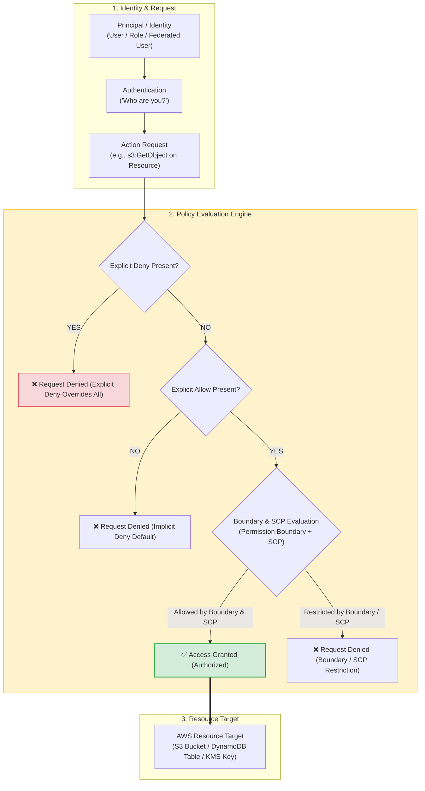
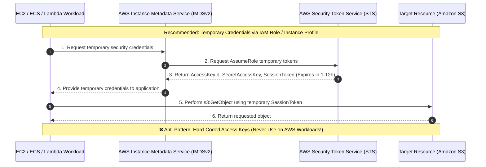
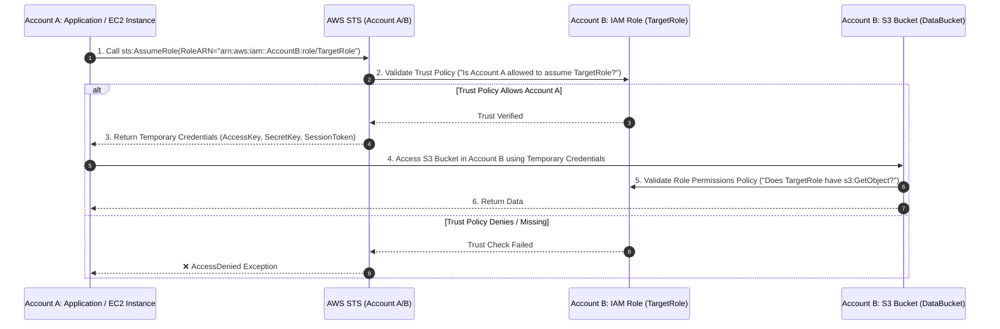
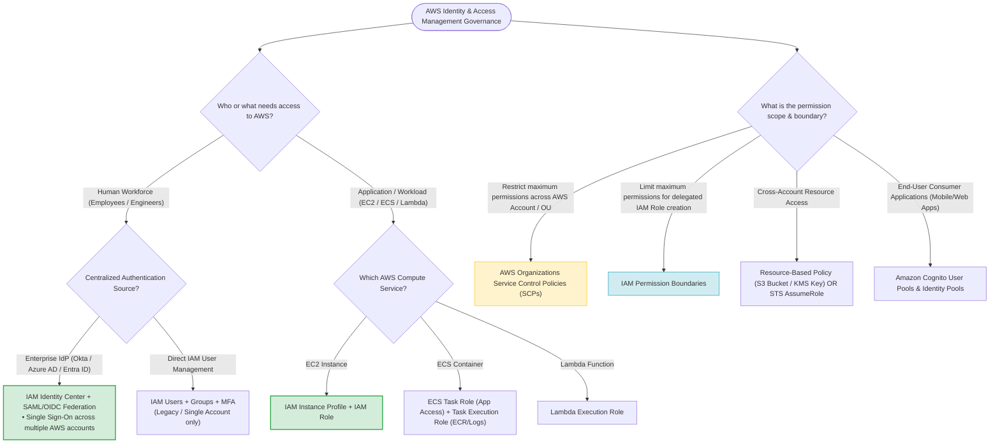

# Task 2.3: Determine Security Controls Based on Requirements — AWS Identity and Access Management (IAM)

> [!NOTE]
> **Exam Mindset**: For the AWS Solutions Architect Professional (SAP-C02) and AI Practitioner (AIP-C01) exams, view **AWS IAM as the foundational control plane engine**. IAM answers the central question: **Who (Principal)** $\rightarrow$ **Can Access (Action)** $\rightarrow$ **What Resource** $\rightarrow$ **Under What Conditions**. The exam tests your ability to select the optimal identity model (Workforce vs. Workload vs. Application End-User), permission boundaries (SCPs vs. Permission Boundaries), least-privilege policy evaluation, temporary credential mechanisms (STS), and cross-account access patterns.

---

## 1. Why IAM Exists

IAM provides centralized authentication and authorization for AWS resources.

```
Without IAM: User ──> Uncontrolled Direct Access ──> AWS Resource
With IAM:    Principal ──> Authentication ("Who are you?") ──> Authorization ("What can you do?") ──> Resource
```

- **Authentication (AuthN)**: Verifies the identity of the user, workload, or federated identity.
- **Authorization (AuthZ)**: Evaluates IAM policies to determine whether the requested action on the resource is permitted.



---

## 2. Core Problems Solved by IAM

- **Authentication & Authorization**: Centralized access management across AWS accounts.
- **Least Privilege**: Restricting permissions to the minimum actions and resources necessary.
- **Temporary Credentials**: Eliminating static long-lived access keys using AWS STS.
- **Cross-Account Access & Delegation**: Secure access between AWS accounts without credential sharing.
- **Workforce Identity Federation**: Integration with enterprise Identity Providers (Entra ID, Okta, Ping, SAML 2.0, OIDC).

---

## 3. Scope of IAM: Global Control Plane Service

IAM is a **global AWS service**. IAM users, roles, groups, permission boundaries, and policies are global objects replicated seamlessly across all AWS Regions.

> [!WARNING]
> Do not confuse global IAM objects with regional AWS resources (e.g., EC2 instances, VPCs, RDS databases, or Lambda functions).

---

## 4. Fundamental IAM Components

$$\text{Principal} \longrightarrow \text{Policy} \longrightarrow \text{Permission} \longrightarrow \text{Resource}$$

- **Principal**: An entity that can request an action on an AWS resource (IAM User, Role, Federated User, AWS Service).
- **Policy**: A JSON document that formally defines permissions.
- **Permission**: The specific allowed or denied actions (`s3:GetObject`, `ec2:RunInstances`).
- **Resource**: The AWS object being accessed (`arn:aws:s3:::my-bucket/*`).

---

## 5. Deep-Dive: IAM User

- Represents a long-term human identity or legacy application identity within a single AWS account.
- **Modern Enterprise Architecture**: AWS recommends using **IAM Identity Center** with external IdP federation instead of managing individual IAM users.

> [!TIP]
> **Exam Trigger**: *"Centralized workforce access using corporate credentials (Entra ID / Okta)"* $\longrightarrow$ **IAM Identity Center + Federation**.

---

## 6. Deep-Dive: IAM Group

- A collection of IAM users used to attach permissions to multiple users simultaneously.
- **Key Property**: An IAM group is **not a principal** and cannot be referenced in an inline policy or assumed via STS.

---

## 7. Deep-Dive: IAM Role

An IAM role is an identity with specific permissions that can be assumed by anyone who needs it for a short duration. Roles provide **temporary security credentials** (`AccessKeyId`, `SecretAccessKey`, `SessionToken`) generated by AWS Security Token Service (STS).

---

## 8. Why IAM Roles Over Static Access Keys?



> [!IMPORTANT]
> **Exam Trap**: Never hard-code static IAM access keys (`AKIA...`) in application code or EC2 configuration files. Always attach an **IAM Instance Profile / IAM Role** to supply automatic temporary credentials.

---

## 9. IAM Execution Role for AWS Lambda

Lambda functions use an **IAM Execution Role** to grant permissions to access other AWS services (DynamoDB, S3, CloudWatch Logs).

---

## 10. IAM Roles for Amazon ECS: Task Role vs. Task Execution Role

| ECS Role Type | Primary Purpose | Examples |
| :--- | :--- | :--- |
| **Task Execution Role** | Used by the **ECS Container Agent** (Infrastructure) | Pulling container images from Amazon ECR; sending container logs to CloudWatch. |
| **Task Role** | Used by the **Application Container** itself | Application reading objects from Amazon S3; writing items to Amazon DynamoDB. |

> [!IMPORTANT]
> **Exam Trigger**: *"Containerized app needs S3 access, and ECS agent needs ECR image pull access"* $\longrightarrow$ **Use Task Role for App and Task Execution Role for ECS Agent**.

---

## 11. IAM Policy Structure & Syntax

```json
{
  "Version": "2012-10-17",
  "Statement": [
    {
      "Sid": "AllowS3ReadWithCondition",
      "Effect": "Allow",
      "Action": ["s3:GetObject", "s3:ListBucket"],
      "Resource": [
        "arn:aws:s3:::company-data-bucket",
        "arn:aws:s3:::company-data-bucket/*"
      ],
      "Condition": {
        "Bool": { "aws:SecureTransport": "true" }
      }
    }
  ]
}
```

---

## 12. Identity-Based Policies vs. Resource-Based Policies

- **Identity-Based Policies**: Attached directly to IAM Users, Groups, or Roles. Grant permissions to the principal.
- **Resource-Based Policies**: Attached directly to AWS resources (S3 Bucket Policies, SQS Queue Policies, SNS Topic Policies, KMS Key Policies, Lambda Resource Policies).

---

## 13. Cross-Account Access via Resource-Based Policies

Resource-based policies allow granting access to principals in another AWS account without requiring those principals to assume an IAM role.

```
Account A Principal ──> Direct Access ──> Account B S3 Bucket (Governed by Account B Bucket Policy)
```

---

## 14. IAM Policy Evaluation Logic

1. **Default State**: All requests are **implicitly denied**.
2. **Explicit Allow**: A request is granted if an applicable identity-based or resource-based policy contains an `Allow`.
3. **Explicit Deny**: If **ANY** policy contains an `Explicit Deny`, it **overrides all Allows** immediately.

---

## 15. The Power of Explicit Deny

```
Allow (s3:GetObject) + Explicit Deny (s3:GetObject on confidential/*) ──> RESULT: DENIED
```

> [!WARNING]
> **Exam Rule**: An `Explicit Deny` in any policy (IAM Policy, Permission Boundary, Resource Policy, or SCP) **ALWAYS** overrides an `Allow`.

---

## 16. IAM Permission Boundaries

A **Permission Boundary** is an advanced feature where an administrator sets the **maximum permissions** that an identity-based policy can grant to an IAM entity.

```
Effective Permissions = IAM Policy Permissions ⋂ Permission Boundary Permissions
```

> [!TIP]
> **Exam Trigger**: *"Allow developers to create IAM roles for their applications, but prevent privilege escalation (cannot grant AdministratorAccess)"* $\longrightarrow$ **IAM Permission Boundaries**.

---

## 17. Service Control Policies (SCPs) in AWS Organizations

**Service Control Policies (SCPs)** are organization-level guardrails that specify the **maximum permissions** for member accounts or Organizational Units (OUs).

- SCPs **do NOT grant permissions**; they act as a boundary filter.
- Applies to all IAM users and roles in member accounts (including the account root user).

---

## 18. Comparative Matrix: SCP vs. Permission Boundary

| Guardrail Type | Scope of Control | Target Entities | Primary Use Case |
| :--- | :--- | :--- | :--- |
| **Service Control Policy (SCP)** | **Multi-Account / Account-Wide** | Entire AWS Accounts or Organizational Units (OUs) | Corporate guardrails (e.g., prevent disabling CloudTrail, restrict Region usage). |
| **Permission Boundary** | **Single Account / IAM Entity** | Specific IAM Users or IAM Roles | Delegated IAM administration (prevent privilege escalation when users create roles). |

---

## 19. AWS IAM Identity Center (Successor to AWS Single Sign-On)

Provides a single location to connect your existing workforce Identity Provider (IdP) and manage access to multiple AWS accounts and cloud applications.

---

## 20. External Identity Federation (SAML 2.0 & OIDC)

```
Enterprise Directory (Entra ID / Okta) ──> SAML 2.0 / OIDC ──> IAM Identity Center ──> AWS Account Permission Sets
```

- Eliminates static IAM user management.
- Provides temporary short-lived credentials for console and CLI access.

---

## 21. IAM Access Analyzer

**IAM Access Analyzer** uses automated reasoning to analyze resource-based policies across your AWS environment and flag resources shared with external accounts or public Internet access.

> [!TIP]
> **Exam Trigger**: *"Identify S3 buckets or KMS keys exposed to external AWS accounts or public access"* $\longrightarrow$ **IAM Access Analyzer**.

---

## 22. IAM Policy Simulator

A testing tool that simulates IAM policy evaluation to test and debug authorization decisions before deploying policies to production.

---

## 23. IAM Credential Report

Generates a downloadable CSV report listing all IAM users in your account and the status of their credentials (password age, MFA enabled, active access keys, last key usage date).

> [!NOTE]
> **Exam Trigger**: *"Audit password age, MFA status, and access key rotation for all account users"* $\longrightarrow$ **IAM Credential Report**.

---

## 24. Multi-Factor Authentication (MFA)

Mandatory security control requiring a second factor (hardware TOTP, virtual authenticator, FIDO2 security key) for access.

---

## 25. Securing the AWS Account Root User

- **Root User**: The identity created when the AWS account is opened. Has complete, unrestrictable administrative control.
- **Best Practices**: Lock away root credentials $\rightarrow$ Enable MFA $\rightarrow$ Delete root access keys $\rightarrow$ Never use root for routine administrative tasks.

---

## 26. IAM Access Keys & Rotation Best Practices

Access keys (`AccessKeyId` + `SecretAccessKey`) are long-lived credentials for programmatic CLI/API access.
- **Rule**: Avoid static access keys on AWS compute; use IAM Roles instead. If static keys are required for external systems, rotate them regularly.

---

## 27. AWS Security Token Service (STS)

**AWS STS** is the web service that issues short-lived temporary credentials (`sts:AssumeRole`, `sts:GetSessionToken`, `sts:AssumeRoleWithWebIdentity`).

---

## 28. Enterprise Cross-Account Access Pattern



---

## 29. Role Trust Policy vs. Role Permissions Policy

- **Trust Policy (Inbound)**: Specifies **WHO** is allowed to assume the role (`Principal: { "AWS": "arn:aws:iam::111122223333:root" }`).
- **Permissions Policy (Outbound)**: Specifies **WHAT** actions the role can perform once assumed (`Action: "s3:GetObject"`).

---

## 30. Enforcing Least-Privilege Permissions

Granting only the permissions required to perform a task. Avoid wildcard permissions (`Action: "*"` and `Resource: "*"`) in production environments.

---

## 31. IAM Policy Condition Keys

Condition blocks add context-aware rules to IAM policy statements:
- `aws:SourceIp`: Restricts access to specific corporate IP ranges.
- `aws:PrincipalOrgID`: Ensures requests come from accounts within a specific AWS Organization.
- `aws:MultiFactorAuthPresent`: Requires MFA authentication for sensitive actions.
- `aws:SecureTransport`: Enforces HTTPS access (denies unencrypted HTTP requests).

---

## 32. IAM Interaction with AWS KMS Encryption

Accessing KMS-encrypted data (e.g., encrypted S3 objects or EBS volumes) requires authorization from **BOTH** the caller's IAM Policy **AND** the KMS Key Policy.

---

## 33. IAM and Amazon S3 Authorization Model

S3 bucket access is governed by the evaluation of four security layers:
1. **IAM Identity-Based Policy**
2. **S3 Bucket Resource-Based Policy**
3. **KMS Key Policy** (if SSE-KMS encryption is enabled)
4. **S3 Block Public Access** settings

---

## 34. Layered Security: IAM vs. Network Controls

```
IAM Policy ──> Controls WHO can perform actions (Identity Layer)
Security Groups ──> Controls WHICH ENIs/IPs can connect (Network Layer - Stateful)
Network ACLs ──> Controls WHICH Subnets can traffic flow (Network Layer - Stateless)
VPC Endpoint Policy ──> Controls WHICH Resources can be accessed via VPC Endpoint
```

---

## 35. IAM and AWS Secrets Manager Integration

Do **NOT** store database passwords, API tokens, or private keys inside IAM policies or application source code. Store secrets in **AWS Secrets Manager**, and use IAM Roles to control access to `secretsmanager:GetSecretValue`.

---

## 36. Operational Overhead of IAM Architecture

IAM has zero infrastructure maintenance overhead, but introduces governance overhead in large enterprises. Using **IAM Identity Center** with **AWS Organizations** drastically reduces workforce management overhead.

---

## 37. Cost Model of IAM

IAM, STS, and IAM Identity Center are **free features of AWS**. Operational cost savings are achieved by automating access management via federation and IAM Roles rather than managing individual static keys.

---

## 38. IAM vs. IAM Identity Center Comparison

| Requirement Scenario | Target Architectural Choice |
| :--- | :--- |
| **Application running on EC2 needs AWS access** | **IAM Role (Instance Profile)** |
| **Lambda function accessing DynamoDB** | **Lambda Execution Role** |
| **ECS Container application accessing AWS** | **ECS Task Role** |
| **Corporate employees accessing AWS Console** | **IAM Identity Center + Federation** |
| **Employees accessing multiple AWS accounts** | **IAM Identity Center + Permission Sets** |
| **Cross-account application integration** | **IAM Role + STS AssumeRole** |
| **Enforce account-wide security guardrails** | **Organizations Service Control Policies (SCPs)** |
| **Prevent privilege escalation when creating roles** | **IAM Permission Boundaries** |

---

## 39. IAM vs. Amazon Cognito

- **AWS IAM**: Authorizes **AWS employees, administrators, and AWS workloads** to manage AWS infrastructure and services.
- **Amazon Cognito**: Authenticates and authorizes **external application end-users** (mobile and web application customers).

---

## 40. IAM vs. AWS Secrets Manager

- **IAM**: Defines **authorization permissions** (*"Who is allowed to fetch the database credentials?"*).
- **AWS Secrets Manager**: Securely **stores, encrypts, and rotates credentials** (*"Where is the database password stored?"*).

---

## 41. IAM vs. AWS Key Management Service (KMS)

- **IAM**: Controls service management and operational permissions.
- **AWS KMS**: Manages cryptographic keys and executes `Encrypt` / `Decrypt` operations governed by Key Policies.

---

## 42. IAM Policy vs. Service Control Policy (SCP)

- **IAM Policy**: Grants or denies permissions to individual principals within an account.
- **SCP**: Defines the absolute maximum permission boundary for an entire account or OU. An SCP cannot grant access if an IAM policy omits it.

---

## 43. Identity-Based Policy vs. Resource-Based Policy

Resource-based policies allow granting access to cross-account principals directly without requiring the caller to assume an IAM role, retaining original principal context.

---

## 44. SAP-C02 Identity & Permission Governance Architecture Decision Tree



---

## 45. SAP-C02 Exam Keyword Cheat Sheet

```
"Least privilege permissions"          ──> Narrow IAM Policy (Specific Action & Resource)
"Temporary security credentials"       ──> IAM Roles / AWS STS AssumeRole
"EC2 application accessing S3"         ──> IAM Instance Profile + IAM Role
"ECS container app accessing AWS"      ──> ECS Task Role
"ECS agent pulling ECR images"         ──> ECS Task Execution Role
"Corporate identity directory access"  ──> IAM Identity Center + SAML/OIDC
"Prevent privilege escalation"         ──> IAM Permission Boundaries
"Account-wide security guardrails"     ──> Organizations Service Control Policies (SCPs)
"Audit IAM user credential status"     ──> IAM Credential Report
"Identify external resource sharing"   ──> IAM Access Analyzer
"Application end-user login"           ──> Amazon Cognito
"Store & rotate DB credentials"        ──> AWS Secrets Manager
```

---

## 46. The Core SAP-C02 Mental Model

```
Principal ➔ Identity Authentication ➔ Policy Evaluation ➔ Least Privilege ➔ Temporary Credentials ➔ Resource Boundaries ➔ Audit
```

### Core Architecture Reference
- **Workforce Humans**: `IAM Identity Center` $\rightarrow$ Enterprise IdP Federation $\rightarrow$ Permission Sets.
- **Application Workloads**: `IAM Roles` $\rightarrow$ Temporary Credentials via STS / IMDS.
- **Account Guardrails**: `Service Control Policies (SCPs)` $\rightarrow$ Enforce organizational boundaries.
- **Delegated Role Creation**: `IAM Permission Boundaries` $\rightarrow$ Prevent privilege escalation.
- **Audit & Analysis**: `CloudTrail` + `IAM Access Analyzer` $\rightarrow$ Verify least-privilege compliance.

---

## 47. Final Exam Priority Rule

When evaluating multiple technically valid answers on the SAP-C02 exam, prioritize options in this exact hierarchy:
1. **Security & Least-Privilege Requirement Compliance**
2. **Use of Temporary Credentials (IAM Roles / STS over static keys)**
3. **Centralized Identity & Governance (IAM Identity Center + SCPs)**
4. **Lowest Operational Overhead & Managed AWS Capabilities**
5. **Cost Optimization**