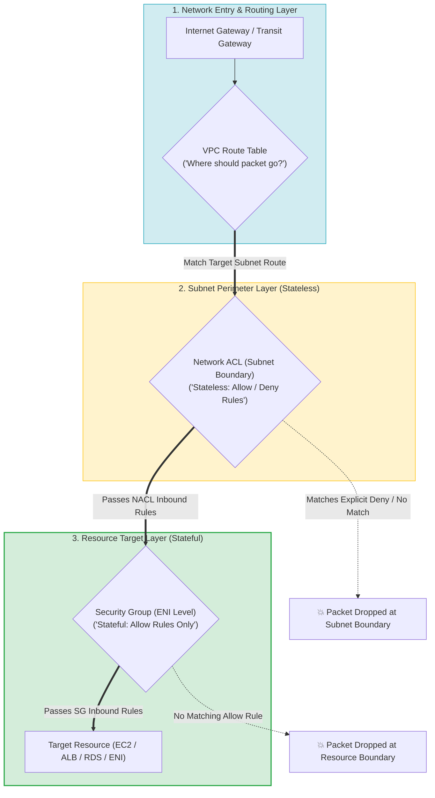
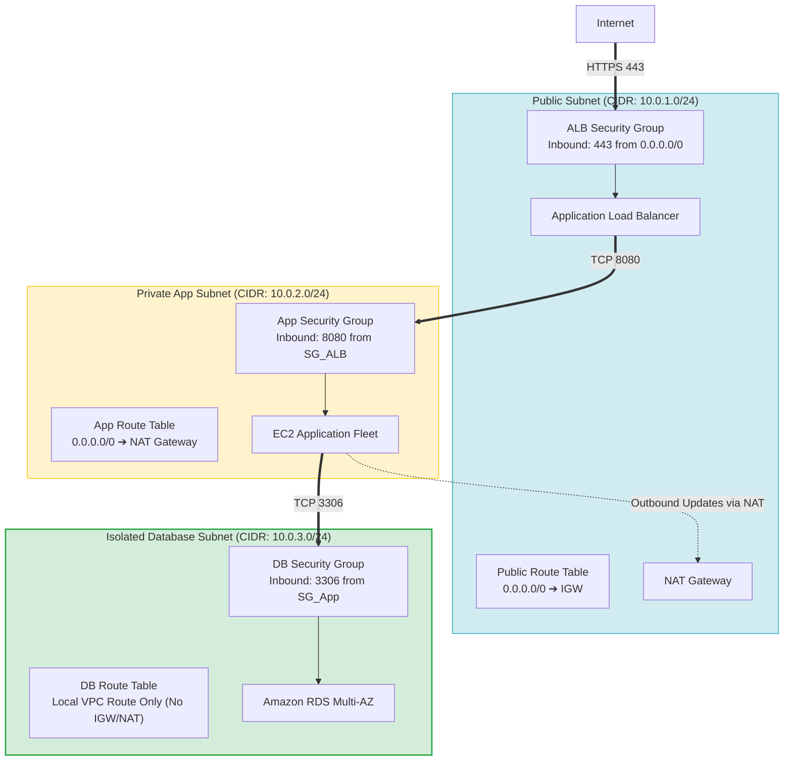
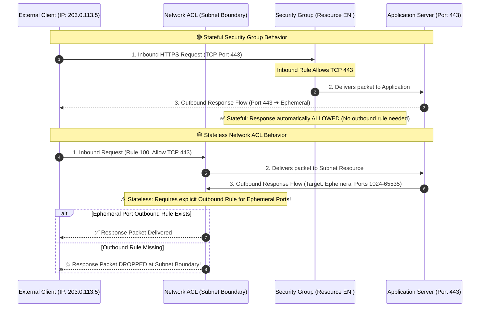
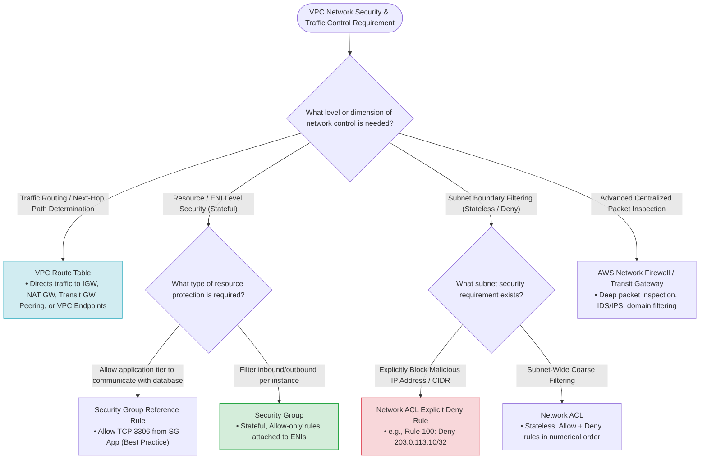

# Task 2.3: Determine Security Controls Based on Requirements — Route Tables, Security Groups, and Network ACLs

> [!NOTE]
> **Exam Mindset**: For the AWS Solutions Architect Professional (SAP-C02) and AI Practitioner (AIP-C01) exams, treat **Route Tables**, **Security Groups**, and **Network ACLs** as three distinct, complementary layers of VPC traffic management and network security governance:
> - **Route Table** $\rightarrow$ **Where should traffic go?** (Path Determination)
> - **Network ACL** $\rightarrow$ **Which traffic can cross the subnet boundary?** (Subnet Boundary Protection - Stateless)
> - **Security Group** $\rightarrow$ **Which traffic can reach the specific resource?** (Resource/ENI Protection - Stateful)

---

## 1. VPC Network Security & Traffic Control Architecture



Traffic processing order for incoming packets:
$$\text{Internet Gateway} \longrightarrow \text{Route Table} \longrightarrow \text{Subnet NACL (Inbound)} \longrightarrow \text{Security Group (Inbound)} \longrightarrow \text{Target ENI / EC2}$$

---

## 2. Route Tables: Path & Next-Hop Determination

### Purpose & Architecture
A **Route Table** contains a set of rules (routes) used to determine where network traffic from your subnet or gateway is directed.

```
Destination: 10.0.0.0/16  ──> Target: local (VPC Internal Communication)
Destination: 0.0.0.0/0     ──> Target: igw-xxxxxx (Internet Gateway for Public Subnet)
Destination: 0.0.0.0/0     ──> Target: nat-xxxxxx (NAT Gateway for Private Subnet)
```

### Supported Route Targets
- **Internet Gateway (IGW)**: Direct public Internet access.
- **NAT Gateway / NAT Instance**: Outbound Internet access for private subnets.
- **Transit Gateway (TGW)**: Multi-VPC and hybrid network interconnectivity.
- **VPC Peering Connection**: Direct VPC-to-VPC routing.
- **Virtual Private Gateway (VGW)**: AWS Site-to-Site VPN or AWS Direct Connect.
- **Gateway Load Balancer Endpoint (GWLBE)**: Centralized inline security appliance routing.
- **VPC Endpoints (Gateway Type)**: S3 and DynamoDB direct VPC routing.

> [!NOTE]
> **Key Exam Principle**: A Route Table is a **routing control mechanism**, not a security filter. Every subnet must be associated with a Route Table (uses VPC Main Route Table by default if unassigned). Route tables carry zero direct hourly charges.

---

## 3. Security Groups: Stateful Resource-Level Firewalls

### Purpose & Architecture
A **Security Group (SG)** acts as a virtual firewall for your EC2 instances and ENIs to control inbound and outbound traffic at the individual resource level.



### Key Security Group Properties
- **Stateful**: If an inbound request is permitted, response traffic is automatically allowed out regardless of outbound rules.
- **Allow Rules Only**: You cannot create explicit `Deny` rules in a Security Group.
- **Security Group Chaining**: Rules can reference **other Security Group IDs** as sources/destinations (e.g., DB SG allows port 3306 only from App SG ID), avoiding fragile static IP ranges.
- **ENI Association**: Attached directly to Elastic Network Interfaces (ENIs).

> [!TIP]
> **Exam Trigger**: *"Allow application instances to communicate with database instances securely without specifying IP addresses"* $\longrightarrow$ **Reference the Application Security Group ID inside the Database Security Group inbound rules**.

---

## 4. Network ACLs: Stateless Subnet-Level Perimeter Protection

### Purpose & Architecture
A **Network Access Control List (NACL)** is an optional layer of security for your VPC that acts as a stateless firewall for controlling traffic in and out of one or more subnets.



### Key Network ACL Properties
- **Stateless**: Return traffic must be explicitly allowed by outbound rules.
- **Supports Explicit Allow & Deny Rules**: Can block specific IP addresses (`Deny 203.0.113.10/32`).
- **Numerical Rule Ordering**: Rules are evaluated in strict ascending numerical order (e.g., Rule 100 before Rule 200). The **first rule matching traffic is applied**, and evaluation stops.
- **Default NACL vs. Custom NACL**: Default NACL allows all inbound and outbound traffic; custom NACL denies all traffic until rules are added.

---

## 5. Security Group vs. Network ACL Master Comparison Matrix

| Feature | Security Group (SG) | Network Access Control List (NACL) |
| :--- | :--- | :--- |
| **Operating Level** | Resource / ENI Level | Subnet Boundary Level |
| **Statefulness** | **Stateful** (Return traffic automatically allowed) | **Stateless** (Return traffic requires explicit outbound rule) |
| **Supported Rules** | **Allow rules ONLY** | **Allow AND Deny rules** |
| **Rule Evaluation** | All rules evaluated simultaneously | Evaluated in numerical order (Lowest rule number wins) |
| **Ephemeral Port Requirement**| Not required (Handled statefully) | **Required** for return traffic (Ports 1024-65535) |
| **Target Association** | Attached to Elastic Network Interfaces (ENIs) | Associated with Subnets |
| **Default Behavior** | Denies all inbound; Allows all outbound | Default NACL Allows all; Custom NACL Denies all |
| **Referencing Capabilities** | Can reference other Security Group IDs | Can only reference IP addresses / CIDR blocks |

---

## 6. Route Table vs. Security Group vs. Network ACL Model

$$\text{Route Table (Path)} \longrightarrow \text{Network ACL (Subnet Boundary)} \longrightarrow \text{Security Group (Resource Protection)}$$

1. **Route Table**: *"Which network path or gateway should the packet take?"*
2. **Network ACL**: *"Is this packet allowed to enter or leave the subnet boundary?"*
3. **Security Group**: *"Is this packet allowed to connect to this specific server/database interface?"*

---

## 7. Architectural Pattern: Three-Tier Web Application Security

```
User ──> Internet Gateway ──> Public Subnet (Route: 0.0.0.0/0 -> IGW | SG: Allow 443) 
                            └──> ALB ──> Private App Subnet (Route: 0.0.0.0/0 -> NAT GW | SG: Allow 8080 from ALB-SG)
                                       └──> Isolated DB Subnet (Route: Local Only | SG: Allow 3306 from App-SG)
```

---

## 8. Critical Exam Trap: Stateful vs. Stateless Return Flows

- **Security Group (Stateful)**: An inbound rule allowing TCP 443 automatically permits outbound response packets on ephemeral ports.
- **Network ACL (Stateless)**: An inbound rule allowing TCP 443 **FAILS** to return data unless an outbound NACL rule permits ephemeral return ports (TCP 1024-65535).

> [!WARNING]
> **Exam Trap**: If a scenario states that outbound response traffic is being blocked despite inbound NACL allow rules, verify that the outbound NACL includes an **Allow rule for Ephemeral Ports (TCP 1024-65535)**.

---

## 9. Critical Exam Trap: Blocking Malicious IP Addresses

Security Groups **do NOT support Deny rules**. If a scenario requires blocking traffic from a specific malicious IP address or CIDR range:
- Use a **Network ACL explicit Deny rule** at a lower rule number than Allow rules (e.g., Rule 50 `DENY 203.0.113.5/32`, Rule 100 `ALLOW 0.0.0.0/0`).
- Alternatively, use **AWS WAF** for HTTP/HTTPS Layer 7 IP blocking or **AWS Network Firewall**.

> [!IMPORTANT]
> **Exam Trigger**: *"Block traffic from a specific single IP address across an entire subnet"* $\longrightarrow$ **Network ACL explicit Deny rule**.

---

## 10. Resource-Level vs. Subnet-Level Protection

- **Resource-Level**: Use Security Group chaining (`App-SG` $\rightarrow$ `DB-SG`) for fine-grained application tier isolation.
- **Subnet-Level**: Use Network ACLs for broad organizational network boundaries (e.g., blocking non-routable IP ranges or entire country CIDRs across all subnet resources).

---

## 11. Route Tables vs. Security Controls

A Route Table creates network paths, but does **NOT** enforce security filtering. Having a route to a NAT Gateway or Internet Gateway does not bypass Security Group or NACL restrictions.

---

## 12. Public Subnet Requirements

A subnet is considered a **Public Subnet** if and only if its associated Route Table has an explicit route pointing to an **Internet Gateway (`0.0.0.0/0` $\rightarrow$ `igw-xxxxxx`)**.

For resources in a public subnet to communicate with the Internet, they require:
1. Public IPv4 address or Elastic IP (EIP)
2. Route Table entry pointing to IGW
3. Security Group inbound/outbound permission
4. Network ACL inbound/outbound permission

---

## 13. Private Subnets and NAT Gateways

Private subnets use a Route Table entry pointing to a **NAT Gateway (`0.0.0.0/0` $\rightarrow$ `nat-xxxxxx`)** located in a Public Subnet.
- Enables outbound Internet connections for software patches/updates.
- Prevents unsolicited inbound connections from the public Internet.

---

## 14. Related AWS Networking & Security Services Integration

- **Route Tables**: VPC, Internet Gateway, NAT Gateway, Transit Gateway, VPC Peering, Direct Connect, VPC Endpoints.
- **Security Groups**: EC2, ALB, NLB, RDS, ElastiCache, ECS, EKS, Lambda (VPC Mode), ENIs.
- **Network ACLs**: VPC Subnets.

---

## 15. AWS Transit Gateway Integration

In enterprise multi-VPC hub-and-spoke topologies, **Transit Gateway Route Tables** dictate inter-VPC and hybrid traffic paths, while VPC Route Tables direct local traffic, and SGs/NACLs govern endpoint security.

---

## 16. AWS Network Firewall Integration

When requirements demand **deep packet inspection**, domain name filtering (FQDN), stateful intrusion prevention (IPS/IDS), or centralized inspection VPCs, use **AWS Network Firewall** instead of NACLs.

---

## 17. Networking & Security Cost Comparison Matrix

| Component | Hourly Direct Charge | Data Processing / Transfer Charge | Exam Cost Takeaway |
| :--- | :---:| :---:| :--- |
| **VPC Route Table** | **Free ($0)** | **None** | Pure configuration object |
| **Security Group** | **Free ($0)** | **None** | Free native security control |
| **Network ACL** | **Free ($0)** | **None** | Free native subnet filter |
| **NAT Gateway** | Yes (~$0.045/hr) | Yes per GB processed | Costly for large data flows |
| **Transit Gateway** | Yes per attachment | Yes per GB processed | Multi-VPC hub cost |
| **AWS Network Firewall** | Yes per endpoint/hr | Yes per GB inspected | Advanced inspection cost |

> [!TIP]
> **Cost Principle**: Do not introduce expensive services (AWS Network Firewall or Transit Gateway) when native, free VPC controls (Security Groups & Route Tables) completely satisfy the requirement.

---

## 18. Why Choose Security Groups over Network ACLs?

- **Stateful simplicity**: No need to manage return traffic rules.
- **Granular Security Group Chaining**: SG-to-SG rules automatically adapt as auto-scaling instances are added or replaced without hardcoding IP addresses.

---

## 19. Why Choose Network ACLs over Security Groups?

- **Explicit Deny capabilities**: Block bad actors or malicious CIDRs.
- **Subnet-wide enforcement**: Imposes security boundaries across all instances in a subnet regardless of SG assignments.

---

## 20. Advanced Routing Architecture: Inspection VPC Pattern

Route tables can steer traffic through a centralized **Inspection VPC** containing AWS Network Firewall or third-party appliances before forwarding traffic to destination application VPCs.

---

## 21. Exam Trap: Default NACL vs. Default Security Group

- **Default Security Group**: Denies all inbound traffic; Allows all outbound traffic. Allows all communication between ENIs assigned to the same default SG.
- **Default Network ACL**: Allows all inbound and outbound traffic (`Rule 100 ALLOW 0.0.0.0/0`).

---

## 22. Exam Trap: Network ACL Rule Ordering Logic

NACL rules evaluate in **ascending numerical order** (`Rule 10`, `Rule 20`, `Rule 100`). The first rule that matches packet criteria is executed, and **all subsequent rules are ignored**.
- Put explicit `Deny` rules at lower rule numbers than general `Allow` rules.

---

## 23. Exam Trap: Security Group References vs. CIDR Ranges

```
Better: DB SG Allows TCP 3306 from App SG ID (sg-12345678)
Worse:  DB SG Allows TCP 3306 from 10.0.0.0/16 (VPC CIDR)
```
Security group references prevent unauthorized EC2 instances in the same VPC from accessing the database.

---

## 24. SAP-C02 Network Traffic Control & Security Decision Engine



---

## 25. SAP-C02 Keyword Cheat Sheet

```
"Where should traffic be routed?"          ──> Route Table
"Outbound Internet for private instances" ──> Route Table + NAT Gateway
"Stateful instance firewall"              ──> Security Group
"Reference another Security Group"        ──> Security Group Reference Rule
"Block specific IP address / CIDR"        ──> Network ACL (Explicit Deny)
"Stateless subnet firewall"              ──> Network ACL (Ephemeral Ports Required)
"Ascending numerical rule evaluation"     ──> Network ACL
"Centralized deep packet inspection"     ──> AWS Network Firewall / Transit Gateway
```

---

## 26. The Core SAP-C02 Mental Model

- **Route Table** = **PATH** (*Where does traffic go?*)
- **Security Group** = **RESOURCE ACCESS** (*Stateful ENI firewall*)
- **Network ACL** = **SUBNET BOUNDARY** (*Stateless subnet firewall with Deny rules*)

---

## 27. Final Exam Decision Shortcuts

- If requirement asks for **path determination** $\rightarrow$ **Route Table**.
- If requirement asks for **instance-level stateful rules** $\rightarrow$ **Security Group**.
- If requirement asks to **block an IP address** $\rightarrow$ **Network ACL**.
- If requirement asks for **DB access from App tier** $\rightarrow$ **Security Group chaining (App-SG ID)**.
- If requirement mentions **return traffic blocked on stateless filter** $\rightarrow$ **NACL Ephemeral Ports**.