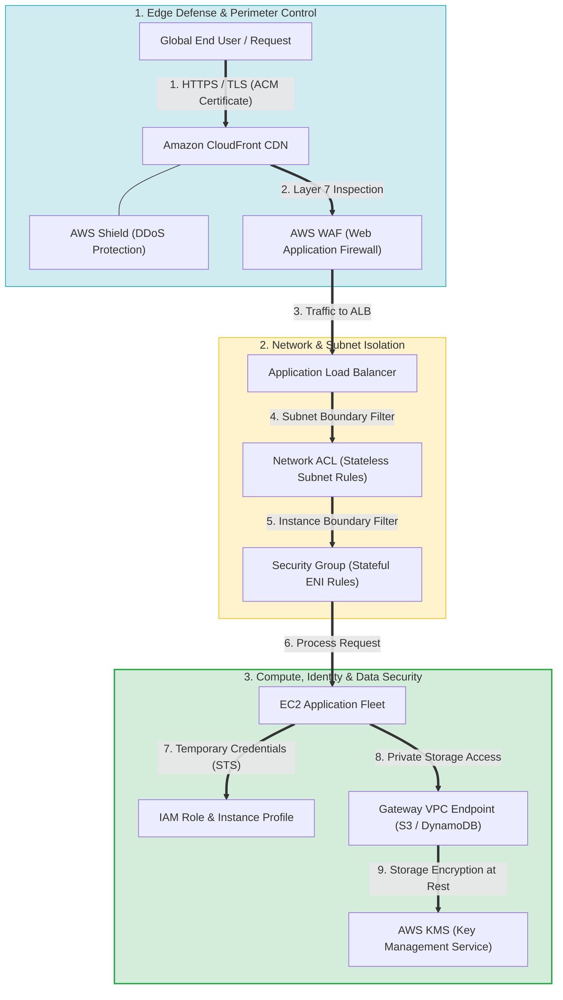
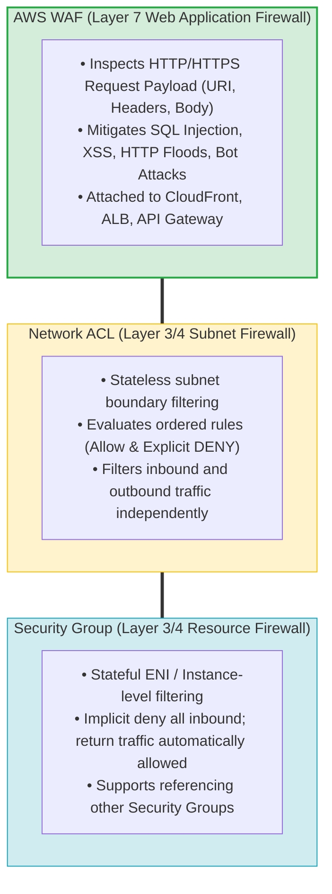
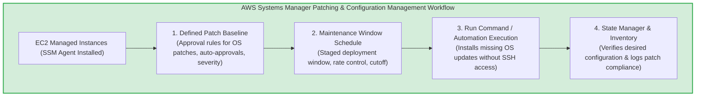
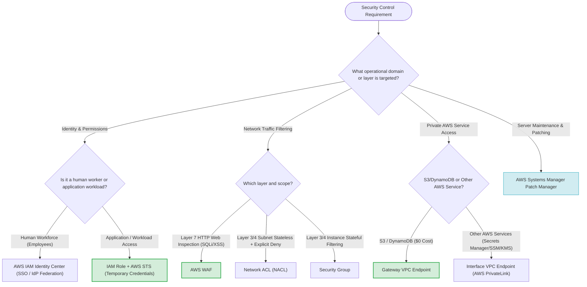

> [!NOTE]
> **Exam Mindset**: For the AWS Solutions Architect Professional (SAP-C02) and AI Practitioner (AIP-C01) exams, security design follows a strict evaluation chain:
> **Requirement** $\rightarrow$ **Security Control** $\rightarrow$ **AWS Service** $\rightarrow$ **Operational Overhead** $\rightarrow$ **Cost Impact** $\rightarrow$ **Architecture Trade-Off**.
> Master the six core skill domains:
> 1. IAM Least Privilege & Identity Governance
> 2. Network Filtering (Security Groups vs. NACLs)
> 3. Web Application Attack & DDoS Mitigation
> 4. Encryption at Rest & Data in Transit
> 5. Private VPC Service Endpoints
> 6. Automated Systems Patch & Configuration Management

---

## 1. Skill Domain 1: IAM Least Privilege & Identity Governance

IAM controls authentication and authorization across AWS resources.



### Identity Selection Hierarchy
- **Human Workforce**: **AWS IAM Identity Center** (Single Sign-On / IdP Federation).
- **Application Workloads**: **IAM Roles** (Instance Profiles, ECS Task Roles, Lambda Execution Roles).
- **Temporary Access**: **AWS STS** (`AssumeRole`).
- **Long-Lived Access Keys (`AKIA...`)**: **Avoid entirely**.

> [!TIP]
> **Exam Trigger**: *"Application running on EC2 needs access to S3"* $\longrightarrow$ Attach an **IAM Role / Instance Profile**. Never store static access keys on compute instances.

---

## 2. Skill Domain 2: Network Traffic Control (Security Groups vs. Network ACLs)



### SG vs. NACL vs. WAF Feature Comparison

| Control Mechanism | Operating Layer | Enforcement Level | Statefulness | Key Capability |
| :--- | :--- | :--- | :--- | :--- |
| **Security Group** | Layer 3/4 (Network/Transport) | ENI / Instance Level | **Stateful** (Return traffic auto-allowed) | References other SGs; Default deny inbound. |
| **Network ACL (NACL)**| Layer 3/4 (Network/Transport) | Subnet Boundary Level | **Stateless** (Must allow return ephemeral ports)| Supports **Explicit DENY** rules & IP CIDR blocks. |
| **AWS WAF** | **Layer 7 (Application)** | Web Front-End (ALB/CloudFront)| **Stateful** | Inspects **HTTP request body, headers, SQLi, XSS**. |

---

## 3. Skill Domain 3: Web Application Attack & DDoS Mitigation

### Multi-Layer Perimeter Security Pipeline
```
User ──> Route 53 ──> CloudFront CDN + AWS Shield ──> AWS WAF ──> ALB ──> Web Application Fleet
```

- **AWS Shield Standard**: Automatic, free Layer 3/4 DDoS protection for all AWS endpoints.
- **AWS Shield Advanced**: Managed protection with 24/7 DDoS Response Team (SRT) and DDoS cost protection for scaling charges.
- **AWS WAF**: Filters malicious HTTP payloads (SQLi, XSS, Rate-Limiting, Bot Control).
- **Amazon CloudFront**: Absorbs volumetric traffic at edge locations, reducing origin server exposure.
- **AWS Firewall Manager**: Centralizes WAF and Security Group policy enforcement across AWS Organizations.

---

## 4. Skill Domain 4: Encryption at Rest & Data in Transit

### Encryption at Rest (Storage)
- Protects static data stored on S3, EBS, RDS, Aurora, EFS, and DynamoDB.
- **AWS KMS Key Types**:
  - **AWS Managed Keys**: Low operational overhead ($0 key fee).
  - **Customer Managed Keys (CMKs)**: Required for custom key policies, manual key rotation, cross-account sharing, and strict audit compliance.

### Encryption in Transit (Network)
- Enforces **TLS/HTTPS** protocols for all moving network payloads using certificates issued by **AWS Certificate Manager (ACM)**.

---

## 5. Skill Domain 5: Private VPC Service Endpoints

Eliminates the requirement for Internet Gateways or NAT Gateways when private subnets access AWS services.

```
Private EC2 ──> Gateway Endpoint ──> Amazon S3 / DynamoDB ($0 Cost)
Private EC2 ──> Interface Endpoint (PrivateLink) ──> Secrets Manager / SSM / KMS (Paid ENI)
```

| Endpoint Type | Supported Services | Deployment Mechanism | Pricing Model |
| :--- | :--- | :--- | :--- |
| **Gateway Endpoint** | **Amazon S3 & DynamoDB ONLY** | Target entry in VPC Route Table | **FREE ($0)** (No hourly or processing fees) |
| **Interface Endpoint**| Secrets Manager, SSM, KMS, ECR, SQS, 100+ Services | Subnet ENI with Security Group | **PAID** (Hourly fee per ENI/AZ + Data processing fees) |

---

## 6. Skill Domain 6: Patch & Configuration Management

**AWS Systems Manager (SSM)** automates operating system patching and configuration management without requiring SSH/RDP access.



### Core Systems Manager Components
- **Patch Manager**: Automates OS patching according to defined **Patch Baselines**.
- **Maintenance Windows**: Schedules maintenance execution times to prevent production disruption.
- **State Manager**: Prevents configuration drift by enforcing desired node states.
- **Run Command**: Executes administrative scripts at scale without SSH keys.

---

## 7. Integrated Enterprise Production Architecture

```
User ──> Route 53 ──> CloudFront + Shield ──> WAF ──> ALB (SG) ──> Private Subnet EC2 (SG + IAM Role + SSM Agent)
                                                                       ├── S3 Access ──> Gateway Endpoint ($0)
                                                                       ├── Secrets Access ──> Interface Endpoint (PrivateLink)
                                                                       └── Database ──> RDS MySQL (KMS Encrypted at Rest)
```

---

## 8. SAP-C02 Security Decision Matrix

| Requirement | Primary AWS Answer | Key Architectural Rationale |
| :--- | :--- | :--- |
| **Least privilege IAM access** | **IAM Custom Policies + Roles** | Limit permissions to exact actions/resources. |
| **EC2 accessing S3 securely** | **IAM Instance Profile / Role** | Avoid storing static credentials on instance. |
| **Workforce single sign-on** | **AWS IAM Identity Center** | Centralized SSO across AWS accounts. |
| **Temporary cross-account access**| **AWS STS (`AssumeRole`)** | Short-lived credentials via trust policies. |
| **Instance network boundary** | **Security Group** | Stateful, resource-level filtering. |
| **Subnet explicit DENY rule** | **Network ACL (NACL)** | Stateless, subnet-level ordered filtering. |
| **SQL Injection / XSS defense** | **AWS WAF** | Layer 7 HTTP request payload inspection. |
| **DDoS attack mitigation** | **AWS Shield (Standard/Advanced)** | Layer 3/4 network volume protection. |
| **Private S3 access from VPC** | **S3 Gateway VPC Endpoint** | **$0 cost**, route table target, no NAT needed. |
| **Private Secrets Manager access** | **Interface VPC Endpoint** | Subnet ENI powered by AWS PrivateLink. |
| **Centralized OS patching** | **SSM Patch Manager** | Automated patching via Maintenance Windows without SSH. |
| **Configuration drift control** | **SSM State Manager** | Enforces consistent node configuration. |

---

## 9. SAP-C02 Master Security Controls Selection Engine



---

## 10. SAP-C02 Exam Keyword Cheat Sheet

```
"Application access to S3"           ──> IAM Role
"Explicit network DENY rule"          ──> Network ACL (NACL)
"Stateful instance firewall"          ──> Security Group
"SQL injection / XSS mitigation"      ──> AWS WAF
"DDoS attack protection"              ──> AWS Shield
"Zero-cost private S3 access"         ──> S3 Gateway VPC Endpoint
"Private access to Secrets Manager"   ──> Interface VPC Endpoint (PrivateLink)
"Patch 1,000 EC2 instances without SSH"──> Systems Manager Patch Manager
"Manage TLS certificates"             ──> AWS Certificate Manager (ACM)
"Customer controls KMS key policies"  ──> Customer Managed KMS Key (CMK)
```

---

## 11. Final Exam Mental Model Shortcuts

- **IAM** = Who can perform what actions on which resources?
- **Security Group** = Stateful resource firewall.
- **NACL** = Stateless subnet boundary firewall (supports explicit DENY).
- **AWS WAF** = Is this HTTP request malicious (SQLi/XSS)?
- **AWS Shield** = Is the application undergoing a DDoS attack?
- **AWS KMS** = How is data encrypted at rest and who controls the key?
- **VPC Endpoint** = Private network path from VPC to AWS services (Gateway = $0 for S3/DynamoDB; Interface = PrivateLink).
- **Systems Manager** = How do I automate server management and patching at scale?