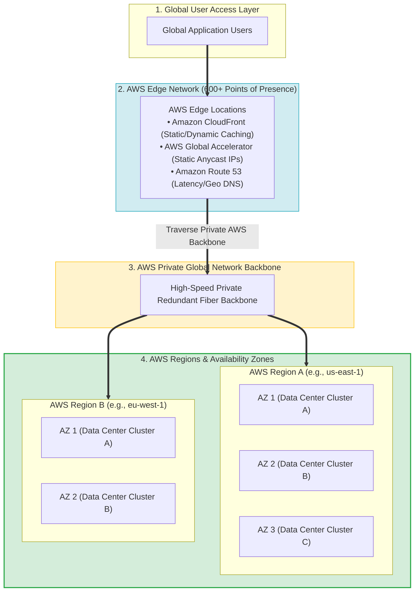
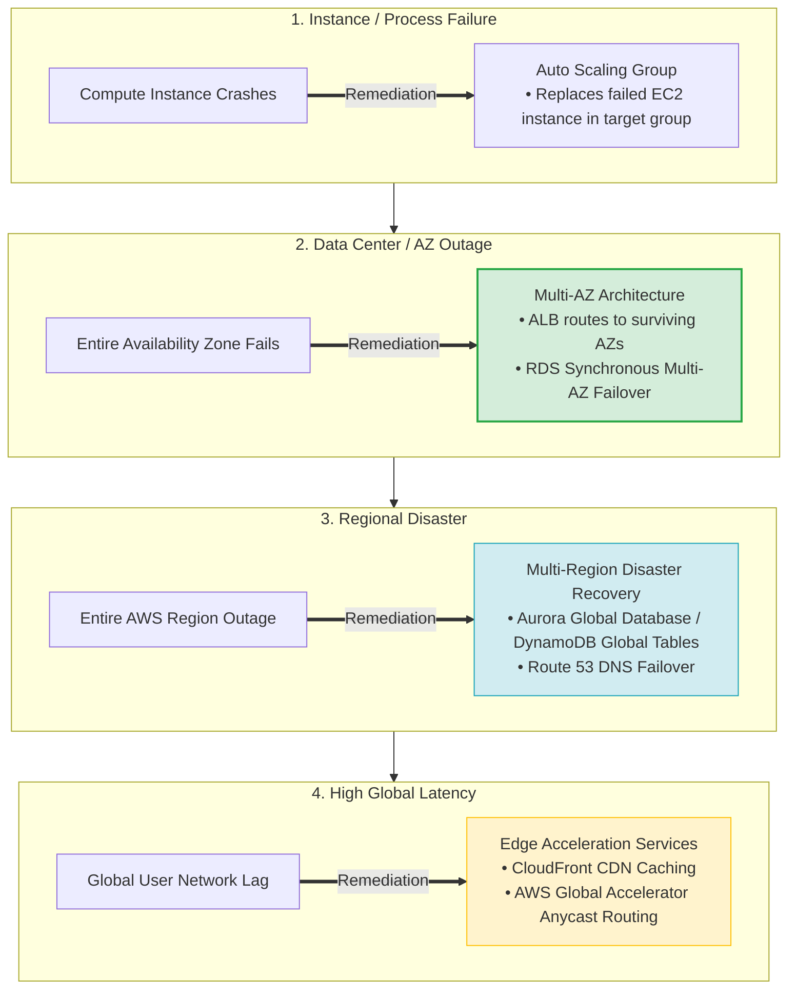
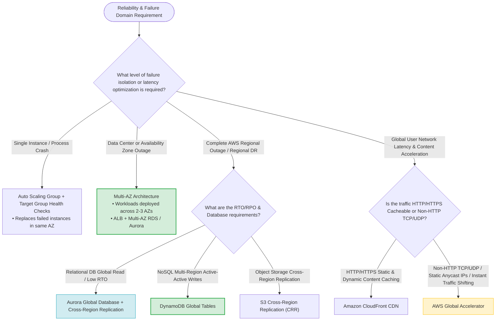

# Task 2.4: Design a Strategy to Meet Reliability Requirements — AWS Global Infrastructure

> [!NOTE]
> **Exam Mindset**: For the AWS Solutions Architect Professional (SAP-C02) and AI Practitioner (AIP-C01) exams, do not treat AWS Global Infrastructure as an abstract overview. View it as the foundational building block for:
> 1. **Failure Domain Isolation**: Matching workloads to Instance $\rightarrow$ AZ $\rightarrow$ Regional failure boundaries.
> 2. **Global Performance**: Routing traffic over the AWS global network backbone via Edge services (CloudFront & Global Accelerator).
> 3. **Cost vs. Resilience Alignment**: Selecting the least complex, lowest-cost failure domain that satisfies RTO and RPO requirements.

---

## 1. Why AWS Global Infrastructure Exists



### Core Problems Solved
- **High Application Availability**: Prevents single points of failure across data center outages.
- **Regional Disaster Recovery**: Protects operations against catastrophic regional events.
- **Fault Isolation**: Contains blast radiuses within isolated infrastructure boundaries.
- **Global User Latency Reduction**: Delivers content close to end users via edge caching and Anycast routing.
- **Data Residency Compliance**: Ensures data remains within specific geographic and legal boundaries.

---

## 2. AWS Regions: Geographic Isolation Boundary

An **AWS Region** is a physical geographic location containing multiple isolated Availability Zones connected via low-latency network links.

### Key Architectural Rules
- **Geographic Isolation**: Regions operate completely independently of one another.
- **Outage Protection**: If an entire Region experiences an outage, Multi-AZ deployment within that Region will **NOT** prevent downtime. Regional outages require **Multi-Region Disaster Recovery**.
- **Data Residency**: Data stored in a Region never leaves that Region unless explicitly replicated (e.g., via S3 Cross-Region Replication or Aurora Global Database).

> [!IMPORTANT]
> **Exam Rule**: Do not select Multi-Region architectures by default. Multi-Region dramatically increases operational complexity, cross-region data transfer fees, and deployment overhead. Use Multi-Region **only** when required by explicit business SLAs (*"Must survive a complete regional outage"* or *"Sub-second global active-active writes"*).

---

## 3. Availability Zones (AZs): Data Center Fault Isolation

An **Availability Zone** consists of one or more discrete, physically separated data centers with redundant power, networking, and connectivity within an AWS Region.

```
Region (e.g., ap-south-1) ──┬── Availability Zone A (Isolated Data Center Cluster)
                          ├── Availability Zone B (Isolated Data Center Cluster)
                          └── Availability Zone C (Isolated Data Center Cluster)
```

- **High Availability Baseline**: Production workloads must deploy across **at least two Availability Zones** (preferably three) behind an Application Load Balancer (ALB).
- **Latency**: AZs within a Region are connected via ultra-low latency private optical fiber links (< 2ms).

---

## 4. Failure Domain Escalation & Resilience Architecture Spectrum



---

## 5. AWS Data Centers

- Physical data centers house server hardware, SAN storage, and networking switches.
- Customers interact with Availability Zones (AZs) rather than individual data center buildings. AWS manages physical security, power redundancy, and HVAC out of band.

---

## 6. AWS Edge Locations: Latency Reduction at the Boundary

**Edge Locations** are Points of Presence (PoPs) located in major metropolitan cities worldwide, close to end users.

### Edge-Integrated Services
- **Amazon CloudFront**: Caches static/dynamic web content (HTML, JS, images, videos) at edge locations.
- **Amazon Route 53**: Provides low-latency global DNS resolution.
- **AWS Global Accelerator**: Ingresses client TCP/UDP traffic onto the AWS private backbone using static Anycast IP addresses.

---

## 7. AWS Private Global Network Backbone

Traffic traveling between AWS Edge Locations and AWS Regions, or between AWS Regions, travels over **AWS's private redundant fiber-optic global network** rather than the public Internet.

```
Public Internet Access: User ──> ISP Router ──> Public Internet Hops ──> AWS Region (Unpredictable Jitter)
AWS Edge Access:       User ──> Edge PoP ──> AWS Private Fiber Backbone ──> AWS Region (Low, Predictable Latency)
```

---

## 8. Comparative Matrix: Regions vs. Availability Zones vs. Edge Locations

| Component | Physical Definition | Failure Domain Scope | Primary Architectural Purpose |
| :--- | :--- | :--- | :--- |
| **AWS Region** | Geographic cluster of AZs | Complete Regional Outage | Geographic isolation, DR, Data Sovereignty. |
| **Availability Zone (AZ)** | Isolated data center cluster | Local AZ / Facility Outage | Regional High Availability (Multi-AZ ALB/RDS). |
| **Edge Location** | Points of Presence (PoPs) | Local Edge Node Outage | Global content caching (CloudFront), Anycast ingress (Global Accelerator). |

---

## 9. Deep-Dive: CloudFront vs. AWS Global Accelerator

```mermaid
flowchart TD
    subgraph CloudFront_Flow ["Amazon CloudFront (Layer 7 Content Delivery & Edge Caching)"]
        CF_User["Global HTTP/HTTPS User"] -->|"1. Request to Edge Location"| CF_Edge["CloudFront Edge Location"]
        CF_Edge -->|"2. Cache Hit?"| CF_Hit{"Hit in Cache?"}
        CF_Hit -- "YES" --> CF_Return["Return Cached Data immediately ($0 Origin Load)"]
        CF_Hit -- "NO" --> CF_Origin["Fetch from Origin Server via Private Backbone"]
    end

    subgraph GA_Flow ["AWS Global Accelerator (Layer 3/4 Static Anycast IP Routing)"]
        GA_User["Global TCP/UDP Client"] -->|"1. Connect to Static Anycast IP"| GA_Edge["Nearest AWS Edge Point of Presence"]
        GA_Edge ==>|"2. Ingress directly onto Private AWS Backbone"| GA_Backbone["AWS Global Network (Bypasses Public Internet)"]
        GA_Backbone ==>|"3. Route to Closest Healthy Regional ALB/NLB/EC2"| GA_Target["Regional Application Endpoint"]
    end

    style CloudFront_Flow fill:#d1ecf1,stroke:#17a2b8,stroke-width:1px
    style GA_Flow fill:#d4edda,stroke:#28a745,stroke-width:2px
```



### Feature Comparison Matrix

| Feature | Amazon CloudFront | AWS Global Accelerator |
| :--- | :--- | :--- |
| **Supported Protocols** | **HTTP / HTTPS / WebSocket ONLY** | **TCP / UDP / HTTP / HTTPS** |
| **Edge Caching** | ✅ **Yes** (Caches static/dynamic web payloads) | ❌ No caching (Pass-through network proxy) |
| **IP Address Model** | Dynamic DNS Hostnames | **2 Static Anycast IPv4 Addresses** |
| **DNS TTL Dependency** | Subject to client DNS TTL caching | **Bypasses DNS TTL lag** (Instant IP traffic shifting) |
| **Primary Use Case** | Web applications, video streaming, API acceleration | Non-HTTP apps (gaming, VoIP), instant blue/green failover |

> [!WARNING]
> **Exam Trap**: If mobile clients or legacy routers aggressively cache DNS records, Route 53 Weighted/Failover routing will fail to shift traffic fast enough during a DR event. Use **AWS Global Accelerator** with its **Static Anycast IPs** to execute instant failover without waiting for DNS TTL expiration.

---

## 10. Amazon Route 53 Global Routing Policies

Route 53 leverages the global DNS network to route users to regional application endpoints:
- **Latency-Based Routing**: Directs users to the AWS Region offering the lowest network latency.
- **Failover Routing**: Active-Passive DR configuration using health checks.
- **Weighted Routing**: Distributes traffic across endpoints by percentage (Blue/Green deployments).
- **Geolocation Routing**: Routes traffic based on the user's explicit geographic country/continent.
- **Geoproximity Routing**: Routes traffic based on geographic location with custom routing bias controls.

---

## 11. Global Database Architecture Options

```
Relational (SQL) + Global Low-Latency Reads ──> Amazon Aurora Global Database (Cross-Region replicas)
NoSQL + Active-Active Multi-Region Writes   ──> Amazon DynamoDB Global Tables
Object Storage + Cross-Region Replication   ──> Amazon S3 Cross-Region Replication (CRR)
```

| Database Technology | Replication Type | Cross-Region RPO | Primary DR Use Case |
| :--- | :--- | :--- | :--- |
| **Aurora Global Database** | Dedicated storage-level replication | **RPO < 1 second** | Relational SQL database regional DR and global read scaling. |
| **DynamoDB Global Tables** | Multi-Region Active-Active | **Sub-second** | NoSQL active-active multi-region reads and writes. |
| **RDS Cross-Region Replica** | Asynchronous DB engine replication | Minutes | Relational DB regional read replica & DR. |
| **S3 Cross-Region Replication**| Asynchronous object replication | Seconds / Minutes | Unstructured object storage DR & compliance. |

---

## 12. Disaster Recovery Strategy Hierarchy vs. Cost & RTO/RPO

| DR Strategy | Cost Level | RTO (Recovery Time) | RPO (Data Loss) | Infrastructure Architecture |
| :--- | :--- | :--- | :--- | :--- |
| **Backup and Restore** | **Lowest** | Hours to Days | Hours | Cross-Region S3 / AWS Backup snapshot copies. |
| **Pilot Light** | Low | Tens of Minutes | Minutes | Core data replicated; minimal compute templates ready to scale. |
| **Warm Standby** | Medium | Minutes | Sub-second / Minutes | Scaled-down core fleet active in secondary Region. |
| **Multi-Site Active/Active**| **Highest** | **Near-Zero (Real-time)**| **Near-Zero** | Full active capacity running across multiple Regions simultaneously. |

---

## 13. Operational Overhead Across Failure Domains

- **Single Region / Multi-AZ**: Low operational overhead (AWS manages physical AZ links and failover triggers).
- **Multi-Region Passive (Pilot Light / Warm Standby)**: Moderate operational overhead (Requires maintaining secondary CloudFormation templates and AMI replication).
- **Multi-Region Active/Active**: **Highest operational overhead** (Requires solving distributed multi-region database write conflicts, data consistency, and global traffic routing).

---

## 14. Cost Decision Framework: Matching Failure Domains to Business Requirements

```
Business Requirement: "Survive server process crash"     ──> Auto Scaling Group ($)
Business Requirement: "Survive data center / AZ outage" ──> Multi-AZ Deployment ($$)
Business Requirement: "Survive complete Region failure" ──> Multi-Region DR ($$$)
Business Requirement: "Global sub-second active-active" ──> Multi-Region Active/Active ($$$$)
```

---

## 15. SAP-C02 Global Reliability & Failure Domain Master Decision Engine



---

## 16. SAP-C02 Exam Keyword Cheat Sheet

```
"AZ failure protection"                 ──> Multi-AZ (ALB + ASG + RDS Multi-AZ)
"Regional failure protection / DR"      ──> Multi-Region Architecture
"Lowest user latency for static media"  ──> Amazon CloudFront
"Non-HTTP TCP/UDP acceleration"         ──> AWS Global Accelerator
"Static Anycast IP addresses"           ──> AWS Global Accelerator
"Bypass DNS TTL caching lag"            ──> AWS Global Accelerator
"Route based on network latency"       ──> Route 53 Latency-Based Routing
"Active-Passive DNS failover"          ──> Route 53 Failover Routing
"Global relational DB with RPO < 1s"    ──> Aurora Global Database
"Global NoSQL active-active writes"     ──> DynamoDB Global Tables
"Cheapest Regional DR"                  ──> Backup & Restore
"Fast DR with minimal idle compute"     ──> Pilot Light
```

---

## 17. Common SAP-C02 Exam Traps

1. **Trap 1: Over-Engineering with Multi-Region when Multi-AZ Suffices**: If a scenario asks to protect against "data center failure" or "AZ failure", choose **Multi-AZ**. Do not select Multi-Region unless explicit "regional outage" protection is demanded.
2. **Trap 2: Using Route 53 DNS Routing for Apps with Aggressive Client DNS Caching**: Legacy clients ignore DNS TTLs. Use **AWS Global Accelerator** to shift traffic instantly via Static Anycast IPs.
3. **Trap 3: Choosing CloudFront for Non-HTTP TCP/UDP Protocols**: CloudFront supports HTTP/HTTPS/WebSockets only. Use **AWS Global Accelerator** for custom TCP/UDP traffic (e.g., gaming, IoT, VoIP).
4. **Trap 4: Selecting DynamoDB Global Tables for Relational Data**: DynamoDB is NoSQL. Use **Aurora Global Database** for relational SQL workloads requiring global replication.

---

## 18. Core Mental Model for Reliability Architecture

- **Failure Domain Match**: `Instance (ASG) ➔ AZ (Multi-AZ) ➔ Region (Multi-Region DR)`
- **Latency Edge Match**: `HTTP Caching (CloudFront) ➔ Network Anycast (Global Accelerator) ➔ DNS Routing (Route 53)`
- **Database DR Match**: `Relational (Aurora Global DB) ➔ NoSQL Active-Active (DynamoDB Global Tables)`