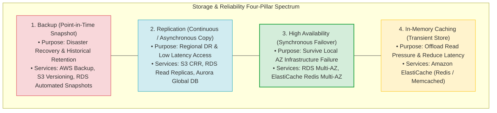
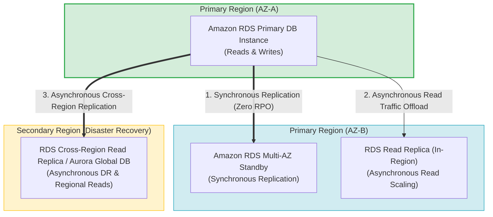
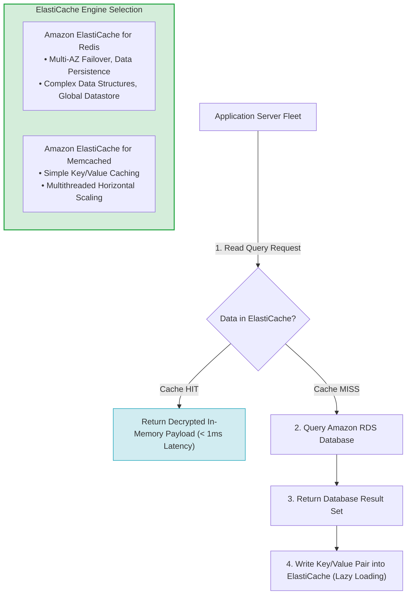
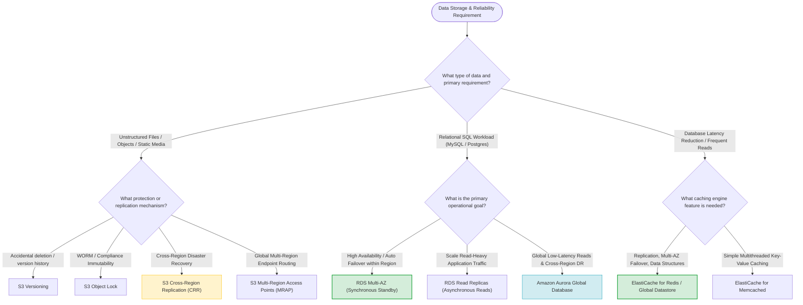

# Task 2.4: Design a Strategy to Meet Reliability Requirements — AWS Storage Services & Replication Strategies

> [!NOTE]
> **Exam Mindset**: For the AWS Solutions Architect Professional (SAP-C02) and AI Practitioner (AIP-C01) exams, do not treat storage services as simple disk targets. Evaluate storage and replication through a strict decision sequence:
> **Data Type** $\rightarrow$ **Access Pattern** $\rightarrow$ **Availability Target** $\rightarrow$ **Replication Mechanism** $\rightarrow$ **RTO/RPO SLA** $\rightarrow$ **Cost Impact**.

---

## 1. Core Concepts: Backup vs. Replication vs. High Availability vs. Caching



### Four-Pillar Feature Comparison Matrix

| Concept | Primary Purpose | Real-Time Access? | Reduces Primary DB Load? | Primary Data Store? |
| :--- | :--- | :---:| :---:| :---:|
| **Backup** | Historical recovery & point-in-time restore | ❌ No | ❌ No | ❌ No |
| **Replication** | Regional DR & read traffic scaling | ✅ Yes | ✅ Yes (for Read Replicas) | ✅ Yes |
| **High Availability**| Automatic failover for local AZ failures | ✅ Yes | ❌ No (Standby is passive) | ✅ Yes |
| **Caching** | Application latency reduction & DB offloading | ✅ Yes | ✅ **Yes (Offloads DB reads)** | ❌ **No (Transient)** |

---

## 2. Deep-Dive: Amazon S3

**Amazon S3** provides highly durable ($99.999999999\%$), scalable object storage for files, media, static website assets, data lakes, and backups.

```
EBS = Block Storage (Attached to EC2 instances)
EFS = Shared File System (NFS mount for multiple EC2s)
S3  = Object Storage (REST API access via HTTP GET/PUT)
```

---

## 3. S3 Replication Strategies: SRR vs. CRR

- **Same-Region Replication (SRR)**: Replicates objects between buckets within the same Region (used for account separation, compliance, and log aggregation).
- **Cross-Region Replication (CRR)**: Asynchronously replicates objects across different AWS Regions.

> [!NOTE]
> **Exam Trigger**: *"Objects must be replicated to a secondary AWS Region to satisfy regional disaster recovery compliance"* $\longrightarrow$ **S3 Cross-Region Replication (CRR)**.

---

## 4. Operational Overhead & Asynchronous Behavior of S3 Replication

- AWS manages underlying replication pipelines transparently.
- S3 replication is **asynchronous** (there is a small replication delay). If an exam question demands **RPO = zero (instantaneous synchronous object replication)**, pure asynchronous CRR alone will not suffice without S3 Replication Time Control (RTC) SLAs or synchronous application writes.

---

## 5. S3 Replication Cost Considerations

- Single Bucket $\rightarrow$ Lowest cost.
- CRR $\rightarrow$ Incurs secondary bucket storage fees, cross-region data transfer fees, and replication request charges.

---

## 6. S3 Versioning

Protects against accidental object deletion or overwriting by maintaining a history of all object revisions.

> [!IMPORTANT]
> **Exam Rule**: **Versioning is NOT a substitute for CRR**. Versioning protects object history within a bucket; CRR replicates objects across geographic Regions. Use **Versioning + CRR** together for maximum resilience.

---

## 7. S3 Object Lock (WORM Storage)

Enforces **Write-Once-Read-Many (WORM)** storage to prevent objects from being deleted or overwritten for a fixed retention period.

> [!TIP]
> **Exam Keywords**: *"Immutable logs"*, *"WORM requirements"*, *"Prevent deletion by any user including root"* $\longrightarrow$ **S3 Object Lock (Compliance Mode)**.

---

## 8. S3 Multi-Region Access Points (MRAP)

Provides a single global S3 endpoint (`.mrap.accesspoint.s3-global.amazonaws.com`) that routes client requests over the AWS global backbone to the lowest-latency regional S3 bucket.

---

## 9. Deep-Dive: Amazon RDS

**Amazon RDS** provides managed relational databases (MySQL, PostgreSQL, MariaDB, Oracle, SQL Server).

---

## 10. Amazon RDS High Availability vs. Read Scaling vs. Regional DR Topology



---

## 11. RDS Multi-AZ vs. Read Replicas vs. Aurora Global Database

| Feature | RDS Multi-AZ | RDS Read Replicas | Aurora Global Database |
| :--- | :--- | :--- | :--- |
| **Primary Goal** | **High Availability (HA)** | **Read Scaling** | **Global Reads & Regional DR** |
| **Replication Type** | **Synchronous** (Zero RPO) | **Asynchronous** | Storage-level replication (< 1s lag) |
| **Standby Instance Access** | ❌ **No (Passive Standby)** | ✅ **Yes (Serves Read Queries)** | ✅ **Yes (Serves Read Queries)** |
| **Automatic Failover** | ✅ **Yes** (Automated DNS failover) | ❌ Manual Promotion required | ✅ Fast failover (< 1 minute RTO) |
| **Geographic Scope** | Within single Region (Multi-AZ) | In-Region or Cross-Region | Multi-Region (Up to 5 secondary Regions) |

> [!WARNING]
> **Exam Trap 1**: RDS Multi-AZ Standby instances **cannot** serve read traffic. Do not select Multi-AZ to offload read queries. Use **Read Replicas** for read scaling.
> **Exam Trap 2**: Read Replicas do **not** provide automatic Multi-AZ failover by default. Do not rely on Read Replicas as your primary local HA mechanism.

---

## 12. Deep-Dive: Amazon Aurora Global Database

For MySQL/PostgreSQL workloads requiring global read scaling and regional disaster recovery, **Amazon Aurora Global Database** uses storage-level replication with lag under 1 second.

---

## 13. Deep-Dive: Amazon ElastiCache

**Amazon ElastiCache** provides in-memory caching (Redis or Memcached) to offload read pressure from relational databases and deliver sub-millisecond response times.



---

## 14. ElastiCache for Redis vs. Memcached Comparison

| Feature | ElastiCache for Redis | ElastiCache for Memcached |
| :--- | :--- | :--- |
| **Data Persistence** | ✅ **Yes** (Snapshots & append-only files) | ❌ **No (Purely volatile memory)** |
| **Multi-AZ & Auto Failover**| ✅ **Yes** (Supports Multi-AZ with auto-failover)| ❌ No (Node replacement only) |
| **Data Structures** | Strings, Hashes, Lists, Sets, Sorted Sets | Simple Key/Value strings only |
| **Global Replication** | ✅ **Yes** (ElastiCache Global Datastore) | ❌ No |
| **Multithreading** | Single-threaded engine core | ✅ Multithreaded architecture |

---

## 15. Important Rule: Cache is NOT Authoritative Storage

- ElastiCache data is **transient**. If an ElastiCache node fails, the application must handle cache misses gracefully by querying the primary database (RDS/Aurora).
- Never select ElastiCache as the sole persistent store for critical business transactions.

---

## 16. Disaster Recovery SLA Alignment (RTO vs. RPO)

- **RPO = 24 Hours, RTO = Hours** $\rightarrow$ **AWS Backup / RDS Automated Snapshots**.
- **RPO = Minutes, RTO = Tens of Minutes** $\rightarrow$ **Pilot Light / RDS Cross-Region Replica**.
- **RPO < 1 Second, RTO < 1 Minute** $\rightarrow$ **Amazon Aurora Global Database / DynamoDB Global Tables**.

---

## 17. SAP-C02 Master Storage & Replication Selection Decision Engine



---

## 18. SAP-C02 Exam Keyword Cheat Sheet

```
"Accidental object deletion protection" ──> S3 Versioning
"WORM compliance / immutable objects"  ──> S3 Object Lock
"Cross-Region object DR"                ──> S3 Cross-Region Replication (CRR)
"Automatic DB failover in Region"       ──> RDS Multi-AZ
"Offload read-heavy database traffic"   ──> RDS Read Replicas
"Global relational DB with RPO < 1s"    ──> Amazon Aurora Global Database
"Database latency reduction / Caching"  ──> Amazon ElastiCache
"Cache + Replication + Persistence"     ──> ElastiCache for Redis
"Simple multithreaded key/value cache"  ──> ElastiCache for Memcached
"Cross-Region cache replication"        ──> ElastiCache Global Datastore
```

---

## 19. Common SAP-C02 Distractors & Traps

1. **Distractor 1**: *"Use RDS Multi-AZ to offload read traffic."* $\rightarrow$ **FALSE** (Multi-AZ standby is passive and unreachable for queries).
2. **Distractor 2**: *"Use Read Replicas for automatic local HA failover."* $\rightarrow$ **FALSE** (Read Replicas require manual promotion).
3. **Distractor 3**: *"Use S3 Versioning for regional disaster recovery."* $\rightarrow$ **FALSE** (Versioning protects version history within a single bucket; CRR provides cross-region copies).
4. **Distractor 4**: *"Use ElastiCache as the primary database for compliance data."* $\rightarrow$ **FALSE** (Caches are transient stores; use persistent databases for primary data).

---

## 20. Summary Mental Model Sequence

`Data Type ➔ Access Pattern ➔ Failure Domain ➔ RTO/RPO ➔ Replication Strategy ➔ Cost Optimization`