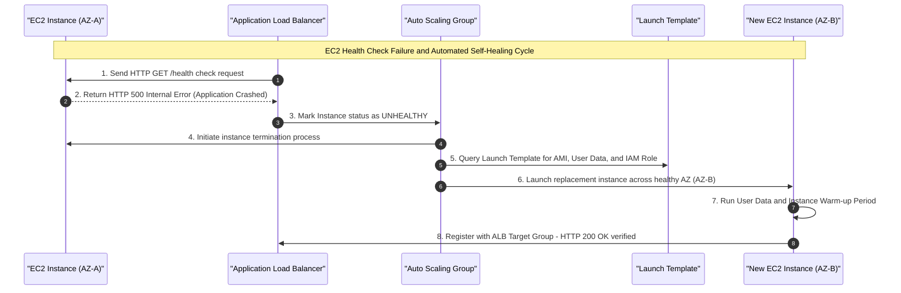
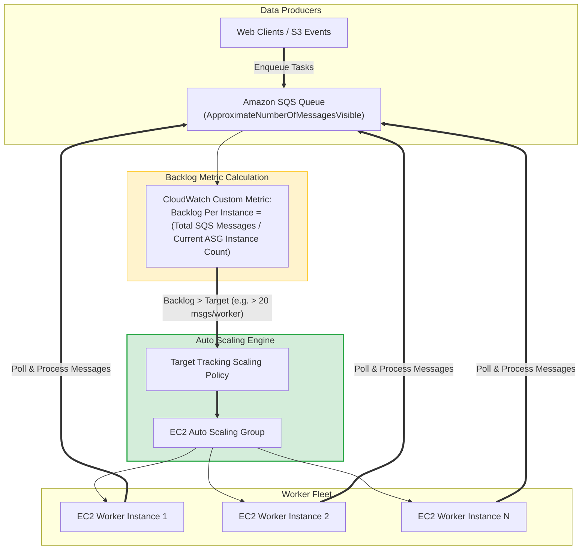
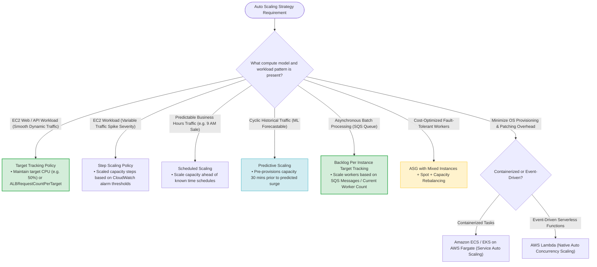

# Task 2.4: Design a Strategy to Meet Reliability Requirements — Auto Scaling Policies and Events

> [!NOTE]
> **Exam Mindset**: For the AWS Solutions Architect Professional (SAP-C02) and AI Practitioner (AIP-C01) exams, do not view Auto Scaling purely as a cost reduction mechanism. View it as a **triad pillar**:
> 1. **Reliability & Availability**: Automatically replacing unhealthy compute resources and maintaining capacity across Availability Zones.
> 2. **Scalability**: Seamlessly adjusting capacity to match fluctuating workload demand.
> 3. **Cost Optimization**: Terminating idle compute resources during low demand periods.

---

## 1. Why Auto Scaling Exists

Manual capacity management introduces two major architectural flaws:
- **Over-Provisioning**: Paying for peak capacity $24/7$ (high cost, wasted resources).
- **Under-Provisioning / Manual Scaling**: Delayed response times leading to application outages and high operational burden.

**AWS Auto Scaling** automates capacity adjustments based on dynamic demand signals, scheduled events, or predictive forecasts.

---

## 2. Core Concepts: Amazon EC2 Auto Scaling Groups (ASG)

An **Auto Scaling Group (ASG)** enforces capacity bounds:

```
[ Minimum Capacity ]  <───  [ Desired Capacity ]  ───>  [ Maximum Capacity ]
   (Availability Floor)        (Active Running Fleet)       (Cost Protection Boundary)
```

- **Minimum Capacity**: Protects baseline application availability (ensures baseline running instances across AZs).
- **Desired Capacity**: Target instance count managed automatically by scaling policies.
- **Maximum Capacity**: Prevents runaway billing caused by traffic surges or misconfigured scaling alarms.

---

## 3. EC2 Auto Scaling Lifecycle & Self-Healing Workflow



> [!IMPORTANT]
> **Exam Rule**: **EC2 Status Checks vs. ELB Health Checks**: EC2 status checks only verify hypervisor/hardware health (`Running`). An instance can be `Running` while its web server (e.g., NGINX/Apache) is completely crashed. Configure **ELB Health Checks** on the ASG so unhealthy application states trigger automated instance replacement.

---

## 4. Multi-AZ Auto Scaling & Availability

- ASGs automatically balance instances evenly across configured Availability Zones within a Region.
- If an entire AZ becomes unavailable, the ASG launches replacement instances in the surviving AZs to maintain desired capacity.

---

## 5. Deep-Dive: Scaling Policy Types

```mermaid
flowchart TD
    subgraph Target_Tracking ["1. Target Tracking Scaling Policy"]
        TT_Policy["Target Metric = 50% Average CPU (or ALBRequestCountPerTarget)"]
        TT_Metric["CloudWatch Monitors Metric Continuous Average"]
        TT_Metric -->|"CPU > 50%"| TT_ScaleOut["Scale Out (Add Capacity)"]
        TT_Metric -->|"CPU < 50%"| TT_ScaleIn["Scale In (Remove Capacity)"]
    end

    subgraph Step_Scaling ["2. Step Scaling Policy"]
        Step_Policy["Threshold Bounds Evaluation"]
        Step_Policy -->|"CPU 50% - 70%"| Step1["Add 1 Instance"]
        Step_Policy -->|"CPU 70% - 85%"| Step2["Add 3 Instances"]
        Step_Policy -->|"CPU > 85%"| Step3["Add 5 Instances (Aggressive Scale-Out)"]
    end

    subgraph Scheduled_Scaling ["3. Scheduled Scaling Policy"]
        Sched_Cron["Known Time Schedule (Cron)"] -->|"Every Monday at 08:00 AM"| Sched_Out["Set Desired Capacity = 20"]
        Sched_Cron -->|"Every Friday at 08:00 PM"| Sched_In["Set Desired Capacity = 5"]
    end

    subgraph Predictive_Scaling ["4. Predictive Scaling Policy"]
        ML_Model["AWS Machine Learning Forecast Engine"] -->|"Analyzes 14-day Historical Usage Patterns"| ML_Plan["Forecasts Demand Spike 30 mins Ahead"]
        ML_Plan ==>|"Pre-provisions Compute Capacity"| ML_Launch["Launch Capacity BEFORE Traffic Surge Arrives"]
    end

    style Target_Tracking fill:#d4edda,stroke:#28a745,stroke-width:2px
    style Step_Scaling fill:#d1ecf1,stroke:#17a2b8,stroke-width:1px
    style Scheduled_Scaling fill:#fff3cd,stroke:#ffc107,stroke-width:1px
    style Predictive_Scaling fill:#d4edda,stroke:#28a745,stroke-width:2px
```



### Policy Selection Summary

| Policy Type | How it Works | Primary Architectural Purpose | Exam Keyword Trigger |
| :--- | :--- | :--- | :--- |
| **Target Tracking** | Maintains a metric at a target value (e.g., 50% CPU) | **Default choice for dynamic workloads** | *"Maintain CPU utilization at 50%"* |
| **Step Scaling** | Scales capacity based on threshold step bounds | Aggressive scaling responses based on severity | *"Scale out by different step sizes depending on alarm magnitude"* |
| **Simple Scaling** | Single threshold scaling with cooldown timer | Legacy basic threshold scaling | *"Scale out by 2 instances when CPU > 70%"* |
| **Scheduled Scaling** | Scales based on specific dates and times | Known, predictable traffic schedules | *"Every morning at 8:00 AM before business hours"* |
| **Predictive Scaling**| Forecasts demand using historical ML models | Pre-provisions capacity ahead of predicted spikes | *"Forecast demand based on historical traffic patterns"* |

---

## 6. Target Metrics Selection

- **CPUUtilization**: Good for compute-heavy applications.
- **ALBRequestCountPerTarget**: **Best for web applications** (scales instances based on actual HTTP request load per instance, avoiding CPU lag).
- **NetworkIn / NetworkOut**: Best for network-bound data processing nodes.
- **Custom Application Metrics**: Custom CloudWatch metrics (e.g., memory usage, SQS queue depth).

---

## 7. Deep-Dive: SQS Queue Backlog-Based Auto Scaling

When processing messages from an Amazon SQS queue, scaling based on CPU is ineffective. Use **Backlog Per Instance** as the scaling metric.



> [!TIP]
> **Exam Formula**: $\text{Backlog Per Instance} = \frac{\text{SQS Messages Available}}{\text{Current ASG Worker Instance Count}}$. Target tracking policy scales worker instances up or down to keep this ratio at target (e.g., 20 messages/worker).

---

## 8. Stabilization Controls: Cooldowns & Instance Warm-Up

- **Scaling Cooldown**: Prevents an ASG from launching or terminating additional instances before previous scaling actions take effect.
- **Instance Warm-up**: Configures the time required for a newly launched instance to boot, execute User Data, register with the ALB, and begin handling traffic before its metric contributions are calculated.

---

## 9. Advanced ASG Features: Spot Instances & Capacity Rebalancing

- **Mixed Instances Groups**: Allows an ASG to launch a combination of On-Demand and Spot instances across multiple EC2 instance types.
- **Capacity Rebalancing**: Proactively launches a replacement Spot instance when AWS sends a Spot interruption notice (2-minute warning), ensuring zero downtime for fault-tolerant workloads.

---

## 10. ASG Management Tools: Lifecycle Hooks & Instance Refresh

- **Lifecycle Hooks**: Pauses instance launch or termination to execute custom configuration scripts (e.g., downloading large datasets, installing agents, or draining connection pools).
- **Instance Refresh**: Rolling update mechanism that gradually replaces older EC2 instances in an ASG with new instances built from an updated Launch Template or AMI.

---

## 11. Compute Model Scaling Comparison

| Compute Model | Scaling Mechanism | Infrastructure Management | Overhead Level |
| :--- | :--- | :--- | :--- |
| **Amazon EC2 ASG** | EC2 Auto Scaling Policies | Customer manages AMI, OS, patching, Launch Templates | **High** |
| **Amazon ECS on EC2** | ECS Service Auto Scaling + ASG | Customer manages EC2 container instances & AMI | **Medium** |
| **Amazon ECS Fargate** | ECS Service Auto Scaling | AWS manages underlying server infrastructure | **Low** |
| **AWS Lambda** | Native Concurrency Auto Scaling | AWS handles 100% of scaling and infrastructure | **Lowest** |

---

## 12. SAP-C02 Auto Scaling Policy & Compute Engine Master Decision Engine



---

## 13. SAP-C02 Exam Keyword Cheat Sheet

```
"Maintain CPU at 50%"                   ──> Target Tracking Policy
"Scale out by 2 instances at 70%, 5 at 90%"──> Step Scaling Policy
"Every morning at 8:00 AM"              ──> Scheduled Scaling
"Forecast capacity using machine learning"──> Predictive Scaling
"Queue-based worker scaling"            ──> SQS Backlog Per Instance Target Tracking
"Unhealthy application behind ALB"      ──> ELB Health Checks on ASG
"Lowest cost for fault-tolerant worker" ──> ASG with Spot Instances + Capacity Rebalancing
"Update AMI across running ASG fleet"   ──> Instance Refresh
"Perform custom action before EC2 launch"──> Lifecycle Hooks
"Reduce OS patching overhead"           ──> AWS Fargate / AWS Lambda
```

---

## 14. Common SAP-C02 Exam Traps

1. **Trap 1: Assuming EC2 Status Checks detect app failure**: `EC2 Status Checks` only verify hardware/hypervisor reachability. Always enable `ELB Health Checks` on the ASG so application HTTP errors trigger instance replacement.
2. **Trap 2: Using SQS Queue Depth directly for Scaling**: SQS Queue Depth alone doesn't account for workers already running. Use **Backlog Per Instance** ($\text{Queue Depth} / \text{Worker Count}$) to calculate accurate scaling steps.
3. **Trap 3: Using Target Tracking when Traffic Schedule is Known**: If traffic spikes at a fixed time (e.g., 9:00 AM daily), Target Tracking will scale *after* the traffic arrives, causing temporary degradation. Use **Scheduled Scaling** to pre-scale before the spike.
4. **Trap 4: Setting Min = Desired = Max for Cost Savings**: An ASG with equal Min, Desired, and Max capacity has zero elasticity and cannot scale dynamically to save costs or absorb traffic surges.

---

## 15. Core Mental Model for Auto Scaling Strategy

- **Policy Selection**: `Target Metric (Target Tracking) ➔ Threshold Steps (Step Scaling) ➔ Fixed Schedule (Scheduled) ➔ Forecast ML (Predictive)`
- **Health Check**: `ALB Health Check + ASG Auto Replacement = Automated Application Self-Healing`
- **Workload Match**: `Web App (ALBRequestCountPerTarget) ➔ Queue Worker (SQS Backlog per Instance)`