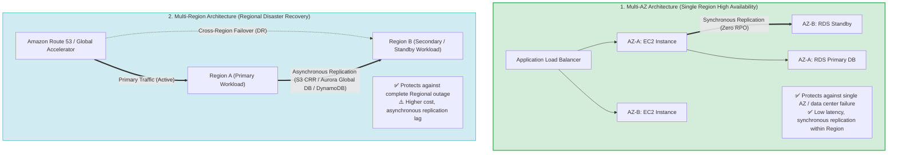
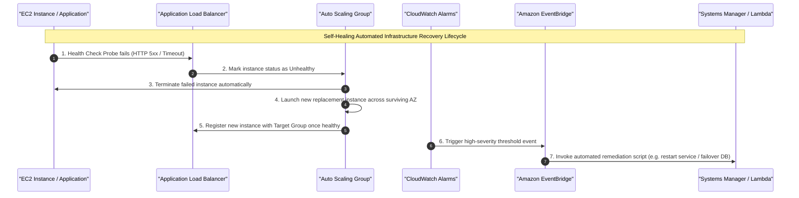
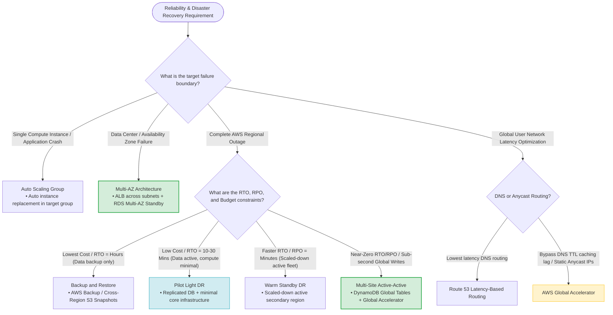

# Task 2.4: Design a Strategy to Meet Reliability Requirements — Multi-AZ and Multi-Region Architectures

> [!NOTE]
> **Exam Mindset**: For the AWS Solutions Architect Professional (SAP-C02) and AI Practitioner (AIP-C01) exams, do not select Multi-Region architectures simply because they sound more resilient. Match the solution strictly to the required failure scope:
> - **Availability Zone Failure** $\rightarrow$ **Multi-AZ Architecture** (High Availability within a single Region)
> - **Regional Outage / Disaster** $\rightarrow$ **Multi-Region Architecture** (Regional Disaster Recovery)
> - **Global User Latency** $\rightarrow$ **Multi-Region Active-Active / Edge Acceleration**

---

## 1. Problem Definition: Failure Scope Isolation

Multi-AZ and Multi-Region architectures solve completely different failure scopes and operational objectives.



---

## 2. Why Multi-AZ Exists

- **Problem**: Deploying an application in a single Availability Zone creates a single point of failure at the data center level.
- **Solution**: Distribute compute instances (EC2, ECS, EKS) across multiple AZs behind an **Application Load Balancer (ALB)** and deploy database layers with **synchronous Multi-AZ standby instances**. If AZ-A fails, traffic automatically continues through surviving instances in AZ-B and AZ-C without downtime.

---

## 3. Why Multi-Region Exists

- **Problem**: Multi-AZ does **NOT** protect against a Region-level disaster (e.g., catastrophic power, physical backbone, or regional control plane failure).
- **Solution**: Deploy infrastructure across two or more geographically separated AWS Regions (e.g., `us-east-1` and `eu-west-1`).

---

## 4. Multi-AZ vs. Multi-Region Master Comparison Matrix

| Architectural Dimension | Multi-AZ Architecture | Multi-Region Architecture |
| :--- | :--- | :--- |
| **Primary Design Goal** | **High Availability (HA)** within one Region | **Regional Disaster Recovery (DR)** & Global Performance |
| **Failure Scope Handled** | Data Center / Availability Zone Outage | Complete AWS Regional Outage |
| **Inter-Component Latency**| Ultra-Low (< 2ms within Region) | Variable / High (Cross-region WAN speeds) |
| **Data Replication Model** | **Synchronous** (Zero RPO capability) | **Asynchronous** (Small replication lag / non-zero RPO) |
| **Infrastructure Cost** | Moderate (Standard HA baseline) | **High** (Duplicated compute, storage, cross-region transfer) |
| **Operational Overhead** | **Low** (Managed by AWS transparently) | **High** (Complex CI/CD, DB replication, DNS failover) |
| **Core AWS Services** | ALB, EC2 ASG, RDS Multi-AZ, EFS, ElastiCache | Route 53, Global Accelerator, Aurora Global DB, DynamoDB Global Tables, S3 CRR |

---

## 5. The Core SAP-C02 Selection Distinction

> [!IMPORTANT]
> **Exam Rule**: Always select the smallest failure domain that satisfies the business SLA:
> - *"Protect application against AZ failure"* $\rightarrow$ **Multi-AZ**
> - *"Business must continue during an entire Region failure"* $\rightarrow$ **Multi-Region DR**
> - *"Lowest deployment cost"* $\rightarrow$ **Multi-AZ** (Avoid Multi-Region unless explicitly mandated)

---

## 6. Operational Overhead Comparison

- **Multi-AZ Overhead**: **Low**. AWS handles health checks, traffic routing, and standby failovers.
- **Multi-Region Overhead**: **High**. Demands multi-region deployment automation, cross-region IAM policies, global monitoring aggregation, state synchronization, and periodic DR drills.

---

## 7. Minimal Requirements for Multi-AZ High Availability

```
Route 53 ──> Application Load Balancer (ALB)
                 ├── Subnet AZ-A ──> EC2 Application Instance
                 └── Subnet AZ-B ──> EC2 Application Instance
                 
RDS Primary (AZ-A) ──> Synchronous Replication ──> RDS Standby (AZ-B)
```

- **Stateless App Tier**: Offload session state to **Amazon ElastiCache** or **Amazon DynamoDB** so any EC2 instance in any AZ can handle any request.

---

## 8. Minimal Requirements for Multi-Region DR & The State Problem

Duplicating stateless compute code across Regions is straightforward. The primary challenge in Multi-Region architecture is **state replication** (database and object storage replication).

---

## 9. Multi-AZ Database Architecture (RDS Multi-AZ vs. Read Replicas)

- **RDS Multi-AZ**: Synchronous block-level replication to a passive standby in a secondary AZ for **HA and automatic failover**. (Standby **cannot** serve read traffic).
- **RDS Read Replicas**: Asynchronous replication for **read scaling**. (Can be promoted manually during DR, but does not provide automated local HA failover).

---

## 10. Amazon Aurora Multi-AZ & Global Database

- **Aurora Multi-AZ**: Replicates 6 copies of storage data across 3 AZs automatically.
- **Aurora Global Database**: Dedicated storage-level replication across Regions with replication lag under 1 second.

---

## 11. Multi-Region Database Selection Options

- **Relational Workload (SQL)** $\rightarrow$ **Amazon Aurora Global Database** (Primary writer in Region A, low-latency read replicas in secondary Regions).
- **NoSQL Multi-Region Active-Active Writes** $\rightarrow$ **Amazon DynamoDB Global Tables** (Bi-directional multi-region active-active replication).
- **Object Storage DR** $\rightarrow$ **Amazon S3 Cross-Region Replication (CRR)**.

---

## 12. Traffic Routing in Multi-Region Architectures

| Route 53 Routing Policy | Primary Architectural Use Case | Exam Keyword Trigger |
| :--- | :--- | :--- |
| **Latency-Based Routing** | Directs users to the Region with the lowest network latency | *"Lowest latency for global users"* |
| **Geolocation Routing** | Directs users based on their explicit country/continent | *"Route users based on geographic location / compliance"* |
| **Failover Routing** | Active-Passive DR (Primary endpoint $\rightarrow$ Secondary endpoint) | *"Active primary and standby disaster recovery"* |
| **Weighted Routing** | Splitting traffic by percentage across endpoints | *"Canary deployments / Blue-Green testing"* |

---

## 13. AWS Global Accelerator for Instant Traffic Failover

```mermaid
flowchart TD
    subgraph ActivePassive ["Active-Passive (Disaster Recovery Model)"]
        Client1["Global Users"] ==>|"100% Traffic to Active Primary"| R53_AP["Route 53 Failover Routing"]
        R53_AP ==> Reg1_Active["Region 1 (Active Primary Endpoint)"]
        R53_AP -.->|"Standby Endpoint (0% Traffic until failover)"| Reg2_Passive["Region 2 (Pilot Light / Warm Standby)"]
        Reg1_Active ==>|"Asynchronous DB Replication"| Reg2_Passive
    end

    subgraph ActiveActive ["Active-Active (Global Multi-Region Model)"]
        Client2_US["US Clients"] ==>|"Latency / Geolocation Routing"| Reg_US["Region A (US Active Endpoint)"]
        Client2_EU["EU Clients"] ==>|"Latency / Geolocation Routing"| Reg_EU["Region B (EU Active Endpoint)"]
        Reg_US <==>|"Bi-Directional Replication (DynamoDB Global Tables)"| Reg_EU
    end

    style ActivePassive fill:#fff3cd,stroke:#ffc107,stroke-width:1px
    style ActiveActive fill:#d4edda,stroke:#28a745,stroke-width:2px
```



> [!TIP]
> **Exam Trigger**: *"Fast traffic failover within seconds without relying on client DNS caching or TTL expiration"* $\longrightarrow$ **AWS Global Accelerator** (Static Anycast IPs bypass DNS TTL propagation delays).

---

## 14. CloudFront vs. AWS Global Accelerator

- **CloudFront**: Edge caching for **HTTP/HTTPS static and dynamic content**.
- **Global Accelerator**: Network-layer proxy for **TCP/UDP traffic** using static Anycast IPs for fast regional failover.

---

## 15. Cost Considerations: Multi-AZ vs. Multi-Region

- **Multi-AZ**: Small cost increase (2x compute + Multi-AZ DB license/instance fee).
- **Multi-Region**: Substantial cost increase (duplicated compute, duplicated storage, cross-region data transfer charges, and dual load balancer fleets).

---

## 16. Multi-Region Models: Active-Passive vs. Active-Active

### Active-Passive DR Models
1. **Backup and Restore**: Lowest cost, highest RTO/RPO (Hours/Days).
2. **Pilot Light**: Data replicated continuously; minimal core compute templates ready to launch (RTO: 10–30 mins).
3. **Warm Standby**: Scaled-down shadow fleet active in secondary Region (RTO: Minutes).

### Active-Active Model
4. **Multi-Site Active-Active**: Full active capacity running across multiple Regions simultaneously (RTO: Near-Zero, Highest Cost).

---

## 17. RTO and RPO SLA Alignment

```
RTO = Recovery Time Objective (How fast must the app recover?)
RPO = Recovery Point Objective (How much data loss is acceptable?)

RTO/RPO = Hours         ──> Backup and Restore
RTO/RPO = Minutes       ──> Pilot Light / Warm Standby
RTO/RPO = Near-Zero     ──> Multi-Site Active-Active / Aurora Global DB
```

---

## 18. Self-Healing Architecture & Monitoring Integration



---

## 19. Multi-AZ vs. Multi-Region Decision Table

| Requirement | Recommended Architectural Pattern | Primary AWS Service |
| :--- | :--- | :--- |
| **Instance / Process Crash** | Auto Scaling Group | Amazon EC2 Auto Scaling |
| **Data Center / AZ Outage** | Multi-AZ Deployment | ALB + Multi-AZ RDS / Aurora |
| **Regional Disaster / Outage**| Multi-Region DR Architecture | Route 53 / Global Accelerator |
| **Global NoSQL Active-Active**| DynamoDB Global Tables | Amazon DynamoDB |
| **Global Relational Reads** | Aurora Global Database | Amazon Aurora |
| **Object Replication across Regions**| S3 Cross-Region Replication | Amazon S3 CRR |
| **Bypass DNS TTL Caching Lag**| Network Anycast Ingress | AWS Global Accelerator |

---

## 20. SAP-C02 Multi-AZ vs Multi-Region Master Decision Engine



---

## 21. SAP-C02 Exam Keyword Cheat Sheet

```
"Availability Zone failure"            ──> Multi-AZ
"Regional outage / disaster"           ──> Multi-Region
"Lowest global user latency"          ──> Route 53 Latency-Based Routing
"Route by geographic country"          ──> Route 53 Geolocation Routing
"Fast failover bypassing DNS TTL"      ──> AWS Global Accelerator
"Global relational reads"              ──> Aurora Global Database
"Multi-Region active-active NoSQL"     ──> DynamoDB Global Tables
"Object DR replication"                ──> S3 Cross-Region Replication (CRR)
"Lowest cost DR"                       ──> Backup and Restore
"Minimal running DR compute fleet"     ──> Pilot Light
"Scaled-down running secondary fleet"  ──> Warm Standby
```

---

## 22. Common SAP-C02 Exam Traps

1. **Trap 1: Choosing Multi-Region when Multi-AZ satisfies the question**: Multi-AZ handles data center failures within a Region. Use Multi-Region **only** when regional disaster recovery is explicitly required.
2. **Trap 2: Expecting RDS Multi-AZ Standbys to serve read traffic**: Multi-AZ standby instances are passive. Use **RDS Read Replicas** for read scaling.
3. **Trap 3: Relying on DNS Routing for Instant Failover**: DNS records are cached by clients for the duration of the TTL. Use **AWS Global Accelerator** with Static Anycast IPs for instant traffic shifting.
4. **Trap 4: Assuming Cross-Region Replication is Synchronous**: Cross-Region replication (S3 CRR, RDS Cross-Region Replicas, Aurora Global DB) is **asynchronous**. RPO will be non-zero during a hard regional outage.

---

## 23. Core SAP-C02 Failure Domain Mental Model

`Instance (Auto Scaling) ➔ AZ (Multi-AZ ALB/RDS) ➔ Region (Multi-Region DR) ➔ Global Latency (CloudFront/Global Accelerator)`