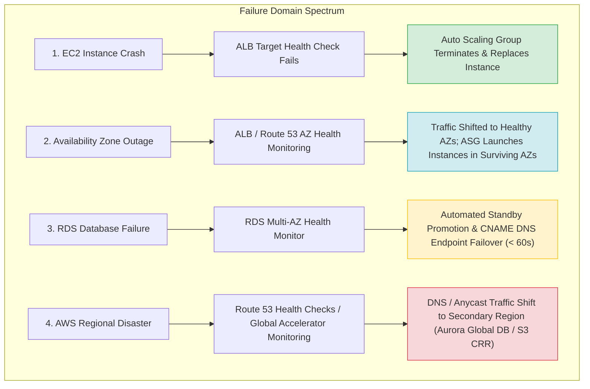
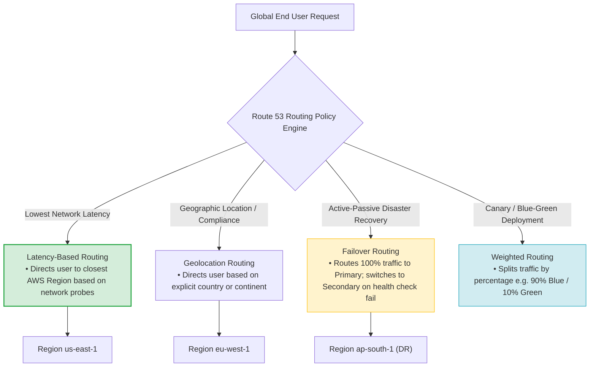
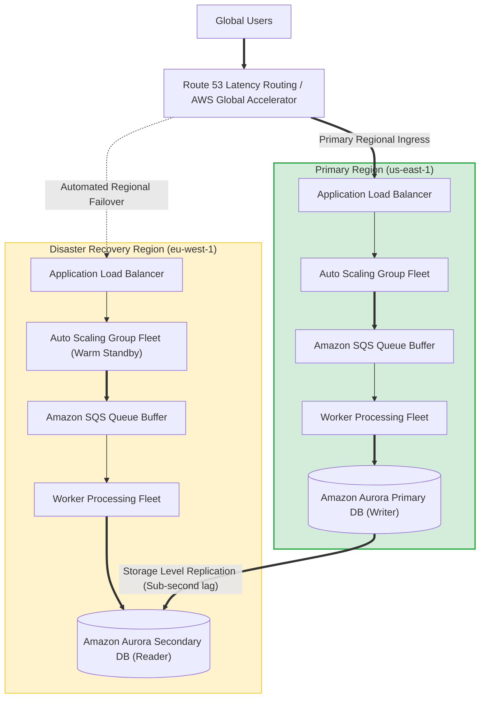
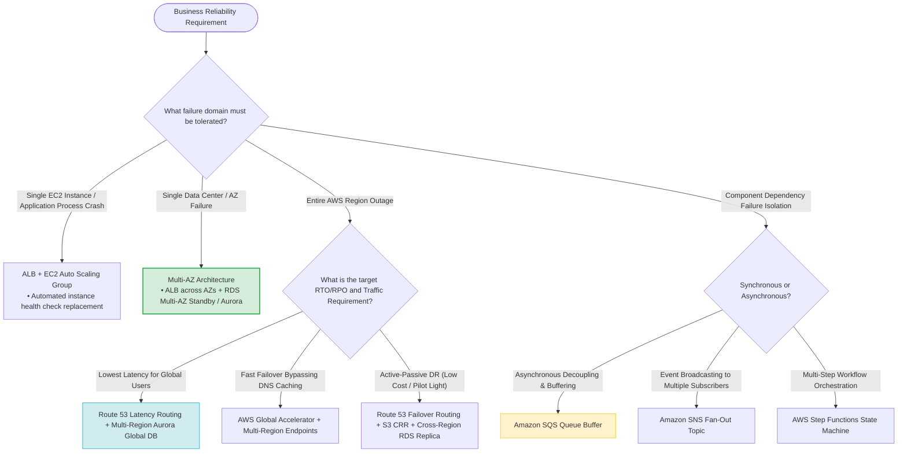

# Task 2.4: Design a Strategy to Meet Reliability Requirements — Skills & Synthesis

> [!NOTE]
> **Exam Mindset**: For the AWS Solutions Architect Professional (SAP-C02) and AI Practitioner (AIP-C01) exams, reliability design is driven by a core philosophy: **"Failure is expected. Design systems that detect failure, isolate failure, fail over automatically, and recover without human intervention."**
> Evaluate reliability along a clear sequence:
> **Failure Boundary Target** $\rightarrow$ **RTO / RPO Constraints** $\rightarrow$ **Traffic Routing Policy** $\rightarrow$ **Data Replication Method** $\rightarrow$ **Cost Efficiency**.

---

## 1. Core Principles: Designing for Failure

Every production AWS architecture must handle failures across five distinct operational layers:



---

## 2. High Availability vs. Scalability vs. Disaster Recovery

| Architectural Pillar | Primary Purpose | AWS Core Service Implementation |
| :--- | :--- | :--- |
| **High Availability (HA)** | Keep application running during single component/AZ failures | ALB + Multi-AZ EC2 ASG + RDS Multi-AZ |
| **Scalability** | Adjust compute capacity dynamically to match changing workload demand | EC2 Auto Scaling, Dynamic / Target Tracking Policies |
| **Disaster Recovery (DR)** | Restore business operations after a catastrophic Regional outage | AWS Elastic Disaster Recovery, Aurora Global DB, S3 CRR |

---

## 3. Availability Spectrum & Cost Hierarchy

```
[ Single AZ ]  ──>  [ Multi-AZ ]  ──>  [ Multi-Region Active-Passive ]  ──>  [ Multi-Region Active-Active ]
 (Lowest Cost /      (Standard Baseline     (Disaster Recovery Pilot         (Highest Resilience /
  Single POF)         Production HA)         Light / Warm Standby)             Highest Cost & Complexity)
```

> [!IMPORTANT]
> **Exam Rule**: **Minimal Resilient Architecture**: Never select Multi-Region architectures if a Multi-AZ pattern satisfies the business SLA. Always choose the smallest failure domain solution that satisfies the RTO/RPO requirements.

---

## 4. Loose Coupling Patterns for Fault Isolation

Tightly coupled architectures fail completely when a single dependency becomes unavailable. Implement **loose coupling** using AWS messaging integration:

- **Buffering & Decoupling** $\rightarrow$ **Amazon SQS** (Worker nodes process messages asynchronously; traffic spikes accumulate safely in queue).
- **Fan-out Distribution** $\rightarrow$ **Amazon SNS + Amazon SQS** (Single event published to SNS triggers parallel processing across isolated SQS queues).
- **Event Routing** $\rightarrow$ **Amazon EventBridge** (Rule-based routing across accounts and services).
- **State Machine Orchestration** $\rightarrow$ **AWS Step Functions** (Durable workflow execution with built-in retries and error handling).

---

## 5. Amazon Route 53 Global Routing Policies Spectrum



### Route 53 Routing Policies Decision Matrix

| Routing Policy | Use Case | Exam Keyword Trigger |
| :--- | :--- | :--- |
| **Simple Routing** | Single resource endpoint (no health checks) | *"Basic DNS routing for single IP / endpoint"* |
| **Weighted Routing** | Traffic percentage split across endpoints | *"Blue-Green deployments, 10% Canary testing"* |
| **Latency-Based Routing** | Directs users to lowest latency AWS Region | *"Route users to the nearest Region based on lowest latency"* |
| **Geolocation Routing** | Directs users based on explicit country/continent | *"Route users based on geographic country / legal compliance"* |
| **Failover Routing** | Active-Passive Primary to Standby failover | *"Active primary endpoint with secondary backup endpoint"* |
| **Multivalue Answer** | Returns multiple healthy IP records randomly | *"DNS load balancing with health checks across multiple IPs"* |

---

## 6. Route 53 vs. AWS Global Accelerator

> [!TIP]
> **Exam Distinction**:
> - **Route 53**: DNS-level routing. Subject to client-side DNS TTL caching delays.
> - **AWS Global Accelerator**: Network-layer routing using static Anycast IPs over the AWS global backbone. Bypasses DNS caching for **instant traffic shifting (< 10s)**.

---

## 7. Enterprise Multi-Region Resilient Workload Topology



---

## 8. SAP-C02 Master Reliability & High Availability Decision Engine



---

## 9. SAP-C02 Exam Keyword Cheat Sheet

```
"99.99% availability within Region"     ──> Multi-AZ ALB + EC2 ASG + RDS Multi-AZ / Aurora
"Survive Availability Zone failure"     ──> Multi-AZ Architecture
"Survive complete Region failure"       ──> Multi-Region DR (Aurora Global DB / S3 CRR)
"Lowest network latency globally"       ──> Route 53 Latency-Based Routing
"Route users based on country/location" ──> Route 53 Geolocation Routing
"Primary and secondary DR endpoint"     ──> Route 53 Failover Routing
"Bypass DNS TTL caching lag"            ──> AWS Global Accelerator
"Decouple producers and consumers"      ──> Amazon SQS
"Fan-out single event to subscribers"   ──> Amazon SNS + Amazon SQS
"Orchestrate multi-step workflows"      ──> AWS Step Functions
```

---

## 10. Common SAP-C02 Exam Traps

1. **Trap 1: Confusing Latency Routing with Geolocation Routing**: Latency routing directs users to the fastest AWS Region based on network probes. Geolocation routing directs users based on their geographic country/continent for compliance or localization.
2. **Trap 2: Selecting Multi-Region for Local Instance Failures**: If an application must survive an EC2 or AZ failure, use **Multi-AZ ALB + ASG**. Do not introduce expensive Multi-Region architectures.
3. **Trap 3: Relying on Manual Operator Recovery**: Exam questions favor automated self-healing (`ALB Health Checks` $\rightarrow$ `ASG Instance Replacement` $\rightarrow$ `EventBridge Auto-Remediation`) over alerting human operators.
4. **Trap 4: Using Direct Synchronous HTTP Calls for Spiky Workloads**: Direct API calls during traffic bursts lead to connection failures. Buffer requests using **Amazon SQS**.

---

## 11. Core Mental Model for Reliability

`Identify Failure Boundary ➔ Match RTO/RPO ➔ Select Smallest AWS Managed Architecture ➔ Automate Failover & Recovery`