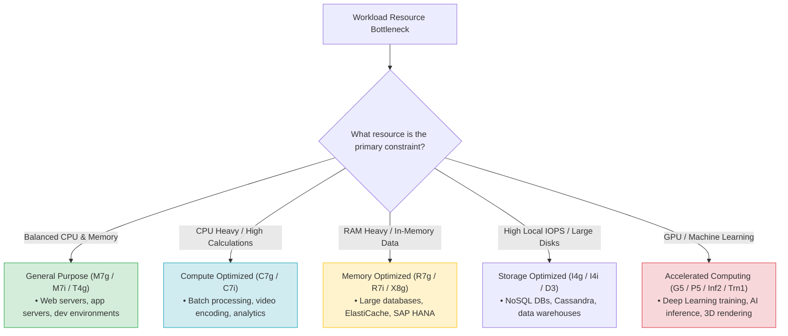
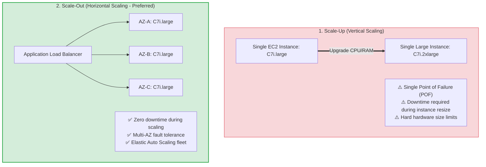
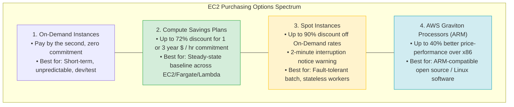
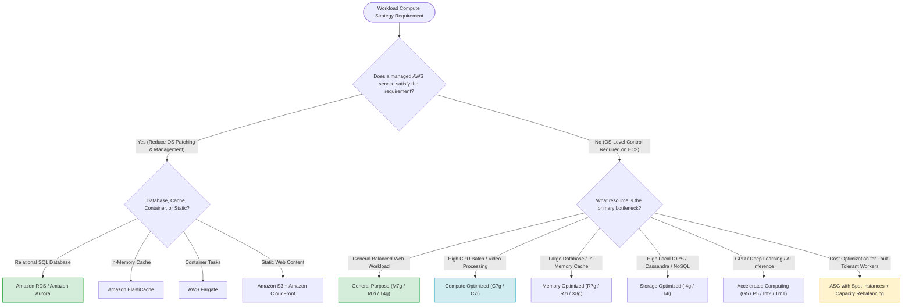

# Task 2.5: Design a Solution to Meet Performance Objectives — EC2 Instance Families & Use Cases

> [!NOTE]
> **Exam Mindset**: For the AWS Solutions Architect Professional (SAP-C02) and AI Practitioner (AIP-C01) exams, do not treat EC2 instance families as a plain pricing table. Evaluate compute selection along a strict decision sequence:
> **Workload Bottleneck** (CPU vs. Memory vs. IOPS vs. GPU) $\rightarrow$ **Instance Family** $\rightarrow$ **Architecture Pattern** (Scale-Out vs. Scale-Up) $\rightarrow$ **Purchasing Model** (Spot / Savings Plans / Graviton) $\rightarrow$ **Managed Service Alternative**.

---

## 1. Workload Bottleneck Taxonomy & Instance Family Alignment

AWS provides distinct instance families tailored to specific hardware bottlenecks:



---

## 2. EC2 Instance Families Master Comparison Matrix

| Instance Family | Hardware Focus | Representative Instances | Primary Target Workloads | Exam Keyword Trigger |
| :--- | :--- | :--- | :--- | :--- |
| **General Purpose** | Balanced CPU, Memory, Network | M7g, M7i, T4g, T3 | Web servers, app servers, microservices | *"Balanced compute and memory"* |
| **Compute Optimized** | High CPU-to-memory ratio | C7g, C7i, C6i | Batch processing, video encoding, analytics | *"High CPU utilization / Video encoding"* |
| **Memory Optimized** | Large RAM capacity | R7g, R7i, X8g, X8i | High-performance DBs, ElastiCache, SAP HANA | *"In-memory database / Large RAM dataset"* |
| **Storage Optimized** | Low-latency local NVMe / High IOPS | I4g, I4i, D3, D3en | NoSQL DBs (Cassandra), Data Warehousing | *"High local NVMe IOPS / Sequential disk"* |
| **Accelerated Computing**| Hardware Accelerators (GPUs, ASICs) | G5, P5, Inf2, Trn1 | Deep Learning training, AI inference, 3D rendering | *"GPU / ML Model Training / Inference"* |

---

## 3. Deep-Dive: Burstable vs. Sustained Compute (T-Series Mechanics)

- **Burstable Instances (T3 / T4g)**: Provide a baseline CPU utilization level with the ability to burst above baseline using **CPU Credits**.
- **When to Use**: Development/test environments, microservices, or web applications with low average CPU and occasional bursty spikes.
- **Exam Trap**: Do **NOT** use T-series instances for workloads requiring *sustained 100% CPU utilization*. Use **Compute Optimized (C7g / C7i)** for continuous heavy compute.

---

## 4. Architecture Strategy: Scale-Out (Horizontal) vs. Scale-Up (Vertical)



### Scale-Up vs. Scale-Out Trade-offs

| Dimension | Scale-Up (Vertical) | Scale-Out (Horizontal) |
| :--- | :--- | :--- |
| **Implementation** | Resizing an instance to a larger type (e.g., `c7i.large` $\rightarrow$ `c7i.2xlarge`) | Adding more instances across AZs behind a Load Balancer |
| **Availability Impact** | Requires instance stop/start downtime; single point of failure | Zero downtime; multi-AZ fault tolerance |
| **Ideal Workload** | Monolithic legacy apps, single-threaded databases | Stateless web apps, microservices, container fleets |

---

## 5. Storage Decision: Ephemeral Instance Store vs. Persistent EBS

> [!IMPORTANT]
> **Exam Rule**: **Instance Store vs. EBS**:
> - **EC2 Instance Store**: NVMe block storage physically attached to the host server. Ultra-low latency, but **ephemeral** (data is lost if instance stops or terminates). Ideal for temporary caches, scratch space, and buffer data.
> - **Amazon EBS**: Network-attached persistent block storage. Survives instance termination. Required for OS boot disks and persistent databases.

---

## 6. Purchasing Models & Price-Performance Optimization



### Cost Optimization Key Strategies
- **AWS Graviton Processors (ARM)**: Instances ending in `g` (e.g., `c7g`, `m7g`, `r7g`) deliver up to **40% better price-performance** over x86 processors for Linux/open-source workloads.
- **Spot Instances + Capacity Rebalancing**: Combine On-Demand baseline instances with Spot instances for fault-tolerant worker fleets to achieve up to **90% cost savings**.

---

## 7. Operational Overhead: EC2 vs. AWS Managed Services

> [!TIP]
> **Managed Service Rule**: Before picking an EC2 instance family, check if an AWS managed service eliminates EC2 operational overhead:
> - **Self-Managed MySQL on EC2** $\longrightarrow$ **Amazon RDS / Amazon Aurora**
> - **Self-Managed Redis on EC2** $\longrightarrow$ **Amazon ElastiCache**
> - **Self-Managed Container Fleet on EC2** $\longrightarrow$ **AWS Fargate**
> - **Static Web Server on EC2** $\longrightarrow$ **Amazon S3 + Amazon CloudFront**

---

## 8. SAP-C02 Instance Family & Compute Selection Master Decision Engine



---

## 9. SAP-C02 Exam Keyword Cheat Sheet

```
"CPU-intensive / Batch / Video encoding" ──> Compute Optimized (C Family)
"Memory-intensive / In-memory DB"        ──> Memory Optimized (R / X Family)
"Balanced compute and memory"            ──> General Purpose (M Family)
"Occasional CPU spikes"                  ──> Burstable (T3 / T4g Family)
"High local NVMe IOPS / NoSQL DB"        ──> Storage Optimized (I / D Family)
"GPU / Deep Learning / AI Training"      ──> Accelerated Computing (G / P / Trn Family)
"AI Model Inference"                     ──> AWS Inferentia (Inf Family)
"ARM-compatible / Price-performance"     ──> AWS Graviton (Instance ending in 'g')
"Fault-tolerant worker / Batch"          ──> Spot Instances + Capacity Rebalancing
"Predictable long-term compute usage"    ──> Compute Savings Plans
"Temporary scratch / Ephemeral host disk"──> EC2 Instance Store
"Persistent disk surviving termination"  ──> Amazon EBS
```

---

## 10. Common SAP-C02 Exam Traps

1. **Trap 1: Selecting T-Series for Sustained 100% CPU**: Burstable T-series instances run out of CPU credits during sustained 100% CPU loads. Select **Compute Optimized (C-series)** for continuous heavy compute.
2. **Trap 2: Vertical Scaling (Scale-Up) for High Availability**: Upgrading to a larger single instance creates a single point of failure and requires downtime. Choose **Horizontal Scale-Out across AZs** behind an ALB.
3. **Trap 3: Using Ephemeral Instance Store for Persistent Data**: Data on Instance Store NVMe drives is lost when an instance stops. Use **Amazon EBS** for persistent data.
4. **Trap 4: Choosing EC2 when a Managed AWS Service exists**: If a question asks to minimize operational management overhead, choose **Amazon RDS / AWS Fargate** instead of managing EC2 instances manually.

---

## 11. Final Mental Model

`Identify Bottleneck ➔ Pick Family (M/C/R/I/G) ➔ Scale Out Across AZs (ALB + ASG) ➔ Optimize Cost (Graviton/Spot/Savings Plans)`