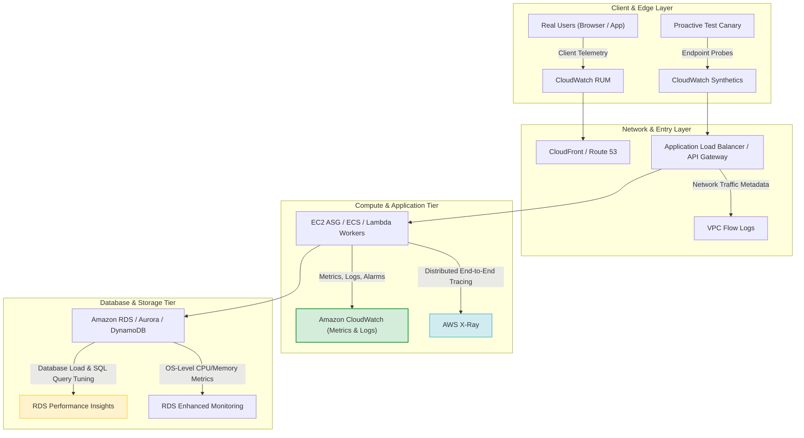
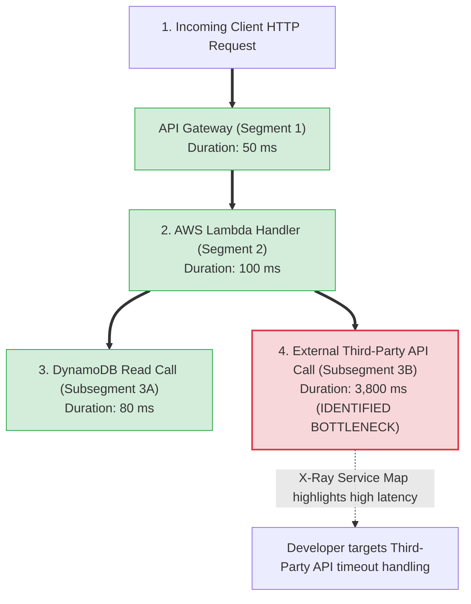
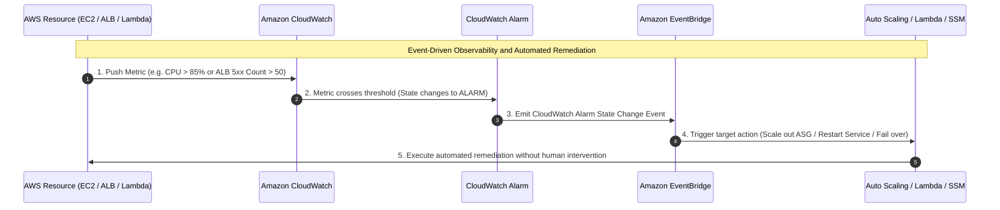
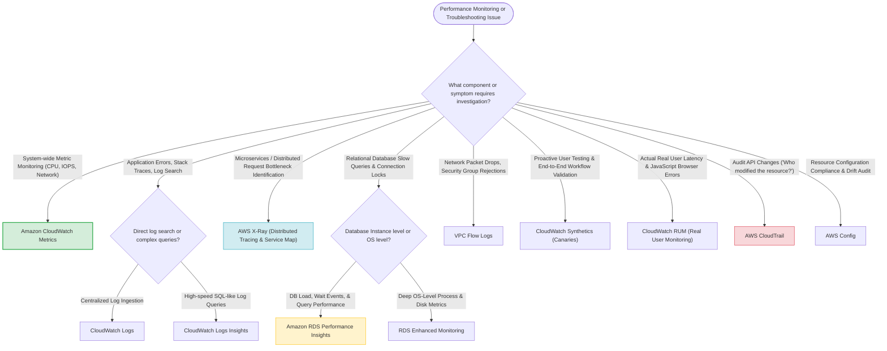

# Task 2.5: Design a Solution to Meet Performance Objectives — Performance Monitoring Technologies

> [!NOTE]
> **Exam Mindset**: For the AWS Solutions Architect Professional (SAP-C02) and AI Practitioner (AIP-C01) exams, view performance monitoring through a single core question:
> **"Where is the bottleneck, and how do I prove it with telemetry?"**
> - **Never scale blindly**: Always measure first, isolate the bottleneck layer (Application vs. Database vs. Network vs. External Dependency), and apply targeted architectural changes.
> - **The Three Pillars of Observability**: **Metrics** (*What is happening?*) $\rightarrow$ **Logs** (*What happened?*) $\rightarrow$ **Traces** (*Where did the request spend time?*).

---

## 1. Problem Definition: Identifying the Root Cause Bottleneck

Application performance degradation can originate across distinct architectural tiers:
- **Application Tier**: CPU saturation, memory leaks, thread starvation, unoptimized application code.
- **Database Tier**: Slow SQL queries, connection exhaustion, lock contention, insufficient IOPS/throughput.
- **Network Tier**: High network latency, packet drops, bandwidth saturation, DNS delays.
- **AWS Service Quotas**: API rate throttling (HTTP 429), Lambda concurrency caps, service limits.



---

## 2. Core Service: Amazon CloudWatch Stack

**Amazon CloudWatch** is the foundational telemetry repository for AWS infrastructure and applications.

### CloudWatch Telemetry Components
1. **CloudWatch Metrics**: Collects time-series numerical data (e.g., `CPUUtilization`, `TargetResponseTime`, `DatabaseConnections`, `ApproximateNumberOfMessagesVisible`, `ConcurrentExecutions`).
2. **CloudWatch Logs**: Centralizes application and AWS service log streams (`/aws/lambda/*`, `/aws/rds/*`, VPC Flow Logs).
3. **CloudWatch Logs Insights**: Interactive SQL-like query engine to analyze gigabytes of log data in seconds.
4. **CloudWatch Alarms**: Triggers automated actions (SNS notifications, Auto Scaling actions, EC2 recovery) when metrics cross defined thresholds.
5. **CloudWatch Dashboards**: Single-pane operational views for NOC and incident response teams.
6. **CloudWatch Application Signals**: Standardized Service Level Objectives (SLOs) and service-centric performance tracking.

---

## 3. Distributed Tracing: AWS X-Ray

While CloudWatch provides aggregate metrics (*"API latency is 4 seconds"*), **AWS X-Ray** provides distributed request tracing (*"Where did those 4 seconds go?"*).



> [!IMPORTANT]
> **Exam Trigger**: *"Trace end-to-end user requests across microservices to isolate bottleneck latency"* $\longrightarrow$ **AWS X-Ray**.

---

## 4. User Experience Monitoring: Synthetics vs. RUM

| Monitoring Tool | Mechanism | Primary Exam Purpose | Exam Keyword Trigger |
| :--- | :--- | :--- | :--- |
| **CloudWatch Synthetics** | Proactive configurable scripts (Canaries) testing endpoints 24/7 | Detect failure **before** real users are impacted | *"Proactively test website APIs / endpoints"* |
| **CloudWatch RUM** | Real User Monitoring via JavaScript snippet embedded in web app | Measure actual browser load times, client JS errors | *"Analyze actual end-user browser experience & JS errors"* |

---

## 5. Database Performance Tuning: Performance Insights vs. Enhanced Monitoring

- **Amazon RDS Performance Insights**: Visualizes database load broken down by **Wait Events** and **Top SQL Queries** to identify slow database statements.
- **RDS Enhanced Monitoring**: Delivers deep OS-level metrics (CPU process breakdown, swap usage, disk I/O metrics) from the underlying database host instance.

---

## 6. Network & Audit Telemetry: VPC Flow Logs vs. CloudTrail vs. Config

| Service | Primary Telemetry Collected | Primary Architectural Purpose |
| :--- | :--- | :--- |
| **VPC Flow Logs** | IP traffic metadata (ACCEPT / REJECT, Source/Dest IP, Port) | Network connectivity & Security Group troubleshooting |
| **AWS CloudTrail** | AWS API calls & management events (*"Who did what?"*) | Security auditing & operational change tracking |
| **AWS Config** | Resource configuration history & compliance evaluation | Configuration drift auditing & policy compliance |

---

## 7. Service-Specific Monitoring Tool Selection Matrix

| Problem Scenario | Recommended AWS Telemetry Tool |
| :--- | :--- |
| **EC2 CPU Saturation & ALB 5xx Error Spikes** | Amazon CloudWatch Metrics & Alarms |
| **Search Millions of Log Lines for Error Codes** | Amazon CloudWatch Logs Insights |
| **Microservice Latency & Slow Downstream Call** | AWS X-Ray (Service Map & Segments) |
| **Slow Relational Database SQL Queries** | Amazon RDS Performance Insights |
| **Proactive Website API Availability Probes** | Amazon CloudWatch Synthetics (Canaries) |
| **Real User Browser Page Load Latency** | Amazon CloudWatch RUM |
| **Rejected Network Connections / SG Failures** | VPC Flow Logs |
| **Identify Unauthorized AWS API Call / Change** | AWS CloudTrail |

---

## 8. Automated Observability to Remediation Pipeline



---

## 9. Managed Observability vs. Self-Hosted Overhead

> [!TIP]
> **Operational Overhead Hierarchy**:
> - **AWS Managed Observability** (CloudWatch, X-Ray, Performance Insights) $\rightarrow$ **Lowest Overhead** (AWS manages ingestion, scaling, and retention).
> - **Self-Hosted Observability** (Prometheus, Grafana, ELK Stack on EC2) $\rightarrow$ **Highest Overhead** (Customer manages broker clusters, storage scaling, upgrades, and HA).

---

## 10. SAP-C02 Performance Monitoring & Troubleshooting Master Decision Engine



---

## 11. SAP-C02 Exam Keyword Cheat Sheet

```
"Monitor infrastructure utilization"   ──> Amazon CloudWatch Metrics
"Centralized application logs"         ──> Amazon CloudWatch Logs
"Query log files with SQL-like syntax" ──> CloudWatch Logs Insights
"Trace requests across microservices"  ──> AWS X-Ray
"Identify slow SQL queries & wait states"──> Amazon RDS Performance Insights
"Proactively test API endpoints 24/7"  ──> CloudWatch Synthetics (Canaries)
"Measure actual browser page load time"──> CloudWatch RUM
"Investigate network traffic drops"     ──> VPC Flow Logs
"Audit AWS API calls / user actions"   ──> AWS CloudTrail
"Resource compliance & drift tracking" ──> AWS Config
```

---

## 12. Common SAP-C02 Exam Traps

1. **Trap 1: Scaling compute before measuring root cause**: If an application is slow due to database lock contention, adding EC2 instances worsens DB load. Always measure first using **CloudWatch / X-Ray / Performance Insights**.
2. **Trap 2: Using CloudTrail for Application Performance**: CloudTrail audits AWS API calls (*"Who called `RunInstances`?"*). It does not trace application HTTP requests or code execution times (use **AWS X-Ray**).
3. **Trap 3: Confusing CloudWatch Synthetics with CloudWatch RUM**: Synthetics uses simulated canary scripts. RUM measures actual end-user browser sessions.
4. **Trap 4: Overlooking CloudWatch Log Cost**: Ingesting high-volume debug logs creates unexpected costs. Configure appropriate log retention policies and log filter subscriptions.

---

## 13. Final Mental Model

`Measure First ➔ Isolate Layer (Metrics/Logs/Traces) ➔ Identify Bottleneck ➔ Automate Response via Alarms`