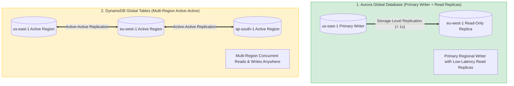
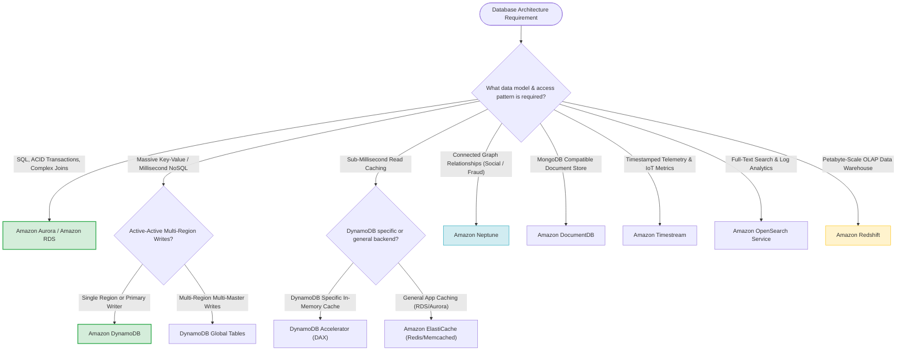

# Task 2.5: Design a Solution to Meet Performance Objectives — Purpose-Built Databases

> [!NOTE]
> **Exam Mindset**: For the AWS Solutions Architect Professional (SAP-C02) and AI Practitioner (AIP-C01) exams, never ask *"Which database is best?"*. Ask:
> **"What data access pattern, query model, and latency SLA does the workload require?"**
> Match the workload access pattern directly to the specialized purpose-built AWS database engine.

---

## 1. Workload Access Pattern Taxonomy & Database Alignment

```mermaid
flowchart TD
    subgraph Data_Access ["Data Access Pattern Classification"]
        Relational["1. Relational (SQL & ACID Transactions)<br/>• Amazon RDS / Amazon Aurora"]
        KeyValue["2. Key-Value & Document (High-Scale NoSQL)<br/>• Amazon DynamoDB / Amazon DocumentDB"]
        InMem["3. In-Memory Cache (Sub-Millisecond Speed)<br/>• Amazon ElastiCache (Redis / Memcached) / DAX"]
        Graph["4. Graph (Complex Network Relationships)<br/>• Amazon Neptune"]
        TimeSeries["5. Time-Series (Timestamped Telemetry & Metrics)<br/>• Amazon Timestream"]
        Search["6. Search & Log Analytics (Full-Text Search)<br/>• Amazon OpenSearch Service"]
        Analytics["7. Data Warehouse (Complex OLAP Analytics)<br/>• Amazon Redshift"]
    end

    Relational --- KeyValue --- InMem --- Graph --- TimeSeries --- Search --- Analytics

    style Relational fill:#d4edda,stroke:#28a745,stroke-width:1px
    style KeyValue fill:#d1ecf1,stroke:#17a2b8,stroke-width:1px
    style InMem fill:#fff3cd,stroke:#ffc107,stroke-width:1px
    style Graph fill:#f8d7da,stroke:#dc3545,stroke-width:1px
```



---

## 2. AWS Purpose-Built Databases Feature Matrix

| Database Service | Data Model | Primary Query Pattern | Latency SLA | Key Exam Keyword Trigger |
| :--- | :--- | :--- | :--- | :--- |
| **Amazon Aurora / RDS**| Relational (SQL) | Complex SQL, ACID, multi-table joins | Milliseconds | *"ACID transactions / Complex SQL joins"* |
| **Amazon DynamoDB** | Key-Value / Document | Single-digit millisecond key lookups | Single-digit ms | *"Serverless NoSQL / Millions of req/sec"* |
| **Amazon ElastiCache** | In-Memory Key-Value | Sub-millisecond read/write cache | Sub-millisecond | *"In-memory session cache / Sub-millisecond"* |
| **Amazon Neptune** | Graph (Property/RDF) | Relationship traversal & connected graphs| Milliseconds | *"Social graphs / Fraud relationships"* |
| **Amazon DocumentDB** | Document (JSON) | MongoDB-compatible JSON query | Milliseconds | *"MongoDB-compatible / Flexible JSON schema"* |
| **Amazon Timestream** | Time-Series | Timestamped sequential queries | Milliseconds | *"IoT telemetry / Sensor timestamped metrics"* |
| **Amazon Redshift** | Columnar OLAP | Complex analytical queries & aggregations| Seconds / Mins | *"Data Warehouse / OLAP / Petabyte Analytics"* |
| **Amazon OpenSearch** | Search / Logs | Full-text search & log aggregation | Sub-second | *"Full-text search / Log analytics"* |

---

## 3. Deep-Dive: Caching Mechanics — ElastiCache vs. DAX

```mermaid
flowchart TD
    subgraph ElastiCache_Pattern ["1. General Application Caching (Amazon ElastiCache)"]
        App1["Application"] -->|"1. Check Cache"| Cache1["Amazon ElastiCache (Redis / Memcached)"]
        Cache1 -.->|"Cache Miss"| DB1["Relational DB (RDS / Aurora) or NoSQL"]
        DB1 -.->|"2. Write Back to Cache"| Cache1
    end

    subgraph DAX_Pattern ["2. DynamoDB-Specific In-Memory Caching (DAX)"]
        App2["Application"] ==>|"1. Transparent API Read Call"| DAX["DynamoDB Accelerator (DAX)"]
        DAX ==>|"Microsecond Cache Hit / Miss Sync"| DDB["Amazon DynamoDB Table"]
    end

    style Cache1 fill:#d1ecf1,stroke:#17a2b8,stroke-width:1px
    style DAX fill:#d4edda,stroke:#28a745,stroke-width:2px
```



### ElastiCache Redis vs. Memcached Feature Comparison

| Feature | Amazon ElastiCache for Redis | Amazon ElastiCache for Memcached |
| :--- | :--- | :--- |
| **Data Persistence** | Supported (Snapshots & Append-Only Files) | No (Purely ephemeral in-memory) |
| **Replication & HA** | Multi-AZ with automatic failover | Multi-node horizontal sharding (No failover) |
| **Data Structures** | Strings, Hashes, Lists, Sets, Sorted Sets, Geospatial | Simple Key-Value strings |
| **Pub/Sub Messaging**| Supported | Not supported |

---

## 4. Multi-Region Replication: Aurora Global DB vs. DynamoDB Global Tables



> [!IMPORTANT]
> **Exam Distinction**:
> - **Aurora Global Database**: Single-Region Primary Writer with low-latency cross-Region storage replication to read-only secondary Regions.
> - **DynamoDB Global Tables**: Multi-Region **Active-Active** multi-master replication allowing concurrent writes in any configured AWS Region.

---

## 5. Capacity & Cost Strategy: DynamoDB On-Demand vs. Provisioned

- **On-Demand Capacity**: Automatically scales request throughput up and down. Ideal for **unpredictable or spiky workloads**.
- **Provisioned Capacity**: Specify Read Capacity Units (RCUs) and Write Capacity Units (WCUs). Ideal for **predictable traffic** or when combined with Auto Scaling and Reserved Capacity.

---

## 6. Operational Overhead: Managed Purpose-Built vs. Self-Hosted EC2

> [!TIP]
> **Managed Service Rule**: Always prefer AWS managed database services over self-hosting databases on EC2 instances:
> - **Self-Hosted MySQL/PostgreSQL on EC2** $\longrightarrow$ **Amazon RDS / Amazon Aurora**
> - **Self-Hosted MongoDB on EC2** $\longrightarrow$ **Amazon DocumentDB**
> - **Self-Hosted Redis/Memcached on EC2** $\longrightarrow$ **Amazon ElastiCache**
> - **Self-Hosted Elasticsearch on EC2** $\longrightarrow$ **Amazon OpenSearch Service**

---

## 7. SAP-C02 Purpose-Built Database Master Decision Engine



---

## 8. SAP-C02 Exam Keyword Cheat Sheet

```
"Relational / SQL / ACID transactions" ──> Amazon RDS / Amazon Aurora
"Massive scale key-value NoSQL"         ──> Amazon DynamoDB
"Multi-Region active-active writes"     ──> DynamoDB Global Tables
"Sub-millisecond DynamoDB read cache"   ──> DynamoDB Accelerator (DAX)
"General application session caching"   ──> Amazon ElastiCache (Redis / Memcached)
"Social graph / Fraud relationships"    ──> Amazon Neptune
"MongoDB-compatible JSON documents"     ──> Amazon DocumentDB
"IoT sensor telemetry / Timestamped"    ──> Amazon Timestream
"Complex OLAP analytics / Data Warehouse"──> Amazon Redshift
"Full-text search / Log analytics"      ──> Amazon OpenSearch Service
```

---

## 9. Common SAP-C02 Exam Traps

1. **Trap 1: Choosing DynamoDB for Time-Series Data**: While DynamoDB can store time-series data, **Amazon Timestream** is specifically optimized for automated time-based tiering and lifecycle retention.
2. **Trap 2: Selecting Redshift for OLTP Transactional Workloads**: Redshift is a columnar OLAP Data Warehouse. High-frequency OLTP writes will degrade performance. Use **Amazon Aurora / RDS**.
3. **Trap 3: Adding DAX for General Database Caching**: DAX is specifically integrated with DynamoDB APIs. For caching RDS, Aurora, or custom application backends, use **Amazon ElastiCache**.
4. **Trap 4: Installing Custom Database Engines on EC2**: Self-hosting databases on EC2 increases patching, backup, and failover management overhead. Always prefer AWS managed database services unless unsupported.

---

## 10. Final Mental Model

`Identify Access Pattern ➔ Select Purpose-Built Service ➔ Evaluate Replication (Single-Master vs. Active-Active) ➔ Add Caching if Sub-Millisecond Required`