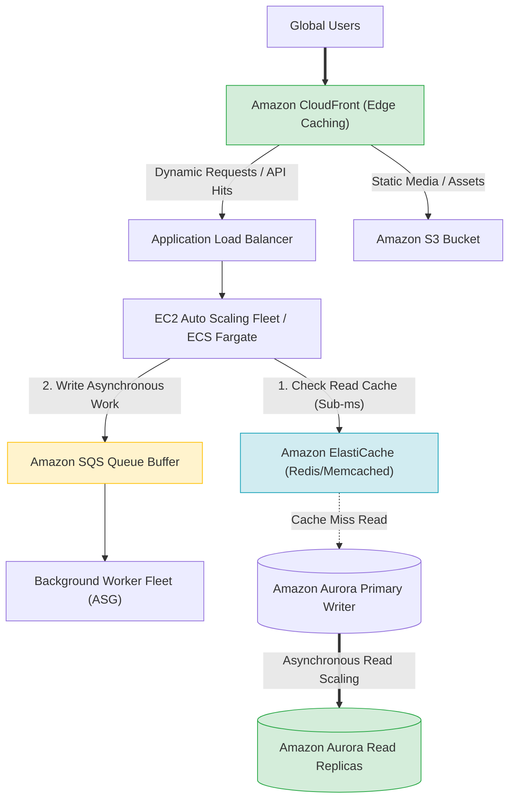
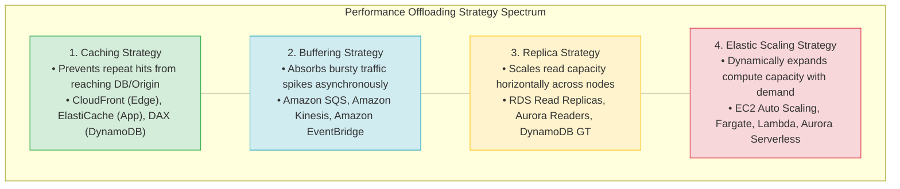
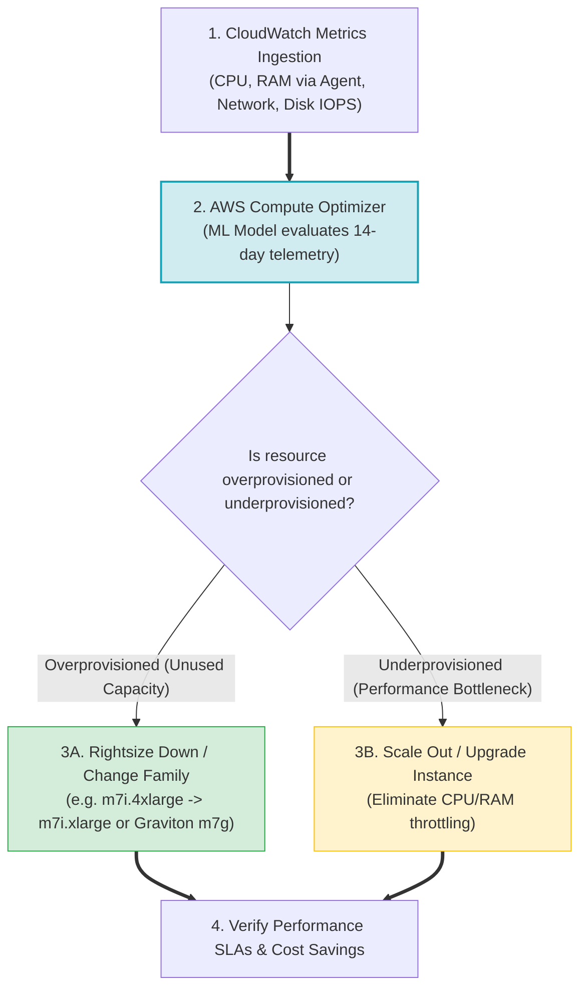
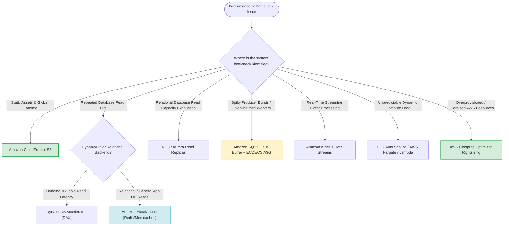

# Task 2.5: Design a Solution to Meet Performance Objectives — Skills & Synthesis

> [!NOTE]
> **Exam Mindset**: For the AWS Solutions Architect Professional (SAP-C02) and AI Practitioner (AIP-C01) exams, performance optimization is governed by five core skill domains:
> 1. **Access Pattern Architecture** $\rightarrow$ Match data access to purpose-built storage/compute.
> 2. **Elastic Scaling** $\rightarrow$ Dynamically align capacity with changing business demand.
> 3. **Performance Design Patterns** $\rightarrow$ Offload backends using **Caching**, **Buffering**, and **Replicas**.
> 4. **Purpose-Built Service Selection** $\rightarrow$ Select the specialized engine optimized for the task.
> 5. **Rightsizing Strategy** $\rightarrow$ Eliminate overprovisioned capacity without violating performance SLAs.

---

## 1. End-to-End Performance Optimization Architecture

A high-performance AWS architecture offloads work at every layer of the application stack:



---

## 2. Access Pattern Alignment Matrix

> [!IMPORTANT]
> **Exam Rule: Do Not Scale the Wrong Layer**: If a database experiences read starvation, adding EC2 application instances will **worsen** the database bottleneck. Scale or offload the exact layer causing the constraint.

| Workload Access Pattern | Recommended AWS Architecture Pattern |
| :--- | :--- |
| **Massive Static Content Reads** | Amazon CloudFront + Amazon S3 |
| **Repeated Database Reads** | Amazon ElastiCache (Redis / Memcached) |
| **Database Read Capacity Scaling** | Amazon RDS / Aurora Read Replicas |
| **Bursty Asynchronous Spikes** | Amazon SQS Queue + Auto Scaling Workers |
| **Real-Time Streaming Telemetry** | Amazon Kinesis Data Streams / Managed Streaming for Apache Kafka (MSK) |
| **Global Relational Reads** | Amazon Aurora Global Database |
| **Massive Key-Value NoSQL** | Amazon DynamoDB (+ DAX for microsecond reads) |
| **Graph Relationships (Social / Fraud)**| Amazon Neptune |
| **Time-Series / Metric Data** | Amazon Timestream |
| **Full-Text Search & Log Analytics** | Amazon OpenSearch Service |
| **Petabyte-Scale Data Warehouse** | Amazon Redshift |

---

## 3. The Four Pillars of Performance Offloading



---

## 4. Elasticity vs. Scalability

- **Scalability**: The structural ability of an application architecture to handle growing workload demand by adding resources.
- **Elasticity**: The ability of an AWS system to **automatically expand and contract** compute/storage capacity in real time based on fluctuating demand signals.

```
Scalability ──> System capacity can grow.
Elasticity  ──> Capacity automatically adjusts matching demand curve (Scale-Out + Scale-In).
```

---

## 5. Caching Mechanics Comparison: Edge vs. Application vs. Database

| Caching Layer | AWS Service | Primary Target Data | Primary Benefit |
| :--- | :--- | :--- | :--- |
| **Edge Cache** | Amazon CloudFront | Static web assets, media, API responses | Delivers content from nearest global edge location |
| **Application Cache**| Amazon ElastiCache | User sessions, DB query results, counters | Sub-millisecond in-memory application access |
| **Database Cache** | DynamoDB Accelerator (DAX) | DynamoDB `GetItem` / `Query` calls | Microsecond-level read response for DynamoDB |

---

## 6. Buffering & Asynchronous Integration Patterns

- **Amazon SQS**: Point-to-point asynchronous queue buffer. Absorbs producer traffic bursts so consumer worker fleets can process messages at a controlled pace.
- **Amazon Kinesis Data Streams**: High-throughput ordered stream processing for real-time telemetry and clickstream analytics.
- **Amazon SNS**: Pub/Sub topic for broadcasting a single event to multiple subscriber queues or endpoints.
- **AWS Step Functions**: Durable state machine orchestration with automated retries for multi-step distributed workflows.

---

## 7. Database Read Scaling: Multi-AZ vs. Read Replicas vs. Global Tables

> [!TIP]
> **Exam Distinction**:
> - **Multi-AZ**: Synchronous secondary deployment for **High Availability and Disaster Failover**. Does *not* serve active read traffic in standard RDS.
> - **Read Replicas**: Asynchronous secondary replicas designed for **Horizontal Read Scaling**.
> - **Aurora Global Database**: Cross-Region storage replication for global read performance and DR.
> - **DynamoDB Global Tables**: Multi-Region **Active-Active** multi-master replication.

---

## 8. Rightsizing Strategy & Cost Optimization Lifecycle



---

## 9. Managed vs. Unmanaged Operational Overhead Comparison

| Architecture Approach | Operational Overhead | Key Management Responsibilities Remaining |
| :--- | :--- | :--- |
| **Self-Managed DB on EC2** | **Very High** | OS patching, DB installation, backups, replication, failover |
| **EC2 + Manual Scaling** | **High** | OS security patches, custom instance capacity sizing |
| **EC2 + Auto Scaling Group** | **Medium** | AMI updates, scaling policy tuning, OS patching |
| **Amazon RDS / Aurora** | **Low** | Schema design, index tuning, maintenance windows |
| **AWS Fargate / Lambda** | **Very Low** | Application code & business logic only |
| **Amazon DynamoDB** | **Very Low** | Primary key design & IAM access policies |

---

## 10. SAP-C02 Performance & Scalability Master Decision Engine



---

## 11. SAP-C02 Exam Keyword Cheat Sheet

```
"Global static content delivery"        ──> Amazon CloudFront
"Global dynamic network acceleration"  ──> AWS Global Accelerator
"Repeated database read offloading"     ──> Amazon ElastiCache
"DynamoDB microsecond read cache"       ──> DynamoDB Accelerator (DAX)
"Relational DB read capacity scaling"   ──> RDS / Aurora Read Replicas
"Global relational read scaling"        ──> Aurora Global Database
"Absorb bursty asynchronous spikes"     ──> Amazon SQS Queue Buffer
"Real-time ordered streaming telemetry" ──> Amazon Kinesis Data Streams
"Automatic compute elasticity"          ──> EC2 Auto Scaling / AWS Fargate
"Serverless event-driven compute"       ──> AWS Lambda
"ML-driven EC2 rightsizing guidance"    ──> AWS Compute Optimizer
"Minimal operational management overhead"──> AWS Managed / Serverless Services
```

---

## 12. Common SAP-C02 Exam Traps

1. **Trap 1: Scaling compute when the database is the bottleneck**: Adding EC2 instances to a read-starved database increases concurrent connections and crashes the DB. Add **ElastiCache** or **Read Replicas**.
2. **Trap 2: Confusing Multi-AZ with Read Replicas**: Multi-AZ is for *High Availability / Failover*. Standard RDS Multi-AZ standbys do not serve read traffic. Use **Read Replicas** for read scaling.
3. **Trap 3: Using CloudFront for Non-HTTP Static Anycast IP Traffic**: CloudFront accelerates HTTP/HTTPS content. For non-HTTP TCP/UDP protocols requiring static Anycast IPs, use **AWS Global Accelerator**.
4. **Trap 4: Rightsizing purely by downsizing without checking IOPS/Memory**: Reducing instance size to cut costs can cause memory exhaustion or EBS IOPS throttling. Always analyze ML guidance in **AWS Compute Optimizer**.

---

## 13. Final Mental Model

`Identify Bottleneck ➔ Offload (Cache/Buffer/Replica) ➔ Elastic Auto Scaling ➔ Prefer Managed Services ➔ Rightsize via Compute Optimizer`