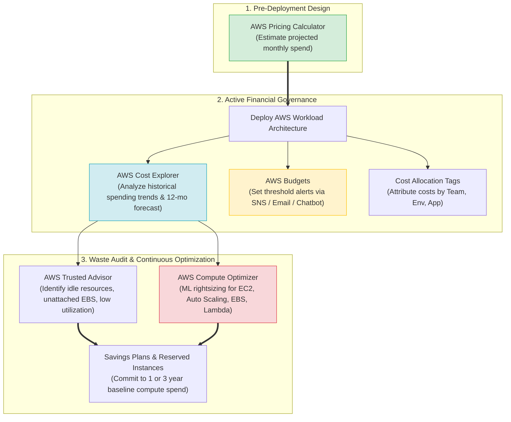
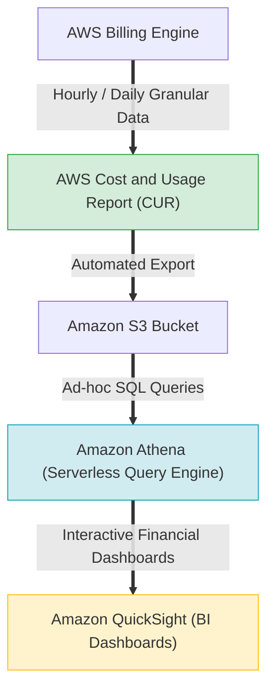
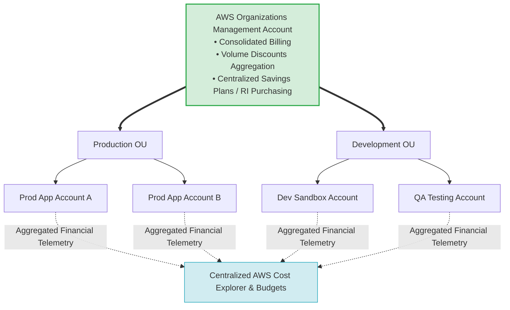
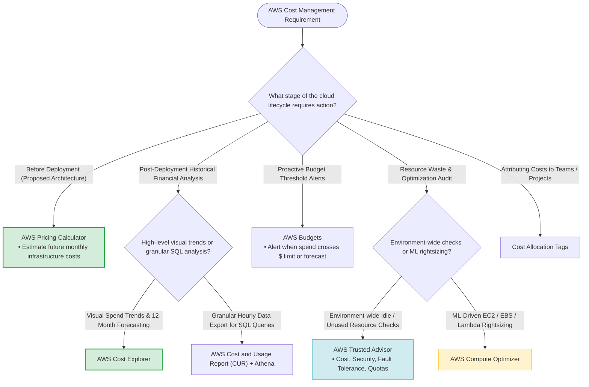

# Task 2.6: Determine a Cost Optimization Strategy — AWS Cost and Usage Monitoring Tools

> [!NOTE]
> **Exam Mindset**: For the AWS Solutions Architect Professional (SAP-C02) and AI Practitioner (AIP-C01) exams, cost management is tested through precise functional boundaries:
> - **AWS Pricing Calculator**: *"What will a proposed architecture cost before deployment?"*
> - **AWS Cost Explorer**: *"What did we spend historically, and where are spending trends heading?"*
> - **AWS Trusted Advisor**: *"Where are we wasting money, creating security risks, or violating service quotas?"*
> - **AWS Compute Optimizer**: *"Which exact instances or volumes should be rightsized using machine learning?"*
> - **AWS Budgets**: *"Alert me when actual or forecasted spending exceeds a threshold."*

---

## 1. AWS Financial Governance & Cost Optimization Lifecycle



---

## 2. Core AWS Cost Management Tools Comparison Matrix

| Cost Management Tool | Primary Purpose | Lifecycle Timing | Key Exam Keyword Trigger |
| :--- | :--- | :--- | :--- |
| **AWS Pricing Calculator** | Estimate infrastructure costs before building | Pre-Deployment | *"Estimate / Forecast cost of proposed architecture"* |
| **AWS Cost Explorer** | Analyze historical spending, trends, and forecasts | Post-Deployment | *"Analyze historical spending / Find cost increase"* |
| **AWS Trusted Advisor** | Identify idle resources, security gaps, and limits | Ongoing Operations | *"Identify idle resources / Underutilized EC2"* |
| **AWS Compute Optimizer** | ML-driven rightsizing recommendations | Ongoing Operations | *"Machine learning rightsizing recommendations"* |
| **AWS Budgets** | Set custom alerts for cost and usage limits | Ongoing Operations | *"Notify / Alert when spend exceeds threshold"* |
| **Cost & Usage Report (CUR)**| Export granular billing telemetry to S3 for SQL analysis| Continuous Data Export | *"Detailed billing export / SQL analysis via Athena"* |
| **Cost Allocation Tags** | Attribute costs to specific teams or environments | Continuous Tagging | *"Attribute spending by department / project / env"* |

---

## 3. Granular Cost Telemetry: CUR + Athena + QuickSight Pipeline



> [!IMPORTANT]
> **Exam Trigger**: *"Need raw, highly granular hourly billing data exported for custom SQL analysis"* $\longrightarrow$ **AWS Cost and Usage Report (CUR)** combined with **Amazon Athena**.

---

## 4. Multi-Account Financial Governance in AWS Organizations



---

## 5. Cost Optimization Hierarchy & Execution Order

> [!TIP]
> **Cost Optimization Order of Operations**:
> 1. **Eliminate Waste**: Terminate idle EC2 instances, unattached EBS volumes, and unassociated Elastic IPs (via **Trusted Advisor**).
> 2. **Rightsize Capacity**: Scale down overprovisioned EC2 instances, EBS volumes, and Lambda memory (via **Compute Optimizer**).
> 3. **Dynamic Elasticity**: Implement Auto Scaling so capacity matches demand automatically.
> 4. **Commitment Discounts**: Apply **Savings Plans** or **Reserved Instances** to predictable baseline usage.
> 5. **Spot Instances**: Use Spot instances for fault-tolerant batch or stateless worker tasks.

---

## 6. SAP-C02 Cost Management Tool Master Decision Engine



---

## 7. SAP-C02 Exam Keyword Cheat Sheet

```
"Estimate architecture costs before deployment" ──> AWS Pricing Calculator
"Analyze historical spend trends & 12-mo forecast"──> AWS Cost Explorer
"Find idle resources & unattached EBS volumes"    ──> AWS Trusted Advisor
"ML recommendations for EC2/EBS rightsizing"    ──> AWS Compute Optimizer
"Alert finance team when spend reaches limit"    ──> AWS Budgets
"Export detailed hourly billing data for SQL"     ──> AWS Cost and Usage Report (CUR) + Athena
"Attribute spending by team/department/env"      ──> Cost Allocation Tags
"Consolidated billing across multiple accounts"  ──> AWS Organizations
"1 or 3 year commitment for steady compute spend"──> Compute Savings Plans
"Fault-tolerant batch processing up to 90% off" ──> Spot Instances
```

---

## 8. Common SAP-C02 Exam Traps

1. **Trap 1: Selecting Pricing Calculator for Historical Analysis**: The **AWS Pricing Calculator** is strictly for estimating *future* proposed architectures. Use **AWS Cost Explorer** to analyze *past* spending.
2. **Trap 2: Choosing Trusted Advisor for Detailed Financial Forecasting**: Trusted Advisor checks for waste and security recommendations; it does not generate financial trend graphs or forecasts (use **AWS Cost Explorer**).
3. **Trap 3: Picking the Cheapest Solution that Fails SLAs**: If an option is cheaper but violates business SLAs (e.g. single-AZ deployment for $99.99\%$ SLA requirement), it is **wrong**. Always satisfy availability and security first, then optimize cost.
4. **Trap 4: Using Cost Explorer when Raw SQL Billing Data is Required**: Cost Explorer provides visual charts. If the prompt requires custom SQL queries over millions of line items, select **AWS Cost and Usage Report (CUR) + Amazon Athena**.

---

## 9. Final Mental Model

`Estimate (Pricing Calculator) ➔ Deploy ➔ Track (Cost Explorer/CUR) ➔ Alert (Budgets) ➔ Detect Waste (Trusted Advisor) ➔ Rightsize (Compute Optimizer) ➔ Commit (Savings Plans)`