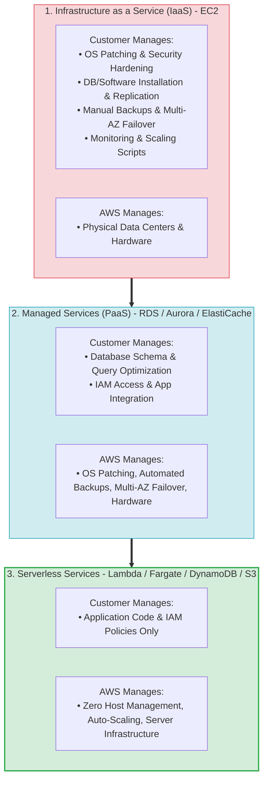
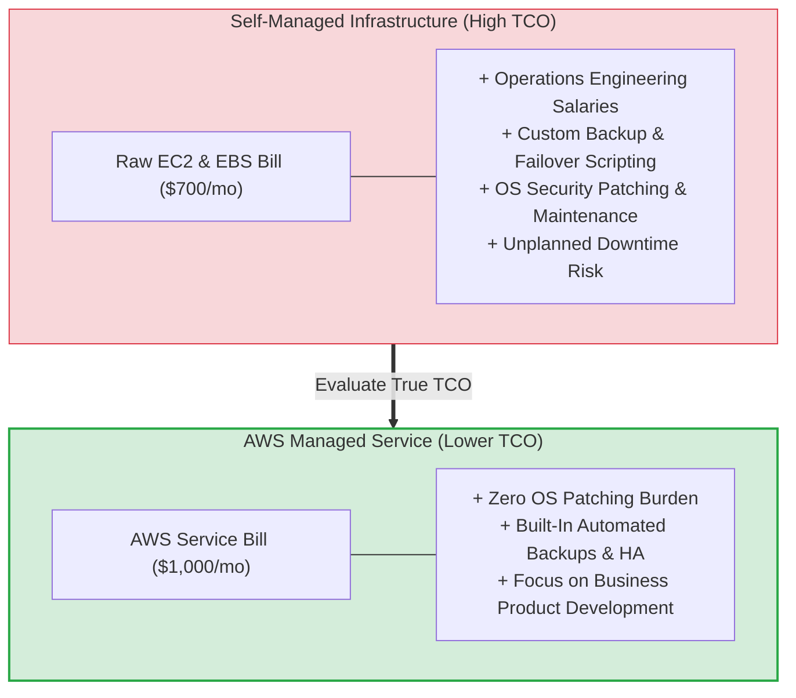
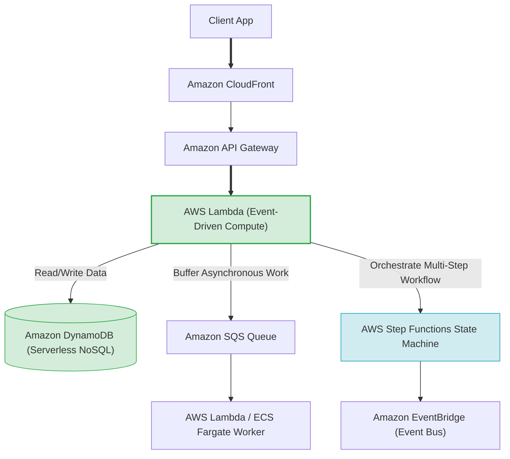
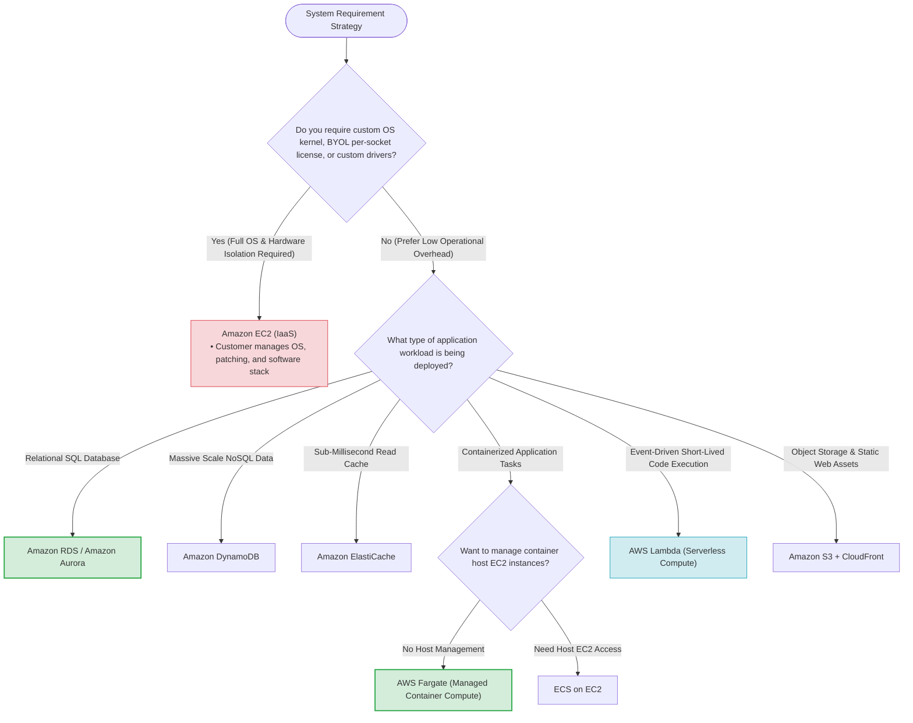

# Task 2.6: Determine a Cost Optimization Strategy — AWS Managed Service Offerings

> [!NOTE]
> **Exam Mindset**: For the AWS Solutions Architect Professional (SAP-C02) and AI Practitioner (AIP-C01) exams, the foundational rule for managed services is:
> **"Eliminate undifferentiated heavy lifting. Do not build, patch, and operate infrastructure yourself when an AWS managed service satisfies the requirement at a lower Total Cost of Ownership (TCO)."**

---

## 1. Shared Responsibility & Operational Overhead Shift



---

## 2. Managed Services vs. Self-Managed EC2 Comparison Matrix

| Architectural Layer | Self-Managed on EC2 (IaaS) | AWS Managed Service (PaaS) | AWS Serverless Service |
| :--- | :--- | :--- | :--- |
| **Compute / OS** | EC2 (Customer patches OS) | RDS / ECS on EC2 (AWS manages OS) | AWS Lambda / Fargate (Zero OS access) |
| **Database** | Self-Managed MySQL on EC2 | Amazon RDS / Amazon Aurora | Amazon DynamoDB |
| **Shared File System**| Self-Managed NFS on EC2 | Amazon EFS / Amazon FSx | Amazon S3 (Object Storage) |
| **Caching** | Self-Managed Redis on EC2 | Amazon ElastiCache | DynamoDB Accelerator (DAX) |
| **Messaging Queue** | Self-Managed RabbitMQ on EC2 | Amazon MQ | Amazon SQS |
| **Workflow State** | Custom DB State Machine | AWS Step Functions | AWS Step Functions |

---

## 3. Total Cost of Ownership (TCO) Spectrum



> [!IMPORTANT]
> **TCO Rule: Infrastructure vs. Operational Cost**:
> A self-managed EC2 solution may show a cheaper raw monthly AWS bill, but when accounting for **DBA salaries**, **OS patching overhead**, **custom backup scripts**, and **downtime risks**, an AWS Managed Service (like RDS or Aurora) delivers a significantly lower **Total Cost of Ownership (TCO)**.

---

## 4. Modern Serverless Application Architecture Stack



---

## 5. Container Compute: ECS Fargate vs. ECS on EC2

| Dimension | AWS Fargate (Serverless Containers) | ECS on EC2 (Container Host Fleet) |
| :--- | :--- | :--- |
| **Host Management** | **Zero host provisioning or OS patching** | Customer manages, scales, and patches EC2 host fleet |
| **Pricing Model** | Pay per vCPU and Memory requested per second | Pay for underlying EC2 instances (running or idle) |
| **Operational Effort** | **Minimal** | Medium (requires EC2 host Auto Scaling policy tuning) |
| **Best Fit** | Variable workloads, microservices, minimal ops team | Large steady-state fleets, custom host GPUs, BYOL licenses |

---

## 6. What Managed Services Do NOT Eliminate

> [!WARNING]
> **Exam Trap: Managed Service $\neq$ Zero Management**:
> AWS managed services handle underlying infrastructure, but you are still responsible for:
> - **Amazon RDS**: Schema design, query indexing, parameter groups, IAM access policies, capacity selection.
> - **Amazon S3**: Bucket policies, encryption rules, versioning, object lifecycle policies, storage class selection.
> - **AWS Lambda**: Code execution logic, memory allocation, timeout limits, concurrency limits, IAM roles.

---

## 7. When NOT to Use Managed Services

Do **NOT** force a managed service when business requirements demand:
- **Full OS Access**: Require root access or custom Linux kernel modules.
- **Unsupported Legacy Software**: Legacy database engines or custom software extensions unsupported by RDS.
- **BYOL Per-Socket Licensing**: Dedicated host hardware visibility required for per-socket software licenses.

---

## 8. SAP-C02 Managed vs. Custom Compute Selection Master Decision Engine



---

## 9. SAP-C02 Exam Keyword Cheat Sheet

```
"Minimize operational overhead"             ──> Managed / Serverless Services (RDS / Fargate / Lambda)
"Reduce patching & server maintenance"      ──> Managed AWS Services / Systems Manager Patch Manager
"Small operations team / Focus on code"    ──> AWS Lambda / AWS Fargate / Amazon DynamoDB
"Container workload without managing hosts"  ──> AWS Fargate
"Managed relational database"              ──> Amazon RDS / Amazon Aurora
"Managed message queue / Decouple"          ──> Amazon SQS
"Managed pub/sub fan-out"                  ──> Amazon SNS
"Managed workflow orchestration"            ──> AWS Step Functions
"Event-driven serverless routing"          ──> Amazon EventBridge
"Centralized fleet patch management"        ──> AWS Systems Manager (Patch Manager)
"Centralized enterprise backup management"  ──> AWS Backup
"Full OS control / Custom kernel module"    ──> Amazon EC2
```

---

## 10. Common SAP-C02 Exam Traps

1. **Trap 1: Assuming Managed Services are Always Cheaper Raw Price**: A managed service bill may look higher than raw EC2 instances. Always evaluate **Total Cost of Ownership (TCO)** including DBA and engineering labor.
2. **Trap 2: Forcing Lambda for Long-Running Batch Workloads**: Lambda has a 15-minute maximum execution timeout. For long-running batch jobs, use **AWS Fargate / AWS Batch** or **EC2 Auto Scaling**.
3. **Trap 3: Choosing EC2 to Build Custom Queues or Caches**: Building RabbitMQ or Redis on EC2 adds unnecessary patching and failover management. Always prefer **Amazon SQS** and **Amazon ElastiCache**.
4. **Trap 4: Forgetting Customer Responsibilities on Managed Services**: RDS does not write your SQL queries or optimize your indexes. You remain responsible for schema design and query performance.

---

## 11. Final Mental Model

`Identify Requirement ➔ Prefer Managed/Serverless Service ➔ Evaluate TCO ➔ Check Control Limitations (OS/BYOL) ➔ Select Smallest Managed Architecture`