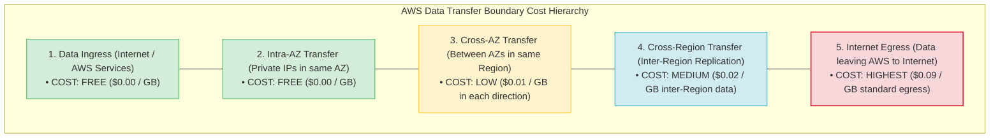
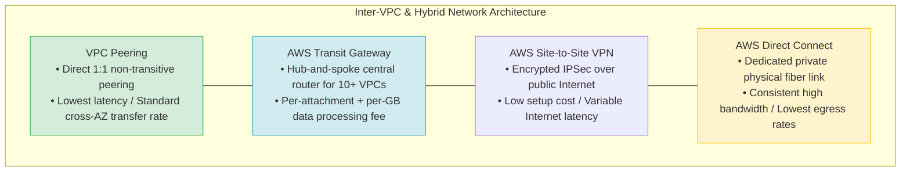
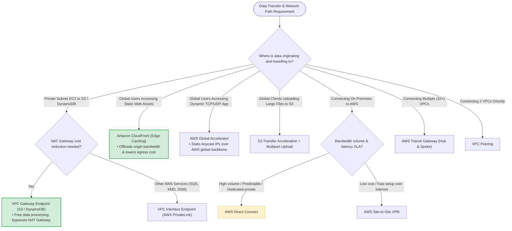

# Task 2.6: Determine a Cost Optimization Strategy — Data Transfer Costs

> [!NOTE]
> **Exam Mindset**: For the AWS Solutions Architect Professional (SAP-C02) and AI Practitioner (AIP-C01) exams, view data transfer as a primary **architectural decision**, not merely a billing line item.
> Analyze data movement across four fundamental questions:
> **Source & Destination** $\rightarrow$ **Network Boundaries Crossed** (AZ / Region / Internet) $\rightarrow$ **Data Volume & Frequency** $\rightarrow$ **Private / Edge Path Optimization**.

---

## 1. AWS Data Transfer Cost Boundaries & Routing Hierarchy



---

## 2. Core Data Transfer Rules & Cost Structure Matrix

| Network Path Boundary | Ingress Cost | Egress / Transfer Cost | Architectural Optimization Strategy |
| :--- | :--- | :--- | :--- |
| **Internet to AWS** | **FREE** | Standard Egress Rate | Keep ingress endpoints within AWS |
| **AWS to Internet** | N/A | **Highest Rate** ($\sim \$0.09/\text{GB}$) | Use **CloudFront Edge Caching** to reduce origin egress |
| **Same AZ (Private IP)** | **FREE** | **FREE** | Keep heavy communicating nodes in same AZ (if HA allows) |
| **Cross-AZ (Same Region)** | $\$0.01/\text{GB}$ | $\$0.01/\text{GB}$ (Both sides) | Balance Multi-AZ HA requirements against cross-AZ traffic |
| **Cross-Region Replication**| $\$0.00/\text{GB}$ | Inter-Region Rate ($\sim \$0.02/\text{GB}$)| Match replication to RTO/RPO; avoid unnecessary copies |
| **NAT Gateway Processing** | N/A | $\$0.045/\text{GB}$ data processed | Bypass NAT Gateway for S3/DynamoDB using **Gateway Endpoints** |

---

## 3. Eliminating NAT Gateway Data Processing Costs via Gateway Endpoints

```mermaid
flowchart TD
    subgraph Expensive_NAT_Path ["1. High-Cost NAT Gateway Route (Priced per GB processed)"]
        EC2_A["Private Subnet EC2 Instance"] ==>|"Data Transfer + $0.045/GB Processing"| NAT["NAT Gateway (Public Subnet)"]
        NAT ==>|"Public Internet Path"| S3_Public["Amazon S3 Bucket"]
    end

    subgraph Zero_Cost_Endpoint_Path ["2. Cost-Optimized Gateway Endpoint Route (Zero Data Fee)"]
        EC2_B["Private Subnet EC2 Instance"] ==>|"Direct Private Route (FREE Data Processing)"| GW_Endpoint["S3 VPC Gateway Endpoint"]
        GW_Endpoint ==>|"AWS Internal Backbone"| S3_Private["Amazon S3 Bucket"]
    end

    style Expensive_NAT_Path fill:#f8d7da,stroke:#dc3545,stroke-width:1px
    style Zero_Cost_Endpoint_Path fill:#d4edda,stroke:#28a745,stroke-width:2px
```



> [!IMPORTANT]
> **Exam Rule 1: NAT Gateway vs. VPC Gateway Endpoints**:
> Routing large-scale S3 or DynamoDB traffic from private subnets through a NAT Gateway incurs expensive hourly and per-GB data processing fees. Always deploy **S3 & DynamoDB Gateway Endpoints** (which are **free of charge**) to route traffic over the AWS internal network.

---

## 4. Global Acceleration & Ingestion Comparison

| Service | Protocol / Traffic Focus | Primary Operational Purpose | Exam Keyword Trigger |
| :--- | :--- | :--- | :--- |
| **Amazon CloudFront** | HTTP / HTTPS (Static & Dynamic) | Edge caching & origin egress cost reduction | *"Global users + static content + reduce origin load"* |
| **AWS Global Accelerator**| TCP / UDP (Dynamic non-cached) | Static Anycast IPs & global network routing | *"Global users + dynamic TCP/UDP app + no DNS caching"* |
| **S3 Transfer Acceleration**| S3 PUT / GET Uploads | Long-distance accelerated uploads to S3 | *"Global clients uploading large files to S3"* |
| **Multipart Upload** | S3 API Parallel Uploads | High-throughput parallel large-object upload | *"Upload files > 100 MB in parallel parts"* |

---

## 5. Hybrid & Inter-VPC Connectivity Spectrum



> [!TIP]
> **Direct Connect vs. VPN Egress Pricing**:
> **AWS Direct Connect** provides significantly lower data egress rates compared to standard public Internet egress, making it highly cost-effective for continuous, high-volume hybrid data transfers.

---

## 6. SAP-C02 Data Transfer Cost & Network Path Master Decision Engine



---

## 7. SAP-C02 Exam Keyword Cheat Sheet

```
"Bypass NAT Gateway cost for S3 / DynamoDB" ──> VPC Gateway Endpoint
"Private connection to AWS services"        ──> VPC Interface Endpoint (AWS PrivateLink)
"Reduce S3 origin egress bandwidth"         ──> Amazon CloudFront Edge Caching
"Accelerate dynamic TCP/UDP global traffic"  ──> AWS Global Accelerator
"Accelerate long-distance S3 uploads"       ──> S3 Transfer Acceleration + Multipart Upload
"High-volume, private, dedicated hybrid link"──> AWS Direct Connect
"Low-cost, quick setup encrypted hybrid link"──> AWS Site-to-Site VPN
"Centralized hub-and-spoke multi-VPC router" ──> AWS Transit Gateway
"Direct 1:1 private connection between 2 VPCs"──> VPC Peering
"Investigate unexpected network traffic spikes"──> VPC Flow Logs + Cost Explorer
```

---

## 8. Common SAP-C02 Exam Traps

1. **Trap 1: Routing Private Subnet S3 Traffic via NAT Gateway**: Sending large-scale S3 traffic through NAT Gateway incurs heavy per-GB data processing fees. Always use **S3 Gateway Endpoints** (which are free).
2. **Trap 2: Sacrificing Multi-AZ HA to Save Cross-AZ Transfer Fees**: While cross-AZ traffic costs $\$0.01/\text{GB}$, placing all EC2 instances in a single AZ creates a single point of failure. Production availability **always overrides** minor cross-AZ transfer charges.
3. **Trap 3: Using Global Accelerator when Caching is Required**: Global Accelerator accelerates network routing but does **not cache content**. For static content caching, use **Amazon CloudFront**.
4. **Trap 4: Selecting Direct Connect for One-Time S3 Uploads**: Setting up Direct Connect requires months and high infrastructure commitments. For fast one-time S3 uploads, use **S3 Transfer Acceleration + Multipart Upload** or **AWS Snowball Edge**.

---

## 9. Final Mental Model

`Eliminate Unnecessary Transfer ➔ Keep Local (Same AZ where HA allows) ➔ Cache Edge (CloudFront) ➔ Bypass NAT Gateway (Gateway Endpoints) ➔ Optimize Egress (Direct Connect)`