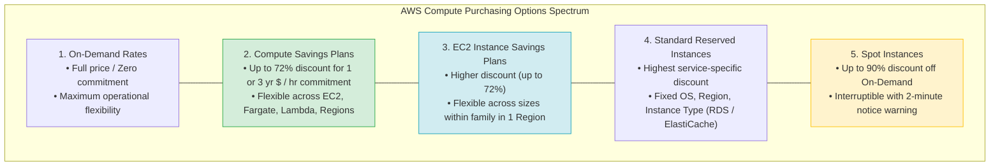
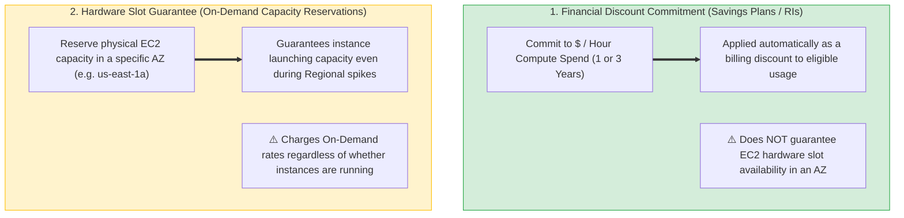
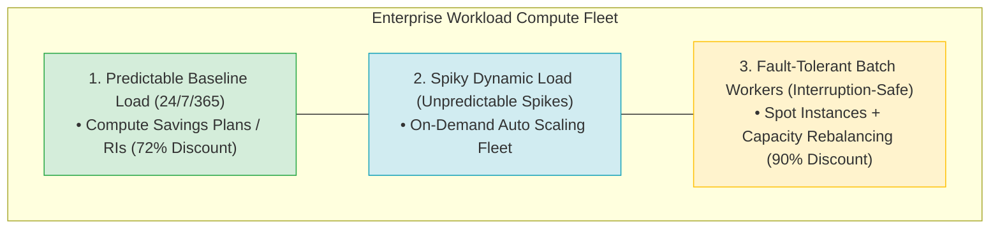
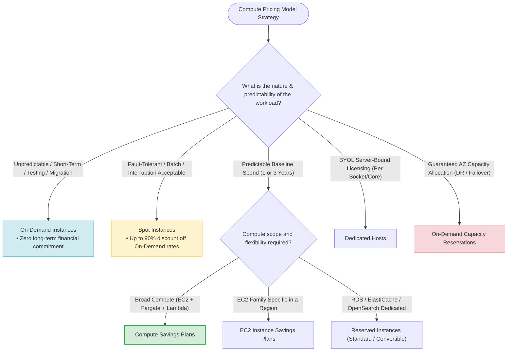

# Task 2.6: Determine a Cost Optimization Strategy — AWS Pricing Models

> [!NOTE]
> **Exam Mindset**: For the AWS Solutions Architect Professional (SAP-C02) and AI Practitioner (AIP-C01) exams, do not select pricing models based solely on *"Which service is cheapest?"*. Evaluate pricing model selection along a structured decision framework:
> **Workload Predictability** $\rightarrow$ **Interruption Tolerance** $\rightarrow$ **Scope & Flexibility** $\rightarrow$ **Licensing / Tenancy Constraints** $\rightarrow$ **AZ Capacity Guarantees**.

---

## 1. AWS Compute Purchasing Options Spectrum



---

## 2. Core AWS Pricing Models Comparison Matrix

| Pricing Model | Financial Commitment | Max Discount | Flexibility Level | Ideal Workload Profile | Key Exam Keyword Trigger |
| :--- | :--- | :--- | :--- | :--- | :--- |
| **On-Demand** | None (Pay per second) | Baseline ($0\%$) | **Maximum** | Unpredictable, short-term, dev/test | *"Unpredictable / Short-term / Variable"* |
| **Compute Savings Plans** | 1 or 3 Year ($\$/\text{hr}$) | Up to $72\%$ | **High** (EC2, Fargate, Lambda) | Steady-state baseline across multiple services | *"Predictable spend / EC2 + Fargate + Lambda"* |
| **EC2 Instance Savings Plans**| 1 or 3 Year ($\$/\text{hr}$) | Up to $72\%$ | **Medium** (Size changes in family) | Predictable EC2 usage in specific family/Region| *"Specific EC2 family in a Region"* |
| **Standard Reserved Instances**| 1 or 3 Year (Fixed) | Up to $72\%$ | **Low** (Specific service config) | Fixed RDS, ElastiCache, OpenSearch DBs | *"Stable RDS database / Maximum discount"* |
| **Convertible Reserved Instances**| 1 or 3 Year (Fixed) | Up to $54\%$ | **Medium** (Convert instance attributes)| Predictable long-term DB with evolving spec | *"Long-term commitment / Changing instance types"* |
| **Spot Instances** | None (Interruptible) | Up to $90\%$ | **N/A** (Interruptible) | Fault-tolerant, stateless batch workers | *"Can tolerate interruption / Fault-tolerant"* |
| **Dedicated Hosts** | 1 or 3 Year / On-Demand | Standard / Disct | Host-level physical isolation | BYOL server-bound per-socket/core licenses | *"Existing server-bound license / Per socket"* |

---

## 3. Financial Discount vs. Hardware Capacity Guarantee



> [!IMPORTANT]
> **Exam Distinction**:
> - **Savings Plans & Reserved Instances**: Provide **financial billing discounts** for long-term usage. They do *not* guarantee hardware capacity in a specific Availability Zone.
> - **On-Demand Capacity Reservations**: Guarantee **physical EC2 hardware capacity** in a specific Availability Zone (e.g. for DR failover events). They charge On-Demand rates unless coupled with a Savings Plan/RI.

---

## 4. Enterprise Compute Purchasing Architecture Strategy



---

## 5. Tenancy Options: Dedicated Hosts vs. Dedicated Instances

| Feature | Dedicated Hosts | Dedicated Instances |
| :--- | :--- | :--- |
| **Physical Isolation** | Fully dedicated physical server | Runs on hardware dedicated to single AWS account |
| **Host Visibility & Control** | Full visibility into physical sockets, cores, host ID | No physical host visibility or placement control |
| **BYOL Licensing Support** | **Required for per-socket / per-core software licenses** | Standard AWS software licensing model |
| **Affinity** | Host affinity supported (instances restart on same host) | No host affinity guarantees |

---

## 6. SAP-C02 Pricing Models Master Selection Decision Engine



---

## 7. SAP-C02 Exam Keyword Cheat Sheet

```
"Unpredictable / Short-term / Variable workload" ──> On-Demand Instances
"Fault-tolerant / Batch / Interruption tolerable" ──> Spot Instances + Capacity Rebalancing
"Predictable spend across EC2, Fargate, Lambda"  ──> Compute Savings Plans
"Predictable EC2 usage in specific family/Region" ──> EC2 Instance Savings Plans
"Stable production RDS database for 3 years"       ──> RDS Reserved Instances (Standard RI)
"Evolving database spec over 3 years"             ──> Convertible Reserved Instances
"BYOL server-bound per-socket / per-core license" ──> Dedicated Hosts
"Guaranteed EC2 capacity in a specific AZ"        ──> On-Demand Capacity Reservations
```

---

## 8. Common SAP-C02 Exam Traps

1. **Trap 1: Selecting Reserved Instances for EC2 + Fargate + Lambda Flexibility**: Standard Reserved Instances are tied to specific services. For cross-service compute flexibility (EC2 + Fargate + Lambda), choose **Compute Savings Plans**.
2. **Trap 2: Confusing Reserved Instances with Capacity Reservations**: Reserved Instances provide a *billing discount* but do not guarantee a physical server slot in an AZ. Use **On-Demand Capacity Reservations** for guaranteed capacity.
3. **Trap 3: Selecting Spot Instances for Single-Instance Databases**: Spot instances can be interrupted with a 2-minute notice. Never run databases or critical single-instance stateful workloads on Spot.
4. **Trap 4: Choosing Dedicated Instances for BYOL Per-Core Licenses**: Dedicated Instances isolate hardware but do not provide physical host visibility (sockets/cores) required for BYOL compliance. Use **Dedicated Hosts**.

---

## 9. Final Mental Model

`Predictability determines Commitment ➔ Scope determines Plan Type (Compute vs Instance vs RI) ➔ Interruption determines Spot ➔ Licensing determines Dedicated Hosts ➔ Failover determines Capacity Reservation`