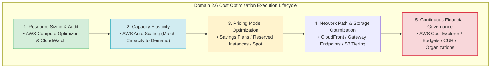
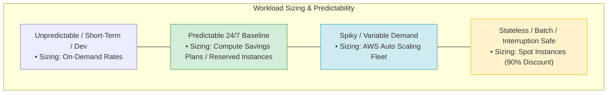
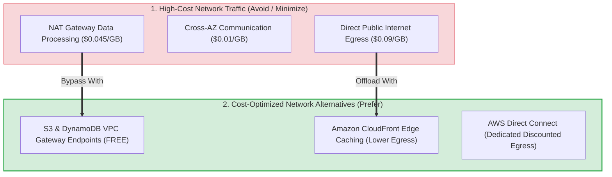
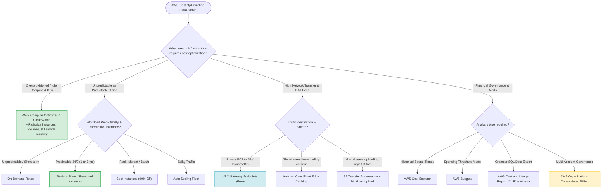

# Task 2.6: Determine a Cost Optimization Strategy — Master Skills Reference

> [!NOTE]
> **Exam Mindset**: For the AWS Solutions Architect Professional (SAP-C02) and AI Practitioner (AIP-C01) exams, Domain 2.6 evaluates your ability to design cost-effective architectures without sacrificing **performance**, **availability**, **security**, or **business SLAs**.
> Cost optimization is governed by the core rule:
> **"Optimize Total Cost of Ownership (TCO) across infrastructure, data transfer, operations, licensing, and engineering effort within required business constraints."**

---

## 1. End-to-End Cost Optimization Strategy Lifecycle



---

## 2. Core Domain 2.6 Skills Breakdown Matrix

| Skill Area | Primary Focus | Key AWS Services & Tools | Primary Exam Action |
| :--- | :--- | :--- | :--- |
| **1. Infrastructure Rightsizing** | Eliminate overprovisioning & idle capacity | AWS Compute Optimizer, CloudWatch, Trusted Advisor | Move underutilized instances to smaller sizes; Auto Scale |
| **2. Pricing Model Selection** | Match commitment & flexibility to workload | Savings Plans, Reserved Instances, Spot, On-Demand | Apply Savings Plans/RIs to 24/7 baseline; Spot for batch |
| **3. Data Transfer Modeling** | Reduce cross-boundary network costs | Gateway Endpoints, CloudFront, Direct Connect | Bypass NAT Gateway with Gateway Endpoints; Cache at Edge |
| **4. Expenditure Governance** | Proactive visibility, alerts, & organization tags | Cost Explorer, AWS Budgets, CUR, AWS Organizations | Set threshold alerts; export CUR SQL; consolidated billing |

---

## 3. Identifying and Rightsizing Infrastructure



> [!IMPORTANT]
> **Rightsizing Assessment Rule**:
> Low CPU utilization alone does not automatically mean *"terminate or downsize instantly"*. Always evaluate **CPU**, **Memory**, **Network I/O**, **Disk I/O**, **Application Latency**, and **Peak Traffic Spikes**.
> - **Variable Spiky Demand** $\rightarrow$ Deploy **AWS Auto Scaling**.
> - **Consistently Oversized Baseline** $\rightarrow$ Downsize instance family/size via **AWS Compute Optimizer** recommendations.

---

## 4. Network Path & Data Transfer Cost Reduction Mechanics



> [!TIP]
> **NAT Gateway Cost Elimination**:
> When private subnet EC2 instances frequently transfer large volumes of data to **Amazon S3** or **Amazon DynamoDB**, route the traffic through **VPC Gateway Endpoints** (which incur **zero data processing or hourly charges**) instead of NAT Gateways.

---

## 5. Expenditure Awareness & Multi-Account Financial Governance

| Financial Governance Tool | Functional Scope | Key Exam Keyword Trigger |
| :--- | :--- | :--- |
| **AWS Cost Explorer** | Visual spend analysis, 12-month trends, & forecasting | *"Analyze historical spending / Identify cost spike"* |
| **AWS Budgets** | Proactive threshold notifications via SNS/Email | *"Alert finance team when spend exceeds $ limit"* |
| **Cost & Usage Report (CUR)** | Raw hourly/daily billing data exported to S3 for SQL | *"Detailed line-item billing export for SQL via Athena"* |
| **AWS Organizations** | Multi-account consolidated billing & volume discounts | *"Centralized billing across multiple accounts / OUs"* |

> [!WARNING]
> **Budgets Alerting Trap**:
> **AWS Budgets** notifies administrators via email/SNS when threshold limits are breached; it does **not** automatically shut down or terminate running production resources unless coupled with automated custom Lambda/SSM actions.

---

## 6. SAP-C02 Domain 2.6 Master Cost Strategy Decision Engine



---

## 7. Master SAP-C02 Exam Keyword Cheat Sheet

```
"Identify underutilized EC2 instances & rightsizing" ──> AWS Compute Optimizer + CloudWatch
"Unpredictable short-term workload"                 ──> On-Demand Instances
"Predictable 24/7 baseline compute for 1-3 years"   ──> Compute Savings Plans / Reserved Instances
"Fault-tolerant batch processing at lowest cost"     ──> Spot Instances + Auto Scaling
"Bypass NAT Gateway cost for S3 / DynamoDB"         ──> VPC Gateway Endpoints
"Reduce static content origin bandwidth egress"     ──> Amazon CloudFront Edge Caching
"Accelerate large global file uploads to S3"        ──> S3 Transfer Acceleration + Multipart Upload
"Analyze historical spend & spending trends"        ──> AWS Cost Explorer
"Alert finance team when spending reaches limit"   ──> AWS Budgets
"Export detailed raw billing line-items for SQL"    ──> AWS Cost and Usage Report (CUR) + Athena
"Consolidated billing across multiple AWS accounts" ──> AWS Organizations
"Reduce operational overhead / TCO"                ──> AWS Managed Services (RDS / Fargate / Lambda)
```

---

## 8. High-Value SAP-C02 Exam Traps

1. **Trap 1: Choosing the Cheapest Raw Infrastructure without TCO Assessment**: A self-managed MySQL database on EC2 may show a lower raw compute bill than Aurora, but when accounting for **DBA patching salaries**, **backup scripts**, and **downtime risks**, Aurora delivers a significantly lower Total Cost of Ownership (TCO).
2. **Trap 2: Sacrificing High Availability to Eliminate Cross-AZ Transfer Charges**: Cross-AZ traffic costs $\$0.01/\text{GB}$, but placing all EC2 instances in a single AZ creates a single point of failure. Production Multi-AZ availability **always overrides** minor cross-AZ transfer fees.
3. **Trap 3: Selecting Spot Instances for Stateful Single-Instance Databases**: Spot instances can be interrupted with a 2-minute warning. Never select Spot instances for databases or critical stateful workloads.
4. **Trap 4: Forgetting that S3 Gateway Endpoints are Free**: Interface Endpoints incur hourly and per-GB fees, whereas **Gateway Endpoints (for S3 & DynamoDB) are 100% free**.

---

## 9. Final Master Memory Model

`Rightsize (Compute Optimizer) ➔ Match Sizing to Elasticity (Auto Scaling) ➔ Commit Predictable Spend (Savings Plans/RIs) ➔ Use Spot for Interruptible ➔ Bypass NAT Gateway (Gateway Endpoints) ➔ Cache Edge (CloudFront) ➔ Monitor & Alert (Cost Explorer / Budgets / CUR)`