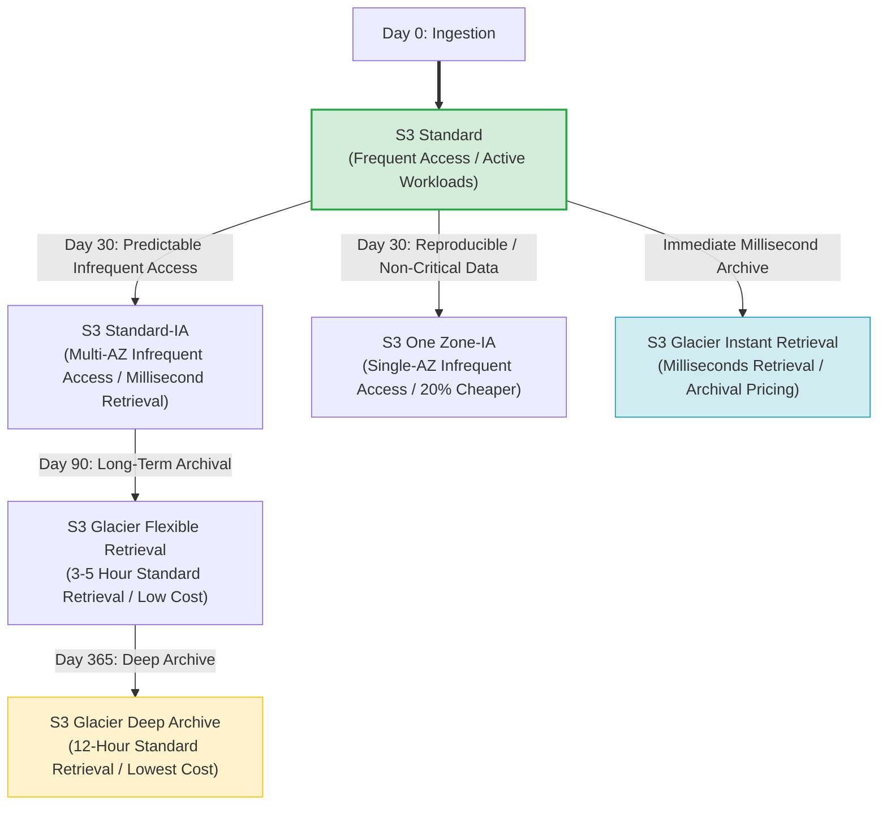
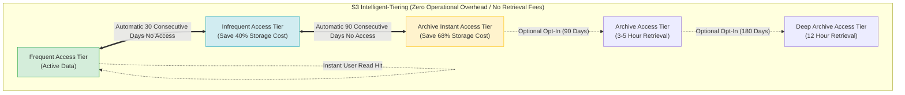
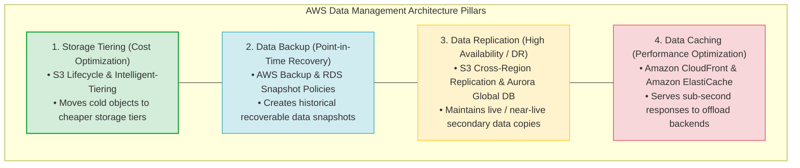
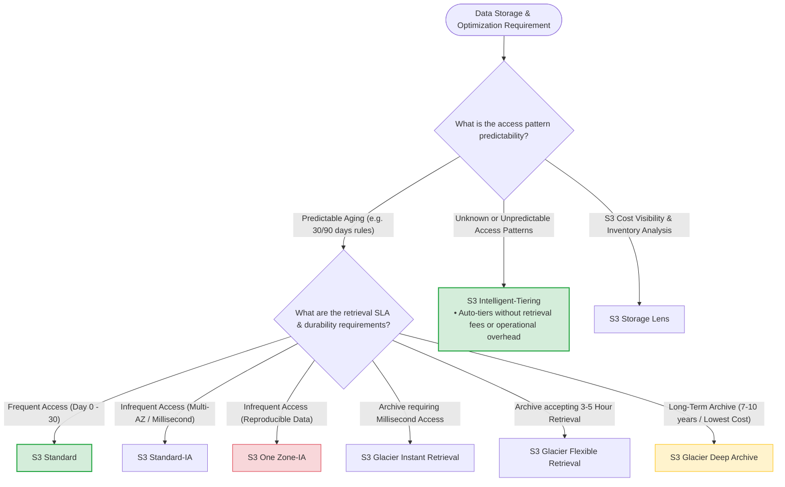

# Task 2.6: Determine a Cost Optimization Strategy — Storage Tiering

> [!NOTE]
> **Exam Mindset**: For the AWS Solutions Architect Professional (SAP-C02) and AI Practitioner (AIP-C01) exams, storage tiering is driven by a core financial rule:
> **"Do not pay hot-storage prices for cold data."**
> Match storage cost directly to **access frequency**, **retrieval SLA**, **durability requirements**, and **data lifecycle predictable aging**.

---

## 1. Amazon S3 Automated Lifecycle Tiering Spectrum



---

## 2. Amazon S3 Storage Classes Feature Breakdown

| Storage Class | Access Pattern | Retrieval SLA | Minimum Storage Duration | Primary Exam Purpose |
| :--- | :--- | :--- | :--- | :--- |
| **S3 Standard** | Frequent | Milliseconds | None | Active application data & frequent access |
| **S3 Intelligent-Tiering**| Unknown / Changing | Milliseconds | None | Automatic cost optimization without operational overhead |
| **S3 Standard-IA** | Infrequent | Milliseconds | 30 Days | Infrequently accessed data needing instant retrieval |
| **S3 One Zone-IA** | Infrequent (Replaceable)| Milliseconds | 30 Days | Non-critical or reproducible data ($20\%$ cost savings) |
| **Glacier Instant** | Archive (Infrequent) | Milliseconds | 90 Days | Long-term archive requiring millisecond access |
| **Glacier Flexible**| Archive | 1 min – 12 hours| 90 Days | Occasional archive retrieval (3-5 hr standard) |
| **Glacier Deep Archive**| Long-Term Archive | 12 – 48 hours | 180 Days | **Lowest cost storage in AWS** (7-10 yr regulatory retention)|

---

## 3. S3 Intelligent-Tiering Mechanics



> [!IMPORTANT]
> **Predictable vs. Unknown Access Rule**:
> - **Predictable Access Aging** (*"Move to IA after 30 days, Glacier after 90 days"*) $\longrightarrow$ Use **S3 Lifecycle Rules**.
> - **Unknown or Changing Access Patterns** (*"Optimize storage cost without operational overhead or knowing which objects users access"*) $\longrightarrow$ Use **S3 Intelligent-Tiering**.

---

## 4. Architectural Distinctions: Tiering vs. Backup vs. Replication vs. Caching



---

## 5. Storage Visibility: S3 Storage Lens

> [!TIP]
> **S3 Storage Lens**: Provides organization-wide visibility into S3 storage metrics, activity, and cost optimization recommendations (e.g. identifying buckets eligible for lifecycle rules). It does *not* perform automatic transitions itself.

---

## 6. SAP-C02 Master Storage Tiering Selection & Decision Engine



---

## 7. SAP-C02 Exam Keyword Cheat Sheet

```
"Predictable object aging (e.g. 30 days / 90 days)" ──> S3 Lifecycle Policy
"Unknown or changing access patterns"              ──> S3 Intelligent-Tiering
"Reproducible secondary data / Lowest IA cost"      ──> S3 One Zone-IA
"Long-term regulatory archive (7-10 years)"         ──> S3 Glacier Deep Archive (Lowest cost)
"Archive data requiring millisecond retrieval"      ──> S3 Glacier Instant Retrieval
"Analyze organization-wide S3 storage & waste"     ──> S3 Storage Lens
"Centralized policy-based backup across AWS"       ──> AWS Backup
"Cross-Region disaster recovery copy"              ──> S3 Cross-Region Replication (CRR)
```

---

## 8. Common SAP-C02 Exam Traps

1. **Trap 1: Selecting Glacier Deep Archive for High-Frequency Retrieval**: Glacier Deep Archive has the lowest storage price, but high retrieval fees and 12-hour SLAs. High-frequency retrieval will break application SLAs and increase total cost.
2. **Trap 2: Using S3 One Zone-IA for Critical Non-Reproducible Data**: One Zone-IA stores data in a single AZ. If that AZ fails, data is unavailable. Use One Zone-IA only for *easily reproducible data* (e.g., generated thumbnails).
3. **Trap 3: Confusing Storage Tiering with Performance Caching**: Storage tiering reduces *storage cost for cold data*. Performance caching (CloudFront / ElastiCache) reduces *latency for hot data*.
4. **Trap 4: Using Replication for Cost Optimization**: S3 Cross-Region Replication duplicates storage in another Region, doubling storage costs. Use tiering to reduce cost.

---

## 9. Final Mental Model

`Predictable Aging ➔ S3 Lifecycle | Unknown Pattern ➔ Intelligent-Tiering | Long-Term Cold ➔ Glacier Deep Archive | Reproducible ➔ One Zone-IA`