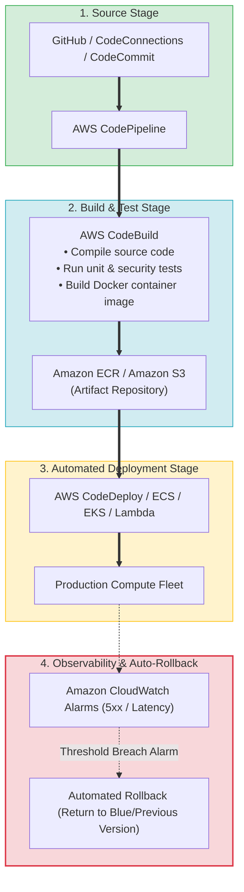
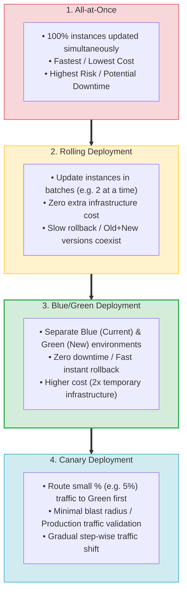
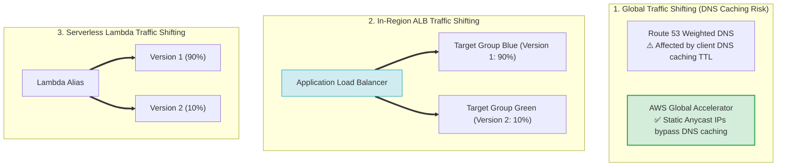
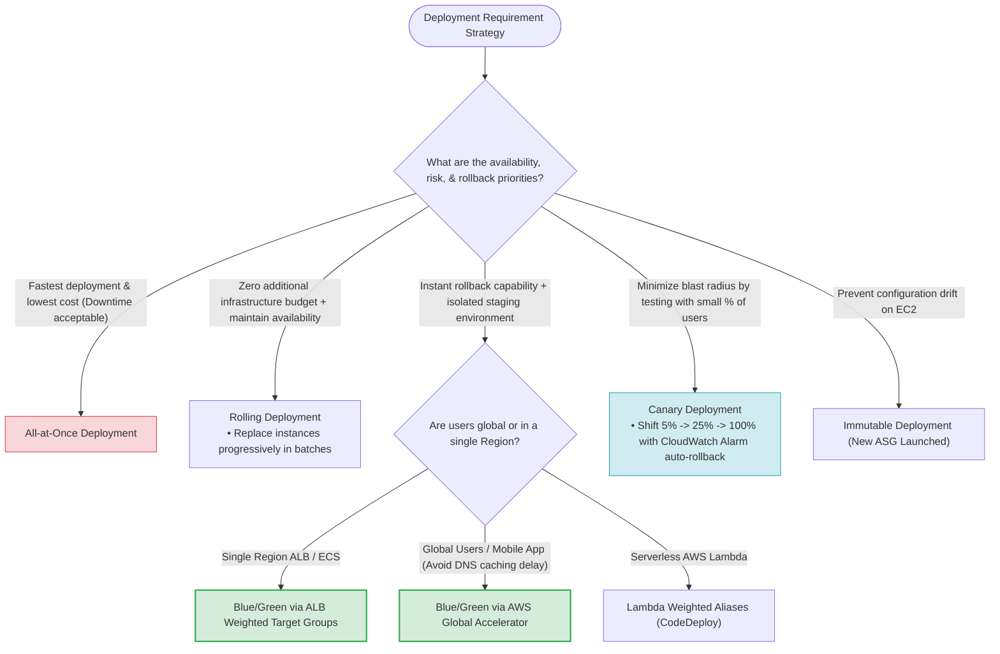

# Task 3.1: Determine a Strategy to Improve Operational Excellence — CI/CD Pipelines and Deployment Strategies

> [!NOTE]
> **Exam Mindset**: For the AWS Solutions Architect Professional (SAP-C02) and AI Practitioner (AIP-C01) exams, CI/CD is evaluated as a controlled, automated pipeline moving code safely into production:
> **Code** $\rightarrow$ **Build** $\rightarrow$ **Test** $\rightarrow$ **Deploy** $\rightarrow$ **Validate** $\rightarrow$ **Monitor** $\rightarrow$ **Auto-Rollback**.
> Always select deployment strategies based on:
> **Availability SLAs** $\rightarrow$ **Rollback Speed** $\rightarrow$ **Blast Radius Tolerance** $\rightarrow$ **Infrastructure Cost** $\rightarrow$ **DNS Caching Limitations**.

---

## 1. End-to-End AWS Native CI/CD Pipeline Architecture



---

## 2. Core Deployment Strategies Comparison Matrix

| Strategy | Availability Impact | Rollback Speed | Extra Infrastructure Cost | Blast Radius | Key Exam Keyword Trigger |
| :--- | :--- | :--- | :--- | :--- | :--- |
| **All-at-Once** | Potential Downtime | Slow (Re-deploy old build)| **Zero ($0$)** | **High** ($100\%$ fleet) | *"Fastest deployment / Lowest cost / Downtime acceptable"* |
| **Rolling** | High Availability | Moderate | **Zero ($0$)** (In-place) | **Medium** (Batch size) | *"Gradually replace instances / Zero extra capacity cost"* |
| **Blue/Green** | **Zero Downtime** | **Instant** (Switch traffic) | **High** ($2\times$ environment)| **Low** (Pre-tested Green) | *"Fastest rollback / Test new version before traffic switch"* |
| **Canary** | **Zero Downtime** | **Fast** (Revert % shift) | Low to Medium | **Lowest** (Small % users) | *"Small percentage of users / Minimize blast radius"* |
| **Immutable** | **Zero Downtime** | Fast (Terminate new ASG)| Medium ($1\times$ temporary ASG)| Low | *"Prevent configuration drift / New fresh instances"* |

---

## 3. Deployment Strategies Spectrum (Risk vs. Cost vs. Speed vs. Rollback)



---

## 4. Traffic Shifting Mechanics: Route 53 vs. Global Accelerator vs. ALB vs. Lambda



> [!IMPORTANT]
> **DNS Caching vs. Global Accelerator Rule**:
> - **Route 53 Weighted Routing**: Subject to **client & ISP DNS caching TTLs** (mobile clients often ignore low TTLs).
> - **AWS Global Accelerator**: Uses **static Anycast IPs** to route traffic over the AWS global network, enabling **instant traffic shifting** without DNS propagation delay.
> - **ALB Weighted Target Groups**: Enables **in-Region HTTP/HTTPS weighted traffic splits** between Blue & Green target groups.

---

## 5. Database Schema Changes in Blue/Green Deployments

> [!WARNING]
> **The Expand-Migrate-Contract Pattern for Databases**:
> In Blue/Green deployments, both Blue and Green application versions often connect to the **same database**. Destructive schema changes (e.g. deleting a column) will break Blue if instant rollback is required.
> Always implement **backward-compatible database schema changes**:
> 1. **Expand**: Add new columns/tables (supports both V1 and V2).
> 2. **Migrate**: Deploy V2 application and migrate data.
> 3. **Contract**: Remove old columns only after V2 is fully stable and rollback is no longer required.

---

## 6. SAP-C02 Deployment Strategy Master Selection Decision Engine



---

## 7. SAP-C02 Exam Keyword Cheat Sheet

```
"Deploy to all instances simultaneously / Lowest cost"  ──> All-at-Once Deployment
"Gradually replace instances in batches / Maintain HA" ──> Rolling Deployment
"Two identical environments / Instant rollback"         ──> Blue/Green Deployment
"Small percentage of production users / Minimal blast"  ──> Canary Deployment
"Global users + mobile clients + bypass DNS caching"   ──> AWS Global Accelerator
"Weighted HTTP traffic shifting in same Region"        ──> ALB Weighted Target Groups
"Shift percentage traffic between Lambda versions"      ──> Lambda Weighted Aliases
"Compile code & run unit tests without build servers"   ──> AWS CodeBuild
"Pipeline stage orchestration & approval gates"        ──> AWS CodePipeline
"Automate EC2/ECS/Lambda deployment execution"          ──> AWS CodeDeploy
"Automated rollback on error metrics"                  ──> CodeDeploy + CloudWatch Alarm Integration
"Prevent EC2 configuration drift during deploy"        ──> Immutable Deployment
```

---

## 8. Common SAP-C02 Exam Traps

1. **Trap 1: Selecting Route 53 for Mobile App Blue/Green Traffic Shifting**: Mobile OSs heavily cache DNS responses. If rapid traffic shifting or instant rollback is required for mobile clients, choose **AWS Global Accelerator** or **ALB Weighted Target Groups**.
2. **Trap 2: Destructive Database Migrations in Blue/Green**: Dropping database columns during Green deployment breaks Blue during rollback. Use **backward-compatible schema migrations (Expand-Migrate-Contract)**.
3. **Trap 3: Using Jenkins for AWS-Native Pipeline when Minimal Ops is Requested**: Operating self-managed Jenkins servers requires patching and scaling. For minimal operational overhead, select **AWS CodePipeline + AWS CodeBuild**.
4. **Trap 4: Confusing Continuous Delivery with Continuous Deployment**: Continuous *Delivery* includes a manual approval gate before production; Continuous *Deployment* automatically deploys every passed build to production.

---

## 9. Final Mental Model

`All-at-Once (Fast/Cheapest/Risk) ➔ Rolling (Batches/Zero Extra Cost) ➔ Blue/Green (Isolated/Instant Rollback) ➔ Canary (Minimal Blast Radius) ➔ Global Accelerator (Bypass DNS Caching)`