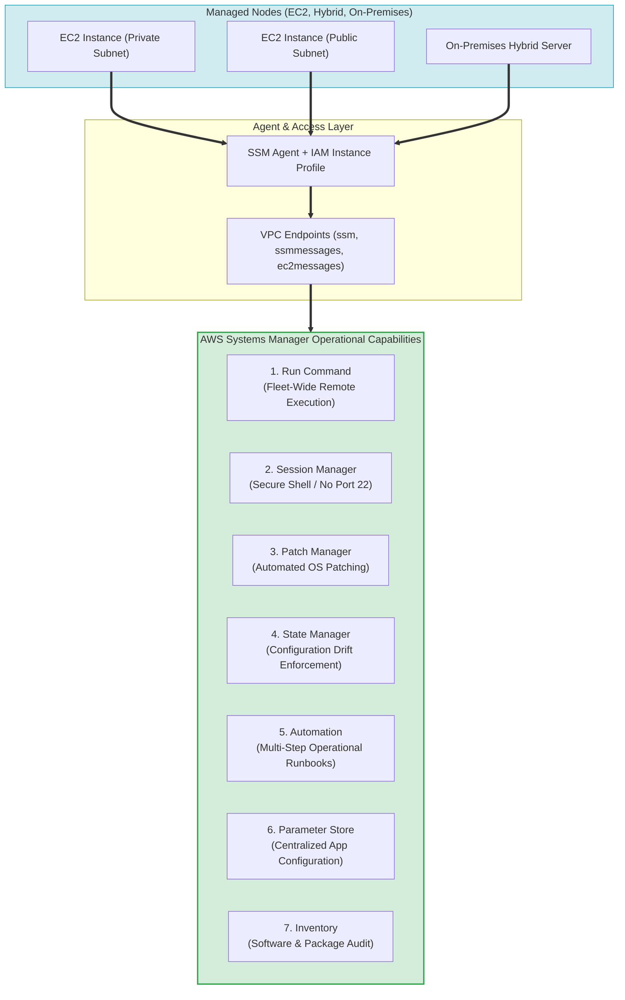
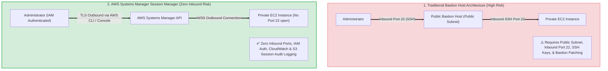
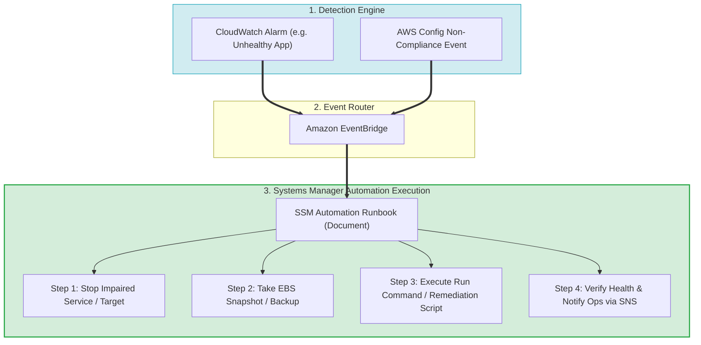
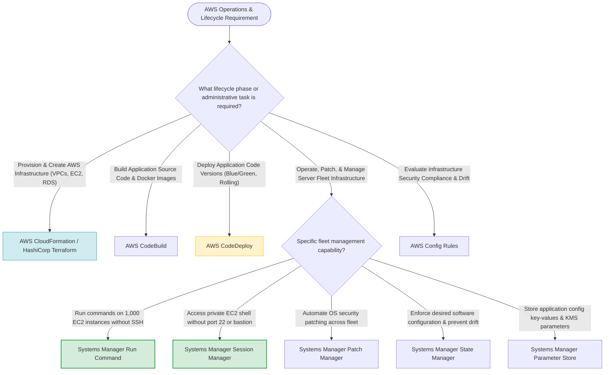

# Task 3.1: Determine a Strategy to Improve Operational Excellence — Configuration Management Tools

> [!NOTE]
> **Exam Mindset**: For the AWS Solutions Architect Professional (SAP-C02) and AI Practitioner (AIP-C01) exams, **AWS Systems Manager** is the foundational operational control plane for managing, operating, patching, and auditing EC2 fleets and hybrid infrastructure.
> Systems Manager answers:
> **"How do I centrally manage, configure, patch, inspect, and operate a large fleet of servers without manually logging into each server or opening inbound SSH ports?"**

---

## 1. Systems Manager Core Architecture & Fleet Operations Hub



---

## 2. Systems Manager Capabilities Breakdown Matrix

| SSM Capability | Operational Purpose | Primary Benefits | Key Exam Keyword Trigger |
| :--- | :--- | :--- | :--- |
| **Run Command** | Execute scripts/commands across fleet without SSH | Zero SSH login, rate control, audit logging | *"Run commands remotely across 1,000 EC2 instances"* |
| **Session Manager** | Secure shell access without inbound SSH/RDP ports | No Port 22, no bastion hosts, IAM controlled | *"Secure interactive access to private EC2 without SSH keys/port 22"* |
| **Patch Manager** | Automate OS security patching & compliance | Baseline patching, Maintenance Windows | *"Automate OS security updates across server fleet"* |
| **State Manager** | Maintain desired configuration & prevent drift | Continuous enforcement of software state | *"Enforce desired configuration & repair configuration drift"* |
| **Automation** | Multi-step operational runbook execution | Automated incident response & remediation | *"Automate multi-step operational runbooks without human error"* |
| **Parameter Store** | Centralized hierarchical configuration management | KMS encryption, hierarchy, IAM access | *"Store application parameters & database connection strings"* |
| **Inventory** | Collect software, package, & OS metadata | Fleet-wide visibility & vulnerability audit | *"Audit installed software packages & OS versions across fleet"* |

---

## 3. Session Manager vs. Traditional Bastion Host Architecture



> [!IMPORTANT]
> **Bastion Host Replacement Rule**:
> For SAP-C02, **Systems Manager Session Manager** is almost always preferred over traditional Bastion Hosts or Jump Boxes because it **eliminates inbound Port 22**, removes SSH key management, supports IAM authentication, and logs all session command output to **Amazon S3** or **CloudWatch Logs**.

---

## 4. Automated Self-Healing & Event-Driven Remediation Stack



---

## 5. Parameter Store vs. AWS Secrets Manager

| Feature | Systems Manager Parameter Store | AWS Secrets Manager |
| :--- | :--- | :--- |
| **Primary Focus** | General configuration key-values, URLs, parameters | Passwords, API tokens, database credentials |
| **Secret Rotation** | No automatic native rotation | **Native automatic rotation via Lambda (e.g. RDS DB credentials)** |
| **Cost Structure** | Standard parameters are **Free** | Monthly fee per secret + API call charges |
| **KMS Encryption** | Supported (`SecureString`) | Supported (Mandatory encryption) |

> [!TIP]
> **Parameter Store vs Secrets Manager Selection**:
> - **Configuration Parameters / Environment Strings** $\rightarrow$ Use **Parameter Store** (Simple & Free).
> - **Database Passwords / Automatic Secret Rotation** $\rightarrow$ Use **AWS Secrets Manager**.

---

## 6. AWS Operational & Lifecycle Service Boundaries Matrix

| Operations Phase | Primary AWS Service | Scope of Responsibility |
| :--- | :--- | :--- |
| **Infrastructure Provisioning** | **AWS CloudFormation / Terraform** | Provision VPCs, Subnets, EC2, RDS, ALB |
| **Application Build** | **AWS CodeBuild** | Compile code, run unit tests, build Docker containers |
| **Application Deployment** | **AWS CodeDeploy** | Execute Blue/Green or Rolling application version updates |
| **CI/CD Pipeline Orchestration** | **AWS CodePipeline** | Orchestrate build, test, approval, and deployment stages |
| **Fleet Operations & Patching** | **AWS Systems Manager** | Patch OS, execute remote commands, enforce node state |
| **Compliance Auditing** | **AWS Config** | Audit resource configuration history & compliance rules |
| **Observability & Alerting** | **Amazon CloudWatch** | Ingest metrics, logs, alarms, & operational dashboards |

---

## 7. SAP-C02 Lifecycle Tooling & Systems Manager Decision Engine



---

## 8. SAP-C02 Exam Keyword Cheat Sheet

```
"Run commands remotely across fleet without SSH"   ──> Systems Manager Run Command
"Access private EC2 without SSH keys or port 22"  ──> Systems Manager Session Manager
"Automate OS patching across EC2 fleet"           ──> Systems Manager Patch Manager
"Maintain desired state & repair config drift"    ──> Systems Manager State Manager
"Automate multi-step operational runbooks"        ──> Systems Manager Automation
"Centralized app config & SecureString parameters"──> Systems Manager Parameter Store
"Audit installed software packages & OS versions" ──> Systems Manager Inventory
"Automatic database password rotation"             ──> AWS Secrets Manager
"Private subnet EC2 to SSM without Internet/NAT"  ──> VPC Interface Endpoints (ssm, ssmmessages)
```

---

## 9. Common SAP-C02 Exam Traps

1. **Trap 1: Choosing Systems Manager for Application Code Deployment**: Systems Manager is for operational server management. For application version deployments (Blue/Green, Rolling), choose **AWS CodeDeploy**.
2. **Trap 2: Choosing Parameter Store for Automatic Database Credential Rotation**: Parameter Store stores configuration strings but does not rotate credentials. For automatic RDS password rotation, choose **AWS Secrets Manager**.
3. **Trap 3: Opening Inbound Port 22 for EC2 Fleet Management**: Opening Port 22 or deploying Bastion Hosts adds security risks and operational maintenance. Use **Session Manager** (requires zero inbound ports).
4. **Trap 4: Forgetting SSM VPC Endpoint Requirements in Private Subnets**: For EC2 instances in private subnets without Internet or NAT Gateways to communicate with Systems Manager, deploy **VPC Interface Endpoints** (`ssm`, `ssmmessages`, `ec2messages`).

---

## 10. Final Mental Model

`Provision (CloudFormation) ➔ Deploy App (CodeDeploy) ➔ Manage Fleet & Patch (Systems Manager) ➔ Secure Shell (Session Manager) ➔ Audit Compliance (Config)`