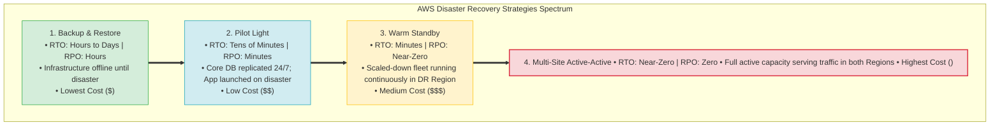
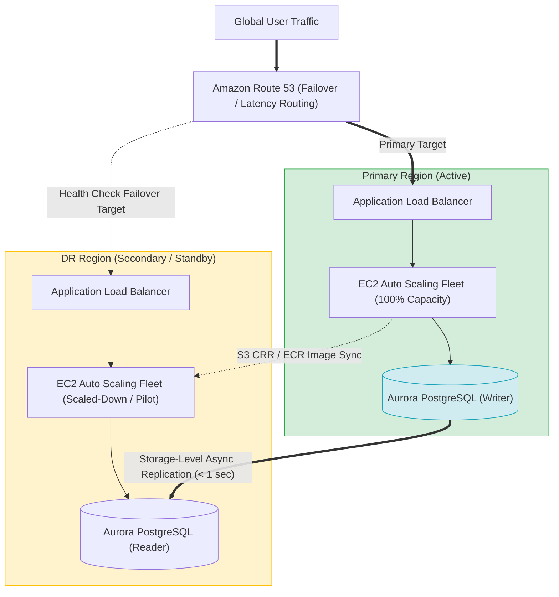
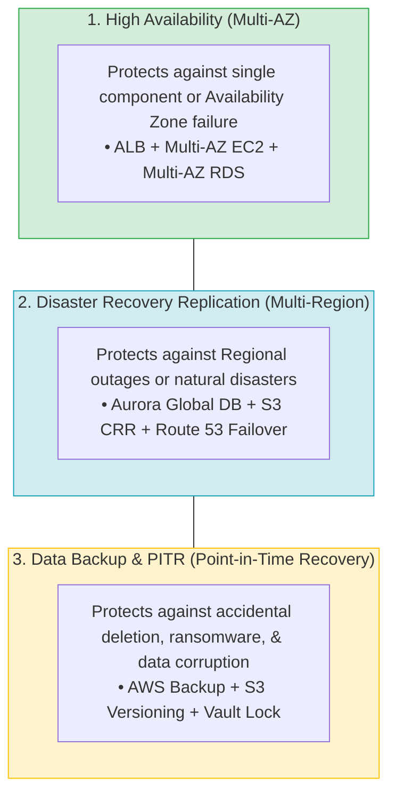
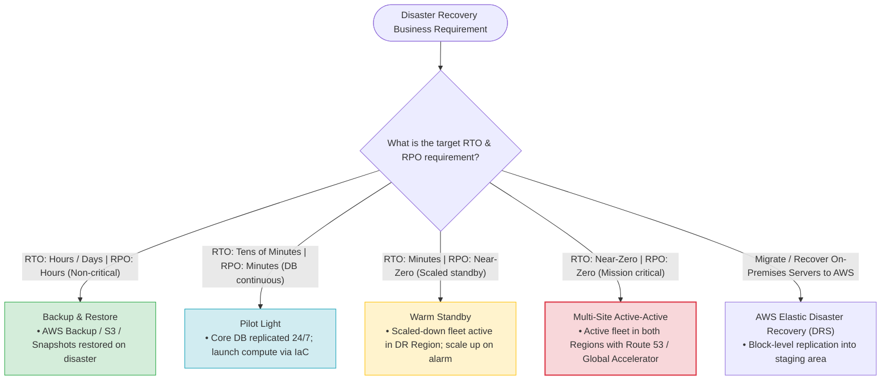

# Task 3.1: Determine a Strategy to Improve Operational Excellence — Disaster Recovery Planning

> [!NOTE]
> **Exam Mindset**: For the AWS Solutions Architect Professional (SAP-C02) and AI Practitioner (AIP-C01) exams, Disaster Recovery (DR) planning assumes failure **will** happen.
> Always evaluate DR architectures along four essential business metrics:
> **Recovery Time Objective (RTO)** $\rightarrow$ **Recovery Point Objective (RPO)** $\rightarrow$ **Failure Scope (AZ vs. Region vs. Corruption)** $\rightarrow$ **Total Cost & Operational Overhead**.

---

## 1. Disaster Recovery Strategies Spectrum (RTO/RPO vs. Cost)



---

## 2. Disaster Recovery Strategies Comprehensive Comparison Table

| DR Strategy | Target RTO | Target RPO | DR Infrastructure Status | Cost Level | Operational Complexity | Key Exam Keyword Trigger |
| :--- | :--- | :--- | :--- | :--- | :--- | :--- |
| **Backup & Restore** | Hours to Days | Hours | Offline (Created on demand via IaC) | **Lowest** | Low | *"Lowest cost / Hours of downtime acceptable"* |
| **Pilot Light** | Tens of Mins | Minutes | Core DB Replicated 24/7; Minimal App | **Low** | Medium | *"Critical database replicated / Minimal infrastructure"* |
| **Warm Standby** | Minutes | Near-Zero | Scaled-Down Fleet Active 24/7 | **Medium** | Medium-High | *"Scaled-down environment running continuously"* |
| **Multi-Site Active-Active**| Near-Zero | Zero | Full Active Capacity in Both Regions | **Highest** | **Highest** | *"Near-zero RTO / Both Regions serving traffic"* |

---

## 3. Complete Multi-Region Disaster Recovery Architecture Stack



---

## 4. Architectural Distinctions: High Availability vs. DR Replication vs. Backup



> [!IMPORTANT]
> **Replication $\neq$ Backup**:
> - **Cross-Region Replication** (Aurora Global DB / S3 CRR) protects against **hardware & Regional outages**. However, if data is accidentally deleted or corrupted, the deletion instantly replicates to the DR Region.
> - **Point-in-Time Backups & Versioning** (AWS Backup / S3 Versioning) protect against **accidental deletion, ransomware, and human error**.

---

## 5. Key AWS Services Associated with Disaster Recovery

| Service | Primary DR Role | Primary Exam Keyword Trigger |
| :--- | :--- | :--- |
| **AWS Elastic Disaster Recovery (DRS)** | Block-level server replication into AWS | *"Recover existing on-premises or cloud servers in AWS"* |
| **AWS Backup** | Policy-based centralized backup & vault locking | *"Centralized cross-account / cross-Region backup policies"* |
| **Amazon Aurora Global Database** | Storage-level database cross-Region replication | *"MySQL/PostgreSQL + low RPO (<1 sec) + fast regional failover"* |
| **Amazon DynamoDB Global Tables** | Multi-Region active-active NoSQL replication | *"NoSQL + active-active multi-Region writes & local reads"* |
| **S3 Cross-Region Replication (CRR)** | Asynchronous object replication across Regions | *"Cross-Region object compliance & disaster recovery copy"* |
| **AWS CloudFormation / Terraform** | Infrastructure as Code (IaC) template execution | *"Recreate infrastructure consistently during DR"* |
| **AWS Fault Injection Service (FIS)** | Chaos engineering & resilience testing | *"Inject failures into application to test resilience"* |

---

## 6. SAP-C02 Disaster Recovery Strategy Master Selection Decision Engine



---

## 7. SAP-C02 Exam Keyword Cheat Sheet

```
"Lowest cost DR / Hours of downtime acceptable"     ──> Backup and Restore
"Critical database continuously replicated"         ──> Pilot Light
"Scaled-down environment running continuously in DR" ──> Warm Standby
"Near-zero RTO / Both Regions serving traffic"       ──> Multi-Site Active-Active
"Block-level continuous replication of servers"     ──> AWS Elastic Disaster Recovery (DRS)
"Low latency cross-Region relational database"       ──> Amazon Aurora Global Database
"Active-active multi-Region NoSQL database"          ──> Amazon DynamoDB Global Tables
"Recreate infrastructure consistently during failure" ──> CloudFormation / Terraform (IaC)
"Test system resilience by injecting failures"       ──> AWS Fault Injection Service (FIS)
```

---

## 8. Common SAP-C02 Exam Traps

1. **Trap 1: Over-Engineering DR Beyond Business Requirements**: If the business SLA allows 24 hours RTO, selecting Multi-Site Active-Active adds massive unnecessary infrastructure costs. Choose the **least expensive architecture** that meets the stated RTO/RPO.
2. **Trap 2: Forgetting Non-Database Application Dependencies**: Replicating only the database leaves DR incomplete. Ensure **ECR container images**, **AMI snapshots**, **Secrets Manager secrets**, and **CloudFormation templates** are synced to the DR Region.
3. **Trap 3: Relying Solely on Replication for Ransomware / Deletion Protection**: Asynchronous replication copies accidental file deletions or corruption immediately. Always combine replication with **AWS Backup / S3 Point-in-Time Recovery**.
4. **Trap 4: Relying on Manual Steps During Regional Failover**: Manual infrastructure provisioning during a disaster leads to errors and missed RTOs. Always automate infrastructure deployment using **Infrastructure as Code (IaC)**.

---

## 9. Final Mental Model

`Identify RTO/RPO ➔ Select Strategy (Backup/Pilot Light/Warm Standby/Active-Active) ➔ Replicate All Layers (DB + S3 + Containers + IaC) ➔ Automate Failover (Route 53) ➔ Test Regularly (FIS)`