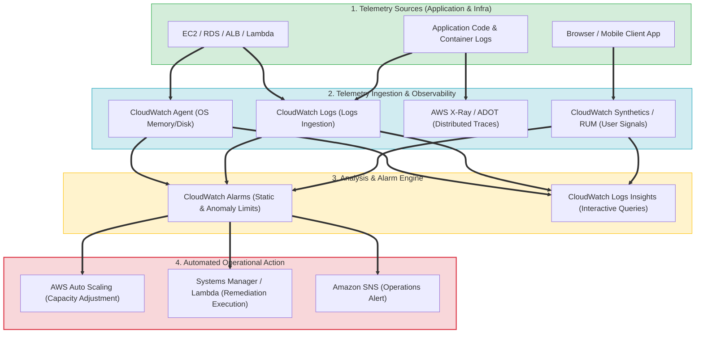
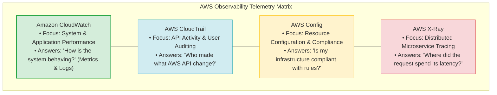
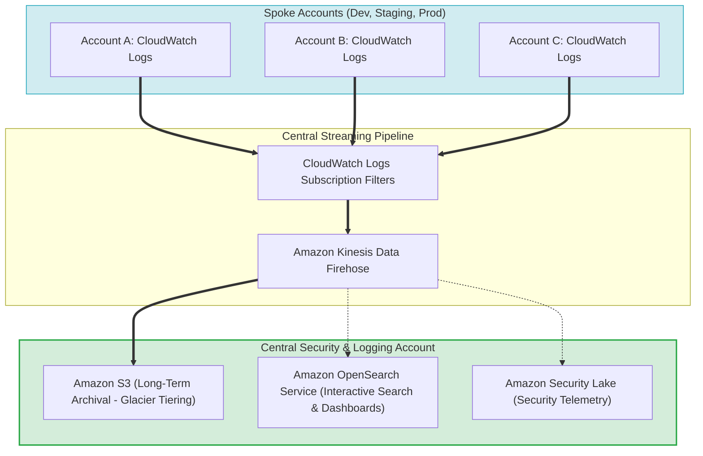
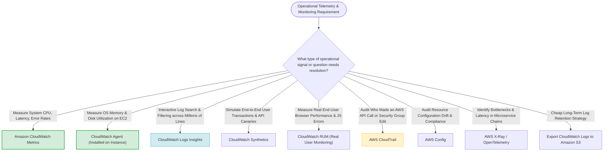

# Task 3.1: Determine a Strategy to Improve Operational Excellence — Monitoring and Logging Solutions

> [!NOTE]
> **Exam Mindset**: For the AWS Solutions Architect Professional (SAP-C02) and AI Practitioner (AIP-C01) exams, monitoring and logging form the core operational feedback loop:
> **Signal Ingestion** $\rightarrow$ **Metric Measurement** $\rightarrow$ **Threshold Alarm** $\rightarrow$ **Automated Remediation** $\rightarrow$ **Log/Trace Investigation** $\rightarrow$ **Recovery Verification**.

---

## 1. The AWS Full-Stack Observability & Feedback Loop Pipeline



---

## 2. Core Telemetry Pillars: Metrics vs. Logs vs. Traces vs. Audit

| Telemetry Pillar | Primary Operational Question | Key AWS Telemetry Service | Primary Exam Purpose |
| :--- | :--- | :--- | :--- |
| **Metrics** | *"How much / how often?"* (Numerical time-series) | **Amazon CloudWatch Metrics** | System performance, Auto Scaling, Alarms |
| **Logs** | *"What happened?"* (Text / JSON event lines) | **Amazon CloudWatch Logs** | Root-cause analysis, metric filters, Insights |
| **Traces** | *"Where did request latency spend time?"* | **AWS X-Ray / OpenTelemetry (ADOT)** | Microservices & distributed API bottleneck isolation |
| **Audit Trails** | *"Who made what AWS API call & when?"* | **AWS CloudTrail** | Security auditing, governance, user actions |
| **Config Audit** | *"Is resource configuration compliant?"* | **AWS Config** | Resource configuration drift & compliance rules |

---

## 3. Telemetry Quadrant: CloudWatch vs. CloudTrail vs. AWS Config vs. AWS X-Ray



> [!IMPORTANT]
> **EC2 Memory & Disk Metrics Rule**:
> EC2 default hypervisor metrics do **not** collect guest OS memory utilization or disk space usage. To collect EC2 **MemoryUtilization** and **DiskSpaceUtilization**, you **must** install and configure the **CloudWatch Agent**.

---

## 4. User Telemetry: CloudWatch Synthetics vs. CloudWatch RUM

| Monitoring Tool | Telemetry Source | Primary Function | Key Exam Keyword Trigger |
| :--- | :--- | :--- | :--- |
| **CloudWatch Synthetics** | Synthetic Canaries (Simulated Traffic) | Proactively tests endpoints & multi-step UI flows 24/7 | *"Simulate customer transactions / Proactively test endpoint"* |
| **CloudWatch RUM** | Real Users (Client-Side JS Telemetry) | Measures actual user experience, page load times, & JS errors | *"Real user experience / Client-side browser performance"* |
| **Container Insights** | ECS / EKS Container Clusters | Collects container-level metrics, CPU, memory, & cluster health | *"ECS or EKS container-level metrics & cluster observability"* |

---

## 5. Enterprise Multi-Account Centralized Logging Architecture



> [!TIP]
> **Cost-Effective Log Lifecycle**:
> Keeping high-volume logs in **CloudWatch Logs** indefinitely is expensive. Retain hot operational logs in CloudWatch Logs for **7 to 30 days**, then export/stream via **Kinesis Data Firehose** to **Amazon S3** for cheap long-term archival and lifecycle transition to Glacier.

---

## 6. SAP-C02 Telemetry & Observability Master Selection Decision Engine



---

## 7. SAP-C02 Exam Keyword Cheat Sheet

```
"Monitor EC2 memory utilization & disk space"   ──> CloudWatch Agent (Installed on instance)
"Query & search millions of log lines with SQL"──> CloudWatch Logs Insights
"Proactively simulate user login & checkout"     ──> CloudWatch Synthetics (Canaries)
"Measure actual end-user browser page load"     ──> CloudWatch RUM (Real User Monitoring)
"Identify latency bottlenecks in microservices" ──> AWS X-Ray / OpenTelemetry (ADOT)
"Audit API calls & find who deleted an S3 bucket"──> AWS CloudTrail
"Audit infrastructure security group compliance" ──> AWS Config Rules
"Centralize logs across multiple AWS accounts"  ──> CloudWatch Subscription Filters + Kinesis Firehose + S3
"Cheap long-term log retention"                 ──> Export CloudWatch Logs to Amazon S3
```

---

## 8. Common SAP-C02 Exam Traps

1. **Trap 1: Choosing Default CloudWatch Metrics for Memory Sizing**: Default EC2 hypervisor metrics do **not** record RAM or Disk usage. You must install the **CloudWatch Agent**.
2. **Trap 2: Using CloudTrail to Measure Performance Latency**: CloudTrail audits API calls (*who did what*). To measure performance latency or request execution times, use **CloudWatch Metrics** or **AWS X-Ray**.
3. **Trap 3: Retaining All Logs in CloudWatch Logs Indefinitely**: Keeping raw logs in CloudWatch Logs for years is expensive. Set log group retention policies (e.g. 30 days) and stream logs to **Amazon S3** for cheap long-term archival.
4. **Trap 4: Confusing CloudWatch Synthetics with CloudWatch RUM**: Synthetics uses **simulated synthetic canaries** (runs on schedule even with zero traffic); RUM measures **real user browser telemetry** generated by actual visitors.

---

## 9. Final Mental Model

`CloudWatch = System Performance | CloudTrail = API User Auditing | Config = Compliance Drift | X-Ray = Microservice Latency | Synthetics = Canaries | Agent = Memory/Disk`