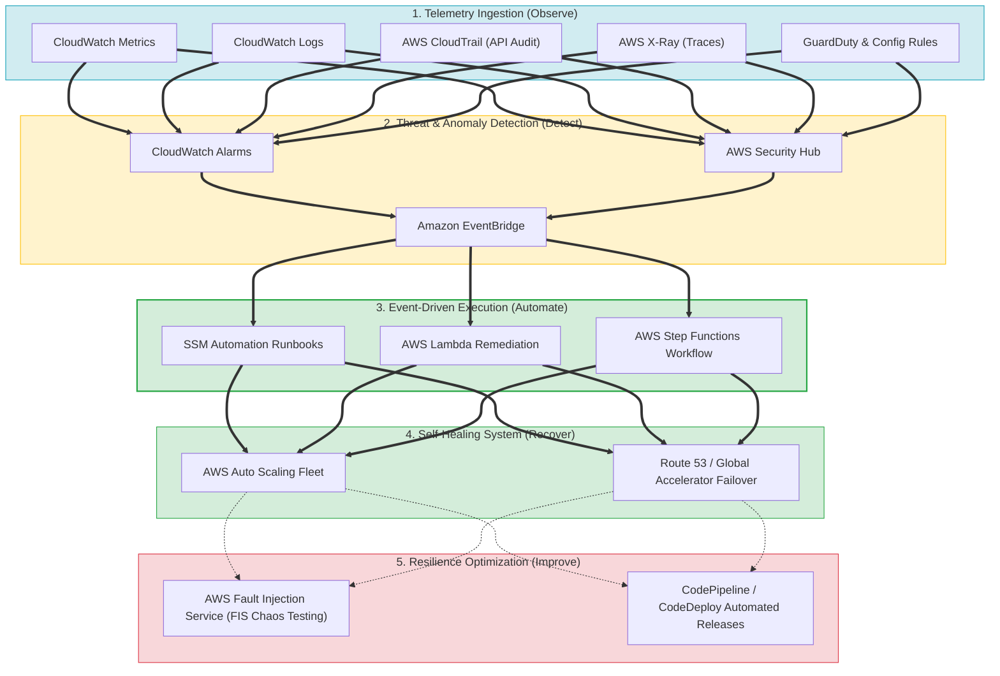
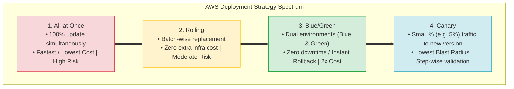
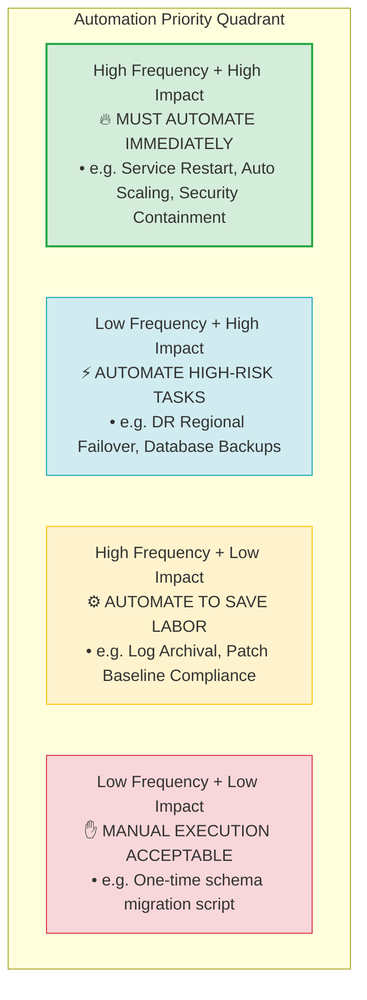
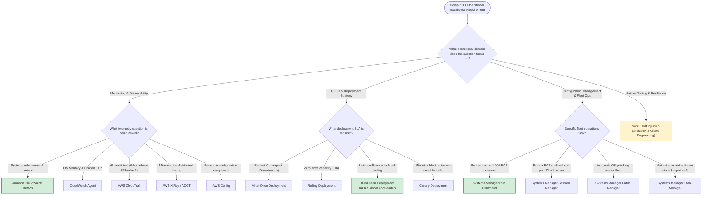

# Task 3.1: Determine a Strategy to Improve Operational Excellence — Skills Mastery

> [!NOTE]
> **Exam Mindset**: For the AWS Solutions Architect Professional (SAP-C02) and AI Practitioner (AIP-C01) exams, Domain 3.1 skills focus on recognizing the core operational problem in a scenario and selecting the simplest managed AWS solution.
> Master the 5-stage operational excellence mental model:
> **Observe** $\rightarrow$ **Detect** $\rightarrow$ **Automate** $\rightarrow$ **Recover** $\rightarrow$ **Improve**.

---

## 1. End-to-End Operational Excellence Pipeline (Observe $\rightarrow$ Detect $\rightarrow$ Automate $\rightarrow$ Recover $\rightarrow$ Improve)



---

## 2. Core Observability & Action Mapping Matrix

| Telemetry / Operational Domain | Operational Focus | Key AWS Service | Primary Exam Trigger Keyword |
| :--- | :--- | :--- | :--- |
| **Metrics Telemetry** | System performance & time-series data | **Amazon CloudWatch Metrics** | *"CPU utilization / Queue depth / Memory agent"* |
| **Logging & Search** | Application log lines & root cause search | **CloudWatch Logs / Insights** | *"Application logs / Search log lines with SQL"* |
| **API Security Audit** | AWS API calls & identity tracking | **AWS CloudTrail** | *"Who deleted the S3 bucket? / Security group edit"* |
| **Distributed Tracing** | Microservice latency bottleneck isolation | **AWS X-Ray / OpenTelemetry** | *"Trace request latency across Lambda $\rightarrow$ DynamoDB"* |
| **Config & Compliance** | Audit resource configuration drift | **AWS Config** | *"Identify non-compliant security groups / Drift"* |
| **Fleet Remote Execution** | Execute commands on 1,000 EC2s without SSH | **Systems Manager Run Command** | *"Run commands remotely across fleet without SSH"* |
| **Secure Instance Access** | Shell access without port 22 or bastions | **Systems Manager Session Manager** | *"Access private EC2 without SSH keys or port 22"* |
| **Controlled Fault Injection**| Chaos engineering & resilience testing | **AWS Fault Injection Service (FIS)** | *"Inject failures / Chaos engineering / Test resilience"* |

---

## 3. Deployment Strategies Spectrum & Blast Radius Control



> [!IMPORTANT]
> **Deployment Strategy Trade-off Matrix**:
> - **All-at-Once**: Fastest, zero extra cost, but **highest deployment risk** and potential downtime.
> - **Rolling**: Zero extra capacity cost, maintains availability, but **rollbacks take longer**.
> - **Blue/Green**: **Instant rollback** and pre-testing, but requires $2\times$ temporary capacity cost.
> - **Canary**: **Lowest blast radius** by testing small traffic percentages ($5\%\rightarrow 25\%\rightarrow 100\%$).

---

## 4. Automation Priority Matrix & Self-Healing Architecture



> [!TIP]
> **Event-Driven Remediation Stack**:
> Combine **CloudWatch Alarms / GuardDuty** $\rightarrow$ **Amazon EventBridge** $\rightarrow$ **AWS Systems Manager Automation / AWS Lambda** $\rightarrow$ **Amazon SNS** for automated self-healing without human intervention.

---

## 5. Failure Injection (Chaos Engineering) vs. Disaster Recovery Testing

| Concept | Purpose | Primary AWS Tool | Exam Trigger |
| :--- | :--- | :--- | :--- |
| **Failure Injection** | Controlled, deliberate failure injection in non-prod or canary to validate resilience | **AWS Fault Injection Service (FIS)** | *"Inject latency / terminate instances / chaos engineering"* |
| **Disaster Recovery Testing**| Full business continuity exercise verifying regional RTO & RPO SLAs | **Route 53 Failover + Backup Restore** | *"Test DR plan / measure RTO and RPO / regional failover"* |

---

## 6. Domain 3.1 Master Decision Engine & SAP Mental Model



---

## 7. SAP-C02 Exam Keyword Cheat Sheet

```
"Application logs & root-cause search"          ──> CloudWatch Logs / Insights
"Who modified a security group or deleted bucket"──> AWS CloudTrail
"Trace request latency across Lambda & DynamoDB" ──> AWS X-Ray / OpenTelemetry
"Resource configuration drift & compliance"      ──> AWS Config Rules
"Run commands on 1,000 EC2s without SSH"         ──> Systems Manager Run Command
"Private EC2 access without SSH keys or port 22"  ──> Systems Manager Session Manager
"Automated OS patching across EC2 fleet"         ──> Systems Manager Patch Manager
"Maintain desired software state & repair drift"  ──> Systems Manager State Manager
"Inject failures to test system resilience"      ──> AWS Fault Injection Service (FIS)
"Fastest & cheapest deployment (Downtime ok)"     ──> All-at-Once Deployment
"Zero extra capacity + maintain availability"    ──> Rolling Deployment
"Instant rollback + pre-tested Green stage"       ──> Blue/Green Deployment
"Small percentage of production users"           ──> Canary Deployment
```

---

## 8. Common SAP-C02 Exam Traps

1. **Trap 1: Confusing CloudWatch with CloudTrail for API Audit**: CloudWatch monitors operational performance metrics and log files; CloudTrail records *who* executed AWS API actions.
2. **Trap 2: Using Jenkins when AWS Native Managed Services are Preferred**: Self-managed Jenkins servers increase operational labor. When minimal overhead is requested, choose **AWS CodePipeline + CodeBuild + CodeDeploy**.
3. **Trap 3: Selecting Parameter Store for Automatic Password Rotation**: Parameter Store holds static configuration key-values. For automatic database password rotation, choose **AWS Secrets Manager**.
4. **Trap 4: Assuming HA Architecture Equals Tested Resilience**: Multi-AZ deployments do not guarantee operational recovery. Validate failure handling using **AWS Fault Injection Service (FIS)**.

---

## 9. Final Mental Model

`Observe (CloudWatch/CloudTrail/X-Ray) ➔ Detect (Alarms/Security Hub) ➔ Automate (EventBridge + SSM/Lambda) ➔ Recover (ASG/Route 53) ➔ Improve (FIS Chaos Testing)`